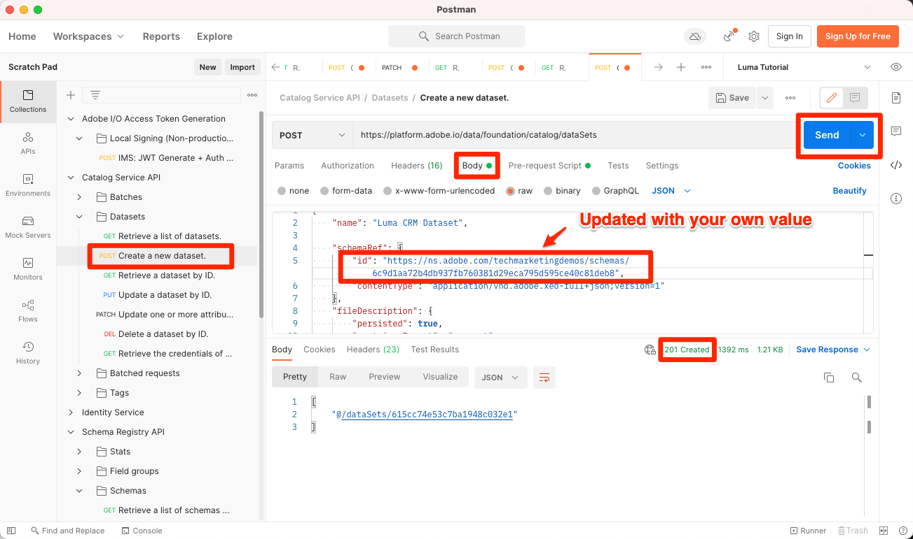

# Erstellen von Datensätzen

<!--15min-->

In dieser Lektion erstellen Sie Datensätze, die Ihre Daten empfangen. Sie werden begeistert davon sein, dass dies die kürzeste Lektion im Tutorial ist!

Alle Daten, die erfolgreich in Adobe Experience Platform aufgenommen wurden, werden im Data Lake als Datensätze persistiert. Ein Datensatz ist ein Konstrukt zur Datenspeicherung und -verwaltung, in dem Daten (in der Regel) in einer Tabelle erfasst werden, die ein Schema (Spalten) und Felder (Zeilen) beinhaltet. Datensätze enthalten auch Metadaten, die verschiedene Aspekte der in ihnen gespeicherten Daten beschreiben.

**Datenarchitekten** müssen Datensätze außerhalb dieses Tutorials erstellen.

Bevor Sie mit den Übungen beginnen, sehen Sie sich dieses kurze Video an, um mehr über Datensätze zu erfahren:
>[!VIDEO](https://video.tv.adobe.com/v/27269?quality=12&learn=on)

## Erforderliche Berechtigungen

Im [Berechtigungen konfigurieren](configure-permissions.md) Lektion erstellen Sie alle Zugriffssteuerungen, die zum Abschluss dieser Lektion erforderlich sind.

<!--
* Permission items **[!UICONTROL Data Management]** > **[!UICONTROL View Datasets]** and **[!UICONTROL Manage Datasets]**
* Permission item **[!UICONTROL Sandboxes]** > `Luma Tutorial`
* User-role access to the `Luma Tutorial Platform` product profile
* Developer-role access to the `Luma Tutorial Platform` product profile (for API)
-->

## Erstellen von Datensätzen in der Benutzeroberfläche

In dieser Übung erstellen wir Datensätze in der Benutzeroberfläche. Beginnen wir mit den Treuedaten:

1. Navigieren Sie zu **[!UICONTROL Datensätze]** im linken Navigationsbereich der Platform-Benutzeroberfläche
1. Wählen Sie die **[!UICONTROL Datensatz erstellen]** button
   

1. Wählen Sie im nächsten Bildschirm **Datensatz aus Schema erstellen**
1. Wählen Sie im nächsten Bildschirm Ihre `Luma Loyalty Schema` und wählen Sie dann die **[!UICONTROL Nächste]** button
   

1. Benennen Sie den Datensatz. `Luma Loyalty Dataset` und wählen Sie die **[!UICONTROL Beenden]** button
   
1. Wenn der Datensatz gespeichert wurde, gelangen Sie zu einem Bildschirm wie diesem:
   

Das ist alles! Ich habe dir ja gesagt, dass das schnell sein wird. Erstellen Sie diese anderen Datensätze wie folgt:

1. `Luma Offline Purchase Events Dataset` für Ihre `Luma Offline Purchase Events Schema`
1. `Luma Web Events Dataset` für Ihre `Luma Web Events Schema`
1. `Luma Product Catalog Dataset` für Ihre `Luma Product Catalog Schema`


## Datensatz mit API erstellen

Erstellen Sie nun die `Luma CRM Dataset` die API verwenden.

>[!NOTE]
>
>Wenn Sie die API-Übung überspringen und die `Luma CRM Dataset` in der Benutzeroberfläche ist das in Ordnung. Benennen Sie ihn `Luma CRM Dataset` und verwenden Sie `Luma CRM Schema`.

### Rufen Sie die ID des Schemas ab, das im Datensatz verwendet werden soll

Zuerst müssen wir die `$id` des `Luma CRM Schema`:

1. Öffnen [!DNL Postman]
1. Wenn Sie kein Zugriffstoken haben, öffnen Sie die Anfrage **[!DNL OAuth: Request Access Token]** und wählen Sie **Senden** , um ein neues Zugriffstoken anzufordern, genau wie Sie es in der [!DNL Postman] Lektion.
1. Anfrage öffnen **[!DNL Schema Registry API > Schemas > Retrieve a list of schemas within the specified container.]**
1. Wählen Sie die **Senden** button
1. Sie sollten eine 200-Antwort erhalten
1. Suchen Sie in der Antwort nach der `Luma CRM Schema` -Element und kopieren Sie die `$id` value
   

### Datensatz erstellen

Jetzt können Sie den Datensatz erstellen:

1. Download [Catalog Service API.postman_collection.json](https://raw.githubusercontent.com/adobe/experience-platform-postman-samples/master/apis/experience-platform/Catalog%20Service%20API.postman_collection.json) auf `Luma Tutorial Assets` Ordner.
1. Importieren Sie die Sammlung in [!DNL Postman]
1. Anforderung auswählen **[!DNL Catalog Service API > Datasets > Create a new dataset.]**
1. Fügen Sie Folgendes als **body** des Antrags, ***Ersetzen des ID-Werts durch Ihren eigenen***:

   ```json
   {
       "name": "Luma CRM Dataset",
   
       "schemaRef": {
           "id": "REPLACE_WITH_YOUR_OWN_ID",
           "contentType": "application/vnd.adobe.xed-full+json;version=1"
       },
       "fileDescription": {
           "persisted": true,
           "containerFormat": "parquet",
           "format": "parquet"
       }
   }
   ```

1. Wählen Sie die **Senden** button
1. Sie sollten eine 201 Erstellte Antwort mit der ID Ihres neuen Datensatzes erhalten!
   

>[!TIP]
>
> Häufige Probleme, die diese Anfrage verursachen, und mögliche Fehlerbehebungen:
>
> * `400: There was a problem retrieving xdm schema`. Stellen Sie sicher, dass Sie die ID im obigen Beispiel durch die ID Ihrer eigenen ersetzt haben. `Luma CRM Schema`
> * Kein Authentifizierungstoken: Führen Sie die **OAuth: Zugriffstoken anfordern** Anfrage zum Generieren eines neuen Tokens
> * `401: Not Authorized to PUT/POST/PATCH/DELETE for this path : /global/schemas/`: Aktualisieren Sie die **CONTAINER_ID** Umgebungsvariable aus `global` nach `tenant`
> * `403: PALM Access Denied. POST access is denied for this resource from access control`: Benutzerberechtigungen in der Admin Console überprüfen


Sie können zum **[!UICONTROL Datensätze]** in der Platform-Benutzeroberfläche können Sie die erfolgreiche Erstellung aller fünf Datensätze überprüfen!


## Weitere Ressourcen

* [Datensatzdokumentation](https://experienceleague.adobe.com/docs/experience-platform/catalog/datasets/overview.html?lang=de)
* [Referenz zur Datensatz-API (Teil des Catalog Service)](https://www.adobe.io/experience-platform-apis/references/catalog/#tag/Datasets)

Nachdem nun alle unsere Schemas, Identitäten und Datensätze vorhanden sind, können wir [Aktivieren Sie sie für das Echtzeit-Kundenprofil](enable-profiles.md).
