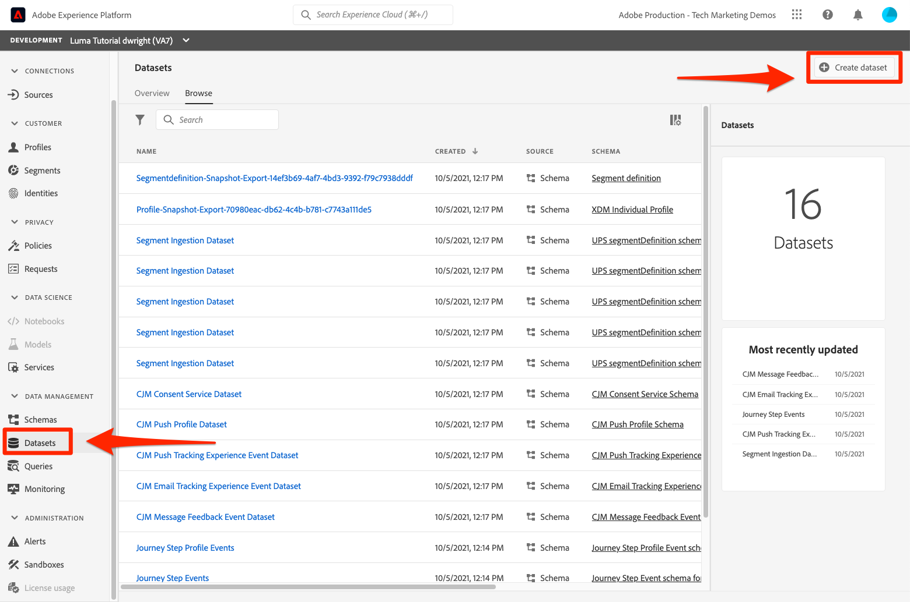
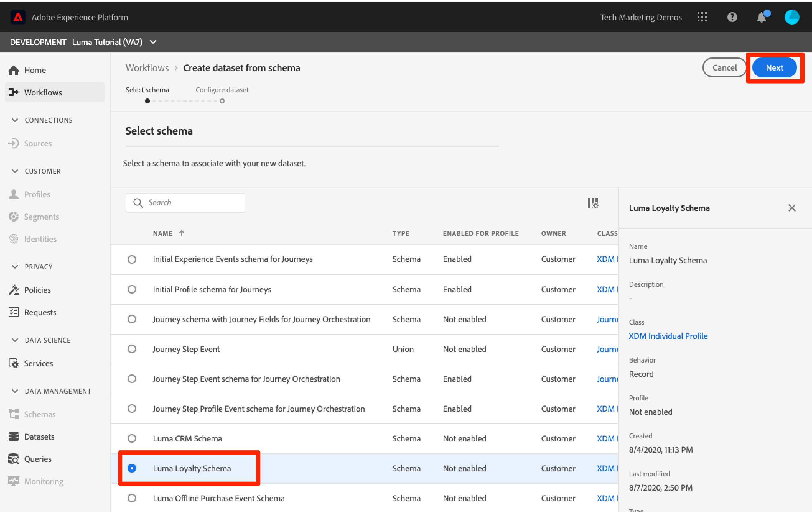
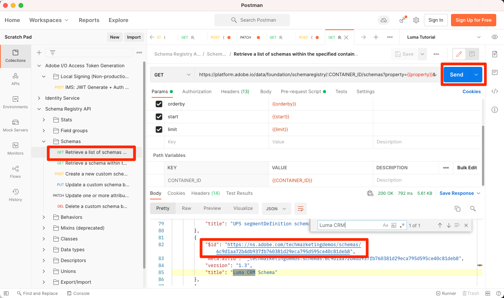

# Erstellen von Datensätzen

<!--15min-->

In dieser Lektion erstellen Sie Datensätze, um Ihre Daten zu erhalten. Sie werden gespannt sein, zu wissen, dass dies die kürzeste Lektion im Tutorial ist!

Alle Daten, die erfolgreich in Adobe Experience Platform aufgenommen werden, bleiben als Datensätze im Data Lake erhalten. Ein Datensatz ist ein Konstrukt zur Datenspeicherung und -verwaltung, in dem Daten (in der Regel) in einer Tabelle erfasst werden, die ein Schema (Spalten) und Felder (Zeilen) beinhaltet. Datensätze enthalten auch Metadaten, die verschiedene Aspekte der in ihnen gespeicherten Daten beschreiben.

**Datenarchitekten** müssen Datensätze außerhalb dieses Tutorials erstellen.

Bevor Sie mit den Übungen beginnen, sehen Sie sich dieses kurze Video an, um mehr über Datensätze zu erfahren:
>[!VIDEO](https://video.tv.adobe.com/v/34310?learn=on&enablevpops&captions=ger)

## Erforderliche Berechtigungen

In der Lektion [Berechtigungen konfigurieren](configure-permissions.md) richten Sie alle Zugriffssteuerungen ein, die zum Abschließen dieser Lektion erforderlich sind.

<!--
* Permission items **[!UICONTROL Data Management]** > **[!UICONTROL View Datasets]** and **[!UICONTROL Manage Datasets]**
* Permission item **[!UICONTROL Sandboxes]** > `Luma Tutorial`
* User-role access to the `Luma Tutorial Platform` product profile
* Developer-role access to the `Luma Tutorial Platform` product profile (for API)
-->

## Erstellen von Datensätzen in der Benutzeroberfläche

In dieser Übung erstellen wir Datensätze in der Benutzeroberfläche. Beginnen wir mit den Treuedaten:

1. Navigieren Sie **[!UICONTROL linken Navigationsbereich]** Platform-Benutzeroberfläche zu Datensätze .
1. Klicken Sie auf **[!UICONTROL Schaltfläche Datensatz erstellen]**
   

1. Wählen Sie im nächsten Bildschirm **Datensatz aus Schema erstellen**
1. Klicken Sie im nächsten Bildschirm auf Ihre `Luma Loyalty Schema` und dann auf die Schaltfläche **[!UICONTROL Weiter]**.
   

1. Benennen Sie den `Luma Loyalty Dataset` und wählen Sie die Schaltfläche **[!UICONTROL Beenden]** aus
   
1. Wenn der Datensatz gespeichert wurde, werden Sie zu einem Bildschirm wie diesem weitergeleitet:
   

Das ist alles! Ich habe dir ja gesagt, dass das schnell gehen würde. Erstellen Sie diese anderen Datensätze mithilfe derselben Schritte:

1. `Luma Offline Purchase Events Dataset` für Ihre `Luma Offline Purchase Events Schema`
1. `Luma Web Events Dataset` für Ihre `Luma Web Events Schema`
1. `Luma Product Catalog Dataset` für Ihre `Luma Product Catalog Schema`


## Erstellen eines Datensatzes mithilfe der API

Erstellen Sie nun die `Luma CRM Dataset` mit der -API.

>[!NOTE]
>
>Wenn Sie die API-Übung überspringen und den `Luma CRM Dataset` in der Benutzeroberfläche erstellen möchten, ist das in Ordnung. Benennen Sie ihn `Luma CRM Dataset` und verwenden Sie die `Luma CRM Schema`.

### Abrufen der ID des Schemas, das im Datensatz verwendet werden soll

Zuerst müssen wir die `$id` der `Luma CRM Schema` abrufen:

1. [!DNL Postman] öffnen
1. Wenn Sie kein Zugriffs-Token haben, öffnen Sie die **[!DNL OAuth: Request Access Token]** und wählen Sie **Senden** aus, um ein neues Zugriffs-Token anzufordern, genau wie Sie es in der [!DNL Postman] Lektion getan haben.
1. **[!DNL Schema Registry API > Schemas > Retrieve a list of schemas within the specified container.]** öffnen
1. Klicken Sie auf die **Senden**-Schaltfläche
1. Sie sollten eine Antwort von 200 erhalten
1. Suchen Sie in der Antwort nach dem `Luma CRM Schema` Element und kopieren Sie den `$id`
   

### Erstellen des Datensatzes

Jetzt können Sie den Datensatz erstellen:

1. Laden Sie [Catalog Service API.postman_collection.json](https://raw.githubusercontent.com/adobe/experience-platform-postman-samples/master/apis/experience-platform/Catalog%20Service%20API.postman_collection.json) in Ihren `Luma Tutorial Assets` Ordner herunter.
1. Importieren der Sammlung in [!DNL Postman]
1. **[!DNL Catalog Service API > Datasets > Create a new dataset.]** auswählen
1. Fügen Sie Folgendes als **Hauptteil** der Anfrage ein ***ersetzen Sie den ID-Wert durch Ihren eigenen***:

   ```json
   {
       "name": "Luma CRM Dataset",
   
       "schemaRef": {
           "id": "REPLACE_WITH_YOUR_OWN_ID",
           "contentType": "application/vnd.adobe.xed-full+json;version=1"
       },
       "fileDescription": {
           "persisted": true,
           "containerFormat": "parquet",
           "format": "parquet"
       }
   }
   ```

1. Klicken Sie auf die **Senden**-Schaltfläche
1. Sie sollten eine 201-Antwort erhalten, die die ID Ihres neuen Datensatzes enthält!
   

>[!TIP]
>
> Häufige Probleme bei dieser Anfrage und wahrscheinliche Fehlerbehebungen:
>
> * `400: There was a problem retrieving xdm schema`. Stellen Sie sicher, dass Sie die ID im obigen Beispiel durch die ID Ihrer eigenen `Luma CRM Schema` ersetzt haben
> * Kein Authentifizierungs-Token: Führen Sie die Anfrage **OAuth: Zugriffs-Token anfordern** aus, um ein neues Token zu generieren
> * `401: Not Authorized to PUT/POST/PATCH/DELETE for this path : /global/schemas/`: Aktualisieren der **CONTAINER_ID** Umgebungsvariable von `global` auf `tenant`
> * `403: PALM Access Denied. POST access is denied for this resource from access control`: Überprüfen Sie Ihre Benutzerberechtigungen in der Admin Console


Sie können zum Bildschirm **[!UICONTROL Datensätze]** in der Platform-Benutzeroberfläche zurückkehren und die erfolgreiche Erstellung aller fünf Datensätze überprüfen!


## Weitere Ressourcen

* [Dokumentation zu Datensätzen](https://experienceleague.adobe.com/docs/experience-platform/catalog/datasets/overview.html?lang=de)
* [Referenz zur Datensatz-API (Teil des Katalog-Service)](https://www.adobe.io/experience-platform-apis/references/catalog/#tag/Datasets)

Nachdem alle unsere Schemata, Identitäten und Datensätze eingerichtet sind, können wir [sie für das Echtzeit-Kundenprofil aktivieren](enable-profiles.md).
