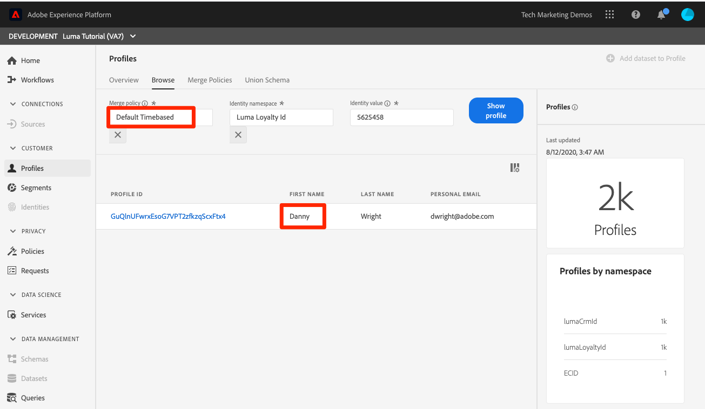

# Zusammenführungsrichtlinien erstellen

<!--20 min-->

In dieser Lektion erstellen Sie Zusammenführungsrichtlinien, um die Zusammenführung mehrerer Datenquellen zu Profilen zu priorisieren.

Mit Adobe Experience Platform können Sie Daten aus verschiedenen Quellen zusammenführen und kombinieren, um eine vollständige Ansicht der einzelnen Kunden zu erhalten. Beim Zusammenführen dieser Daten bestimmen Zusammenführungsrichtlinien, wie Daten priorisiert werden und welche Daten kombiniert werden, um eine einheitliche Ansicht zu schaffen.

In dieser Lektion werden wir an der Benutzeroberfläche festgehalten, aber API-Optionen sind auch zum Erstellen von Zusammenführungsrichtlinien vorhanden.

**Datenarchitekten** müssen außerhalb dieses Tutorials Zusammenführungsrichtlinien erstellen.

Bevor Sie mit den Übungen beginnen, sehen Sie sich dieses kurze Video an, um mehr über Zusammenführungsrichtlinien zu erfahren:
>[!VIDEO](https://video.tv.adobe.com/v/330433?learn=on)

## Erforderliche Berechtigungen

In der Lektion [Berechtigungen konfigurieren](configure-permissions.md) richten Sie alle Zugriffssteuerungen ein, die zum Abschluss dieser Lektion erforderlich sind.

<!--* Permission items **[!UICONTROL Profile Management]** > **[!UICONTROL View Merge Policies]** and **[!UICONTROL Manage Merge Policies]**
* Permission item **[!UICONTROL Profile Management]** > **[!UICONTROL View Profiles]** and **[!UICONTROL Manage Profiles]**
* Permission item **[!UICONTROL Sandboxes]** > `Luma Tutorial`
* User-role access to the `Luma Tutorial Platform` product profile
-->

## Über Zusammenführungsrichtlinien und Vereinigungsschema

In der Lektion zur Batch-Erfassung haben wir möglicherweise zwei Datensätze mit etwas anderen Informationen für denselben Kunden hochgeladen. In den [!DNL Loyalty] -Daten war der Vorname des Kunden `Daniel` und er lebte in `New York City`, aber in den CRM-Daten war der Vorname des Kunden `Danny` und er lebte in `Portland`. Die Kundendaten ändern sich im Laufe der Zeit. Vielleicht wechselte er von `Portland` zu `New York City`. Auch andere Dinge ändern sich, wie Telefonnummern und E-Mail-Adressen. Zusammenführungsrichtlinien helfen Ihnen bei der Entscheidung, wie Sie diese Arten von Konflikten handhaben, wenn zwei Datenquellen unterschiedliche Informationen für denselben Benutzer bereitstellen.

Also, warum hat `Danny` als Vorname gewonnen? Sehen wir uns Folgendes an:

1. Wählen Sie in der Benutzeroberfläche von Platform im linken Navigationsbereich **[!UICONTROL Profile]** aus.
1. Navigieren Sie zur Registerkarte **[!UICONTROL Zusammenführungsrichtlinien]** .
1. Die standardmäßige Zusammenführungsrichtlinie ist ein bestellter Zeitstempel. Da Sie die CRM-Daten nach den Loyalitätsdaten hochgeladen haben, hat `Danny` den Vornamen im Profil erhalten:

Wenn mehrere Schemas für ein Profil aktiviert sind, wird automatisch ein [!UICONTROL Vereinigungsschema] für alle profilaktivierten Schemas erstellt, die eine Basisklasse gemeinsam nutzen. Sie können die [!UICONTROL Vereinigungsschemas] anzeigen, indem Sie zur Registerkarte **[!UICONTROL Vereinigungsschema]** navigieren.

Beachten Sie, dass es kein Vereinigungsschema für die ExperienceEvent-Klasse gibt. Während ExperienceEvent-Daten weiterhin im Profil landen, da sie zeitreihenbasiert sind, enthält jedes Ereignis einen Zeitstempel und eine ID und Kollisionen sind kein Problem.

Was passiert, wenn Ihnen diese standardmäßige Zusammenführungsrichtlinie nicht gefällt? Was, wenn Luma beschließt, dass ihr Treuesystem die Quelle der Wahrheit sein sollte, wenn es einen Konflikt gibt? Dazu erstellen wir eine Zusammenführungsrichtlinie.

## Erstellen einer Zusammenführungsrichtlinie in der Benutzeroberfläche

1. Wählen Sie im Bildschirm &quot;Zusammenführungsrichtlinien&quot;die Schaltfläche **[!UICONTROL Zusammenführungsrichtlinie erstellen]** oben rechts
1. Geben Sie als **[!UICONTROL Name]** `Loyalty Prioritized` ein.
1. Wählen Sie als **[!UICONTROL Schema]** **[!UICONTROL XDM Profile]** aus (beachten Sie, dass Ihre benutzerdefinierte Klasse - da es sich um Datensatzdaten handelt - auch für Zusammenführungsrichtlinien verfügbar ist).
1. Wählen Sie für **[!UICONTROL ID-Zuordnung]** **[!UICONTROL Privates Diagramm]** aus.
1. Wählen Sie für **[!UICONTROL Attributzusammenführung]** die Option **[!UICONTROL Datensatzpriorität]**
1. Ziehen Sie `Luma Loyalty Dataset` und `Luma CRM Dataset` per Drag-and-Drop in den Bereich **[!UICONTROL Datensatz]** .
1. Stellen Sie sicher, dass `Luma Loyalty Dataset` oben ist, indem Sie ihn per Drag-and-Drop über den `Luma CRM Dataset` ziehen
1. Wählen Sie die Schaltfläche **[!UICONTROL Speichern]** aus
   <!--do i need to explain Private Graph? Is that GA?-->
   

## Validieren der Zusammenführungsrichtlinie

Lassen Sie uns sehen, ob die Zusammenführungsrichtlinie das tut, was wir erwarten würden:

1. Navigieren Sie zur Registerkarte **[!UICONTROL Durchsuchen]** .
1. Ändern Sie die **[!UICONTROL Zusammenführungsrichtlinie]** in Ihre neue `Loyalty Prioritized`-Richtlinie
1. Verwenden Sie als **[!UICONTROL Identitäts-Namespace]** Ihren `Luma CRM Id`
1. Verwenden Sie als **[!UICONTROL Identitätswert]** `112ca06ed53d3db37e4cea49cc45b71e`
1. Wählen Sie die Schaltfläche **[!UICONTROL Profil anzeigen]** aus
1. `Daniel` ist wieder da!

## Erstellen einer Zusammenführungsrichtlinie mit eingeschränkten Datensätzen

Beim Erstellen von Zusammenführungsrichtlinien mit Datensatzpriorität werden nur die Datensätze derselben Basisklasse, die Sie rechts einbeziehen, in das Profil aufgenommen. Erstellen wir eine weitere Zusammenführungsrichtlinie

1. Wählen Sie im Bildschirm &quot;Zusammenführungsrichtlinien&quot;die Schaltfläche **[!UICONTROL Zusammenführungsrichtlinie erstellen]** oben rechts
1. Geben Sie als **[!UICONTROL Name]** `Loyalty Only` ein.
1. Wählen Sie als **[!UICONTROL Schema]** **[!UICONTROL XDM Profile]** aus.
1. Wählen Sie für **[!UICONTROL ID-Zuordnung]** **[!UICONTROL Keine]** aus.
1. Wählen Sie für **[!UICONTROL Attributzusammenführung]** die Option **[!UICONTROL Datensatzpriorität]**
1. Ziehen Sie nur den Punkt `Luma Loyalty Dataset` in den Bereich **[!UICONTROL Ausgewählter Datensatz]**.
1. Wählen Sie die Schaltfläche **[!UICONTROL Speichern]** aus

## Validieren der Zusammenführungsrichtlinie

Schauen wir uns nun an, was diese Zusammenführungsrichtlinie bewirkt:

1. Navigieren Sie zur Registerkarte **[!UICONTROL Durchsuchen]** .
1. Ändern Sie die **[!UICONTROL Zusammenführungsrichtlinie]** in Ihre neue `Loyalty Only`-Richtlinie
1. Verwenden Sie als **[!UICONTROL Identitäts-Namespace]** Ihren `Luma CRM Id`
1. Verwenden Sie als **[!UICONTROL Identitätswert]** `112ca06ed53d3db37e4cea49cc45b71e`
1. Wählen Sie die Schaltfläche **[!UICONTROL Profil anzeigen]** aus
1. Vergewissern Sie sich, dass keine Profile gefunden wurden:
   

Die CRM-ID ist ein Identitätsfeld in der `Luma Loyalty Dataset`, es können jedoch nur primäre Identitäten zum Nachschlagen von Profilen verwendet werden. Schauen wir uns also das Profil mit der primären Identität an, `Luma Loyalty Id`&quot;

1. Ändern Sie den **[!UICONTROL Identity-Namespace]** in `Luma Loyalty Id`
1. Verwenden Sie als **[!UICONTROL Identitätswert]** `5625458`
1. Wählen Sie die Schaltfläche **[!UICONTROL Profil anzeigen]** aus
1. Wählen Sie die Profil-ID aus, um das Profil zu öffnen
1. Navigieren Sie zur Registerkarte **[!UICONTROL Attribute]** .
1. Beachten Sie, dass andere Profildetails aus dem CRM-Datensatz wie die Mobiltelefonnummer und die E-Mail-Adresse nicht verfügbar sind, da wir nur
   
1. Navigieren Sie zur Registerkarte **[!UICONTROL Ereignisse]** .
1. ExperienceEvent-Daten sind verfügbar, obwohl sie nicht explizit in den Datensätzen der Zusammenführungsrichtlinie enthalten sind:
   

## Weitere Informationen zu Zusammenführungsrichtlinien

Ändern Sie in der Profilsuche die verwendete Zusammenführungsrichtlinie zurück in `Default Timebased` und wählen Sie die Schaltfläche **[!UICONTROL Profil anzeigen]** aus. Danny ist wieder da!

Was ist hier los? Die Profilzusammenführung ist keine einmalige Sache. Echtzeit-Kundenprofile werden spontan zusammengestellt und basieren auf verschiedenen Faktoren, einschließlich der verwendeten Zusammenführungsrichtlinie. Sie können mehrere Zusammenführungsrichtlinien erstellen, die je nach gewünschter Ansicht des Kunden in verschiedenen Kontexten verwendet werden.

Ein wichtiges Anwendungsbeispiel für Zusammenführungsrichtlinien ist die Data Governance. Angenommen, Sie erfassen Daten von Drittanbietern in Platform, die nicht für Personalisierungsfälle verwendet werden können, aber _kann_ für Werbezwecke verwendet werden. Sie können eine Zusammenführungsrichtlinie erstellen, die diesen Datensatz von Drittanbietern ausschließt, und diese Zusammenführungsrichtlinie verwenden, um Segmente für Ihre Anwendungsfälle für Werbung zu erstellen.

## Weitere Ressourcen

* [Dokumentation zu Zusammenführungsrichtlinien](https://experienceleague.adobe.com/docs/experience-platform/profile/merge-policies/overview.html)
* Referenz zur API für Zusammenführungsrichtlinien (Teil der Echtzeit-Kundenprofil-API) ](https://www.adobe.io/experience-platform-apis/references/profile/#tag/Merge-policies)[

Gehen wir nun zum [Data Governance-Framework](apply-data-governance-framework.md).
