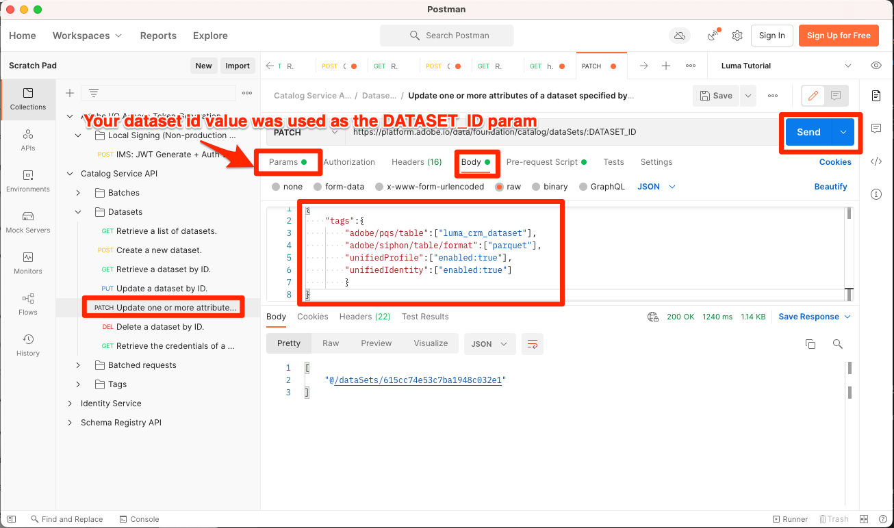

# Echtzeit-Kundenprofile aktivieren

<!-- 15min-->
In dieser Lektion aktivieren Sie Ihre Schemas und Datensätze für das Echtzeit-Kundenprofil.

Okay, ich habe gelogen, als ich sagte, dass die Lektion zu Datensätzen die kürzeste Lektion in diesem Tutorial war - diese sollte noch weniger Zeit in Anspruch nehmen! Alles, was du tun wirst, ist ein Haufen Umschalter zu werfen. Aber was passiert, wenn man diese Brille dreht, ist _wirklich_ wichtig, damit ich eine ganze Seite darauf widmen wollte.

Mit dem Echtzeit-Kundenprofil können Sie eine ganzheitliche Ansicht jedes einzelnen Kunden anzeigen, die Daten aus mehreren Kanälen kombiniert, einschließlich Online-, Offline-, CRM- und Drittanbieter-Daten. Mit dem Profil können Sie Ihre unterschiedlichen Kundendaten in einer zentralen Sicht zusammenführen, die eine aussagekräftige, im Zeitverlauf gezeichnete Darstellung jeder Kundeninteraktion bietet.

So erstaunlich das alles klingt, Sie müssen nicht aktivieren *all Ihre Daten* für Profil. Tatsächlich sollten Sie nur die Daten aktivieren, die Sie für Aktivierungs-Anwendungsfälle benötigen. Aktivieren Sie Daten, die Sie für Marketing-Anwendungsfälle, Callcenter-Integrationen usw. verwenden möchten, wo Sie schnellen Zugriff auf ein robustes Kundenprofil benötigen. Wenn Sie Daten nur zur Analyse hochladen, sollte sie wahrscheinlich nicht für das Profil aktiviert werden.

Es gibt wichtige [Limits für Echtzeit-Kundenprofil-Daten](https://experienceleague.adobe.com/docs/experience-platform/profile/guardrails.html?lang=en) welche Sie bei der Entscheidung darüber überprüfen sollten, welche Ihrer eigenen Daten Sie für das Profil aktivieren sollten.

<!--is this accurate. Are there other considerations to point out? -->

**Datenarchitekten** müssen das Echtzeit-Kundenprofil außerhalb dieses Tutorials aktiviert werden.

Bevor Sie mit den Übungen beginnen, sehen Sie sich dieses kurze Video an, um mehr über das Echtzeit-Kundenprofil zu erfahren:
>[!VIDEO](https://video.tv.adobe.com/v/27251?quality=12&learn=on)

## Erforderliche Berechtigungen

Im [Berechtigungen konfigurieren](configure-permissions.md) Lektion erstellen Sie alle Zugriffssteuerungen, die zum Abschluss dieser Lektion erforderlich sind.


<!--* Permission items **[!UICONTROL Data Modeling]** > **[!UICONTROL View Schemas]** and **[!UICONTROL Manage Schemas]**
* Permission items **[!UICONTROL Data Management]** > **[!UICONTROL View Datasets]** and **[!UICONTROL Manage Datasets]**
* Permission item **[!UICONTROL Sandboxes]** > `Luma Tutorial`
* User-role access to the `Luma Tutorial Platform` product profile
* Developer-role access to the `Luma Tutorial Platform` product profile (for API)
-->

## Aktivieren von Schemata für das Echtzeit-Kundenprofil über die Benutzeroberfläche von Platform

Beginnen wir mit der einfachen Aufgabe, ein Schema zu aktivieren:

1. Öffnen Sie in der Benutzeroberfläche von Platform den **Luma-Treueschema**
1. In **[!UICONTROL Schemaeigenschaften]**, um die **Profil** switch
1. Drücken Sie im Bestätigungsmodal die **[!UICONTROL Aktivieren]** Schaltfläche zum Bestätigen
1. Wählen Sie die **[!UICONTROL Speichern]** Schaltfläche zum Speichern Ihrer Änderungen

   >[!IMPORTANT]
   >
   >Nachdem ein Schema für Profil aktiviert wurde, kann es nicht mehr deaktiviert oder gelöscht werden. Außerdem können Felder nach diesem Punkt nicht mehr aus dem Schema entfernt werden. Diese Implikationen sollten Sie später bei der Arbeit mit Ihren eigenen Daten in Ihrer Produktionsumgebung berücksichtigen. Sie sollten in diesem Tutorial eine Entwicklungs-Sandbox verwenden, die jederzeit gelöscht werden kann.
   >
   >In der kontrollierten Umgebung dieses Tutorials aktivieren Sie Ihre Schemas und Datensätze für Profil, _vor der Aufnahme von Daten_. Wir empfehlen, beim Arbeiten mit Ihren eigenen Daten die folgenden Schritte auszuführen:
   >
   > 1. Erfassen Sie zunächst einige Daten in Ihren Datensätzen.
   > 1. Beheben Sie alle Probleme, die während des Datenerfassungsprozesses auftreten (z. B. bei der Datenvalidierung oder bei der Zuordnung).
   > 1. Datensätze und Schemata für Profile aktivieren
   > 1. Daten erneut verwenden


   

Einfach richtig? Wiederholen Sie die obigen Schritte für dieses andere Schema:

1. Luma-Produktkatalog-Schema
1. Luma-Offline-Kaufereignisschema
1. Luma Web Events Schema (aktivieren Sie im Bestätigungs-Modal das Kontrollkästchen &quot;Daten für dieses Schema enthalten eine primäre Identität im Feld identityMap .&quot;)

## Aktivieren von Schemata für das Echtzeit-Kundenprofil mithilfe der Platform-API

Jetzt ist es an der Zeit, die `Luma CRM Schema` mit der API. Wenn Sie diese Übung überspringen und sie einfach in der Benutzeroberfläche aktivieren möchten, fahren Sie sofort fort.

### Abrufen der meta:altId des Schemas

Zunächst wollen wir die `meta:altId` des `Luma CRM Schema`:

1. Öffnen [!DNL Postman]
1. Wenn Sie kein Zugriffstoken haben, öffnen Sie die Anfrage **[!DNL OAuth: Request Access Token]** und wählen Sie **Senden** , um ein neues Zugriffstoken anzufordern, genau wie Sie es in der [!DNL Postman] Lektion.
1. Anfrage öffnen **[!DNL Schema Registry API > Schemas > Retrieve a list of schemas within the specified container.]**
1. Wählen Sie die **Senden** button
1. Sie sollten eine 200-Antwort erhalten
1. Suchen Sie in der Antwort nach der `Luma CRM Schema` -Element und kopieren Sie die `meta:altId` value
   

### Aktivieren des Schemas

Nachdem wir nun über die meta:altId des Schemas verfügen, können wir sie für das Profil aktivieren:

1. Anfrage öffnen **[!DNL Schema Registry API > Schemas > Update one or more attributes of a custom schema specified by ID.]**
1. Im **Parameter** Einfügen `meta:altId` Wert als `SCHEMA_ID` param-Wert
1. Im **body** Fügen Sie den folgenden Code ein.

   ```json
   [{
       "op": "add",
       "path": "/meta:immutableTags",
       "value": ["union"]
   }]
   ```

1. Wählen Sie die **Senden** button
1. Sie sollten eine 200-Antwort erhalten

   

Sie sollten in der Benutzeroberfläche sehen können, dass alle fünf Schemas für das Profil aktiviert sind (Sie müssen möglicherweise SHIFT-Reload verwenden, um zu sehen, dass `Luma CRM Schema` aktiviert ist):


## Aktivieren von Datensätzen für Echtzeit-Kundenprofil über die Benutzeroberfläche von Platform

Die Datensätze müssen auch für Profil aktiviert werden, und der Prozess ist noch einfacher:

1. Öffnen Sie in der Benutzeroberfläche von Platform den `Luma Loyalty Dataset`
1. Umschalten zwischen **[!UICONTROL Profil]** switch
1. Drücken Sie im Bestätigungsmodal die **[!UICONTROL Aktivieren]** Schaltfläche zum Bestätigen

   

Wiederholen Sie die obigen Schritte für diese anderen Datensätze:

1. Luma-Produktkatalog-Datensatz
1. Datensatz mit Offline-Kaufereignissen für Luma
1. Datensatz mit Luma-Webereignissen

>[!NOTE]
>
>Im Gegensatz zu Schemas können Sie Datensätze aus dem Profil deaktivieren, jedoch bleiben alle zuvor erfassten Daten im Profil.

## Aktivieren von Datensätzen für Echtzeit-Kundenprofil mithilfe der Platform-API

Jetzt aktivieren Sie einen Datensatz für Profil mithilfe der API. Auch wenn Sie es über die Benutzeroberfläche mit der oben genannten Methode aktivieren möchten, ist das in Ordnung.

### ID des Datensatzes abrufen

Zuerst müssen wir die `id` des `Luma CRM Dataset`:

1. Öffnen [!DNL Postman]
1. Wenn Sie kein Zugriffstoken haben, öffnen Sie die Anfrage **[!DNL OAuth: Request Access Token]** und wählen Sie **Senden** , um ein neues Zugriffstoken anzufordern, genau wie Sie es in der [!DNL Postman] Lektion.
1. Anfrage öffnen **[!DNL Catalog Service API > Datasets > Retrieve a list of datasets.]**
1. Wählen Sie die **Senden** button
1. Sie sollten eine 200-Antwort erhalten
1. Suchen Sie in der Antwort nach der `Luma CRM Dataset` -Element und kopieren Sie die ID:
   

### Aktivieren des Datensatzes

Nachdem wir nun die ID des Datensatzes haben, können wir ihn für das Profil aktivieren:

1. Anfrage öffnen **[!DNL Catalog Service API > Datasets > Update one or more attributes of a dataset specified by ID.]**
1. Im **Parameter** aktualisieren `DATASET_ID` Wert zu Ihrer eigenen
1. Im **body** Fügen Sie den folgenden Code ein. Beachten Sie, dass es sich bei den ersten beiden Werten um bereits vorhandene Tags handelt, die in der vorherigen Antwort sichtbar sind. Sie müssen zusätzlich zu den beiden neuen Tags, die wir hinzufügen, im Text enthalten sein:

   ```json
   {
       "tags":{
           "adobe/pqs/table":["luma_crm_dataset"],
           "adobe/siphon/table/format":["parquet"],
           "unifiedProfile":["enabled:true"],
           "unifiedIdentity":["enabled:true"]
           }
   }
   ```

1. Wählen Sie die **Senden** button
1. Sie sollten eine 200-Antwort erhalten

   

Sie können auch bestätigen, dass in der Benutzeroberfläche der Datensatz aktiviert angezeigt wird:


>[!IMPORTANT]
>
> Wenn Sie Daten erfassen, bevor Sie das Schema und den Datensatz für das Profil aktivieren, müssen Sie diese Daten anschließend erneut erfassen.

## Weitere Ressourcen

* [Dokumentation zum Echtzeit-Kundenprofil](https://experienceleague.adobe.com/docs/experience-platform/profile/home.html?lang=de)
* [Referenz zur Echtzeit-Kundenprofil-API](https://www.adobe.io/experience-platform-apis/references/profile/)


**Dateningenieure** sollte die [Abonnieren von Datenerfassungsereignissen](subscribe-to-data-ingestion-events.md) Lektion.
**Datenarchitekten** _kann vorzeitig überspringen_ und gehen Sie zu [Batch-Erfassung - Lektion](ingest-batch-data.md).
