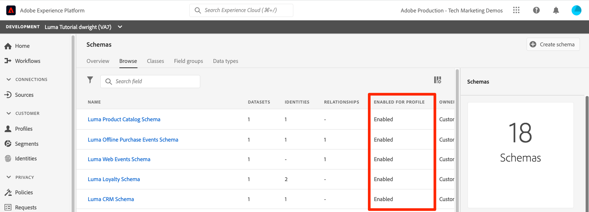

# Echtzeit-Kundenprofile aktivieren

<!-- 15min-->
In dieser Lektion aktivieren Sie Ihre Schemata und Datensätze für das Echtzeit-Kundenprofil.

Okay, ich habe gelogen, als ich sagte, dass die Datensatz-Lektion die kürzeste Lektion in diesem Tutorial war - diese sollte noch weniger Zeit in Anspruch nehmen! Man dreht einfach nur ein paar Umschalter um. Aber was passiert, wenn man diese Umschalter umdreht _ist_ wichtig, also wollte ich eine ganze Seite dafür widmen.

Das Echtzeit-Kundenprofil liefert eine ganzheitliche Sicht auf jeden einzelnen Kunden, indem es Daten aus Online- und Offline-Kanälen ebenso wie aus CRMs und Drittanbieter-Datenquellen und anderen Kanälen miteinander kombiniert. Mit dem Profil können Sie Ihre unterschiedlichen Kundendaten in einer zentralen Sicht zusammenführen, die eine aussagekräftige, im Zeitverlauf gezeichnete Darstellung jeder Kundeninteraktion bietet.

So erstaunlich das alles klingt, Sie müssen nicht (*Ihre gesamten Daten)* Profil aktivieren. Tatsächlich sollten Sie nur die Daten aktivieren, die Sie für Aktivierungs-Anwendungsfälle benötigen. Aktivieren Sie Daten, die Sie für Marketing-Anwendungsfälle, Callcenter-Integrationen usw. verwenden möchten, bei denen Sie schnellen Zugriff auf ein robustes Kundenprofil benötigen. Wenn Sie Daten nur zur Analyse hochladen, sollten sie wahrscheinlich nicht für das Profil aktiviert werden.

Es gibt wichtige [Leitplanken für Echtzeit-Kundenprofildaten](https://experienceleague.adobe.com/docs/experience-platform/profile/guardrails.html?lang=de) die Sie überprüfen sollten, wenn Sie entscheiden, welche Ihrer eigenen Daten Sie für das Profil aktivieren sollten.

<!--is this accurate. Are there other considerations to point out? -->

**Datenarchitekten** müssen das Echtzeit-Kundenprofil außerhalb dieses Tutorials aktivieren.

Bevor Sie mit den Übungen beginnen, sehen Sie sich dieses kurze Video an, um mehr über das Echtzeit-Kundenprofil zu erfahren:
>[!VIDEO](https://video.tv.adobe.com/v/27251?learn=on&enablevpops)

## Erforderliche Berechtigungen

In der Lektion [Berechtigungen konfigurieren](configure-permissions.md) richten Sie alle Zugriffssteuerungen ein, die zum Abschließen dieser Lektion erforderlich sind.


<!--* Permission items **[!UICONTROL Data Modeling]** > **[!UICONTROL View Schemas]** and **[!UICONTROL Manage Schemas]**
* Permission items **[!UICONTROL Data Management]** > **[!UICONTROL View Datasets]** and **[!UICONTROL Manage Datasets]**
* Permission item **[!UICONTROL Sandboxes]** > `Luma Tutorial`
* User-role access to the `Luma Tutorial Platform` product profile
* Developer-role access to the `Luma Tutorial Platform` product profile (for API)
-->

## Aktivieren von Schemas für das Echtzeit-Kundenprofil mithilfe der Platform-Benutzeroberfläche

Beginnen wir mit der einfachen Aufgabe, ein Schema zu aktivieren:

1. Öffnen Sie in der Platform-Benutzeroberfläche das **Luma-Treueschema**
1. Schalten **[!UICONTROL in den]** den Umschalter **Profil** um
1. Drücken Sie im Bestätigungs-Modal zur Bestätigung die **[!UICONTROL Aktivieren]**-Taste
1. Klicken Sie auf **[!UICONTROL Speichern]**, um Ihre Änderungen zu speichern

   >[!IMPORTANT]
   >
   >Nachdem ein Schema für das Profil aktiviert wurde, kann es nicht mehr deaktiviert oder gelöscht werden. Außerdem können nach diesem Punkt keine Felder mehr aus dem Schema entfernt werden. Diese Auswirkungen sollten Sie später im Auge behalten, wenn Sie mit Ihren eigenen Daten in Ihrer Produktionsumgebung arbeiten. In diesem Tutorial sollten Sie eine Entwicklungs-Sandbox verwenden, die jederzeit gelöscht werden kann.
   >
   >In der kontrollierten Umgebung dieses Tutorials aktivieren Sie Ihre Schemata und Datensätze für das Profil, _bevor Sie Daten_. Bei der Arbeit mit Ihren eigenen Daten empfehlen wir, die Dinge in der folgenden Reihenfolge zu erledigen:
   >
   > 1. Nehmen Sie zunächst einige Daten in Ihre Datensätze auf.
   > 1. Beheben Sie alle Probleme, die während der Datenaufnahme auftreten (z. B. Probleme bei der Datenvalidierung oder -zuordnung).
   > 1. Aktivieren von Datensätzen und Schemata für Profile
   > 1. Nehmen Sie die Daten erneut auf


   

Einfach, oder? Wiederholen Sie die obigen Schritte für diese anderen Schemata:

1. Luma-Produktkatalogschema
1. Luma-Schema für Offline-Kaufereignisse
1. Luma-Web-Ereignis-Schema (aktivieren Sie im Bestätigungs-Modal das Kontrollkästchen „Daten für dieses Schema enthalten eine primäre Identität im identityMap-Feld“.)

## Aktivieren von Schemas für das Echtzeit-Kundenprofil mithilfe der Platform-API

Jetzt ist es an der Zeit, die `Luma CRM Schema` mit der API zu aktivieren. Wenn Sie diese Übung überspringen und einfach in der Benutzeroberfläche aktivieren möchten, fahren Sie mit der rechten Maustaste fort.

### Abrufen der meta:altId des Schemas

Als Erstes rufen wir die `meta:altId` der `Luma CRM Schema` ab:

1. [!DNL Postman] öffnen
1. Wenn Sie kein Zugriffs-Token haben, öffnen Sie die **[!DNL OAuth: Request Access Token]** und wählen Sie **Senden** aus, um ein neues Zugriffs-Token anzufordern, genau wie Sie es in der [!DNL Postman] Lektion getan haben.
1. **[!DNL Schema Registry API > Schemas > Retrieve a list of schemas within the specified container.]** öffnen
1. Klicken Sie auf die **Senden**-Schaltfläche
1. Sie sollten eine Antwort von 200 erhalten
1. Suchen Sie in der Antwort nach dem `Luma CRM Schema` Element und kopieren Sie den `meta:altId`
   

### Aktivieren des Schemas

Nachdem wir nun die meta:altId des Schemas haben, können wir sie für das Profil aktivieren:

1. **[!DNL Schema Registry API > Schemas > Update one or more attributes of a custom schema specified by ID.]** öffnen
1. Fügen **in** params“ Ihren `meta:altId` als `SCHEMA_ID` ein
1. Fügen Sie **der Registerkarte** Hauptteil“ den folgenden Code ein

   ```json
   [{
       "op": "add",
       "path": "/meta:immutableTags",
       "value": ["union"]
   }]
   ```

1. Klicken Sie auf die **Senden**-Schaltfläche
1. Sie sollten eine Antwort von 200 erhalten

   

In der Benutzeroberfläche sollte zu sehen sein, dass alle fünf Schemata für das Profil aktiviert sind (möglicherweise müssen Sie UMSCHALT-Neu laden, um zu sehen, dass `Luma CRM Schema` aktiviert ist):



## Aktivieren von Datensätzen für das Echtzeit-Kundenprofil mithilfe der Platform-Benutzeroberfläche

Die Datensätze müssen auch für das Profil aktiviert werden, und der Prozess ist noch einfacher:

1. Öffnen Sie in der Platform-Benutzeroberfläche die `Luma Loyalty Dataset`
1. Schalten Sie den **[!UICONTROL Profil]** um
1. Drücken Sie im Bestätigungs-Modal zur Bestätigung die **[!UICONTROL Aktivieren]**-Taste

   

Wiederholen Sie die obigen Schritte für diese anderen Datensätze:

1. Luma-Produktkatalog-Datensatz
1. Datensatz für Luma-Offline-Kaufereignisse
1. Datensatz für Luma-Web-Ereignisse

>[!NOTE]
>
>Im Gegensatz zu Schemata können Sie Datensätze im Profil deaktivieren. Alle zuvor aufgenommenen Daten verbleiben jedoch im Profil.

## Datensätze für das Echtzeit-Kundenprofil mithilfe der Platform-API aktivieren

Jetzt aktivieren Sie einen Datensatz für Profile mithilfe der API. Auch das ist in Ordnung, wenn Sie es über die Benutzeroberfläche mit der oben genannten Methode aktivieren möchten.

### Abrufen der ID des Datensatzes

Zuerst müssen wir die `id` der `Luma CRM Dataset` abrufen:

1. [!DNL Postman] öffnen
1. Wenn Sie kein Zugriffs-Token haben, öffnen Sie die **[!DNL OAuth: Request Access Token]** und wählen Sie **Senden** aus, um ein neues Zugriffs-Token anzufordern, genau wie Sie es in der [!DNL Postman] Lektion getan haben.
1. **[!DNL Catalog Service API > Datasets > Retrieve a list of datasets.]** öffnen
1. Klicken Sie auf die **Senden**-Schaltfläche
1. Sie sollten eine Antwort von 200 erhalten
1. Suchen Sie in der Antwort nach dem `Luma CRM Dataset` Element und kopieren Sie die ID:
   

### Aktivieren des Datensatzes

Nachdem wir nun die ID des Datensatzes haben, können wir ihn für das Profil aktivieren:

1. **[!DNL Catalog Service API > Datasets > Update one or more attributes of a dataset specified by ID.]** öffnen
1. Aktualisieren **in &quot;**&quot; den `DATASET_ID` auf Ihren eigenen Wert
1. Fügen Sie **der Registerkarte** Hauptteil“ den folgenden Code ein. Beachten Sie, dass die ersten beiden Werte bereits vorhandene Tags sind, die in der vorherigen Antwort sichtbar sind. Sie müssen in den Hauptteil aufgenommen werden, zusätzlich zu den beiden neuen Tags, die wir hinzufügen:

   ```json
   {
       "tags":{
           "adobe/pqs/table":["luma_crm_dataset"],
           "adobe/siphon/table/format":["parquet"],
           "unifiedProfile":["enabled:true"],
           "unifiedIdentity":["enabled:true"]
           }
   }
   ```

1. Klicken Sie auf die **Senden**-Schaltfläche
1. Sie sollten eine Antwort von 200 erhalten

   

Sie können auch bestätigen, dass auf der Benutzeroberfläche der Datensatz aktiviert angezeigt wird:


>[!IMPORTANT]
>
> Wenn Sie Daten aufnehmen, bevor Sie das Schema und den Datensatz für das Profil aktivieren, müssen Sie diese Daten anschließend erneut aufnehmen.

## Weitere Ressourcen

* [Dokumentation zu Echtzeit-Kundenprofilen](https://experienceleague.adobe.com/docs/experience-platform/profile/home.html?lang=de)
* [Referenz zur Echtzeit-Kundenprofil-API](https://www.adobe.io/experience-platform-apis/references/profile/)


**Dateningenieure** sollten mit der Lektion [Abonnieren von Datenerfassungsereignissen](subscribe-to-data-ingestion-events.md) fortfahren.
**Datenarchitekten** _können_ überspringen und zur Lektion [Batch-Aufnahme“ ](ingest-batch-data.md).
