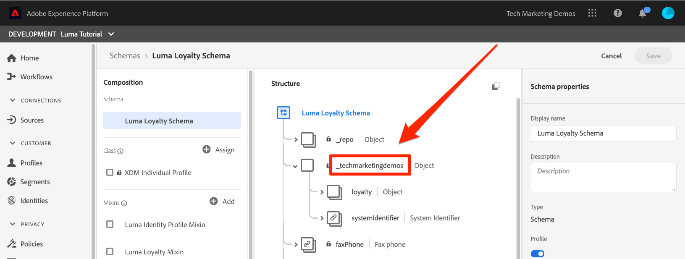
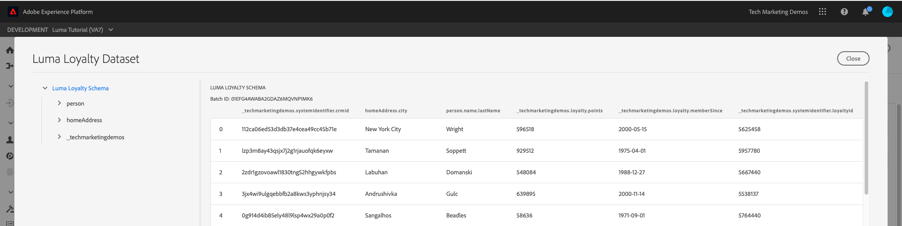
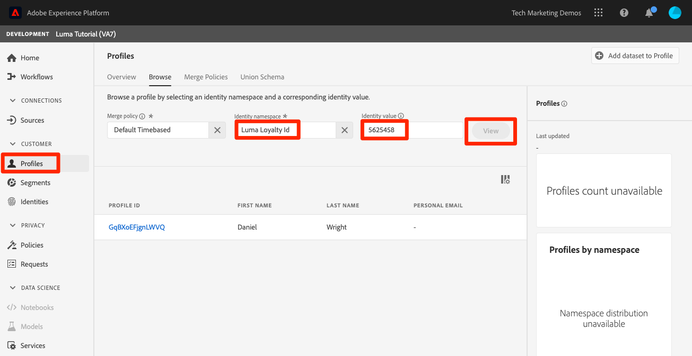
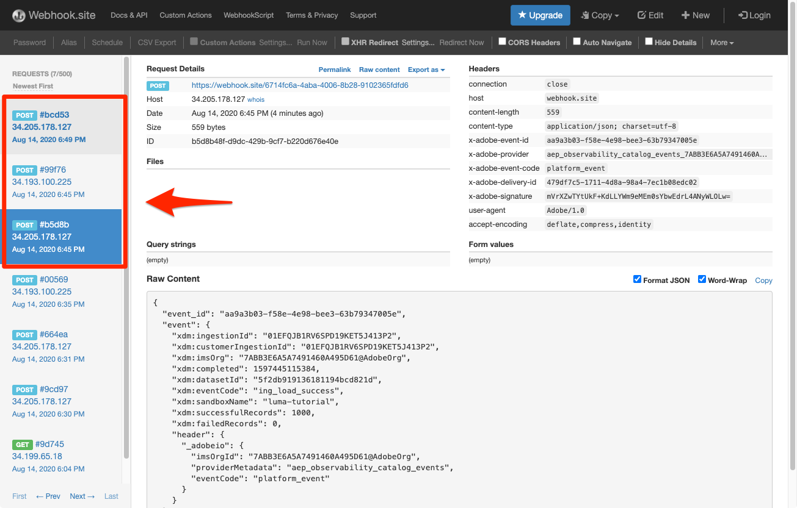

# Batch-Daten erfassen

<!-- 1hr-->
In dieser Lektion erfassen Sie Batch-Daten mit verschiedenen Methoden in Experience Platform.

Mit der Batch-Datenerfassung können Sie eine große Datenmenge gleichzeitig in Adobe Experience Platform erfassen. Sie können Batch-Daten in einem einmaligen Upload innerhalb der Benutzeroberfläche von Platform oder mithilfe der API erfassen. Sie können auch regelmäßig geplante Batch-Uploads von Drittanbieterdiensten wie Cloud-Speicher-Services mithilfe von Quell-Connectoren konfigurieren.

**Dateningenieure** Batch-Daten müssen außerhalb dieses Tutorials erfasst werden.

Bevor Sie mit den Übungen beginnen, sehen Sie sich dieses kurze Video an, um mehr über die Datenerfassung zu erfahren:
>[!VIDEO](https://video.tv.adobe.com/v/27106?quality=12&learn=on)


## Erforderliche Berechtigungen

Im [Berechtigungen konfigurieren](configure-permissions.md) Lektion erstellen Sie alle Zugriffssteuerungen, die zum Abschluss dieser Lektion erforderlich sind.

<!--
* Permission item **[!UICONTROL Data Management]** > **[!UICONTROL View Datasets]**, **[!UICONTROL Manage Datasets]** and **[!UICONTROL Data Monitoring]**
* Permission items **[!UICONTROL Data Ingestion]** > **[!UICONTROL View Sources]** and **[!UICONTROL Manage Sources]**
* Permission item **[!UICONTROL Profile Management]** > **[!UICONTROL View Profiles]**
* Permission item **[!UICONTROL Sandboxes]** > `Luma Tutorial`
* User-role access to the `Luma Tutorial Platform` product profile
* Developer-role access to the `Luma Tutorial Platform` product profile (for API)
-->

Sie benötigen Zugriff auf einen (S)FTP-Server oder eine Cloud-Speicherlösung für die Quellübung. Es gibt eine Problemumgehung, wenn Sie keine haben.

## Daten in Batches mit der Platform-Benutzeroberfläche erfassen

Daten können direkt in einen Datensatz auf dem Datensatzbildschirm in den Formaten JSON und Parquet hochgeladen werden. Auf diese Weise können Sie die Erfassung einiger Ihrer Daten testen, nachdem Sie eine

### Herunterladen und Vorbereiten der Daten

Rufen Sie zunächst die Beispieldaten ab und passen Sie sie für Ihren Mandanten an:

>[!NOTE]
>
>Die in der Variablen [luma-data.zip](assets/luma-data.zip) -Datei ist fiktiv und nur zu Demonstrationszwecken verwendet.

1. Download [luma-data.zip](assets/luma-data.zip) auf **Luma-Tutorial-Assets** Ordner.
1. Dekomprimieren Sie die Datei und erstellen Sie einen Ordner mit dem Namen `luma-data` enthält die vier Datendateien, die wir in dieser Lektion verwenden werden
1. Öffnen `luma-loyalty.json` in einem Texteditor und ersetzen Sie alle Instanzen von `_techmarketingdemos` mit Ihrer eigenen Unterstrich-Mandanten-ID, wie in Ihren eigenen Schemas dargestellt:
   

1. Die aktualisierte Datei speichern

### Daten aufnehmen

1. Wählen Sie in der Benutzeroberfläche von Platform die Option **[!UICONTROL Datensätze]** in der linken Navigation
1. Öffnen Sie Ihre `Luma Loyalty Dataset`
1. Scrollen Sie nach unten, bis Sie die **[!UICONTROL Daten hinzufügen]** in der rechten Spalte
1. Hochladen der `luma-loyalty.json` -Datei.
1. Sobald die Datei hochgeladen wurde, wird eine Zeile für den Batch angezeigt
1. Wenn Sie die Seite nach einigen Minuten neu laden, sollten Sie sehen, dass der Batch mit 1000 Datensätzen und 1000 Profilfragmenten erfolgreich hochgeladen wurde.

   
<!--do i need to explain error diagnostics and partial ingestion-->

>[!NOTE]
>
>Es gibt einige Optionen, **[!UICONTROL Fehlerdiagnose]** und **[!UICONTROL Partielle Erfassung]**, die Sie auf verschiedenen Bildschirmen in dieser Lektion sehen werden. Diese Optionen werden im Tutorial nicht behandelt. Kurzinformationen:
>
>* Durch die Aktivierung der Fehlerdiagnose werden Daten über die Erfassung Ihrer Daten generiert, die Sie dann mithilfe der Data Access API überprüfen können. Weitere Informationen dazu finden Sie unter [die Dokumentation](https://experienceleague.adobe.com/docs/experience-platform/data-access/home.html).
>* Partielle Erfassung ermöglicht die Aufnahme von fehlerhaften Daten bis zu einem bestimmten Schwellenwert, den Sie angeben können. Weitere Informationen dazu finden Sie unter [die Dokumentation](https://experienceleague.adobe.com/docs/experience-platform/ingestion/batch/partial.html)


### Daten validieren

Es gibt einige Möglichkeiten, um zu bestätigen, dass die Daten erfolgreich erfasst wurden.

#### Validieren in der Benutzeroberfläche von Platform

So bestätigen Sie, dass die Daten in den Datensatz aufgenommen wurden:

1. Wählen Sie auf der Seite, auf der Sie die Daten aufgenommen haben, die **[!UICONTROL Vorschau des Datensatzes anzeigen]** Schaltfläche oben rechts
1. Wählen Sie die **Vorschau** und Sie sollten einige der erfassten Daten sehen können.

   


So bestätigen Sie, dass die in Profil gelandeten Daten (es kann einige Minuten dauern, bis die Daten landen):

1. Navigieren Sie zu **[!UICONTROL Profile]** in der linken Navigation
1. Wählen Sie das Symbol neben dem **[!UICONTROL Identitäts-Namespace auswählen]** -Feld zum Öffnen des Modals
1. Wählen Sie Ihre `Luma Loyalty Id` namespace
1. Geben Sie dann einen der `loyaltyId` Werte aus Ihrem Datensatz,  `5625458`
1. Auswählen **[!UICONTROL Ansicht]**

   

#### Validieren mit Datenerfassungsereignissen

Wenn Sie in der vorherigen Lektion Datenerfassungsereignisse abonniert haben, überprüfen Sie Ihre eindeutige webhook.site-URL. Es sollten drei Anfragen in der folgenden Reihenfolge angezeigt werden, wobei einige Zeit dazwischen liegt, mit der folgenden `eventCode` -Werte:

1. `ing_load_success`—der Batch wie erfasst
1. `ig_load_success`—Der Batch wurde in das Identitätsdiagramm aufgenommen.
1. `ps_load_success`—Der Batch wurde in den Profildienst aufgenommen.


Siehe [Dokumentation](https://experienceleague.adobe.com/docs/experience-platform/ingestion/quality/subscribe-events.html#available-status-notification-events) für weitere Informationen zu den Benachrichtigungen.

## Daten in Batches mit der Platform-API erfassen

Laden wir nun Daten mithilfe der API hoch.

>[!NOTE]
>
>Datenarchitekten können die CRM-Daten gerne über die Benutzeroberflächenmethode hochladen.

### Herunterladen und Vorbereiten der Daten

1. Sie sollten bereits heruntergeladen und entpackt haben [luma-data.zip](assets/luma-data.zip) in `Luma Tutorial Assets` Ordner.
2. Öffnen `luma-crm.json` in einem Texteditor und ersetzen Sie alle Instanzen von `_techmarketingdemos` mit Ihrer eigenen Unterstrich-Mandanten-ID, wie in Ihren Schemas dargestellt
3. Die aktualisierte Datei speichern

### Abrufen der Datensatz-ID

Zunächst rufen wir die ID der Datensatz-ID des Datensatzes ab, in den wir Daten aufnehmen möchten:

1. Öffnen [!DNL Postman]
1. Wenn Sie in den letzten 24 Stunden keine Anfrage gestellt haben, sind Ihre Autorisierungstoken wahrscheinlich abgelaufen. Anfrage öffnen **[!DNL Adobe I/O Access Token Generation > Local Signing (Non-production use-only) > IMS: JWT Generate + Auth via User Token]** und wählen Sie **Senden** , um neue JWT- und Zugriffstoken anzufordern, genau wie Sie dies in der [!DNL Postman] Lektion.
1. Öffnen Sie Ihre Umgebungsvariablen und stellen Sie sicher, dass der Wert von **CONTAINER_ID** ist noch `tenant`
1. Anfrage öffnen **[!DNL Catalog Service API > Datasets > Retrieve a list of datasets.]** und wählen Sie **Senden**
1. Sie sollten eine `200 OK` response
1. Kopieren Sie die ID der `Luma CRM Dataset` aus dem Antworttext
   

### Erstellen des Batches

Jetzt können wir einen Batch im Datensatz erstellen:

1. Download [Data Ingestion-API.postman_collection.json](https://raw.githubusercontent.com/adobe/experience-platform-postman-samples/master/apis/experience-platform/Data%20Ingestion%20API.postman_collection.json) auf `Luma Tutorial Assets` Ordner
1. Importieren Sie die Sammlung in [!DNL Postman]
1. Anforderung auswählen **[!DNL Data Ingestion API > Batch Ingestion > Create a new batch in Catalog Service.]**
1. Fügen Sie Folgendes als **body** des Antrags, ***Ersetzen des Datensatzkennung-Werts durch Ihren eigenen***:

   ```json
   {
       "datasetId":"REPLACE_WITH_YOUR_OWN_DATASETID",
       "inputFormat": {
           "format": "json"
       }
   }
   ```

1. Wählen Sie die **Senden** button
1. Sie sollten eine 201 Erstellte Antwort mit der ID Ihres neuen Batches erhalten!
1. Kopieren Sie die `id` des neuen Batches
   

### Daten aufnehmen

Jetzt können wir die Daten in den Batch hochladen:

1. Anforderung auswählen **[!DNL Data Ingestion API > Batch Ingestion > Upload a file to a dataset in a batch.]**
1. Im **Parameter** Registerkarte geben Sie Ihre Datensatz-ID und Batch-ID in die entsprechenden Felder ein.
1. Im **Parameter** Registerkarte, eingeben `luma-crm.json` als **filePath**
1. Im **body** auswählen, wählen Sie die **binary** option
1. Wählen Sie die heruntergeladene `luma-crm.json` von Ihrem lokalen `Luma Tutorial Assets` Ordner
1. Auswählen **Senden** und Sie sollten eine 200 OK-Antwort mit &quot;1&quot;im Antworttext erhalten

   

Wenn Sie sich Ihren Batch an dieser Stelle in der Benutzeroberfläche von Platform ansehen, sehen Sie, dass er sich in einem &quot;[!UICONTROL Laden]&quot; status:


Da die Batch-API häufig zum Hochladen mehrerer Dateien verwendet wird, müssen Sie Platform mitteilen, wann ein Batch abgeschlossen ist, was wir im nächsten Schritt tun werden.

### Batch abschließen

So schließen Sie den Batch ab:

1. Anforderung auswählen **[!DNL Data Ingestion API > Batch Ingestion > Finish uploading a file to a dataset in a batch.]**
1. Im **Parameter** Registerkarte, eingeben `COMPLETE` als **action**
1. Im **Parameter** Geben Sie Ihre Batch-Kennung ein. Machen Sie sich keine Gedanken über die Datensatz-ID oder den Dateipfad, sofern diese vorhanden sind.
1. Stellen Sie sicher, dass die URL der POST `https://platform.adobe.io/data/foundation/import/batches/:batchId?action=COMPLETE` und dass es keine unnötigen Verweise auf die `datasetId` oder `filePath`
1. Auswählen **Senden** und Sie sollten eine 200 OK-Antwort mit &quot;1&quot;im Antworttext erhalten

   

### Daten validieren

#### Validieren in der Benutzeroberfläche von Platform

Überprüfen Sie, ob die Daten in der Benutzeroberfläche von Platform gelandet sind, genau wie beim Loyalitätsdatensatz.

Bestätigen Sie zunächst, dass der Batch zeigt, dass 1000 Datensätze erfasst wurden:


Bestätigen Sie dann den Batch mit Vorschau des Datensatzes:


Bestätigen Sie schließlich, dass eines Ihrer Profile erstellt wurde, indem Sie eines der Profile durch die `Luma CRM Id` Namespace, z. B. `112ca06ed53d3db37e4cea49cc45b71e`


Es gibt eine interessante Sache, die gerade passiert ist, auf die ich hinweisen möchte. Öffnen Sie das `Danny Wright` Profil. Das Profil verfügt über eine `Lumacrmid` und `Lumaloyaltyid`. Speichern Sie die `Luma Loyalty Schema` enthielt zwei Identitätsfelder: &quot;Luma Loyalty Id&quot;und &quot;CRM ID&quot;. Nachdem wir nun beide Datensätze hochgeladen haben, wurden sie zu einem einzigen Profil zusammengeführt. Die Loyalitätsdaten hatten `Daniel` als Vorname und &quot;New York City&quot;als Privatadresse, während die CRM-Daten `Danny` als Vornamen und `Portland` als Hausadresse für den Kunden mit derselben Loyalitäts-ID. Wir kommen zurück, warum der Vorname angezeigt wird `Danny` in der Lektion zu Zusammenführungsrichtlinien.

Herzlichen Glückwunsch! Sie haben gerade Profile zusammengeführt!


#### Validieren mit Datenerfassungsereignissen

Wenn Sie in der vorherigen Lektion Datenerfassungsereignisse abonniert haben, überprüfen Sie Ihre eindeutige webhook.site-URL. Es sollten drei Anfragen eingehen, genau wie bei den Treuedaten:



Siehe [Dokumentation](https://experienceleague.adobe.com/docs/experience-platform/ingestion/quality/subscribe-events.html#available-status-notification-events) für weitere Informationen zu den Benachrichtigungen.

## Daten mit Workflows erfassen

Sehen wir uns eine andere Möglichkeit an, Daten hochzuladen. Mit der Workflow-Funktion können Sie CSV-Daten erfassen, die noch nicht in XDM modelliert wurden.

### Herunterladen und Vorbereiten der Daten

1. Sie sollten bereits heruntergeladen und entpackt haben [luma-data.zip](assets/luma-data.zip) in `Luma Tutorial Assets` Ordner.
1. Vergewissern Sie sich, dass Sie`luma-products.csv`

### Erstellen eines Workflows

Richten wir nun den Workflow ein:

1. Navigieren Sie zu **[!UICONTROL Workflows]** in der linken Navigation
1. Auswählen **[!UICONTROL Zuordnen von CSV zu XDM-Schema]** und wählen Sie die **[!UICONTROL Launch]** button
   
1. Wählen Sie Ihre `Luma Product Catalog Dataset` und wählen Sie die **[!UICONTROL Nächste]** button
   
1. Fügen Sie die `luma-products.csv` heruntergeladene Datei und wählen Sie die **[!UICONTROL Nächste]** button
   
1. Jetzt befinden Sie sich in der Mapper-Oberfläche, in der Sie ein Feld aus den Quelldaten (einen der Spaltennamen im `luma-products.csv` -Datei) in XDM-Felder im Zielschema. In unserem Beispiel sind die Spaltennamen so nah wie möglich an den Schemafeldnamen, dass der Mapper die richtige Zuordnung automatisch erkennen kann! Wenn das Mapper das richtige Feld nicht automatisch erkennen konnte, wählen Sie das Symbol rechts neben dem Zielfeld aus, um das richtige XDM-Feld auszuwählen. Wenn Sie eine der Spalten nicht aus der CSV aufnehmen möchten, können Sie die Zeile aus der Zuordnung löschen. Sie können frei spielen und Spaltenüberschriften im `luma-products.csv` um sich mit der Funktionsweise des Mappers vertraut zu machen.
1. Wählen Sie die **[!UICONTROL Beenden]** button
   

### Daten validieren

Überprüfen Sie nach dem Hochladen des Batches den Upload durch Vorschau des Datensatzes.

Seit `Luma Product SKU` ist ein Namespace ohne Personen. Für die Produkt-SKU werden keine Profile angezeigt.

Sie sollten die drei Treffer in Ihrem Webhook sehen.

## Daten mit Quellen erfassen

Okay, Sie haben Dinge auf die harte Art gemacht. Gehen wir nun in das versprochene Land von _automatisiert_ Batch-Erfassung! Wenn ich sage: &quot;SETZEN SIE ES!&quot; Sie sagen: &quot;VERGESSEN SIE ES!&quot; &quot;LEGEN SIE ES FEST!&quot; &quot;VERGESSEN SIE ES!&quot; &quot;LEGEN SIE ES FEST!&quot; &quot;VERGESSEN SIE ES!&quot; Nur ein Scherz! So etwas tätest du nie! OK, zurück zur Arbeit. Du bist fast fertig.

Navigieren Sie zu **[!UICONTROL Quellen]** im linken Navigationsbereich, um den Quellkatalog zu öffnen. Hier finden Sie verschiedene vordefinierte Integrationen mit branchenführenden Daten- und Speicheranbietern.


Okay, lassen Sie uns Daten mithilfe eines Quell-Connectors erfassen.

Diese Übung wird Ihr eigenes Abenteuer-Stil sein. Ich zeige den Workflow über den FTP-Quell-Connector. Sie können entweder einen anderen Quell-Connector für Cloud-Speicher verwenden, den Sie in Ihrem Unternehmen verwenden, oder die JSON-Datei mit der Datensatz-Benutzeroberfläche hochladen, wie wir es mit den Treuedaten getan haben.

Viele der Quellen verfügen über einen ähnlichen Konfigurations-Workflow, in dem Sie:

1. Authentifizierungsdetails eingeben
1. Wählen Sie die zu erfassenden Daten aus
1. Wählen Sie den Platform-Datensatz aus, in den Sie ihn aufnehmen möchten
1. Ordnen Sie die Felder Ihrem XDM-Schema zu.
1. Wählen Sie die Häufigkeit aus, mit der Sie Daten von diesem Speicherort abrufen möchten

>[!NOTE]
>
>Die Offline-Kaufdaten, die wir in dieser Übung verwenden werden, enthalten Zeitdaten. Die Datums-/Uhrzeitdaten sollten in [Formatierte Zeichenfolgen im ISO 8061-Format](https://www.iso.org/iso-8601-date-and-time-format.html) (&quot;2018-07-10T15:05:59.000-08:00&quot;) oder Unix-Zeit formatiert in Millisekunden (1531263959000) und werden bei der Aufnahme in den Ziel-XDM-Typ konvertiert. Weitere Informationen zur Datenkonvertierung und anderen Einschränkungen finden Sie unter [die Dokumentation zur Batch Ingestion-API](https://experienceleague.adobe.com/docs/experience-platform/ingestion/batch/api-overview.html#types).

### Laden Sie die Daten herunter, bereiten Sie sie vor und laden Sie sie in Ihren bevorzugten Cloud-Speicher-Anbieter hoch.

1. Sie sollten bereits heruntergeladen und entpackt haben [luma-data.zip](assets/luma-data.zip) in `Luma Tutorial Assets` Ordner.
1. Öffnen `luma-offline-purchases.json` in einem Texteditor und ersetzen Sie alle Instanzen von `_techmarketingdemos` mit Ihrer eigenen Unterstrich-Mandanten-ID, wie in Ihren Schemas dargestellt
1. Wählen Sie Ihren bevorzugten Cloud-Speicher-Provider aus, um sicherzustellen, dass er im [!UICONTROL Quellen] Katalog
1. Hochladen `luma-offline-purchases.json` an einen Speicherort in Ihrem bevorzugten Cloud-Speicher-Provider

### Daten an den gewünschten Cloud-Speicherort aufnehmen

1. Filtern Sie in der Benutzeroberfläche von Platform die [!UICONTROL Quellen] Katalog **[!UICONTROL Cloud-Speicher]**
1. Beachten Sie, dass es praktische Links zur Dokumentation unter der `...`
1. Wählen Sie im Feld Ihres bevorzugten Cloud-Speicher-Anbieters die **[!UICONTROL Konfigurieren]** button
   
1. **[!UICONTROL Authentifizierung]** ist der erste Schritt. Geben Sie den Namen für Ihr Konto ein, beispielsweise `Luma's FTP Account` und Ihre Authentifizierungsdetails. Dieser Schritt sollte für alle Cloud-Speicher-Quellen relativ ähnlich sein, auch wenn die Felder geringfügig variieren können. Nachdem Sie die Authentifizierungsdetails für ein Konto eingegeben haben, können Sie sie für andere Quellverbindungen wiederverwenden, die möglicherweise verschiedene Daten für verschiedene Zeitpläne von anderen Dateien im selben Konto senden
1. Wählen Sie die **[!UICONTROL Schaltfläche &quot;Verbindung mit Quelle herstellen&quot;]**
1. Wenn Platform erfolgreich eine Verbindung zur Quelle hergestellt hat, wählen Sie die **[!UICONTROL Nächste]** button
   

1. Im **[!UICONTROL Daten auswählen]** Schritt, die Benutzeroberfläche verwendet Ihre Anmeldeinformationen, um den Ordner in Ihrer Cloud-Speicher-Lösung zu öffnen
1. Wählen Sie die Dateien aus, die Sie aufnehmen möchten, z. B. `luma-offline-purchases.json`
1. Als **[!UICONTROL Datenformat]** auswählen `XDM JSON`
1. Anschließend können Sie eine Vorschau der JSON-Struktur und der Beispieldaten in Ihrer Datei anzeigen
1. Wählen Sie die **[!UICONTROL Nächste]** button
   

1. Im **[!UICONTROL Zuordnung]** Schritt, wählen Sie Ihre `Luma Offline Purchase Events Dataset` und wählen Sie die **[!UICONTROL Nächste]** Schaltfläche. Beachten Sie in der Nachricht, dass es keinen Zuordnungsschritt gibt, durch den das Quellfeld dem Zielfeld zugeordnet wird, da es sich bei den erfassten Daten um eine JSON-Datei handelt. JSON-Daten müssen sich bereits in XDM befinden. Wenn Sie eine CSV-Datei erfassen, sehen Sie in diesem Schritt die vollständige Zuordnungs-Benutzeroberfläche:
   
1. Im **[!UICONTROL Planung]** Schritt, wählen Sie die Häufigkeit, mit der Sie Daten aus der Quelle erfassen möchten. Nehmen Sie sich einen Moment Zeit, um sich die Optionen anzusehen. Wir werden nur eine einmalige Aufnahme vornehmen, also lassen Sie die **[!UICONTROL Häufigkeit]** on **[!UICONTROL Einmal]** und wählen Sie die **[!UICONTROL Nächste]** Schaltfläche:
   
1. Im **[!UICONTROL Datenflussdetails]** Schritt, können Sie einen Namen für Ihren Datenfluss auswählen, eine optionale Beschreibung eingeben, die Fehlerdiagnose aktivieren und die partielle Erfassung aktivieren. Behalten Sie die Einstellungen bei und wählen Sie die **[!UICONTROL Nächste]** Schaltfläche:
   
1. Im **[!UICONTROL Überprüfen]** Schritt, können Sie alle Ihre Einstellungen zusammen überprüfen und sie entweder bearbeiten oder die **[!UICONTROL Beenden]** button
1. Nach dem Speichern landen Sie auf einem Bildschirm wie diesem:
   

### Daten validieren

Überprüfen Sie nach dem Hochladen des Batches den Upload durch Vorschau des Datensatzes.

Sie sollten die drei Treffer in Ihrem Webhook sehen.

Profil mit Wert nachschlagen `5625458` im `loyaltyId` -Namespace erneut, um zu sehen, ob sich in ihrem Profil Kaufereignisse befinden. Sie sollten einen Kauf sehen. Sie können die Details des Kaufs durch Auswahl von **[!UICONTROL JSON anzeigen]**:


## ETL-Tools

Adobe arbeitet mit mehreren ETL-Anbietern zusammen, um die Datenerfassung in Experience Platform zu unterstützen. Aufgrund der Vielzahl von Drittanbietern wird ETL in diesem Tutorial nicht behandelt. Sie können jedoch einige dieser Ressourcen lesen:

* [Entwickeln von ETL-Integrationen für Adobe Experience Platform](https://experienceleague.adobe.com/docs/experience-platform/etl/home.html)
* [Informatica Adobe Experience Platform Connector-Seite auf Adobe Exchange](https://exchange.adobe.com/experiencecloud.details.101570.informatica-adobe-experience-cloud-connector.html)
* [Informationsdokumentation für den Adobe Experience Platform Connector ](https://docs.informatica.com/integration-cloud/cloud-data-integration-connectors/current-version/adobe-experience-platform-connector/preface.html)
* [Aus Daten abgeleitete eindeutige Zielgruppenerlebnisse: Unifi und Adobe Experience Platform](https://unifisoftware.com/solutions/adobe-experience-platform/)
* [[!DNL Snaplogic] Adobe Experience Platform Snap Pack](https://www.snaplogic.com/resources/videos/august-2020-aep)

## Weitere Ressourcen

* [Dokumentation zur Batch-Erfassung](https://experienceleague.adobe.com/docs/experience-platform/ingestion/batch/overview.html)
* [Referenz zur Batch Ingestion-API](https://www.adobe.io/experience-platform-apis/references/data-ingestion/#tag/Batch-Ingestion)

Jetzt lass uns [Streamen von Daten mit dem Web SDK](ingest-streaming-data.md)
