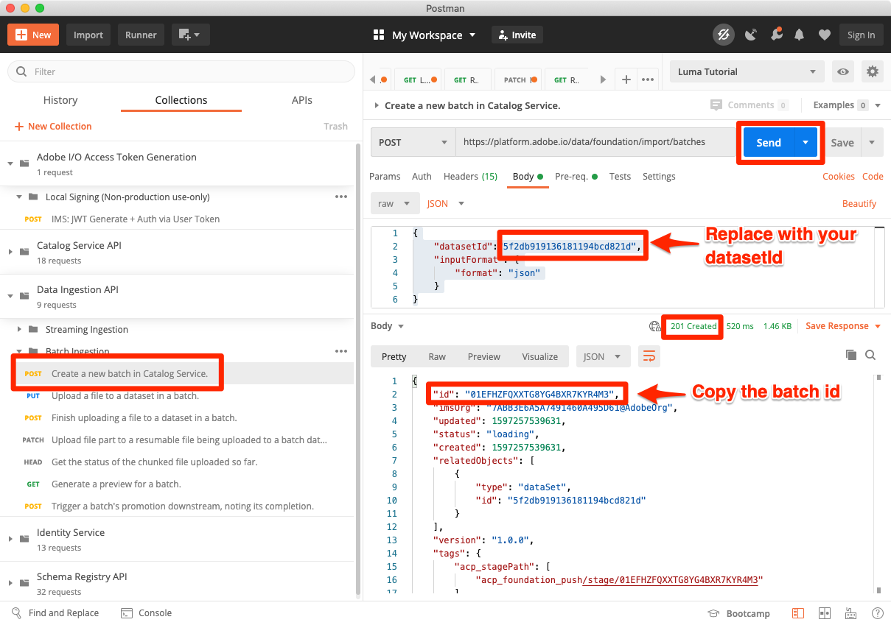

# Batch-Daten erfassen

<!-- 1hr-->
In dieser Lektion erfassen Sie Batch-Daten mit verschiedenen Methoden in Experience Platform.

Mit der Batch-Datenerfassung können Sie eine große Datenmenge gleichzeitig in Adobe Experience Platform erfassen. Sie können Batch-Daten in einem einmaligen Upload innerhalb der Benutzeroberfläche von Platform oder mithilfe der API erfassen. Sie können auch regelmäßig geplante Batch-Uploads von Drittanbieterdiensten wie Cloud-Speicher-Services mithilfe von Source-Connectoren konfigurieren.

**Dateningenieure** müssen Batch-Daten außerhalb dieses Tutorials erfassen.

Bevor Sie mit den Übungen beginnen, sehen Sie sich dieses kurze Video an, um mehr über die Datenerfassung zu erfahren:

>[!VIDEO](https://video.tv.adobe.com/v/27106?learn=on)


## Erforderliche Berechtigungen

In der Lektion [Berechtigungen konfigurieren](configure-permissions.md) richten Sie alle Zugriffssteuerungen ein, die zum Abschluss dieser Lektion erforderlich sind.

<!--
* Permission item **[!UICONTROL Data Management]** > **[!UICONTROL View Datasets]**, **[!UICONTROL Manage Datasets]** and **[!UICONTROL Data Monitoring]**
* Permission items **[!UICONTROL Data Ingestion]** > **[!UICONTROL View Sources]** and **[!UICONTROL Manage Sources]**
* Permission item **[!UICONTROL Profile Management]** > **[!UICONTROL View Profiles]**
* Permission item **[!UICONTROL Sandboxes]** > `Luma Tutorial`
* User-role access to the `Luma Tutorial Platform` product profile
* Developer-role access to the `Luma Tutorial Platform` product profile (for API)
-->

Sie benötigen Zugriff auf einen (S)FTP-Server oder eine Cloud-Speicherlösung für die Quellübung. Es gibt eine Problemumgehung, wenn Sie keine haben.

## Daten in Batches mit der Platform-Benutzeroberfläche erfassen

Daten können direkt in einen Datensatz auf dem Datensatzbildschirm in den Formaten JSON und Parquet hochgeladen werden. Auf diese Weise können Sie die Erfassung einiger Ihrer Daten testen, nachdem Sie eine

### Herunterladen und Vorbereiten der Daten

Rufen Sie zunächst die Beispieldaten ab und passen Sie sie für Ihren Mandanten an:

>[!NOTE]
>
>Die in der Datei [luma-data.zip](assets/luma-data.zip) enthaltenen Daten sind fiktiv und dürfen nur zu Demonstrationszwecken verwendet werden.

1. Laden Sie [luma-data.zip](assets/luma-data.zip) in den Ordner **Luma-Tutorial-Assets** herunter.
1. Dekomprimieren Sie die Datei und erstellen Sie einen Ordner mit dem Namen `luma-data` , der die vier Datendateien enthält, die wir in dieser Lektion verwenden werden
1. Öffnen Sie `luma-loyalty.json` in einem Texteditor und ersetzen Sie alle Instanzen von `_techmarketingdemos` durch Ihre eigene Unterstrich-Mandanten-ID, wie in Ihren eigenen Schemas dargestellt:
   

1. Die aktualisierte Datei speichern

### Daten erfassen

1. Wählen Sie in der Benutzeroberfläche von Platform im linken Navigationsbereich **[!UICONTROL Datensätze]** aus.
1. Öffnen Sie Ihre `Luma Loyalty Dataset`
1. Scrollen Sie nach unten, bis der Abschnitt **[!UICONTROL Daten hinzufügen]** in der rechten Spalte angezeigt wird.
1. Laden Sie die Datei `luma-loyalty.json` hoch.
1. Sobald die Datei hochgeladen wurde, wird eine Zeile für den Batch angezeigt
1. Wenn Sie die Seite nach einigen Minuten neu laden, sollten Sie sehen, dass der Batch mit 1000 Datensätzen und 1000 Profilfragmenten erfolgreich hochgeladen wurde.

   
   <!--do i need to explain error diagnostics and partial ingestion-->

>[!NOTE]
>
>Es gibt einige Optionen, **[!UICONTROL Fehlerdiagnose]** und **[!UICONTROL Partielle Erfassung]**, die auf verschiedenen Bildschirmen in dieser Lektion angezeigt werden. Diese Optionen werden im Tutorial nicht behandelt. Kurzinformationen:
>
>* Durch die Aktivierung der Fehlerdiagnose werden Daten über die Erfassung Ihrer Daten generiert, die Sie dann mithilfe der Data Access API überprüfen können. Weitere Informationen dazu finden Sie in der [Dokumentation](https://experienceleague.adobe.com/docs/experience-platform/data-access/home.html).
>* Partielle Erfassung ermöglicht die Aufnahme von fehlerhaften Daten bis zu einem bestimmten Schwellenwert, den Sie angeben können. Weitere Informationen dazu finden Sie in der [Dokumentation](https://experienceleague.adobe.com/docs/experience-platform/ingestion/batch/partial.html) .

### Daten validieren

Es gibt einige Möglichkeiten, um zu bestätigen, dass die Daten erfolgreich erfasst wurden.

#### Validieren in der Benutzeroberfläche von Platform

So bestätigen Sie, dass die Daten in den Datensatz aufgenommen wurden:

1. Wählen Sie auf derselben Seite, auf der Sie die Daten aufgenommen haben, oben rechts die Schaltfläche **[!UICONTROL Datensatz-Vorschau anzeigen]** aus
1. Wählen Sie die Schaltfläche **Vorschau** aus, um einige der erfassten Daten sehen zu können.

   


So bestätigen Sie, dass die in Profil gelandeten Daten (es kann einige Minuten dauern, bis die Daten landen):

1. Navigieren Sie im linken Navigationsbereich zu **[!UICONTROL Profile]** .
1. Wählen Sie das Symbol neben dem Feld **[!UICONTROL Identitäts-Namespace auswählen]** aus, um das Modal zu öffnen
1. Wählen Sie Ihren `Luma Loyalty Id`-Namespace aus
1. Geben Sie dann einen der `loyaltyId` -Werte aus Ihrem Datensatz ein, `5625458`
1. Wählen Sie **[!UICONTROL Ansicht]**
   

#### Validieren mit Datenerfassungsereignissen

Wenn Sie in der vorherigen Lektion Datenerfassungsereignisse abonniert haben, überprüfen Sie Ihre eindeutige webhook.site-URL. Es sollten drei Anfragen in der folgenden Reihenfolge angezeigt werden, wobei einige Zeit dazwischen liegen und die folgenden `eventCode` -Werte vorliegen:

1. `ing_load_success` - der Batch wie erfasst
1. `ig_load_success` - Der Batch wurde in das Identitätsdiagramm aufgenommen
1. `ps_load_success` - Der Batch wurde in den Profildienst aufgenommen


Weitere Informationen zu den Benachrichtigungen finden Sie in der [Dokumentation](https://experienceleague.adobe.com/docs/experience-platform/ingestion/quality/subscribe-events.html#available-status-notification-events) .

## Daten in Batches mit der Platform-API erfassen

Laden wir nun Daten mithilfe der API hoch.

>[!NOTE]
>
>Datenarchitekten können die CRM-Daten gerne über die Benutzeroberflächenmethode hochladen.

### Herunterladen und Vorbereiten der Daten

1. Sie sollten [luma-data.zip](assets/luma-data.zip) bereits heruntergeladen und in Ihren Ordner `Luma Tutorial Assets` entpackt haben.
2. Öffnen Sie `luma-crm.json` in einem Texteditor und ersetzen Sie alle Instanzen von `_techmarketingdemos` durch Ihre eigene Unterstrich-Mandanten-ID, wie in Ihren Schemas dargestellt.
3. Die aktualisierte Datei speichern

### Abrufen der Datensatz-ID

Zunächst rufen wir die ID der Datensatz-ID des Datensatzes ab, in den wir Daten aufnehmen möchten:

1. Öffnen Sie [!DNL Postman]
1. Wenn Sie kein Zugriffstoken haben, öffnen Sie die Anfrage &quot;**[!DNL OAuth: Request Access Token]**&quot; und wählen Sie &quot;**Senden**&quot;, um ein neues Zugriffstoken anzufordern, wie Sie es in der [!DNL Postman]-Lektion getan haben.
1. Öffnen Sie Ihre Umgebungsvariablen und stellen Sie sicher, dass der Wert von **CONTAINER_ID** immer noch `tenant` ist.
1. Öffnen Sie die Anforderung **[!DNL Catalog Service API > Datasets > Retrieve a list of datasets.]** und wählen Sie **Senden** aus.
1. Sie sollten eine `200 OK` -Antwort erhalten
1. Kopieren Sie die ID von `Luma CRM Dataset` aus dem Antworttext
   

### Erstellen des Batches

Jetzt können wir einen Batch im Datensatz erstellen:

1. Laden Sie [Data Ingestion-API.postman_collection.json](https://raw.githubusercontent.com/adobe/experience-platform-postman-samples/master/apis/experience-platform/Data%20Ingestion%20API.postman_collection.json) in Ihren `Luma Tutorial Assets` -Ordner herunter
1. Importieren der Sammlung in [!DNL Postman]
1. Wählen Sie die Anforderung **[!DNL Data Ingestion API > Batch Ingestion > Create a new batch in Catalog Service.]** aus
1. Fügen Sie Folgendes als **Hauptteil** der Anfrage ein, ***ersetzt den Wert datasetId durch Ihren eigenen***:

   ```json
   {
       "datasetId":"REPLACE_WITH_YOUR_OWN_DATASETID",
       "inputFormat": {
           "format": "json"
       }
   }
   ```

1. Wählen Sie die Schaltfläche **Senden** aus
1. Sie sollten eine 201 Erstellte Antwort mit der ID Ihres neuen Batches erhalten!
1. Kopieren Sie den `id` des neuen Batches
   

### Daten erfassen

Jetzt können wir die Daten in den Batch hochladen:

1. Wählen Sie die Anforderung **[!DNL Data Ingestion API > Batch Ingestion > Upload a file to a dataset in a batch.]** aus
1. Geben Sie auf der Registerkarte **Parameter** Ihre Datensatz-ID und Batch-Kennung in die entsprechenden Felder ein.
1. Geben Sie auf der Registerkarte **Params** `luma-crm.json` als **filePath** ein.
1. Wählen Sie auf der Registerkarte **Textkörper** die Option **binary** aus
1. Wählen Sie die heruntergeladene `luma-crm.json` aus Ihrem lokalen `Luma Tutorial Assets`-Ordner aus
1. Wählen Sie **Senden** aus und Sie sollten eine 200 OK-Antwort mit &quot;1&quot;im Antworttext erhalten

   

Wenn Sie sich an dieser Stelle Ihren Batch in der Benutzeroberfläche von Platform ansehen, sehen Sie, dass er sich in einem &quot;[!UICONTROL Laden]&quot;-Status befindet:


Da die Batch-API häufig zum Hochladen mehrerer Dateien verwendet wird, müssen Sie Platform mitteilen, wann ein Batch abgeschlossen ist, was wir im nächsten Schritt tun werden.

### Stapelverarbeitung durchführen

So schließen Sie den Batch ab:

1. Wählen Sie die Anforderung **[!DNL Data Ingestion API > Batch Ingestion > Finish uploading a file to a dataset in a batch.]** aus
1. Geben Sie auf der Registerkarte **Parameter** `COMPLETE` als **Aktion** ein.
1. Geben Sie auf der Registerkarte **Parameter** Ihre Batch-ID ein. Machen Sie sich keine Gedanken über die Datensatz-ID oder den Dateipfad, sofern diese vorhanden sind.
1. Stellen Sie sicher, dass die URL der POST `https://platform.adobe.io/data/foundation/import/batches/:batchId?action=COMPLETE` lautet und dass keine unnötigen Verweise auf die `datasetId` oder `filePath` vorhanden sind.
1. Wählen Sie **Senden** aus und Sie sollten eine 200 OK-Antwort mit &quot;1&quot;im Antworttext erhalten

   

### Daten validieren

#### Validieren in der Benutzeroberfläche von Platform

Überprüfen Sie, ob die Daten in der Benutzeroberfläche von Platform gelandet sind, genau wie beim Loyalitätsdatensatz.

Bestätigen Sie zunächst, dass der Batch zeigt, dass 1000 Datensätze erfasst wurden:


Bestätigen Sie dann den Batch mit Vorschau des Datensatzes:


Bestätigen Sie abschließend, dass eines Ihrer Profile erstellt wurde, indem Sie eines der Profile durch den Namespace `Luma CRM Id` nachschlagen, z. B. `112ca06ed53d3db37e4cea49cc45b71e`


Es gibt eine interessante Sache, die gerade passiert ist, auf die ich hinweisen möchte. Öffnen Sie dieses `Danny Wright` -Profil. Das Profil hat sowohl einen `Lumacrmid` als auch einen `Lumaloyaltyid`. Beachten Sie, dass der `Luma Loyalty Schema` zwei Identitätsfelder enthielt: &quot;Luma Loyalty Id&quot;und &quot;CRM Id&quot;. Nachdem wir nun beide Datensätze hochgeladen haben, wurden sie zu einem einzigen Profil zusammengeführt. Die Treuedaten enthielten `Daniel` als Vornamen und &quot;New York City&quot;als Hausadresse, während die CRM-Daten `Danny` als Vorname und `Portland` als Hausadresse für den Kunden mit derselben Loyalitäts-ID enthielten. Wir kommen zurück, warum der Vorname in der Lektion zu Zusammenführungsrichtlinien `Danny` anzeigt.

Herzlichen Glückwunsch! Sie haben gerade Profile zusammengeführt!


#### Validieren mit Datenerfassungsereignissen

Wenn Sie in der vorherigen Lektion Datenerfassungsereignisse abonniert haben, überprüfen Sie Ihre eindeutige webhook.site-URL. Es sollten drei Anfragen eingehen, genau wie bei den Treuedaten:


Weitere Informationen zu den Benachrichtigungen finden Sie in der [Dokumentation](https://experienceleague.adobe.com/docs/experience-platform/ingestion/quality/subscribe-events.html#available-status-notification-events) .

## Daten mit Workflows erfassen

Sehen wir uns eine andere Möglichkeit an, Daten hochzuladen. Mit der Workflow-Funktion können Sie CSV-Daten erfassen, die noch nicht in XDM modelliert wurden.

### Herunterladen und Vorbereiten der Daten

1. Sie sollten [luma-data.zip](assets/luma-data.zip) bereits heruntergeladen und in Ihren Ordner `Luma Tutorial Assets` entpackt haben.
1. Vergewissern Sie sich, dass Sie `luma-products.csv` haben.

### Erstellen eines Workflows

Richten wir nun den Workflow ein:

1. Navigieren Sie in der linken Navigation zu **[!UICONTROL Workflows]** .
1. Wählen Sie **[!UICONTROL CSV dem XDM-Schema zuordnen]** und wählen Sie die Schaltfläche **[!UICONTROL Starten]** aus
   
1. Wählen Sie Ihren `Luma Product Catalog Dataset` aus und wählen Sie die Schaltfläche **[!UICONTROL Weiter]** aus.
   
1. Fügen Sie die heruntergeladene Datei `luma-products.csv` hinzu und wählen Sie die Schaltfläche **[!UICONTROL Weiter]** aus
   
1. Jetzt befinden Sie sich in der Zuordnungsschnittstelle, in der Sie ein Feld aus den Quelldaten (einen der Spaltennamen in der `luma-products.csv` -Datei) XDM-Feldern im Zielschema zuordnen können. In unserem Beispiel sind die Spaltennamen so nah wie möglich an den Schemafeldnamen, dass der Mapper die richtige Zuordnung automatisch erkennen kann! Wenn das Mapper das richtige Feld nicht automatisch erkennen konnte, wählen Sie das Symbol rechts neben dem Zielfeld aus, um das richtige XDM-Feld auszuwählen. Wenn Sie eine der Spalten nicht aus der CSV aufnehmen möchten, können Sie die Zeile aus der Zuordnung löschen. Sie können frei spielen und Spaltenüberschriften in der `luma-products.csv` ändern, um sich mit der Funktionsweise des Mappers vertraut zu machen.
1. Wählen Sie die Schaltfläche **[!UICONTROL Beenden]** aus.
   

### Daten validieren

Überprüfen Sie nach dem Hochladen des Batches den Upload durch Vorschau des Datensatzes.

Da der `Luma Product SKU` ein Namespace ohne Personen ist, werden für die Produkt-SKU keine Profile angezeigt.

Sie sollten die drei Treffer in Ihrem Webhook sehen.

## Daten mit Quellen erfassen

Okay, Sie haben Dinge auf die harte Art gemacht. Lassen Sie uns nun in das versprochene Land der Batch-Erfassung von _automated_ wechseln! Wenn ich sage: &quot;SETZEN SIE ES!&quot; Sie sagen: &quot;VERGESSEN SIE ES!&quot; &quot;LEGEN SIE ES FEST!&quot; &quot;VERGESSEN SIE ES!&quot; &quot;LEGEN SIE ES FEST!&quot; &quot;VERGESSEN SIE ES!&quot; Nur ein Scherz! So etwas tätest du nie! OK, zurück zur Arbeit. Du bist fast fertig.

Wechseln Sie im linken Navigationsbereich zu **[!UICONTROL Quellen]** , um den Quellkatalog zu öffnen. Hier finden Sie verschiedene vordefinierte Integrationen mit branchenführenden Daten- und Speicheranbietern.


Okay, lassen Sie uns Daten über einen Quell-Connector erfassen.

Diese Übung wird Ihr eigenes Abenteuer-Stil sein. Ich zeige den Workflow über den FTP-Quell-Connector. Sie können entweder einen anderen Quell-Connector für Cloud-Speicher verwenden, den Sie in Ihrem Unternehmen verwenden, oder die JSON-Datei mit der Datensatz-Benutzeroberfläche hochladen, wie wir es mit den Treuedaten getan haben.

Viele der Quellen verfügen über einen ähnlichen Konfigurations-Workflow, in dem Sie:

1. Authentifizierungsdetails eingeben
1. Wählen Sie die zu erfassenden Daten aus
1. Wählen Sie den Platform-Datensatz aus, in den Sie ihn aufnehmen möchten
1. Ordnen Sie die Felder Ihrem XDM-Schema zu.
1. Wählen Sie die Häufigkeit aus, mit der Sie Daten von diesem Speicherort abrufen möchten

>[!NOTE]
>
>Die Offline-Kaufdaten, die wir in dieser Übung verwenden werden, enthalten Zeitdaten. Die Datetime-Daten sollten entweder mit [ISO 8061 formatierte Zeichenfolgen](https://www.iso.org/iso-8601-date-and-time-format.html) (&quot;2018-07-10T15:05:59.000-08:00&quot;) oder mit der Unix-Zeit formatiert in Millisekunden (153126395999999999999999990 sein. 00) und werden bei der Aufnahme in den Ziel-XDM-Typ konvertiert. Weitere Informationen zur Datenkonvertierung und anderen Einschränkungen finden Sie in der [Dokumentation zur Batch Ingestion-API](https://experienceleague.adobe.com/docs/experience-platform/ingestion/batch/api-overview.html#types) .

### Laden Sie die Daten herunter, bereiten Sie sie vor und laden Sie sie in Ihren bevorzugten Cloud-Speicher-Anbieter hoch.

1. Sie sollten [luma-data.zip](assets/luma-data.zip) bereits heruntergeladen und in Ihren Ordner `Luma Tutorial Assets` entpackt haben.
1. Öffnen Sie `luma-offline-purchases.json` in einem Texteditor und ersetzen Sie alle Instanzen von `_techmarketingdemos` durch Ihre eigene Unterstrich-Mandanten-ID, wie in Ihren Schemas dargestellt.
1. Aktualisieren Sie alle Zeitstempel so, dass die Ereignisse im letzten Monat auftreten (suchen Sie beispielsweise nach `"timestamp":"2022-06` und ersetzen Sie Jahr und Monat).
1. Wählen Sie Ihren bevorzugten Cloud-Speicher-Provider aus, um sicherzustellen, dass er im Katalog [!UICONTROL Quellen] verfügbar ist.
1. Laden Sie `luma-offline-purchases.json` an einen Speicherort in Ihrem bevorzugten Cloud-Speicher-Provider hoch.

### Daten an den gewünschten Cloud-Speicherort aufnehmen

1. Filtern Sie in der Benutzeroberfläche von Platform den Katalog [!UICONTROL Quellen] nach **[!UICONTROL Cloud-Speicher]** .
1. Beachten Sie, dass es unter dem `...` bequeme Links zur Dokumentation gibt.
1. Wählen Sie im Feld Ihres bevorzugten Cloud-Speicher-Anbieters die Schaltfläche **[!UICONTROL Konfigurieren]**
   
1. **[!UICONTROL Authentifizierung]** ist der erste Schritt. Geben Sie den Namen für Ihr Konto ein, z. B. `Luma's FTP Account` und Ihre Authentifizierungsdetails. Dieser Schritt sollte für alle Cloud-Speicher-Quellen relativ ähnlich sein, auch wenn die Felder geringfügig variieren können. Nachdem Sie die Authentifizierungsdetails für ein Konto eingegeben haben, können Sie sie für andere Quellverbindungen wiederverwenden, die möglicherweise verschiedene Daten für verschiedene Zeitpläne von anderen Dateien im selben Konto senden
1. Wählen Sie die Schaltfläche **[!UICONTROL Mit Quelle verbinden]** aus.
1. Wenn Platform erfolgreich eine Verbindung zur Source hergestellt hat, wählen Sie die Schaltfläche **[!UICONTROL Weiter]** aus.
   

1. Im Schritt **[!UICONTROL Daten auswählen]** verwendet die Benutzeroberfläche Ihre Anmeldeinformationen, um den Ordner in Ihrer Cloud-Speicherlösung zu öffnen
1. Wählen Sie die Dateien aus, die Sie aufnehmen möchten, z. B. `luma-offline-purchases.json`
1. Wählen Sie als **[!UICONTROL Datenformat]** `XDM JSON` aus.
1. Anschließend können Sie eine Vorschau der JSON-Struktur und der Beispieldaten in Ihrer Datei anzeigen
1. Wählen Sie die Schaltfläche **[!UICONTROL Weiter]** aus
   

1. Wählen Sie im Schritt **[!UICONTROL Zuordnung]** Ihren `Luma Offline Purchase Events Dataset` aus und wählen Sie die Schaltfläche **[!UICONTROL Weiter]** aus. Beachten Sie in der Nachricht, dass es keinen Zuordnungsschritt gibt, durch den das Quellfeld dem Zielfeld zugeordnet wird, da es sich bei den erfassten Daten um eine JSON-Datei handelt. JSON-Daten müssen sich bereits in XDM befinden. Wenn Sie eine CSV-Datei erfassen, sehen Sie in diesem Schritt die vollständige Zuordnungs-Benutzeroberfläche:
   
1. Wählen Sie im Schritt **[!UICONTROL Planung]** die Häufigkeit aus, mit der Sie Daten aus der Source erfassen möchten. Nehmen Sie sich einen Moment Zeit, um sich die Optionen anzusehen. Wir werden nur eine einmalige Erfassung durchführen. Lassen Sie also die **[!UICONTROL Häufigkeit]** auf **[!UICONTROL Einmal]** stehen und wählen Sie die Schaltfläche **[!UICONTROL Weiter]** aus:
   
1. Im Schritt **[!UICONTROL Datenfluss-Detail]** können Sie einen Namen für Ihren Datenfluss auswählen, eine optionale Beschreibung eingeben, die Fehlerdiagnose einschalten und die partielle Erfassung aktivieren. Behalten Sie die Einstellungen bei und wählen Sie die Schaltfläche **[!UICONTROL Weiter]** aus:
   
1. Im Schritt **[!UICONTROL Überprüfen]** können Sie alle Einstellungen zusammen überprüfen und sie entweder bearbeiten oder die Schaltfläche **[!UICONTROL Beenden]** auswählen
1. Nach dem Speichern landen Sie auf einem Bildschirm wie diesem:
   

### Daten validieren

Überprüfen Sie nach dem Hochladen des Batches den Upload durch Vorschau des Datensatzes.

Sie sollten die drei Treffer in Ihrem Webhook sehen.

Suchen Sie das Profil mit dem Wert `5625458` erneut im Namespace `loyaltyId` , um zu sehen, ob in ihrem Profil Kaufereignisse vorhanden sind. Sie sollten einen Kauf sehen. Sie können die Details des Kaufs untersuchen, indem Sie **[!UICONTROL JSON anzeigen]** auswählen:


## ETL-Tools

Adobe arbeitet mit mehreren ETL-Anbietern zusammen, um die Datenerfassung in Experience Platform zu unterstützen. Aufgrund der Vielzahl von Drittanbietern wird ETL in diesem Tutorial nicht behandelt. Sie können jedoch einige dieser Ressourcen lesen:

* [Entwickeln von ETL-Integrationen für Adobe Experience Platform](https://experienceleague.adobe.com/docs/experience-platform/etl/home.html)
* [Informatica Adobe Experience Platform Connector-Seite auf Adobe Exchange](https://exchange.adobe.com/experiencecloud.details.101570.informatica-adobe-experience-cloud-connector.html)
* [Informatica-Dokumentation des Adobe Experience Platform Connectors](https://docs.informatica.com/integration-cloud/cloud-data-integration-connectors/current-version/adobe-experience-platform-connector/preface.html)
* [[!DNL Snaplogic] Adobe Experience Platform Snap Pack](https://www.snaplogic.com/resources/videos/august-2020-aep)

## Weitere Ressourcen

* [Dokumentation zur Batch-Erfassung](https://experienceleague.adobe.com/docs/experience-platform/ingestion/batch/overview.html)
* [Referenz zur Batch-Aufnahme-API](https://developer.adobe.com/experience-platform-apis/references/batch-ingestion/)

Jetzt sollen [Stream-Daten mit dem Web SDK](ingest-streaming-data.md)
