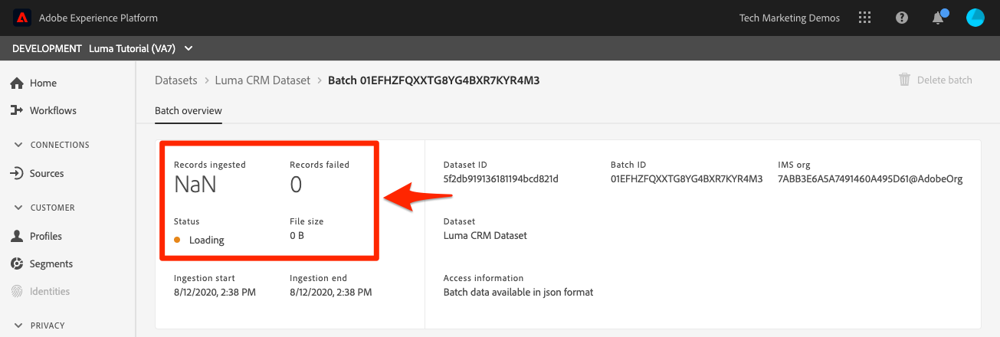

# Batch-Daten erfassen

<!-- 1hr-->
In dieser Lektion nehmen Sie mit verschiedenen Methoden Batch-Daten in Experience Platform auf.

Die Batch-Datenaufnahme ermöglicht es Ihnen, eine große Datenmenge gleichzeitig in Adobe Experience Platform aufzunehmen. Sie können Batch-Daten in einem einmaligen Upload in die Benutzeroberfläche von Platform aufnehmen oder die API verwenden. Sie können auch regelmäßig geplante Batch-Uploads von Drittanbieterdiensten wie Cloud-Speicher-Services mithilfe von Source-Connectoren konfigurieren.

**Dateningenieure** müssen Batch-Daten außerhalb dieses Tutorials aufnehmen.

Bevor Sie mit den Übungen beginnen, sehen Sie sich dieses kurze Video an, um mehr über die Datenaufnahme zu erfahren:

>[!VIDEO](https://video.tv.adobe.com/v/27106?learn=on)


## Erforderliche Berechtigungen

In der Lektion [Berechtigungen konfigurieren](configure-permissions.md) richten Sie alle Zugriffssteuerungen ein, die zum Abschließen dieser Lektion erforderlich sind.

<!--
* Permission item **[!UICONTROL Data Management]** > **[!UICONTROL View Datasets]**, **[!UICONTROL Manage Datasets]** and **[!UICONTROL Data Monitoring]**
* Permission items **[!UICONTROL Data Ingestion]** > **[!UICONTROL View Sources]** and **[!UICONTROL Manage Sources]**
* Permission item **[!UICONTROL Profile Management]** > **[!UICONTROL View Profiles]**
* Permission item **[!UICONTROL Sandboxes]** > `Luma Tutorial`
* User-role access to the `Luma Tutorial Platform` product profile
* Developer-role access to the `Luma Tutorial Platform` product profile (for API)
-->

Sie benötigen Zugriff auf einen (S)FTP-Server oder eine Cloud-Speicherlösung für die Quellübung. Wenn noch keine Problemumgehung vorhanden ist, gibt es eine Problemumgehung.

## Aufnehmen von Daten in Batches mit der Platform-Benutzeroberfläche

Daten können direkt in einen Datensatz auf dem Datensatzbildschirm in den Formaten JSON und Parquet hochgeladen werden. Dies ist eine hervorragende Möglichkeit, die Aufnahme einiger Ihrer Daten zu testen, nachdem Sie ein

### Daten herunterladen und vorbereiten

Rufen Sie zunächst die Beispieldaten ab und passen Sie sie für Ihren Mandanten an:

>[!NOTE]
>
>Die in der Datei [luma-data.zip](assets/luma-data.zip) enthaltenen Daten sind fiktiv und dürfen nur zu Demonstrationszwecken verwendet werden.

1. Laden Sie [luma-data.zip](assets/luma-data.zip) in den Ordner **Luma Tutorial Assets** herunter.
1. Entpacken Sie die Datei und erstellen Sie einen Ordner namens `luma-data`, der die vier Datendateien enthält, die wir in dieser Lektion verwenden werden
1. Öffnen Sie `luma-loyalty.json` in einem Texteditor und ersetzen Sie alle Instanzen von `_techmarketingdemos` durch Ihre eigene Unterstrich-Mandanten-ID, wie in Ihren eigenen Schemata dargestellt:
   

1. Speichern Sie die aktualisierte Datei

### Aufnehmen der Daten

1. Wählen Sie in der Platform-Benutzeroberfläche **[!UICONTROL Datensätze]** im linken Navigationsbereich aus
1. `Luma Loyalty Dataset` öffnen
1. Scrollen Sie nach unten, bis Sie den Abschnitt **[!UICONTROL Daten hinzufügen]** in der rechten Spalte sehen
1. Laden Sie die `luma-loyalty.json` Datei hoch.
1. Nach dem Hochladen der Datei wird eine Zeile für den Batch angezeigt
1. Wenn Sie die Seite nach einigen Minuten erneut laden, sollten Sie sehen, dass der Batch mit 1.000 Datensätzen und 1.000 Profilfragmenten erfolgreich hochgeladen wurde.

   
   <!--do i need to explain error diagnostics and partial ingestion-->

>[!NOTE]
>
>Es gibt einige Optionen, **[!UICONTROL Fehlerdiagnose]** und **[!UICONTROL Partielle Aufnahme]**, die Sie in dieser Lektion auf verschiedenen Bildschirmen sehen werden. Diese Optionen werden im Tutorial nicht behandelt. Einige kurze Informationen:
>
>* Durch Aktivierung der Fehlerdiagnose werden Daten über die Aufnahme Ihrer Daten generiert, die Sie dann mithilfe der Datenzugriffs-API überprüfen können. Weitere Informationen hierzu finden Sie in [der Dokumentation](https://experienceleague.adobe.com/docs/experience-platform/data-access/home.html).
>* Die partielle Aufnahme erlaubt Ihnen, fehlerhafte Daten bis zu einem gewissen Schwellenwert, den Sie angeben können, aufzunehmen. Weitere Informationen hierzu finden Sie in [Dokumentation](https://experienceleague.adobe.com/docs/experience-platform/ingestion/batch/partial.html)

### Validieren der Daten

Es gibt einige Möglichkeiten, um zu bestätigen, dass die Daten erfolgreich aufgenommen wurden.

#### Validieren in der Platform-Benutzeroberfläche

So bestätigen Sie, dass die Daten in den Datensatz aufgenommen wurden:

1. Klicken Sie auf der Seite, auf der Sie die Daten aufgenommen haben **[!UICONTROL oben rechts auf]** Schaltfläche „Datensatz in Vorschau anzeigen“
1. Klicken Sie auf **Vorschau** und Sie sollten einige der aufgenommenen Daten sehen können.

   


So bestätigen Sie, dass die Daten im Profil landen (es kann einige Minuten dauern, bis die Daten landen):

1. Navigieren Sie **[!UICONTROL linken Navigationsbereich]** Profile“.
1. Klicken Sie auf das Symbol neben dem Feld **[!UICONTROL Identity-Namespace auswählen]**, um das Modal zu öffnen
1. `Luma Loyalty Id` Namespace auswählen
1. Geben Sie dann einen der `loyaltyId` Werte aus Ihrem Datensatz ein, `5625458`
1. Wählen Sie **[!UICONTROL Ansicht]**
   

#### Validieren mit Datenerfassungsereignissen

Wenn Sie in der vorherigen Lektion Datenerfassungsereignisse abonniert haben, überprüfen Sie Ihre eindeutige Webhook.site-URL. Es sollten drei Anfragen in der folgenden Reihenfolge und mit etwas Zeit dazwischen mit den folgenden `eventCode` angezeigt werden:

1. `ing_load_success` - Der Batch wird aufgenommen
1. `ig_load_success` - Der Batch wurde in das Identitätsdiagramm aufgenommen
1. `ps_load_success` - Der Batch wurde in den Profil-Service aufgenommen


Weitere Informationen zu den [ finden ](https://experienceleague.adobe.com/docs/experience-platform/ingestion/quality/subscribe-events.html#available-status-notification-events) in der (Dokumentation).

## Daten mit der Platform-API in Batches aufnehmen

Laden wir jetzt Daten mit der API hoch.

>[!NOTE]
>
>Datenarchitekten können die CRM-Daten über die Methode der Benutzeroberfläche hochladen.

### Daten herunterladen und vorbereiten

1. Sie sollten „luma-data.zip[ bereits heruntergeladen und in ](assets/luma-data.zip) Ordner &quot;`Luma Tutorial Assets`&quot; entpackt haben.
2. Öffnen Sie `luma-crm.json` in einem Texteditor und ersetzen Sie alle Instanzen von `_techmarketingdemos` durch Ihre eigene Unterstrich-Mandanten-ID, wie in Ihren Schemata dargestellt
3. Speichern Sie die aktualisierte Datei

### Datensatz-ID abrufen

Als Erstes rufen wir die ID der Datensatz-ID des Datensatzes ab, in den wir Daten aufnehmen möchten:

1. [!DNL Postman] öffnen
1. Wenn Sie kein Zugriffs-Token haben, öffnen Sie die **[!DNL OAuth: Request Access Token]** und wählen Sie **Senden** aus, um ein neues Zugriffs-Token anzufordern, genau wie Sie es in der [!DNL Postman] Lektion getan haben.
1. Öffnen Sie die Umgebungsvariablen und stellen Sie sicher, dass der Wert **CONTAINER_ID** weiterhin `tenant` ist
1. Öffnen Sie die **[!DNL Catalog Service API > Datasets > Retrieve a list of datasets.]** und wählen Sie **Senden**
1. Sie sollten eine `200 OK` Antwort erhalten
1. Kopieren Sie die ID der `Luma CRM Dataset` aus dem Antworttext
   

### Erstellen eines Batches

Jetzt können wir einen Batch im Datensatz erstellen:

1. Laden Sie [Datenaufnahme-API.postman_collection.json](https://raw.githubusercontent.com/adobe/experience-platform-postman-samples/master/apis/experience-platform/Data%20Ingestion%20API.postman_collection.json) in Ihren `Luma Tutorial Assets` Ordner herunter
1. Importieren der Sammlung in [!DNL Postman]
1. **[!DNL Data Ingestion API > Batch Ingestion > Create a new batch in Catalog Service.]** auswählen
1. Fügen Sie Folgendes als **Hauptteil** der Anfrage ein ***ersetzen Sie den Wert datasetId durch Ihren eigenen***:

   ```json
   {
       "datasetId":"REPLACE_WITH_YOUR_OWN_DATASETID",
       "inputFormat": {
           "format": "json"
       }
   }
   ```

1. Klicken Sie auf die **Senden**-Schaltfläche
1. Sie sollten eine 201-Antwort erhalten, die die ID Ihres neuen Batches enthält!
1. `id` des neuen Stapels kopieren
   

### Aufnehmen der Daten

Jetzt können wir die Daten in den Batch hochladen:

1. **[!DNL Data Ingestion API > Batch Ingestion > Upload a file to a dataset in a batch.]** auswählen
1. Geben Sie auf **Registerkarte** Ihre Datensatz-ID und Batch-ID in die entsprechenden Felder ein
1. Geben **auf der** „Parameter“ `luma-crm.json` als **filePath**
1. Wählen Sie auf **Registerkarte** die Option **binär** aus
1. Wählen Sie die heruntergeladene `luma-crm.json` aus Ihrem lokalen `Luma Tutorial Assets` aus
1. Wählen Sie **Senden** und Sie sollten eine Antwort von 200 OK mit „1“ im Antworttext erhalten

   

Wenn Sie sich jetzt den Batch in der Platform-Benutzeroberfläche ansehen, sehen Sie, dass er den Status &quot;[!UICONTROL &quot; ]:


Da die Batch-API häufig zum Hochladen mehrerer Dateien verwendet wird, müssen Sie Platform mitteilen, wann ein Batch abgeschlossen ist, was wir im nächsten Schritt tun werden.

### Vervollständigen des Batches

Abschließen des Batches:

1. **[!DNL Data Ingestion API > Batch Ingestion > Finish uploading a file to a dataset in a batch.]** auswählen
1. Geben Sie auf **Registerkarte** Parameter`COMPLETE` als **Aktion**
1. Geben **auf der Registerkarte** Parameter“ Ihre Batch-ID ein. Machen Sie sich keine Gedanken über die Datensatz-ID oder den Dateipfad, falls vorhanden.
1. Vergewissern Sie sich, dass die URL der POST `https://platform.adobe.io/data/foundation/import/batches/:batchId?action=COMPLETE` ist und dass es keine unnötigen Verweise auf die `datasetId` oder `filePath` gibt
1. Wählen Sie **Senden** und Sie sollten eine Antwort von 200 OK mit „1“ im Antworttext erhalten

   

### Validieren der Daten

#### Validieren in der Platform-Benutzeroberfläche

Überprüfen Sie, ob die Daten in der Platform-Benutzeroberfläche gelandet sind, genau wie Sie es für den Treueprogramm-Datensatz getan haben.

Bestätigen Sie zunächst, dass der Batch anzeigt, dass 1000 Datensätze aufgenommen wurden:


Bestätigen Sie als Nächstes den Batch mithilfe des Vorschau-Datensatzes:


Bestätigen Sie abschließend, dass eines Ihrer Profile erstellt wurde, indem Sie eines der Profile anhand des `Luma CRM Id` Namespace nachschlagen, z. B. `112ca06ed53d3db37e4cea49cc45b71e`


Es gibt eine interessante Sache, die gerade passiert ist, auf die ich hinweisen möchte. Öffnen Sie dieses `Danny Wright`. Das Profil hat sowohl eine `Lumacrmid` als auch eine `Lumaloyaltyid`. Denken Sie daran, dass die `Luma Loyalty Schema` zwei Identitätsfelder enthielt, Luma-Treue-ID und CRM-ID. Nachdem wir nun beide Datensätze hochgeladen haben, wurden sie zu einem einzigen Profil zusammengeführt. Die Treuedaten hatten als Vornamen und „New York City“ als Wohnadresse `Daniel`, während die CRM-Daten als Vorname und `Portland` als Wohnadresse für den Kunden mit derselben Treueprogramm-ID `Danny` hatten. Wir werden in der Lektion über Zusammenführungsrichtlinien darauf zurückkommen, warum der Vorname `Danny` angezeigt wird.

Herzlichen Glückwunsch, Sie haben soeben Profile zusammengeführt!


#### Validieren mit Datenerfassungsereignissen

Wenn Sie in der vorherigen Lektion Datenerfassungsereignisse abonniert haben, überprüfen Sie Ihre eindeutige Webhook.site-URL. Es sollten drei Anfragen eingehen, genau wie bei den Treueprogramm-Daten:


Weitere Informationen zu den [ finden ](https://experienceleague.adobe.com/docs/experience-platform/ingestion/quality/subscribe-events.html#available-status-notification-events) in der (Dokumentation).

## Aufnehmen von Daten mit Workflows

Sehen wir uns eine andere Möglichkeit zum Hochladen von Daten an. Mit der Workflow-Funktion können Sie CSV-Daten aufnehmen, die nicht bereits in XDM modelliert sind.

### Daten herunterladen und vorbereiten

1. Sie sollten „luma-data.zip[ bereits heruntergeladen und in ](assets/luma-data.zip) Ordner &quot;`Luma Tutorial Assets`&quot; entpackt haben.
1. Vergewissern Sie sich, dass Sie Folgendes haben`luma-products.csv`

### Erstellen eines Workflows

Richten wir nun einen Workflow ein:

1. Navigieren Sie **[!UICONTROL linken Navigationsbereich]** Workflows“.
1. Wählen Sie **[!UICONTROL CSV zu XDM-Schema zuordnen]** und klicken Sie auf die Schaltfläche **[!UICONTROL Starten]**.
   
1. Wählen Sie Ihre `Luma Product Catalog Dataset` aus und klicken Sie auf die Schaltfläche **[!UICONTROL Weiter]**
   
1. Fügen Sie die heruntergeladene `luma-products.csv` hinzu und klicken Sie auf die Schaltfläche **[!UICONTROL Weiter]**.
   
1. Jetzt befinden Sie sich in der Mapper-Oberfläche, in der Sie ein Feld aus den Quelldaten (einen der Spaltennamen in der `luma-products.csv`-Datei) XDM-Feldern im Zielschema zuordnen können. In unserem Beispiel liegen die Spaltennamen nahe genug an den Schemafeldnamen, dass der Mapper die richtige Zuordnung automatisch erkennen kann! Wenn der Mapper das rechte Feld nicht automatisch erkennen konnte, würden Sie auf das Symbol rechts neben dem Zielfeld klicken, um das richtige XDM-Feld auszuwählen. Wenn Sie keine der Spalten aus der CSV-Datei aufnehmen möchten, können Sie die Zeile aus dem Mapper löschen. Sie können gerne herumspielen und Spaltenüberschriften im `luma-products.csv` ändern, um sich mit der Funktionsweise des Mappers vertraut zu machen.
1. Klicken Sie auf die **[!UICONTROL Beenden]**.
   

### Validieren der Daten

Wenn der Batch hochgeladen wurde, überprüfen Sie den Upload, indem Sie eine Vorschau des Datensatzes anzeigen.

Da es sich bei dem `Luma Product SKU` um einen Namespace handelt, der nicht für Personen bestimmt ist, werden für die Produkt-SKUs keine Profile angezeigt.

Sie sollten die drei Treffer für Ihren Webhook sehen.

## Aufnehmen von Daten mit Quellen

Okay, du hast es auf die harte Tour geschafft. Lassen Sie uns nun in das gelobte Land der _automatisierten_ Batch-Aufnahme eintauchen! Wenn ich sage: „SETZ ES!“ Sie sagen: „VERGISS ES!“ „LEGEN SIE ES FEST!“ „VERGISS ES!“ „LEGEN SIE ES FEST!“ „VERGISS ES!“ Nur ein Scherz! So etwas würdest du nie machen! Ok, zurück an die Arbeit. Du bist fast fertig.

Navigieren Sie **[!UICONTROL linken]** zu „Quellen“, um den Quellkatalog zu öffnen. Hier sehen Sie verschiedene vorkonfigurierte Integrationen mit branchenführenden Daten- und Speicheranbietern.


Okay, nehmen wir Daten über einen Quell-Connector auf.

Diese Übung wird im Stil „Wählen Sie Ihr eigenes Abenteuer“ durchgeführt. Ich werde den Workflow mithilfe des FTP-Quell-Connectors anzeigen. Sie können entweder einen anderen Cloud-Speicher-Quell-Connector verwenden, den Sie in Ihrem Unternehmen verwenden, oder die JSON-Datei mithilfe der Datensatz-Benutzeroberfläche hochladen, wie wir es bei den Treuedaten getan haben.

Viele Quellen verfügen über einen ähnlichen Konfigurations-Workflow, in dem Sie:

1. Authentifizierungsdetails eingeben
1. Wählen Sie die Daten aus, die Sie aufnehmen möchten
1. Wählen Sie den Platform-Datensatz aus, in den Sie ihn aufnehmen möchten
1. Zuordnen der Felder zu Ihrem XDM-Schema
1. Wählen Sie die Häufigkeit, mit der Sie Daten von diesem Speicherort erneut aufnehmen möchten

>[!NOTE]
>
>Die Offline-Kaufdaten, die wir in dieser Übung verwenden werden, enthalten Datums-/Uhrzeitdaten. Datetime-Daten sollten entweder in [ISO 8061-formatierten Zeichenfolgen](https://www.iso.org/iso-8601-date-and-time-format.html) („2018-07-10T15:05:59.000-08:00„) oder in Unix-Zeit in Millisekunden (1531263959000) formatiert sein und zur Aufnahmezeit in den Ziel-XDM-Typ konvertiert werden. Weitere Informationen zur Datenkonvertierung und zu anderen Einschränkungen finden Sie unter [Dokumentation zur Batch-Aufnahme-API](https://experienceleague.adobe.com/docs/experience-platform/ingestion/batch/api-overview.html#types).

### Herunterladen, Vorbereiten und Hochladen der Daten an Ihren bevorzugten Cloud-Speicheranbieter

1. Sie sollten „luma-data.zip[ bereits heruntergeladen und in ](assets/luma-data.zip) Ordner &quot;`Luma Tutorial Assets`&quot; entpackt haben.
1. Öffnen Sie `luma-offline-purchases.json` in einem Texteditor und ersetzen Sie alle Instanzen von `_techmarketingdemos` durch Ihre eigene Unterstrich-Mandanten-ID, wie in Ihren Schemata dargestellt
1. Aktualisieren Sie alle Zeitstempel, sodass die Ereignisse im letzten Monat auftreten (suchen Sie beispielsweise nach `"timestamp":"2022-06` und ersetzen Sie Jahr und Monat)
1. Wählen Sie Ihren bevorzugten Cloud-Speicheranbieter aus und stellen Sie sicher, dass er im [!UICONTROL Quellen“ ] ist
1. Laden Sie `luma-offline-purchases.json` an einen Speicherort in Ihrem bevorzugten Cloud-Speicheranbieter hoch

### Aufnehmen der Daten an Ihrem bevorzugten Cloud-Speicherort

1. Filtern Sie in der Platform-Benutzeroberfläche den [!UICONTROL Quellen]-Katalog nach **[!UICONTROL Cloud-Speicher]**
1. Beachten Sie, dass unter der `...` praktische Links zur -Dokumentation vorhanden sind
1. Klicken Sie im Feld Ihres bevorzugten Cloud-Speicheranbieters auf die Schaltfläche **[!UICONTROL Konfigurieren]**.
   
1. **[!UICONTROL Authentifizierung]** ist der erste Schritt. Geben Sie den Namen für Ihr Konto ein, z. B. `Luma's FTP Account` und Ihre Authentifizierungsdetails. Dieser Schritt sollte für alle Cloud-Speicherquellen ziemlich ähnlich sein, obwohl die Felder leicht variieren können. Nachdem Sie die Authentifizierungsdetails für ein Konto eingegeben haben, können Sie sie für andere Quellverbindungen wiederverwenden, die möglicherweise andere Daten in unterschiedlichen Zeitplänen als andere Dateien im selben Konto senden
1. Klicken Sie auf die **[!UICONTROL Mit Quelle verbinden]**
1. Wenn Platform erfolgreich eine Verbindung zur Source hergestellt hat, klicken Sie auf die Schaltfläche **[!UICONTROL Weiter]**.
   

1. Im Schritt **[!UICONTROL Daten auswählen]** verwendet die Benutzeroberfläche Ihre Anmeldeinformationen, um den Ordner in Ihrer Cloud-Speicherlösung zu öffnen
1. Wählen Sie die Dateien aus, die Sie aufnehmen möchten, z. B. `luma-offline-purchases.json`
1. Wählen Sie als **[!UICONTROL Datenformat]** die Option `XDM JSON`
1. Sie können dann eine Vorschau der JSON-Struktur und der Beispieldaten in Ihrer Datei anzeigen
1. Klicken Sie auf **[!UICONTROL Weiter]**-Schaltfläche
   

1. Wählen **[!UICONTROL im Schritt]** Zuordnung“ Ihre `Luma Offline Purchase Events Dataset` aus und klicken Sie auf die Schaltfläche **[!UICONTROL Weiter]**. Beachten Sie in der Nachricht, dass es keinen Zuordnungsschritt gibt, bei dem wir das Quellfeld einem Zielfeld zuordnen, da die Daten, die wir aufnehmen, eine JSON-Datei sind. JSON-Daten müssen bereits in XDM vorhanden sein. Wenn Sie eine CSV-Datei erfassen, wird in diesem Schritt die vollständige Benutzeroberfläche der Zuordnung angezeigt:
   
1. Im Schritt **[!UICONTROL Planung]** wählen Sie die Häufigkeit, mit der Sie Daten aus der Source erneut aufnehmen möchten. Nehmen Sie sich einen Moment Zeit, um sich die Optionen anzusehen. Wir führen nur eine einmalige Aufnahme durch. Lassen Sie also die **[!UICONTROL Häufigkeit]** auf **[!UICONTROL Einmal]** und wählen Sie die Schaltfläche **[!UICONTROL Weiter]**:
   
1. Im Schritt **[!UICONTROL Datenflussdetails]** können Sie einen Namen für Ihren Datenfluss auswählen, eine optionale Beschreibung eingeben, die Fehlerdiagnose aktivieren und eine partielle Aufnahme durchführen. Behalten Sie die Einstellungen bei und klicken Sie auf die Schaltfläche **[!UICONTROL Weiter]**:
   
1. Im Schritt **[!UICONTROL Überprüfen]** können Sie alle Ihre Einstellungen zusammen überprüfen und entweder bearbeiten oder auf die Schaltfläche **[!UICONTROL Beenden]** klicken
1. Nach dem Speichern landen Sie auf einem Bildschirm wie diesem:
   

### Validieren der Daten

Wenn der Batch hochgeladen wurde, überprüfen Sie den Upload, indem Sie eine Vorschau des Datensatzes anzeigen.

Sie sollten die drei Treffer für Ihren Webhook sehen.

Suchen Sie erneut das Profil mit dem Wert `5625458` im `loyaltyId`-Namespace, um festzustellen, ob es Kaufereignisse in seinem Profil gibt. Es sollte nur ein Kauf angezeigt werden. Sie können die Details des Kaufs einsehen, indem Sie auf **[!UICONTROL JSON anzeigen]** klicken:


## ETL-Tools

Adobe arbeitet mit mehreren ETL-Anbietern zusammen, um die Datenaufnahme in Experience Platform zu unterstützen. Aufgrund der Vielzahl von Drittanbietern wird ETL in diesem Tutorial nicht behandelt. Sie können jedoch gerne einige dieser Ressourcen lesen:

* [Entwickeln von ETL-Integrationen für Adobe Experience Platform](https://experienceleague.adobe.com/docs/experience-platform/etl/home.html)
* [Informatica Adobe Experience Platform Connector-Seite auf Adobe Exchange ](https://exchange.adobe.com/experiencecloud.details.101570.informatica-adobe-experience-cloud-connector.html)
* [Informatica-Dokumentation zum Adobe Experience Platform-Connector](https://docs.informatica.com/integration-cloud/cloud-data-integration-connectors/current-version/adobe-experience-platform-connector/preface.html)
* [[!DNL Snaplogic] Adobe Experience Platform Snap Pack](https://www.snaplogic.com/resources/videos/august-2020-aep)

## Weitere Ressourcen

* [Dokumentation zur Batch-Aufnahme](https://experienceleague.adobe.com/docs/experience-platform/ingestion/batch/overview.html)
* [Referenz zur Batch-Aufnahme-API](https://developer.adobe.com/experience-platform-apis/references/batch-ingestion/)

Jetzt lassen Sie uns [Daten mit der Web-SDK streamen](ingest-streaming-data.md)
