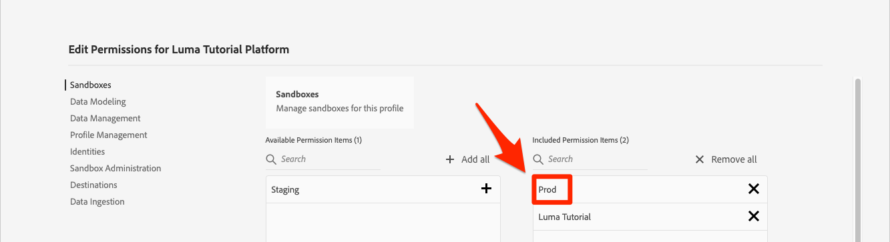

# Streaming-Daten erfassen

<!--1hr-->

In dieser Lektion streamen Sie Daten mit dem Adobe Experience Platform Web SDK.

In der Datenerfassungsoberfläche müssen wir zwei Hauptaufgaben erledigen:

* Wir müssen das Web SDK auf der Luma-Website implementieren, um Daten über Besucheraktivitäten von der Website an das Adobe Edge-Netzwerk zu senden. Wir führen eine einfache Implementierung mithilfe von Tags (früher Launch) durch.

* Wir müssen einen Datastream konfigurieren, der dem Edge-Netzwerk mitteilt, wohin die Daten weitergeleitet werden sollen. Wir werden es so konfigurieren, dass Daten an unsere `Luma Web Events` -Datensatz in unserer Platform-Sandbox.

**Dateningenieure** müssen Streaming-Daten außerhalb dieses Tutorials erfassen. Bei der Implementierung von Web- oder Mobile-SDKs von Adobe Experience Platform ist normalerweise ein Web- oder Mobilentwickler an der Erstellung von Datenschichten und der Konfiguration von Tag-Eigenschaften beteiligt.

Bevor Sie mit den Übungen beginnen, sehen Sie sich diese beiden kurzen Videos an, um mehr über die Erfassung von Streaming-Daten und das Web SDK zu erfahren:
>[!VIDEO](https://video.tv.adobe.com/v/28425?quality=12&learn=on)

>[!VIDEO](https://video.tv.adobe.com/v/34141?quality=12&learn=on)

>[!NOTE]
>
>Während dieses Tutorial die Streaming-Erfassung von Websites mit Web SDK zum Schwerpunkt hat, können Sie Daten auch mithilfe der [Adobe Mobile SDK](https://aep-sdks.gitbook.io/), [Apache Kafka Connect](https://github.com/adobe/experience-platform-streaming-connect)und anderen Mechanismen.

## Erforderliche Berechtigungen

Im [Berechtigungen konfigurieren](configure-permissions.md) Lektion erstellen Sie alle Zugriffssteuerungen, die zum Abschluss dieser Lektion erforderlich sind.

<!--
* Permission items **[!UICONTROL Launch]** > **[!UICONTROL Property Rights]** > **[!UICONTROL Approve]**, **[!UICONTROL Develop]**, **[!UICONTROL Manage Environments]**, **[!UICONTROL Manage Extensions]**, and **[!UICONTROL Publish]**
* Permission item **[!UICONTROL Launch]** > **[!UICONTROL Company Rights]** > **[!UICONTROL Manage Properties]**
* User-role access to the `Luma Tutorial Launch` product profile
* Admin-role access to the `Luma Tutorial Launch` product profile
* Permission items **[!UICONTROL Platform]** > **[!UICONTROL Data Ingestion]** > **[!UICONTROL View Sources]** and **[!UICONTROL Manage Sources]**
* Permission items **[!UICONTROL Platform]** > **[!UICONTROL Data Management]** > **[!UICONTROL View Datasets]** and **[!UICONTROL Manage Datasets]**
* Permission items **[!UICONTROL Platform]** > **[!UICONTROL Profiles]** > **[!UICONTROL View Profiles]**, **[!UICONTROL Manage Profiles]** and **[!UICONTROL Export Audience Segment]**
* Permission item **[!UICONTROL Platform]** > **[!UICONTROL Sandbox Administration]** > **[!UICONTROL View Sandboxes]**
* Permission item **[!UICONTROL Platform]** > **[!UICONTROL Sandboxes]** > `Luma Tutorial`
* User-role access to the `Luma Tutorial Platform` product profile
-->

<!--## Create a streaming source

1. Log into the [Experience Platform  user interface](https://experience.adobe.com/platform/)
1. Go to **[!UICONTROL Sources]** in the left navigation
1. Filter the list by selecting **[!UICONTROL Streaming]**
1. In the **[!UICONTROL HTTP API]** section, select the **[!UICONTROL Configure]** button
    
1. On the **[!UICONTROL Authentication]** step, enter `Luma Web Events Source` as the **[!UICONTROL Account name]** and select the **[!UICONTROL Connect to source]** button (we don't need to enable authentication since the data will be originating from website visitors)
    
1. Once connected, select the **[!UICONTROL Next]** button to proceed to the next step in the workflow
1. On the **[!UICONTROL Select data]** step, choose **[!UICONTROL Existing Dataset]**, select your `Luma Web Events Dataset`, and then select the **[!UICONTROL Next]** button
    
1. On the **[!UICONTROL Dataflow detail]** step, select the **[!UICONTROL Next]** button:
    
    <!--What is a good practice for naming the data flow vs the source-->
<!--
1. On the **[!UICONTROL Review]** step, review your source details and select the **[!UICONTROL Finish]** button:
    
-->

## Konfigurieren des Datenspeichers

Zuerst konfigurieren wir den Datastream. Ein Datastream teilt dem Adobe Edge-Netzwerk mit, wohin die Daten nach dem Erhalt vom Web SDK-Aufruf gesendet werden sollen. Möchten Sie die Daten beispielsweise an Experience Platform, Adobe Analytics oder Adobe Target senden? Datenspeicher werden in der Benutzeroberfläche für die Datenerfassung (früher Launch) verwaltet und sind für die Datenerfassung mit dem Web SDK von entscheidender Bedeutung.

So erstellen Sie Ihre [!UICONTROL datastream]:

1. Melden Sie sich bei der [Benutzeroberfläche der Datenerfassung von Experience Platform](https://experience.adobe.com/launch/)

   <!--when will the edge config go live?-->

1. Auswählen **[!UICONTROL Datenspeicher]** in der linken Navigation
1. Wählen Sie die **[!UICONTROL Neuer Datenspeicher]** Schaltfläche in der oberen rechten Ecke

   

1. Für **[!UICONTROL Anzeigename]**, eingeben `Luma Platform Tutorial` (Fügen Sie am Ende Ihren Namen hinzu, wenn mehrere Personen aus Ihrem Unternehmen dieses Tutorial absolvieren)
1. Klicken Sie auf die Schaltfläche **[!UICONTROL Speichern]**

   

Geben Sie im nächsten Bildschirm an, wohin Daten gesendet werden sollen. So senden Sie Daten an Experience Platform:

1. Aktivieren **[!UICONTROL Adobe Experience Platform]** um zusätzliche Felder verfügbar zu machen
1. Für **[!UICONTROL Sandbox]** auswählen `Luma Tutorial`
1. Für **[!UICONTROL Ereignis-Datensatz]** auswählen `Luma Web Events Dataset`
1. Wenn Sie andere Adobe-Applikationen verwenden, sollten Sie sich die anderen Abschnitte ansehen, um zu sehen, welche Informationen in der Edge-Konfiguration dieser anderen Lösungen erforderlich sind. Beachten Sie, dass das Web SDK nicht nur zum Streamen von Daten in Experience Platform entwickelt wurde, sondern auch zum Ersetzen aller vorherigen JavaScript-Bibliotheken, die von anderen Adobe Apps verwendet wurden. Die Edge-Konfiguration wird verwendet, um die Kontodetails jeder Anwendung anzugeben, an die Sie die Daten senden möchten.
1. Wählen Sie **[!UICONTROL Speichern]** aus

   

Nachdem die Edge-Konfiguration gespeichert wurde, werden im resultierenden Bildschirm drei Umgebungen für Entwicklung, Staging und Produktion erstellt. Zusätzliche Entwicklungsumgebungen können hinzugefügt werden:

Alle drei Umgebungen enthalten die Plattformdetails, die Sie eingegeben haben. Diese Details können jedoch je Umgebung unterschiedlich konfiguriert werden. Sie können beispielsweise festlegen, dass jede Umgebung Daten an eine andere Platform-Sandbox sendet. In diesem Tutorial werden wir keine zusätzlichen Anpassungen an unseren Datastream vornehmen.

## Installieren der Web SDK-Erweiterung

### Eigenschaft hinzufügen

Zuerst müssen wir eine Tag-Eigenschaft erstellen (ehemals eine Tag-Eigenschaft). Eine Eigenschaft ist ein Container für alle JavaScript-, Regeln- und anderen Funktionen, die zum Erfassen von Details von einer Webseite und zum Senden an verschiedene Speicherorte erforderlich sind.

So erstellen Sie eine Eigenschaft:

1. Navigieren Sie zu **[!UICONTROL Eigenschaften]** in der linken Navigation
1. Klicken Sie auf die Schaltfläche **[!UICONTROL Neue Eigenschaft]**
   
1. Als **[!UICONTROL Name]**, eingeben `Luma Platform Tutorial` (Fügen Sie am Ende Ihren Namen hinzu, wenn mehrere Personen aus Ihrem Unternehmen dieses Tutorial absolvieren)
1. Als **[!UICONTROL Domänen]**, eingeben `enablementadobe.com` (später erklärt)
1. Wählen Sie **[!UICONTROL Speichern]** aus

   

<!--
After saving the property, you might see an error message like the one below. If so, this is because you don't actually have access to the property you just created. To fix this, we need to go to the Admin Console to give yourself access:
    

To give yourself access to the property:

1. In a separate browser tab, log into the [Admin Console](https://adminconsole.adobe.com/)
1. Go to **[!UICONTROL Products]** from the top navigation
1. Select **[!UICONTROL Adobe Experience Platform Launch]** on the left navigation
1. Go to your `Luma Tutorial Launch` product profile
1. Go to the **[!UICONTROL Permissions]** tab
1. On the **[!UICONTROL Properties]** row, select **[!UICONTROL Edit]**
    
1. Select the "+" icon to move your `Luma Platform Tutorial` property to the right-hand side and select the **[!UICONTROL Save]** button to update the permissions
   
    

Now switch back to your browser tab with the Data Collection interface still open. Reload the page and the `Luma Platform Tutorial` property should display in the list. Select to open the property:

-->

## Web SDK-Erweiterung hinzufügen

Nachdem Sie jetzt über eine Eigenschaft verfügen, können Sie das Web SDK mithilfe einer Erweiterung hinzufügen. Eine Erweiterung ist ein Paket mit Code, das die Datenerfassungsoberfläche und -funktion erweitert. Hinzufügen der Erweiterung:

1. Öffnen Sie die Tag-Eigenschaft
1. Navigieren Sie zu **[!UICONTROL Erweiterungen]** in der linken Navigation
1. Navigieren Sie zu **[!UICONTROL Katalog]** tab
1. Für Tags stehen viele Erweiterungen zur Verfügung. Filtern des Katalogs nach dem Begriff `Web SDK`
1. Im **[!UICONTROL Adobe Experience Platform Web SDK]** Erweiterung, wählen Sie die **[!UICONTROL Installieren]** button
   
1. Es sind mehrere Konfigurationen für die Web SDK-Erweiterung verfügbar, aber es gibt nur zwei, die wir für dieses Tutorial konfigurieren werden. Aktualisieren Sie die **[!UICONTROL Edge-Domäne]** nach `data.enablementadobe.com`. Mit dieser Einstellung können Sie Erstanbieter-Cookies in Ihrer Web SDK-Implementierung setzen. Dies wird empfohlen. Später in dieser Lektion werden Sie eine Website auf der `enablementadobe.com` Domäne zu Ihrer Tag-Eigenschaft hinzufügen. Der CNAME für die `enablementadobe.com` -Domäne bereits konfiguriert wurde, sodass `data.enablementadobe.com` leitet an Adobe-Server weiter. Wenn Sie das Web SDK auf Ihrer eigenen Website implementieren, müssen Sie einen CNAME für Ihre eigenen Datenerfassungszwecke erstellen, z. B. `data.YOUR_DOMAIN.com`
1. Aus dem **[!UICONTROL Datastream]** Dropdown-Liste auswählen `Luma Platform Tutorial` datastream.
1. Sehen Sie sich die anderen Konfigurationsoptionen an (ändern Sie sie jedoch nicht!) und wählen Sie **[!UICONTROL Speichern]**
   <!--is edge domain required for first party? when will it break?-->
   <!--any other fields that should be highlighted-->
   

## Erstellen einer Regel zum Senden von Daten

Jetzt erstellen wir eine Regel zum Senden von Daten an Platform. Eine Regel ist eine Kombination aus Ereignissen, Bedingungen und Aktionen, die Tags dazu anweisen, etwas zu tun. Erstellen einer Regel:

1. Navigieren Sie zu **[!UICONTROL Regeln]** in der linken Navigation
1. Wählen Sie die **[!UICONTROL Neue Regel erstellen]** button
   
1. Geben Sie einen Namen für die Regel ein `All Pages - Library Loaded`.
1. under **[!UICONTROL Veranstaltungen]**, wählen Sie die **[!UICONTROL Hinzufügen]** button
   
1. Verwenden Sie die **[!UICONTROL Core]** **[!UICONTROL Erweiterung]** und wählen Sie **[!UICONTROL Bibliothek geladen (Seitenanfang)]** als **[!UICONTROL Ereignistyp]**. Diese Einstellung bedeutet, dass unsere Regel jedes Mal ausgelöst wird, wenn die Launch-Bibliothek auf einer Seite geladen wird.
1. Auswählen **[!UICONTROL Änderungen beibehalten]** , um zum Hauptregelbildschirm zurückzukehren
   
1. Urlaub **[!UICONTROL Bedingungen]** leer, da diese Regel gemäß dem Namen, den wir ihr gegeben haben, auf allen Seiten ausgelöst werden soll
1. under **[!UICONTROL Aktionen]**, wählen Sie die **[!UICONTROL Hinzufügen]** button
1. Verwenden Sie die **[!UICONTROL Adobe Experience Platform Web SDK]** **[!UICONTROL Erweiterung]** und wählen Sie **[!UICONTROL Ereignis senden]** als **[!UICONTROL Aktionstyp]**
1. Wählen Sie rechts **[!UICONTROL web.webpageDetails.pageViews]** von **[!UICONTROL Typ]** Dropdown-Liste. Dies ist eines der XDM-Felder in unserem `Luma Web Events Schema`
1. Auswählen **[!UICONTROL Änderungen beibehalten]** , um zum Hauptregelbildschirm zurückzukehren
   
1. Auswählen **[!UICONTROL Speichern]** , um die Regel zu speichern\
   

## Regel in einer Bibliothek veröffentlichen

Als Nächstes veröffentlichen wir die Regel in unserer Entwicklungsumgebung, damit wir überprüfen können, ob sie funktioniert.

<!--
There are a few quick steps we must take in the **[!UICONTROL Publishing]** section of Launch.

### Create a host

Launch libraries can be hosted on Adobe's Content Delivery Network (CDN) or on your own servers. In this tutorial, we will use Adobe's CDN since it is faster to set up:

1. Go to **[!UICONTROL Hosts]** in the left navigation
1. Select the **[!UICONTROL Create New Host]** button
       
1. For the **[!UICONTROL Name]**, enter `Adobe CDN`
1. For the **[!UICONTROL Type]**, select **[!UICONTROL Managed by Adobe]**
1. Select the **[!UICONTROL Save]** button to complete the setup of the host
       

### Create an environment

Environments allow you to have different versions of a library in different publishing environments to accommodate your publishing workflow. For example, the fully tested version of your library can be published to a Production environment, while new changes are being created in a Development environment. You can also use different hosts for each environment. To create an environment:

1. Go to **[!UICONTROL Environments]** in the left navigation
1. Select the **[!UICONTROL Create New Environment]** button
     
1. Under **[!UICONTROL Development]** select **[!UICONTROL Select]**   
     
1. For the **[!UICONTROL Name]**, enter `Development`
1. For the **[!UICONTROL Select Host]** dropdown, select `Adobe CDN`
1. Select the **[!UICONTROL Save]** button to complete the setup of the environment
    
1. You will see a modal with URL and other implementation details of this library. These are critical for a real Launch implementation, but we don't need to worry about them for this tutorial. Select the **[!UICONTROL Close]** button to exit the modal.

### Create and publish the library

Now let's bundle the contents of our property&mdash;currently an extension and a rule&mdash;into a library. 
-->

So erstellen Sie eine Bibliothek:

1. Navigieren Sie zu **[!UICONTROL Veröffentlichungsfluss]** in der linken Navigation
1. Auswählen **[!UICONTROL Bibliothek hinzufügen]**
   
1. Für **[!UICONTROL Name]**, eingeben `Luma Platform Tutorial`
1. Für **[!UICONTROL Umgebung]** auswählen `Development`
1. Wählen Sie die **[!UICONTROL Alle geänderten Ressourcen hinzufügen]** Schaltfläche. (Zusätzlich zu den [!UICONTROL Adobe Experience Platform Web SDK] und `All Pages - Library Loaded` -Regel, sehen Sie auch die [!UICONTROL Core] -Erweiterung hinzugefügt, die das grundlegende JavaScript enthält, das für alle Launch-Webeigenschaften erforderlich ist.)
1. Wählen Sie die **[!UICONTROL Speichern und erstellen für Entwicklung]** button
   

Die Erstellung der Bibliothek kann einige Minuten dauern. Wenn sie abgeschlossen ist, wird links neben dem Bibliotheksnamen ein grüner Punkt angezeigt:

Wie Sie auf der [!UICONTROL Veröffentlichungsfluss] -Bildschirm gibt es viel mehr im Veröffentlichungsprozess, was über den Rahmen dieses Tutorials hinausgeht. Wir werden nur eine einzige Bibliothek in unserer Entwicklungsumgebung verwenden.

## Überprüfen der Daten in der Anforderung

### Hinzufügen des Adobe Experience Platform-Debuggers

Der Experience Platform Debugger ist eine Erweiterung, die für Chrome- und Firefox-Browser verfügbar ist und Ihnen dabei hilft, die auf Ihren Webseiten implementierte Adobe zu sehen. Laden Sie die Version für Ihren bevorzugten Browser herunter:

* [Firefox-Erweiterung](https://addons.mozilla.org/de/firefox/addon/adobe-experience-platform-dbg/)
* [Chrome-Erweiterung](https://chrome.google.com/webstore/detail/adobe-experience-platform/bfnnokhpnncpkdmbokanobigaccjkpob)

Wenn Sie den Debugger noch nie verwendet haben - und dieser sich vom älteren Adobe Experience Cloud Debugger unterscheidet -, sollten Sie sich dieses fünfminütige Übersichtsvideo ansehen:

>[!VIDEO](https://video.tv.adobe.com/v/32156?quality=12&learn=on)

### Öffnen Sie die Website Luma .

Für dieses Tutorial verwenden wir eine öffentlich gehostete Version der Demowebsite von Luma. Öffnen wir es und markieren Sie es mit einem Lesezeichen:

1. Öffnen Sie in einer neuen Browser-Registerkarte die [Luma-Website](https://luma.enablementadobe.com/content/luma/us/en.html).
1. Versehen Sie die Seite mit einem Lesezeichen für die Verwendung im Rest des Tutorials.

Diese gehostete Website ist der Grund, warum wir `enablementadobe.com` im [!UICONTROL Domänen] Feld unserer ursprünglichen Tag-Eigenschaftenkonfiguration und Grund für die Verwendung von `data.enablementadobe.com` als Erstanbieterdomäne im [!UICONTROL Adobe Experience Platform Web SDK] -Erweiterung. Sehen Sie, ich hatte einen Plan!

### Verwenden Sie den Experience Platform Debugger, um Ihrer Tag-Eigenschaft zuzuordnen.

Der Experience Platform Debugger verfügt über eine coole Funktion, mit der Sie eine vorhandene Tag-Eigenschaft durch eine andere ersetzen können. Dies ist für die Validierung nützlich und ermöglicht es uns, viele Implementierungsschritte in diesem Tutorial zu überspringen.

1. Stellen Sie sicher, dass die Site &quot;Luma&quot;geöffnet ist, und wählen Sie das Symbol für die Erweiterung &quot;Experience Platform Debugger&quot;
1. Der Debugger wird geöffnet und zeigt einige Details zur hartcodierten Implementierung an, die nicht mit diesem Tutorial in Zusammenhang steht (Sie müssen die Site &quot;Luma&quot;möglicherweise neu laden, nachdem Sie den Debugger geöffnet haben).
1. Vergewissern Sie sich, dass der Debugger &quot;**[!UICONTROL Verbunden mit Luma]**&quot;, wie unten dargestellt, und wählen Sie dann &quot;**[!UICONTROL lock]**&quot;, um den Debugger mit der Site &quot;Luma&quot;zu sperren.
1. Wählen Sie die **[!UICONTROL Anmelden]** rechts oben zur Authentifizierung.
1. Gehen Sie jetzt zu **[!UICONTROL Launch]** in der linken Navigation
1. Wählen Sie die Registerkarte Konfiguration .
1. Rechts neben dem Ort, an dem Sie die **[!UICONTROL Seiten-Einbettungscodes]**, öffnen Sie die **[!UICONTROL Aktionen]** und wählen Sie **[!UICONTROL Ersetzen]**

   
1. Da Sie authentifiziert sind, ruft der Debugger Ihre verfügbaren Launch-Eigenschaften und -Umgebungen ab. Wählen Sie Ihre `Luma Platform Tutorial` property
1. Wählen Sie Ihre `Development` Umgebung
1. Wählen Sie die **[!UICONTROL Anwenden]** button
   
1. Die Luma-Website wird jetzt neu geladen _mit der Tag-Eigenschaft_. Hilfe, ich wurde gehackt! Mach nur Spaß.
   
1. Navigieren Sie zu **[!UICONTROL Zusammenfassung]** in der linken Navigation, um die Details Ihrer [!UICONTROL Launch] property
   
1. Gehen Sie jetzt zu **[!UICONTROL AEP Web SDK]** in der linken Navigation, um die **[!UICONTROL Netzwerkanforderungen]**
1. Öffnen Sie die **[!UICONTROL events]** row

   
1. Beachten Sie, dass die `web.webpagedetails.pageView` Ereignistyp, den wir in unserer [!UICONTROL Ereignis senden] und anderen nativen Variablen, die der `AEP Web SDK ExperienceEvent Mixin` format
   
1. Diese Arten von Anforderungsdetails sind auch in den Webentwickler-Tools des Browsers sichtbar. **Netzwerk** Registerkarte. Öffnen Sie es und laden Sie die Seite neu. Filtern von Aufrufen mit `interact` Um den Aufruf zu finden, wählen Sie ihn aus und sehen Sie sich dann im **Kopfzeilen** Registerkarte, **Anfrage-Payload** Bereich.
   
1. Navigieren Sie zu **Reaktion** und beachten Sie, wie der ECID-Wert in der Antwort enthalten ist. Kopieren Sie diesen Wert, da Sie ihn verwenden werden, um die Profilinformationen in der nächsten Übung zu validieren.
   

## Überprüfen der Daten in Experience Platform

Sie können überprüfen, ob Daten in Platform landen, indem Sie sich die Batches der Daten ansehen, die in der Datei `Luma Web Events Dataset`. (Ich weiß, es wird Streaming-Datenerfassung genannt, aber jetzt sage ich, dass es in Batches ankommt! Es streamt in Echtzeit an das Profil, sodass es für die Echtzeit-Segmentierung und Aktivierung verwendet werden kann, aber alle 15 Minuten in Batches an den Data Lake gesendet wird.)

Überprüfen der Daten:

1. Navigieren Sie in der Benutzeroberfläche von Platform zu **[!UICONTROL Datensätze]** in der linken Navigation
1. Öffnen Sie die `Luma Web Events Dataset` und bestätigen, dass ein Batch angekommen ist. Denken Sie daran, dass sie alle 15 Minuten gesendet werden. Daher müssen Sie möglicherweise warten, bis der Batch angezeigt wird.
1. Wählen Sie die **[!UICONTROL Vorschau des Datensatzes anzeigen]** button
   
1. Beachten Sie im Vorschau-Modal, wie Sie verschiedene Felder des Schemas auf der linken Seite auswählen können, um eine Vorschau dieser spezifischen Datenpunkte anzuzeigen:
   

Sie können auch bestätigen, dass das neue Profil angezeigt wird:

1. Navigieren Sie in der Benutzeroberfläche von Platform zu **[!UICONTROL Profile]** in der linken Navigation
1. Wählen Sie die **[!UICONTROL ECID]** Namespace und suchen Sie nach Ihrem ECID-Wert (kopieren Sie ihn aus der Antwort. Das Profil verfügt über eine eigene ID, die von der ECID getrennt ist.
1. Wählen Sie die **[!UICONTROL Profil-ID]** zum Öffnen des Profils
   
1. Wählen Sie die **[!UICONTROL Veranstaltungen]** Registerkarte, um die angezeigten Seiten anzuzeigen
   
   <!---->

## Hinzufügen benutzerdefinierter Daten zum Ereignis

### Erstellen eines Datenelements für den Seitennamen

1. In der Datenerfassungs-Tags-Benutzeroberfläche oben rechts in der `Luma Platform Tutorial` -Eigenschaft, öffnen Sie die **[!UICONTROL Arbeitsbibliothek auswählen]** und wählen Sie Ihre `Luma Platform Tutorial` -Bibliothek. Diese Einstellung erleichtert die Veröffentlichung zusätzlicher Aktualisierungen in unserer Bibliothek.
1. Gehen Sie jetzt zu **[!UICONTROL Datenelemente]** in der linken Navigation
1. Wählen Sie die **[!UICONTROL Neues Datenelement erstellen]** button

   
1. Als **[!UICONTROL Name]**, eingeben `Page Name`
1. Als **[!UICONTROL Datenelementtyp]** auswählen `JavaScript Variable`
1. Als **[!UICONTROL JavaScript-Variablenname]**, eingeben `digitalData.page.pageInfo.pageName`
1. Um das Format der Werte zu standardisieren, aktivieren Sie die Kontrollkästchen für **[!UICONTROL Kleinbuchstaben erzwingen Wert]** und **[!UICONTROL Text bereinigen]**
1. Stellen Sie sicher, dass `Luma Platform Tutorial` als Arbeitsbibliothek ausgewählt ist
1. Auswählen **[!UICONTROL In Bibliothek speichern]**
   

### Ordnen Sie den Seitennamen dem XDM-Objekt-Datenelement zu.

Nun ordnen wir unseren Seitennamen dem Web SDK zu.

>[!IMPORTANT]
>
>Um diese Aufgabe abzuschließen, müssen wir sicherstellen, dass Ihr Benutzer zunächst Zugriff auf die Prod-Sandbox hat. Wenn Sie nicht bereits über ein anderes Produktprofil auf die Sandbox &quot;Produktion&quot;zugreifen können, öffnen Sie Ihre `Luma Tutorial Platform` Profil erstellen und das Berechtigungselement hinzufügen **[!UICONTROL Sandboxes]** > **[!UICONTROL Prod]**. Führen Sie anschließend auf der Seite &quot;Datenelemente&quot;eine Umschalt- und eine Umschalt- Taste aus, um den Cache zu leeren.
>

Im **[!UICONTROL Datenelemente]** Seite:

1. Neues Datenelement erstellen
1. Als **[!UICONTROL Name]**, eingeben `XDM Object`
1. Als **[!UICONTROL Erweiterung]** auswählen `Adobe Experience Platform Web SDK`
1. Als **[!UICONTROL Datenelementtyp]** auswählen `XDM object`
1. Als **[!UICONTROL Sandbox]**, wählen Sie `Luma Tutorial` Sandbox
1. Als **[!UICONTROL Schema]**, wählen Sie `Luma Web Events Schema`
1. Wählen Sie die `web.webPageDetails.name` field
1. Als **[!UICONTROL Wert]**, wählen Sie das Symbol aus, um das Datenelement-Auswahlmodul zu öffnen, und wählen Sie Ihre `Page Name` Datenelement
1. Auswählen **[!UICONTROL In Bibliothek speichern]**

   

Dasselbe Verfahren wird verwendet, um zusätzliche benutzerdefinierte Daten auf Ihrer Website XDM-Feldern zuzuordnen.

### Hinzufügen von XDM-Daten zu Ihrer Aktion &quot;Ereignis senden&quot;

Nachdem Sie Daten mit XDM-Feldern verknüpft haben, können Sie sie in Ihre Aktion &quot;Ereignis senden&quot;einbeziehen:

1. Navigieren Sie zu **[!UICONTROL Regeln]** Bildschirm
1. Öffnen Sie Ihre `All Pages - Library Loaded` Regel
1. Öffnen Sie die `Adobe Experience Platform Web SDK - Send Event` action
1. Als **[!UICONTROL XDM-Daten]**, wählen Sie das Symbol aus, um das Datenelement-Auswahlmodul zu öffnen, und wählen Sie Ihre `XDM Object` Datenelement
1. Wählen Sie die **[!UICONTROL Änderungen beibehalten]** button
   
1. Nun, da Sie `Luma Platform Tutorial` als Arbeitsbibliothek für die letzten Übungen ausgewählt haben, wurden Ihre letzten Änderungen direkt in der Bibliothek gespeichert. Anstatt unsere Änderungen über den Bildschirm &quot;Veröffentlichungsfluss&quot;veröffentlichen zu müssen, können Sie einfach das Dropdown-Menü auf der blauen Schaltfläche öffnen und die Option **[!UICONTROL In Bibliothek speichern und erstellen]**
   

Dadurch wird eine neue Tag-Bibliothek mit den drei soeben vorgenommenen Änderungen erstellt.

### Validieren der XDM-Daten

Sie sollten jetzt in der Lage sein, die Startseite von Luma neu zu laden, während Sie mit dem Debugger Ihrer Tag-Eigenschaft zugeordnet sind, wie Sie zuvor erfahren haben, und feststellen, dass das Feld für den Seitennamen in der Anfrage ausgefüllt ist!

Sie können auch überprüfen, ob die Seitennamen-Daten in Platform empfangen wurden, indem Sie eine Vorschau des Datensatzes und des Profils anzeigen.

## Zusätzliche Identitäten senden

Ihre Web SDK-Implementierung sendet jetzt Ereignisse mit der Experience Cloud-ID (ECID) als primärer Kennung. Die ECID wird automatisch vom Web SDK generiert und ist pro Gerät und Browser eindeutig. Ein einzelner Kunde kann je nach verwendetem Gerät und Browser über mehrere ECIDs verfügen. Wie können wir also eine einheitliche Ansicht dieses Kunden erhalten und seine Online-Aktivität mit unseren CRM-, Treueprogramm- und Offline-Kaufdaten verknüpfen? Dazu erfassen wir zusätzliche Identitäten während ihrer Sitzung und verbinden ihr Profil durch Identitätszusammenfügung deterministisch.

Wenn Sie sich erinnern, erwähnte ich, dass wir die ECID und CRM-ID als Identitäten für unsere Webdaten im [Zuordnungsidentitäten](map-identities.md) Lektion. Erfassen wir also die CRM-ID mit dem Web SDK!

### Datenelement für die CRM-ID hinzufügen

Zunächst wird die CRM-ID in einem Datenelement gespeichert:

1. Fügen Sie in der Tags-Oberfläche ein Datenelement mit dem Namen `CRM Id`
1. Als **[!UICONTROL Datenelementtyp]** auswählen **[!UICONTROL JavaScript-Variable]**
1. Als **[!UICONTROL JavaScript-Variablenname]**, eingeben `digitalData.user.0.profile.0.attributes.username`
1. Wählen Sie die **[!UICONTROL In Bibliothek speichern]** button (`Luma Platform Tutorial` sollte weiterhin Ihre Arbeitsbibliothek sein)
   

### CRM-ID zum Datenelement &quot;Identity Map&quot;hinzufügen

Nachdem wir nun den Wert der CRM-ID erfasst haben, müssen wir ihn mit einem speziellen Datenelementtyp namens [!UICONTROL Identitätszuordnung] Datenelement:

1. Hinzufügen eines Datenelements mit dem Namen `Identities`
1. Als **[!UICONTROL Erweiterung]** auswählen **[!UICONTROL Adobe Experience Platform Web SDK]**
1. Als **[!UICONTROL Datenelementtyp]** auswählen **[!UICONTROL Identitätszuordnung]**
1. Als **[!UICONTROL Namespace]**, eingeben `Luma CRM Id`, wobei [!UICONTROL namespace] haben wir in einer früheren Lektion erstellt

   >[!WARNING]
   >
   >Mit der Adobe Experience Platform Web SDK-Erweiterung Version 2.2 können Sie Namespace aus einer vorausgefüllten Dropdown-Liste auswählen, in der Sie die tatsächlichen Werte in Ihrem Platform-Konto angeben. Leider ist diese Funktion noch nicht &quot;Sandbox-fähig&quot;und daher die `Luma CRM Id` -Wert nicht im Dropdown-Menü angezeigt. Dies kann Sie daran hindern, diese Übung abzuschließen. Wir werden eine Problemumgehung veröffentlichen, sobald sie bestätigt wurde.

1. Als **[!UICONTROL ID]**, wählen Sie das Symbol aus, um das Datenelement-Auswahlmodul zu öffnen, und wählen Sie Ihre `CRM Id` Datenelement
1. Als **[!UICONTROL Authentifizierter Status]** auswählen **[!UICONTROL Authentifiziert]**
1. Urlaub **[!UICONTROL Primär]** _deaktiviert_. Da die CRM-ID für die meisten Besucher der Luma-Website nicht vorhanden ist, können Sie _möchten die ECID nicht als primäre Kennung überschreiben_. In seltenen Fällen kann nur die ECID als primäre Kennung verwendet werden. Normalerweise erwähne ich die Standardeinstellungen in diesen Anweisungen nicht, aber ich rufe diese an, um Ihnen zu helfen, Kopfschmerzen später in Ihrer eigenen Implementierung zu vermeiden.
1. Wählen Sie die **[!UICONTROL In Bibliothek speichern]** button (`Luma Platform Tutorial` sollte weiterhin Ihre Arbeitsbibliothek sein)
   

>[!NOTE]
>
>Sie können mehrere Kennungen mithilfe der [!UICONTROL Identitätszuordnung] Datentyp.

### Hinzufügen des Datenelements der Identitätszuordnung zum XDM-Objekt

Es gibt ein weiteres Datenelement, das wir aktualisieren müssen - das XDM-Objektdatenelement. Es mag seltsam erscheinen, drei separate Datenelemente aktualisieren zu müssen, um diese eine Identität zu übergeben. Dieser Prozess wurde jedoch für die Skalierung mehrerer Identitäten entwickelt. Keine Sorge! Wir sind fast fertig mit dieser Lektion!

1. XDM-Objektdatenelement öffnen
1. Öffnen Sie das XDM-Feld IdentityMap .
1. Als **[!UICONTROL Datenelement]**, wählen Sie das Symbol aus, um das Datenelement-Auswahlmodul zu öffnen, und wählen Sie Ihre `Identities` Datenelement
1. Nun, da Sie `Luma Platform Tutorial` als Arbeitsbibliothek für die letzten Übungen ausgewählt haben, wurden Ihre letzten Änderungen direkt in der Bibliothek gespeichert. Anstatt unsere Änderungen über den Bildschirm &quot;Veröffentlichungsfluss&quot;veröffentlichen zu müssen, können Sie das Dropdown-Menü auf der blauen Schaltfläche öffnen und **[!UICONTROL In Bibliothek speichern und erstellen]**
   

### Überprüfen der Identität

So überprüfen Sie, ob die CRM-ID jetzt vom Web SDK gesendet wird:

1. Öffnen Sie die [Luma-Website](https://luma.enablementadobe.com/content/luma/us/en.html)
1. Ordnen Sie es gemäß den vorherigen Anweisungen mithilfe des Debuggers Ihrer Tag-Eigenschaft zu.
1. Wählen Sie die **Anmelden** Link oben rechts auf der Luma-Website
1. Anmelden mit den Anmeldeinformationen `test@adobe.com`/`test`
1. Überprüfen Sie nach der Authentifizierung den Experience Platform Web SDK-Aufruf im Debugger (**[!UICONTROL Adobe Experience Platform Web SDK]** > **[!UICONTROL Netzwerkanforderungen]** > **[!UICONTROL events]** der neuesten Anfrage) und sollten Sie die `lumaCrmId`:
   
1. Suchen Sie das Benutzerprofil mithilfe des ECID-Namespace und geben Sie den Wert erneut ein. Im Profil werden die CRM-ID sowie die Loyalitäts-ID und die Profildetails wie der Name und die Telefonnummer angezeigt. Alle Identitäten und Daten wurden zu einem einzigen Echtzeit-Kundenprofil zusammengeführt!
   

## Weitere Ressourcen

* [Implementieren von Adobe Experience Cloud mit dem Web SDK](/help/tutorial-web-sdk/overview.md)
* [Dokumentation zur Streaming-Erfassung](https://experienceleague.adobe.com/docs/experience-platform/ingestion/streaming/overview.html?lang=de)
* [Referenz zur Streaming-Aufnahme-API](https://www.adobe.io/experience-platform-apis/references/data-ingestion/#tag/Streaming-Ingestion)

Gute Arbeit! Das waren viele Informationen zum Web SDK und Launch. Es gibt viel mehr an einer vollständigen Implementierung, aber dies sind die Grundlagen, die Ihnen bei den ersten Schritten und der Anzeige der Ergebnisse in Platform helfen.

>[!NOTE]
>
>Nachdem Sie die Lektion zur Streaming-Aufnahme abgeschlossen haben, können Sie die [!UICONTROL Prod] Sandbox aus `Luma Tutorial Platform` Produktprofil

Dateningenieure können bei Bedarf die [Lektion zu Ausführungsabfragen](run-queries.md).

Datenarchitekten, können Sie zu [Zusammenführungsrichtlinien](create-merge-policies.md)!
