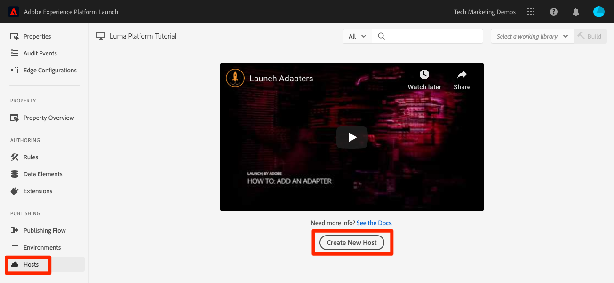
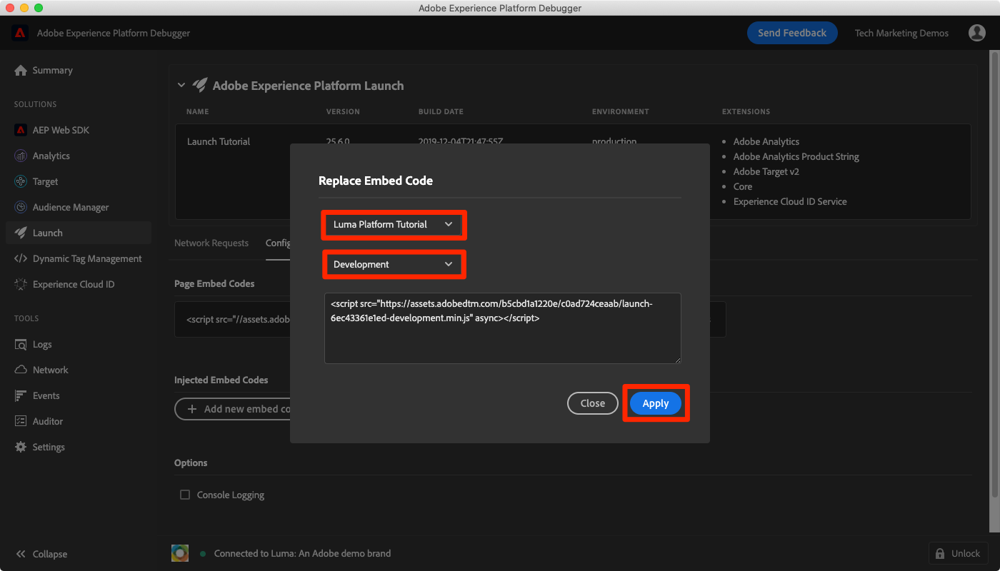

# Aufnehmen von Streaming-Daten

<!--1hr-->

In dieser Lektion streamen Sie Daten mit dem Adobe Experience Platform Web SDK.

In der Datenerfassungsoberfläche müssen wir zwei Hauptaufgaben erledigen:

* Wir müssen das Web SDK auf der Luma-Website implementieren, um Daten über Besucheraktivitäten von der Website an das Adobe Edge-Netzwerk zu senden. Wir führen eine einfache Implementierung mithilfe von Tags (früher Launch) durch.

* Wir müssen einen Datastream konfigurieren, der dem Edge-Netzwerk mitteilt, wohin die Daten weitergeleitet werden sollen. Wir werden es so konfigurieren, dass die Daten in unserer Platform-Sandbox an unseren `Luma Web Events` -Datensatz gesendet werden.

**Dateningenieure** müssen Streaming-Daten außerhalb dieses Tutorials erfassen. Bei der Implementierung von Web- oder Mobile-SDKs von Adobe Experience Platform ist normalerweise ein Web- oder Mobilentwickler an der Erstellung von Datenschichten und der Konfiguration von Tag-Eigenschaften beteiligt.

Bevor Sie mit den Übungen beginnen, sehen Sie sich diese beiden kurzen Videos an, um mehr über die Erfassung von Streaming-Daten und das Web SDK zu erfahren:

>[!VIDEO](https://video.tv.adobe.com/v/28425?learn=on)

>[!VIDEO](https://video.tv.adobe.com/v/34141?learn=on)

>[!NOTE]
>
>Während sich dieses Tutorial auf die Streaming-Erfassung von Websites mit Web SDK konzentriert, können Sie Daten auch mit dem [Adobe Mobile SDK](https://developer.adobe.com/client-sdks/documentation/), [Apache Kafka Connect](https://github.com/adobe/experience-platform-streaming-connect) und anderen Mechanismen streamen.

## Erforderliche Berechtigungen

In der Lektion [Berechtigungen konfigurieren](configure-permissions.md) richten Sie alle Zugriffssteuerungen ein, die zum Abschluss dieser Lektion erforderlich sind.

<!--
* Permission items **[!UICONTROL Launch]** > **[!UICONTROL Property Rights]** > **[!UICONTROL Approve]**, **[!UICONTROL Develop]**, **[!UICONTROL Manage Environments]**, **[!UICONTROL Manage Extensions]**, and **[!UICONTROL Publish]**
* Permission item **[!UICONTROL Launch]** > **[!UICONTROL Company Rights]** > **[!UICONTROL Manage Properties]**
* User-role access to the `Luma Tutorial Launch` product profile
* Admin-role access to the `Luma Tutorial Launch` product profile
* Permission items **[!UICONTROL Platform]** > **[!UICONTROL Data Ingestion]** > **[!UICONTROL View Sources]** and **[!UICONTROL Manage Sources]**
* Permission items **[!UICONTROL Platform]** > **[!UICONTROL Data Management]** > **[!UICONTROL View Datasets]** and **[!UICONTROL Manage Datasets]**
* Permission items **[!UICONTROL Platform]** > **[!UICONTROL Profiles]** > **[!UICONTROL View Profiles]**, **[!UICONTROL Manage Profiles]** and **[!UICONTROL Export Audience Segment]**
* Permission item **[!UICONTROL Platform]** > **[!UICONTROL Sandbox Administration]** > **[!UICONTROL View Sandboxes]**
* Permission item **[!UICONTROL Platform]** > **[!UICONTROL Sandboxes]** > `Luma Tutorial`
* User-role access to the `Luma Tutorial Platform` product profile
-->

<!--## Create a streaming source

1. Log into the [Experience Platform  user interface](https://experience.adobe.com/platform/)
1. Go to **[!UICONTROL Sources]** in the left navigation
1. Filter the list by selecting **[!UICONTROL Streaming]**
1. In the **[!UICONTROL HTTP API]** section, select the **[!UICONTROL Configure]** button
    
1. On the **[!UICONTROL Authentication]** step, enter `Luma Web Events Source` as the **[!UICONTROL Account name]** and select the **[!UICONTROL Connect to source]** button (we don't need to enable authentication since the data will be originating from website visitors)
    
1. Once connected, select the **[!UICONTROL Next]** button to proceed to the next step in the workflow
1. On the **[!UICONTROL Select data]** step, choose **[!UICONTROL Existing Dataset]**, select your `Luma Web Events Dataset`, and then select the **[!UICONTROL Next]** button
    
1. On the **[!UICONTROL Dataflow detail]** step, select the **[!UICONTROL Next]** button:
    
    <!--What is a good practice for naming the data flow vs the source-->
<!--
1. On the **[!UICONTROL Review]** step, review your source details and select the **[!UICONTROL Finish]** button:
    
-->

## Konfigurieren des Datenspeichers

Zuerst konfigurieren wir den Datastream. Ein Datastream teilt dem Adobe Edge-Netzwerk mit, wohin die Daten nach dem Erhalt vom Web SDK-Aufruf gesendet werden sollen. Möchten Sie die Daten beispielsweise an Experience Platform, Adobe Analytics oder Adobe Target senden? Datenspeicher werden in der Benutzeroberfläche für die Datenerfassung (früher Launch) verwaltet und sind für die Datenerfassung mit dem Web SDK von entscheidender Bedeutung.

So erstellen Sie Ihren [!UICONTROL Datastream]:

1. Melden Sie sich bei der [Experience Platform-Datenerfassungs-Benutzeroberfläche](https://experience.adobe.com/launch/) an.
   <!--when will the edge config go live?-->

1. Wählen Sie **[!UICONTROL Datastreams]** im linken Navigationsbereich aus.
1. Wählen Sie die Schaltfläche **[!UICONTROL Neuer Datastream]** oben rechts aus.

   

1. Geben Sie für den **[!UICONTROL Anzeigenamen]** `Luma Platform Tutorial` ein (fügen Sie Ihren Namen zum Ende hinzu, wenn mehrere Personen aus Ihrem Unternehmen dieses Tutorial absolvieren).
1. Wählen Sie die Schaltfläche **[!UICONTROL Speichern]** aus

   

Geben Sie im nächsten Bildschirm an, wohin Daten gesendet werden sollen. So senden Sie Daten an Experience Platform:

1. Aktivieren Sie **[!UICONTROL Adobe Experience Platform]** , um weitere Felder anzuzeigen.
1. Wählen Sie für **[!UICONTROL Sandbox]** `Luma Tutorial` aus.
1. Wählen Sie für **[!UICONTROL Ereignisdatensatz]** `Luma Web Events Dataset` aus.
1. Wenn Sie andere Adobe-Applikationen verwenden, können Sie auch die anderen Abschnitte durchsuchen, um zu sehen, welche Informationen in der Edge-Konfiguration dieser anderen Lösungen erforderlich sind. Beachten Sie, dass das Web SDK nicht nur zum Streamen von Daten auf Experience Platform entwickelt wurde, sondern auch zum Ersetzen aller vorherigen JavaScript-Bibliotheken, die von anderen Adobe-Anwendungen verwendet wurden. Die Edge-Konfiguration wird verwendet, um die Kontodetails jeder Anwendung anzugeben, an die Sie die Daten senden möchten.
1. Wählen Sie **[!UICONTROL Speichern]** aus.
   

Nachdem die Edge-Konfiguration gespeichert wurde, werden auf dem Bildschirm drei Umgebungen für Entwicklung, Staging und Produktion erstellt. Zusätzliche Entwicklungsumgebungen können hinzugefügt werden:

Alle drei Umgebungen enthalten die Plattformdetails, die Sie eingegeben haben. Diese Details können jedoch für jede Umgebung unterschiedlich konfiguriert werden. Sie können beispielsweise festlegen, dass jede Umgebung Daten an eine andere Platform-Sandbox sendet. In diesem Tutorial werden wir keine zusätzlichen Anpassungen an unseren Datastream vornehmen.

## Installieren der Web SDK-Erweiterung

### Hinzufügen einer Eigenschaft

Zuerst müssen wir eine Tag-Eigenschaft erstellen (ehemals eine Tag-Eigenschaft). Eine Eigenschaft ist ein Container für alle JavaScript, Regeln und anderen Funktionen, die zum Erfassen von Details von einer Webseite und zum Senden an verschiedene Orte erforderlich sind.

So erstellen Sie eine Eigenschaft:

1. Navigieren Sie in der linken Navigation zu **[!UICONTROL Eigenschaften]** .
1. Schaltfläche **[!UICONTROL Neue Eigenschaft]** auswählen
   
1. Geben Sie als **[!UICONTROL Name]** `Luma Platform Tutorial` ein (fügen Sie Ihren Namen zum Ende hinzu, wenn mehrere Personen aus Ihrem Unternehmen dieses Tutorial absolvieren).
1. Geben Sie als **[!UICONTROL Domänen]** den Wert `enablementadobe.com` ein (weiter unten erklärt).
1. Wählen Sie **[!UICONTROL Speichern]** aus.
   

<!--
After saving the property, you might see an error message like the one below. If so, this is because you don't actually have access to the property you just created. To fix this, we need to go to the Admin Console to give yourself access:
    

To give yourself access to the property:

1. In a separate browser tab, log into the [Admin Console](https://adminconsole.adobe.com/)
1. Go to **[!UICONTROL Products]** from the top navigation
1. Select **[!UICONTROL Adobe Experience Platform Launch]** on the left navigation
1. Go to your `Luma Tutorial Launch` product profile
1. Go to the **[!UICONTROL Permissions]** tab
1. On the **[!UICONTROL Properties]** row, select **[!UICONTROL Edit]**
    
1. Select the "+" icon to move your `Luma Platform Tutorial` property to the right-hand side and select the **[!UICONTROL Save]** button to update the permissions
   
    

Now switch back to your browser tab with the Data Collection interface still open. Reload the page and the `Luma Platform Tutorial` property should display in the list. Select to open the property:

-->

## Web SDK-Erweiterung hinzufügen

Nachdem Sie jetzt über eine Eigenschaft verfügen, können Sie das Web SDK mithilfe einer Erweiterung hinzufügen. Eine Erweiterung ist ein Paket mit Code, das die Datenerfassungsoberfläche und -funktion erweitert. Hinzufügen der Erweiterung:

1. Öffnen Sie die Tag-Eigenschaft
1. Navigieren Sie im linken Navigationsbereich zu **[!UICONTROL Erweiterungen]** .
1. Navigieren Sie zur Registerkarte **[!UICONTROL Katalog]** .
1. Für Tags stehen viele Erweiterungen zur Verfügung. Filtern Sie den Katalog mit dem Begriff `Web SDK` .
1. Wählen Sie in der Erweiterung **[!UICONTROL Adobe Experience Platform Web SDK]** die Schaltfläche **[!UICONTROL Installieren]**
   
1. Für die Web SDK-Erweiterung sind mehrere Konfigurationen verfügbar, für dieses Tutorial werden jedoch nur zwei konfiguriert. Aktualisieren Sie die **[!UICONTROL Edge-Domäne]** auf `data.enablementadobe.com`. Mit dieser Einstellung können Sie Erstanbieter-Cookies in Ihrer Web SDK-Implementierung setzen. Dies wird empfohlen. Später in dieser Lektion ordnen Sie eine Website in der Domäne `enablementadobe.com` Ihrer Tag-Eigenschaft zu. Der CNAME für die Domäne `enablementadobe.com` wurde bereits so konfiguriert, dass `data.enablementadobe.com` an Adobe-Server weiterleitet. Wenn Sie das Web SDK auf Ihrer eigenen Website implementieren, müssen Sie einen CNAME für Ihre eigenen Datenerfassungszwecke erstellen, z. B. `data.YOUR_DOMAIN.com`
1. Wählen Sie aus der Dropdown-Liste **[!UICONTROL Datastream]** Ihren `Luma Platform Tutorial` -Datastream aus.
1. Sehen Sie sich die anderen Konfigurationsoptionen an (ändern Sie sie jedoch nicht!) und dann **[!UICONTROL Speichern]**
   <!--is edge domain required for first party? when will it break?-->
   <!--any other fields that should be highlighted-->
   

## Erstellen einer Regel zum Senden von Daten

Jetzt erstellen wir eine Regel zum Senden von Daten an Platform. Eine Regel ist eine Kombination aus Ereignissen, Bedingungen und Aktionen, die Tags dazu anweisen, etwas zu tun. So erstellen Sie eine Regel:

1. Navigieren Sie im linken Navigationsbereich zu **[!UICONTROL Regeln]** .
1. Wählen Sie die Schaltfläche **[!UICONTROL Neue Regel erstellen]** aus
   
1. Geben Sie einen Namen für die Regel ein `All Pages - Library Loaded`.
1. Wählen Sie unter **[!UICONTROL Ereignisse]** die Schaltfläche **[!UICONTROL Hinzufügen]** aus.
   
1. Verwenden Sie die Erweiterung **[!UICONTROL Core]** **[!UICONTROL Extension]** und wählen Sie **[!UICONTROL Bibliothek geladen (Seitenanfang)]** als **[!UICONTROL Ereignistyp]** aus. Diese Einstellung bedeutet, dass unsere Regel jedes Mal ausgelöst wird, wenn die Launch-Bibliothek auf einer Seite geladen wird.
1. Wählen Sie **[!UICONTROL Änderungen beibehalten]** aus, um zum Hauptregelbildschirm zurückzukehren.
   
1. Lassen Sie **[!UICONTROL Bedingungen]** leer, da diese Regel gemäß dem Namen, den wir ihr gegeben haben, auf allen Seiten ausgelöst werden soll
1. Wählen Sie unter **[!UICONTROL Aktionen]** die Schaltfläche **[!UICONTROL Hinzufügen]** aus.
1. Verwenden Sie die Erweiterung **[!UICONTROL Adobe Experience Platform Web SDK]** **[!UICONTROL Extension]** und wählen Sie **[!UICONTROL Ereignis senden]** als den Aktionstyp **[!UICONTROL 7} aus.]**
1. Wählen Sie rechts **[!UICONTROL web.webpageDetails.pageViews]** aus der Dropdown-Liste **[!UICONTROL Typ]** aus. Dies ist eines der XDM-Felder in unserem `Luma Web Events Schema`
1. Wählen Sie **[!UICONTROL Änderungen beibehalten]** aus, um zum Hauptregelbildschirm zurückzukehren.
   
1. Wählen Sie **[!UICONTROL Speichern]** aus, um die Regel zu speichern\
   

## Publish der Regel in einer Bibliothek

Als Nächstes veröffentlichen wir die Regel in unserer Entwicklungsumgebung, damit wir überprüfen können, ob sie funktioniert.

<!--
There are a few quick steps we must take in the **[!UICONTROL Publishing]** section of Launch.

### Create a host

Launch libraries can be hosted on Adobe's Content Delivery Network (CDN) or on your own servers. In this tutorial, we will use Adobe's CDN since it is faster to set up:

1. Go to **[!UICONTROL Hosts]** in the left navigation
1. Select the **[!UICONTROL Create New Host]** button
       
1. For the **[!UICONTROL Name]**, enter `Adobe CDN`
1. For the **[!UICONTROL Type]**, select **[!UICONTROL Managed by Adobe]**
1. Select the **[!UICONTROL Save]** button to complete the setup of the host
       

### Create an environment

Environments allow you to have different versions of a library in different publishing environments to accommodate your publishing workflow. For example, the fully tested version of your library can be published to a Production environment, while new changes are being created in a Development environment. You can also use different hosts for each environment. To create an environment:

1. Go to **[!UICONTROL Environments]** in the left navigation
1. Select the **[!UICONTROL Create New Environment]** button
     
1. Under **[!UICONTROL Development]** select **[!UICONTROL Select]**   
     
1. For the **[!UICONTROL Name]**, enter `Development`
1. For the **[!UICONTROL Select Host]** dropdown, select `Adobe CDN`
1. Select the **[!UICONTROL Save]** button to complete the setup of the environment
    
1. You will see a modal with URL and other implementation details of this library. These are critical for a real Launch implementation, but we don't need to worry about them for this tutorial. Select the **[!UICONTROL Close]** button to exit the modal.

### Create and publish the library

Now let's bundle the contents of our property&mdash;currently an extension and a rule&mdash;into a library. 
-->

So erstellen Sie eine Bibliothek:

1. Navigieren Sie im linken Navigationsbereich zu **[!UICONTROL Veröffentlichungsfluss]** .
1. Wählen Sie **[!UICONTROL Bibliothek hinzufügen]**
   
1. Geben Sie für den **[!UICONTROL Namen]** `Luma Platform Tutorial` ein.
1. Wählen Sie für die **[!UICONTROL Umgebung]** `Development` aus.
1. Wählen Sie die Schaltfläche **[!UICONTROL Alle geänderten Ressourcen hinzufügen]** aus. (Zusätzlich zur Erweiterung [!UICONTROL Adobe Experience Platform Web SDK] und der Regel `All Pages - Library Loaded` wird auch die Erweiterung [!UICONTROL Core] hinzugefügt, die die grundlegende JavaScript enthält, die für alle Launch-Webeigenschaften erforderlich ist.)
1. Wählen Sie die Schaltfläche **[!UICONTROL Speichern und für Entwicklung erstellen]** aus
   

Die Erstellung der Bibliothek kann einige Minuten dauern. Wenn sie abgeschlossen ist, wird links neben dem Bibliotheksnamen ein grüner Punkt angezeigt:

Wie Sie auf dem Bildschirm &quot;[!UICONTROL Veröffentlichungsfluss]&quot;sehen, gibt es viel mehr im Veröffentlichungsprozess, was über den Rahmen dieses Tutorials hinausgeht. Wir werden nur eine einzige Bibliothek in unserer Entwicklungsumgebung verwenden.

## Überprüfen der Daten in der Anforderung

### Adobe Experience Platform Debugger hinzufügen

Der Experience Platform Debugger ist eine Erweiterung für Chrome- und Firefox-Browser, die Ihnen dabei hilft, die auf Ihren Webseiten implementierte Adobe-Technologie zu sehen. Laden Sie die Version für Ihren bevorzugten Browser herunter:

* [Firefox-Erweiterung](https://addons.mozilla.org/de/firefox/addon/adobe-experience-platform-dbg/)
* [Chrome-Erweiterung](https://chrome.google.com/webstore/detail/adobe-experience-platform/bfnnokhpnncpkdmbokanobigaccjkpob)

Wenn Sie den Debugger noch nie verwendet haben - und dieser sich vom älteren Adobe Experience Cloud Debugger unterscheidet -, sollten Sie sich dieses fünfminütige Übersichtsvideo ansehen:

>[!VIDEO](https://video.tv.adobe.com/v/32156?learn=on)

### Öffnen Sie die Website Luma .

Für dieses Tutorial verwenden wir eine öffentlich gehostete Version der Demowebsite von Luma. Öffnen wir es und markieren Sie es mit einem Lesezeichen:

1. Öffnen Sie in einer neuen Browser-Registerkarte die [Luma-Website](https://luma.enablementadobe.com/content/luma/us/en.html).
1. Versehen Sie die Seite mit einem Lesezeichen für die Verwendung im Rest des Tutorials.

Diese gehostete Website ist der Grund, warum wir `enablementadobe.com` im Feld [!UICONTROL Domänen] unserer anfänglichen Tag-Eigenschaftenkonfiguration verwendet haben und warum wir `data.enablementadobe.com` als Erstanbieterdomäne in der Erweiterung [!UICONTROL Adobe Experience Platform Web SDK] verwendet haben. Sehen Sie, ich hatte einen Plan!

### Verwenden Sie den Experience Platform Debugger, um Ihrer Tag-Eigenschaft zuzuordnen.

Der Experience Platform Debugger verfügt über eine coole Funktion, mit der Sie eine vorhandene Tag-Eigenschaft durch eine andere ersetzen können. Dies ist für die Validierung nützlich und ermöglicht es uns, viele Implementierungsschritte in diesem Tutorial zu überspringen.

1. Stellen Sie sicher, dass die Site &quot;Luma&quot;geöffnet ist, und wählen Sie das Symbol für die Experience Platform Debugger-Erweiterung aus.
1. Der Debugger wird geöffnet und zeigt einige Details zur hartcodierten Implementierung an, die nicht mit diesem Tutorial in Zusammenhang steht (Sie müssen die Site &quot;Luma&quot;möglicherweise neu laden, nachdem Sie den Debugger geöffnet haben).
1. Vergewissern Sie sich, dass der Debugger &quot;**[!UICONTROL Verbunden mit Luma]**&quot; ist, wie unten dargestellt, und wählen Sie dann das Symbol &quot;**[!UICONTROL lock]**&quot;, um den Debugger mit der Site &quot;Luma&quot;zu sperren.
1. Wählen Sie die Schaltfläche **[!UICONTROL Anmelden]** oben rechts, um sich zu authentifizieren.
1. Navigieren Sie nun zu **[!UICONTROL Launch]** im linken Navigationsbereich.
1. Wählen Sie die Registerkarte Konfiguration .
1. Öffnen Sie rechts neben dem Bereich, in dem die eingebetteten **[!UICONTROL Seiten-Codes]** angezeigt werden, das Dropdown-Menü **[!UICONTROL Aktionen]** und wählen Sie **[!UICONTROL Ersetzen]** aus
   
1. Da Sie authentifiziert sind, ruft der Debugger Ihre verfügbaren Launch-Eigenschaften und -Umgebungen ab. Wählen Sie Ihre `Luma Platform Tutorial` -Eigenschaft aus
1. Wählen Sie Ihre `Development`-Umgebung aus.
1. Wählen Sie die Schaltfläche **[!UICONTROL Anwenden]** aus
   
1. Die Luma-Website lädt jetzt _mit Ihrer Tag-Eigenschaft_ neu. Hilfe, ich wurde gehackt! Mach nur Spaß.
   
1. Navigieren Sie im linken Navigationsbereich zu **[!UICONTROL Zusammenfassung]** , um die Details Ihrer Eigenschaft [!UICONTROL Launch] anzuzeigen.
   
1. Navigieren Sie nun zu **[!UICONTROL AEP Web SDK]** im linken Navigationsbereich, um die **[!UICONTROL Netzwerkanforderungen]** anzuzeigen.
1. Öffnen Sie die Zeile **[!UICONTROL events]** .

   
1. Beachten Sie, dass wir den Ereignistyp `web.webpagedetails.pageView` sehen können, den wir in unserer Aktion [!UICONTROL Ereignis senden] angegeben haben, sowie weitere native Variablen, die dem Format `AEP Web SDK ExperienceEvent Mixin` entsprechen
   
1. Diese Arten von Anforderungsdetails sind auch auf der Registerkarte **Netzwerk** der Webentwickler-Tools des Browsers sichtbar. Öffnen Sie es und laden Sie die Seite neu. Filtern Sie nach Aufrufen mit &quot;`interact`&quot;, um den Aufruf zu finden, wählen Sie ihn aus und sehen Sie sich dann die Registerkarte &quot;**Kopfzeilen**&quot;, den Bereich &quot;**Payload anfordern**&quot;an.
   
1. Gehen Sie zur Registerkarte **Antwort** und beachten Sie, wie der ECID-Wert in der Antwort enthalten ist. Kopieren Sie diesen Wert, da Sie ihn verwenden werden, um die Profilinformationen in der nächsten Übung zu validieren.
   

## Überprüfen der Daten im Experience Platform

Sie können überprüfen, ob Daten in Platform landen, indem Sie sich die Batches der Daten ansehen, die in `Luma Web Events Dataset` eingehen. (Ich weiß, es wird Streaming-Datenerfassung genannt, aber jetzt sage ich, dass es in Batches ankommt! Es streamt in Echtzeit an das Profil, sodass es für die Echtzeit-Segmentierung und Aktivierung verwendet werden kann, aber alle 15 Minuten in Batches an den Data Lake gesendet wird.)

Überprüfen der Daten:

1. Navigieren Sie in der Benutzeroberfläche von Platform im linken Navigationsbereich zu **[!UICONTROL Datensätze]** .
1. Öffnen Sie die `Luma Web Events Dataset` und bestätigen Sie, dass ein Batch angekommen ist. Denken Sie daran, dass sie alle 15 Minuten gesendet werden. Daher müssen Sie möglicherweise warten, bis der Batch angezeigt wird.
1. Wählen Sie die Schaltfläche **[!UICONTROL Datensatz-Vorschau]** aus
    .
1. Beachten Sie im Vorschau-Modal, wie Sie verschiedene Felder des Schemas auf der linken Seite auswählen können, um eine Vorschau dieser spezifischen Datenpunkte anzuzeigen:
   

Sie können auch bestätigen, dass das neue Profil angezeigt wird:

1. Navigieren Sie in der Benutzeroberfläche von Platform im linken Navigationsbereich zu **[!UICONTROL Profile]** .
1. Wählen Sie den Namespace **[!UICONTROL ECID]** aus und suchen Sie nach Ihrem ECID-Wert (kopieren Sie ihn aus der Antwort. Das Profil verfügt über eine eigene ID, die von der ECID getrennt ist.
1. Wählen Sie die **[!UICONTROL Profil-ID]** aus, um das Profil zu öffnen
   
1. Wählen Sie die Registerkarte **[!UICONTROL Ereignisse]** aus, um die angezeigten Seiten anzuzeigen
   \
   <!---->

## Hinzufügen benutzerdefinierter Daten zum Ereignis

### Erstellen eines Datenelements für den Seitennamen

1. Öffnen Sie in der Benutzeroberfläche der Datenerfassungs-Tags oben rechts in der Eigenschaft `Luma Platform Tutorial` das Dropdown-Menü **[!UICONTROL Arbeitsbibliothek auswählen]** und wählen Sie Ihre Bibliothek `Luma Platform Tutorial` aus. Diese Einstellung erleichtert die Veröffentlichung zusätzlicher Aktualisierungen in unserer Bibliothek.
1. Navigieren Sie jetzt im linken Navigationsbereich zu **[!UICONTROL Datenelemente]** .
1. Wählen Sie die Schaltfläche **[!UICONTROL Neues Datenelement erstellen]** aus

   
1. Geben Sie als **[!UICONTROL Name]** `Page Name` ein.
1. Wählen Sie als **[!UICONTROL Datenelementtyp]** `JavaScript Variable` aus.
1. Geben Sie als **[!UICONTROL JavaScript-Variablennamen]** `digitalData.page.pageInfo.pageName` ein.
1. Um das Format der Werte zu standardisieren, aktivieren Sie die Kontrollkästchen für **[!UICONTROL Kleinbuchstaben erzwingen]** und **[!UICONTROL Text bereinigen]**
1. Stellen Sie sicher, dass `Luma Platform Tutorial` als Arbeitsbibliothek ausgewählt ist.
1. Wählen Sie **[!UICONTROL In Bibliothek speichern]**
   

### Ordnen Sie den Seitennamen dem XDM-Objekt-Datenelement zu.

Nun ordnen wir unseren Seitennamen dem Web SDK zu.

>[!IMPORTANT]
>
>Um diese Aufgabe abzuschließen, müssen wir sicherstellen, dass Ihr Benutzer zunächst Zugriff auf die Prod-Sandbox hat. Wenn Sie nicht bereits von einem anderen Produktprofil aus Zugriff auf die Sandbox &quot;Produktion&quot;haben, öffnen Sie Ihr `Luma Tutorial Platform` -Profil und fügen Sie das Berechtigungselement **[!UICONTROL Sandboxes]** > **[!UICONTROL Prod]** hinzu. Führen Sie anschließend auf der Seite &quot;Datenelemente&quot;eine Umschalt- und eine Umschalt- Taste aus, um den Cache zu leeren.
>

Auf der Seite **[!UICONTROL Datenelemente]** :

1. Neues Datenelement erstellen
1. Geben Sie als **[!UICONTROL Name]** `XDM Object` ein.
1. Wählen Sie als **[!UICONTROL Erweiterung]** `Adobe Experience Platform Web SDK` aus.
1. Wählen Sie als **[!UICONTROL Datenelementtyp]** `XDM object` aus.
1. Wählen Sie als **[!UICONTROL Sandbox]** Ihre `Luma Tutorial` Sandbox aus.
1. Wählen Sie als **[!UICONTROL Schema]** Ihren `Luma Web Events Schema` aus.
1. Wählen Sie das Feld `web.webPageDetails.name` aus
1. Wählen Sie als **[!UICONTROL Wert]** das Symbol aus, um das Datenelementauswahlmodell zu öffnen, und wählen Sie Ihr `Page Name` -Datenelement aus.
1. Wählen Sie **[!UICONTROL In Bibliothek speichern]**
   

Dasselbe Verfahren wird verwendet, um zusätzliche benutzerdefinierte Daten auf Ihrer Website XDM-Feldern zuzuordnen.

### Hinzufügen von XDM-Daten zu Ihrer Aktion &quot;Ereignis senden&quot;

Nachdem Sie Daten mit XDM-Feldern verknüpft haben, können Sie sie in Ihre Aktion &quot;Ereignis senden&quot;einbeziehen:

1. Navigieren Sie zum Bildschirm **[!UICONTROL Regeln]** .
1. Öffnen Sie Ihre `All Pages - Library Loaded`-Regel
1. Öffnen Sie die Aktion `Adobe Experience Platform Web SDK - Send Event` .
1. Wählen Sie als **[!UICONTROL XDM data]** das Symbol aus, um das Datenelement-Auswahlmodell zu öffnen, und wählen Sie Ihr `XDM Object` -Datenelement aus.
1. Wählen Sie die Schaltfläche **[!UICONTROL Änderungen beibehalten]** aus.
   
1. Da Sie jetzt `Luma Platform Tutorial` für die letzten Übungen als Arbeitsbibliothek ausgewählt haben, wurden Ihre letzten Änderungen direkt in der Bibliothek gespeichert. Anstatt unsere Änderungen über den Bildschirm &quot;Veröffentlichungsfluss&quot;veröffentlichen zu müssen, können Sie einfach das Dropdown-Menü auf der blauen Schaltfläche öffnen und **[!UICONTROL In Bibliothek speichern und erstellen]** auswählen
   

Dadurch wird eine neue Tag-Bibliothek mit den drei soeben vorgenommenen Änderungen erstellt.

### Validieren der XDM-Daten

Sie sollten jetzt in der Lage sein, die Startseite von Luma neu zu laden, während Sie mit dem Debugger Ihrer Tag-Eigenschaft zugeordnet sind, wie Sie zuvor erfahren haben, und feststellen, dass das Feld für den Seitennamen in der Anfrage ausgefüllt ist!

Sie können auch überprüfen, ob die Seitennamen-Daten in Platform empfangen wurden, indem Sie eine Vorschau des Datensatzes und des Profils anzeigen.

## Zusätzliche Identitäten senden

Ihre Web SDK-Implementierung sendet jetzt Ereignisse mit der Experience Cloud ID (ECID) als primärer Kennung. Die ECID wird automatisch vom Web SDK generiert und ist pro Gerät und Browser eindeutig. Ein einzelner Kunde kann je nach verwendetem Gerät und Browser über mehrere ECIDs verfügen. Wie können wir also eine einheitliche Ansicht dieses Kunden erhalten und seine Online-Aktivität mit unseren CRM-, Treueprogramm- und Offline-Kaufdaten verknüpfen? Dazu erfassen wir zusätzliche Identitäten während ihrer Sitzung und verbinden ihr Profil durch Identitätszusammenfügung deterministisch.

Wenn Sie sich daran erinnern, erwähnte ich, dass wir die ECID und die CRM-ID als Identitäten für unsere Web-Daten in der Lektion [Identitäten zuordnen](map-identities.md) verwenden würden. Erfassen wir also die CRM-ID mit dem Web SDK!

### Datenelement für die CRM-ID hinzufügen

Zunächst wird die CRM-ID in einem Datenelement gespeichert:

1. Fügen Sie in der Tags-Oberfläche ein Datenelement mit dem Namen `CRM Id` hinzu.
1. Wählen Sie als **[!UICONTROL Datenelementtyp]** **[!UICONTROL JavaScript-Variable]** aus.
1. Geben Sie als **[!UICONTROL JavaScript-Variablennamen]** `digitalData.user.0.profile.0.attributes.username` ein.
1. Wählen Sie die Schaltfläche **[!UICONTROL In Bibliothek speichern]** aus (`Luma Platform Tutorial` sollte weiterhin Ihre Arbeitsbibliothek sein).
   

### CRM-ID zum Datenelement &quot;Identity Map&quot;hinzufügen

Nachdem wir nun den Wert der CRM-ID erfasst haben, müssen wir ihn mit einem speziellen Datenelementtyp namens [!UICONTROL Identitätszuordnung] verknüpfen:

1. Hinzufügen eines Datenelements mit dem Namen `Identities`
1. Wählen Sie als **[!UICONTROL Erweiterung]** **[!UICONTROL Adobe Experience Platform Web SDK]** aus.
1. Wählen Sie als **[!UICONTROL Datenelementtyp]** **[!UICONTROL Identitätszuordnung]** aus.
1. Geben Sie als **[!UICONTROL Namespace]** den Wert `Luma CRM Id` ein, d. h. den [!UICONTROL Namespace], den wir in einer früheren Lektion erstellt haben

   >[!WARNING]
   >
   >Mit der Adobe Experience Platform Web SDK-Erweiterung Version 2.2 können Sie Namespace aus einer vorausgefüllten Dropdown-Liste auswählen, in der Sie die tatsächlichen Werte in Ihrem Platform-Konto angeben. Leider ist diese Funktion noch nicht &quot;Sandbox-fähig&quot;und daher erscheint der Wert `Luma CRM Id` möglicherweise nicht in der Dropdown-Liste. Dies kann Sie daran hindern, diese Übung abzuschließen. Wir werden eine Problemumgehung veröffentlichen, sobald sie bestätigt wurde.

1. Wählen Sie als **[!UICONTROL ID]** das Symbol aus, um das Datenelementauswahlmodell zu öffnen, und wählen Sie Ihr `CRM Id` -Datenelement aus.
1. Wählen Sie als **[!UICONTROL Authentifizierungsstatus]** **[!UICONTROL Authentifiziert]** aus.
1. Lassen Sie **[!UICONTROL Primär]** _deaktiviert_. Da die CRM-ID für die meisten Besucher der Luma-Website nicht vorhanden ist, sollten Sie die ECID auf keinen Fall als primäre Kennung _überschreiben._ In seltenen Fällen kann nur die ECID als primäre Kennung verwendet werden. Normalerweise erwähne ich die Standardeinstellungen in diesen Anweisungen nicht, aber ich rufe diese an, um Ihnen zu helfen, Kopfschmerzen später in Ihrer eigenen Implementierung zu vermeiden.
1. Wählen Sie die Schaltfläche **[!UICONTROL In Bibliothek speichern]** aus (`Luma Platform Tutorial` sollte weiterhin Ihre Arbeitsbibliothek sein).
   

>[!NOTE]
>
>Mithilfe des Datentyps [!UICONTROL Identitätszuordnung] können Sie mehrere Identifikatoren übergeben.

### Hinzufügen des Datenelements der Identity Map zum XDM-Objekt

Es gibt ein weiteres Datenelement, das wir aktualisieren müssen - das XDM-Objektdatenelement. Es mag seltsam erscheinen, drei separate Datenelemente aktualisieren zu müssen, um diese eine Identität zu übergeben. Dieser Prozess wurde jedoch für die Skalierung mehrerer Identitäten entwickelt. Keine Sorge! Wir sind fast fertig mit dieser Lektion!

1. XDM-Objektdatenelement öffnen
1. Öffnen Sie das XDM-Feld IdentityMap .
1. Wählen Sie als **[!UICONTROL Datenelement]** das Symbol aus, um das Datenelement-Auswahlmodell zu öffnen, und wählen Sie Ihr `Identities` -Datenelement aus.
1. Da Sie jetzt `Luma Platform Tutorial` für die letzten Übungen als Arbeitsbibliothek ausgewählt haben, wurden Ihre letzten Änderungen direkt in der Bibliothek gespeichert. Anstatt unsere Änderungen über den Bildschirm &quot;Veröffentlichungsfluss&quot;veröffentlichen zu müssen, können Sie das Dropdown-Menü auf der blauen Schaltfläche öffnen und **[!UICONTROL In Bibliothek speichern und erstellen]** auswählen
   

### Überprüfen der Identität

So überprüfen Sie, ob die CRM-ID jetzt vom Web SDK gesendet wird:

1. Öffnen Sie die [Luma-Website](https://luma.enablementadobe.com/content/luma/us/en.html) .
1. Ordnen Sie es gemäß den vorherigen Anweisungen mithilfe des Debuggers Ihrer Tag-Eigenschaft zu.
1. Wählen Sie den Link **Anmelden** oben rechts auf der Luma-Website aus.
1. Melden Sie sich mit den Anmeldedaten an `test@adobe.com`/`test`
1. Überprüfen Sie nach der Authentifizierung den Experience Platform Web SDK-Aufruf im Debugger (**[!UICONTROL Adobe Experience Platform Web SDK]** > **[!UICONTROL Netzwerkanfragen]** > **[!UICONTROL Ereignisse]** der letzten Anforderung) und Sie sollten den Wert `lumaCrmId` sehen:
   
1. Suchen Sie das Benutzerprofil mithilfe des ECID-Namespace und geben Sie den Wert erneut ein. Im Profil werden die CRM-ID sowie die Loyalitäts-ID und die Profildetails wie der Name und die Telefonnummer angezeigt. Alle Identitäten und Daten wurden zu einem einzigen Echtzeit-Kundenprofil zusammengeführt!
   

## Weitere Ressourcen

* [Implementieren von Adobe Experience Cloud mit dem Web SDK](/help/tutorial-web-sdk/overview.md)
* [Dokumentation zur Streaming-Aufnahme](https://experienceleague.adobe.com/docs/experience-platform/ingestion/streaming/overview.html?lang=de)
* [Referenz zur Streaming-Aufnahme-API](https://developer.adobe.com/experience-platform-apis/references/streaming-ingestion/)

Gut gemacht! Das waren viele Informationen zum Web SDK und Launch. Es gibt viel mehr an einer vollständigen Implementierung, aber dies sind die Grundlagen, die Ihnen bei den ersten Schritten und der Anzeige der Ergebnisse in Platform helfen.

>[!NOTE]
>
>Nachdem Sie die Lektion Streaming-Aufnahme abgeschlossen haben, können Sie die Sandbox [!UICONTROL Prod] aus Ihrem `Luma Tutorial Platform` -Produktprofil entfernen

Dateningenieure können bei Bedarf die Lektion [Abfragen ausführen](run-queries.md) überspringen.

Datenarchitekten können Sie zu [Zusammenführungsrichtlinien](create-merge-policies.md) wechseln!
