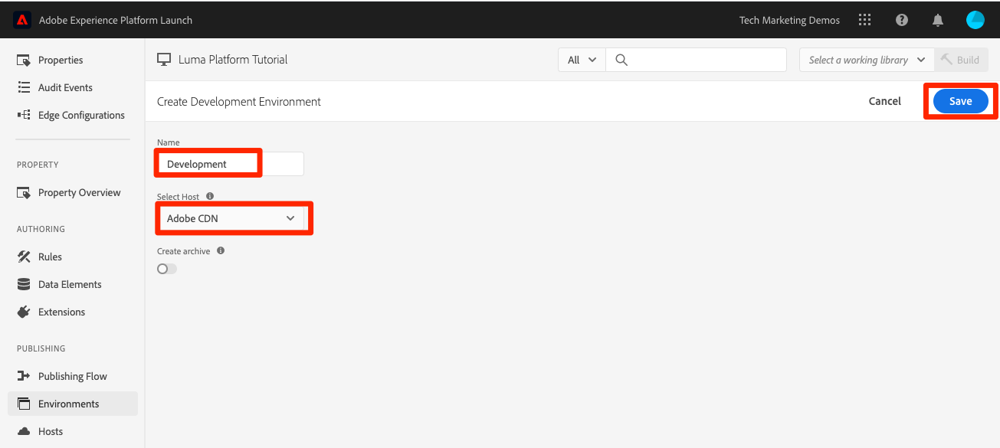
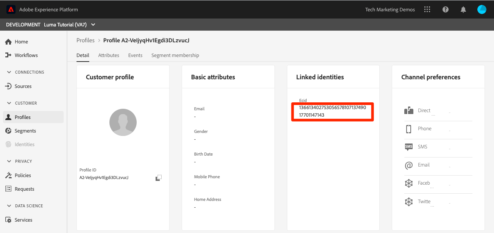

# Aufnehmen von Streaming-Daten

<!--1hr-->

In dieser Lektion streamen Sie Daten mit der Adobe Experience Platform Web SDK.

Es gibt zwei Hauptaufgaben, die wir in der Datenerfassungsoberfläche ausführen müssen:

* Wir müssen Web SDK auf der Luma-Website implementieren, um Daten über Besucheraktivitäten von der Website an das Adobe Edge-Netzwerk zu senden. Wir werden eine einfache Implementierung mithilfe von Tags (früher Launch) durchführen

* Wir müssen einen Datenstrom konfigurieren, der dem Edge-Netzwerk mitteilt, wohin die Daten weitergeleitet werden sollen. Wir konfigurieren sie so, dass die Daten an unseren `Luma Web Events` Datensatz in unserer Platform-Sandbox gesendet werden.

**Dateningenieure** müssen Streaming-Daten außerhalb dieses Tutorials aufnehmen. Bei der Implementierung der Web- oder Mobile-SDKs von Adobe Experience Platform ist in der Regel ein Web- oder Mobile-Entwickler an der Erstellung der Datenschicht und der Konfiguration der Tag-Eigenschaft beteiligt.

Bevor Sie mit den Übungen beginnen, sehen Sie sich diese beiden kurzen Videos an, um mehr über die Streaming-Datenaufnahme und Web SDK zu erfahren:

>[!VIDEO](https://video.tv.adobe.com/v/31577?captions=ger&learn=on&enablevpops)

>[!VIDEO](https://video.tv.adobe.com/v/37260?captions=ger&learn=on&enablevpops)

>[!NOTE]
>
>Während sich dieses Tutorial auf die Streaming-Aufnahme von Websites mit Web SDK konzentriert, können Sie Daten auch mit dem [Adobe Mobile SDK](https://developer.adobe.com/client-sdks/documentation/), [Apache Kafka Connect](https://github.com/adobe/experience-platform-streaming-connect) und anderen Mechanismen streamen.

## Berechtigungen erforderlich

In der Lektion [Berechtigungen konfigurieren](configure-permissions.md) richten Sie alle Zugriffssteuerungen ein, die zum Abschließen dieser Lektion erforderlich sind.

<!--
* Permission items **[!UICONTROL Launch]** > **[!UICONTROL Property Rights]** > **[!UICONTROL Approve]**, **[!UICONTROL Develop]**, **[!UICONTROL Manage Environments]**, **[!UICONTROL Manage Extensions]**, and **[!UICONTROL Publish]**
* Permission item **[!UICONTROL Launch]** > **[!UICONTROL Company Rights]** > **[!UICONTROL Manage Properties]**
* User-role access to the `Luma Tutorial Launch` product profile
* Admin-role access to the `Luma Tutorial Launch` product profile
* Permission items **[!UICONTROL Platform]** > **[!UICONTROL Data Ingestion]** > **[!UICONTROL View Sources]** and **[!UICONTROL Manage Sources]**
* Permission items **[!UICONTROL Platform]** > **[!UICONTROL Data Management]** > **[!UICONTROL View Datasets]** and **[!UICONTROL Manage Datasets]**
* Permission items **[!UICONTROL Platform]** > **[!UICONTROL Profiles]** > **[!UICONTROL View Profiles]**, **[!UICONTROL Manage Profiles]** and **[!UICONTROL Export Audience Segment]**
* Permission item **[!UICONTROL Platform]** > **[!UICONTROL Sandbox Administration]** > **[!UICONTROL View Sandboxes]**
* Permission item **[!UICONTROL Platform]** > **[!UICONTROL Sandboxes]** > `Luma Tutorial`
* User-role access to the `Luma Tutorial Platform` product profile
-->

<!--## Create a streaming source

1. Log into the [Experience Platform  user interface](https://experience.adobe.com/platform/)
1. Go to **[!UICONTROL Sources]** in the left navigation
1. Filter the list by selecting **[!UICONTROL Streaming]**
1. In the **[!UICONTROL HTTP API]** section, select the **[!UICONTROL Configure]** button
    
1. On the **[!UICONTROL Authentication]** step, enter `Luma Web Events Source` as the **[!UICONTROL Account name]** and select the **[!UICONTROL Connect to source]** button (we don't need to enable authentication since the data will be originating from website visitors)
    
1. Once connected, select the **[!UICONTROL Next]** button to proceed to the next step in the workflow
1. On the **[!UICONTROL Select data]** step, choose **[!UICONTROL Existing Dataset]**, select your `Luma Web Events Dataset`, and then select the **[!UICONTROL Next]** button
    
1. On the **[!UICONTROL Dataflow detail]** step, select the **[!UICONTROL Next]** button:
    
    <!--What is a good practice for naming the data flow vs the source-->
<!--
1. On the **[!UICONTROL Review]** step, review your source details and select the **[!UICONTROL Finish]** button:
    
-->

## Konfigurieren des Datenstroms

Zunächst konfigurieren wir den Datenstrom. Ein Datenstrom teilt dem Adobe Edge-Netzwerk mit, wohin die Daten gesendet werden sollen, nachdem sie vom Web-SDK-Aufruf empfangen wurden. Möchten Sie die Daten beispielsweise an Experience Platform, Adobe Analytics oder Adobe Target senden? Datenströme werden in der Datenerfassungs-Benutzeroberfläche (früher Launch) verwaltet und sind für die Datenerfassung mit Web SDK von entscheidender Bedeutung.

So erstellen Sie [!UICONTROL Datenstrom]:

1. Melden Sie sich bei der Datenerfassungs-Benutzeroberfläche von [Experience Platform an](https://experience.adobe.com/launch/)
   <!--when will the edge config go live?-->

1. Wählen **[!UICONTROL Datenströme]** im linken Navigationsbereich aus
1. Klicken Sie auf **[!UICONTROL Neuer Datenstrom]** in der oberen rechten Ecke

   

1. Geben Sie als **[!UICONTROL Anzeigename]** den `Luma Platform Tutorial` ein (fügen Sie am Ende Ihren Namen hinzu, wenn mehrere Personen in Ihrem Unternehmen an diesem Tutorial teilnehmen)
1. Klicken Sie auf **[!UICONTROL Speichern]**.

   

Im nächsten Bildschirm geben Sie an, wohin Sie Daten senden möchten. So senden Sie Daten an Experience Platform:

1. Schalten Sie **[!UICONTROL Adobe Experience Platform ein]** um zusätzliche Felder anzuzeigen
1. Wählen **[!UICONTROL für]** Sandbox`Luma Tutorial`
1. Wählen **[!UICONTROL für]** Ereignisdatensatz`Luma Web Events Dataset`
1. Wenn Sie andere Adobe-Programme verwenden, können Sie die anderen Abschnitte lesen, um zu sehen, welche Informationen in der Edge-Konfiguration dieser anderen Lösungen erforderlich sind. Denken Sie daran, dass Web SDK nicht nur entwickelt wurde, um Daten in Experience Platform zu streamen, sondern auch, um alle vorherigen JavaScript-Bibliotheken zu ersetzen, die von anderen Adobe-Programmen verwendet wurden. Die Edge-Konfiguration wird verwendet, um die Kontodetails der einzelnen Anwendungen anzugeben, an die Sie die Daten senden möchten.
1. Wählen Sie **[!UICONTROL Speichern]**
   

Nachdem die Edge-Konfiguration gespeichert wurde, zeigt der resultierende Bildschirm an, dass drei Umgebungen für Entwicklung, Staging und Produktion erstellt wurden. Zusätzliche Entwicklungsumgebungen können hinzugefügt werden:

Alle drei Umgebungen enthalten die soeben eingegebenen Platform-Details. Diese Details können jedoch je nach Umgebung unterschiedlich konfiguriert werden. Beispielsweise könnte jede Umgebung Daten an eine andere Platform-Sandbox senden. In diesem Tutorial nehmen wir keine zusätzliche Anpassung an unseren Datenstrom vor.

## Installieren der Web SDK-Erweiterung

### Eigenschaft hinzufügen

Zunächst müssen wir eine Tag-Eigenschaft (früher eine Tag-Eigenschaft) erstellen. Eine Eigenschaft ist ein Container für alle JavaScript, Regeln und anderen Funktionen, die erforderlich sind, um Details von einer Web-Seite zu erfassen und an verschiedene Orte zu senden.

So erstellen Sie eine Eigenschaft:

1. Navigieren Sie **[!UICONTROL linken Navigationsbereich zu]** Eigenschaften“.
1. Klicken Sie auf **[!UICONTROL Schaltfläche „Neue Eigenschaft]**.
   
1. Geben **[!UICONTROL als]** Name`Luma Platform Tutorial` ein (fügen Sie am Ende Ihren Namen hinzu, wenn mehrere Personen in Ihrem Unternehmen an diesem Tutorial teilnehmen)
1. Geben Sie als **[!UICONTROL Domains]** den `enablementadobe.com` ein (siehe Erklärung weiter unten)
1. Wählen Sie **[!UICONTROL Speichern]**
   

<!--
After saving the property, you might see an error message like the one below. If so, this is because you don't actually have access to the property you just created. To fix this, we need to go to the Admin Console to give yourself access:
    

To give yourself access to the property:

1. In a separate browser tab, log into the [Admin Console](https://adminconsole.adobe.com/)
1. Go to **[!UICONTROL Products]** from the top navigation
1. Select **[!UICONTROL Adobe Experience Platform Launch]** on the left navigation
1. Go to your `Luma Tutorial Launch` product profile
1. Go to the **[!UICONTROL Permissions]** tab
1. On the **[!UICONTROL Properties]** row, select **[!UICONTROL Edit]**
    
1. Select the "+" icon to move your `Luma Platform Tutorial` property to the right-hand side and select the **[!UICONTROL Save]** button to update the permissions
   
    

Now switch back to your browser tab with the Data Collection interface still open. Reload the page and the `Luma Platform Tutorial` property should display in the list. Select to open the property:

-->

## Hinzufügen der Web SDK-Erweiterung

Nachdem Sie nun über die Eigenschaft verfügen, können Sie die Web-SDK mithilfe einer Erweiterung hinzufügen. Eine Erweiterung ist ein Code-Paket, das die Datenerfassungsschnittstelle und -funktionalität erweitert. So fügen Sie die Erweiterung hinzu:

1. Öffnen Sie Ihre Tag-Eigenschaft
1. Navigieren Sie **[!UICONTROL linken Navigationsbereich]** Erweiterungen“.
1. Wechseln Sie zur Registerkarte **[!UICONTROL Katalog]**.
1. Für Tags stehen viele Erweiterungen zur Verfügung. Katalog mit dem Begriff `Web SDK` filtern
1. Klicken Sie in der Erweiterung **[!UICONTROL Adobe Experience Platform Web]** SDK **[!UICONTROL auf die Schaltfläche]**&#x200B;Installieren“
   
1. Es gibt mehrere Konfigurationen für die Web-SDK-Erweiterung, aber es gibt nur zwei, die wir für dieses Tutorial konfigurieren werden. Aktualisieren Sie die **[!UICONTROL Edge]** Domäne auf `data.enablementadobe.com`. Mit dieser Einstellung können Sie Erstanbieter-Cookies mit Ihrer Web SDK-Implementierung festlegen. Dies wird empfohlen. Später in dieser Lektion ordnen Sie eine Website in der `enablementadobe.com` Domain Ihrer Tag-Eigenschaft zu. Der CNAME für die `enablementadobe.com` Domain wurde bereits so konfiguriert, dass `data.enablementadobe.com` an Adobe-Server weiterleitet. Wenn Sie Web SDK auf Ihrer eigenen Website implementieren, müssen Sie einen CNAME für Ihre eigenen Datenerfassungszwecke erstellen, z. B. `data.YOUR_DOMAIN.com`
1. Wählen Sie **[!UICONTROL Dropdown-]** „Datenstrom“ Ihren `Luma Platform Tutorial` Datenstrom aus.
1. Sie können sich auch die anderen Konfigurationsoptionen ansehen (aber nicht ändern!) und dann auf &quot;**[!UICONTROL &quot;]**
   <!--is edge domain required for first party? when will it break?-->
   <!--any other fields that should be highlighted-->
   

## Erstellen einer Regel zum Senden von Daten

Jetzt erstellen wir eine Regel, um Daten an Platform zu senden. Eine Regel ist eine Kombination aus Ereignissen, Bedingungen und Aktionen, die Tags anweisen, etwas zu tun. Erstellen einer Regel:

1. Navigieren Sie **[!UICONTROL linken Navigationsbereich zu]** Regeln“
1. Klicken Sie auf **[!UICONTROL Schaltfläche „Neue Regel]**&quot;
   
1. Geben Sie einen Namen für die Regel ein `All Pages - Library Loaded`.
1. Klicken **[!UICONTROL unter „Ereignisse]** auf die Schaltfläche **[!UICONTROL Hinzufügen]**
   
1. Verwenden Sie **[!UICONTROL core]** **[!UICONTROL extension]** und wählen Sie **[!UICONTROL Library Loaded (Page Top)]** als **[!UICONTROL Ereignistyp]**. Diese Einstellung bedeutet, dass unsere Regel immer dann ausgelöst wird, wenn die Launch-Bibliothek auf einer Seite geladen wird.
1. Wählen Sie **[!UICONTROL Änderungen beibehalten]** aus, um zum Hauptbildschirm für Regeln zurückzukehren
   
1. Lassen Sie **[!UICONTROL Bedingungen]** leer, da diese Regel gemäß dem angegebenen Namen auf allen Seiten ausgelöst werden soll
1. Klicken **[!UICONTROL unter &quot;]**&quot; auf die **[!UICONTROL Hinzufügen]**-Schaltfläche
1. Verwenden Sie **[!UICONTROL Adobe Experience Platform Web SDK]** **[!UICONTROL Extension]** und wählen Sie **[!UICONTROL Ereignis senden]** als **[!UICONTROL Aktionstyp]**
1. Wählen Sie auf der rechten Seite **[!UICONTROL web.webpagedetails.pageViews]** aus dem **[!UICONTROL Typ]** Dropdown. Dies ist eines der XDM-Felder in unserem `Luma Web Events Schema`
1. Wählen Sie **[!UICONTROL Änderungen beibehalten]** aus, um zum Hauptbildschirm für Regeln zurückzukehren
   
1. Wählen **[!UICONTROL Speichern]**, um die Regel zu speichern\
   

## Veröffentlichen der Regel in einer Bibliothek

Als Nächstes veröffentlichen wir die Regel in unserer Entwicklungsumgebung, damit wir überprüfen können, ob sie funktioniert.

<!--
There are a few quick steps we must take in the **[!UICONTROL Publishing]** section of Launch.

### Create a host

Launch libraries can be hosted on Adobe's Content Delivery Network (CDN) or on your own servers. In this tutorial, we will use Adobe's CDN since it is faster to set up:

1. Go to **[!UICONTROL Hosts]** in the left navigation
1. Select the **[!UICONTROL Create New Host]** button
       
1. For the **[!UICONTROL Name]**, enter `Adobe CDN`
1. For the **[!UICONTROL Type]**, select **[!UICONTROL Managed by Adobe]**
1. Select the **[!UICONTROL Save]** button to complete the setup of the host
       

### Create an environment

Environments allow you to have different versions of a library in different publishing environments to accommodate your publishing workflow. For example, the fully tested version of your library can be published to a Production environment, while new changes are being created in a Development environment. You can also use different hosts for each environment. To create an environment:

1. Go to **[!UICONTROL Environments]** in the left navigation
1. Select the **[!UICONTROL Create New Environment]** button
     
1. Under **[!UICONTROL Development]** select **[!UICONTROL Select]**   
     
1. For the **[!UICONTROL Name]**, enter `Development`
1. For the **[!UICONTROL Select Host]** dropdown, select `Adobe CDN`
1. Select the **[!UICONTROL Save]** button to complete the setup of the environment
    
1. You will see a modal with URL and other implementation details of this library. These are critical for a real Launch implementation, but we don't need to worry about them for this tutorial. Select the **[!UICONTROL Close]** button to exit the modal.

### Create and publish the library

Now let's bundle the contents of our property&mdash;currently an extension and a rule&mdash;into a library. 
-->

So erstellen Sie eine Bibliothek:

1. Navigieren Sie **[!UICONTROL linken Navigationsbereich]** Veröffentlichungsfluss &quot;&quot;.
1. Wählen Sie **[!UICONTROL Bibliothek hinzufügen]**
   
1. Geben Sie für **[!UICONTROL Name]** den Wert `Luma Platform Tutorial`
1. Wählen Sie für **[!UICONTROL Umgebung]** die Option `Development`
1. Klicken Sie auf **[!UICONTROL Schaltfläche „Alle geänderten Ressourcen hinzufügen]**. (Zusätzlich zur Erweiterung [!UICONTROL Adobe Experience Platform Web SDK] und der `All Pages - Library Loaded`-Regel wird auch die Erweiterung [!UICONTROL Core] hinzugefügt, die die für alle Launch-Web-Eigenschaften erforderliche JavaScript-Basis enthält.)
1. Klicken Sie auf **[!UICONTROL Schaltfläche „Für Entwicklung speichern und erstellen]**
   

Es kann einige Minuten dauern, bis die Bibliothek erstellt ist. Nach Abschluss wird links neben dem Bibliotheksnamen ein grüner Punkt angezeigt:

Wie Sie auf dem Bildschirm [!UICONTROL Publishing-Ablauf] sehen können, gibt es sehr viel mehr am Publishing-Prozess, was den Rahmen dieses Tutorials sprengt. Wir verwenden jetzt nur eine einzige Bibliothek in unserer Entwicklungsumgebung.

## Validieren der Daten in der Anfrage

### Adobe Experience Platform Debugger hinzufügen

Experience Platform Debugger ist eine für Chrome verfügbare Erweiterung, mit der Sie die in Ihren Web-Seiten implementierte Adobe-Technologie sehen können. Laden Sie die Version für Ihren bevorzugten Browser herunter:

* [Chrome-Erweiterung](https://chrome.google.com/webstore/detail/adobe-experience-platform/bfnnokhpnncpkdmbokanobigaccjkpob)

Wenn Sie den Debugger noch nie verwendet haben - und dieser unterscheidet sich vom älteren Adobe Experience Cloud Debugger - sollten Sie sich dieses fünfminütige Übersichtsvideo ansehen:

>[!VIDEO](https://video.tv.adobe.com/v/35916?captions=ger&learn=on&enablevpops)

### Öffnen der Luma-Website

Für dieses Tutorial verwenden wir eine öffentlich gehostete Version der Demo-Website von Luma. Öffnen wir sie und setzen ein Lesezeichen dafür:

1. Öffnen Sie in einer neuen Browser-Registerkarte die [Luma-Website](https://luma.enablementadobe.com/content/luma/us/en.html).
1. Setzen Sie ein Lesezeichen für die Seite, die im weiteren Verlauf des Tutorials verwendet werden soll

Diese gehostete Website ist der Grund, warum wir `enablementadobe.com` im Feld [!UICONTROL Domains] unserer ursprünglichen Tag-Eigenschaftskonfiguration verwendet haben und warum wir `data.enablementadobe.com` als Erstanbieter-Domain in der [!UICONTROL Adobe Experience Platform Web SDK]-Erweiterung verwendet haben. Siehst du, ich hatte einen Plan!

### Verwenden Sie den Experience Platform Debugger, um eine Zuordnung zu Ihrer Tag-Eigenschaft vorzunehmen

Der Experience Platform-Debugger verfügt über eine coole Funktion, mit der Sie eine vorhandene Tag-Eigenschaft durch eine andere ersetzen können. Dies ist für die Validierung nützlich und ermöglicht es uns, viele Implementierungsschritte in diesem Tutorial zu überspringen.

1. Stellen Sie sicher, dass die Luma-Site geöffnet ist und wählen Sie das Symbol für die Experience Platform Debugger-Erweiterung aus
1. Der Debugger wird geöffnet und zeigt einige Details der hartcodierten Implementierung an, die nicht mit diesem Tutorial zusammenhängt (Sie müssen die Luma-Site möglicherweise nach dem Öffnen des Debuggers neu laden)
1. Vergewissern Sie sich, dass der Debugger **[!UICONTROL mit Luma verbunden]** ist, wie unten dargestellt, und wählen Sie dann das Symbol &quot;**[!UICONTROL lock]**&quot; aus, um den Debugger für die Luma-Site zu sperren.
1. Wählen Sie die **[!UICONTROL Anmelden]**-Schaltfläche oben rechts aus, um sich zu authentifizieren.
1. Navigieren Sie jetzt **[!UICONTROL Launch]** im linken Navigationsbereich
1. Wählen Sie die Registerkarte Konfiguration aus
1. Öffnen Sie rechts neben der Stelle, an der die **[!UICONTROL Seiteneinbettungs-Codes]** angezeigt werden, das **[!UICONTROL Aktionen]** und wählen Sie **[!UICONTROL Ersetzen]**
   
1. Da Sie authentifiziert sind, ruft der Debugger Ihre verfügbaren Launch-Eigenschaften und -Umgebungen ab. `Luma Platform Tutorial` auswählen
1. `Development` auswählen
1. Klicken Sie auf die **[!UICONTROL Apply]**-Schaltfläche
   
1. Die Luma-Website wird jetzt neu geladen _mit Ihrer Tag-Eigenschaft_. Hilfe, ich wurde gehackt! Das war nur ein Scherz.
   
1. Navigieren Sie **[!UICONTROL linken]** zu „Zusammenfassung“, um die Details Ihrer „Launch[!UICONTROL -] anzuzeigen
   
1. Wechseln Sie jetzt zu **[!UICONTROL AEP Web SDK]** im linken Navigationsbereich, um die **[!UICONTROL Netzwerkanfragen“ anzuzeigen]**
1. Öffnen Sie die **[!UICONTROL Ereignisse]** Zeile

   
1. Beachten Sie, dass wir den `web.webpagedetails.pageView` Ereignistyp, den wir in unserer Aktion [!UICONTROL Ereignis senden] angegeben haben, und andere vordefinierte Variablen sehen können, die dem `AEP Web SDK ExperienceEvent Mixin` entsprechen
   
1. Diese Arten von Anfragedetails sind auch auf der Registerkarte „Netzwerk“ der Web-Entwickler **Tools** Browsers sichtbar. Öffnen Sie sie und laden Sie die Seite neu. Filtern Sie nach Aufrufen mit `interact`, um den Aufruf zu finden, ihn auszuwählen und dann in der Registerkarte **Kopfzeilen** im Bereich **Anfrage-**&quot; nachzuschlagen.
   
1. Wechseln Sie zur Registerkarte **Antwort** und beachten Sie, wie der ECID-Wert in der Antwort enthalten ist. Kopieren Sie diesen Wert, da Sie ihn zur Validierung der Profilinformationen in der nächsten Übung verwenden werden.
   

## Validieren der Daten in Experience Platform

Sie können überprüfen, ob Daten in Platform landen, indem Sie sich die in der `Luma Web Events Dataset` eingehenden Datenstapel ansehen. (Ich weiß, es heißt Streaming-Datenaufnahme, aber jetzt sage ich, es kommt in Batches! Er wird in Echtzeit an Profile gestreamt, sodass er für die Echtzeit-Segmentierung und -Aktivierung verwendet werden kann, aber in Batches alle 15 Minuten an den Data Lake gesendet wird.)

So validieren Sie die Daten:

1. Wechseln Sie in der Platform-Benutzeroberfläche **[!UICONTROL linken Navigationsbereich]** Datensätze“
1. Öffnen Sie die `Luma Web Events Dataset` und bestätigen Sie, dass ein Batch eingegangen ist. Denken Sie daran, dass sie alle 15 Minuten gesendet werden, sodass Sie möglicherweise warten müssen, bis der Batch angezeigt wird.
1. Klicken Sie auf **[!UICONTROL Schaltfläche „Datensatz in]** Vorschau anzeigen“
   
1. Beachten Sie im Vorschau-Modal, wie Sie verschiedene Felder des Schemas auf der linken Seite auswählen können, um eine Vorschau dieser spezifischen Datenpunkte anzuzeigen:
   

Sie können auch bestätigen, dass das neue Profil angezeigt wird:

1. Wechseln Sie in der Platform-Benutzeroberfläche **[!UICONTROL linken]** zu „Profile“
1. Wählen Sie den **[!UICONTROL ECID]**-Namespace aus und suchen Sie nach Ihrem ECID-Wert (kopieren Sie ihn aus der Antwort). Das Profil verfügt über eine eigene ID, die von der ECID getrennt ist.
1. Wählen Sie die **[!UICONTROL Profil-ID]** aus, um das Profil zu öffnen
   
1. Wählen Sie die Registerkarte **[!UICONTROL Ereignisse]** aus, um die angezeigten Seiten anzuzeigen
   \
   <!---->

## Hinzufügen benutzerdefinierter Daten zum Ereignis

### Datenelement für Seitennamen erstellen

1. Öffnen Sie in der Datenerfassungs-Tags-Benutzeroberfläche in der oberen rechten Ecke der `Luma Platform Tutorial` die Dropdown-Liste **[!UICONTROL Arbeitsbibliothek auswählen]** und wählen Sie Ihre `Luma Platform Tutorial` aus. Diese Einstellung erleichtert das Veröffentlichen zusätzlicher Aktualisierungen in unserer Bibliothek.
1. Navigieren Sie jetzt zu **[!UICONTROL Datenelemente]** im linken Navigationsbereich
1. Klicken Sie auf **[!UICONTROL Schaltfläche Neues Datenelement erstellen]**

   
1. Geben Sie als **[!UICONTROL Name]** `Page Name`
1. Wählen Sie als **[!UICONTROL Datenelementtyp]** die Option `JavaScript Variable`
1. Geben Sie als **[!UICONTROL JavaScript]** Variablennamen `digitalData.page.pageInfo.pageName` ein
1. Um das Format der Werte zu standardisieren, aktivieren Sie die Kontrollkästchen für **[!UICONTROL Kleinbuchstaben erzwingen]** und **[!UICONTROL Text]**
1. Stellen Sie sicher, dass `Luma Platform Tutorial` als Arbeitsbibliothek ausgewählt ist
1. Wählen Sie **[!UICONTROL In Bibliothek speichern]**
   

### Zuordnen des Seitennamen zum XDM-Objekt-Datenelement

Jetzt ordnen wir unseren Seitennamen der Web-SDK zu.

>[!IMPORTANT]
>
>Um diese Aufgabe abzuschließen, müssen wir sicherstellen, dass Ihre Benutzerin bzw. Ihr Benutzer zuerst Zugriff auf die Produktions-Sandbox hat. Wenn Sie noch keinen Zugriff auf die Produktions-Sandbox von einem anderen Produktprofil aus haben, öffnen Sie schnell Ihr `Luma Tutorial Platform` und fügen Sie das Berechtigungselement **[!UICONTROL Sandboxes]** > **[!UICONTROL Prod]** hinzu. Führen Sie danach auf der Seite „Datenelemente“ die UMSCHALTTASTE Neu laden aus, um den Cache zu löschen
>

Auf der Seite **[!UICONTROL Datenelemente]**:

1. Erstellen eines neuen Datenelements
1. Geben Sie als **[!UICONTROL Name]** `XDM Object`
1. Wählen Sie als **[!UICONTROL Erweiterung]** die Option `Adobe Experience Platform Web SDK`
1. Wählen Sie als **[!UICONTROL Datenelementtyp]** die Option `XDM object`
1. Wählen Sie als **[!UICONTROL Sandbox]** Ihre `Luma Tutorial` Sandbox aus
1. Wählen Sie als **[!UICONTROL Schema]** Ihre `Luma Web Events Schema` aus
1. `web.webPageDetails.name` auswählen
1. Wählen Sie **[!UICONTROL Wert]** das Symbol aus, um das Datenelement-Auswahlmodal zu öffnen, und wählen Sie Ihr `Page Name` Datenelement aus
1. Wählen Sie **[!UICONTROL In Bibliothek speichern]**
   

Derselbe Prozess wird verwendet, um zusätzliche benutzerdefinierte Daten auf Ihrer Website XDM-Feldern zuzuordnen.

### Hinzufügen der XDM-Daten zur Aktion „Ereignis senden“

Nachdem Sie nun Daten XDM-Feldern zugeordnet haben, können Sie sie in die Aktion „Ereignis senden“ einbeziehen:

1. Zum Bildschirm **[!UICONTROL Regeln]** wechseln
1. `All Pages - Library Loaded` öffnen
1. `Adobe Experience Platform Web SDK - Send Event` öffnen
1. Wählen Sie als **[!UICONTROL XDM-Daten]** das Symbol aus, um das Datenelement-Auswahlmodal zu öffnen, und wählen Sie Ihr `XDM Object` Datenelement aus
1. Klicken Sie auf **[!UICONTROL Schaltfläche Änderungen beibehalten]**
   
1. Da Sie nun für die letzten Übungen als Arbeitsbibliothek ausgewählt `Luma Platform Tutorial`, wurden Ihre letzten Änderungen direkt in der Bibliothek gespeichert. Anstatt Ihre Änderungen über den Bildschirm Veröffentlichungsfluss veröffentlichen zu müssen, können Sie einfach das Dropdown-Menü auf der blauen Schaltfläche öffnen und **[!UICONTROL In Bibliothek speichern und erstellen]** auswählen
   

Dadurch wird mit den drei soeben vorgenommenen Änderungen mit dem Erstellen einer neuen Tag-Bibliothek begonnen.

### Validieren der XDM-Daten

Sie sollten jetzt in der Lage sein, die Luma-Homepage neu zu laden, während sie Ihrer Tag-Eigenschaft mit dem Debugger zugeordnet ist, wie Sie zuvor erfahren haben, und sehen Sie, dass das Feld „Seitenname“ in der Anfrage ausgefüllt wird!

Sie können auch überprüfen, ob die Seitennamen-Daten in Platform empfangen wurden, indem Sie den Datensatz und das Profil in der Vorschau anzeigen.

## Zusätzliche Identitäten senden

Ihre Web-SDK-Implementierung sendet jetzt Ereignisse mit der Experience Cloud-ID (ECID) als primärer Kennung. Die ECID wird automatisch von der Web-SDK generiert und ist pro Gerät und Browser eindeutig. Ein Kunde kann über mehrere ECIDs verfügen, je nachdem, welches Gerät und welchen Browser er verwendet. Wie können wir uns also einen einheitlichen Überblick über diesen Kunden verschaffen und seine Online-Aktivitäten mit unseren CRM-, Treue- und Offline-Kaufdaten verknüpfen? Wir tun dies, indem wir während ihrer Sitzung zusätzliche Identitäten erfassen und ihr Profil durch Identitätszuordnung deterministisch verknüpfen.

Wenn Sie sich erinnern, erwähnte ich, dass wir die ECID und CRM-ID als Identitäten für unsere Web-Daten in der Lektion [Identitäten zuordnen](map-identities.md) verwenden würden. Lassen Sie uns also die CRM-ID mit der Web-SDK erfassen!

### Datenelement für die CRM-ID hinzufügen

Zunächst speichern wir die CRM-ID in einem Datenelement:

1. Fügen Sie in der Tags-Oberfläche ein Datenelement mit dem Namen `CRM Id` hinzu
1. Wählen Sie als **[!UICONTROL Datenelementtyp]** die Option **[!UICONTROL JavaScript-Variable aus]**
1. Geben Sie als **[!UICONTROL JavaScript]** Variablennamen `digitalData.user.0.profile.0.attributes.username` ein
1. Klicken Sie auf **[!UICONTROL Schaltfläche „In Bibliothek speichern]** (`Luma Platform Tutorial` sollte immer noch Ihre Arbeitsbibliothek sein)
   

### Hinzufügen der CRM-ID zum Datenelement „Identity Map“

Nachdem wir nun den CRM-ID-Wert erfasst haben, müssen wir ihn mit einem speziellen Datenelementtyp verknüpfen, der als Datenelement [!UICONTROL Identitätszuordnung] bezeichnet wird:

1. Hinzufügen eines Datenelements mit dem Namen `Identities`
1. Wählen Sie als **[!UICONTROL Erweiterung]** die Option **[!UICONTROL Adobe Experience Platform Web SDK]**
1. Wählen Sie als **[!UICONTROL Datenelementtyp]** die Option **[!UICONTROL Identitätszuordnung]**
1. Geben Sie **[!UICONTROL Namespace]** den `Luma CRM Id` ein, den [!UICONTROL Namespace], den wir in einer früheren Lektion erstellt haben

   >[!WARNING]
   >
   >Mit der Adobe Experience Platform Web SDK-Erweiterung Version 2.2 können Sie Namespace aus einem vorausgefüllten Dropdown-Menü auswählen, wobei die tatsächlichen Werte in Ihrem Platform-Konto verwendet werden. Leider ist diese Funktion noch nicht „Sandbox-fähig“, sodass der `Luma CRM Id` möglicherweise nicht in der Dropdown-Liste angezeigt wird. Dadurch können Sie diese Übung möglicherweise nicht abschließen. Wir werden eine Problemumgehung posten, sobald dies bestätigt wurde.

1. Wählen Sie **[!UICONTROL ID]** das Symbol aus, um das Datenelement-Auswahlmodal zu öffnen, und wählen Sie Ihr `CRM Id` Datenelement aus
1. Wählen Sie als **[!UICONTROL Authentifizierungsstatus]** die Option **[!UICONTROL Authentifiziert]**
1. **[!UICONTROL Primäre]**

   >[!TIP]
   >
   > Adobe empfiehlt, Identitäten, die eine Person darstellen, wie `Luma CRM Id`, als [!UICONTROL primäre] Identität zu senden.
   >
   > Wenn die Identitätszuordnung die Personenkennung enthält (z. B. `Luma CRM Id`), wird die Personenkennung zur [!UICONTROL primären] Identität. Andernfalls wird `ECID` zur [!UICONTROL primären] Identität.

1. Klicken Sie auf **[!UICONTROL Schaltfläche „In Bibliothek speichern]** (`Luma Platform Tutorial` sollte immer noch Ihre Arbeitsbibliothek sein)
   

>[!NOTE]
>
>Sie können mehrere Kennungen mit dem Datentyp [!UICONTROL Identitätszuordnung] übergeben.

### Hinzufügen des Identitätszuordnungs-Datenelements zum XDM-Objekt

Es gibt ein weiteres Datenelement, das wir aktualisieren müssen - das XDM-Objektdatenelement. Es mag merkwürdig erscheinen, drei separate Datenelemente aktualisieren zu müssen, um diese eine Identität zu übergeben, aber dieser Prozess ist so konzipiert, dass er für mehrere Identitäten skaliert werden kann. Keine Sorge, wir sind fast fertig mit dieser Lektion!

1. Öffnen des XDM-Objektdatenelements
1. Öffnen des IdentityMap-XDM-Felds
1. Wählen **[!UICONTROL als Datenelement]** das Symbol aus, um das Datenelement-Auswahlmodal zu öffnen, und wählen Sie Ihr `Identities` Datenelement aus
1. Da Sie nun für die letzten Übungen als Arbeitsbibliothek ausgewählt `Luma Platform Tutorial`, wurden Ihre letzten Änderungen direkt in der Bibliothek gespeichert. Anstatt Ihre Änderungen über den Bildschirm Veröffentlichungsfluss veröffentlichen zu müssen, können Sie das Dropdown-Menü auf der blauen Schaltfläche öffnen und **[!UICONTROL In Bibliothek speichern und erstellen]**
   

### Identität validieren

So überprüfen Sie, ob die CRM-ID jetzt von der Web-SDK gesendet wird:

1. Öffnen Sie die [Luma-Website](https://luma.enablementadobe.com/content/luma/us/en.html)
1. Ordnen Sie ihn mithilfe des Debuggers Ihrer Tag-Eigenschaft zu, wie in den vorherigen Anweisungen beschrieben
1. Wählen Sie den **Anmelden**-Link oben rechts auf der Luma-Website aus
1. Melden Sie sich mit den Anmeldedaten `test@test.com`/`test` an
1. Überprüfen Sie nach der Authentifizierung den Experience Platform Web SDK-Aufruf im Debugger (**[!UICONTROL Adobe Experience Platform Web SDK]** > **[!UICONTROL Netzwerkanfragen]** > **[!UICONTROL Ereignisse]** der letzten Anfrage). Sie sollten dann die `lumaCrmId` sehen:
   
1. Suchen Sie das Benutzerprofil mithilfe des ECID-Namespace und versuchen Sie es erneut. Im Profil werden die CRM-ID sowie die Treueprogramm-ID und die Profildetails wie Name und Telefonnummer angezeigt. Alle Identitäten und Daten wurden zu einem einzigen Echtzeit-Kundenprofil zusammengefügt!
   

## Weitere Ressourcen

* [Implementieren von Adobe Experience Cloud mit dem Web SDK](/help/tutorial-web-sdk/overview.md)
* [Dokumentation zur Streaming-Aufnahme](https://experienceleague.adobe.com/docs/experience-platform/ingestion/streaming/overview.html?lang=de)
* [Referenz zur Streaming-Aufnahme-API](https://developer.adobe.com/experience-platform-apis/references/streaming-ingestion/)

Gut gemacht! Das waren eine Menge Informationen über Web SDK und Launch. An einer vollständigen Implementierung ist viel mehr beteiligt, aber dies sind die Grundlagen, die Ihnen bei den ersten Schritten und den Ergebnissen in Platform helfen.

>[!NOTE]
>
>Nachdem Sie die Lektion Streaming-Aufnahme abgeschlossen haben, können Sie die [!UICONTROL Prod]-Sandbox aus Ihrem `Luma Tutorial Platform`-Produktprofil entfernen

Dateningenieure, wenn Sie möchten, können Sie zur Lektion [Ausführen von Abfragen“ &#x200B;](run-queries.md).

Datenarchitekten können mit „Zusammenführungsrichtlinien[&#x200B; fortfahren](create-merge-policies.md).
