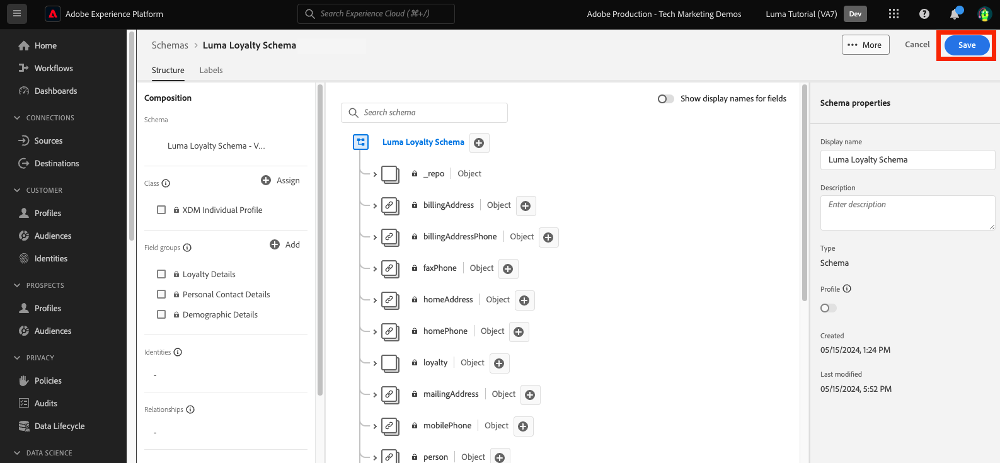
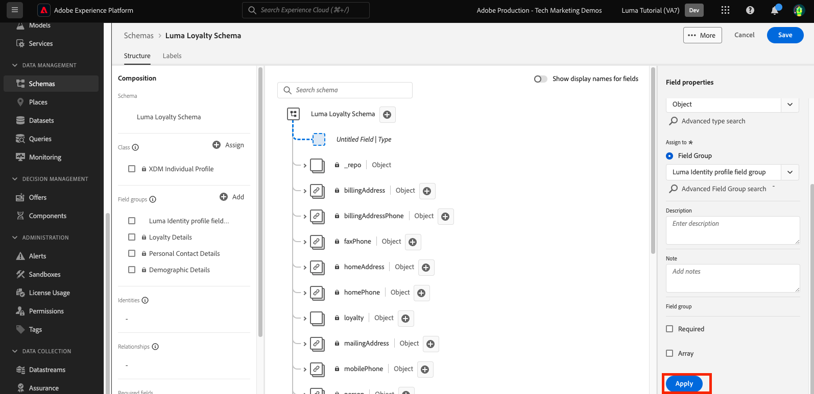

# Modelldaten in Schemata

<!-- 60min -->
In dieser Lektion modellieren Sie Lumas Daten in Schemata. Dies ist eine der längsten Lektionen im Tutorial, also lassen Sie sich ein Glas Wasser schnappen!

Standardisierung und Interoperabilität sind Schlüsselkonzepte von Adobe Experience Platform. Das Experience-Datenmodell (XDM) ist ein Versuch, Kundenerlebnisdaten zu standardisieren und Schemas für das Customer Experience Management zu definieren.

XDM ist eine öffentlich dokumentierte Spezifikation, die die Leistungsfähigkeit digitaler Erlebnisse verbessern soll. Es bietet allgemeine Strukturen und Definitionen für Anwendungen, die zur Kommunikation mit Platform-Diensten verwendet werden. Durch die Einhaltung von XDM-Standards können alle Kundenerlebnisdaten in ein gemeinsames System integriert werden, wodurch Erkenntnisse schneller und besser integriert verfügbar werden. Sie können wertvolle Einblicke durch Kundenaktionen gewinnen, Zielgruppen mithilfe von Segmenten definieren und Kundenattribute zur Personalisierung verwenden.

XDM ist das zugrunde liegende System, auf Basis dessen Adobe Experience Cloud als Teil von Experience Platform die richtige Botschaft der richtigen Person zur richtigen Zeit auf dem passenden Kanal präsentieren kann. Die Methode, auf der Experience Platform erstellt wird, **XDM System**, stellt Experience-Datenmodellschemata für die Verwendung durch Platform-Dienste bereit.

<!--
This seems too lengthy. The video should suffice

Key terms:

* **Schema**: a representation of your data. A schema is comprised of a class and optional field groups and is used to create datasets. A schema includes behavioral attributes, timestamp, identity, attribute definitions, and relationships.
* **XDM Profile Class**: a common schema class used to represent record data
* **XDM ExperienceEvent Class**: a common schema class used to represent time-series data
* **Field group**: allows users to extend reusable fields that contain variables defining one or more attribute intended to be included in a schema or added to a class.
* **Standard Field group**: an open-source Field group built to conform to common industry standards, used to accelerate implementation and support repeatable services operating on the data
* **Data type**: a reusable object with properties in a hierarchical representation. These can be standard types or custom-defined defined types to describe your own data in your own way (for example, a collection of fields that you use to describe your products). Unlike Field groups, data types can be used in schemas regardless of the class.
* **Field**: a field is the lowest level element of a schema. Each field has a name for referencing and a type to identify the type of data that it contains. Field types can include, integer, number, string, Boolean and schema.
-->

**Datenarchitekten** müssen außerhalb dieses Tutorials Schemas erstellen, doch **Dateningenieure** arbeiten eng mit den Schemas zusammen, die vom Datenarchitekten erstellt wurden.

Bevor Sie mit den Übungen beginnen, sehen Sie sich dieses kurze Video an, um mehr über Schemas und das Experience-Datenmodell (XDM) zu erfahren:
>[!VIDEO](https://video.tv.adobe.com/v/27105?learn=on)

>[!TIP]
>
> Für einen tieferen Einblick in die Datenmodellierung in Experience Platform empfehlen wir, die Wiedergabeliste [Modellieren Ihrer Kundenerlebnisdaten mit XDM](https://experienceleague.adobe.com/en/playlists/experience-platform-model-your-customer-experience-data-with-xdm) zu sehen, die kostenlos auf Experience League verfügbar ist!

## Erforderliche Berechtigungen

In der Lektion [Berechtigungen konfigurieren](configure-permissions.md) richten Sie alle Zugriffssteuerungen ein, die zum Abschluss dieser Lektion erforderlich sind.

<!--, specifically:

* Permission items **[!UICONTROL Data Modeling]** > **[!UICONTROL View Schemas]** and **[!UICONTROL Manage Schemas]**
* Permission item **[!UICONTROL Sandboxes]** > `Luma Tutorial`
* User-role access to the `Luma Tutorial Platform` product profile
* Developer-role access to the `Luma Tutorial Platform` product profile (for API)-->


<!--
## Luma's goals
-->

## Treueschema über Benutzeroberfläche erstellen

In dieser Übung erstellen wir ein Schema für die Treuedaten von Luma.

1. Wechseln Sie zur Benutzeroberfläche von Platform und stellen Sie sicher, dass Ihre Sandbox ausgewählt ist.
1. Navigieren Sie im linken Navigationsbereich zu **[!UICONTROL Schemas]** .
1. Wählen Sie oben rechts die Schaltfläche **[!UICONTROL Schema erstellen]** aus.
   

1. Wählen Sie im Workflow Schema erstellen **[!UICONTROL Individuelles Profil]** als Basisklasse für Ihr Schema aus, da wir die Attribute eines einzelnen Kunden modellieren werden (Punkte, Status usw.).
1. Klicken Sie auf **[!UICONTROL Weiter]**.
   

1. Geben Sie `Luma Loyalty Schema` in das Textfeld **[!UICONTROL Anzeigename des Schemas]** ein. Auf der folgenden Arbeitsfläche können Sie auch die Basisschemastruktur überprüfen und überprüfen, die von der ausgewählten Klasse bereitgestellt wird.
1. Wählen Sie **[!UICONTROL Beenden]** aus, um Ihr Schema zu erstellen.
   

### Standardfeldgruppen hinzufügen

Nach der Erstellung des Schemas werden Sie zum Schema-Editor weitergeleitet, wo Sie dem Schema Felder hinzufügen können. Sie können einzelne Felder direkt zum Schema hinzufügen oder Feldgruppen verwenden. Beachten Sie, dass alle einzelnen Felder weiterhin mit einer Klasse oder Feldergruppe verknüpft sind. Sie können aus einem großen Satz von branchenüblichen Feldergruppen wählen, die von Adobe bereitgestellt werden, oder Ihre eigenen erstellen. Wenn Sie mit der Modellierung Ihrer eigenen Daten im Experience Platform beginnen, sollten Sie sich mit den branchenüblichen Feldergruppen von Adobe vertraut machen. Wenn möglich, empfiehlt es sich, sie zu verwenden, da sie manchmal nachgelagerte Dienste wie Customer AI, Attribution AI und Adobe Analytics betreiben.

Beim Arbeiten mit Ihren eigenen Daten besteht ein wichtiger Schritt darin, zu bestimmen, welche Ihrer eigenen Daten in Platform erfasst und wie sie modelliert werden sollen. Dieses große Thema wird in der Wiedergabeliste [Modellieren Ihrer Kundenerlebnisdaten mit XDM](https://experienceleague.adobe.com/en/playlists/experience-platform-model-your-customer-experience-data-with-xdm) ausführlicher behandelt. In diesem Tutorial werde ich Sie lediglich durch die Implementierung einiger vorab festgelegter Schemas führen.

So fügen Sie Feldergruppen hinzu:

1. Wählen Sie **[!UICONTROL Hinzufügen]** unter der Überschrift **[!UICONTROL Feldergruppen]** aus.
   
1. Wählen Sie im Modal **[!UICONTROL Feldgruppen hinzufügen]** die folgenden Feldgruppen aus:
   1. **[!UICONTROL Demografische Details]** für grundlegende Kundendaten wie Name und Geburtsdatum
   1. **[!UICONTROL Persönliche Kontaktdetails]** für grundlegende Kontaktdaten wie E-Mail-Adresse und Telefonnummer
1. Sie können eine Vorschau der in der Feldergruppe hinzugefügten Felder anzeigen, indem Sie auf das Symbol rechts in der Zeile klicken.
   

1. Aktivieren Sie das Kontrollkästchen **[!UICONTROL Branche]** > **[!UICONTROL Einzelhandel]** , um branchenspezifische Feldergruppen anzuzeigen.
1. Wählen Sie **[!UICONTROL Details zum Treueprogramm]** aus, um die Felder des Treueprogramms hinzuzufügen.
1. Wählen Sie **[!UICONTROL Feldergruppen hinzufügen]** aus, um alle drei Feldergruppen zum Schema hinzuzufügen.
   


Nehmen Sie sich Zeit, um den aktuellen Status des Schemas zu untersuchen. Die Feldergruppen haben Standardfelder für eine Person, ihre Kontaktdaten und den Status des Treueprogramms hinzugefügt. Diese beiden Feldergruppen können bei der Erstellung von Schemata für die Daten Ihres Unternehmens hilfreich sein. Wählen Sie eine bestimmte Feldergruppenzeile aus oder aktivieren Sie das Kontrollkästchen neben dem Feldergruppennamen, um zu sehen, wie sich die Visualisierung ändert.

Um das Schema zu speichern, wählen Sie **[!UICONTROL Speichern]** aus.


>[!NOTE]
>
>Es ist in Ordnung, wenn eine Feldergruppe ein Feld für einen Datenpunkt hinzufügt, den Sie nicht erfassen. Beispielsweise könnte &quot;faxPhone&quot;ein Feld sein, für das Luma keine Daten erfasst. Das ist in Ordnung. Nur weil ein Feld im Schema definiert ist, bedeutet dies nicht, dass die entsprechenden Daten später erfasst werden *müssen*. Sie können das Feld auch aus dem Schema entfernen.

### Benutzerdefinierte Feldergruppe hinzufügen

Erstellen wir nun eine benutzerdefinierte Feldergruppe.

Die Gruppe &quot;Treuefeld&quot;enthielt zwar ein `loyaltyID` -Feld, Luma möchte jedoch alle Systemkennungen in einer Gruppe verwalten, um die Konsistenz ihrer Schemas sicherzustellen.

Feldergruppen müssen im Schema-Workflow erstellt werden. Sie haben die Möglichkeit zum:

* Fügen Sie Ihrem Schema zuerst ein neues benutzerdefiniertes Feld hinzu und erstellen Sie dann eine benutzerdefinierte Feldergruppe oder
* Erstellen Sie zuerst eine benutzerdefinierte Feldergruppe und fügen Sie ihr dann Felder hinzu.

In diesem Tutorial beginnen wir mit der Erstellung einer benutzerdefinierten Feldergruppe.

So erstellen Sie die Feldergruppe:

1. Wählen Sie **[!UICONTROL Hinzufügen]** unter der Überschrift **[!UICONTROL Schemafeldgruppen]** aus
   
1. Wählen Sie **[!UICONTROL Neue Feldergruppe erstellen]** aus
1. Verwenden Sie `Luma Identity profile field group` als **[!UICONTROL Anzeigenamen]**
1. Verwenden Sie `system identifiers for XDM Individual Profile class` als **[!UICONTROL Beschreibung]**
1. Wählen Sie **[!UICONTROL Feldergruppen hinzufügen]** aus.
   

Die neue, leere Feldergruppe wird Ihrem Schema hinzugefügt. Mit den Schaltflächen **[!UICONTROL +]** können Sie neue Felder zu einer beliebigen Position in der Hierarchie hinzufügen. In unserem Fall möchten wir Felder auf der Stammebene hinzufügen:

1. Wählen Sie neben dem Namen des Schemas **[!UICONTROL +]** aus. Dadurch wird ein neues Feld unter Ihrem Mandanten-ID-Namespace hinzugefügt, um Konflikte zwischen Ihren benutzerdefinierten Feldern und beliebigen Standardfeldern zu verwalten.
1. Fügen Sie in der Seitenleiste **[!UICONTROL Feldeigenschaften]** die Details des neuen Felds hinzu:
   1. **[!UICONTROL Feldname]**: `systemIdentifier`
   1. **[!UICONTROL Anzeigename]**: `System Identifier`
   1. **[!UICONTROL Typ]**: **[!UICONTROL Objekt]**
   1. Wählen Sie im Dropdown-Menü **[!UICONTROL Feldergruppe]** die von uns erstellte Feldergruppe **Luma-Identitätsprofil** aus.
      
   1. Wählen Sie **[!UICONTROL Anwenden]** aus.
      

Fügen Sie nun zwei Felder unter dem Objekt `systemIdentifier` hinzu:

1. Erstes Feld
   1. **[!UICONTROL Feldname]**: `loyaltyId`
   1. **[!UICONTROL Anzeigename:]** `Loyalty Id`
   1. **[!UICONTROL Typ]**: **[!UICONTROL String]**
1. Zweites Feld
   1. **[!UICONTROL Feldname]**: `crmId`
   1. **[!UICONTROL Anzeigename]**: `CRM Id`
   1. **[!UICONTROL Typ]**: **[!UICONTROL String]**

Ihre neue Feldergruppe sollte wie folgt aussehen: Wählen Sie die Schaltfläche **[!UICONTROL Speichern]** aus, um Ihr Schema zu speichern, aber lassen Sie das Schema für die nächste Übung geöffnet.


## Erstellen eines Datentyps

Feldergruppen wie Ihr neuer `Luma Identity profile field group` können in anderen Schemas wiederverwendet werden, sodass Sie Standarddatendefinitionen über mehrere Systeme hinweg erzwingen können. Sie können jedoch nur _in Schemas wiederverwendet werden, die eine Klasse_ teilen, in diesem Fall die Klasse &quot;XDM Individual Profile&quot;.

Der Datentyp ist ein weiteres Konstrukt mit mehreren Feldern, das in Schemas _über mehrere Klassen hinweg wiederverwendet werden kann_. Konvertieren wir unser neues `systemIdentifier` -Objekt in einen Datentyp:

Wenn der `Luma Loyalty Schema` noch geöffnet ist, wählen Sie das Objekt `systemIdentifier` aus und wählen Sie **[!UICONTROL In neuen Datentyp konvertieren]** aus.


Wenn Sie **[!UICONTROL Abbrechen]** aus dem Schema und zur Registerkarte **[!UICONTROL Datentypen]** navigieren, wird der neu erstellte Datentyp angezeigt. Wir werden diesen Datentyp später in der Lektion verwenden.


## CRM-Schema über API erstellen

Jetzt erstellen wir ein Schema mit der API.

>[!TIP]
>
> Wenn Sie die API-Übung lieber überspringen möchten, können Sie das folgende Schema mithilfe der Methode der Benutzeroberfläche erstellen:
>
> 1. Verwenden der Klasse [!UICONTROL Individuelles Profil]
> 1. Benennen Sie es `Luma CRM Schema`
> 1. Verwenden Sie die folgenden Feldergruppen: demografische Details, persönliche Kontaktdetails und Profilgruppe &quot;Luma Identity&quot;

Zuerst erstellen wir ein leeres Schema:

1. Öffnen Sie [!DNL Postman]
1. Wenn Sie kein Zugriffstoken haben, öffnen Sie die Anfrage **[!DNL OAuth: Request Access Token]** und wählen Sie **Senden** aus, um ein neues Zugriffstoken anzufordern.
1. Öffnen Sie Ihre Umgebungsvariablen und ändern Sie den Wert von **CONTAINER_ID** von `global` in `tenant`. Denken Sie daran, immer dann `tenant` zu verwenden, wenn Sie mit Ihren eigenen benutzerdefinierten Elementen in Platform interagieren möchten, z. B. beim Erstellen eines Schemas.
1. Wählen Sie **Speichern** aus.
   
1. Öffnen Sie die Anforderung **[!DNL Schema Registry API > Schemas > Create a new custom schema.]**
1. Öffnen Sie die Registerkarte **Hauptteil** , fügen Sie den folgenden Code ein und wählen Sie **Senden** aus, um den API-Aufruf durchzuführen. Mit diesem Aufruf wird ein neues Schema mit derselben `XDM Individual Profile` -Basisklasse erstellt:

   ```json
   {
     "type": "object",
     "title": "Luma CRM Schema",
     "description": "Schema for CRM data of Luma Retail ",
     "allOf": [{
       "$ref": "https://ns.adobe.com/xdm/context/profile"
     }]
   }
   ```

   >[!NOTE]
   >
   >Die Namespace-Referenzen in diesem und den nachfolgenden Codebeispielen (z. B. `https://ns.adobe.com/xdm/context/profile`) können mithilfe von Listen-API-Aufrufen mit dem Wert **[!DNL CONTAINER_ID]** abgerufen werden und akzeptieren die Kopfzeile, die auf die richtigen Werte gesetzt ist. Einige sind auch über die Benutzeroberfläche leicht zugänglich.

1. Sie sollten eine `201 Created` -Antwort erhalten
1. Kopieren Sie `meta:altId` aus dem Antworttext. Wir werden es später in einer anderen Übung verwenden.
   

1. Das neue Schema sollte in der Benutzeroberfläche sichtbar sein, jedoch ohne Feldergruppen
   

>[!NOTE]
>
> Die `meta:altId` - oder Schema-ID kann auch abgerufen werden, indem die API-Anfrage **[!DNL Schema Registry API > Schemas > Retrieve a list of schemas within the specified container.]** mit der **[!UICONTROL CONTAINER_ID]** auf `tenant` und einer accept-Kopfzeile `application/vnd.adobe.xdm+json` gesetzt wird.

>[!TIP]
>
> Häufige Probleme mit diesem Aufruf und mögliche Fehlerbehebungen:
>
> * No auth token: Führen Sie die Anfrage **OAuth: Request Access Token** aus, um ein neues Token zu generieren
> * `401: Not Authorized to PUT/POST/PATCH/DELETE for this path : /global/schemas/`: Aktualisieren Sie die Umgebungsvariable **CONTAINER_ID** von `global` auf `tenant`
> * `403: PALM Access Denied. POST access is denied for this resource from access control`: Überprüfen Sie Ihre Benutzerberechtigungen in der Admin Console

### Standardfeldgruppen hinzufügen

Jetzt ist es an der Zeit, die Feldergruppen zum Schema hinzuzufügen:

1. Öffnen Sie in [!DNL Postman] die Anforderung **[!DNL Schema Registry API > Schemas > Update one or more attributes of a custom schema specified by ID.]**.
1. Fügen Sie auf der Registerkarte **Parameter** den Wert `meta:altId` aus der vorherigen Antwort als `SCHEMA_ID` ein.
1. Öffnen Sie die Registerkarte &quot;Hauptteil&quot;, fügen Sie den folgenden Code ein und wählen Sie **Senden** aus, um den API-Aufruf durchzuführen. Durch diesen Aufruf werden die Standardfeldgruppen zu Ihrem `Luma CRM Schema` hinzugefügt:

   ```json
   [{
       "op": "add",
       "path": "/allOf/-",
       "value": {
         "$ref": "https://ns.adobe.com/xdm/context/profile-personal-details"
       }
     },
     {
       "op": "add",
       "path": "/allOf/-",
       "value": {
         "$ref": "https://ns.adobe.com/xdm/context/profile-person-details"
       }
     }
   ]
   ```

1. Sie sollten den Status &quot;200 OK&quot;für die Antwort erhalten und die Feldergruppen sollten als Teil Ihres Schemas in der Benutzeroberfläche sichtbar sein

   


### Benutzerdefinierte Feldergruppe hinzufügen

Fügen wir nun unsere `Luma Identity profile field group` zum Schema hinzu. Zunächst müssen wir die ID unserer neuen Feldergruppe mithilfe einer Listen-API finden:

1. Öffnen Sie die Anforderung **[!DNL Schema Registry API > Field groups > Retrieve a list of field groups within the specified container.]**
1. Wählen Sie die Schaltfläche **Senden** aus, um eine Liste aller benutzerdefinierten Feldergruppen in Ihrem Konto abzurufen.
1. Den `$id` -Wert des `Luma Identity profile field group` ermitteln (Ihr Wert unterscheidet sich vom Wert in diesem Screenshot)
   
1. Öffnen Sie die Anfrage **[!DNL Schema Registry API > Schemas > Update one or more attributes of a custom schema specified by ID.]** erneut.
1. Auf der Registerkarte **Parameter** sollte weiterhin das Feld `$id` Ihres Schemas stehen.
1. Öffnen Sie die Registerkarte **Hauptteil** und fügen Sie den folgenden Code ein. Ersetzen Sie dabei den Wert `$ref` durch den Wert `$id` Ihres eigenen `Luma Identity profile field group`:

   ```json
   [{
     "op": "add",
     "path": "/allOf/-",
     "value": {
       "$ref": "REPLACE_WITH_YOUR_OWN_FIELD_GROUP_ID"
     }
   }]
   ```

1. Wählen Sie **Senden** aus
   

Überprüfen Sie, ob die Feldergruppe zum Schema hinzugefügt wurde, indem Sie sowohl die API-Antwort als auch die Benutzeroberfläche überprüfen.

## Offline-Kaufereignisschema erstellen

Erstellen wir nun ein Schema, das auf der Klasse **[!UICONTROL Erlebnisereignis]** für die Offline-Kaufdaten von Luma basiert. Da Sie sich jetzt mit der Benutzeroberfläche des Schema-Editors vertraut machen, reduziere ich die Anzahl der Screenshots in den Anweisungen:

1. Erstellen Sie ein Schema mit der Klasse **[!UICONTROL Erlebnisereignis]** .
1. Nennen Sie Ihr Schema mit &quot;`Luma Offline Purchase Events Schema`&quot;.
1. Fügen Sie die Standardfeldgruppe **[!UICONTROL Commerce Details]** hinzu, um allgemeine Bestelldetails zu erfassen. Verbringen Sie einige Minuten damit, die Objekte darin zu erforschen.
1. Suchen Sie nach `Luma Identity profile field group`. Es ist nicht verfügbar! Denken Sie daran, dass Feldgruppen mit einer Klasse verknüpft sind. Da wir für dieses Schema eine andere Klasse verwenden, können wir sie nicht verwenden. Wir müssen eine neue Feldergruppe für die XDM ExperienceEvent-Klasse hinzufügen, die die Identitätsfelder enthält. Unser Datentyp wird das ganz einfach machen!
1. Optionsfeld **[!UICONTROL Neue Feldergruppe erstellen]** auswählen
1. Geben Sie den **[!UICONTROL Anzeigenamen]** als `Luma Identity ExperienceEvent field group` ein und wählen Sie die Schaltfläche **[!UICONTROL Feldgruppen hinzufügen]** aus
1. Klicken Sie auf **[!UICONTROL +]** neben dem Namen des Schemas.
1. Geben Sie als **[!UICONTROL Feldnamen]** den Wert `systemIdentifier` ein.
1. Geben Sie als **[!UICONTROL Anzeigenamen]** den Wert `System Identifier` ein.
1. Wählen Sie als **[!UICONTROL Typ]** die Option **Systemkennung** aus, die dem zuvor erstellten benutzerdefinierten Datentyp entspricht.
1. Wählen Sie als **[!UICONTROL Feldergruppe]** die Feldgruppe **Luma Identity ExperienceEvent** aus.
1. Wählen Sie die Schaltfläche **[!UICONTROL Anwenden]** aus.
1. Wählen Sie die Schaltfläche **[!UICONTROL Speichern]** aus.

Beachten Sie, dass der Datentyp alle Felder hinzugefügt hat!


Wählen Sie außerdem **[!UICONTROL XDM ExperienceEvent]** unter der Überschrift **[!UICONTROL Klasse]** aus und überprüfen Sie einige der von dieser Klasse hinzugefügten Felder. Beachten Sie, dass bei der Verwendung der XDM ExperienceEvent-Klasse die Felder _id und timestamp erforderlich sind. Diese Felder müssen für jeden Datensatz, den Sie bei Verwendung dieses Schemas erfassen, ausgefüllt werden:


## Webereignisschema erstellen

Jetzt erstellen wir ein weiteres Schema für die Website-Daten von Luma. An dieser Stelle sollten Sie ein Experte in der Erstellung von Schemas sein! Erstellen Sie das folgende Schema mit diesen Eigenschaften

| Eigenschaft | Wert |
|---------------|-----------------|
| Klasse | Erlebnisereignis |
| Schemaname | Luma-Webereignisschema |
| Feldergruppe | AEP Web SDK ExperienceEvent |
| Feldergruppe | Erlebnisereignis für Verbraucher |

Wählen Sie die Feldergruppe **[!UICONTROL Consumer Experience Event]** aus. Diese Feldergruppe enthält die Commerce- und productListItems-Objekte, die sich auch in [!UICONTROL Commerce-Details] befanden. Das Ereignis &quot;Consumer Experience Event&quot;] ist eine Kombination aus mehreren anderen Standardfeldgruppen, die auch separat verfügbar sind. [!UICONTROL  Die Feldergruppe [!UICONTROL AEP Web SDK ExperienceEvent] enthält auch andere Feldergruppen, darunter einige derselben in [!UICONTROL Consumer Experience Event]. Glücklicherweise verschmelzen sie sich nahtlos.

Beachten Sie, dass wir diesem Schema nicht die `Luma Identity ExperienceEvent field group` hinzugefügt haben. Dies liegt daran, dass das Web SDK eine andere Methode zur Erfassung von Identitäten hat. Wenn Sie die Klasse **[!UICONTROL XDM ExperienceEvent]** im Abschnitt **[!UICONTROL Komposition]** des Schema-Editors auswählen, werden Sie feststellen, dass eines der Felder, die standardmäßig hinzugefügt werden, **[!UICONTROL IdentityMap]** heißt. [!DNL IdentityMap] wird von verschiedenen Adobe-Applikationen verwendet, um eine Verbindung zu Platform herzustellen. In der Streaming-Erfassung sehen Sie, wie Identitäten über identityMap an Platform gesendet werden.


## Produktkatalog-Schema erstellen

Mithilfe der Feldergruppen [!UICONTROL Commerce-Details] und [!UICONTROL Kundenerlebnis-Ereignis] meldet Luma einige Details zu produktbezogenen Ereignissen über den standardmäßigen Datentyp productListItems . Sie verfügen jedoch auch über zusätzliche Produktdetailfelder, die sie an Platform senden möchten. Anstatt alle diese Felder in ihren Point-of-Sale- und E-Commerce-Systemen zu erfassen, würde Luma es vorziehen, diese Felder direkt aus ihrem Produktkatalogsystem zu erfassen. Mit einer &quot;Schemabeziehung&quot;können Sie eine Beziehung zwischen zwei Schemas zum Zweck der Klassifizierung oder Suche definieren. Luma wird eine Beziehung verwenden, um ihre Produktdetails zu klassifizieren. Wir werden den Prozess jetzt beginnen und am Ende der nächsten Lektion abschließen.

>[!NOTE]
>
>Wenn Sie bereits Analytics- oder Target-Kunde sind, entspricht die Klassifizierung von Entitäten mit Schemabeziehungen der SAINT-Klassifizierung oder dem Hochladen Ihres Produktkatalogs für Recommendations

Zunächst müssen wir ein Schema für den Produktkatalog von Luma mithilfe einer benutzerdefinierten Klasse erstellen:

1. Wählen Sie die Schaltfläche **[!UICONTROL Schema erstellen]** aus.
1. Wählen Sie im Workflow Schema erstellen die Option **[!UICONTROL Sonstige]** aus.
   
1. Wählen Sie die Schaltfläche **[!UICONTROL Klasse erstellen]** aus
1. Benennen Sie es `Luma Product Catalog Class`
1. Belassen Sie das **[!UICONTROL Verhalten]** als **[!UICONTROL Datensatz]** .
1. Wählen Sie die Schaltfläche **[!UICONTROL Erstellen]** aus.
   
1. Die von Ihnen erstellte **Luma Product Catalog Class** wird in der Tabelle &quot;Klassen&quot;unten angezeigt. Stellen Sie sicher, dass die Klasse ausgewählt ist, und wählen Sie dann **[!UICONTROL Weiter]** aus.
   
1. Nennen Sie das Schema &quot;`Luma Product Catalog Schema`&quot;.
1. Erstellen Sie eine neue [!UICONTROL Feldergruppe] mit dem Namen `Luma Product Catalog field group` mit den folgenden Feldern:
   1. productName: Product Name: String
   1. productCategory: Product Category: String
   1. productColor: Product Color: String
   1. productSku: Product SKU: String | Erforderlich
   1. productSize: Produktgröße: Zeichenfolge
   1. productPrice: Product Price: Double
1. **[!UICONTROL Speichern]** des Schemas

Ihr neues Schema sollte wie folgt aussehen: Beachten Sie, wie das Feld `productSku` im Abschnitt [!UICONTROL Erforderliche Felder] aufgeführt wird:


Der nächste Schritt besteht darin, die Beziehung zwischen den beiden ExperienceEvent-Schemas und den `Luma Product Catalog Schema` zu definieren. Es gibt jedoch einige zusätzliche Schritte, die wir in der nächsten Lektion ausführen müssen, bevor wir dies tun können.


## Weitere Ressourcen

* [Experience-Datenmodell (XDM) - Systemdokumentation](https://experienceleague.adobe.com/docs/experience-platform/xdm/home.html?lang=de)
* [Schema Registry-API](https://www.adobe.io/experience-platform-apis/references/schema-registry/)


Jetzt, da Sie Ihre Schemas haben, können Sie [Identitäten zuordnen](map-identities.md)!
