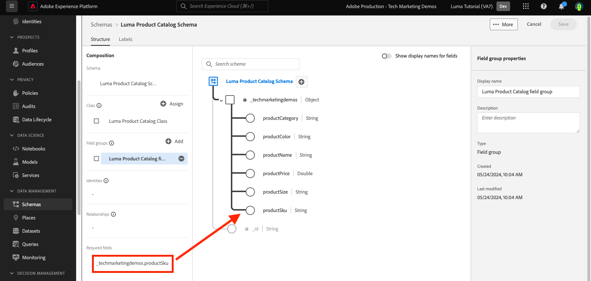

# Modelldaten in Schemata

<!-- 60min -->
In dieser Lektion modellieren Sie Lumas Daten in Schemata. Dies ist eine der längsten Lektionen im Tutorial, also lassen Sie sich ein Glas Wasser schnappen!

Standardisierung und Interoperabilität sind Schlüsselkonzepte von Adobe Experience Platform. Das Experience-Datenmodell (XDM) ist ein Versuch, Kundenerlebnisdaten zu standardisieren und Schemas für das Customer Experience Management zu definieren.

XDM ist eine öffentlich dokumentierte Spezifikation, die die Leistungsfähigkeit digitaler Erlebnisse verbessern soll. Es bietet allgemeine Strukturen und Definitionen für Anwendungen, die zur Kommunikation mit Platform-Diensten verwendet werden. Durch die Einhaltung von XDM-Standards können alle Kundenerlebnisdaten in ein gemeinsames System integriert werden, wodurch Erkenntnisse schneller und besser integriert verfügbar werden. Sie können wertvolle Einblicke durch Kundenaktionen gewinnen, Zielgruppen mithilfe von Segmenten definieren und Kundenattribute zur Personalisierung verwenden.

XDM ist das zugrunde liegende System, auf Basis dessen Adobe Experience Cloud als Teil von Experience Platform die richtige Botschaft der richtigen Person zur richtigen Zeit auf dem passenden Kanal präsentieren kann. die Methode, auf der Experience Platform aufgebaut ist, **XDM-System** implementiert Experience-Datenmodell-Schemas für die Verwendung durch Platform-Dienste.

<!--
This seems too lengthy. The video should suffice

Key terms:

* **Schema**: a representation of your data. A schema is comprised of a class and optional field groups and is used to create datasets. A schema includes behavioral attributes, timestamp, identity, attribute definitions, and relationships.
* **XDM Profile Class**: a common schema class used to represent record data
* **XDM ExperienceEvent Class**: a common schema class used to represent time-series data
* **Field group**: allows users to extend reusable fields that contain variables defining one or more attribute intended to be included in a schema or added to a class.
* **Standard Field group**: an open-source Field group built to conform to common industry standards, used to accelerate implementation and support repeatable services operating on the data
* **Data type**: a reusable object with properties in a hierarchical representation. These can be standard types or custom-defined defined types to describe your own data in your own way (for example, a collection of fields that you use to describe your products). Unlike Field groups, data types can be used in schemas regardless of the class.
* **Field**: a field is the lowest level element of a schema. Each field has a name for referencing and a type to identify the type of data that it contains. Field types can include, integer, number, string, Boolean and schema.
-->

**Datenarchitekten** müssen außerhalb dieses Tutorials Schemas erstellen, jedoch **Dateningenieure** arbeitet eng mit den Schemas zusammen, die vom Data Architect erstellt wurden.

Bevor Sie mit den Übungen beginnen, sehen Sie sich dieses kurze Video an, um mehr über Schemas und das Experience-Datenmodell (XDM) zu erfahren:
>[!VIDEO](https://video.tv.adobe.com/v/27105?learn=on)

>[!TIP]
>
> Für einen tieferen Einblick in die Datenmodellierung in Experience Platform empfehlen wir, den Kurs zu verfolgen [Modellieren Ihrer Kundenerlebnisdaten mit XDM](https://experienceleague.adobe.com/?recommended=ExperiencePlatform-D-1-2021.1.xdm&amp;lang=de), kostenlos auf Experience League!

## Erforderliche Berechtigungen

Im [Berechtigungen konfigurieren](configure-permissions.md) Lektion erstellen Sie alle Zugriffssteuerungen, die zum Abschluss dieser Lektion erforderlich sind.

<!--, specifically:

* Permission items **[!UICONTROL Data Modeling]** > **[!UICONTROL View Schemas]** and **[!UICONTROL Manage Schemas]**
* Permission item **[!UICONTROL Sandboxes]** > `Luma Tutorial`
* User-role access to the `Luma Tutorial Platform` product profile
* Developer-role access to the `Luma Tutorial Platform` product profile (for API)-->


<!--
## Luma's goals
-->

## Treueschema über Benutzeroberfläche erstellen

In dieser Übung erstellen wir ein Schema für die Treuedaten von Luma.

1. Wechseln Sie zur Benutzeroberfläche von Platform und stellen Sie sicher, dass Ihre Sandbox ausgewählt ist.
1. Navigieren Sie zu **[!UICONTROL Schemas]** in der linken Navigation.
1. Wählen Sie die **[!UICONTROL Schema erstellen]** rechts oben.
   

1. Wählen Sie im Workflow Schema erstellen die Option **[!UICONTROL Individuelles Profil]** als Basisklasse für Ihr Schema, da wir Attribute eines einzelnen Kunden modellieren werden (Punkte, Status usw.).
1. Klicken Sie auf **[!UICONTROL Weiter]**.
   

1. Eingabe `Luma Loyalty Schema` im **[!UICONTROL Anzeigename des Schemas]** Textfeld. Auf der folgenden Arbeitsfläche können Sie auch die Basisschemastruktur überprüfen und überprüfen, die von der ausgewählten Klasse bereitgestellt wird.
1. Auswählen **[!UICONTROL Beenden]** , um Ihr Schema zu erstellen.
   

### Standardfeldgruppen hinzufügen

Nach der Erstellung des Schemas werden Sie zum Schema-Editor weitergeleitet, wo Sie dem Schema Felder hinzufügen können. Sie können einzelne Felder direkt zum Schema hinzufügen oder Feldgruppen verwenden. Beachten Sie, dass alle einzelnen Felder weiterhin mit einer Klasse oder Feldergruppe verknüpft sind. Sie können aus einem großen Satz von branchenüblichen Feldergruppen wählen, die von Adobe bereitgestellt werden, oder Ihre eigenen erstellen. Wenn Sie mit der Modellierung Ihrer eigenen Daten im Experience Platform beginnen, sollten Sie sich mit den branchenüblichen Feldergruppen von Adobe vertraut machen. Wenn möglich, empfiehlt es sich, sie zu verwenden, da sie manchmal nachgelagerte Dienste wie Customer AI, Attribution AI und Adobe Analytics betreiben.

Beim Arbeiten mit Ihren eigenen Daten besteht ein wichtiger Schritt darin, zu bestimmen, welche Ihrer eigenen Daten in Platform erfasst und wie sie modelliert werden sollen. Dieses große Thema wird im Laufe des Kurses eingehender diskutiert [Modellieren Ihrer Kundenerlebnisdaten mit XDM](https://experienceleague.adobe.com/?recommended=ExperiencePlatform-D-1-2021.1.xdm&amp;lang=de). In diesem Tutorial werde ich Sie lediglich durch die Implementierung einiger vorab festgelegter Schemas führen.

So fügen Sie Feldergruppen hinzu:

1. Auswählen **[!UICONTROL Hinzufügen]** unter **[!UICONTROL Feldergruppen]** -Überschrift.
   
1. Im **[!UICONTROL Feldergruppen hinzufügen]** modal die folgenden Feldergruppen auswählen:
   1. **[!UICONTROL Demografische Details]** für grundlegende Kundendaten wie Name und Geburtsdatum
   1. **[!UICONTROL Persönliche Kontaktangaben]** für grundlegende Kontaktdaten wie E-Mail-Adresse und Telefonnummer
1. Sie können eine Vorschau der in der Feldergruppe hinzugefügten Felder anzeigen, indem Sie auf das Symbol rechts in der Zeile klicken.
   

1. Überprüfen Sie die **[!UICONTROL Branche]** > **[!UICONTROL Einzelhandel]** zum Anzeigen branchenspezifischer Feldergruppen.
1. Auswählen **[!UICONTROL Treuedetails]** , um die Felder des Treueprogramms hinzuzufügen.
1. Auswählen **[!UICONTROL Feldergruppen hinzufügen]** , um alle drei Feldergruppen zum Schema hinzuzufügen.
   


Nehmen Sie sich Zeit, um den aktuellen Status des Schemas zu untersuchen. Die Feldergruppen haben Standardfelder für eine Person, ihre Kontaktdaten und den Status des Treueprogramms hinzugefügt. Diese beiden Feldergruppen können bei der Erstellung von Schemata für die Daten Ihres Unternehmens hilfreich sein. Wählen Sie eine bestimmte Feldergruppenzeile aus oder aktivieren Sie das Kontrollkästchen neben dem Feldergruppennamen, um zu sehen, wie sich die Visualisierung ändert.

Um das Schema zu speichern, wählen Sie **[!UICONTROL Speichern]**.


>[!NOTE]
>
>Es ist in Ordnung, wenn eine Feldergruppe ein Feld für einen Datenpunkt hinzufügt, den Sie nicht erfassen. Beispielsweise könnte &quot;faxPhone&quot;ein Feld sein, für das Luma keine Daten erfasst. Das ist in Ordnung. Nur weil ein Feld im Schema definiert ist, bedeutet dies nicht, dass die Daten dafür verwendet werden *must* später erfasst werden. Sie können das Feld auch aus dem Schema entfernen.

### Benutzerdefinierte Feldergruppe hinzufügen

Erstellen wir nun eine benutzerdefinierte Feldergruppe.

Während die Gruppe &quot;Treuefeld&quot;eine `loyaltyID` -Feld, möchte Luma alle Systemkennungen in einer Gruppe verwalten, um die Konsistenz ihrer Schemas zu gewährleisten.

Feldergruppen müssen im Schema-Workflow erstellt werden. Sie haben die Möglichkeit zum:

* Fügen Sie Ihrem Schema zuerst ein neues benutzerdefiniertes Feld hinzu und erstellen Sie dann eine benutzerdefinierte Feldergruppe oder
* Erstellen Sie zuerst eine benutzerdefinierte Feldergruppe und fügen Sie ihr dann Felder hinzu.

In diesem Tutorial beginnen wir mit der Erstellung einer benutzerdefinierten Feldergruppe.

So erstellen Sie die Feldergruppe:

1. Auswählen **[!UICONTROL Hinzufügen]** unter **[!UICONTROL Schemafeldgruppen]** heading
   
1. Auswählen **[!UICONTROL Neue Feldergruppe erstellen]**
1. Verwendung `Luma Identity profile field group` als **[!UICONTROL Anzeigename]**
1. Verwendung `system identifiers for XDM Individual Profile class` als **[!UICONTROL Beschreibung]**
1. Auswählen **[!UICONTROL Feldergruppen hinzufügen]**
   

Die neue, leere Feldergruppe wird Ihrem Schema hinzugefügt. Die **[!UICONTROL +]** -Schaltflächen können verwendet werden, um neue Felder an einer beliebigen Stelle in der Hierarchie hinzuzufügen. In unserem Fall möchten wir Felder auf der Stammebene hinzufügen:

1. Auswählen **[!UICONTROL +]** neben dem Namen des Schemas. Dadurch wird ein neues Feld unter Ihrem Mandanten-ID-Namespace hinzugefügt, um Konflikte zwischen Ihren benutzerdefinierten Feldern und beliebigen Standardfeldern zu verwalten.
1. Im **[!UICONTROL Feldeigenschaften]** Seitenleiste fügen Sie die Details des neuen Felds hinzu:
   1. **[!UICONTROL Feldname]**: `systemIdentifier`
   1. **[!UICONTROL Anzeigename]**: `System Identifier`
   1. **[!UICONTROL Typ]**: **[!UICONTROL Objekt]**
   1. Im **[!UICONTROL Feldergruppe]** Dropdown-Liste auswählen **Luma-Identitäts-Profilgruppe** die wir erstellt haben.
      
   1. Auswählen **[!UICONTROL Anwenden]**
      

Fügen Sie nun zwei Felder unter dem `systemIdentifier` -Objekt:

1. Erstes Feld
   1. **[!UICONTROL Feldname]**: `loyaltyId`
   1. **[!UICONTROL Anzeigename:]** `Loyalty Id`
   1. **[!UICONTROL Typ]**: **[!UICONTROL Zeichenfolge]**
1. Zweites Feld
   1. **[!UICONTROL Feldname]**: `crmId`
   1. **[!UICONTROL Anzeigename]**: `CRM Id`
   1. **[!UICONTROL Typ]**: **[!UICONTROL Zeichenfolge]**

Ihre neue Feldergruppe sollte wie folgt aussehen: Wählen Sie die **[!UICONTROL Speichern]** -Schaltfläche, um Ihr Schema zu speichern, aber das Schema für die nächste Übung offen lassen.


## Erstellen eines Datentyps

Feldergruppen, z. B. Ihre neue `Luma Identity profile field group`kann in anderen Schemas wiederverwendet werden, sodass Sie Standarddatendefinitionen über mehrere Systeme hinweg erzwingen können. Aber sie können nur wiederverwendet werden _in Schemas, die eine Klasse gemeinsam haben_, in diesem Fall die Klasse XDM Individual Profile .

Der Datentyp ist ein weiteres Konstrukt mit mehreren Feldern, das in Schemas wiederverwendet werden kann _mehrere Klassen_. Konvertieren wir unsere neue `systemIdentifier` Objekt in einen Datentyp ein:

Mit dem `Luma Loyalty Schema` weiterhin geöffnet sein, wählen Sie die `systemIdentifier` Objekt und auswählen  **[!UICONTROL In neuen Datentyp konvertieren]**


Wenn Sie **[!UICONTROL Abbrechen]** aus dem Schema und navigieren Sie zum **[!UICONTROL Datentypen]** angezeigt, wird der neu erstellte Datentyp angezeigt. Wir werden diesen Datentyp später in der Lektion verwenden.


## CRM-Schema über API erstellen

Jetzt erstellen wir ein Schema mit der API.

>[!TIP]
>
> Wenn Sie die API-Übung lieber überspringen möchten, können Sie das folgende Schema mithilfe der Methode der Benutzeroberfläche erstellen:
>
> 1. Verwenden Sie die [!UICONTROL Individuelles Profil] class
> 1. Benennen Sie ihn `Luma CRM Schema`
> 1. Verwenden Sie die folgenden Feldergruppen: demografische Details, persönliche Kontaktdetails und Profilgruppe &quot;Luma Identity&quot;

Zuerst erstellen wir ein leeres Schema:

1. Öffnen [!DNL Postman]
1. Wenn Sie kein Zugriffstoken haben, öffnen Sie die Anfrage **[!DNL OAuth: Request Access Token]** und wählen **Senden** , um ein neues Zugriffstoken anzufordern.
1. Öffnen Sie Ihre Umgebungsvariablen und ändern Sie den Wert von **CONTAINER_ID** von `global` nach `tenant`. Denken Sie daran, dass Sie `tenant` wann immer Sie mit Ihren eigenen benutzerdefinierten Elementen in Platform interagieren möchten, z. B. beim Erstellen eines Schemas.
1. Auswählen **Speichern**
   
1. Anfrage öffnen **[!DNL Schema Registry API > Schemas > Create a new custom schema.]**
1. Öffnen Sie die **body** und fügen Sie den folgenden Code ein und wählen Sie **Senden** , um den API-Aufruf durchzuführen. Mit diesem Aufruf wird ein neues Schema mit demselben `XDM Individual Profile` base-Klasse:

   ```json
   {
     "type": "object",
     "title": "Luma CRM Schema",
     "description": "Schema for CRM data of Luma Retail ",
     "allOf": [{
       "$ref": "https://ns.adobe.com/xdm/context/profile"
     }]
   }
   ```

   >[!NOTE]
   >
   >Der Namespace verweist in diesem und den nachfolgenden Codebeispielen (z. B. `https://ns.adobe.com/xdm/context/profile`), kann mithilfe von Listen-API-Aufrufen mit der **[!DNL CONTAINER_ID]** und akzeptieren Kopfzeilen, die auf die richtigen Werte gesetzt sind. Einige sind auch über die Benutzeroberfläche leicht zugänglich.

1. Sie sollten eine `201 Created` response
1. Kopieren `meta:altId` aus dem Antworttext. Wir werden es später in einer anderen Übung verwenden.
   

1. Das neue Schema sollte in der Benutzeroberfläche sichtbar sein, jedoch ohne Feldergruppen
   

>[!NOTE]
>
> Die `meta:altId` oder eine Schema-ID auch abgerufen werden kann, indem die API-Anfrage gesendet wird **[!DNL Schema Registry API > Schemas > Retrieve a list of schemas within the specified container.]** mit dem **[!UICONTROL CONTAINER_ID]** auf `tenant` und eine Überschrift &quot;accept&quot; `application/vnd.adobe.xdm+json`.

>[!TIP]
>
> Häufige Probleme mit diesem Aufruf und mögliche Fehlerbehebungen:
>
> * No auth token: Führen Sie den **OAuth: Zugriffstoken anfordern** Anfrage zum Generieren eines neuen Tokens
> * `401: Not Authorized to PUT/POST/PATCH/DELETE for this path : /global/schemas/`: Aktualisieren Sie die **CONTAINER_ID** Umgebungsvariable aus `global` nach `tenant`
> * `403: PALM Access Denied. POST access is denied for this resource from access control`: Überprüfen Sie Ihre Benutzerberechtigungen in der Admin Console.

### Standardfeldgruppen hinzufügen

Jetzt ist es an der Zeit, die Feldergruppen zum Schema hinzuzufügen:

1. In [!DNL Postman], die Anforderung öffnen **[!DNL Schema Registry API > Schemas > Update one or more attributes of a custom schema specified by ID.]**
1. Im **Parameter** Registerkarte, fügen Sie die `meta:altId` Wert aus der vorherigen Antwort als `SCHEMA_ID`
1. Öffnen Sie die Registerkarte &quot;Hauptteil&quot;, fügen Sie den folgenden Code ein und wählen Sie **Senden** , um den API-Aufruf durchzuführen. Durch diesen Aufruf werden die Standardfeldgruppen zu Ihrem `Luma CRM Schema`:

   ```json
   [{
       "op": "add",
       "path": "/allOf/-",
       "value": {
         "$ref": "https://ns.adobe.com/xdm/context/profile-personal-details"
       }
     },
     {
       "op": "add",
       "path": "/allOf/-",
       "value": {
         "$ref": "https://ns.adobe.com/xdm/context/profile-person-details"
       }
     }
   ]
   ```

1. Sie sollten den Status &quot;200 OK&quot;für die Antwort erhalten und die Feldergruppen sollten als Teil Ihres Schemas in der Benutzeroberfläche sichtbar sein

   


### Benutzerdefinierte Feldergruppe hinzufügen

Fügen wir nun unsere `Luma Identity profile field group` zum Schema. Zunächst müssen wir die ID unserer neuen Feldergruppe mithilfe einer Listen-API finden:

1. Anfrage öffnen **[!DNL Schema Registry API > Field groups > Retrieve a list of field groups within the specified container.]**
1. Wählen Sie die **Senden** -Schaltfläche zum Abrufen einer Liste aller benutzerdefinierten Feldergruppen in Ihrem Konto
1. Grab die `$id` Wert der `Luma Identity profile field group` (Ihr unterscheidet sich vom Wert in diesem Screenshot)
   
1. Anfrage öffnen **[!DNL Schema Registry API > Schemas > Update one or more attributes of a custom schema specified by ID.]** repeat
1. Die **Parameter** -Registerkarte sollte weiterhin enthalten sein `$id` Ihres Schemas
1. Öffnen Sie die **body** und fügen Sie den folgenden Code ein, ersetzen Sie die `$ref` -Wert durch `$id` Ihres eigenen `Luma Identity profile field group`:

   ```json
   [{
     "op": "add",
     "path": "/allOf/-",
     "value": {
       "$ref": "REPLACE_WITH_YOUR_OWN_FIELD_GROUP_ID"
     }
   }]
   ```

1. Auswählen **Senden**
   

Überprüfen Sie, ob die Feldergruppe zum Schema hinzugefügt wurde, indem Sie sowohl die API-Antwort als auch die Benutzeroberfläche überprüfen.

## Offline-Kaufereignisschema erstellen

Erstellen wir nun ein Schema basierend auf der **[!UICONTROL Erlebnisereignis]** -Klasse für die Offline-Kaufdaten von Luma. Da Sie sich jetzt mit der Benutzeroberfläche des Schema-Editors vertraut machen, reduziere ich die Anzahl der Screenshots in den Anweisungen:

1. Erstellen Sie ein Schema mit der **[!UICONTROL Erlebnisereignis]** -Klasse.
1. Benennen Sie Ihr Schema. `Luma Offline Purchase Events Schema`.
1. Standardfeldgruppe hinzufügen **[!UICONTROL Commerce-Details]** , um allgemeine Bestelldetails zu erfassen. Verbringen Sie einige Minuten damit, die Objekte darin zu erforschen.
1. Suchen Sie nach `Luma Identity profile field group`. Es ist nicht verfügbar! Denken Sie daran, dass Feldgruppen mit einer Klasse verknüpft sind. Da wir für dieses Schema eine andere Klasse verwenden, können wir sie nicht verwenden. Wir müssen eine neue Feldergruppe für die XDM ExperienceEvent-Klasse hinzufügen, die die Identitätsfelder enthält. Unser Datentyp wird das ganz einfach machen!
1. Wählen Sie die **[!UICONTROL Neue Feldergruppe erstellen]** Optionsfeld
1. Geben Sie die **[!UICONTROL Anzeigename]** as `Luma Identity ExperienceEvent field group` und wählen Sie die **[!UICONTROL Feldergruppen hinzufügen]** button
1. Klicken Sie auf **[!UICONTROL +]** neben dem Namen des Schemas.
1. Als **[!UICONTROL Feldname]**, eingeben `systemIdentifier`.
1. Als **[!UICONTROL Anzeigename]**, eingeben `System Identifier`.
1. Als **[!UICONTROL Typ]** auswählen **Systemkennung** Dies ist der benutzerdefinierte Datentyp, den Sie zuvor erstellt haben.
1. Als **[!UICONTROL Feldergruppe]** select **Luma Identity ExperienceEvent-Feldergruppe**.
1. Wählen Sie die **[!UICONTROL Anwenden]** Schaltfläche.
1. Wählen Sie die **[!UICONTROL Speichern]** Schaltfläche.

Beachten Sie, dass der Datentyp alle Felder hinzugefügt hat!


Wählen Sie außerdem **[!UICONTROL XDM ExperienceEvent]** unter **[!UICONTROL Klasse]** Überschriften erstellen und einige der von dieser Klasse hinzugefügten Felder überprüfen. Beachten Sie, dass bei der Verwendung der XDM ExperienceEvent-Klasse die Felder _id und timestamp erforderlich sind. Diese Felder müssen für jeden Datensatz, den Sie bei Verwendung dieses Schemas erfassen, ausgefüllt werden:


## Webereignisschema erstellen

Jetzt erstellen wir ein weiteres Schema für die Website-Daten von Luma. An dieser Stelle sollten Sie ein Experte in der Erstellung von Schemas sein! Erstellen Sie das folgende Schema mit diesen Eigenschaften

| Eigenschaft | Wert |
|---------------|-----------------|
| Klasse | Erlebnisereignis |
| Schemaname | Luma-Webereignisschema |
| Feldergruppe | AEP Web SDK ExperienceEvent |
| Feldergruppe | Erlebnisereignis für Verbraucher |

Wählen Sie die **[!UICONTROL Ereignis für Kundenerlebnisse]** Feldergruppe. Diese Feldergruppe enthält die Commerce- und productListItems-Objekte, die sich auch in [!UICONTROL Commerce-Details]. Tatsächlich [!UICONTROL Ereignis für Kundenerlebnisse] ist eine Kombination aus mehreren anderen Standardfeldgruppen, die auch separat verfügbar sind. [!UICONTROL AEP Web SDK ExperienceEvent] Feldergruppe enthält auch andere Feldergruppen, darunter einige der gleichen in [!UICONTROL Ereignis für Kundenerlebnisse]. Glücklicherweise verschmelzen sie sich nahtlos.

Beachten Sie, dass wir die `Luma Identity ExperienceEvent field group` auf dieses Schema verweist. Dies liegt daran, dass das Web SDK eine andere Methode zur Erfassung von Identitäten hat. Wenn Sie die **[!UICONTROL XDM ExperienceEvent]** -Klasse in **[!UICONTROL Komposition]** -Abschnitt des Schema-Editors sehen Sie, dass eines der standardmäßig hinzugefügten Felder **[!UICONTROL IdentityMap]**. [!DNL IdentityMap] wird von verschiedenen Adobe-Applikationen verwendet, um eine Verbindung zu Platform herzustellen. In der Streaming-Erfassung sehen Sie, wie Identitäten über identityMap an Platform gesendet werden.


## Produktkatalog-Schema erstellen

Durch Verwendung der Variablen  [!UICONTROL Commerce-Details] und [!UICONTROL Ereignis für Kundenerlebnisse] -Feldergruppen, meldet Luma einige Details produktbezogener Ereignisse über den standardmäßigen Datentyp productListItems . Sie verfügen jedoch auch über zusätzliche Produktdetailfelder, die sie an Platform senden möchten. Anstatt alle diese Felder in ihren Point-of-Sale- und E-Commerce-Systemen zu erfassen, würde Luma es vorziehen, diese Felder direkt aus ihrem Produktkatalogsystem zu erfassen. Mit einer &quot;Schemabeziehung&quot;können Sie eine Beziehung zwischen zwei Schemas zum Zweck der Klassifizierung oder Suche definieren. Luma wird eine Beziehung verwenden, um ihre Produktdetails zu klassifizieren. Wir werden den Prozess jetzt beginnen und am Ende der nächsten Lektion abschließen.

>[!NOTE]
>
>Wenn Sie bereits Analytics- oder Target-Kunde sind, entspricht die Klassifizierung von Entitäten mit Schemabeziehungen der SAINT-Klassifizierung oder dem Hochladen Ihres Produktkatalogs für Recommendations

Zunächst müssen wir ein Schema für den Produktkatalog von Luma mithilfe einer benutzerdefinierten Klasse erstellen:

1. Wählen Sie die **[!UICONTROL Schema erstellen]** Schaltfläche.
1. Wählen Sie im Workflow Schema erstellen die Option **[!UICONTROL Sonstiges]** -Option.
   
1. Wählen Sie die **[!UICONTROL Klasse erstellen]** button
1. Benennen Sie ihn `Luma Product Catalog Class`
1. Lassen Sie die **[!UICONTROL Verhalten]** as **[!UICONTROL Datensatz]**
1. Wählen Sie die **[!UICONTROL Erstellen]** Schaltfläche.
   
1. Die **Luma Product Catalog-Klasse** , die Sie erstellt haben, wird in der Tabelle Klassen unten angezeigt. Stellen Sie sicher, dass die Klasse ausgewählt ist, und wählen Sie dann **[!UICONTROL Nächste]**.
   
1. Benennen Sie das Schema. `Luma Product Catalog Schema`.
1. Erstellen Sie eine neue [!UICONTROL Feldergruppe] aufgerufen `Luma Product Catalog field group` mit den folgenden Feldern:
   1. productName: Product Name: String
   1. productCategory: Product Category: String
   1. productColor: Product Color: String
   1. productSku: Product SKU: String | Erforderlich
   1. productSize: Produktgröße: Zeichenfolge
   1. productPrice: Product Price: Double
1. **[!UICONTROL Speichern]** das Schema

Ihr neues Schema sollte wie folgt aussehen: Beachten Sie, dass `productSku` wird im Feld [!UICONTROL Erforderliche Felder] Abschnitt:


Der nächste Schritt besteht darin, die Beziehung zwischen den beiden ExperienceEvent-Schemas und dem `Luma Product Catalog Schema`Es gibt jedoch noch ein paar weitere Schritte, die wir in der nächsten Lektion unternehmen müssen, bevor wir das tun können.


## Weitere Ressourcen

* [Experience-Datenmodell (XDM) - Systemdokumentation](https://experienceleague.adobe.com/docs/experience-platform/xdm/home.html?lang=de)
* [Schema Registry-API](https://www.adobe.io/experience-platform-apis/references/schema-registry/)


Jetzt, da Sie Ihre Schemas haben, können Sie [Zuordnungsidentitäten](map-identities.md)!
