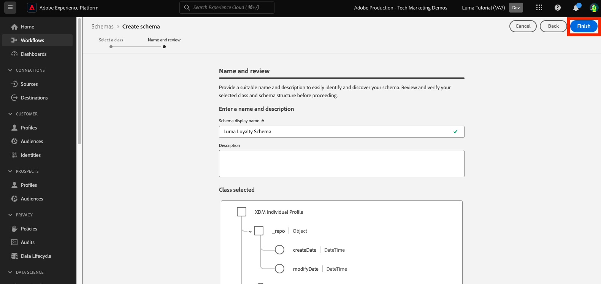
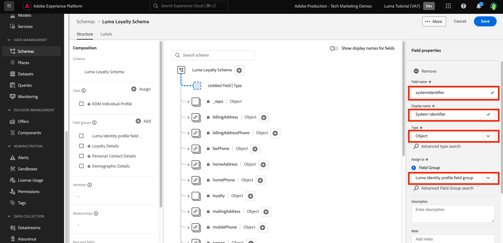
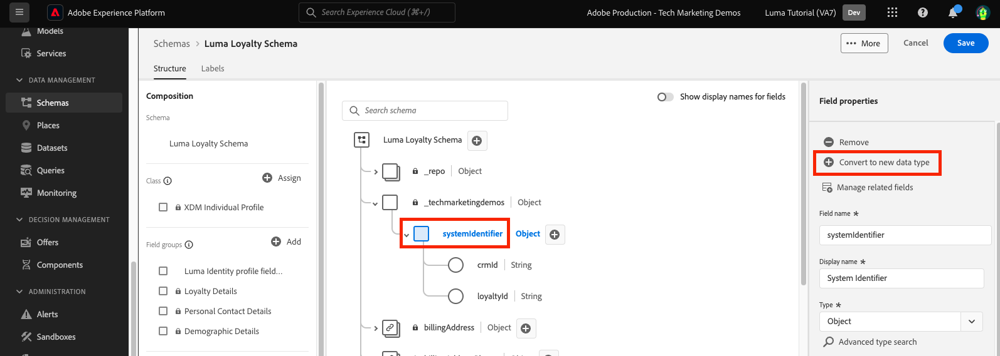
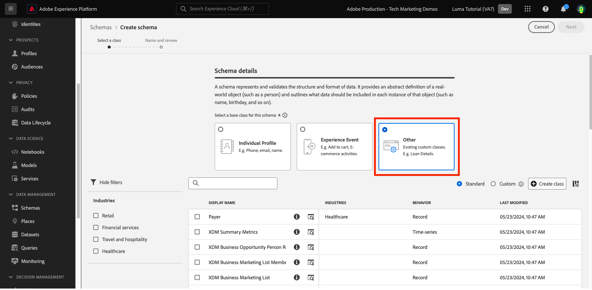

# Datenmodell in Schemata

<!-- 60min -->
In dieser Lektion modellieren Sie die Daten von Luma in Schemata. Dies ist eine der längsten Lektionen im Tutorial, also hol dir ein Glas Wasser und schnalle dich an!

Standardisierung und Interoperabilität sind Schlüsselkonzepte von Adobe Experience Platform. Das Experience-Datenmodell (XDM) ermöglicht die Standardisierung von Kundenerlebnisdaten und die Definition von Schemas für das Customer Experience Management.

XDM ist eine öffentlich dokumentierte Spezifikation, die die Leistungsfähigkeit digitaler Erlebnisse verbessern soll. Es stellt allgemeine Strukturen und Definitionen für jede Anwendung bereit, die für die Kommunikation mit Platform-Services verwendet werden soll. Durch die Einhaltung von XDM-Standards können alle Kundenerlebnisdaten in ein gemeinsames System integriert werden, wodurch Erkenntnisse schneller und besser integriert verfügbar werden. Sie können wertvolle Einblicke durch Kundenaktionen gewinnen, Zielgruppen mithilfe von Segmenten definieren und Kundenattribute zur Personalisierung verwenden.

XDM ist das zugrunde liegende System, auf Basis dessen Adobe Experience Cloud als Teil von Experience Platform die richtige Botschaft der richtigen Person zur richtigen Zeit auf dem passenden Kanal präsentieren kann. Die Methodik, auf der Experience Platform basiert (**-System**, nutzt Experience-Datenmodellschemata zur Verwendung durch Platform-Services.

<!--
This seems too lengthy. The video should suffice

Key terms:

* **Schema**: a representation of your data. A schema is comprised of a class and optional field groups and is used to create datasets. A schema includes behavioral attributes, timestamp, identity, attribute definitions, and relationships.
* **XDM Profile Class**: a common schema class used to represent record data
* **XDM ExperienceEvent Class**: a common schema class used to represent time-series data
* **Field group**: allows users to extend reusable fields that contain variables defining one or more attribute intended to be included in a schema or added to a class.
* **Standard Field group**: an open-source Field group built to conform to common industry standards, used to accelerate implementation and support repeatable services operating on the data
* **Data type**: a reusable object with properties in a hierarchical representation. These can be standard types or custom-defined defined types to describe your own data in your own way (for example, a collection of fields that you use to describe your products). Unlike Field groups, data types can be used in schemas regardless of the class.
* **Field**: a field is the lowest level element of a schema. Each field has a name for referencing and a type to identify the type of data that it contains. Field types can include, integer, number, string, Boolean and schema.
-->

**Datenarchitekten** müssen außerhalb dieses Tutorials Schemata erstellen, aber **Dateningenieure** arbeiten eng mit den Schemata zusammen, die vom Datenarchitekten erstellt wurden.

Bevor Sie mit den Übungen beginnen, sehen Sie sich dieses kurze Video an, um mehr über Schemata und das Experience-Datenmodell (XDM) zu erfahren:
>[!VIDEO](https://video.tv.adobe.com/v/27105?learn=on&enablevpops)

>[!TIP]
>
> Um einen tieferen Einblick in die Datenmodellierung in Experience Platform zu erhalten, empfehlen wir, sich die Wiedergabeliste [Modellieren Ihres Kundenerlebnisses mit XDM](https://experienceleague.adobe.com/en/playlists/experience-platform-model-your-customer-experience-data-with-xdm) anzusehen, die kostenlos auf Experience League verfügbar ist.

## Erforderliche Berechtigungen

In der Lektion [Berechtigungen konfigurieren](configure-permissions.md) richten Sie alle Zugriffssteuerungen ein, die zum Abschließen dieser Lektion erforderlich sind.

<!--, specifically:

* Permission items **[!UICONTROL Data Modeling]** > **[!UICONTROL View Schemas]** and **[!UICONTROL Manage Schemas]**
* Permission item **[!UICONTROL Sandboxes]** > `Luma Tutorial`
* User-role access to the `Luma Tutorial Platform` product profile
* Developer-role access to the `Luma Tutorial Platform` product profile (for API)-->


<!--
## Luma's goals
-->

## Erstellen eines Treueschemas über die Benutzeroberfläche

In dieser Übung erstellen wir ein Schema für die Treuedaten von Luma.

1. Wechseln Sie zur Platform-Benutzeroberfläche und stellen Sie sicher, dass Ihre Sandbox ausgewählt ist.
1. Navigieren Sie **[!UICONTROL linken Navigationsbereich zu]** Schemata“.
1. Klicken Sie **[!UICONTROL oben rechts auf]** Schaltfläche Schema erstellen .
   

1. Wählen Sie im Workflow Schema erstellen **[!UICONTROL Individuelles Profil]** als Basisklasse für Ihr Schema aus, da wir Attribute eines einzelnen Kunden modellieren werden (Punkte, Status usw.).
1. Klicken Sie auf **[!UICONTROL Weiter]**.
   

1. Geben Sie `Luma Loyalty Schema` in das Textfeld **[!UICONTROL Anzeigename des Schemas]** ein. Auf der Arbeitsfläche unten können Sie auch die Struktur des Basisschemas überprüfen und überprüfen, das von der ausgewählten Klasse bereitgestellt wird.
1. Wählen Sie **[!UICONTROL Beenden]** aus, um Ihr Schema zu erstellen.
   

### Hinzufügen von Standardfeldgruppen

Nachdem das Schema erstellt wurde, werden Sie zum Schema-Editor weitergeleitet, in dem Sie dem Schema Felder hinzufügen können. Sie können einzelne Felder direkt zum Schema hinzufügen oder Feldergruppen verwenden. Beachten Sie, dass alle einzelnen Felder weiterhin mit einer Klasse oder Feldergruppe verknüpft sind. Sie können aus einer Vielzahl von Feldergruppen nach Branchenstandard wählen, die von Adobe bereitgestellt werden, oder eigene erstellen. Wenn Sie mit der Modellierung Ihrer eigenen Daten in Experience Platform beginnen, sollten Sie sich mit den von Adobe bereitgestellten branchenüblichen Feldergruppen vertraut machen. Wann immer möglich, ist es eine Best Practice, diese zu verwenden, da sie manchmal nachgelagerte Services unterstützen, z. B. Kunden-KI, Attributions-KI und Adobe Analytics.

Wenn Sie mit Ihren eigenen Daten arbeiten, besteht ein wichtiger Schritt darin zu bestimmen, welche Ihrer eigenen Daten in Platform erfasst und wie sie modelliert werden sollen. Dieses große Thema wird in der Wiedergabeliste (Modellieren [ Kundenerlebnisdaten mit XDM) ausführlicher ](https://experienceleague.adobe.com/en/playlists/experience-platform-model-your-customer-experience-data-with-xdm). In diesem Tutorial werde ich Sie einfach durch die Implementierung einiger vordefinierter Schemata führen.

Hinzufügen von Feldergruppen:

1. Wählen **[!UICONTROL Hinzufügen]** unter der Überschrift **[!UICONTROL Feldergruppen]** aus.
   
1. Wählen **[!UICONTROL im Modal &quot;]** hinzufügen“ die folgenden Feldergruppen aus:
   1. **[!UICONTROL Demografische Details]** für grundlegende Kundendaten wie Name und Geburtsdatum
   1. **[!UICONTROL Persönliche Kontaktdaten]** für grundlegende Kontaktdaten wie E-Mail-Adresse und Telefonnummer
1. Sie können eine Vorschau der in der Feldergruppe bereitgestellten Felder anzeigen, indem Sie auf das Symbol rechts in der Zeile klicken.
   

1. Aktivieren Sie **[!UICONTROL Kontrollkästchen]** Branche **[!UICONTROL > Einzelhandel]**, um branchenspezifische Feldergruppen anzuzeigen.
1. Wählen Sie **[!UICONTROL Treuedetails]** aus, um die Felder für das Treueprogramm hinzuzufügen.
1. Wählen Sie **[!UICONTROL Feldergruppen hinzufügen]** aus, um alle drei Feldergruppen zum Schema hinzuzufügen.
   


Nehmen Sie sich nun etwas Zeit, um den aktuellen Status des Schemas zu untersuchen. Die Feldergruppen haben Standardfelder hinzugefügt, die sich auf eine Person, ihre Kontaktdaten und den Status des Treueprogramms beziehen. Diese beiden Feldergruppen sind möglicherweise nützlich, wenn Sie Schemata für die Daten Ihres eigenen Unternehmens erstellen. Wählen Sie eine bestimmte Feldergruppenzeile aus oder aktivieren Sie das Kontrollkästchen neben dem Namen der Feldergruppe, um zu sehen, wie sich die Visualisierung ändert.

Um das Schema zu speichern, klicken Sie auf **[!UICONTROL Speichern]**.


>[!NOTE]
>
>Es ist in Ordnung, wenn eine Feldergruppe ein Feld für einen Datenpunkt hinzufügt, den Sie nicht erfassen. Beispielsweise könnte „FaxPhone“ ein Feld sein, für das Luma keine Daten erfasst. Das ist in Ordnung. Nur weil ein Feld im Schema definiert ist, bedeutet das nicht, dass *Daten* aufgenommen werden müssen. Sie können das Feld auch aus dem Schema entfernen.

### Hinzufügen einer benutzerdefinierten Feldergruppe

Erstellen wir nun eine benutzerdefinierte Feldergruppe.

Während die Feldergruppe „Treueprogramm“ ein `loyaltyID` enthält, möchte Luma alle Systemkennungen in einer einzigen Gruppe verwalten, um die Konsistenz ihrer Schemata sicherzustellen.

Feldergruppen müssen im Schema-Workflow erstellt werden. Sie haben folgende Möglichkeiten:

* Zuerst ein neues benutzerdefiniertes Feld zu Ihrem Schema hinzufügen und dann eine benutzerdefinierte Feldergruppe erstellen oder
* Erstellen Sie zunächst eine benutzerdefinierte Feldergruppe und fügen Sie ihr dann Felder hinzu.

In diesem Tutorial beginnen wir mit dem Erstellen einer benutzerdefinierten Feldergruppe.

So erstellen Sie die Feldergruppe:

1. Wählen **[!UICONTROL Hinzufügen]** unter der Überschrift **[!UICONTROL Schemafeldgruppen]** aus
   
1. Wählen Sie **[!UICONTROL Neue Feldergruppe erstellen]**
1. Verwenden Sie `Luma Identity profile field group` als **[!UICONTROL Anzeigename]**
1. Verwenden von `system identifiers for XDM Individual Profile class` als **[!UICONTROL Beschreibung]**
1. Wählen Sie **[!UICONTROL Feldergruppen hinzufügen]**
   

Die neue, leere Feldergruppe wird Ihrem Schema hinzugefügt. Mit den Schaltflächen **[!UICONTROL +]** können Sie neue Felder an einer beliebigen Stelle in der Hierarchie hinzufügen. In unserem Fall möchten wir Felder auf der Stammebene hinzufügen:

1. Klicken Sie auf **[!UICONTROL +]** neben dem Namen des Schemas. Dadurch wird ein neues Feld unter dem Namespace Ihre Mandanten-ID hinzugefügt, um Konflikte zwischen Ihren benutzerdefinierten Feldern und Standardfeldern zu handhaben.
1. Fügen Sie in **[!UICONTROL Seitenleiste]** Feldeigenschaften“ die Details des neuen Felds hinzu:
   1. **[!UICONTROL Feldname]**: `systemIdentifier`
   1. **[!UICONTROL Anzeigename]**: `System Identifier`
   1. **[!UICONTROL type]**: **[!UICONTROL object]**
   1. Wählen Sie im **[!UICONTROL Feldergruppe]** die Feldergruppe **Luma-Identitätsprofil** aus, die wir erstellt haben.
      
   1. Wählen Sie **[!UICONTROL Übernehmen]**
      

Fügen Sie nun zwei Felder unter dem `systemIdentifier` hinzu:

1. Erstes Feld
   1. **[!UICONTROL Feldname]**: `loyaltyId`
   1. **[!UICONTROL Anzeigename:]** `Loyalty Id`
   1. **[!UICONTROL type]**: **[!UICONTROL String]**
1. Zweites Feld
   1. **[!UICONTROL Feldname]**: `crmId`
   1. **[!UICONTROL Anzeigename]**: `CRM Id`
   1. **[!UICONTROL type]**: **[!UICONTROL String]**

Ihre neue Feldergruppe sollte wie folgt aussehen. Klicken Sie auf **[!UICONTROL Speichern]**, um Ihr Schema zu speichern. Lassen Sie das Schema jedoch für die nächste Übung geöffnet.


## Erstellen eines Datentyps

Feldergruppen, wie z. B. Ihre neue `Luma Identity profile field group`, können in anderen Schemata wiederverwendet werden, sodass Sie Standarddatendefinitionen auf mehreren Systemen durchsetzen können. Sie können jedoch nur in Schemata _, die eine gemeinsame Klasse_, in diesem Fall die Klasse „XDM Individual Profile“, wiederverwendet werden.

Der Datentyp ist ein weiteres Konstrukt mit mehreren Feldern, das in Schemata (über _Klassen hinweg) wiederverwendet_ kann. Konvertieren wir unser neues `systemIdentifier`-Objekt in einen Datentyp:

Wählen Sie bei weiterhin geöffnetem `Luma Loyalty Schema` das `systemIdentifier` Objekt und dann **[!UICONTROL In neuen Datentyp konvertieren]**



Wenn Sie **[!UICONTROL Schema]** und zur Registerkarte **[!UICONTROL Datentypen]** navigieren, sehen Sie den neu erstellten Datentyp. Wir werden diesen Datentyp später in der Lektion verwenden.


## CRM-Schema über API erstellen

Jetzt erstellen wir ein Schema mit der -API.

>[!TIP]
>
> Wenn Sie es vorziehen, die API-Übung zu überspringen, können Sie das folgende Schema mit der Methode der Benutzeroberfläche erstellen:
>
> 1. Verwenden der Klasse [!UICONTROL Individuelles Profil]
> 1. Benennen Sie ihn `Luma CRM Schema`
> 1. Verwenden Sie die folgenden Feldergruppen: Demografische Details, Persönliche Kontaktdaten und Luma-Identitätsprofilgruppe

Zunächst erstellen wir das leere Schema:

1. [!DNL Postman] öffnen
1. Wenn Sie kein Zugriffs-Token haben, öffnen Sie die Anfrage-**[!DNL OAuth: Request Access Token]** und wählen Sie **Senden** aus, um ein neues Zugriffs-Token anzufordern.
1. Öffnen Sie Ihre Umgebungsvariablen und ändern Sie den Wert von **CONTAINER_ID** von `global` in `tenant`. Denken Sie daran, dass Sie `tenant` immer dann verwenden müssen, wenn Sie mit Ihren eigenen benutzerdefinierten Elementen in Platform interagieren möchten, z. B. beim Erstellen eines Schemas.
1. Wählen Sie **Speichern**
   
1. **[!DNL Schema Registry API > Schemas > Create a new custom schema.]** öffnen
1. Öffnen Sie die Registerkarte **Hauptteil** und fügen Sie den folgenden Code ein und wählen Sie **Senden**, um den API-Aufruf durchzuführen. Dieser Aufruf erstellt ein neues Schema mit derselben `XDM Individual Profile`-Basisklasse:

   ```json
   {
     "type": "object",
     "title": "Luma CRM Schema",
     "description": "Schema for CRM data of Luma Retail ",
     "allOf": [{
       "$ref": "https://ns.adobe.com/xdm/context/profile"
     }]
   }
   ```

   >[!NOTE]
   >
   >Die Namespace-Verweise in diesem und in nachfolgenden Code-Beispielen (z. B. `https://ns.adobe.com/xdm/context/profile`) können mithilfe von Listen-API-Aufrufen abgerufen werden, wobei die **[!DNL CONTAINER_ID]** und der Accept-Header auf die richtigen Werte festgelegt sind. Einige sind auch in der Benutzeroberfläche leicht zugänglich.

1. Sie sollten eine `201 Created` Antwort erhalten
1. Kopieren Sie `meta:altId` aus dem Antworttext. Wir werden es später in einer anderen Übung verwenden.
   

1. Das neue Schema sollte in der Benutzeroberfläche sichtbar sein, jedoch ohne Feldergruppen
   

>[!NOTE]
>
> Die `meta:altId`- oder Schema-ID können Sie auch abrufen, indem Sie die API-Anfrage **[!DNL Schema Registry API > Schemas > Retrieve a list of schemas within the specified container.]**, wobei **[!UICONTROL CONTAINER_ID]** auf `tenant` gesetzt ist, und eine Accept-Kopfzeile `application/vnd.adobe.xdm+json`.

>[!TIP]
>
> Häufige Probleme mit diesem Aufruf und wahrscheinliche Fehlerbehebungen:
>
> * Kein Authentifizierungs-Token: Führen Sie die Anfrage **OAuth: Zugriffs-Token anfordern** aus, um ein neues Token zu generieren
> * `401: Not Authorized to PUT/POST/PATCH/DELETE for this path : /global/schemas/`: Aktualisieren der **CONTAINER_ID** Umgebungsvariable von `global` auf `tenant`
> * `403: PALM Access Denied. POST access is denied for this resource from access control`: Überprüfen Sie Ihre Benutzerberechtigungen in der Admin Console

### Hinzufügen von Standardfeldgruppen

Jetzt ist es an der Zeit, die Feldergruppen zum Schema hinzuzufügen:

1. Öffnen Sie in [!DNL Postman] die Anfrage **[!DNL Schema Registry API > Schemas > Update one or more attributes of a custom schema specified by ID.]**
1. Fügen **auf der Registerkarte** den `meta:altId` Wert aus der vorherigen Antwort als `SCHEMA_ID` ein
1. Öffnen Sie die Registerkarte Text und fügen Sie den folgenden Code ein. Wählen Sie **Senden**, um den API-Aufruf durchzuführen. Dieser Aufruf fügt die Standardfeldgruppen zu Ihrem `Luma CRM Schema` hinzu:

   ```json
   [{
       "op": "add",
       "path": "/allOf/-",
       "value": {
         "$ref": "https://ns.adobe.com/xdm/context/profile-personal-details"
       }
     },
     {
       "op": "add",
       "path": "/allOf/-",
       "value": {
         "$ref": "https://ns.adobe.com/xdm/context/profile-person-details"
       }
     }
   ]
   ```

1. Sie sollten für die Antwort einen Status „OK“ von 200 erhalten und die Feldergruppen sollten als Teil Ihres Schemas in der Benutzeroberfläche sichtbar sein

   


### Hinzufügen einer benutzerdefinierten Feldergruppe

Fügen wir nun unsere `Luma Identity profile field group` zum Schema hinzu. Zunächst müssen wir die ID unserer neuen Feldergruppe mithilfe einer Listen-API finden:

1. **[!DNL Schema Registry API > Field groups > Retrieve a list of field groups within the specified container.]** öffnen
1. Wählen Sie die **Senden**, um eine Liste aller benutzerdefinierten Feldergruppen in Ihrem Konto abzurufen
1. Rufen Sie den `$id` des `Luma Identity profile field group` auf (Ihr Wert unterscheidet sich vom Wert in diesem Screenshot)
   
1. Öffnen Sie die Anfrage **[!DNL Schema Registry API > Schemas > Update one or more attributes of a custom schema specified by ID.]** erneut
1. Die **params** sollte weiterhin die `$id` Ihres Schemas enthalten
1. Öffnen Sie die **body** und fügen Sie den folgenden Code ein. Ersetzen Sie dabei den `$ref` Wert durch den `$id` Ihrer eigenen `Luma Identity profile field group`:

   ```json
   [{
     "op": "add",
     "path": "/allOf/-",
     "value": {
       "$ref": "REPLACE_WITH_YOUR_OWN_FIELD_GROUP_ID"
     }
   }]
   ```

1. Wählen Sie **Senden** aus
   

Überprüfen Sie, ob die Feldergruppe zum Schema hinzugefügt wurde, indem Sie sowohl die API-Antwort als auch die der Benutzeroberfläche überprüfen.

## Offline-Kaufereignis-Schema erstellen

Erstellen wir nun ein Schema basierend auf der Klasse **[!UICONTROL Erlebnisereignis]** für die Offline-Kaufdaten von Luma. Da Sie sich nun mit der Benutzeroberfläche des Schema-Editors vertraut machen, werde ich die Anzahl der Screenshots in den Anweisungen reduzieren:

1. Erstellen Sie ein Schema mit der Klasse **[!UICONTROL Erlebnisereignis]**.
1. Benennen Sie Ihr Schema `Luma Offline Purchase Events Schema`.
1. Fügen Sie die Standardfeldergruppe **[!UICONTROL Commerce Details]** hinzu, um allgemeine Bestelldetails zu erfassen. Verbringen Sie ein paar Minuten damit, die Objekte darin zu erkunden.
1. Suchen Sie nach `Luma Identity profile field group`. Es ist nicht verfügbar! Denken Sie daran, dass Feldergruppen an eine Klasse gebunden sind. Da wir eine andere Klasse für dieses Schema verwenden, können wir sie nicht verwenden. Wir müssen eine neue Feldergruppe für die XDM ExperienceEvent-Klasse hinzufügen, die die Identitätsfelder enthält. Unser Datentyp macht das wirklich einfach!
1. Wählen Sie das **[!UICONTROL Neue Feldergruppe erstellen]** aus
1. Geben Sie den **[!UICONTROL Anzeigenamen]** als `Luma Identity ExperienceEvent field group` ein und wählen Sie die Schaltfläche **[!UICONTROL Feldergruppen hinzufügen]** aus
1. Klicken Sie auf **[!UICONTROL +]** neben dem Namen des Schemas.
1. Geben Sie als **[!UICONTROL Feldname]** &quot;`systemIdentifier`&quot; ein.
1. Geben Sie als **[!UICONTROL Anzeigename]** `System Identifier` ein.
1. Wählen Sie als **[!UICONTROL Typ]** die Option **Systemkennung** aus. Dies ist der benutzerdefinierte Datentyp, den Sie zuvor erstellt haben.
1. Wählen Sie als **[!UICONTROL Feldergruppe]** die **Feldergruppe Luma Identity ExperienceEvent**.
1. Klicken Sie auf die **[!UICONTROL Apply]**-Schaltfläche.
1. Klicken Sie auf **[!UICONTROL Speichern]**.

Beachten Sie, wie der Datentyp alle Felder hinzugefügt hat!


Wählen Sie außerdem **[!UICONTROL XDM ExperienceEvent]** unter der Überschrift **[!UICONTROL Klasse]** aus und überprüfen Sie einige der Felder, die von dieser Klasse bereitgestellt werden. Beachten Sie, dass die Felder _id und Zeitstempel bei der Verwendung der XDM ExperienceEvent-Klasse erforderlich sind. Diese Felder müssen für jeden Datensatz ausgefüllt werden, den Sie bei Verwendung dieses Schemas aufnehmen:


## Erstellen eines Web-Ereignisschemas

Jetzt erstellen wir ein weiteres Schema für die Website-Daten von Luma. An dieser Stelle sollten Sie ein Experte in der Erstellung von Schemata sein! Das folgende Schema mit diesen Eigenschaften erstellen

| Eigenschaft | Wert |
|---------------|-----------------|
| Klasse | Erlebnisereignis |
| Schemaname | Schema der Luma-Webereignisse |
| Feldergruppe | AEP Web SDK ExperienceEvent |
| Feldergruppe | Erlebnisereignis für Verbraucher |

Wählen Sie die Feldergruppe **[!UICONTROL Consumer Experience Event]** aus. Diese Feldergruppe enthält die Commerce- und ProductListItems-Objekte, die sich auch in [!UICONTROL Commerce-Details] befanden. Tatsächlich [!UICONTROL Consumer Experience Event] eine Kombination aus mehreren anderen Standardfeldgruppen, die auch separat verfügbar sind. [!UICONTROL AEP Web SDK ExperienceEvent]-Feldergruppe enthält auch andere Feldergruppen, einschließlich einiger derselben in [!UICONTROL Consumer Experience Event]. Glücklicherweise fügen sie sich nahtlos ineinander.

Beachten Sie, dass wir die `Luma Identity ExperienceEvent field group` nicht zu diesem Schema hinzugefügt haben. Dies liegt daran, dass Web SDK eine andere Art der Identitätserfassung hat. Wenn Sie die Klasse **[!UICONTROL XDM ExperienceEvent]** im Abschnitt **[!UICONTROL Komposition]** des Schema-Editors auswählen, werden Sie feststellen, dass eines der standardmäßig hinzugefügten Felder **[!UICONTROL IdentityMap]** heißt. [!DNL IdentityMap] wird von verschiedenen Adobe-Programmen verwendet, um eine Verbindung zu Platform herzustellen. In der Lektion zur Streaming-Aufnahme erfahren Sie, wie Identitäten über identityMap an Platform gesendet werden.


## Erstellen eines Produktkatalogschemas

Mithilfe der Feldergruppen [!UICONTROL Commerce] und [!UICONTROL Consumer Experience Event] meldet Luma einige Details zu produktbezogenen Ereignissen über den standardmäßigen Datentyp productListItems . Sie verfügen jedoch auch über zusätzliche Produktdetailfelder, die sie an Platform senden möchten. Anstatt all diese Felder in ihren Point-of-Sale- und E-Commerce-Systemen zu erfassen, würde Luma es vorziehen, diese Felder direkt aus ihrem Produktkatalogsystem aufzunehmen. Mit einer „Schemabeziehung“ können Sie eine Beziehung zwischen zwei Schemata definieren, um Klassifizierungen oder Suchen durchzuführen. Luma verwendet eine Beziehung, um ihre Produktdetails zu klassifizieren. Wir beginnen den Prozess jetzt und schließen ihn am Ende der nächsten Lektion ab.

>[!NOTE]
>
>Wenn Sie bereits Analytics- oder Target-Kunde sind, erfolgt die Klassifizierung von Entitäten mit Schemabeziehungen analog zu SAINT-Klassifizierungen bzw. das Hochladen Ihres Produktkatalogs für Recommendations

Zunächst müssen wir ein Schema für den Produktkatalog von Luma mithilfe einer benutzerdefinierten Klasse erstellen:

1. Klicken Sie auf **[!UICONTROL Schaltfläche]** Schema erstellen“.
1. Wählen Sie im Workflow Schema erstellen die Option **[!UICONTROL Sonstige]** aus.
   
1. Klicken Sie auf **[!UICONTROL Schaltfläche]** Klasse erstellen“
1. Benennen Sie ihn `Luma Product Catalog Class`
1. Belassen Sie **[!UICONTROL Verhalten]** als **[!UICONTROL Eintrag]**
1. Klicken Sie auf **[!UICONTROL Schaltfläche]**Erstellen“.
   
1. Die **Luma-Produktkatalogklasse** die Sie erstellt haben, wird in der unten stehenden Tabelle „Klassen“ angezeigt. Stellen Sie sicher, dass die Klasse ausgewählt ist, und klicken Sie dann auf **[!UICONTROL Weiter]**.
   
1. Benennen Sie das Schema `Luma Product Catalog Schema`.
1. Erstellen Sie eine neue [!UICONTROL Feldergruppe] namens `Luma Product Catalog field group` mit den folgenden Feldern:
   1. productName: Produktname: Zeichenfolge
   1. productCategory: Produktkategorie: Zeichenfolge
   1. productColor: Produktfarbe: Zeichenfolge
   1. productSKU: Produkt-SKU: Zeichenfolge | Erforderlich
   1. productSize: Produktgröße: Zeichenfolge
   1. productPrice: Produktpreis: Doppelt
1. **[!UICONTROL Speichern]** des Schemas

Ihr neues Schema sollte wie folgt aussehen. Beachten Sie, wie das `productSku` Feld im Abschnitt [!UICONTROL Erforderliche Felder] aufgeführt wird:


Der nächste Schritt besteht darin, die Beziehung zwischen den beiden ExperienceEvent-Schemas und dem `Luma Product Catalog Schema` zu definieren. Es gibt jedoch einige zusätzliche Schritte, die wir in der nächsten Lektion ausführen müssen, bevor wir dies tun können.


## Weitere Ressourcen

* [Experience-Datenmodell (XDM) - Systemdokumentation](https://experienceleague.adobe.com/docs/experience-platform/xdm/home.html?lang=de)
* [Schema Registry-API](https://www.adobe.io/experience-platform-apis/references/schema-registry/)


Nachdem Sie nun über Ihre Schemata verfügen, können Sie [Identitäten zuordnen](map-identities.md)!
