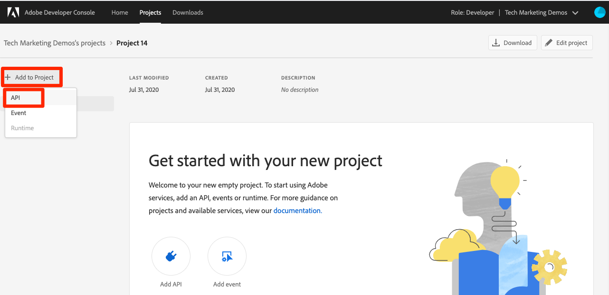
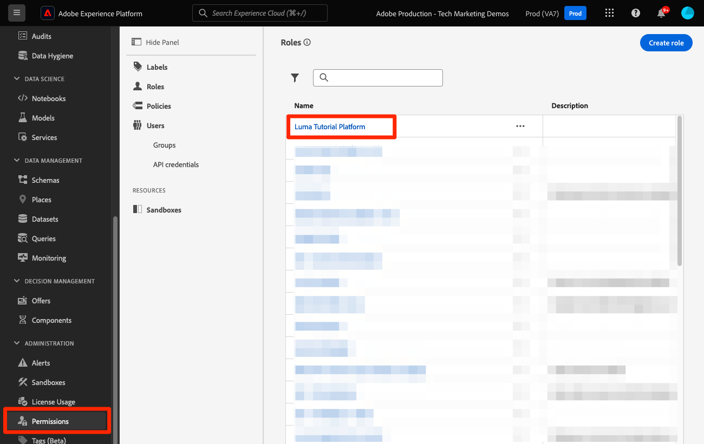

# Einrichten von Developer Console und [!DNL Postman]

<!--30min-->

In dieser Lektion richten Sie ein Projekt in der Adobe Developer Console ein und laden [!DNL Postman] Sammlungen herunter, damit Sie Platform-APIs verwenden können.

Um die API-Übungen in diesem Tutorial abzuschließen, laden [ die Postman-App für Ihr Betriebssystem herunter.](https://www.postman.com/downloads/) Für die Verwendung von Experience Platform-APIs ist Postman zwar nicht erforderlich, erleichtert aber API-Workflows. Adobe Experience Platform stellt Dutzende von Postman-Sammlungen bereit, mit denen Sie API-Aufrufe ausführen und lernen können, wie sie funktionieren. Für den Rest dieses Tutorials werden Kenntnisse über Postman vorausgesetzt. Unterstützung erhalten Sie in der [Dokumentation zu Postman](https://learning.postman.com/).

Platform wird API-First erstellt. Auch wenn Schnittstellenoptionen für alle wichtigen Aufgaben vorhanden sind, sollten Sie die Platform-API zu einem späteren Zeitpunkt verwenden. So können Sie beispielsweise Daten aufnehmen, Elemente zwischen Sandboxes verschieben, Routineaufgaben automatisieren oder neue Platform-Funktionen verwenden, bevor die Benutzeroberfläche erstellt wurde.

**Datenarchitekten** und **Dateningenieure** müssen die Platform-API möglicherweise außerhalb dieses Tutorials verwenden.

## Erforderliche Berechtigungen

In der Lektion [Berechtigungen konfigurieren](configure-permissions.md) richten Sie alle Zugriffssteuerungen ein, die zum Abschließen dieser Lektion erforderlich sind.

<!--
* Permission item Sandboxes > `Luma Tutorial`
* Developer-role access to the `Luma Tutorial Platform` product profile
-->

## Einrichten von Adobe Developer Console

Adobe Developer Console ist das Entwicklerziel für den Zugriff auf Adobe-APIs und SDKs, das Abhören von nahezu in Echtzeit stattfindenden Ereignissen, das Ausführen von Funktionen zur Laufzeit oder das Erstellen von Plug-ins oder App Builder-Programmen. Sie verwenden sie für den Zugriff auf die Experience Platform-API. Weitere Informationen finden Sie in der Dokumentation zu [Adobe Developer Console](https://www.adobe.io/apis/experienceplatform/console/docs.html)

1. Erstellen Sie auf Ihrem lokalen Computer einen Ordner mit dem Namen `Luma Tutorial Assets` für die im Tutorial verwendeten Dateien.

1. Öffnen Sie die [Adobe Developer Console](https://console.adobe.io){target="_blank"}

1. Melden Sie sich an und bestätigen Sie, dass Sie sich in der richtigen Organisation befinden

1. Wählen **[!UICONTROL Neues Projekt erstellen]** im [!UICONTROL Schnellstart]Menü aus.

   

1. Klicken Sie im neu erstellten Projekt auf die Schaltfläche **[!UICONTROL Projekt bearbeiten]**
1. Ändern Sie **[!UICONTROL Projekttitel]** in `Luma Tutorial API Project` (fügen Sie Ihren Namen an das Ende an, wenn mehrere Personen in Ihrem Unternehmen an diesem Tutorial teilnehmen).
1. Wählen Sie **[!UICONTROL Speichern]**

   

1. Wählen Sie **[!UICONTROL API hinzufügen]**

   

1. Filtern Sie die Liste durch Auswahl von **[!UICONTROL Adobe Experience Platform]**

1. Wählen Sie in der Liste der verfügbaren APIs **[!UICONTROL Experience Platform API]** und anschließend **[!UICONTROL Weiter]** aus.

   

1. Wählen Sie **[!UICONTROL OAuth Server-zu-Server]** als Berechtigung aus und klicken Sie auf **[!UICONTROL Weiter]**.
   

1. Wählen Sie das Produktprofil `AEP-Default-All-Users` und dann **[!UICONTROL Konfigurierte API speichern]**

   

1. Jetzt wurde Ihr Developer Console-Projekt erstellt!

1. Wählen Sie **[!UICONTROL Abschnitt &quot;]** ausprobieren“ der Seite die Option **[!UICONTROL Für Postman herunterladen]** und wählen Sie dann **[!UICONTROL OAuth Server-zu-Server]** aus, um die JSON-Datei für die [!DNL Postman]-Umgebung herunterzuladen. Speichern Sie die `oauth_server_to_server.postman_environment.json` in Ihrem `Luma Tutorial Assets`.

   

## Bitten Sie einen Systemadministrator, die API-Anmeldedaten zur Rolle hinzuzufügen

Um die API-Anmeldeinformationen für die Interaktion mit Experience Platform verwenden zu können, muss ein Systemadministrator die API-Anmeldeinformationen der in der vorherigen Lektion erstellten Rolle zuweisen.  Wenn Sie kein Systemadministrator sind, senden Sie ihnen:

1. Der [!UICONTROL Name] Ihrer API-Anmeldedaten (`Credential in Luma Tutorial API Project`)
1. Die [!UICONTROL E-Mail-Adresse des technischen Kontos] Ihrer Anmeldedaten (dies hilft dem Systemadministrator, die Anmeldedaten zu finden)

   ![[!UICONTROL Name] und [!UICONTROL E-Mail-Adresse des technischen Kontos] Ihrer Anmeldedaten](assets/postman-credentialDetails.png)

Im Folgenden finden Sie die Anweisungen für den Systemadministrator:

1. Anmelden bei [Adobe Experience Platform](https://platform.adobe.com)
1. Wählen Sie **[!UICONTROL linken Navigationsbereich]** Berechtigungen“ aus, um zum Bildschirm [!UICONTROL Rollen] zu gelangen
1. Öffnen Sie die `Luma Tutorial Platform` Rolle
   
1. Wählen Sie die Registerkarte **[!UICONTROL API-]**) aus
1. Wählen Sie **[!UICONTROL API-Anmeldeinformationen hinzufügen]**
   
1. Suchen Sie die `Credential in Luma Tutorial API Project` Anmeldedaten und filtern Sie mit der [!UICONTROL E-Mail des technischen Kontos], die der Tutorial-Teilnehmer bereitgestellt hat, wenn die Liste lang ist.
1. Auswählen der Berechtigung
1. Wählen Sie **[!UICONTROL Speichern]**

   

## Einrichten von Postman

>[!CAUTION]
>
>Die Benutzeroberfläche von Postman wird regelmäßig aktualisiert. Die Screenshots in diesem Tutorial wurden mit Postman v10.15.1 für Mac erstellt, aber die Schnittstellenoptionen haben sich möglicherweise geändert.

1. Herunterladen und Installieren von [[!DNL Postman]](https://www.postman.com/downloads/)
1. [!DNL Postman] öffnen und einen Arbeitsbereich erstellen
   

1. Importieren Sie die heruntergeladene JSON-Umgebungsdatei `oauth_server_to_server.postman_environment.json`
   
1. Wählen Sie [!DNL Postman] Ihre Umgebung im Dropdown-Menü aus

1. Wählen Sie das Symbol aus, um die Umgebungsvariablen anzuzeigen:

   

### Sandbox-Namen und Mandanten-ID hinzufügen

Die Variablen `SANDBOX_NAME` und `TENANT_ID` und `CONTAINER_ID` sind nicht im Adobe Developer Console-Export enthalten. Daher fügen wir sie manuell hinzu:

1. Öffnen Sie in [!DNL Postman] die **Umgebungsvariablen**
1. Klicken Sie auf **Link** Bearbeiten“ rechts neben dem Umgebungsnamen
1. Geben Sie **Feld „Neue Variable hinzufügen** `SANDBOX_NAME` ein
1. Geben Sie in beide Wertefelder `luma-tutorial` ein, den Namen, den wir in der vorherigen Lektion unserer Sandbox gegeben haben. Wenn Sie einen anderen Namen für Ihre Sandbox verwendet haben, z. B. luma-tutorial-ignatiusjreilly, stellen Sie sicher, dass Sie diesen Wert verwenden.
1. Geben Sie **Feld „Neue Variable hinzufügen** `TENANT_ID` ein
1. Wechseln Sie zu Ihrem Webbrowser und suchen Sie die Mandanten-ID Ihres Unternehmens, indem Sie zur Experience Platform-Benutzeroberfläche wechseln und den Teil der URL extrahieren *nach dem @-Zeichen*. Meine Mandanten-ID lautet beispielsweise `techmarketingdemos`, Ihre jedoch anders:

   

1. Kopieren Sie diesen Wert und kehren Sie zum Bildschirm Umgebungen [!DNL Postman] verwalten zurück
1. Fügen Sie Ihre Mandanten-ID in beide Wertefelder ein
1. Geben Sie **Feld „Neue Variable hinzufügen** `CONTAINER_ID` ein
1. Geben Sie `global` in beide Wertefelder ein

   >[!NOTE]
   >
   >`CONTAINER_ID` ist ein Feld, dessen Wert wir im Laufe des Tutorials mehrmals ändern. Wenn `global` verwendet wird, interagiert die API mit von Adobe bereitgestellten Elementen in Ihrem Platform-Konto. Wenn `tenant` verwendet wird, interagiert die API mit Ihren eigenen benutzerdefinierten Elementen.

1. Wählen Sie **Speichern**

   

## Durchführen von API-Aufrufen

### Abrufen eines Zugriffstokens

Adobe bietet einen umfangreichen Satz an [!DNL Postman], mit denen Sie die Experience Platform-API erkunden können. Diese Sammlungen befinden sich im GitHub-Repository der [Adobe Experience Platform Postman-](https://github.com/adobe/experience-platform-postman-samples). Sie sollten dieses Repository als Lesezeichen verwenden, da Sie es in diesem Tutorial und später bei der Implementierung von Experience Platform für Ihr eigenes Unternehmen mehrmals verwenden werden.

Die erste Sammlung funktioniert mit den Adobe Identity Management Service (IMS)-APIs. Dies ist eine praktische Methode, um ein Zugriffs-Token aus Postman abzurufen.

So generieren Sie das Zugriffstoken:

1. Laden Sie die Sammlung der [Identity Management Service](https://github.com/adobe/experience-platform-postman-samples/blob/master/apis/ims/Identity%20Management%20Service.postman_collection.json)APIs in Ihren `Luma Tutorial Assets` Ordner herunter
1. Importieren der Sammlung in [!DNL Postman]
1. Wählen Sie die Anfrage **oAuth: Zugriffstoken anfordern** und klicken Sie auf **Senden**
1. Sie sollten in der Antwort eine `200 OK` Antwort mit einem Zugriffstoken erhalten

   

1. Das Zugriffs-Token sollte automatisch als **ACCESS_TOKEN**-Umgebungsvariable Ihrer [!DNL Postman] gespeichert werden.

   

### Interagieren mit einer Platform-API

Führen wir nun einen Platform-API-Aufruf durch, um zu bestätigen, dass wir alles richtig konfiguriert haben.

Öffnen Sie die [Experience Platform [!DNL Postman] Sammlungen in GitHub](https://github.com/adobe/experience-platform-postman-samples/tree/master/apis/experience-platform). Es gibt viele Sammlungen auf dieser Seite für verschiedene Platform-APIs. Ich empfehle dringend, es zu Lesezeichen.

Lassen Sie uns nun unseren ersten API-Aufruf durchführen:

1. Laden Sie die [Schema Registry-API](https://raw.githubusercontent.com/adobe/experience-platform-postman-samples/master/apis/experience-platform/Schema%20Registry%20API.postman_collection.json)Sammlung in Ihren `Luma Tutorial Assets` Ordner herunter
1. In [!DNL Postman] importieren
1. Öffnen Sie **Schema Registry-API > Schemata > Schemata auflisten**
1. Sehen Sie sich die **Parameter** und **Kopfzeilen** an und beachten Sie, wie sie einige der zuvor eingegebenen Umgebungsvariablen enthalten.
1. Beachten Sie, dass **Feld „Kopfzeilen > Wert akzeptieren** auf `application/vnd.adobe.xed-id+json` gesetzt ist. Die Schema Registry-APIs erfordern einen der [angegebenen Accept-Header](https://experienceleague.adobe.com/docs/experience-platform/xdm/api/getting-started.html?lang=de#accept)Werte, die verschiedene Formate in der Antwort bereitstellen.
1. Wählen Sie **Senden**, um Ihren ersten Platform-API-Aufruf durchzuführen!

Wir hoffen, dass Sie eine erfolgreiche `200 OK` erhalten haben, die eine Liste der verfügbaren Adobe-bereitgestellten XDM-Schemas in Ihrer Sandbox enthält, wie unten dargestellt.

Wenn Ihr Aufruf nicht erfolgreich war, nehmen Sie sich einen Moment Zeit, um mit den Details zur Fehlerantwort des API-Aufrufs zu debuggen, und überprüfen Sie die oben genannten Schritte. Wenn Sie hängen bleiben, bitten wir Sie um Hilfe im [Community-Forum](https://experienceleaguecommunities.adobe.com/t5/adobe-experience-platform/ct-p/adobe-experience-platform-community?profile.language=de&lang=de) oder verwenden Sie den Link rechts auf dieser Seite, um „ein Problem zu melden“.

Nachdem Sie Platform-Berechtigungen, Sandbox und [!DNL Postman] eingerichtet haben, können Sie Daten [in Schemata modellieren](model-data-in-schemas.md)!
