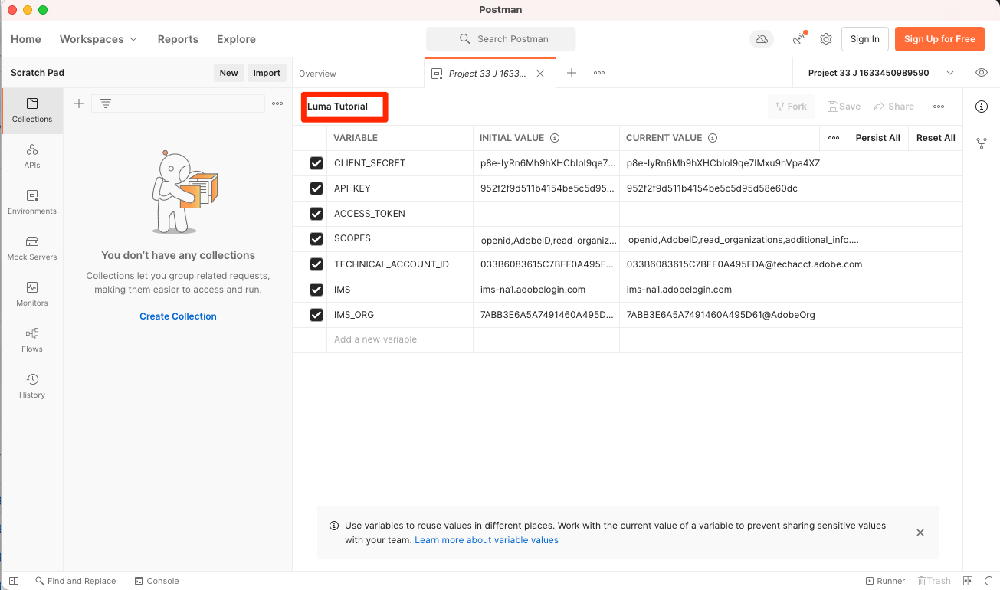
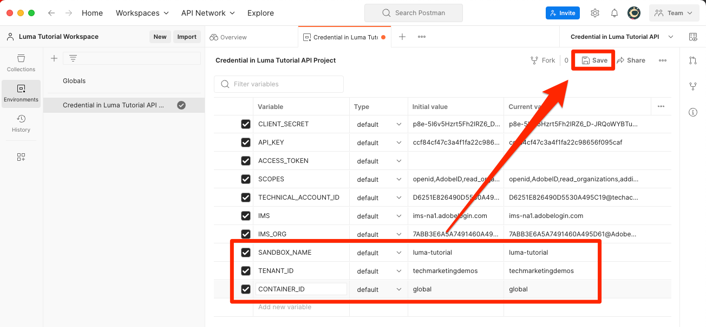

# Einrichten der Entwicklerkonsole und [!DNL Postman]

<!--30min-->

In dieser Lektion richten Sie ein Projekt in der Adobe Developer-Konsole ein und laden [!DNL Postman] Sammlungen, damit Sie mit der Verwendung von Platform-APIs beginnen können.

Um die API-Übungen in diesem Tutorial abzuschließen, müssen Sie [Laden Sie die Postman-App für Ihr Betriebssystem herunter.](https://www.postman.com/downloads/) Postman ist zwar nicht erforderlich, um Experience Platform-APIs zu verwenden, erleichtert aber API-Workflows. Adobe Experience Platform bietet Dutzende von Postman-Kollektionen, die Ihnen bei der Ausführung von API-Aufrufen und der Funktionsweise helfen. Im Rest dieses Tutorials werden einige Kenntnisse über Postman vorausgesetzt. Informationen zur Unterstützung finden Sie im Abschnitt [Postman-Dokumentation](https://learning.postman.com/).

Platform ist als API-Erste konzipiert. Auch wenn Schnittstellenoptionen für alle Hauptaufgaben vorhanden sind, sollten Sie die Platform-API irgendwann verwenden. Um beispielsweise Daten zu erfassen, verschieben Sie Elemente zwischen Sandboxes, automatisieren Sie Routineaufgaben oder verwenden Sie neue Platform-Funktionen, bevor die Benutzeroberfläche erstellt wurde.

**Datenarchitekten** und **Dateningenieure** Möglicherweise müssen Sie die Platform-API außerhalb dieses Tutorials verwenden.

## Erforderliche Berechtigungen

Im [Berechtigungen konfigurieren](configure-permissions.md) Lektion erstellen Sie alle Zugriffssteuerungen, die zum Abschluss dieser Lektion erforderlich sind.

<!--
* Permission item Sandboxes > `Luma Tutorial`
* Developer-role access to the `Luma Tutorial Platform` product profile
-->

## Einrichten der Adobe Developer-Konsole

Adobe Developer Console ist das Entwicklerziel für den Zugriff auf Adobe-APIs und SDKs, das Abhören von nahezu Echtzeit-Ereignissen, das Ausführen von Funktionen in Runtime oder das Erstellen von Plug-ins oder App Builder-Apps. Sie greifen damit auf die Experience Platform-API zu. Weitere Informationen finden Sie unter [Dokumentation zur Adobe Developer Console](https://www.adobe.io/apis/experienceplatform/console/docs.html)

1. Erstellen Sie auf Ihrem lokalen Computer einen Ordner mit dem Namen `Luma Tutorial Assets` für Dateien, die im Tutorial verwendet werden.

1. Öffnen Sie die [Adobe Developer-Konsole](https://console.adobe.io)

1. Melden Sie sich an und vergewissern Sie sich, dass Sie sich in der richtigen Organisation befinden

1. Auswählen **[!UICONTROL Neues Projekt erstellen]** in [!UICONTROL Schnellstart] Menü.

   

1. Wählen Sie im neu erstellten Projekt die **[!UICONTROL Zum Projekt hinzufügen]** und wählen Sie **[!UICONTROL API]**

   

1. Filtern der Liste durch Auswahl **[!UICONTROL Adobe Experience Platform]**

1. Wählen Sie in der Liste der verfügbaren APIs **[!UICONTROL Experience Platform-API]** und wählen Sie **[!UICONTROL Nächste]**.

   

1. Für die Authentifizierung durch externe Systeme wie [!DNL Postman], benötigen wir ein Paar aus öffentlichem/privatem Schlüssel. Um ein neues Schlüsselpaar zu generieren, wählen Sie **[!UICONTROL Option 1]**  und drücken Sie die **[!UICONTROL Generieren von keypair]** button

   

1. Sobald die Schlüssel fertig sind, werden Sie möglicherweise aufgefordert, die Schlüssel auf Ihren lokalen Computer herunterzuladen. Speichern Sie die in `config.zip` in den Ordner `Luma Tutorial Assets`. Wir werden sie in der nächsten Übung brauchen.

1. Nachdem der Schlüssel generiert wurde, wird der öffentliche Schlüssel automatisch zum Projekt hinzugefügt, wie im Screenshot gezeigt. Wählen Sie die **[!UICONTROL Nächste]** Schaltfläche.

   

1. Wählen Sie die `Luma Tutorial Platform` Produktprofil und wählen Sie die **[!UICONTROL Konfigurierte API speichern]** button

   

1. Jetzt wurde Ihr Entwicklerkonsole-Projekt erstellt!

1. Im **[!UICONTROL Testen]** -Abschnitt der Seite, wählen Sie **[!UICONTROL Herunterladen für Postman]** und wählen Sie **[!UICONTROL Dienstkonto (JWT)]** zum Herunterladen der [!DNL Postman] Umgebungs-JSON-Datei. Speichern Sie die `service.postman_environment.json` in `Luma Tutorial Assets` Ordner.

   

   >[!NOTE]
   >
   >Systemadministratoren Ihres Unternehmens können das Projekt als &quot;API-Berechtigung&quot;im Produktprofil in der Admin Console anzeigen.
   >
   >

Möglicherweise ist Ihnen aufgefallen, dass dem Projekt eine Nummer zugewiesen wurde, z. B. &quot;Projekt 12&quot;:

1. Wählen Sie die Projektnummer im Breadcrumb aus.
1. Wählen Sie die **[!UICONTROL Projekt bearbeiten]** button
1. Ändern Sie die **[!UICONTROL Projekttitel]** nach `Luma Tutorial API Project` (Fügen Sie am Ende Ihren Namen hinzu, wenn mehrere Personen aus Ihrem Unternehmen dieses Tutorial absolvieren)
1. Klicken Sie auf die Schaltfläche **[!UICONTROL Speichern]**

   

## Einrichten von Postman

>[!CAUTION]
>
>Die Benutzeroberfläche von Postman wird regelmäßig aktualisiert. Die Screenshots in diesem Tutorial wurden mit Postman Version 9.0.5 für Mac erstellt, die Benutzeroberflächenoptionen wurden jedoch möglicherweise geändert.

1. Herunterladen und installieren [[!DNL Postman]](https://www.postman.com/downloads/)
1. Öffnen [!DNL Postman] und importieren Sie die heruntergeladene JSON-Umgebungsdatei, `service.postman_environment.json`
   
1. In [!DNL Postman], wählen Sie Ihre Umgebung im Dropdown-Menü aus.

   
1. Wählen Sie die **Auge** -Symbol, um die Umgebungsvariablen anzuzeigen:

   

### Aktualisieren des Umgebungsnamens

Da der exportierte Name der Umgebung aus der Developer Console zufällig generiert wird, geben Sie ihr einen beschreibenden Namen, damit Sie Umgebungen später nicht verwirren, wenn Sie mit der eigentlichen Platform-Implementierung beginnen:

1. Wenn der Bildschirm &quot;Umgebungsvariablen&quot;noch geöffnet ist, wählen Sie **Bearbeiten** oben rechts
1. Aktualisieren Sie die **Umgebungsname** nach `Luma Tutorial`
1. Urlaub **Verwalten von Umgebungen** Modal im Bearbeitungsmodus öffnen, da wir sie im nächsten Schritt weiter bearbeiten werden

   

### Privaten Schlüssel hinzufügen

Jetzt ist es an der Zeit, den Wert PRIVATE_KEY zur Postman-Umgebung hinzuzufügen

1. Heruntergeladene Daten extrahieren `config.zip` -Datei, die in der vorherigen Übung beim Erstellen des Developer Console-Projekts generiert wurde. Diese ZIP-Datei enthält zwei Dateien:
   * `private.key`
   * `certificate_pub.crt`
1. Öffnen Sie die `private.key` in einen Texteditor einfügen und den Inhalt kopieren.
1. In Postman im **Verwalten von Umgebungen** > **Bearbeiten** -Modal, das nach der letzten Übung noch geöffnet ist, kopieren Sie die kopierten Werte vor **PRIVATE_KEY** im **Anfangswert** und **Aktueller Wert** Spalten.
1. Wählen Sie **Speichern** aus

   

### JWT- und Zugriffstoken hinzufügen

Adobe bietet eine umfangreiche Auswahl an [!DNL Postman] Sammlungen, die Ihnen bei der Erforschung der API von Experience Platform helfen. Diese Sammlungen befinden sich im [Adobe Experience Platform Postman-Beispiele für GitHub-Repository](https://github.com/adobe/experience-platform-postman-samples). Sie sollten dieses Repo mit einem Lesezeichen versehen, da Sie es in diesem Tutorial und später bei der Implementierung der Experience Platform für Ihr eigenes Unternehmen mehrmals verwenden werden.

Die erste Sammlung funktioniert mit den Adobe Identity Management Service (IMS)-APIs. Dies ist eine praktische Möglichkeit, JWT_TOKEN und ACCESS_TOKEN aus Postman zu füllen. *für nicht produktionsfremde Anwendungsfälle* z. B. dieses Tutorial in Ihrer Sandbox absolvieren. Alternativ kann das JWT-Token in der Adobe Developer-Konsole generiert werden. Da diese Sammlung jedoch regelmäßig abläuft, können Sie sie mit dieser Sammlung aktualisieren, ohne die Adobe Developer-Konsole erneut aufrufen zu müssen, während Sie dieses Tutorial absolvieren.

>[!WARNING]
>
>Wie im Abschnitt [Adobe Identity Management Service APIs - README](https://github.com/adobe/experience-platform-postman-samples/tree/master/apis/ims), sind die angegebenen Erzeugungsmethoden für die Verwendung ohne Produktionscharakter geeignet. &quot;Lokales Signieren&quot;lädt eine JavaScript-Bibliothek von einem Drittanbieter-Host und das Remote-Signieren sendet den privaten Schlüssel an einen von Adoben verwalteten und verwalteten Webdienst. Während Adobe diesen privaten Schlüssel nicht speichert, sollten Produktionsschlüssel nie für andere freigegeben werden.

So generieren Sie die Token:

1. Laden Sie die [Erfassung von Zugriffstoken für die Entwicklerkonsole](https://raw.githubusercontent.com/adobe/experience-platform-postman-samples/master/apis/ims/Identity%20Management%20Service.postman_collection.json) auf `Luma Tutorial Assets` Ordner
1. Importieren Sie die Sammlung in [!DNL Postman]
1. Anforderung auswählen **IMS: JWT-Generierung + Auth über Benutzer-Token** und wählen Sie **Senden**

   
1. Die **JWT_TOKEN** und **ACCESS_TOKEN** automatisch in die Umgebungsvariablen von [!DNL Postman].

   

### Sandbox-Name und Mandanten-ID hinzufügen

Die `SANDBOX_NAME` und `TENANT_ID` und `CONTAINER_ID` -Variablen sind nicht im Adobe Developer Console-Export enthalten, daher fügen wir sie manuell hinzu:

1. In [!DNL Postman], öffnen Sie die **Umgebungsvariablen**
1. Wählen Sie die **Bearbeiten** Link rechts neben dem Umgebungsnamen
1. Im **Neues Variablenfeld hinzufügen**, eingeben `SANDBOX_NAME`
1. Geben Sie in beide Wertfelder ein. `luma-tutorial`, der Name, den wir unserer Sandbox in der vorherigen Lektion gegeben haben. Wenn Sie einen anderen Namen für Ihre Sandbox verwendet haben, z. B. &quot;luma-tutorial-ignatiusjreilly&quot;, stellen Sie sicher, dass Sie diesen Wert verwenden.
1. Im **Neues Variablenfeld hinzufügen**, eingeben `TENANT_ID`
1. Wechseln Sie zu Ihrem Webbrowser und suchen Sie nach der Mandanten-ID Ihres Unternehmens, indem Sie die Benutzeroberfläche von Experience Platform aufrufen und den Teil der URL extrahieren. *nach dem @-Zeichen*. Beispielsweise lautet meine Mandanten-ID `techmarketingdemos` aber Ihre ist anders:

   

1. Kopieren Sie diesen Wert und kehren Sie zum [!DNL Postman] Bildschirm &quot;Umgebungen verwalten&quot;
1. Fügen Sie Ihre Mandanten-ID in beide Wertfelder ein.
1. Im **Neues Variablenfeld hinzufügen**, eingeben `CONTAINER_ID`
1. Eingabe `global` in beide Wertfelder

   >[!NOTE]
   >
   >`CONTAINER_ID` ist ein Feld, dessen Wert wir während des Tutorials mehrmals ändern. Wann `global` verwendet wird, interagiert die API mit von Adobe bereitgestellten Elementen in Ihrem Platform-Konto. Wann `tenant` verwendet wird, interagiert die API mit Ihren eigenen benutzerdefinierten Elementen.

1. Wählen Sie **Speichern** aus

   

## Einrichten eines Platform-API-Aufrufs

Nehmen wir nun einen Platform-API-Aufruf vor, um zu bestätigen, dass wir alles korrekt konfiguriert haben.

Öffnen Sie die [Experience Platform [!DNL Postman] Sammlungen in GitHub](https://github.com/adobe/experience-platform-postman-samples/tree/master/apis/experience-platform). Auf dieser Seite finden Sie viele Sammlungen für verschiedene Platform-APIs. Ich empfehle dringend, ein Lesezeichen zu setzen.

Nehmen wir nun unseren ersten API-Aufruf vor:

1. Laden Sie die [Schema Registry-API-Sammlung](https://raw.githubusercontent.com/adobe/experience-platform-postman-samples/master/apis/experience-platform/Schema%20Registry%20API.postman_collection.json) auf `Luma Tutorial Assets` Ordner
1. Importieren in [!DNL Postman]
1. Öffnen **Schema Registry-API > Klassen > Listenklassen**
1. Sehen Sie sich die **Parameter** und **Kopfzeilen** -Tabs und beachten Sie, dass sie einige der zuvor eingegebenen Umgebungsvariablen enthalten.
1. Beachten Sie Folgendes: **Kopfzeilen > Wertefeld akzeptieren** auf `application/vnd.adobe.xed-id+json`. Für die Schema Registry-APIs ist eine dieser Voraussetzungen erforderlich [angegebene Accept-Kopfzeilenwerte](https://experienceleague.adobe.com/docs/experience-platform/xdm/api/getting-started.html?lang=en#accept) , die unterschiedliche Formate in der Antwort bereitstellen.
1. Auswählen **Senden** , um Ihren ersten Platform-API-Aufruf durchzuführen!

Hoffentlich haben Sie einen erfolgreichen `200 OK` Antwort mit einer Liste der verfügbaren Standard-XDM-Klassen in Ihrer Sandbox, wie unten dargestellt.

Wenn Ihr Aufruf nicht erfolgreich war, versuchen Sie einen Moment, das Debugging mithilfe der Fehlerantwortendetails des API-Aufrufs durchzuführen und überprüfen Sie die oben beschriebenen Schritte. Wenn Sie feststecken bleiben, bitten Sie um Hilfe im [Community-Forum](https://experienceleaguecommunities.adobe.com/t5/adobe-experience-platform/ct-p/adobe-experience-platform-community?profile.language=de) oder verwenden Sie den Link rechts auf dieser Seite, um ein Problem zu protokollieren.

Mit Ihren Plattformberechtigungen, Sandbox und [!DNL Postman] einrichten, können Sie [Modelldaten in Schemata](model-data-in-schemas.md)!
