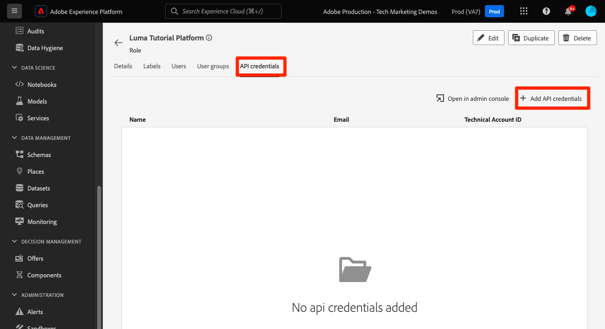
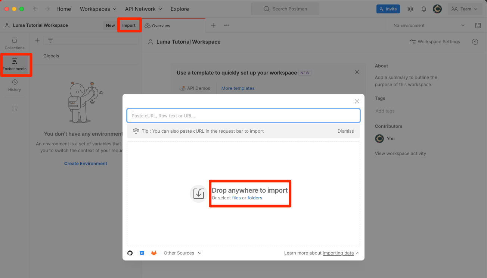

# Einrichten von Developer Console und [!DNL Postman]

<!--30min-->

In dieser Lektion richten Sie ein Projekt in der Adobe Developer Console ein und laden [!DNL Postman] -Sammlungen herunter, damit Sie mit der Verwendung von Platform-APIs beginnen können.

Laden Sie die Postman-App für Ihr Betriebssystem herunter, um die in diesem Tutorial beschriebenen API-Übungen abzuschließen. Obwohl dies für die Verwendung von Experience Platform-APIs nicht erforderlich ist, erleichtert Postman API-Workflows und Adobe Experience Platform bietet Dutzende von Postman-Sammlungen, mit denen Sie API-Aufrufe ausführen und lernen können, wie sie funktionieren. Im Rest dieses Tutorials werden einige Kenntnisse über Postman vorausgesetzt. Hilfe finden Sie in der [Postman-Dokumentation](https://learning.postman.com/).

Platform ist als API-Erste konzipiert. Auch wenn Schnittstellenoptionen für alle Hauptaufgaben vorhanden sind, sollten Sie die Platform-API irgendwann verwenden. Um beispielsweise Daten zu erfassen, verschieben Sie Elemente zwischen Sandboxes, automatisieren Sie Routineaufgaben oder verwenden Sie neue Platform-Funktionen, bevor die Benutzeroberfläche erstellt wurde.

**Datenarchitekten** und **Dateningenieure** müssen möglicherweise die Platform-API außerhalb dieses Tutorials verwenden.

## Erforderliche Berechtigungen

In der Lektion [Berechtigungen konfigurieren](configure-permissions.md) richten Sie alle Zugriffssteuerungen ein, die zum Abschluss dieser Lektion erforderlich sind.

<!--
* Permission item Sandboxes > `Luma Tutorial`
* Developer-role access to the `Luma Tutorial Platform` product profile
-->

## Einrichten von Adobe Developer Console

Adobe Developer Console ist das Entwicklerziel für den Zugriff auf Adobe-APIs und SDKs, das Abhören von nahezu Echtzeit-Ereignissen, das Ausführen von Funktionen auf Runtime oder das Erstellen von Plug-ins oder App Builder-Anwendungen. Sie werden es verwenden, um auf die Experience Platform-API zuzugreifen. Weitere Informationen finden Sie in der [Adobe Developer Console-Dokumentation](https://www.adobe.io/apis/experienceplatform/console/docs.html) .

1. Erstellen Sie auf Ihrem lokalen Computer einen Ordner mit dem Namen `Luma Tutorial Assets` für die in der Anleitung verwendeten Dateien.

1. Öffnen Sie den [Adobe Developer Console](https://console.adobe.io){target="_blank"}

1. Melden Sie sich an und bestätigen Sie, dass Sie sich in der richtigen Organisation befinden

1. Wählen Sie **[!UICONTROL Neues Projekt erstellen]** im Menü [!UICONTROL Schnellstart] aus.

   

1. Wählen Sie im neu erstellten Projekt die Schaltfläche **[!UICONTROL Projekt bearbeiten]** aus
1. Ändern Sie den **[!UICONTROL Projekttitel]** in `Luma Tutorial API Project` (fügen Sie Ihren Namen zum Ende hinzu, wenn mehrere Personen aus Ihrem Unternehmen dieses Tutorial absolvieren).
1. Wählen Sie **[!UICONTROL Speichern]** aus.

   

1. Wählen Sie **[!UICONTROL API hinzufügen]**

   

1. Filtern Sie die Liste, indem Sie **[!UICONTROL Adobe Experience Platform]** auswählen

1. Wählen Sie in der Liste der verfügbaren APIs **[!UICONTROL Experience Platform-API]** und dann **[!UICONTROL Weiter]** aus.

   

1. Wählen Sie **[!UICONTROL OAuth Server-to-Server]** als Berechtigung aus und wählen Sie **[!UICONTROL Weiter]** aus.
    aus.

1. Wählen Sie das Produktprofil `AEP-Default-All-Users` aus und wählen Sie **[!UICONTROL Konfigurierte API speichern]**

   

1. Jetzt wurde Ihr Developer Console-Projekt erstellt!

1. Wählen Sie im Abschnitt **[!UICONTROL Testen Sie es aus]** der Seite die Option **[!UICONTROL Für Postman herunterladen]** und klicken Sie dann auf **[!UICONTROL OAuth Server-to-Server]** , um die JSON-Datei der Umgebung [!DNL Postman] herunterzuladen. Speichern Sie die `oauth_server_to_server.postman_environment.json` in Ihrem `Luma Tutorial Assets` -Ordner.

   

## Bitten Sie einen Systemadministrator, die API-Berechtigung zur Rolle hinzuzufügen.

Damit Sie die API-Anmeldeinformationen für die Interaktion mit Experience Platform verwenden können, muss ein Systemadministrator die API-Anmeldeinformationen der in der vorherigen Lektion erstellten Rolle zuweisen.  Wenn Sie kein Systemadministrator sind, senden Sie ihnen Folgendes:

1. Der [!UICONTROL Name] Ihrer API-Anmeldedaten (`Credential in Luma Tutorial API Project`)
1. Die [!UICONTROL E-Mail-Adresse des technischen Kontos] Ihrer Anmeldedaten (dadurch kann der Systemadministrator die Berechtigung finden)

   ![[!UICONTROL Name] und [!UICONTROL E-Mail-Adresse des technischen Kontos] Ihrer Anmeldedaten](assets/postman-credentialDetails.png)

Hier finden Sie die Anweisungen für den Systemadministrator:

1. Anmelden bei [Adobe Experience Platform](https://platform.adobe.com)
1. Wählen Sie **[!UICONTROL Berechtigungen]** im linken Navigationsbereich aus, der Sie zum Bildschirm [!UICONTROL Rollen] führt.
1. Öffnen Sie die Rolle `Luma Tutorial Platform` .
   
1. Wählen Sie die Registerkarte **[!UICONTROL API-Anmeldeinformationen]** aus.
1. Wählen Sie **[!UICONTROL API-Anmeldeinformationen hinzufügen]** aus.
   
1. Suchen Sie die `Credential in Luma Tutorial API Project` -Berechtigung und filtern Sie mit der vom Teilnehmer des Tutorials bereitgestellten [!UICONTROL E-Mail-Konto für das technische Konto], wenn die Liste lang ist.
1. Berechtigung auswählen
1. Wählen Sie **[!UICONTROL Speichern]** aus.

   

## Einrichten von Postman

>[!CAUTION]
>
>Die Benutzeroberfläche von Postman wird regelmäßig aktualisiert. Die Screenshots in diesem Tutorial wurden mit Postman v10.15.1 für Mac erstellt, die Benutzeroberflächenoptionen wurden jedoch möglicherweise geändert.

1. Herunterladen und Installieren von [[!DNL Postman]](https://www.postman.com/downloads/)
1. Öffnen Sie [!DNL Postman] und erstellen Sie einen Arbeitsbereich.
   

1. Importieren Sie die heruntergeladene JSON-Umgebungsdatei, `oauth_server_to_server.postman_environment.json`
   
1. Wählen Sie in [!DNL Postman] Ihre Umgebung im Dropdown-Menü aus.

1. Wählen Sie das Symbol aus, um die Umgebungsvariablen anzuzeigen:

   

### Sandbox-Name und Mandanten-ID hinzufügen

Die Variablen `SANDBOX_NAME` und `TENANT_ID` und `CONTAINER_ID` sind nicht im Adobe Developer Console-Export enthalten, daher fügen wir sie manuell hinzu:

1. Öffnen Sie in [!DNL Postman] die **Umgebungsvariablen**.
1. Wählen Sie den Link **Bearbeiten** rechts neben dem Umgebungsnamen aus.
1. Geben Sie im Feld **Neue Variable hinzufügen** den Wert `SANDBOX_NAME` ein.
1. Geben Sie in beide Wertfelder `luma-tutorial` ein, den Namen, den wir in der vorherigen Lektion unserer Sandbox gegeben haben. Wenn Sie einen anderen Namen für Ihre Sandbox verwendet haben, z. B. &quot;luma-tutorial-ignatiusjreilly&quot;, stellen Sie sicher, dass Sie diesen Wert verwenden.
1. Geben Sie im Feld **Neue Variable hinzufügen** den Wert `TENANT_ID` ein.
1. Wechseln Sie zu Ihrem Webbrowser und suchen Sie die Mandantenkennung Ihres Unternehmens, indem Sie zur Experience Platform-Oberfläche navigieren und den Teil der URL *nach dem @-Zeichen* extrahieren. Beispielsweise ist meine Mandanten-ID `techmarketingdemos`, Ihre ist jedoch anders:

   

1. Kopieren Sie diesen Wert und kehren Sie zum Bildschirm [!DNL Postman] Umgebungen verwalten zurück.
1. Fügen Sie Ihre Mandanten-ID in beide Wertfelder ein.
1. Geben Sie im Feld **Neue Variable hinzufügen** den Wert `CONTAINER_ID` ein.
1. Geben Sie `global` in beide Wertfelder ein

   >[!NOTE]
   >
   >`CONTAINER_ID` ist ein Feld, dessen Wert wir während des Tutorials mehrmals ändern. Wenn `global` verwendet wird, interagiert die API mit von Adobe bereitgestellten Elementen in Ihrem Platform-Konto. Wenn `tenant` verwendet wird, interagiert die API mit Ihren eigenen benutzerdefinierten Elementen.

1. Wählen Sie **Speichern** aus.

   

## API-Aufrufe erstellen

### Zugriffstoken abrufen

Adobe bietet einen umfangreichen Satz von [!DNL Postman] Sammlungen, mit denen Sie die Experience Platform-API erkunden können. Diese Sammlungen befinden sich im GitHub-Repository für Adobe Experience Platform Postman-Beispiele](https://github.com/adobe/experience-platform-postman-samples). [ Sie sollten dieses Repo mit einem Lesezeichen versehen, da Sie es in diesem Tutorial und später bei der Implementierung von Experience Platform für Ihr eigenes Unternehmen mehrmals verwenden werden.

Die erste Sammlung funktioniert mit den Adobe Identity Management Service (IMS)-APIs. Dies ist eine praktische Methode, um ein Zugriffstoken aus Postman abzurufen.

So generieren Sie das Zugriffstoken:

1. Laden Sie die Sammlung der [Identity Management-Dienst-APIs](https://github.com/adobe/experience-platform-postman-samples/blob/master/apis/ims/Identity%20Management%20Service.postman_collection.json) in Ihren Ordner `Luma Tutorial Assets` herunter
1. Importieren der Sammlung in [!DNL Postman]
1. Wählen Sie die Anfrage **oAuth: Request Access Token** und wählen Sie **Send** aus.
1. Sie sollten eine `200 OK` -Antwort mit einem Zugriffstoken in der Antwort erhalten

   

1. Das Zugriffstoken sollte automatisch als Umgebungsvariable **ACCESS_TOKEN** Ihrer [!DNL Postman] -Umgebung gespeichert werden.

   

### Interagieren mit einer Platform-API

Nehmen wir nun einen Platform-API-Aufruf vor, um zu bestätigen, dass wir alles korrekt konfiguriert haben.

Öffnen Sie die [Experience Platform [!DNL Postman] Sammlungen in GitHub](https://github.com/adobe/experience-platform-postman-samples/tree/master/apis/experience-platform). Auf dieser Seite finden Sie viele Sammlungen für verschiedene Platform-APIs. Ich empfehle dringend, ein Lesezeichen zu setzen.

Nehmen wir nun unseren ersten API-Aufruf vor:

1. Laden Sie die [Schema Registry-API-Sammlung](https://raw.githubusercontent.com/adobe/experience-platform-postman-samples/master/apis/experience-platform/Schema%20Registry%20API.postman_collection.json) in Ihren `Luma Tutorial Assets` -Ordner herunter
1. Importieren in [!DNL Postman]
1. Öffnen Sie **Schema Registry-API > Schemas > Listenschemas**
1. Sehen Sie sich die Registerkarten **Parameter** und **Kopfzeilen** an und beachten Sie, wie sie einige der zuvor eingegebenen Umgebungsvariablen enthalten.
1. Beachten Sie, dass das Feld **Kopfzeilen > Wert akzeptieren** auf `application/vnd.adobe.xed-id+json` festgelegt ist. Für die Schema Registry-APIs ist einer der [angegebenen Accept-Kopfzeilenwerte](https://experienceleague.adobe.com/docs/experience-platform/xdm/api/getting-started.html?lang=en#accept) erforderlich, die verschiedene Formate in der Antwort bereitstellen.
1. Wählen Sie **Senden** aus, um Ihren ersten Platform-API-Aufruf durchzuführen!

Hoffentlich haben Sie eine erfolgreiche `200 OK` -Antwort mit einer Liste der verfügbaren von Adobe bereitgestellten XDM-Schemas in Ihrer Sandbox erhalten, wie unten dargestellt.

Wenn Ihr Aufruf nicht erfolgreich war, versuchen Sie einen Moment, das Debugging mithilfe der Fehlerantwortendetails des API-Aufrufs durchzuführen und überprüfen Sie die oben beschriebenen Schritte. Wenn Sie feststecken bleiben, bitten Sie um Hilfe im [Community-Forum](https://experienceleaguecommunities.adobe.com/t5/adobe-experience-platform/ct-p/adobe-experience-platform-community?profile.language=de) oder verwenden Sie den Link rechts auf dieser Seite, um &quot;Problem protokollieren&quot;zu können.

Wenn Sie Ihre Plattformberechtigungen, Sandbox und [!DNL Postman] eingerichtet haben, können Sie [Modelldaten in Schemata](model-data-in-schemas.md) modellieren!
