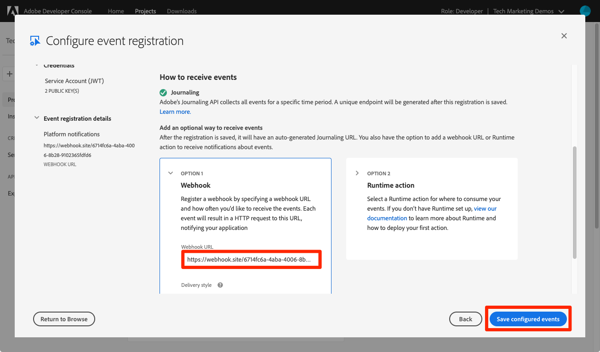

# Abonnieren von Datenerfassungsereignissen

<!--25min-->

In dieser Lektion abonnieren Sie Datenerfassungsereignisse, indem Sie einen Webhook mit der Adobe Developer Console und ein Online-Webhook-Entwicklungstool einrichten. Sie werden diese Ereignisse verwenden, um den Status Ihrer Datenerfassungsaufträge in den nachfolgenden Lektionen zu überwachen.

**Dateningenieure** möchten außerhalb dieses Tutorials Datenerfassungsereignisse abonnieren.
**Datenarchitekten** _können diese Lektion_ überspringen und zur Lektion [Batch-Erfassung](ingest-batch-data.md) navigieren.

## Erforderliche Berechtigungen

In der Lektion [Berechtigungen konfigurieren](configure-permissions.md) richten Sie alle Zugriffssteuerungen ein, die zum Abschluss dieser Lektion erforderlich sind, insbesondere:

<!--* Developer-role access to the `Luma Tutorial Platform` product profile (for API)
-->

>[!IMPORTANT]
>
> Diese Benachrichtigungen, die durch die Datenerfassungsereignisse ausgelöst werden, gelten für _alle Ihre Sandboxes_ und nicht nur für Ihre `Luma Tutorial`. Möglicherweise werden in Ihrem Konto auch Benachrichtigungen angezeigt, die von anderen Datenerfassungsereignissen stammen.

## Webhook einrichten

In dieser Übung erstellen wir einen Webhook mit einem Online-Tool namens webhook.site (Sie können gerne jedes andere Webhook-Entwicklungstool, das Sie bevorzugen, ersetzen):

1. Öffnen Sie auf einer anderen Browser-Registerkarte die Website [https://webhook.site/](https://webhook.site/).
1. Ihnen wird eine eindeutige URL zugewiesen, die Sie mit einem Lesezeichen versehen sollten, wenn Sie später in den Datenerfassungsstunden darauf zurückkehren:

   
1. Wählen Sie die Schaltfläche **Bearbeiten** in der oberen Navigation aus.
1. Geben Sie als Antworttext `$request.query.challenge$` ein. Die Adobe I/O-Ereignisbenachrichtigungen, die wir später in dieser Lektion eingerichtet haben, senden eine Herausforderung an den Webhook und erfordern, dass er im Antworttext enthalten ist.
1. Wählen Sie die Schaltfläche **Speichern** aus

   

## Einrichten

1. Öffnen Sie auf einer anderen Browser-Registerkarte den [Adobe Developer Console](https://console.adobe.io/)
1. Öffnen Sie Ihre `Luma Tutorial API Project`
1. Wählen Sie die Schaltfläche **[!UICONTROL Zum Projekt hinzufügen]** und dann **[!UICONTROL Ereignis]** aus.

   
1. Filtern Sie die Liste durch Auswahl von **[!UICONTROL Experience Platform]**
1. Wählen Sie **[!UICONTROL Plattformbenachrichtigungen]** aus
1. Wählen Sie die Schaltfläche **[!UICONTROL Weiter]** aus
   
1. Alle Ereignisse auswählen
1. Wählen Sie die Schaltfläche **[!UICONTROL Weiter]** aus
   
1. Wählen Sie im nächsten Bildschirm zum Konfigurieren der Anmeldedaten erneut die Schaltfläche **[!UICONTROL Weiter]** aus.
   
1. Geben Sie als **[!UICONTROL Registrierungsname für das Ereignis]** `Platform notifications` ein.
1. Scrollen Sie nach unten und wählen Sie aus, um den Abschnitt **[!UICONTROL Webhook]** zu öffnen.
1. Fügen Sie als **[!UICONTROL Webhook-URL]** den Wert aus dem Feld **Ihre eindeutige URL** aus webhook.site ein.
1. Wählen Sie die Schaltfläche **[!UICONTROL Konfigurierte Ereignisse speichern]** aus
   
1. Warten Sie, bis Ihre Konfiguration gespeichert ist, und Sie sollten sehen, dass Ihr `Platform notifications`-Ereignis mit Ihren Webhook-Details aktiv ist und keine Fehlermeldungen angezeigt werden
   
1. Wechseln Sie zurück zu Ihrer Registerkarte webhook.site . Daraufhin sollte die erste Anforderung an den Webhook angezeigt werden, die sich aus der Überprüfung Ihrer Developer Console-Konfiguration ergibt:
   

Jetzt erfahren Sie mehr über diese Benachrichtigungen in den nächsten Lektionen, wenn Sie Daten erfassen.

## Weitere Ressourcen

* [webhook.site](https://webhook.site/)
* [Dokumentation zu Datenerfassungsbenachrichtigungen](https://experienceleague.adobe.com/docs/experience-platform/ingestion/quality/subscribe-events.html)
* [Erste Schritte mit der Dokumentation zu Adobe I/O-Ereignissen](https://www.adobe.io/apis/experienceplatform/events/docs.html)

Ok, lasst uns endlich [Daten aufnehmen](ingest-batch-data.md)!
