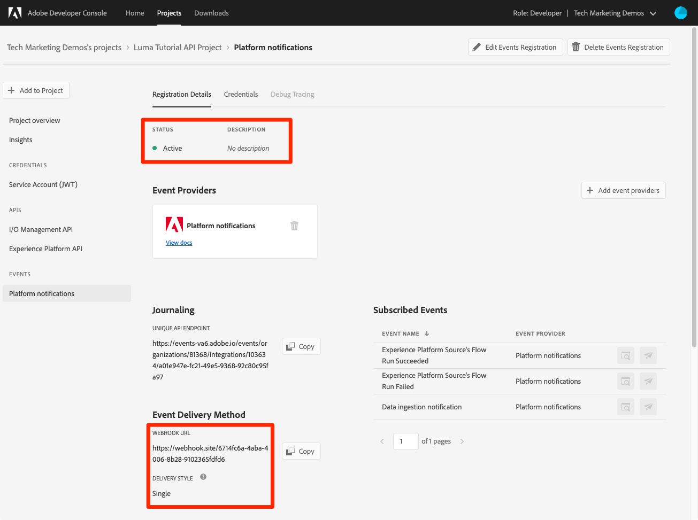

# Abonnieren von Datenerfassungsereignissen

<!--25min-->

In dieser Lektion abonnieren Sie Datenerfassungsereignisse, indem Sie einen Webhook mit der Adobe Developer Console und ein Online-Webhook-Entwicklungstool einrichten. Sie werden diese Ereignisse verwenden, um den Status Ihrer Datenerfassungsaufträge in den nachfolgenden Lektionen zu überwachen.

**Dateningenieure** möchte außerhalb dieses Tutorials Datenerfassungsereignisse abonnieren.
**Datenarchitekten** _kann diese Lektion überspringen_ und gehen Sie zu [Batch-Erfassung - Lektion](ingest-batch-data.md).

## Erforderliche Berechtigungen

Im [Berechtigungen konfigurieren](configure-permissions.md) Lektion: Sie richten alle Zugriffskontrollen ein, die zum Abschluss dieser Lektion erforderlich sind, insbesondere:

<!--* Developer-role access to the `Luma Tutorial Platform` product profile (for API)
-->

>[!IMPORTANT]
>
> Diese durch die Datenerfassungsereignisse ausgelösten Benachrichtigungen gelten für _alle Sandboxes_ nicht nur Ihre `Luma Tutorial`. Möglicherweise werden in Ihrem Konto auch Benachrichtigungen angezeigt, die von anderen Datenerfassungsereignissen stammen.

## Webhook einrichten

In dieser Übung erstellen wir einen Webhook mit einem Online-Tool namens webhook.site (Sie können gerne jedes andere Webhook-Entwicklungstool, das Sie bevorzugen, ersetzen):

1. Öffnen Sie die Website in einer anderen Browser-Registerkarte. [https://webhook.site/](https://webhook.site/)
1. Ihnen wird eine eindeutige URL zugewiesen, die Sie mit einem Lesezeichen versehen sollten, wenn Sie später in den Datenerfassungsstunden darauf zurückkehren:

   
1. Wählen Sie die **Bearbeiten** Schaltfläche in der oberen Navigation
1. Geben Sie als Antworttext ein. `$request.query.challenge$`. Die Benachrichtigungen zu Adobe I/O-Ereignissen, die wir später in dieser Lektion eingerichtet haben, senden eine Herausforderung an den Webhook und erfordern, dass er im Antworttext enthalten ist.
1. Klicken Sie auf die Schaltfläche **Speichern**

   

## Setup

1. Öffnen Sie auf einer anderen Browser-Registerkarte die [Adobe Developer-Konsole](https://console.adobe.io/)
1. Öffnen Sie Ihre `Luma Tutorial API Project`
1. Wählen Sie die **[!UICONTROL Zum Projekt hinzufügen]** und wählen Sie **[!UICONTROL Ereignis]**

   
1. Filtern der Liste durch Auswahl **[!UICONTROL Experience Platform]**
1. Auswählen **[!UICONTROL Plattformbenachrichtigungen]**
1. Wählen Sie die **[!UICONTROL Nächste]** button
   
1. Alle Ereignisse auswählen
1. Wählen Sie die **[!UICONTROL Nächste]** button
   
1. Wählen Sie im nächsten Bildschirm zum Konfigurieren der Anmeldedaten die **[!UICONTROL Nächste]** Schaltfläche erneut
   
1. Als **[!UICONTROL Name der Ereignisregistrierung]**, eingeben `Platform notifications`
1. Scrollen Sie nach unten und wählen Sie aus, um die **[!UICONTROL Webhook]** Abschnitt
1. Als **[!UICONTROL Webhook-URL]**, fügen Sie den Wert aus der **Ihre eindeutige URL** Feld von webhook.site
1. Wählen Sie die **[!UICONTROL Konfigurierte Ereignisse speichern]** button
   
1. Warten Sie, bis Ihre Konfiguration gespeichert ist, und Sie sollten sehen, dass Ihre `Platform notifications` -Ereignis ist aktiv mit Ihren Webhook-Details und ohne Fehlermeldungen
   
1. Wechseln Sie zurück zu Ihrer Registerkarte webhook.site . Daraufhin sollte die erste Anforderung an den Webhook angezeigt werden, die aus der Überprüfung Ihrer Entwicklerkonsole-Konfiguration resultiert:
   

Jetzt erfahren Sie mehr über diese Benachrichtigungen in den nächsten Lektionen, wenn Sie Daten erfassen.

## Weitere Ressourcen

* [webhook.site](https://webhook.site/)
* [Dokumentation zu Benachrichtigungen zur Datenerfassung](https://experienceleague.adobe.com/docs/experience-platform/ingestion/quality/subscribe-events.html)
* [Dokumentation zu den ersten Schritten mit Adobe I/O-Ereignissen](https://www.adobe.io/apis/experienceplatform/events/docs.html)

Ok, fangen wir endlich an [Datenerfassung](ingest-batch-data.md)!
