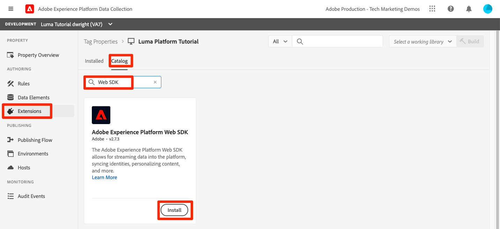
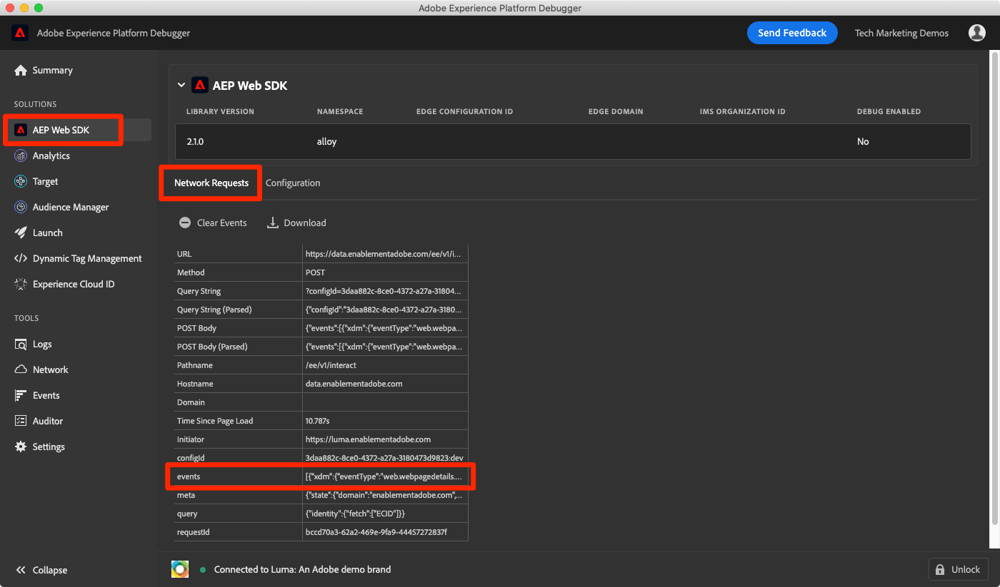
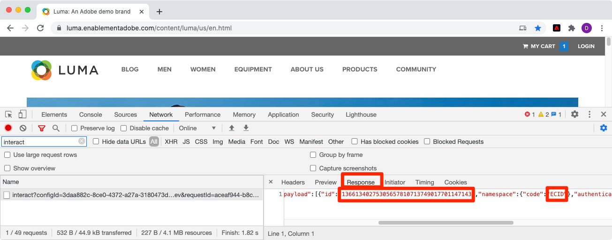

# Aufnehmen von Streaming-Daten

<!--1hr-->

In dieser Lektion streamen Sie Daten mit der Adobe Experience Platform Web SDK.

>[!WARNING]
>
> Die in diesem Tutorial verwendete Luma-Website wird voraussichtlich in der Woche vom 16. Februar 2026 ersetzt. Die im Rahmen dieses Tutorials durchgeführten Arbeiten sind möglicherweise nicht auf die neue Website anwendbar.

Es gibt zwei Hauptaufgaben bei der Datenerfassung:

* Implementieren Sie Web SDK auf der Luma-Website, um Kundenereignisse an Experience Platform Edge Network zu streamen.

* Konfigurieren Sie einen Datenstrom, um Edge Network anzuweisen, die Daten an unsere `Luma Web Events Dataset` in Experience Platform weiterzuleiten.

**Dateningenieure** müssen Streaming-Daten außerhalb dieses Tutorials aufnehmen. Obwohl Web-Entwickler Web SDK normalerweise in eine Website implementieren, ist es wichtig zu wissen, wie der Prozess funktioniert. Auch wenn Sie kein Web-Entwickler sind, sollten Sie diese grundlegende Implementierung abschließen können.

Bevor Sie mit den Übungen beginnen, sehen Sie sich diese beiden kurzen Videos an, um mehr über die Streaming-Datenaufnahme und Web SDK zu erfahren:

>[!VIDEO](https://video.tv.adobe.com/v/31577?captions=ger&learn=on&enablevpops)

>[!VIDEO](https://video.tv.adobe.com/v/37260?captions=ger&learn=on&enablevpops)

>[!NOTE]
>
>Während sich dieses Tutorial auf die Streaming-Aufnahme von Websites mit Web SDK konzentriert, können Sie Daten auch mit der [Mobile SDK](https://experienceleague.adobe.com/de/docs/platform-learn/implement-mobile-sdk/overview), der [Edge Network Server-API](https://experienceleague.adobe.com/de/docs/platform-learn/data-collection/server-api/overview) und der [HTTP-API](https://experienceleague.adobe.com/de/docs/experience-platform/sources/connectors/streaming/http) streamen.

## Berechtigungen erforderlich

In der Lektion [Berechtigungen konfigurieren](configure-permissions.md) richten Sie alle Zugriffssteuerungen ein, die zum Abschließen dieser Lektion erforderlich sind.

## Konfigurieren des Datenstroms

Zunächst konfigurieren wir den Datenstrom. Ein Datenstrom teilt Experience Platform Edge Network mit, wohin die Daten gesendet werden sollen, nachdem sie vom Web-SDK-Aufruf empfangen wurden. Möchten Sie die Daten beispielsweise an Experience Platform, Adobe Analytics oder Adobe Target senden?

So erstellen Sie [!UICONTROL Datenstrom]:

1. Stellen Sie sicher, dass Sie sich noch in der Sandbox ` Luma Tutorial`.
1. Wählen **[!UICONTROL Datenströme]** im linken Navigationsbereich aus
1. Klicken Sie auf **[!UICONTROL Neuer Datenstrom]** in der oberen rechten Ecke

   

1. Geben Sie für **[!UICONTROL Name]** den `Luma Platform Tutorial` ein (fügen Sie am Ende Ihren Namen hinzu, wenn mehrere Personen in Ihrem Unternehmen an diesem Tutorial teilnehmen)
1. Klicken Sie auf **[!UICONTROL Speichern]**.

   

Sobald Daten bei der Edge eingehen, leitet [!UICONTROL Datenstrom] sie an die konfigurierten [!UICONTROL Services] weiter. So senden Sie Daten an Experience Platform:

1. Wählen Sie **[!UICONTROL Service hinzufügen]**
   

1. `Adobe Experience Platform` auswählen
1. `Luma Web Events Dataset` auswählen
1. Wählen Sie **[!UICONTROL Speichern]**

   

Obwohl in der Datenstromkonfiguration eine Option für einen Profildatensatz vorhanden ist, sollte diese nicht verwendet werden, um normale XDM-Profildaten an Platform zu senden. Diese Einstellung sollte nur verwendet werden, um Details zu Einverständnis, Push-Token und Benutzeraktivitäten zu senden.

Die Kontrollkästchen für [!UICONTROL Offer Decisioning], [!UICONTROL Edge-Segmentierung], [!UICONTROL Personalization-Ziele] und [!UICONTROL Adobe Journey Optimizer] ermöglichen es Ihnen, Daten in Edge zu aktivieren, werden jedoch in diesem Tutorial nicht verwendet.

## Implementieren von Web SDK

### Eigenschaft hinzufügen

Zunächst müssen wir eine Tag-Eigenschaft (früher eine Tag-Eigenschaft) erstellen. Eine Eigenschaft ist ein Container für alle JavaScript, Regeln und anderen Funktionen, die erforderlich sind, um Details von einer Web-Seite zu erfassen und an verschiedene Orte zu senden.

So erstellen Sie eine Eigenschaft:

1. Navigieren Sie **[!UICONTROL linken Navigationsbereich zu]** Tags“.
1. Wählen Sie **[!UICONTROL Neue Eigenschaft]**
   
1. Geben **[!UICONTROL als]** Name`Luma Platform Tutorial` ein (fügen Sie am Ende Ihren Namen hinzu, wenn mehrere Personen in Ihrem Unternehmen an diesem Tutorial teilnehmen)
1. Geben Sie als **[!UICONTROL Domains]** den `enablementadobe.com` ein (siehe Erklärung weiter unten)
1. Wählen Sie **[!UICONTROL Speichern]**
   

### Hinzufügen von Erweiterungen zur Eigenschaft

Nachdem Sie nun über die Eigenschaft verfügen, können Sie die Web-SDK mithilfe einer Erweiterung hinzufügen. Eine Erweiterung ist ein Code-Paket, das Ihrer Tag-Eigenschaft und -Implementierung Funktionen hinzufügt. So fügen Sie die Erweiterung hinzu:

1. Öffnen Sie Ihre Tag-Eigenschaft
1. Navigieren Sie **[!UICONTROL linken Navigationsbereich]** Erweiterungen“.
1. Wechseln Sie zur Registerkarte **[!UICONTROL Katalog]**.
1. Für Tags stehen viele Erweiterungen zur Verfügung. Katalog mit dem Begriff `Web SDK` filtern
1. Wählen Sie die Erweiterung **[!UICONTROL Adobe Experience Platform Web SDK]** aus, um den Seitenbereich zu öffnen
1. Klicken Sie auf **[!UICONTROL Schaltfläche „Installieren]**.
   
1. Es gibt mehrere Konfigurationen für die Web-SDK-Erweiterung, aber es gibt nur zwei, die wir für dieses Tutorial konfigurieren werden. Aktualisieren Sie die **[!UICONTROL Edge]** Domäne auf `data.enablementadobe.com`. Mit dieser Einstellung können Sie Erstanbieter-Cookies mit Ihrer Web SDK-Implementierung festlegen. Dies wird empfohlen. Wenn Sie Web SDK auf Ihrer eigenen Website implementieren, empfehlen wir Ihnen, einen CNAME für Ihre eigenen Datenerfassungszwecke zu erstellen, z. B. `data.YOUR_DOMAIN.com`
1. Wählen **[!UICONTROL im Abschnitt]** für die Produktionsumgebung Ihre `Luma Tutorial` Sandbox und Ihren `Luma Platform Tutorial` Datenstrom aus.
1. Sie können sich auch die anderen Konfigurationsoptionen ansehen (aber nicht ändern!) und dann auf &quot;**[!UICONTROL &quot;]**
   

Installieren Sie auf dem Bildschirm Erweiterungskatalog die Adobe Client-Datenschicht -Erweiterung. Diese Erweiterung hilft uns, die Datenschicht von der Luma-Website zu lesen:

In der Erweiterung sind keine Konfigurationen erforderlich. Speichern Sie sie daher einfach in Ihrer Bibliothek.

## Erstellen einer Regel zum Senden von Daten

Jetzt erstellen wir eine Regel, um Daten an Platform zu senden. Eine Regel ist eine Kombination aus Ereignissen, Bedingungen und Aktionen, die Tags anweisen, etwas zu tun. Erstellen einer Regel:

1. Navigieren Sie zu **[!UICONTROL Regeln]**
1. Klicken Sie auf **[!UICONTROL Schaltfläche „Neue Regel]**&quot;
   
1. Geben Sie einen Namen für die Regel ein `adobeDataLayer event`.
1. Klicken **[!UICONTROL unter „Ereignisse]** auf die Schaltfläche **[!UICONTROL Hinzufügen]**
   
1. Verwenden Sie die **[!UICONTROL Adobe Client-Datenschicht]** **[!UICONTROL Erweiterung]** und wählen Sie **[!UICONTROL Daten gepusht]** als **[!UICONTROL Ereignistyp]**.
1. Wählen Sie **[!UICONTROL Überwachen]** aus. **[!UICONTROL Alle Ereignisse]**.
1. Wählen Sie **[!UICONTROL Änderungen beibehalten]** aus, um zum Hauptbildschirm für Regeln zurückzukehren
   
1. Klicken **[!UICONTROL unter &quot;]**&quot; auf die **[!UICONTROL Hinzufügen]**-Schaltfläche
1. Verwenden Sie **[!UICONTROL Adobe Experience Platform Web SDK]** **[!UICONTROL Extension]** und wählen Sie **[!UICONTROL Ereignis senden]** als **[!UICONTROL Aktionstyp]**
1. Wählen Sie auf der rechten Seite **[!UICONTROL Webseitendetails Seitenansichten]** aus dem Dropdown **[!UICONTROL Typ]** aus. Dadurch wird das Feld eventType unserer `Luma Web Events Schema` ausgefüllt
1. Wählen Sie **[!UICONTROL Änderungen beibehalten]** aus, um zum Hauptbildschirm für Regeln zurückzukehren
   
1. Wählen **[!UICONTROL Speichern]**, um die Regel zu speichern\
   

## Veröffentlichen der Regel in einer Bibliothek

Als Nächstes veröffentlichen wir die Regel in unserer Entwicklungsumgebung, damit wir überprüfen können, ob sie funktioniert.

So erstellen Sie eine Bibliothek:

1. Navigieren Sie **[!UICONTROL linken Navigationsbereich]** Veröffentlichungsfluss &quot;&quot;.
1. Wählen Sie **[!UICONTROL Bibliothek hinzufügen]**
   
1. Geben Sie für **[!UICONTROL Name]** den Wert `Luma Platform Tutorial`
1. Wählen Sie für **[!UICONTROL Umgebung]** die Option `Development`
1. Klicken Sie auf **[!UICONTROL Schaltfläche „Alle geänderten Ressourcen hinzufügen]**. (Zusätzlich zur Erweiterung [!UICONTROL Adobe Experience Platform Web SDK] und der `adobeDataLayer event`-Regel wird auch die Erweiterung [!UICONTROL Core] hinzugefügt, die die für alle Tag-Web-Eigenschaften erforderliche JavaScript-Basis enthält.)
1. Klicken Sie auf **[!UICONTROL Schaltfläche „Für Entwicklung speichern und erstellen]**
   

Es kann einige Minuten dauern, bis die Bibliothek erstellt ist. Nach Abschluss wird links neben dem Bibliotheksnamen ein grüner Punkt angezeigt:

Wie Sie auf dem Bildschirm [!UICONTROL Publishing-Ablauf] sehen können, gibt es sehr viel mehr am Publishing-Prozess, was den Rahmen dieses Tutorials sprengt. Wir verwenden jetzt nur eine einzige Bibliothek in unserer Entwicklungsumgebung.

## Validieren der Daten in der Anfrage

### Adobe Experience Platform Debugger hinzufügen

Experience Platform Debugger ist eine für Chrome verfügbare Erweiterung, mit der Sie die in Ihren Web-Seiten implementierte Adobe-Technologie sehen können. Laden Sie die Version für Ihren bevorzugten Browser herunter:

* [Chrome-Erweiterung](https://chrome.google.com/webstore/detail/adobe-experience-platform/bfnnokhpnncpkdmbokanobigaccjkpob)

Wenn Sie den Debugger noch nie verwendet haben, sollten Sie sich dieses fünfminütige Übersichtsvideo ansehen:

>[!VIDEO](https://video.tv.adobe.com/v/35916?captions=ger&learn=on&enablevpops)

### Öffnen der Luma-Website

Für dieses Tutorial verwenden wir eine öffentlich gehostete Version der Demo-Website von Luma. Öffnen wir sie und setzen ein Lesezeichen dafür:

1. Öffnen Sie in einer neuen Browser-Registerkarte die [Luma-Website](https://newluma.enablementadobe.com).
1. Setzen Sie ein Lesezeichen für die Seite, die im weiteren Verlauf des Tutorials verwendet werden soll

Diese gehostete Website ist der Grund, warum wir `enablementadobe.com` im Feld [!UICONTROL Domains] unserer ursprünglichen Tag-Eigenschaftskonfiguration verwendet haben und warum wir `data.enablementadobe.com` als Erstanbieter-Domain in der [!UICONTROL Adobe Experience Platform Web SDK]-Erweiterung verwendet haben. Siehst du, ich hatte einen Plan!

### Verwenden Sie den Experience Platform Debugger, um eine Zuordnung zu Ihrer Tag-Eigenschaft vorzunehmen

Der Experience Platform-Debugger verfügt über eine coole Funktion, mit der Sie eine vorhandene Tag-Eigenschaft durch eine andere ersetzen können. Dies ist für die Validierung nützlich und ermöglicht es uns, viele Implementierungsschritte in diesem Tutorial zu überspringen.

1. Stellen Sie sicher, dass die Luma-Site geöffnet ist und wählen Sie das Symbol für die Experience Platform Debugger-Erweiterung aus
1. Der Debugger wird geöffnet und zeigt einige Details der hartcodierten Implementierung an, die nicht mit diesem Tutorial zusammenhängt (Sie müssen die Luma-Site möglicherweise nach dem Öffnen des Debuggers neu laden)
1. Vergewissern Sie sich, dass der Debugger **[!UICONTROL mit Luma verbunden]** ist, wie unten dargestellt, und wählen Sie dann das Symbol &quot;**[!UICONTROL lock]**&quot; aus, um den Debugger für die Luma-Site zu sperren.
1. Wählen Sie die **[!UICONTROL Anmelden]**-Schaltfläche oben rechts aus, um sich zu authentifizieren.
1. Navigieren Sie jetzt zu **[!UICONTROL Experience Platform-]** Tags&rbrace; im linken Navigationsbereich
1. Wählen Sie die Registerkarte Konfiguration aus
1. Öffnen Sie rechts neben der Stelle, an der die **[!UICONTROL Seiteneinbettungs-Codes]** angezeigt werden, das **[!UICONTROL Aktionen]** und wählen Sie **[!UICONTROL Ersetzen]**
   
1. Da Sie authentifiziert sind, ruft der Debugger Ihre verfügbaren Tag-Eigenschaften und Umgebungen ab. `Luma Platform Tutorial` auswählen
1. `Development` auswählen
1. Klicken Sie auf die **[!UICONTROL Apply]**-Schaltfläche
   
1. Die Luma-Website wird jetzt neu geladen _mit Ihrer Tag-Eigenschaft_.
   
1. Navigieren Sie **[!UICONTROL linken]** zu „Zusammenfassung“, um die Details Ihrer [!UICONTROL Tag]-Eigenschaft anzuzeigen
   
1. Wechseln Sie jetzt zu **[!UICONTROL Experience Platform Web SDK]** im linken Navigationsbereich, um die **[!UICONTROL Netzwerkanfragen“ anzuzeigen]**
1. Wählen Sie die **[!UICONTROL Ereignisse]** aus

   

1. Beachten Sie, dass wir den `web.webpagedetails.pageView` Ereignistyp sehen können, den wir in unserer Aktion [!UICONTROL Ereignis senden] angegeben haben
   

1. Die Anfragedetails sind auch auf der Registerkarte „Netzwerk“ der Web-Entwickler **Tools** Browsers sichtbar. Öffnen Sie sie und laden Sie die Seite neu. Filtern Sie nach Aufrufen mit `interact`, um den Aufruf zu finden, ihn auszuwählen und dann in der Registerkarte **Kopfzeilen** im Bereich **Anfrage-**&quot; nachzuschlagen.
   
1. Wechseln Sie zur Registerkarte **Antwort** und beachten Sie, wie der ECID-Wert in der Antwort enthalten ist. Kopieren Sie diesen Wert, da Sie ihn zur Validierung der Profilinformationen in der nächsten Übung verwenden werden.
   

## Validieren der Daten in Experience Platform

Sie können überprüfen, ob Daten in Platform landen, indem Sie sich die in der `Luma Web Events Dataset` eingehenden Datenstapel ansehen. (Ich weiß, es heißt Streaming-Datenaufnahme, aber jetzt sage ich, es kommt in Batches! Er wird in Echtzeit an Profile gestreamt, sodass er für die Echtzeit-Segmentierung und -Aktivierung verwendet werden kann, aber in Batches alle 15 Minuten an den Data Lake gesendet wird.)

So validieren Sie die Daten:

1. Wechseln Sie in der Platform-Benutzeroberfläche **[!UICONTROL linken Navigationsbereich]** Datensätze“
1. Öffnen Sie die `Luma Web Events Dataset` und bestätigen Sie, dass ein Batch eingegangen ist. Denken Sie daran, dass sie alle 15 Minuten gesendet werden, sodass Sie möglicherweise warten müssen, bis der Batch angezeigt wird.
1. Klicken Sie auf **[!UICONTROL Schaltfläche „Datensatz in]** Vorschau anzeigen“
   
1. Beachten Sie im Vorschau-Modal, wie Sie verschiedene Felder des Schemas auf der linken Seite auswählen können, um eine Vorschau dieser spezifischen Datenpunkte anzuzeigen:
   

Sie können auch bestätigen, dass das neue Profil angezeigt wird:

1. Wechseln Sie in der Platform-Benutzeroberfläche **[!UICONTROL linken]** zu „Profile“
1. Wählen Sie den **[!UICONTROL ECID]**-Namespace aus und suchen Sie nach Ihrem ECID-Wert (kopieren Sie ihn aus der Antwort). Das Profil verfügt über eine eigene ID, die von der ECID getrennt ist.
1. Wählen Sie die **[!UICONTROL Profil-ID]** aus, um das Profil zu öffnen
   
1. Wählen Sie die Registerkarte **[!UICONTROL Ereignisse]** aus, um die angezeigten Seiten anzuzeigen
   \
   <!---->

## Hinzufügen benutzerdefinierter Daten zum Ereignis

Web SDK füllt viele XDM-Felder automatisch, Sie müssen jedoch zwangsläufig Ihre Implementierung anpassen, um zusätzliche Felder auf Ihrer Website zu erfassen. Dies ist sehr aufwändig, aber hier sind ein paar einfache Beispiele.

### Erstellen eines Datenelements zum Speichern von XDM-Daten

1. Zurück zur `Luma Platform Tutorial` Tag-Eigenschaft navigieren
1. Öffnen Sie das **[!UICONTROL Arbeitsbibliothek auswählen]** und wählen Sie Ihre `Luma Platform Tutorial` aus. Diese Einstellung erleichtert das Veröffentlichen zusätzlicher Aktualisierungen in unserer Bibliothek.
1. Navigieren Sie jetzt zu **[!UICONTROL Datenelemente]** im linken Navigationsbereich
1. Klicken Sie auf **[!UICONTROL Schaltfläche Neues Datenelement erstellen]**

   

Auf der Seite **[!UICONTROL Datenelemente]**:

1. Geben Sie als **[!UICONTROL Name]** `XDM data`
1. Wählen Sie als **[!UICONTROL Erweiterung]** die Option `Adobe Experience Platform Web SDK`
1. Wählen Sie als **[!UICONTROL Datenelementtyp]** die Option `Variable`
1. Wählen Sie als **[!UICONTROL Sandbox]** Ihre `Luma Tutorial` Sandbox aus
1. Wählen Sie als **[!UICONTROL Schema]** Ihre `Luma Web Events Schema` aus
1. Stellen Sie sicher, dass `Luma Platform Tutorial` als Arbeitsbibliothek ausgewählt ist
1. Wählen Sie **[!UICONTROL In Bibliothek speichern]**
   

### Datenelement für Seitennamen erstellen

1. Erstellen eines neuen Datenelements
1. Geben Sie als **[!UICONTROL Name]** `Page Name`
1. Wählen Sie als **[!UICONTROL Datenelementtyp]** die Option `JavaScript Variable`
1. Geben Sie als **[!UICONTROL JavaScript]** Variablennamen `adobeDataLayer.0.page.name` ein
1. Um das Format der Werte zu standardisieren, aktivieren Sie die Kontrollkästchen für **[!UICONTROL Kleinbuchstaben erzwingen]** und **[!UICONTROL Text]**
1. Wählen Sie **[!UICONTROL In Bibliothek speichern]**
   

### Hinzufügen der XDM-Daten zur Aktion „Ereignis senden“

Nachdem Sie nun Daten XDM-Feldern zugeordnet haben, können Sie sie in die Aktion „Ereignis senden“ einbeziehen:

1. Zum Bildschirm **[!UICONTROL Regeln]** wechseln
1. `adobeDataLayer event` öffnen
1. `Adobe Experience Platform Web SDK - Send Event` öffnen
1. Wählen Sie **[!UICONTROL XDM]** das Symbol aus, um das Datenelement-Auswahlmodal zu öffnen, und wählen Sie Ihr `XDM data` Datenelement aus
1. Wählen **[!UICONTROL Änderungen beibehalten]**
   

1. Hinzufügen einer neuen Aktion zu Ihrer Regel
1. Wählen Sie die `Adobe Experience Platform Web SDK` **[!UICONTROL Erweiterung]**
1. Wählen Sie den `Update Variable` **[!UICONTROL Aktionstyp]**
1. Befüllen des `Page Name` Datenelements als `web.webPageDetails.name`
1. Wählen **[!UICONTROL Änderungen beibehalten]**
   

1. Ordnen Sie [!UICONTROL Aktionen] so an, dass [!UICONTROL Variable aktualisieren] vor dem [!UICONTROL Ereignis senden]
1. Da Sie nun für die letzten Übungen als Arbeitsbibliothek ausgewählt `Luma Platform Tutorial`, wurden Ihre letzten Änderungen direkt in der Bibliothek gespeichert. Anstatt Ihre Änderungen über den Bildschirm Veröffentlichungsfluss veröffentlichen zu müssen, können Sie einfach das Dropdown-Menü öffnen und auf **[!UICONTROL In Bibliothek speichern und erstellen]** klicken
   

Dadurch wird mit den drei soeben vorgenommenen Änderungen mit dem Erstellen einer neuen Tag-Bibliothek begonnen.

### Validieren der XDM-Daten

Sie sollten jetzt in der Lage sein, die Luma-Homepage neu zu laden, während sie Ihrer Tag-Eigenschaft mit dem Debugger zugeordnet ist, wie Sie zuvor erfahren haben, und sehen Sie, dass das Feld „Seitenname“ in der Anfrage ausgefüllt wird!

Sie können auch überprüfen, ob die Seitennamen-Daten in Platform empfangen wurden, indem Sie den Datensatz und das Profil in der Vorschau anzeigen.

## Zusätzliche Identitäten senden

Ihre Web-SDK-Implementierung sendet jetzt Ereignisse mit der Experience Cloud-ID (ECID) als primärer Kennung. Die ECID wird automatisch von der Web-SDK generiert und ist pro Gerät und Browser eindeutig. Ein Kunde kann über mehrere ECIDs verfügen, je nachdem, welches Gerät und welchen Browser er verwendet. Wie können wir uns also einen einheitlichen Überblick über diesen Kunden verschaffen und seine Online-Aktivitäten mit unseren CRM-, Treue- und Offline-Kaufdaten verknüpfen? Wir tun dies, indem wir während ihrer Sitzung zusätzliche Identitäten erfassen und es dem Identity Service ermöglichen, sie deterministisch zu verknüpfen.

Wenn Sie sich erinnern, erwähnte ich, dass wir die ECID und CRM-ID als Identitäten für unsere Web-Daten in der Lektion [Identitäten zuordnen](map-identities.md) verwenden würden. Lassen Sie uns also die CRM-ID mit der Web-SDK erfassen!

### Datenelement für die CRM-ID hinzufügen

Zunächst speichern wir die CRM-ID in einem Datenelement:

1. Fügen Sie in der Tags-Oberfläche ein Datenelement mit dem Namen `CRM Id` hinzu
1. Wählen Sie als **[!UICONTROL Datenelementtyp]** die Option **[!UICONTROL JavaScript-Variable aus]**
1. Geben Sie als **[!UICONTROL JavaScript]** Variablennamen `adobeDataLayer.0.user.id` ein
1. Klicken Sie auf **[!UICONTROL Schaltfläche „In Bibliothek speichern]** (`Luma Platform Tutorial` sollte immer noch Ihre Arbeitsbibliothek sein)
   

### Hinzufügen der CRM-ID zum Datenelement „Identity Map“

Nachdem wir nun den CRM-ID-Wert erfasst haben, müssen wir ihn mit einem speziellen Datenelementtyp verknüpfen, der als Datenelement [!UICONTROL Identitätszuordnung] bezeichnet wird:

1. Hinzufügen eines Datenelements mit dem Namen `Identity Map`
1. Wählen Sie als **[!UICONTROL Erweiterung]** die Option **[!UICONTROL Adobe Experience Platform Web SDK]**
1. Wählen Sie als **[!UICONTROL Datenelementtyp]** die Option **[!UICONTROL Identitätszuordnung]**
1. Wählen **[!UICONTROL als Namespace]** den Typ `Luma CRM Id` aus bzw. geben Sie ihn ein. Dies ist der [!UICONTROL Namespace], den wir in einer früheren Lektion erstellt haben.

1. Wählen Sie **[!UICONTROL ID]** das Symbol aus, um das Datenelement-Auswahlmodal zu öffnen, und wählen Sie Ihr `CRM Id` Datenelement aus
1. Wählen Sie als **[!UICONTROL Authentifizierungsstatus]** die Option **[!UICONTROL Authentifiziert]**
1. **[!UICONTROL Primäre]**

   >[!TIP]
   >
   > Adobe empfiehlt, Identitäten, die eine Person darstellen, wie `Luma CRM Id`, als [!UICONTROL primäre] Identität zu senden.
   >
   > Wenn die Identitätszuordnung die Personenkennung enthält (z. B. `Luma CRM Id`), wird die Personenkennung zur [!UICONTROL primären] Identität. Andernfalls wird `ECID` zur [!UICONTROL primären] Identität.

1. Klicken Sie auf **[!UICONTROL Schaltfläche „In Bibliothek speichern]** (`Luma Platform Tutorial` sollte immer noch Ihre Arbeitsbibliothek sein)
   

>[!NOTE]
>
>Sie können mehrere Kennungen mit dem Datentyp [!UICONTROL Identitätszuordnung] übergeben.

### Hinzufügen des Identitätszuordnungs-Datenelements zur XDM-Variablen

Jetzt müssen wir die XDM-Variablenaktion in unserer Regel aktualisieren, um die Identitätszuordnung einzuschließen. Keine Sorge, wir sind fast fertig mit dieser Lektion!

1. `adobeDataLayer event` öffnen
1. `Update variable` öffnen
1. Wählen Sie Ihr `Identity Map` Datenelement zum `identityMap` XDM-Feld aus.
1. Wählen **[!UICONTROL Änderungen beibehalten]**
   
1. Da Sie in den letzten Übungen `Luma Platform Tutorial` als Arbeitsbibliothek ausgewählt haben, wählen Sie **[!UICONTROL In Bibliothek speichern und erstellen]**

   

<!--U1770721295408-->

### Identität validieren

So überprüfen Sie, ob die CRM-ID jetzt von der Web-SDK gesendet wird:

1. Öffnen Sie die [Luma-Website](https://luma.enablementadobe.com/content/luma/us/en.html)
1. Ordnen Sie ihn mithilfe des Debuggers Ihrer Tag-Eigenschaft zu, wie in den vorherigen Anweisungen beschrieben
1. Wählen Sie den **Anmelden**-Link oben rechts auf der Luma-Website aus
1. Melden Sie sich mit den Anmeldedaten `test@test.com`/`test` an
1. Überprüfen Sie nach der Authentifizierung den Experience Platform Web SDK-Aufruf im Debugger (**[!UICONTROL Adobe Experience Platform Web SDK]** > **[!UICONTROL Netzwerkanfragen]** > **[!UICONTROL Ereignisse]** der letzten Anfrage). Sie sollten dann die `lumaCrmId` sehen:
   
1. Suchen Sie das Benutzerprofil mithilfe des ECID-Namespace und versuchen Sie es erneut. Im Profil werden die CRM-ID sowie die Treueprogramm-ID und die Profildetails wie Name und Telefonnummer angezeigt. Alle Identitäten und Daten wurden zu einem einzigen Echtzeit-Kundenprofil zusammengefügt!
   

## Zusätzliche Ressourcen

* [Implementieren von Adobe Experience Cloud mit dem Web SDK](/help/tutorial-web-sdk/overview.md)
* [Dokumentation zur Streaming-Aufnahme](https://experienceleague.adobe.com/docs/experience-platform/ingestion/streaming/overview.html?lang=de)
* [Referenz zur Streaming-Aufnahme-API](https://developer.adobe.com/experience-platform-apis/references/streaming-ingestion/)

Gut gemacht! Das waren eine Menge Informationen über Web-SDK und Tags. An einer vollständigen Implementierung ist viel mehr beteiligt, aber dies sind die Grundlagen, die Ihnen bei den ersten Schritten und den Ergebnissen in Platform helfen.

>[!NOTE]
>
>Nachdem Sie die Lektion Streaming-Aufnahme abgeschlossen haben, können Sie die [!UICONTROL Prod]-Sandbox aus Ihrem `Luma Tutorial Platform`-Produktprofil entfernen

Dateningenieure, wenn Sie möchten, können Sie zur Lektion [Ausführen von Abfragen“ &#x200B;](run-queries.md).

Datenarchitekten können mit „Zusammenführungsrichtlinien[&#x200B; fortfahren](create-merge-policies.md).
