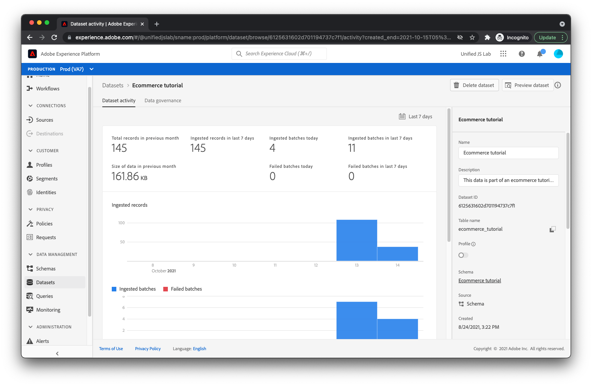

# Implementierung testen

Nachdem Sie Ihre Webseite eingerichtet und Ihre Adobe Experience Platform-Tag-Bibliothek bereitgestellt haben, ist es an der Zeit, die Implementierung zu testen.

1. Öffnen Sie Ihre Produktseite in Ihrem Browser. Klicken Sie dazu auf _Datei_ then _Datei öffnen..._ in Ihrem Browser oder Sie können Ihre Seite auf einem Webserver hosten und die entsprechende URL eingeben.

Nachdem die Seite geladen wurde, sollte Folgendes angezeigt werden:

Es ist nicht hübsch, aber es macht den Job.

## Inspect der Seitenansichts- und Produktansichtsereignisse

1. Öffnen Sie die Entwicklertools in Ihrem Browser und klicken Sie auf das Netzwerkfenster. Aktualisieren Sie Ihre Seite.
An dieser Stelle sollten vier Anfragen angezeigt werden:
* product.html - Ihre Webseite.
* launch-###############-development.js - Ihre Launch-Bibliothek.
* interact - Das Seitenansichtsereignis, das an den Server gesendet wird.
* interact - Das Produktansichtsereignis, das an den Server gesendet wird.
Inspect der Payload jeder Anfrage:
1. Für die erste `interact` -Anfrage, sollte die Payload angezeigt werden, die mit einer `eventType` von `web.webpagedetails.pageViews`.
   
1. Für das zweite `interact` -Anfrage, sollte die Payload angezeigt werden, die mit einer `eventType` von `commerce.productViews`.
   
1. Überprüfen Sie den Rest der gesendeten Daten, einschließlich der Produktinformationen.

## Öffnen Sie den Warenkorb und fügen Sie ihn zu Warenkorbereignissen hinzu.

1. Klicken Sie nun auf **_Zum Warenkorb hinzufügen_**Schaltfläche.

Es sollten zwei zusätzliche Anfragen angezeigt werden, die erste mit einer `eventType` von `commerce.productListOpens` (zum Öffnen eines neuen Warenkorbs) und der zweite mit einer `eventType` von `commerce.productListAdds` (zum Hinzufügen des Produkts zum Warenkorb).

## Inspect: Link-Klickereignis der Download-App

Je nach Browser können Sie durch Klicken auf einen Link, der von der aktuellen Seite weg führt, aus dem Netzwerkbereich löschen. Da Sie die Netzwerkanforderung für das Link-Klickereignis überprüfen möchten, das unmittelbar vor dem Navigieren zur Seite auftritt, müssen Sie Ihren Browser so konfigurieren, dass die Netzwerkprotokolle auf allen Seiten beibehalten werden.

1. Speichern Sie Netzwerkprotokolle, indem Sie entweder eine **_Protokoll beibehalten_** Kontrollkästchen im Netzwerkbereich (Chrome, Safari, Edge) oder auf ein Zahnradsymbol klicken und eine **_Persistente Protokolle_** im angezeigten Menü (Firefox).
1. Klicken Sie auf **_App herunterladen_** Link. Sie sollten eine weitere `interact` -Anfrage wird im Netzwerkbereich angezeigt.
1. Suchen Sie die Anforderung mit einer `eventType` von `web.webinteraction.linkClicks`und überprüfen Sie die Details zum angeklickten Link.

## Überprüfen, ob Daten in den Adobe Experience Platform-Datensatz eingehen

Überprüfen Sie jetzt, da Anfragen gesendet werden, ob die Daten sicher in den von Ihnen erstellten Adobe Experience Platform-Datensatz gelangen.

1. Navigieren Sie zum **[!UICONTROL Datensätze]** Ansicht in Adobe Experience Platform.
1. Wählen Sie die [Datensatz](configure-the-server/create-a-dataset.md) die Sie für dieses Tutorial erstellt haben.
Möglicherweise müssen Sie einige Minuten warten, aber bald sollten Sie Anzeichen dafür sehen, dass Daten verarbeitet und in Ihren Datensatz eingefügt werden. Sie sollten auch sehen, ob die Verarbeitung erfolgreich war oder fehlgeschlagen ist. Wenn es fehlschlug, sehen Sie, warum es fehlschlug. Normalerweise treten Fehler auf, da die gesendeten Daten nicht mit dem Schema übereinstimmen und Sie Ihre Daten oder Ihr Schema entsprechend anpassen müssen.
   

## Verwenden der Adobe Experience Platform Debugger-Erweiterung

Weitere Informationen dazu, wie sich Ihre Implementierung sowohl im Browser als auch auf den Servern der Adobe verhält, finden Sie in der Browsererweiterung Adobe Experience Platform Debugger .

[Adobe Experience Platform Debugger-Erweiterung für Chrome](https://chrome.google.com/webstore/detail/adobe-experience-platform/bfnnokhpnncpkdmbokanobigaccjkpob)

[Adobe Experience Platform Debugger-Erweiterung für Firefox](https://addons.mozilla.org/de/firefox/addon/adobe-experience-platform-dbg/)

[Weiter: ](summary.md)

>[!NOTE]
>
>Vielen Dank, dass Sie Ihre Zeit in das Erlernen der Datenerfassung investiert haben. Wenn Sie Fragen haben, ein allgemeines Feedback teilen möchten oder Vorschläge zu künftigen Inhalten haben, teilen Sie diese bitte mit. [Diskussionsbeitrag der Experience League](https://experienceleaguecommunities.adobe.com/t5/adobe-experience-platform-launch/tutorial-discussion-use-adobe-experience-platform-data/m-p/543877)