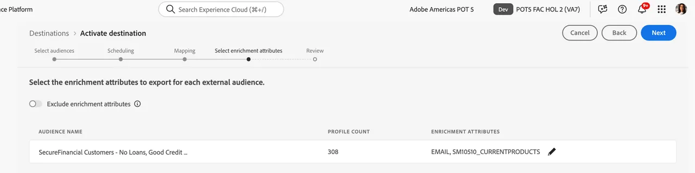

# Verknüpfte Zielgruppe zu S3 zuordnen, um Zielgruppenattribute für die Anreicherung zu nutzen

Sie können Zielgruppenattribute in Ihrem Data Warehouse nutzen, um das Erlebnis Ihrer Zielgruppe in nachgelagerten Aktivierungs-Workflows mit RTCDP-Zielen zu bereichern. Für SecurFinancial können diese Federated Attributes verwendet werden, um das Personalisierungserlebnis der Kunden-Zielgruppe offline zu verbessern. Nachfolgend wird die Federated Audience einem vorkonfigurierten Amazon S3-Ziel zugeordnet.

## Schritte

1. Navigieren Sie zum **Ziele**-Portal.

2. Klicken Sie auf die **3-Punkt**-Schaltfläche neben dem vorkonfigurierten Amazon S3-Ziel und dann auf **Zielgruppen aktivieren**.

   

3. Wählen Sie das **S3-Ziel** aus und klicken Sie dann auf **Weiter**.

   

4. Wählen Sie die entsprechende Zielgruppe aus. In unserem Beispiel: **SecureFinancial Customers - Keine Kredite, gute**, Zielgruppe.

   

5. Verwenden **im Abschnitt** die Standardeinstellungen und klicken Sie auf **Weiter**.

6. Wählen Sie **Schritt** Zuordnung“ den Deduplizierungsschlüssel aus. In unserem Beispiel wird `xdm: personalEmail.address` als **Deduplizierungsschlüssel“**. Klicken Sie dann auf **Weiter**:

   

7. Wählen Sie im Zuordnungsschritt Anreicherungsattribute basierend auf Zielgruppenfeld-Zuordnungen in der Federated-Audience-Komposition aus. Klicken Sie auf **Stiftsymbol (Bearbeiten**, um die vorab ausgewählten Attribute anzuzeigen.

   

   

8. Überprüfen Sie Ihre Zielgruppenzuordnung und klicken Sie auf **Beenden**.

>[**!SUMMARY**]
>
> Wir haben erfolgreich eine Zielgruppe erstellt und sie mit Leichtigkeit für ein S3-Ziel aktiviert. Die benutzerfreundliche Oberfläche ermöglicht es Marketing-Teams, Zielgruppen schnell zu erstellen und zu aktivieren, ohne die zugrunde liegenden Daten zu verschieben.

Jetzt bauen wir [eine Journey](build-journey-federated-audience.md).
