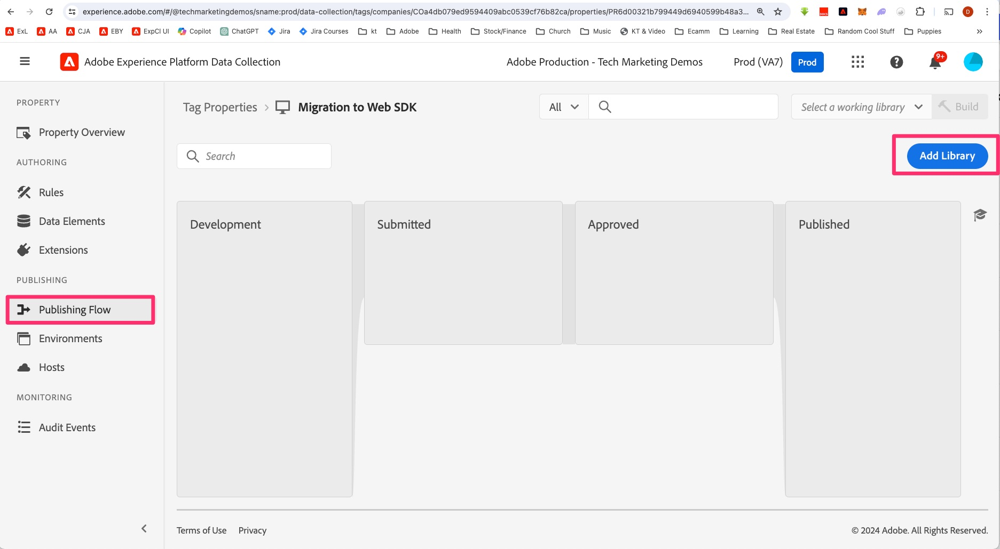

# Erstellen der Implementierungsänderungen in der Entwicklungsbibliothek

Erfahren Sie, wie Sie alle Änderungen an der Entwicklungsbibliothek in Ihrer Tags-Eigenschaft erstellen, damit Sie die Ergebnisse auf Ihrer Entwicklungs-Website testen können.

Während Sie mit diesem Tutorial fortfahren oder wirklich jedes Mal, wenn Sie Änderungen an Ihrer Implementierung vornehmen, müssen Sie diese Änderungen erstellen/veröffentlichen, um sie auf Ihren Entwicklungs-, Staging- oder Produktions-Sites zu sehen. Ich bin sicher, dass Sie das schon einmal gemacht haben, da dies ein Migrationsdokument ist und nicht das erste Implementierungsdokument. In Wirklichkeit sollten Sie dies ziemlich oft tun, da Sie jede Funktion ausführen und sie testen und sicherstellen möchten, dass sie ordnungsgemäß funktioniert, indem Sie die richtigen Daten an Analytics senden.

Daher gibt es in diesem Tutorial einige Erinnerungen zum Erstellen oder Veröffentlichen Ihrer Änderungen. Wenn Sie müssen, setzen Sie ein Lesezeichen auf diese Seite und scheuen Sie sich nicht, Ihre Entwicklungsbibliothek zu erstellen. Du kannst es jederzeit tun.

Also, lassen Sie uns aufbauen, was wir bisher getan haben. Übrigens können wir in diesem Tutorial manchmal „Erstellen“ und „Veröffentlichen“ austauschen. Was am wichtigsten ist, ist zu wissen, ob Sie eine Entwicklungs- oder Staging-Bibliothek „erstellen“ oder ob Sie in der Produktionsbibliothek und -umgebung „veröffentlichen“, unabhängig davon, welches Wort wir verwenden.

## Erstellen von Migrationsänderungen für die Entwicklung in Experience Platform-Tags

1. Wählen Sie in der Eigenschaft unter &quot;Experience Platform-Tags **im linken Navigationsbereich die Option** Veröffentlichungsfluss“ aus und fügen Sie dann eine neue Bibliothek hinzu.

   

1. Benennen Sie die Bibliothek nach Belieben, z. B **„Erste Migration von Web SDK**.
1. Wählen Sie die Umgebung **Entwicklung** aus.
1. Wählen **Alle geänderten Ressourcen hinzufügen**, um alle Elemente hinzuzufügen, an denen Sie gearbeitet haben.

   

1. Speichern und in Entwicklung aufbauen

   

1. Nach Abschluss des Builds können Sie sehen, ob der Build erfolgreich war. Bewegen Sie den Mauszeiger über den grünen Punkt links neben der neuen Bibliothek in Ihrem Publishing-Ablauf. Wenn er tatsächlich grün ist, ist er erfolgreich beendet und wird es Ihnen mitteilen.

   

### Arbeitsbibliothek auswählen

Hier finden Sie eine nützliche Abkürzung, wenn Sie Bearbeitungen in Tags durchlaufen. Anstatt jedes Mal, wenn Sie eine Änderung vornehmen, den gesamten Publishing-Ablauf zu durchlaufen, können Sie eine Arbeitsbibliothek auswählen und mit einem Klick auf eine Schaltfläche speichern und erstellen. Mach es! Du wirst mir später danken.

1. Klicken Sie praktisch überall in der Tags-Benutzeroberfläche oben rechts in der Benutzeroberfläche auf Arbeitsbibliothek auswählen und wählen Sie die gewünschte Bibliothek aus. Wählen Sie für dieses Tutorial die Option Erstmalige Web SDK-Migration .

   

