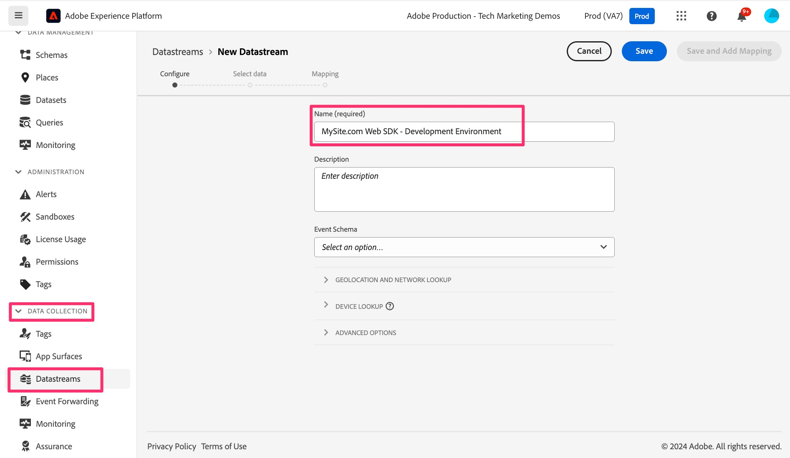

# Erstellen und Konfigurieren eines Datenstroms

Erfahren Sie, wie Sie einen neuen Datenstrom erstellen und konfigurieren, damit Ihre Website-Daten an Adobe Analytics weitergeleitet werden können.

In dieser Lektion erfahren Sie, wie Sie das System so erstellen und konfigurieren, dass Ihre Daten von Ihrer Website zur Adobe Edge fließen und von dort an Adobe Analytics weitergeleitet werden.

## Erstellen eines neuen Entwicklungsdatenstroms

1. Öffnen der Datenerfassungs-Adobe-Oberfläche
   1. Navigieren Sie in Ihrem Browser zu https://experience.adobe.com
   1. Vergewissern Sie sich, dass oben auf der Seite die richtige Organisation ausgewählt ist (z. B. Demos zur Adobe-Produktion - Technisches Marketing in der Abbildung unten)
   1. Klicken Sie auf die „neun Punkte“, auch Programmumschalter genannt, und wählen Sie **Datenerfassung**

      

1. Navigieren Sie **[!UICONTROL linken Navigationsbereich zu]** Datenströme“
1. Wählen Sie **[!UICONTROL Neuer Datenstrom]**
1. Geben Sie den gewünschten **[!UICONTROL Namen]** ein und geben Sie an, dass dieser für die Web SDK-Entwicklungsumgebung verwendet werden soll. Sie können dies beispielsweise wie unten dargestellt nach Ihrer Site benennen. Notieren Sie sich dies, da auf diesen Namen später verwiesen wird, wenn Sie die Web-SDK-Erweiterung in Ihrer Tag-Eigenschaft konfigurieren. Geben Sie bei Bedarf eine Beschreibung ein.

   >[!NOTE]
   >
   >Sie müssen nur bei Verwendung der Funktion [Datenvorbereitung für die Datenerfassung](https://experienceleague.adobe.com/de/docs/platform-learn/data-collection/edge-network/data-prep) ein Schema auswählen, was wir in diesem Tutorial nicht tun werden. Weitere Informationen finden Sie unter dem Link .

1. Wählen Sie **[!UICONTROL Speichern]**

   

1. Nachdem der Datenstrom gespeichert wurde, wird ein neuer Bildschirm angezeigt, in dem Sie wissen, dass Sie noch keine Services konfiguriert haben. Mit anderen Worten: Ihre Daten werden an Edge-Server gesendet, jedoch erst dann an Anwendungen, wenn wir einen Service hinzufügen. Wir konfigurieren nun den Datenstrom, um die Daten an Adobe Analytics zu senden. Klicken Sie **[!UICONTROL Service hinzufügen]**.
   
1. Wählen Sie im Dropdown-Menü Service die Option **[!UICONTROL Adobe Analytics]**.
1. Geben Sie im Feld Report Suite-ID die ID (nicht den Titel, sondern die Report Suite-ID) der Validierungs-Report Suite ein, die Sie in der Aktivität &quot;[&#x200B; einer Validierungs-Report Suite“ &#x200B;](create-a-validation-report-suite.md) haben. Klicken Sie auf **[!UICONTROL Speichern]**.

## Staging- und Produktionsdatenströme

Sie sollten jetzt **dieselben Schritte wiederholen** und zwar zweimal: einmal für Ihre Staging-Umgebung und einmal für Ihre Produktionsumgebung. Im Folgenden finden Sie einige Hinweise zum Einrichten dieser beiden zusätzlichen Datenströme.

### Der Staging-Datenstrom

* Beim Benennen des Datenstroms (und beim Hinzufügen der Beschreibung) können/sollten Sie denselben Namen verwenden, mit dem Unterschied, dass Sie „Staging“ anstelle von „Entwicklung“ hinzufügen.
* Fügen Sie den Adobe Analytics-Service wie zuvor hinzu und legen Sie für die Report Suite dieselbe Entwicklungs-Report Suite fest.
* Wenn Sie eine sauberere Umgebung zum Anzeigen der Staging-Nummern in Ihren Adobe Analytics-Berichten wünschen, können Sie eine neue Report Suite nur für das Staging erstellen und dann sicherstellen, dass Sie auf diese Report Suite im Analytics-Service dieses Datenstroms verweisen.

### Der Produktionsdatenstrom

* Beim Benennen des Datenstroms (und beim Hinzufügen der Beschreibung) können/sollten Sie denselben Namen verwenden, mit dem Unterschied, dass Sie „Produktion“ anstelle von „Entwicklung“ hinzufügen.
* Wenn Sie die Report Suite auswählen, der die Daten zugeordnet werden sollen, können Sie anstelle der Entwicklungs-Report Suite oder sogar einer neuen Report Suite diesen Datenstrom Ihrer **aktuellen** Produktions-Report Suite zuordnen, die von der AppMeasurement-Implementierung gespeist wird. Auf diese Weise können Sie, nachdem Sie die Migration abgeschlossen und getestet haben und mit den Zahlen zufrieden sind, den alten AppMeasurement-Code entfernen, die Tags-Bibliotheken an die Produktionsumgebung senden und die neuen Produktionsdaten in dieselbe Produktions-Report-Suite einspeisen, damit Sie Kontinuität zwischen alten und neuen Implementierungen haben.
