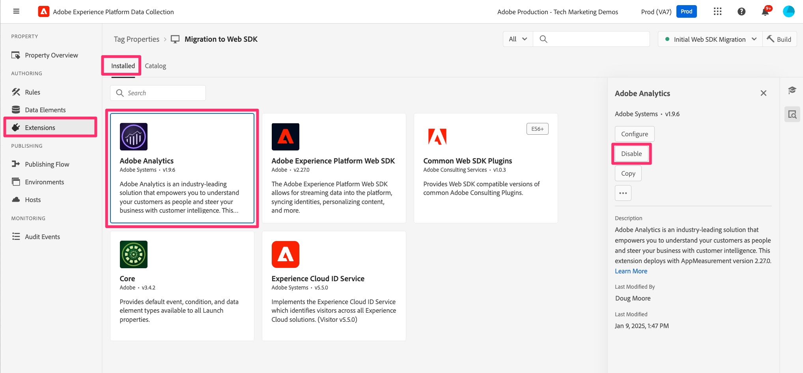

# Löschen der Adobe Analytics-Erweiterungselemente

Wenn der Debugging- und Validierungsvorgang abgeschlossen ist, entfernen Sie alle Verweise auf die Adobe Analytics-Erweiterungselemente und entfernen Sie die Erweiterung selbst.

## Übersicht

Sobald Sie sich vergewissert haben, dass alles in Ihrer Eigenschaft in die Web-SDK migriert wurde, und Sie das Debugging und die Validierung (in Ihrer Entwicklungsumgebung) abgeschlossen haben, können Sie die Verweise auf die Adobe Analytics-Erweiterung entfernen. Wie schnell Sie diese Elemente entfernen und wie oft Sie testen, während Sie dies tun, liegt an Ihnen. Wenn Sie mehr auf der Seite vorsichtig sein möchten, entfernen Sie Referenzen langsam und testen Sie zwischen den einzelnen Entfernungen. Wenn Sie sicher sind, dass alles ordnungsgemäß funktioniert und korrekt migriert wurde, können Sie das Pflaster „abreißen“ und alle Elemente entfernen. Wir würden natürlich trotzdem empfehlen, am Ende der Übung zu testen.

## Alte Aktionen aus Regeln entfernen

Nochmals, wir gehen davon aus, dass Sie bereits alles getestet haben und dass es korrekt funktioniert. An dieser Stelle können Sie Ihre Regeln einzeln aufrufen und die Aktionen entfernen, die zur Adobe Analytics-Erweiterung gehören.

1. Öffnen Sie eine Ihrer Regeln, z. B. Ihre standardmäßige Seitenladeregel.
1. Nach der Migration für diese Regel haben Sie wahrscheinlich vier (oder mehr) Aktionen.

   

1. Sie können sehen, dass die ersten beiden die Kennung &quot;Adobe Analytics&quot; tragen. Dies sind die Aktionen, die wir löschen möchten.
1. Bewegen Sie den Mauszeiger über die erste Aktion, z. B. &quot;Adobe Analytics - Variablen festlegen“, und es wird ein X angezeigt, das das Löschen ermöglicht. Klicken Sie auf das X, und die Aktion wird nicht mehr angezeigt. Entfernen Sie alle Adobe Analytics-Aktionen in der Regel, in diesem Fall die Aktion „Variable festlegen“ und die Aktion „Beacon senden“.
1. Dadurch bleiben nur die Web SDK-Aktionen

   

1. In Bibliothek speichern
1. Erstellen Sie die Bibliothek und testen Sie Ihre Site, um sicherzustellen, dass keine neuen Fehler auftreten und alles ordnungsgemäß funktioniert
1. Wiederholen Sie diese Aktion für Ihre anderen Regeln, indem Sie zwischen jeder Entfernung (oder so oft Sie sich wohl fühlen) eine Verbindung zur Entwicklungsbibliothek aufbauen und Tests durchführen. Sie können einfach im Debugger testen oder auch die Berichte in der Migrationsbericht-Suite überprüfen, wiederum abhängig von Ihrem Komfort-Level.

## Erweiterungen entfernen

Nachdem Sie die Verweise auf Ihre Adobe Analytics-Erweiterung entfernt haben, können Sie die Erweiterung sowie alle anderen Erweiterungen, die sie verwenden oder davon abhängig sind, entfernen (oder deaktivieren). Ich persönlich mag eine sorgfältige Herangehensweise, und so „deaktivieren“ ist meine Wahl, anstatt zu deinstallieren, zumindest anfänglich.

1. Wählen **Erweiterungen** in der linken Leiste der Benutzeroberfläche aus.
1. Stellen Sie sicher, dass **Registerkarte** Installiert“ ausgewählt ist.
1. Wählen Sie die Adobe Analytics-Erweiterung aus.
1. Wählen Sie in der rechten Leiste die Option zum Deaktivieren der Erweiterung aus (oder klicken Sie auf die drei Punkte und deinstallieren Sie sie, falls Sie es vorziehen).

   

1. Tun Sie dasselbe für die Experience Cloud-ID-Service-Erweiterung, da Sie diese nicht mehr benötigen. Die Web SDK-Erweiterung verarbeitet die ID, sodass Sie die zusätzliche Erweiterung nicht benötigen.
1. Tun Sie dasselbe für alle anderen Erweiterungen, die mit der Adobe Analytics-Erweiterung verknüpft sind, jedoch erst, nachdem Sie die erforderlichen Migrationsänderungen vorgenommen haben.
1. Erstellen Sie die Änderungen an Ihrer Entwicklungsumgebung.

