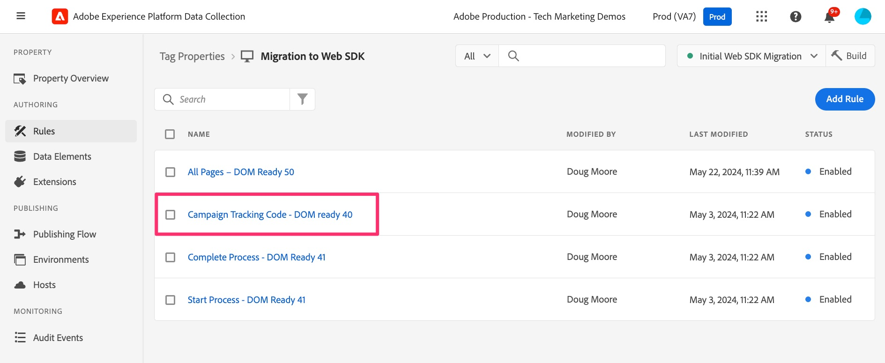
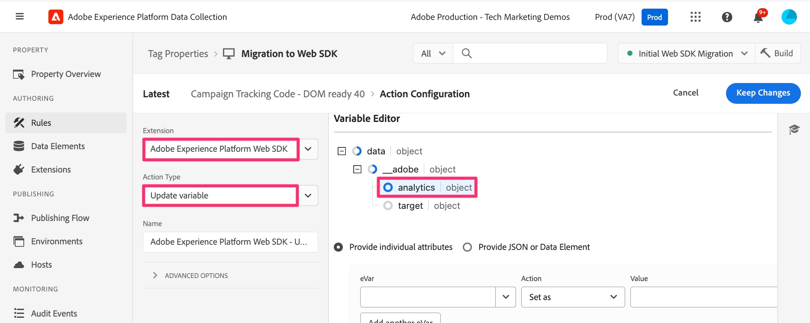

# Migrieren zusätzlicher Seitenregeln

In dieser Übung erfahren Sie, wie Sie zusätzliche seitenbasierte Regeln zur Web SDK-Erweiterung migrieren. Dies ähnelt der Übung, die Sie bereits beim Migrieren Ihrer standardmäßigen Seitenladeregel zu Web SDK durchgeführt haben. Die Methoden gelten weiterhin. Der größte Unterschied besteht darin, dass Sie mit diesen Regeln keine Aktion „Ereignis senden“ hinzufügen, da Ihre Regel in den meisten Fällen die Aktion „Beacon senden“ einer Analytics-Erweiterung nicht enthält.

## Übersicht

Sichern wir uns etwas und sprechen wir über Analytics-Implementierungen wie bei der Adobe Analytics-Tags-Erweiterung (auch als &quot;AppMeasurement&quot;-Implementierung bezeichnet, da dies der Name der JavaScript-Datei ist).

Ich gehe nicht davon aus, dass ich genau weiß, wie Sie implementiert sind, aber in vielen Implementierungen mit Experience Platform-Tags gibt es eine beliebige Anzahl von Regeln, die nur bedingt ausgelöst werden, basierend auf etwas auf der Seite oder in der URL. Beispiele hierfür sind:

* Suchergebnissregel, die nur ausgelöst wird, wenn eine interne Suche durchgeführt wurde und die Suchergebnisseite angezeigt wird
* Landingpage-Regel in Campaign, die nur ausgelöst wird, wenn die URL einen Trackingcode enthält
* Seitentyp-Regel, die nur für eine Seite ausgelöst wird, die zu einem bestimmten Seitentyp gehört, z. B. Produktdetailseite, Warenkorbseite usw.
* Jede andere Seite, die bedingt ausgelöst wird

Der wichtigste Punkt hierbei ist, dass alle diese Anwendungsfälle nur **manchmal** auf einer Seite ausgelöst werden, und wir würden **auch** erwarten, dass die Standardseitenregel ausgelöst wird. Daher möchten wir weder ein Send Beacon (AA-Erweiterung) noch ein Send Event (Web SDK-Erweiterung) mit einer dieser Regeln einbeziehen, da sonst zwei Treffer bei demselben Seitenladevorgang eintreten würden.

Daher bauen diese Regeln das Objekt auf, senden jedoch keine Daten ein. Wir müssen nur sicherstellen, dass diese Regeln **vor** die Standardseitenladeregel auslösen, sodass, nachdem sie das -Objekt aufgebaut haben, die Aktion Beacon senden/Ereignis senden in der Standardseitenladeregel alles sendet. Wahrscheinlich wissen Sie das alles, und so wird Ihre Site eingerichtet. Wenn Sie mit Ihrer eigenen Implementierung jedoch noch nicht vertraut sind oder Ihre Implementierung „reparieren“ müssen, um dieser Methode zu ähneln, ist diese Übung besonders hilfreich für Sie.

## Beispielmigration einer bedingten Regel

Im Folgenden finden Sie ein Beispiel für das Migrieren einer Regel, die bedingt ausgelöst wird. Ich werde das obige Beispiel einer Campaign-Landingpage verwenden. Wie bereits erwähnt, folgt dies dem gleichen Muster, mit dem wir bereits in unserer Standardseitenregel gearbeitet haben, mit dem Unterschied, dass es noch einfacher ist, weil wir nur Variablen festlegen und keine Treffer auslösen.

1. Suchen Sie die bedingte Regel. In diesem Beispiel suchen wir nach der Regel Kampagnen-Trackingcode und wählen sie aus.

   

1. Wenn die Regel geöffnet wird, können wir sehen, dass eine Bedingung in dieser Regel vorhanden ist, die auf der Grundlage eines Abfragezeichenfolgenparameters ausgelöst wird. Wir müssen nichts an der Bedingung ändern, da wir nur die Aktion aktualisieren/migrieren möchten, nicht das Ereignis oder die Bedingung.
1. Klicken Sie auf die Aktion **Adobe Analytics - Variable festlegen** .
1. Notieren Sie sich alles, was in der Aktion festgelegt wird. In diesem Beispiel sehen wir, dass **event101** festgelegt ist, ebenso wie die Variable **Campaign**.

   
   

1. Wir haben nur hier geklickt, um die Notiz zu machen, und wir müssen nichts ändern, also können wir jetzt einfach auf &quot;**&quot;**.
1. Erstellen Sie eine neue Aktion, indem Sie auf das **Pluszeichen** im Abschnitt Aktionen klicken

   

1. Konfigurieren der neuen Regel
   1. Wählen Sie **Adobe Experience Platform Web SDK** aus der Dropdown-Liste Erweiterung aus.
   1. Wählen **Variable aktualisieren** aus der Dropdown-Liste Aktionstyp aus.
   1. Wählen Sie im rechten Bedienfeld das **Analytics**-Objekt im Datenobjekt aus

      

1. Legen Sie jetzt event101 und die Kampagnenvariable auf dieselben Werte fest, die sie in der vorhandenen Aktion festgelegt wurden.

   
   

1. Jetzt können Sie **Änderungen beibehalten** und **In Bibliothek speichern** und Ihre Regel wurde zu Web SDK migriert.

>[!IMPORTANT]
>
>Wie bei der Standardregel zum Laden von Seiten haben wir die Aktion „Variable festlegen **der Analytics-Erweiterung in** Regel gelassen, damit wir Daten bei der Validierung unserer Migration vergleichen können. Vergessen Sie nicht, später erneut einzutreten und die Aktion der Analytics-Erweiterung zu entfernen, während Sie die endgültige Bereinigung durchführen.
