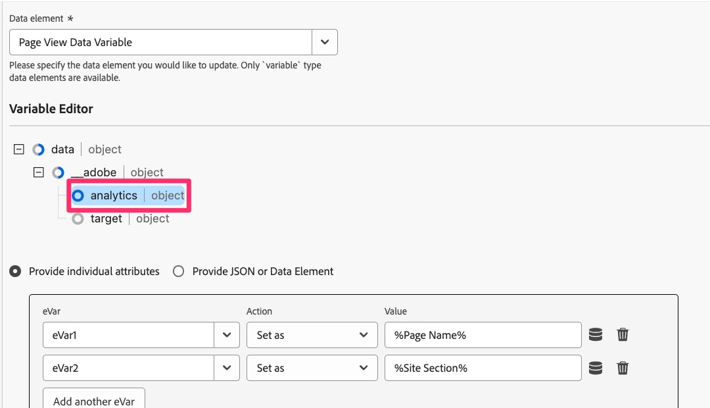

# Migrieren von benutzerdefiniertem Code in die Web-SDK

In dieser Übung erfahren Sie, wie Sie in Experience Platform Tags benutzerdefinierten Code von der Adobe Analytics-Erweiterung zur Adobe Experience Platform Web SDK-Erweiterung migrieren.

## Der große Haftungsausschluss

Sie werden sicher nicht überrascht sein, dass ich so etwas zu einem Dokument hinzufügen werde, das Ihnen den besten/einfachsten/effektivsten Weg für die Arbeit mit Code aufzeigt. Es gibt eindeutig viele verschiedene Möglichkeiten, wie Code geschrieben, bearbeitet und verarbeitet werden kann. In dieser Übung werde ich Ihnen eine Möglichkeit bieten, Code, den Sie in einer vorhandenen Regel haben, einfach zu nehmen, zu kopieren, eine Änderung hinzuzufügen und für die migrierte Regel verwenden zu lassen. Wenn Sie an eine bessere Möglichkeit denken, es zu tun, ist das fantastisch, und ich begrüße Sie nicht nur, es zu verwenden, sondern es mit uns und mit Ihren Kollegen in der Experience League-Community zu teilen (vor allem in der Community-Post zu diesem Tutorial). Dasselbe gilt für die untere Hälfte der Seite, wo Implementierungs-Plug-ins verwendet werden. Ich schlage einen Weg vor, und dann tust du, was dir gut tut. Ok, gehen wir ins Detail.

>[!IMPORTANT]
>
>Im Sinne des letzten Absatzes ist es auch wichtig, Ihnen zu empfehlen, diese Gelegenheit während Ihrer Migration zu Web SDK zu nutzen, um sich Ihren Code genau anzusehen und festzustellen, ob er aktualisiert oder sogar gelöscht werden sollte. In den folgenden Absätzen und Schritten erfahren Sie, wie Sie Ihren Code migrieren, und selbst wenn es einfacher ist, alles auf einen Schlag zu verschieben, würde ich es versäumen, sozusagen nicht zu empfehlen, eine Frühjahrsputz durchzuführen.

## Migration von welchem Code?

Der Code, den wir in diesem Abschnitt zuerst behandeln werden, ist der Code, den Sie möglicherweise im Fenster „Benutzerdefinierter Code“ in allen Adobe Analytics-Aktionen haben, einschließlich der Aktionen **Variable festlegen**. Mit anderen Worten, öffnen Sie eine Ihrer Regeln und schauen Sie im Abschnitt Aktionen nach unten. Wenn Sie die Aktion &quot;Adobe Analytics - Variablen festlegen“ haben, klicken Sie darauf, um sie zu öffnen.


Scrollen Sie dann nach unten auf der rechten Seite nach unten, und Sie sehen die Schaltfläche „Editor öffnen“ für das Fenster „Benutzerdefinierter Code“. Zum Öffnen klicken.


Wenn Sie Code darin haben, muss er migriert werden, damit er ausgeführt und mithilfe der Web-SDK an Adobe Analytics gesendet werden kann.
Der Grundgedanke hier ist, dass wir das Objekt „s“ in „content“ konvertieren.__adobe.analytics“.

Wir müssen lediglich vor dem ersten Aufruf des s-Objekts zusätzlichen Code hinzufügen, damit es von der Web-SDK verstanden und verarbeitet werden kann. Wir fügen den neu geänderten Code im Fenster Benutzerdefinierter Code der Aktion &quot;Adobe Experience Platform Web SDK - Variable aktualisieren“ hinzu.

Nehmen wir beispielsweise an, dass im Fenster „Benutzerdefinierter Code“ der folgende Codeblock vorhanden ist:

```javascript
const products = window.digitalData.products;
const productIndex = event.element.dataset.productIndex;
const product = products[productIndex];
s.products = [
product.cat3Tag,
product.id,
1,
product.price
].join(";");
```

Der Code, den Sie einbeziehen müssen, lautet wie folgt:

```javascript
content.__adobe = content.__adobe || {};
content.__adobe.analytics = content.__adobe.analytics || {};
const s = content.__adobe.analytics;
```

Führen Sie daher die folgenden Schritte aus, um den benutzerdefinierten Code zu migrieren:

1. Kopieren Sie Ihren benutzerdefinierten Code aus dem Fenster in der Adobe Analytics-Aktion „Variablen festlegen“
1. Schließen Sie dieses Code-Fenster und schließen Sie die Aktion (brechen Sie sie ab).
1. Öffnen Sie die Aktion Web SDK - Variable aktualisieren , indem Sie darauf klicken (oder, falls Sie noch keine haben, fügen Sie eine hinzu).

   

1. Wählen Sie oben im rechten Fenster das Analytics-Objekt aus

   

1. Scrollen Sie nach unten zum unteren Rand und öffnen Sie das Fenster Benutzerdefinierter Code .

   

1. Fügen Sie den Code ein, den Sie aus dem Fenster für den benutzerdefinierten Code von Analytics übernommen haben
1. Platzieren Sie nun die neuen Codezeilen in der Mitte des vorhandenen Codes, sodass sie sich über der ersten Erwähnung des s-Objekts befinden, wie im folgenden Beispiel gezeigt:


Sie können den Code jetzt im Fenster „Benutzerdefinierter Code“ speichern und die Änderungen in der Aktion „Variablen aktualisieren“ beibehalten. Sie sollten die Regel auch speichern und die neuen Änderungen in der Arbeitsbibliothek veröffentlichen.

## Was ist mit Plug-ins?

Wenn Sie eine „appMeasurement“-Implementierung von Adobe Analytics haben, die die Analytics-Erweiterung in Experience Platform-Tags (ehemals als „Launch“ bezeichnet) verwendet, verwenden Sie wahrscheinlich ein oder mehrere „Plug-ins“ von JavaScript, um Variablen festzulegen oder andere Aufgaben auszuführen. Wenn sich diese JavaScript-Funktionen und -Aufrufe in einem Codefenster innerhalb einer Regel befinden, helfen Ihnen die obigen Informationen auf dieser Seite bei der Migration des Codes zu Web SDK.
Es ist jedoch auch wahrscheinlicher, dass sich Ihr Plug-in-Code im Code-Fenster in der Konfiguration der Adobe Analytics-Erweiterung selbst befindet. Um zu überprüfen, ob Plug-ins und anderer Code migriert werden sollen, öffnen Sie die Analytics-Erweiterung, indem Sie zu Datenerfassung und Tags wechseln, Ihre Eigenschaft öffnen und dann im linken Navigationsbereich auf **Erweiterungen** klicken.

1. Klicken Sie **oben auf** Seite auf die Registerkarte „Installiert“ und wählen Sie dann Ihre Adobe Analytics-Erweiterung aus.
1. Klicken Sie dann rechts auf der Seite auf **Konfigurieren**

   

1. Erweitern Sie den Abschnitt **Tracker mit benutzerdefiniertem Code konfigurieren**
1. Klicken, um **Editor zu öffnen**

   

An dieser Stelle können Sie den Code sehen, den Sie darin haben, und Sie verfügen möglicherweise über „Plug-ins“ für JavaScript, d. h. Code-Snippets, mit denen Sie einige gewünschte Daten abrufen und sie benutzerdefinierten Dimensionen zuweisen können usw.

Nicht alles in diesem Code-Fenster kann als Plug-ins im wahrsten Sinne des Wortes Adobe Analytics betrachtet werden. Dies ist wichtig, um zu verstehen, wenn Sie entscheiden, wie Sie Ihren Code migrieren.

### Empfehlung für die Migration von Code aus dem Code-Hauptfenster der Erweiterung

Nun, noch einmal: Nicht alles im Code-Fenster könnte ein offizielles, von Adobe Consulting erstelltes Plug-in sein. Ein Teil davon könnte Code sein, den Sie geschrieben haben, egal ob Sie das Plug-in nennen oder nicht. Wir empfehlen zwei Änderungen. Sie sollen eine neue Erweiterung verwenden und auch den Rest Ihres Codes kopieren und an einer neuen Stelle einfügen.

**Zunächst** es eine Erweiterung in Tags namens „Common **Web SDK Plugins“**. Diese Erweiterung ist eine Teilmenge der Gesamtliste der Implementierungs-Plug-ins, die in der Dokumentation zu Adobe Analytics aufgeführt sind. Durch die Installation dieser Erweiterung in der Tags-Eigenschaft installieren Sie den Code für die enthaltenen Plug-ins. Um diese Plug-ins zu verwenden, finden Sie sie dann beim Erstellen neuer **Datenelemente**. Mehr dazu in einem Moment.

**Zweitens** gibt es ein Codefenster in der Konfiguration der Web SDK-Erweiterung, in dem Sie Ihren gesamten Code (oder einen Teil) einfügen können, WENN Sie möchten, dass dieser Code direkt vor dem Senden der Ereignisse an Adobe Analytics ausgeführt wird. Die Schritte zum Auffinden dieses Code-Fensters sind:

1. Wenn Sie die Web SDK-Erweiterung bereits zu Ihrer Eigenschaft hinzugefügt haben, navigieren Sie zu **Erweiterungen** und wählen Sie die Registerkarte **Installiert** aus
1. Wählen Sie die Erweiterung **Adobe Experience Platform Web SDK** aus und öffnen Sie sie, indem Sie in der rechten Leiste auf **Konfigurieren** klicken.

   

1. Scrollen Sie nach unten zum Abschnitt **Datenerfassung** und klicken Sie, um das Code-Fenster für **onBeforeEventSend** zu öffnen.

   

Hier fügen Sie den Code ein, den Sie ausführen möchten, direkt bevor das Ereignis von der Web-SDK an Analytics gesendet wird. Dies ist im Grunde das, was die doPlugins-Funktion in Ihrer alten Analytics-Implementierung getan hat.

Die **gute Nachricht** ist, dass dies **jederzeit) ausgeführt** ein Sendeereignis durchgeführt werden sollte. Ob dies also beim Laden der Seite oder mit einem benutzerdefinierten Link geschieht, sollte dieser Code ausgeführt werden, Ihre Variablen festlegen usw.

#### Muss ich meinen Code ändern?

Nun, ja und nein. Ja, Sie müssen einige kleine Dinge ändern, aber nein, Sie müssen den Großteil Ihres Codes nicht ändern, solange Sie diese kleinen Dinge ändern:

_**Code-Änderung 1:**_
Nachdem (oder vor Ihrer Wahl) Sie Ihren „Plug-in“-Code in das Code-Fenster in der Web SDK-Erweiterung eingefügt haben, **entfernen** die „doPlugin“-Zeilen aus Ihrem Code. Sie werden sie nicht benötigen und sie werden einen Fehler verursachen, da sie Teil von appMeasurement.js, aber nicht des Web-SDK-Codes sind.


_**Code-Änderung 2:**_
Die andere Änderung, die Sie vornehmen müssen, besteht darin, Code hinzuzufügen, sodass das Objekt „s“ definiert wird. Dies ähnelt dem, was oben bezüglich des Codes in Regelaktionen besprochen wurde. In diesem Fall müssen wir den Code nur ein wenig anders definieren, indem wir einen „Daten“-Knoten hinzufügen, der bereits in der Regelaktion, aber nicht hier definiert ist.
Diese Definition sollte am oberen Rand des Code-Fensters platziert werden. Der Code, der (beim Platzieren des Codes in die Web SDK-Erweiterung) kopiert werden muss, lautet wie folgt:

```javascript
content.data.__adobe = content.data.__adobe || {};
content.data.__adobe.analytics = content.data.__adobe.analytics || {};
const s = content.data.__adobe.analytics;
```

_**Mit beiden Code-Änderungen:**_
Hier ist der oben aufgeführte Code, aber mit beiden Änderungen haben wir gerade besprochen:


### Schritte zum Migrieren von Haupterweiterungs-Code zu Web SDK

Wie bereits erwähnt, wird eine zweifache Empfehlung empfohlen: die neue Common Web SDK Plugins-Erweiterung zu verwenden und den Code aus der Analytics-Erweiterungskonfiguration in die Web SDK-Erweiterungskonfiguration zu kopieren und einzufügen. Vor diesem Hintergrund werden neben dem wichtigen Hinweis oben auf der Seite zur Bereinigung Ihres Codes die folgenden Schritte auf allgemeiner Ebene empfohlen:

1. Kopieren Sie den gesamten Code aus dem Konfigurationscodefenster der Analytics-Erweiterung und fügen Sie ihn in das Fenster onBeforeEventSend in der Konfiguration der Web-SDK-Erweiterung ein. (Obwohl wir möglicherweise Code kopieren, der entfernt oder aktualisiert werden muss, führen wir im neuen Fenster einige Durchläufe am Code durch.)
1. Durchsuchen Sie jetzt Ihren Code in der Web SDK-Erweiterung und suchen Sie nach Aufrufen an Plug-ins oder Funktionsdefinitionen für Plug-ins, die in der **Common Web SDK Plugins**-Erweiterung definiert sind. Die Liste der Plug-ins finden Sie im Fenster Web-SDK-Datenelementdefinition , nachdem Sie die Plug-ins-Erweiterung installiert haben. Sie finden ihn auch in der [Dokumentation für diese Erweiterung](https://exchange.adobe.com/apps/ec/108520).
1. Entfernen Sie für jedes der Plug-ins, die Sie in der neuen Web SDK-Plug-ins-Erweiterung finden, die Erweiterung und den Aufruf daran aus Ihrem Code, und stellen Sie sicher, dass Sie diese Entfernung kompensieren, indem Sie ein Datenelement erstellen und dieses Datenelement dann in der entsprechenden Regel aufrufen, um Variablen festzulegen usw.
1. Führen Sie anschließend einen Durchlauf des Codes durch, um zu sehen, ob es Aufrufe an Funktionen gibt, die in der Datei „appMeasurement.js“ definiert wurden. **Code Change 1** oben ist ein Beispiel dafür, und Sie können diese Entfernung von doPlugins-Code zu diesem Zeitpunkt machen, wenn Sie es noch nicht getan haben. In anderen Instanzen wird dies am deutlichsten, wenn Sie eine Funktion aufrufen, die an keiner Stelle im Code definiert ist. Sie können sich auch an den Adobe-Kunden-Support oder Ihre Kollegen in der Experience League-Community wenden, um sicherzustellen, dass dies bei diesem Code der Fall ist.
1. Führen Sie als Nächstes einen Durchlauf durch Ihren Code durch, um alle alten Codes zu aktualisieren oder zu löschen, die nicht mehr für Ihre Analytics-Anforderungen gelten, wie oben auf dieser Seite empfohlen.
1. Fügen Sie nun **Code Change 2** oben aufgeführten zusätzlichen Zeilen hinzu, sodass alle Verweise auf das s-Objekt keine Fehler in Ihrem Code verursachen.
1. Und nicht zuletzt testen, testen, testen und testen Sie noch mehr. Führen Sie anschließend einen erneuten Test durch. Stellen Sie sicher, dass Ihr Code die Ergebnisse liefert, die Sie sowohl im Experience Platform-Debugger als auch in den Berichten in Adobe Analytics erwarten.

>[!NOTE]
>
>Zwei letzte Gedanken über die oben genannten Schritte.
>Zunächst denken Sie vielleicht, dass es einfacher wäre, den gesamten Plug-in-Code dort zu belassen, anstatt ihn zu entfernen und die neue Common Web SDK Plugins-Erweiterung zu verwenden. Dies ist richtig und schön, aber durch die Verwendung der Erweiterung erhalten Sie die Vorteile der Verwendung einer Benutzeroberfläche, der Definition eines wiederverwendbaren Datenelements und des automatischen Erhalts zukünftiger Code-Aktualisierungen. Es lohnt sich wahrscheinlich, den Wechsel zu machen.
>
>Zweitens: Apropos „Wechsel“: Sie können sich jetzt auch entscheiden, ALLE Ihre benutzerdefinierten Codes zu aktualisieren, damit sie überhaupt nicht auf das alte „s“-Objekt verweisen, was eine Art Erweiterung von Schritt 5 oben ist. Das ist natürlich völlig akzeptabel und eine großartige Idee. Dieses Migrations-Tutorial versucht nur, die Migration Ihres benutzerdefinierten Codes ein wenig zu vereinfachen, falls Sie eine Tonne davon haben und nicht die Ressourcen haben, um alles aktuell zu aktualisieren. Sie entscheiden.

Wir beenden diese Lektion so, wie wir sie begonnen haben, mit der Anerkennung, dass es viele Möglichkeiten gibt, Code zu schreiben, und dieses Dokument gibt Ihnen einige Schritte, die Sie befolgen sollten, wenn Sie es auf diese Weise tun möchten. Die Hauptsache ist, dass Ihr Code funktioniert und Ihnen die Ergebnisse liefert, die Sie erwarten. Sie können es also auf Ihre Weise tun, und habe ich erwähnt, dass Sie testen sollten?
