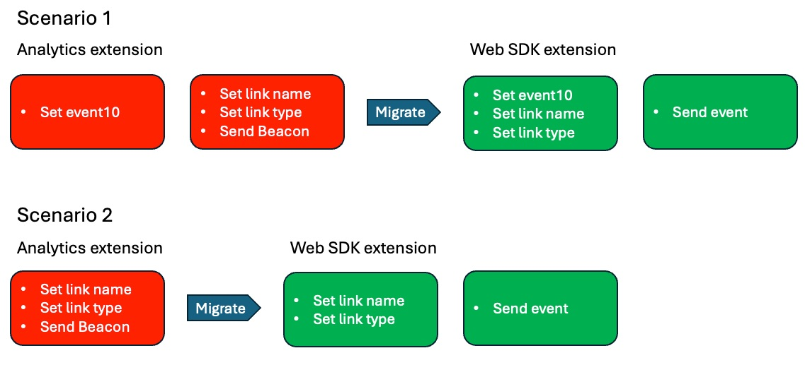
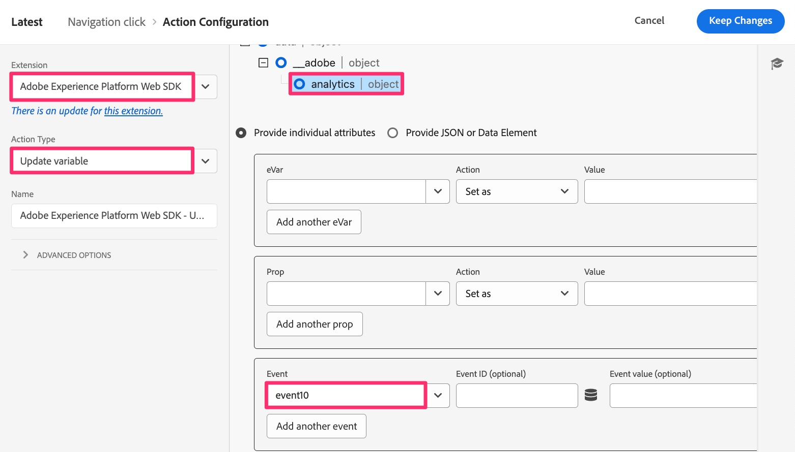

# Regeln für benutzerdefinierte Links migrieren

In dieser Übung erfahren Sie, wie Sie Regeln migrieren, die benutzerdefinierte Link-Treffer (im Gegensatz zu Seitenansichten) senden.

## Übersicht

Wenn Sie einen benutzerspezifischen Link-Treffer mit der Analytics-Erweiterung oder dem AppMeasurement-Code senden, wählen Sie bei der Konfiguration der Aktion **Beacon senden** auch aus, ob Sie einen Seitenansichtstreffer oder einen benutzerspezifischen Link-Treffer senden möchten. Bei Auswahl eines benutzerspezifischen Link-Treffers werden Sie nach dem **Link-Namen** und dem **Link-Typ** für diesen Treffer gefragt. Wenn Sie neben dem Link-Namen und -Typ keine anderen Variablendaten senden, benötigen Sie keine zusätzliche Aktion, die Variablen (Props, eVars und Ereignisse) festlegt.
Aus diesem Grund haben Sie beim Migrieren von Regeln, bei denen es sich um Regeln für benutzerdefinierte Links handelt&#x200B;**in den Regeln (eines** beiden) Szenarien:

1. Die bestehende Regel enthält die Aktion **Adobe Analytics - Variablen festlegen** mit der Props, eVars, Ereignisse usw. festgelegt werden und die dann die Aktion **Adobe Analytics - Beacon senden** enthält, die den Treffer auf einen benutzerdefinierten Link-Treffer (auch als s.tl()-Treffer bezeichnet) setzt, den Link-Namen und -Typ festlegt und die Daten sendet.
   1. In diesem Fall enthält sie wahrscheinlich auch eine letzte Aktion namens **Adobe Analytics - Variablen löschen**, um den Wert aus den Variablen zu „null“, nachdem die Daten an Adobe-Server gesendet wurden.
1. Die vorhandene Regel enthält nur die Aktion **Adobe Analytics - Beacon senden** , die den Treffer auf einen benutzerdefinierten Link-Treffer setzt, den Link-Namen und -Typ festlegt und die Daten sendet.

### Eine wichtige Änderung

Dies ist wichtig, wenn Sie Ihre Adobe Analytics-Implementierung zum Web-SDK migrieren:
Die Einstellung des Link-Namens und -Typs, die erforderlich ist, damit der Treffer ein benutzerdefinierter Link-Treffer ist, ist NICHT in der Aktion „Beacon-Äquivalent senden“ (Ereignis senden) enthalten. Stattdessen werden diese Einstellungen des Link-Namens und -Typs in der Aktion „Variablen-Äquivalent festlegen“ (Variable aktualisieren) verwendet.
Dies führt dazu, dass Sie unabhängig davon, ob Sie Szenario 1 oder Szenario 2 oben haben, sowohl eine Aktion Variable aktualisieren als auch eine Aktion Ereignis senden erhalten müssen.

Im Folgenden finden Sie eine visuelle Darstellung dieses Unterschieds bei Implementierungen.

## Migrationsschritte

Öffnen Sie die Regel für benutzerdefinierte Links und prüfen Sie, ob sie Szenario 1 oder Szenario 2 von oben ähnelt.
**Wenn Ihre Regel Szenario 1:** ähnelt

1. Öffnen Sie die Aktion Variablen festlegen und schreiben Sie alle Variablen (Props, eVars, Ereignisse usw.) auf, die in dieser Aktion festgelegt werden (z. B. wird in der Abbildung oben event10 festgelegt).
1. Öffnen Sie die Aktion Beacon senden und überprüfen Sie, ob sie auf den Versand eines s.tl()-Treffers eingestellt ist. Notieren Sie die Werte für Link-Typ und Link-Name.
1. Klicken Sie im Abschnitt Aktionen der Regel für benutzerdefinierte Links auf das Pluszeichen, um eine weitere Regel hinzuzufügen.

   

1. Konfigurieren der Aktion
   1. Legen Sie die **Erweiterung** auf Adobe Experience Platform Web SDK fest
   1. Legen Sie den **Aktionstyp) auf** Variable aktualisieren fest
   1. Wählen Sie das **Analytics**-Objekt aus
   1. Legen Sie Ihre Props, eVars und Ereignisse in der Aktion „Analytics-Variablen festlegen“ fest (in diesem Beispiel event10)

      

   1. Scrollen Sie in derselben Regel nach unten zum Dropdown-Feld **Zusätzliche Eigenschaft** und fügen Sie das Feld **Link-Name** hinzu, wobei Sie es auf den Wert setzen, den Sie aus Ihrer Regel Beacon senden abgerufen haben. In der Abbildung unten sehen Sie, wie das Beispiel den Namen auf den Zeichenfolgenwert „Menü-Klick“ festlegt.
   1. Fügen Sie außerdem das Feld **Link-Typ** aus derselben Dropdown-Liste hinzu und fügen Sie „o“ als Wert hinzu (vorausgesetzt, Ihr Link-Typ in der Aktion Beacon senden war „Benutzerdefinierter Link„). Dadurch wird der Link-Typ „Sonstige“ gesendet, der einem benutzerdefinierten Link entspricht. Wenn Ihr Link-Typ ein Download-Link war, wählen Sie „d“ für den Wert in diesem Feld vom Typ „Neuer Link“ und wenn Ihr Link-Typ ein Exitlink war, wählen Sie „e“ für den Wert in diesem Feld vom Typ „Neuer Link“.

      

1. Unter den zusätzlichen Eigenschaften wird ein Kontrollkästchen mit der Bezeichnung **Vorhandenen Wert löschen** angezeigt. Wenn Ihre bestehende Regel über eine Aktion **Adobe Analytics - Variablen löschen** verfügt (wie in Schritt 3 oben gezeigt), müssen Sie dieses Kontrollkästchen einfach aktivieren, und Sie müssen keine Aktion „Variablen löschen“ für die Web-SDK hinzufügen.

   

1. Fügen Sie eine weitere Aktion hinzu, indem Sie auf das Pluszeichen klicken.
1. Konfigurieren der Aktion „Ereignis senden“
   1. Legen Sie die **Erweiterung** auf Adobe Experience Platform Web SDK fest
   1. Legen Sie den **Aktionstyp“ auf** Ereignis „Gesendet“ fest.
   1. Klicken Sie auf das Datenelementsymbol und wählen Sie das Datenelement **Datenvariable der Seitenansicht** aus

   

1. **Änderungen beibehalten**, **In Bibliothek speichern** und Sie können die **von derselben Seite aus** erstellen), da wir bereits eine Arbeitsbibliothek festgelegt haben.

## Wichtige Schlussfolgerungen zur Migration ziehen

* In dieser Lektion haben Sie gelernt, wie Sie Regeln für benutzerdefinierte Links migrieren.
* In der Übung [Migrieren Ihrer standardmäßigen Seitenladeregel](migrate-your-default-page-load-rule.md) haben Sie gelernt, wie Sie Regeln migrieren, die sowohl Variablen festlegen als auch ein Analytics-Beacon senden.
* In der Lektion [Migrieren zusätzlicher Seitenregeln](migrate-additional-page-rules.md) haben Sie gelernt, wie Sie Ihre Regeln, die Variablen festlegen, aber kein Beacon nach Adobe Analytics senden, migrieren.

Wie Sie sich vorstellen können, können dieselben Methoden über viele verschiedene Regeln hinweg verwendet werden, um Ihre Analytics-Erweiterung zum Web SDK zu migrieren.
In den meisten Fällen werden die Aktionen **den Regeln** aktualisiert. Sie ändern weder das Ereignis noch die Bedingungen, unter denen es ausgelöst wird. Sie ändern nur, was im Aktionsabschnitt geschieht, wenn die Regeln ausgelöst werden.
Die meisten, wenn nicht sogar alle Regeln fallen in diese Kategorien. Wenn Sie eine Regel haben, die dies nicht tut, stellen Sie sich dasselbe Paradigma der Migration der Aktion vor und nicht, was die Regel ausgelöst hat.
