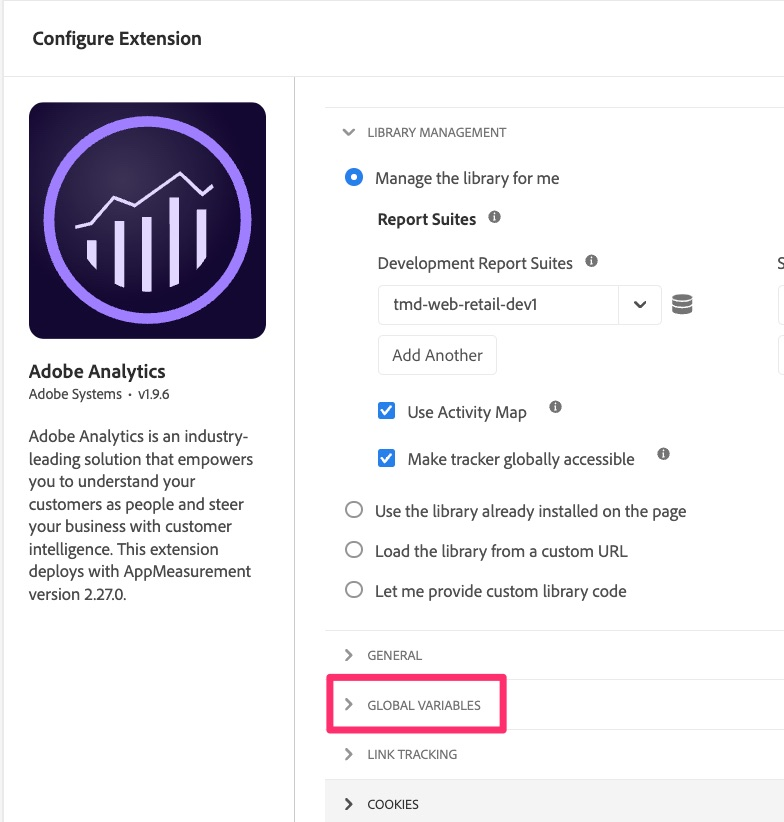
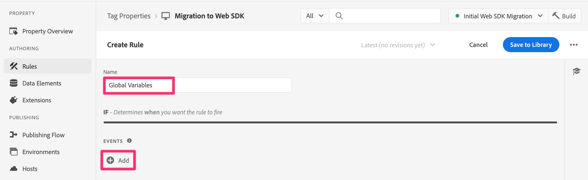

# Globale Variablen migrieren

In dieser Übung erfahren Sie, wie Sie globale Variablen von der Analytics-Erweiterungskonfiguration zu Web SDK migrieren.

## Überblick

In der Adobe Analytics-Erweiterung gibt es einen Konfigurationsabschnitt namens „Globale Variablen“.

Globale Variablen sind Variablen, die auf das Analytics-Tracking-Objekt festgelegt werden, wenn dieses Objekt auf der Seite initialisiert wird. Alle Variablen, die Sie hier festlegen, werden festgelegt, wenn das Tracking-Objekt auf jeder Seite erstellt wird.

Wenn hier Variablen festgelegt werden, müssen wir diese auch in die Web-SDK migrieren.

## Hinzufügen globaler Variablen in der Web-SDK

Der **Fazit** hier ist, dass es in der Konfiguration der Web-SDK-Erweiterung keinen entsprechenden Bereich gibt. Daher ist es nicht ganz so einfach, wie einfach die Variablen zu kopieren, wie wir es in der Übung „Standardseitenladeregel“ getan haben.
Stattdessen lautet die kurze Antwort: **Erstellen Sie eine neue Regel, die auf jeder Seite vor den anderen Regeln ausgeführt wird, und legen Sie die Variablen darin fest.**

Wenn Sie keine für Sie definierten Schritte benötigen, gehen Sie zu und Sie sind mit dieser Lektion fertig. Wenn Sie Hilfe benötigen, fahren Sie fort…

### Schritte zum Migrieren globaler Variablen zu Web SDK

1. Öffnen der Adobe Analytics-Erweiterungskonfiguration

   

1. Scrollen Sie nach unten zum Abschnitt Globale Variablen (Bild oben), öffnen Sie ihn und notieren Sie sich alle/n der festgelegten Variablen. Sie müssen diese Variablen und Werte in einem späteren Schritt kennen.
1. Kehren Sie von der Analytics-Erweiterung ab.
1. Wählen Sie **linken** „Regeln“ aus und klicken Sie auf **Regel hinzufügen**.
1. Benennen Sie Ihre neue Regel mit „Globale Variablen“.
1. Klicken Sie auf die Schaltfläche Hinzufügen unter Ereignisse .

   

1. Konfigurieren Sie das Ereignis so, dass es vor den anderen Regeln zum Trigger wird. Sie müssen den Ereignistyp und die Reihenfolge kennen, die Sie in anderen Regeln verwendet haben. Beispielwerte:
   1. Legen Sie **Erweiterung** auf „Core“ fest.
   1. **Ereignistyp** kann je nach Ihrer Implementierung DOM-fähig sein
   1. Erweitern Sie die **Erweiterte Optionen**
   1. Legen Sie **Reihenfolge** auf eine niedrigere Zahl als Ihre anderen Regeln fest, sodass sie zuerst ausgeführt werden.
      
      >[!NOTE]
      >
      >Wichtig dabei ist, dass diese Regel vor der Standardseitenladeregel ausgelöst wird, sodass alle in dieser Regel festgelegten Variablen über die sendEvent-Regel an Analytics gesendet werden können. Wir schlagen jedoch vor, dass diese Regel insgesamt **zuerst** ausgeführt wird, da die im Abschnitt Globale Variablen in der Analytics-Erweiterung festgelegten Variablen in anderen Regeln geändert werden können. Wir ahmen diese Funktionalität nach. Im obigen Beispiel gehen wir davon aus, dass „10“ eine niedrigere Ordnungszahl ist als jede andere Ihrer anderen Regeln. Wenn dies nicht korrekt ist, ändern Sie die Zahl in eine Zahl, die niedriger ist als Ihre anderen Regeln.
1. Wählen **Änderungen beibehalten**, um Ihre Arbeit zu speichern.
1. Sie müssen dieser Regel keine Bedingungen hinzufügen, sodass Sie diesen Abschnitt der Regelerstellung allein lassen können.
1. Klicken Sie auf das Pluszeichen unter **Aktionen** Abschnitt
1. Konfigurieren der neuen Aktion
   1. Wählen Sie die Adobe Experience Platform Web SDK **Erweiterung**
   1. Wählen **für „Aktionstyp** „Variable aktualisieren“
   1. Wählen Sie rechts Ihre Variable **Datenelement** (für dieses Tutorial hieß es „Seitenansichts-Datenelement“, aber Ihr Name kann variieren)
   1. Wählen Sie **Analytics** unter dem Datenobjekt aus.
   1. Füllen Sie die Variablen aus, die Sie im Abschnitt „Globale Variablen“ in der Konfiguration der Analytics-Erweiterung gespeichert haben (in diesem Tutorial wird beispielsweise eVar10 auf das Datenelement „Seitentyp“ gesetzt)

   

1. Änderungen beibehalten
1. Speichern der Regel in der Arbeitsbibliothek und Erstellen

Ihre globalen Variablen werden jetzt nach Web SDK migriert und beim Laden einer Seite ausgelöst.
