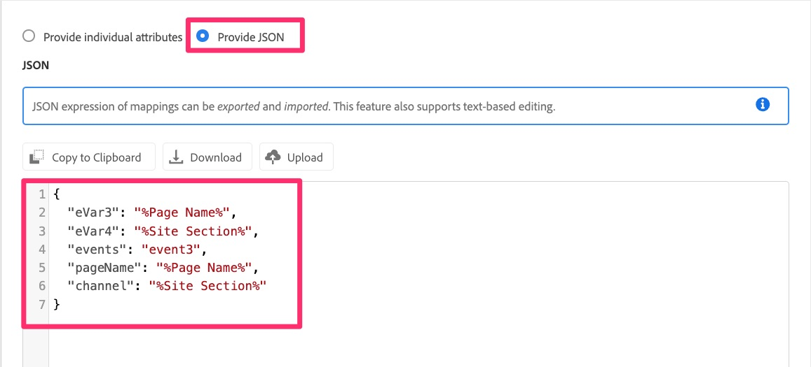
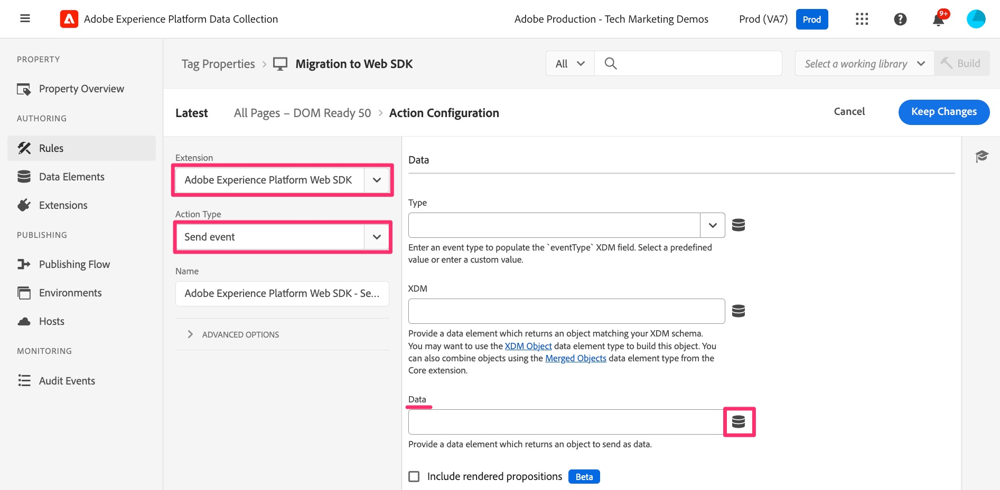

# Migrieren der standardmäßigen Seitenladeregel

In dieser Übung erfahren Sie, wie Sie eine standardmäßige Seitenladeregel in Adobe Experience Cloud Tags von der Analytics-Erweiterung zur Web SDK-Erweiterung migrieren.

## Übersicht

Lasst uns ein bisschen zurückgehen. Wahrscheinlich verwenden Sie eine Regel in Tags (früher als „Launch“ bezeichnet), die auf jeder Seite ausgelöst wird - eine Regel, die eine oder mehrere Standardvariablen festlegt und dann ein Beacon oder einen Treffer für Adobe Analytics auslöst. Diese Regel verwendet derzeit „Aktionen“ in der Adobe Analytics-Erweiterung, um diese Dinge zu tun. Wenn wir unsere Implementierung zu Web SDK migrieren, müssen wir in der Lage sein, alle Verweise (wie die Aktionen) auf die Analytics-Erweiterung zu entfernen und sie durch Aktionen zu ersetzen, die zu Web SDK gehören. In den folgenden Schritten gehen wir von den oben genannten Voraussetzungen aus, d. h. dass Sie eine standardmäßige Seitenladeregel haben, die sowohl Variablen festlegt als auch ein Tracking-Beacon an Analytics sendet.

## Migrieren der Aktion „Variablen festlegen“

In dieser Aktivität erstellen wir eine Web SDK-Aktion, die der Aktion &quot;**&quot; in** Adobe Analytics-Erweiterung entspricht.

1. Wechseln Sie in der Datenerfassungs-Benutzeroberfläche und in Ihrer Eigenschaft zum Bildschirm **[!UICONTROL Regeln]**, indem Sie ihn in der linken Navigationsleiste auswählen.
1. Wählen Sie die Regel aus, die Ihre **Analytics-Standardladeregel** ist. Wenn Sie nicht wissen, welche Regel Ihre Standardladeregel ist, sprechen Sie mit einer Person, die mit den Regeln und deren Inhalt vertraut ist. Auch hier suchen wir nach einer Regel, die auf jeder Seite ausgeführt wird, einige Standardvariablen festlegt (z. B. Seitenname) und dann ein Beacon an Analytics sendet. Wir werden diese Regel ändern. Meine heißt „All Pages - DOM Ready 50“, aber deine könnte alles heißen.

   

1. Um die aktuellen Aktionen von der Analytics-Erweiterung zur Web SDK-Erweiterung zu migrieren, müssen wir wissen, welche Variablen festgelegt werden. Klicken Sie daher auf die Aktion **Adobe Analytics - Variablen festlegen** , damit Sie sehen können, welche Variablen festgelegt werden (z. B. PageName, Props, eVars, Ereignisse usw.).

   
   1. Beachten Sie, welche Variablen in dieser Regel festgelegt werden
      

1. Ändern Sie oben auf der Seite das Optionsfeld in **JSON bereitstellen**. Daraufhin wird eine Code-Ansicht der festgelegten Variablen angezeigt. Diese Code- und die Benutzeroberflächenansicht sind austauschbar. Wenn Sie auf einer Benutzeroberfläche etwas festlegen, wird diese auch auf der anderen Benutzeroberfläche aktualisiert.

   

1. Kopieren Sie diese Daten in die Zwischenablage oder speichern Sie sie in einer Datei, die sofort verwendet werden soll, da Sie diesen Code in den nächsten Schritten in eine neue Web SDK-Aktion einfügen werden.
1. Brechen Sie die Aktion Analytics-Variablen festlegen ab, damit Sie wieder zur Regel gehören.

   >[!IMPORTANT]
   >
   >In diesem Schritt stehen Ihnen u. a. folgende Optionen zur Verfügung:
   >1. Anstatt eine neue Aktion hinzuzufügen, können Sie einfach die vorhandenen Aktionen ändern, die nach dem Speichern alle Daten sofort in die neue Web SDK Report Suite übertragen und nicht mehr in der aktuellen Analytics Report Suite angezeigt würden.
   >1. Sie können eine neue Aktion erstellen, um die Daten über die Web-SDK an Analytics zu senden, wobei die Analytics-Aktion vorerst an Ort und Stelle bleibt. Auf diese Weise können Sie die Daten in der neuen Web SDK Report Suite mit der aktuellen Analytics Report Suite vergleichen. **Dies ist der Schritt, den wir in diesem Tutorial durchführen werden.** Beachten Sie, dass diese Methode beim Vergleich der Daten zu doppelten Treffern führt, was ebenfalls Kosten für die zusätzlichen Server-Aufrufe verursacht, bis Sie die Aktionen der alten Analytics-Erweiterung entfernen. Es liegt auf der Hand, dass Sie die Aktionen der Analytics-Erweiterung nicht für immer darin behalten möchten, sondern nur lange genug, um zu überprüfen, ob die Daten ordnungsgemäß in die Report Suite der neuen Web SDK-Erweiterung fließen.

1. Klicken Sie auf **Plus-Schaltfläche**, um eine neue Web SDK-Aktion hinzuzufügen.

   

1. Wählen Sie **Adobe Experience Platform Web SDK** aus der Dropdown-Liste Erweiterung aus.
1. Wählen **Variable aktualisieren** aus der Dropdown-Liste Aktionstyp aus.
1. Wählen Sie im rechten Bedienfeld das **Analytics**-Objekt im Datenobjekt aus
1. Stellen Sie außerdem sicher, dass das oben im rechten Bedienfeld aufgeführte Datenelement tatsächlich Ihr neues Datenelement vom Variablentyp ist.

   

1. Ändern Sie jetzt das Optionsfeld in **JSON oder Datenelement bereitstellen** und fügen Sie den Code, den Sie im vorherigen Schritt aus „Variablen festlegen“ kopiert haben, in dieses Code-Fenster ein. Denken Sie daran, dass das, was wir hier im Tutorial zeigen, nur Beispiele sind. Sie kopieren und fügen Ihre eigenen Variablen ein.

   
Dieses JSON Copy-Tool wurde speziell entwickelt, um die Migration zu vereinfachen. Ich bin sicher, Sie können sehen, wie einfach dies ist, anstatt ausführliche Notizen von der alten Aktion machen und sie auf die neue Aktion anwenden zu müssen.

1. Sie können die Optionsschaltfläche jederzeit vor- und zurückschalten, um die Werte entweder in der Code-Version (siehe oben) oder in der Benutzeroberflächenversion anzuzeigen. Wählen Sie das Optionsfeld **Individuelle Attribute angeben** aus, um die ausgefüllten Attribute anzuzeigen.

   
   

1. Wenn Ihre Variablen korrekt eingestellt sind, klicken Sie auf **Änderungen beibehalten/Speichern.**

## Migrieren der Aktion Beacon senden

In dieser Aktivität erstellen wir eine Web SDK-Entsprechung der Analytics-Aktion „Beacon senden“ namens &quot;**&quot;**.

1. Gehen Sie zurück zu Ihrer Standardseitenregel, der Sie gerade beigetreten sind.
1. Klicken Sie im Abschnitt Aktionen auf die Schaltfläche **Plus**, um eine weitere Aktion hinzuzufügen. Dies ist unsere Aktion **Ereignis senden**.

   

1. Um die Aktion zu konfigurieren, wählen Sie **Adobe Experience Platform Web SDK** aus der Dropdown-Liste Erweiterung aus.
1. Wählen Sie **Aktionstyp** Ereignis senden“ aus.
1. Klicken Sie im rechten Bedienfeld auf das Datenelementsymbol neben dem **Daten** Objekt.

   

1. Wählen Sie die Datenvariable der Seitenansicht (oder das Datenelement des neuen Typs „Daten„) aus und klicken Sie auf die Schaltfläche **Auswählen**.

   

1. Klicken Sie **Änderungen beibehalten/Speichern**.
1. Sie sollten nun alle vier Aktionen (zwei alte und zwei neue) in Ihrer Regel sehen

   

## Sollte ich die Aktionen der Analytics-Erweiterung löschen?

Gute Frage. Die Antwort liegt darin, ob Sie Ihre neuen Aktionen validieren möchten, bevor Sie die alten loswerden. Wie bereits erwähnt, werden dieselben Daten in zwei Report Suites (nämlich die Produktions-Report Suite aus der Analytics-Erweiterung und Ihre neue Validierungs-Report Suite aus der Web SDK-Erweiterung) aufgenommen, wenn Sie sowohl Analytics- als auch Web SDK-Aktionen, die Daten senden (Beacon senden und Ereignis senden), wie in diesem Tutorial geschehen lassen. Dies führt zu einer Verdoppelung Ihrer Server-Aufrufe in Analytics und ist mit Kosten verbunden. Dies ist jedoch die Art und Weise, in der viele Kunden dies tun, damit sie die neuen Daten validieren können, bevor sie die alten Daten deaktivieren. Am Ende dieses Tutorials sehen wir eine Übung, die zeigt, wie die alten Dinge bereinigt werden, sobald Sie mit der Validierung zufrieden sind. Wenn Sie dies jedoch jetzt tun möchten, um Server-Aufrufe zu speichern und sich keine Sorgen um die Validierung zu machen, können Sie zum Ende des Tutorials springen oder einfach die Aktionen der Analytics-Erweiterung aus den Regeln löschen, während Sie fortfahren.
