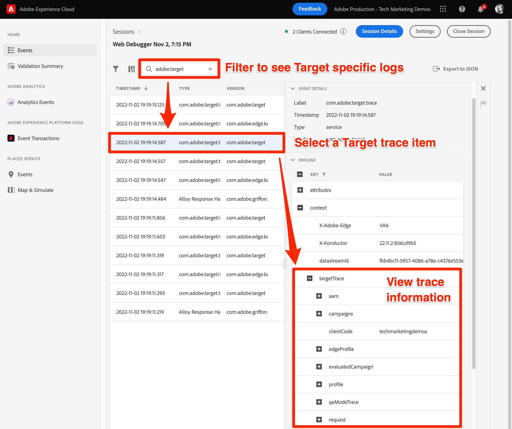

# Target mit dem Platform Web SDK debuggen

Überprüfung von Target-Aktivitäten und Debugging des Web SDK zur Fehlerbehebung bei Implementierungs-, Inhaltsbereitstellungs- oder Zielgruppenqualifizierungsproblemen. Auf dieser Seite des Migrationshandbuchs werden die Unterschiede zwischen dem Debugging mit at.js und dem Platform Web SDK erläutert.

Die nachstehende Tabelle fasst Funktionen und Unterstützung für Test- und Debugging-Ansätze zusammen.

| Funktion oder Tool | Unterstützung von &quot;at.js&quot; | Unterstützung für Platform Web SDK |
| --- | --- | --- |
| Aktivitäts-QA-URLs | Ja | Ja |
| `mboxDisable` URL-Parameter | Ja | Weitere Informationen finden Sie unter [Deaktivieren der Target-Funktion](#disable-target-functionality) . |
| `mboxDebug` URL-Parameter | Ja | Verwenden Sie den Parameter `alloy_debug` für ähnliche Debugging-Informationen |
| `mboxTrace` URL-Parameter | Ja | Verwenden der Browsererweiterung Experience Platform Debugger |
| Adobe Experience Platform Debugger-Erweiterung | Ja | Ja |
| `alloy_debug` URL-Parameter | Nicht zutreffend | Ja |
| Adobe Experience Platform Assurance | Nicht zutreffend | Ja |

## Adobe Experience Platform Debugger-Browsererweiterung

Die Adobe Experience Platform Debugger-Erweiterung für Chrome und Firefox überprüft Ihre Webseiten und unterstützt Sie bei der Validierung Ihrer Adobe Experience Cloud-Implementierungen.

Sie können Platform Debugger auf jeder Webseite ausführen und die Erweiterung hat Zugriff auf öffentliche Daten. Um mit der Erweiterung auf nicht öffentliche Daten zuzugreifen, wie z. B. Target-Trace-Informationen, müssen Sie sich über den Link **[!UICONTROL Anmelden]** beim Experience Cloud authentifizieren.

### Abrufen und Installieren des Adobe Experience Platform Debuggers

Der Adobe Experience Platform Debugger kann in Google Chrome- oder Mozilla Firefox-Browsern installiert werden. Folgen Sie dem folgenden Link, um die Erweiterung in Ihrem bevorzugten Browser zu installieren:

- [Chrome](https://chrome.google.com/webstore/detail/adobe-experience-platform/bfnnokhpnncpkdmbokanobigaccjkpob)
- [Firefox](https://addons.mozilla.org/de/firefox/addon/adobe-experience-platform-dbg/)

Nach der Installation der Chrome-Erweiterung oder des Firefox-Add-ons wird der Erweiterungsleiste ein Symbol () hinzugefügt. Wählen Sie dieses Symbol aus, um die Erweiterung zu öffnen.

Weitere Informationen zur [Adobe Experience Platform Debugger-Erweiterung](https://experienceleague.adobe.com/docs/experience-platform/debugger/home.html) und zum Debugging aller Adobe-Webanwendungen finden Sie im entsprechenden Handbuch.

## Vorschau von Target-Aktivitäten mit QA-URLs

Sowohl at.js als auch Platform Web SDK ermöglichen es Ihnen, Target-Aktivitäten mithilfe von Target-QA-URLs in der Vorschau anzuzeigen. Beide Implementierungsmethoden unterstützen dieselben QA-Funktionen.

Target-QA-URLs funktionieren, indem at.js oder Platform Web SDK angewiesen werden, ein bestimmtes Cookie in Ihren Browser namens `at_qa_mode` zu schreiben. Dieses Cookie wird verwendet, um die Qualifizierung für eine bestimmte Aktivität und ein bestimmtes Erlebnis zu erzwingen.

>[!CAUTION]
>
>Die Funktionalität des Target-QA-Modus wird von der Platform Web SDK-Version 2.13.0 oder höher unterstützt. Der Target QA-Modus wird basierend auf dem `xdm.web.webPageDetails.URL` -Wert aktiviert, der im `sendEvent` -Aufruf übergeben wird. Änderungen an diesem Wert, z. B. Kleinbuchstaben für alle Zeichen, können verhindern, dass der Target-QA-Modus ordnungsgemäß funktioniert.

Weitere Informationen zur Qualitätssicherung von Target-Aktivitäten](https://experienceleague.adobe.com/docs/target/using/activities/activity-qa/activity-qa.html) finden Sie im entsprechenden Handbuch.[

## Target-Implementierung debuggen

In der folgenden Tabelle werden die Unterschiede zwischen der Debugging-Taktik von at.js und Platform Web SDK erläutert:

| &quot;at.js&quot;-Funktion | Platform Web SDK-Entsprechung |
| --- | --- |
| **Mbox Deaktivieren** - Deaktivieren Sie Target vom Abrufen und Rendern, um zu überprüfen, ob die Seite ohne Target-Interaktionen beschädigt ist.  Seite mit URL-Parameter laden: `mboxDisable=true` | Keine direkte Entsprechung. Sie können alle Platform Web SDK-Anforderungen mit den Entwicklertools Ihres Browsers blockieren. |
| **Mbox Debug** - Protokolliert jede at.js-Aktion in der Browser-Konsole, um Probleme beim Rendern zu beheben.  Seite mit URL-Parameter laden: `mboxDebug=true` | **Alloy Debug** - protokolliert detaillierte Aktionen des SDK, einschließlich, aber nicht beschränkt auf Target-Personalisierungsaktionen.   Seite mit URL-Parameter laden: `alloy_debug=true`   Oder führen Sie `alloy("setDebug", { "enabled": true });` in Ihrer Entwicklerkonsole aus |
| **Target Trace** - Mit einem in der Target-Benutzeroberfläche generierten Mbox-Trace-Token ist ein Trace-Objekt mit Details, die am Entscheidungsprozess teilgenommen haben, unter dem Objekt `window.___target_trace` verfügbar.  Seite mit URL-Parameter laden: `mboxTrace=window&authorization={TOKEN}` | Verwenden Sie die Adobe Experience Platform Debugger-Erweiterung oder Platform Assurance. |

>[!NOTE]
>
>Alle oben aufgeführten at.js-Debugging-Funktionen sind mit erweiterten Funktionen in Adobe Experience Platform Debugger verfügbar.

### Funktion &quot;Target deaktivieren&quot;

Das Platform Web SDK verfügt derzeit nicht über eine Funktion, um Target-Antworten selektiv zu unterdrücken. Es ist jedoch möglich, die Platform Web SDK-Anforderungen mit den Entwicklertools Ihres Browsers, verschiedenen Browsererweiterungen oder Drittanbieteranwendungen zu unterdrücken. So blockieren Sie beispielsweise das Platform Web SDK mit Google Chrome:

1. Klicken Sie mit der rechten Maustaste auf eine beliebige Stelle auf der Seite und wählen Sie **Inspect** aus
1. Wählen Sie die Registerkarte **Netzwerk** aus.
1. Filtern nach der Zeichenfolge `//ee//`, um nur Platform Web SDK-Aufrufe anzuzeigen
1. Seite neu laden
1. Klicken Sie mit der rechten Maustaste auf eine der gefilterten Netzwerkanforderungen und wählen Sie **Anforderungsdomäne blockieren**
1. Laden Sie die Seite neu und beachten Sie, dass die Netzwerkanforderung blockiert ist.
1. Wenn Sie das Debugging abgeschlossen haben, klicken Sie mit der rechten Maustaste auf die blockierte Netzwerkanforderung und wählen Sie **Entsperren** oder schließen Sie das Bedienfeld für Entwicklertools .

### Debug-Protokollierung anzeigen

Die Debug-Protokollierung für at.js mithilfe des URL-Parameters `mboxDebug=true` zeigt detaillierte Informationen zu jeder Target-Anfrage, -Antwort und dem Versuch, den Inhalt auf der Seite wiederzugeben. Das Platform Web SDK weist eine ähnliche Debug-Protokollierung mithilfe des URL-Parameters `alloy_debug=true` auf.

| Protokollierte Informationen | at.js (`mboxDebug=true`) | Platform Web SDK (`alloy_debug=true`) |
| --- | --- | --- |
| Protokollierpräfix für Filter | `AT:` | `[alloy]` |
| Details zur Seitenladeanforderung | Ja | Ja |
| Details zu Mbox- oder Scope-Anfragen | Ja | Ja |
| Status der Anfrage | Ja | Ja |
| Reaktionsdetails | Ja | Ja |
| Rendering-Status | Erfolg und Fehler | Nur Fehler |
| Renderdetails | Ja | Ja |

>[!NOTE]
>
>Debug-Protokolle für at.js und Platform Web SDK bieten eine ähnliche Detailebene mit der wichtigen Ausnahme, dass das Web SDK nur über Rendering-Fehler aufgrund ungültiger Selektoren benachrichtigt. Die Debug-Protokollierung bestätigt derzeit nicht, dass das Rendering erfolgreich war.

### Target-Traces anzeigen

Target-Traces enthalten detaillierte Informationen zu Aktivitätsqualifikationen und zum Target-Profil des Besuchers. Da Target-Traces Informationen enthalten, die nicht öffentlich verfügbar sind, ist für die Anzeige dieser Informationen ein Autorisierungstoken oder eine Authentifizierung im Adobe Experience Platform Debugger-Browsererweiterungsfenster erforderlich.

| Target-Trace-Methode | at.js | Platform Web-SDK |
| --- | --- | --- |
| `mboxTrace` URL-Parameter | Ja | Nein |
| Adobe Experience Platform Debugger-Browsererweiterung | Ja | Ja |
| Adobe Experience Platform Assurance | Nein | Ja |

Gehen Sie wie folgt vor, um Platform Web SDK Target-Traces mit dem Adobe Experience Platform Debugger anzuzeigen:

1. Navigieren Sie zu einer Seite Ihrer Site, auf der Target mit dem Platform Web SDK implementiert ist.
1. Öffnen Sie die Adobe Experience Platform Debugger-Erweiterung, indem Sie in der Navigationsleiste des Browsers das Symbol () auswählen.
1. Wählen Sie den Link **[!UICONTROL Anmelden]** aus
1. Authentifizierung mit Ihrer Adobe Experience Cloud-Anmeldung
1. Wählen Sie links die Registerkarte **[!UICONTROL Protokolle]** aus.
1. Wählen Sie oben die Registerkarte **[!UICONTROL Edge]** aus.
1. Benennen Sie optional Ihre Debugging-Sitzung und klicken Sie auf die Schaltfläche **[!UICONTROL Verbinden]** .
1. Laden Sie die Seite neu, und das Protokoll sollte mit detaillierten Informationen zu den Interaktionen im Edge-Netzwerk gefüllt werden.
1. Konzentrieren Sie sich auf die Protokolleinträge, die in der Beschreibung mit &quot;Target Traces&quot;beginnen, und wählen Sie **[!UICONTROL Ansicht]** aus, um die Target-Trace-Details anzuzeigen.

{zoomable="yes"}

Nach Auswahl von **[!UICONTROL Ansicht]** wird eine Überlagerung angezeigt, über die Sie die folgenden Informationen zur Anforderung sehen können:

- Abgeschlossene Aktivitäten
- Nicht übereinstimmende Aktivitäten
- Anfragedetails
- Profil-Snapshot

Weitere Informationen zu Target-Traces finden Sie im entsprechenden Handbuch zum [Debugging der Target-Inhaltsbereitstellung](https://experienceleague.adobe.com/docs/target/using/activities/troubleshoot-activities/content-trouble.html) .

### Fehlerbehebung bei der Zuverlässigkeitsprüfung

Target-Trace-Informationen sind sowohl in der Adobe Experience Platform Debugger-Browsererweiterung als auch in der Assurance-Anwendung (ehemals &quot;Project Griffon&quot;) sichtbar. Gehen Sie wie folgt vor, um Target-Traces innerhalb von Assurance anzuzeigen:

1. Öffnen Sie die Adobe Experience Platform Debugger-Browsererweiterung und verbinden Sie wie oben beschrieben eine Remote-Debugging-Sitzung.
1. Wählen Sie den Link mit Ihrem Sitzungsnamen über dem Debugging-Protokoll aus.
1. Platform Assurance lädt und zeigt eine detaillierte Protokollierung für alle Adobe-Anwendungen an, die im Datenstrom für Ihre Implementierung konfiguriert sind
1. Filtern des Protokolls nach `adobe.target`
1. Wählen Sie einen Protokolleintrag mit dem Typ `com.adobe.target.trace` aus.
1. Erweitern Sie die Details der Payload und zeigen Sie die Informationen unter `context > targetTrace` an.

{zoomable="yes"}

## Netzwerkanforderung und -antwort untersuchen

Die Anfrage-Payload und die Antwort der Platform Web SDK `sendEvent` -Aufrufe unterscheiden sich von at.js. Der nachstehende Entwurf soll Ihnen dabei helfen, die Struktur der Anfrage und Antwort zu verstehen, während Sie die Netzwerkaufrufe mit den Entwicklertools Ihres Browsers untersuchen.

### Payload der Inhaltsanforderung

{zoomable="yes"}

- Profil-, Entitäts- und andere Nicht-Mbox-Parameter werden im Ereignis-Array unter `data.__adobe.target` übergeben
- Entscheidungsbereiche befinden sich im Ereignisarray unter `query.personalization.decisionScopes`
- XDM-Daten, die nachgelagerten Mbox-Parametern zugeordnet werden, befinden sich im Ereignis-Array unter `xdm`

### Inhalts-Antworttext

{zoomable="yes"}

- Das Platform Web SDK gibt Aktionen für alle Adobe-Anwendungen unter dem Objekt `handle` zurück
- Die Aktion `personalization:decisions` steht für eine Antwort von Target oder offer decisioning
- Zielvorschläge werden als Array dargestellt, wobei jeder eine eindeutige Vorschlagskennung mit dem Präfix `AT:` vorangestellt wird.
- Entscheidungsbereich und Aktivitätsdetails befinden sich im Vorschlagsbereich.
- Angebotsdetails befinden sich im Array `items` unter `data` .
- Antwort-Token befinden sich im Array `items` unter `meta` .

### Payload des Vorschlags-Ereignisses

Beispiel für ein Target-Vorschlagsereignis ](assets/target-proposition-event.png){zoomable="yes"}![

- Target-spezifische SDK-Ereignisse sind entweder `decisioning.propositionDisplay` für eine Impression oder `decisioning.propositionInteract` für eine Interaktion, z. B. ein Klick
- Die Details des Vorschlags-Ereignisses befinden sich im Ereignis-Array unter `xdm._experience.decisioning`
- Die Vorschlagskennung des Anzeige- oder Interaktionsereignisses sollte mit der Vorschlagskennung des Inhalts übereinstimmen, die von Target zurückgegeben wird

Herzlichen Glückwunsch! Sie haben das Ende des Tutorials erreicht! Viel Glück bei der Migration Ihrer Adobe Target-Implementierung auf das Web SDK!

>[!NOTE]
>
>Wir unterstützen Sie bei der erfolgreichen Target-Migration von at.js zum Web SDK. Wenn Sie bei Ihrer Migration auf Probleme stoßen oder der Eindruck haben, dass wichtige Informationen in diesem Handbuch fehlen, teilen Sie uns dies mit, indem Sie in [dieser Community-Diskussion](https://experienceleaguecommunities.adobe.com/t5/adobe-experience-platform-data/tutorial-discussion-migrate-target-from-at-js-to-web-sdk/m-p/575587#M463) posten.
