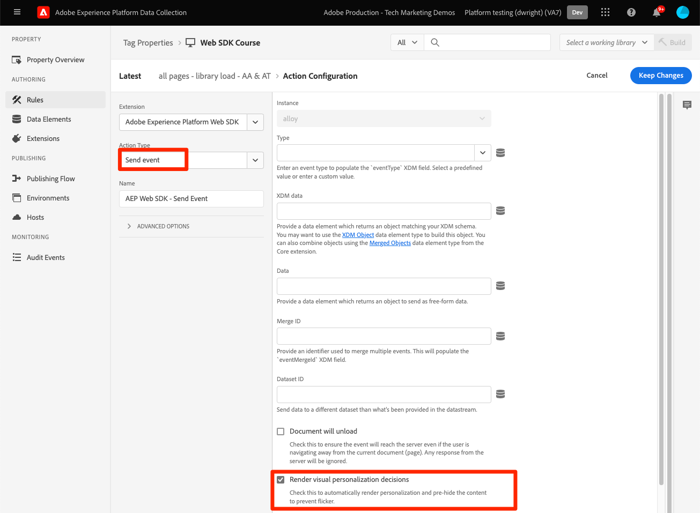

# Rendern von Adobe Target Visual Experience Composer (VEC)-Aktivitäten

Target-Aktivitäten werden entweder mit dem Visual Experience Composer (VEC) oder dem formularbasierten Composer eingerichtet. Die Platform Web SDK kann VEC-basierte Aktivitäten wie at.js abrufen und auf die Seite anwenden. Für diesen Teil der Migration werden Sie:

* Installieren der Browser-Erweiterung Visual Editing Helper
* Führen Sie einen `sendEvent`-Aufruf mit der Platform Web SDK aus, um Aktivitäten anzufordern.
* Aktualisieren Sie alle Verweise aus Ihrer at.js-Implementierung, die `getOffers()` zum Ausführen einer Target `pageLoad`-Anfrage verwenden.

## Browser-Erweiterung Visual Editing Helper

Mit der Browser-Erweiterung Visual Editing Helper von Adobe Experience Cloud für Google Chrome können Sie Websites zuverlässig innerhalb des Adobe Target Visual Experience Composer (VEC) laden, um Web-Erlebnisse schnell zu erstellen und zu prüfen.

Die Browser-Erweiterung Visual Editing Helper kann für Websites verwendet werden, die at.js oder Platform Web SDK verwenden.

### Abrufen und Installieren des Visual Editing Helper

1. Navigieren Sie zur Browser-Erweiterung [Adobe Experience Cloud Visual Editing Helper im Chrome Web Store](https://chrome.google.com/webstore/detail/adobe-experience-cloud-vi/kgmjjkfjacffaebgpkpcllakjifppnca).
1. Klicken Sie auf Zu **Chrome hinzufügen** > **Erweiterung hinzufügen**.
1. Öffnen Sie den VEC in Target.
1. Um die Erweiterung zu verwenden, klicken Sie auf das Symbol der Browser-Erweiterung Visual Editing Helper {zoomable="yes"} in der Symbolleiste Ihres Chrome-Browsers, während Sie sich im VEC- oder QA-Modus befinden.

Die Visual Editing Helper wird automatisch aktiviert, wenn eine Website im VEC von Target geöffnet wird, um die Inhaltserstellung zu unterstützen. Die Erweiterung verfügt über keine bedingten Einstellungen. Die Erweiterung verarbeitet alle Einstellungen automatisch, einschließlich der SameSite-Cookie-Einstellungen.

Weitere Informationen zur Erweiterung „Visual Editing Helper[&#x200B; und zur Fehlerbehebung Visual Experience &#x200B;](https://experienceleague.adobe.com/docs/target/using/experiences/vec/troubleshoot-composer/visual-editing-helper-extension.html?lang=de) finden Sie in [&#x200B; entsprechenden Dokumentation &#x200B;](https://experienceleague.adobe.com/docs/target/using/experiences/vec/troubleshoot-composer/troubleshoot-composer.html?lang=de).

>[!IMPORTANT]
>
>Die neue [Visual Editing Helper](https://chrome.google.com/webstore/detail/adobe-experience-cloud-vi/kgmjjkfjacffaebgpkpcllakjifppnca)-Erweiterung ersetzt die vorherige [Target VEC Helper-Browser-Erweiterung](https://experienceleague.adobe.com/docs/target/using/experiences/vec/troubleshoot-composer/vec-helper-browser-extension.html?lang=de). Wenn die ältere VEC Helper-Erweiterung installiert ist, sollte sie entfernt oder deaktiviert werden, bevor die Visual Editing Helper-Erweiterung verwendet wird.

## Inhalt automatisch anfordern und anwenden

Nachdem Platform Web SDK auf der Seite konfiguriert wurde, können Sie Inhalte von Target anfordern. Im Gegensatz zu at.js, das so konfiguriert werden kann, dass beim Laden der Bibliothek automatisch Inhalte angefordert werden, erfordert die Platform Web SDK, dass Sie explizit einen Befehl ausführen.

Wenn bei Ihrer at.js-Implementierung die `pageLoadEnabled` auf `true` festgelegt ist, was das automatische Rendern von VEC-basierten Aktivitäten ermöglicht, führen Sie den folgenden `sendEvent`-Befehl mit Platform Web SDK aus:

>[!BEGINTABS]

>[!TAB JavaScript]

```Javascript
alloy("sendEvent", {
  "renderDecisions": true
});
```

>[!TAB Tags]

Verwenden Sie in Tags den Aktionstyp [!UICONTROL Ereignis senden] mit aktivierter Option [!UICONTROL Visuelle Personalisierungsentscheidungen rendern]:

{zoomable="yes"}

>[!ENDTABS]

<!--
When the Platform Web SDK renders an activity to the page with `renderDecisions` set to `true`, an additional notification call fires automatically to increment an impression and attribute the visitor to the activity. This call uses an event type with the value `decisioning.propositionDisplay`.

{zoomable="yes"}
-->

## Anfordern und Anwenden von Inhalten bei Bedarf

Einige Target-Implementierungen erfordern eine benutzerdefinierte Verarbeitung von VEC-Angeboten, bevor sie auf die Seite angewendet werden. Oder sie fordern mehrere Standorte in einem einzigen Aufruf an. In einer at.js-Implementierung kann dies geschehen, indem `pageLoadEnabled` auf `false` gesetzt und die `getOffers()`-Funktion verwendet wird, um eine `pageLoad`-Anfrage auszuführen.

+++ at.js-Beispiel mit `getOffers()` und `applyOffers()` zum manuellen Rendern von VEC-basierten Aktivitäten

```JavaScript
adobe.target.getOffers({
  request: {
    execute: {
      pageLoad: {}
    }
  }
}).
then(response => adobe.target.applyOffers({ response: response }));
```

+++

Die Platform Web-SDK verfügt über kein spezifisches `pageLoad`. Alle Anforderungen für Target-Inhalte werden mit der Option `decisionScopes` mit dem Befehl `sendEvent` gesteuert. Der `__view__` erfüllt den Zweck der `pageLoad`.

+++ Ein gleichwertiger Ansatz für Platform Web SDK `sendEvent`:

1. Führen Sie einen `sendEvent` Befehl aus, der den `__view__` Entscheidungsumfang enthält.
1. Wenden Sie den zurückgegebenen Inhalt mit dem Befehl `applyPropositions` auf die Seite an
1. Führen Sie einen `sendEvent` Befehl mit dem `decisioning.propositionDisplay` Ereignistyp und den Vorschlagsdetails aus, um eine Impression zu erhöhen

```Javascript
alloy("sendEvent", {
  // Request the special "__view__" scope for target-global-mbox / pageLoad
  decisionScopes: ["__view__"]
}).then(function(result) {
  // Check if content (propositions) were returned
  if (result.propositions) {
    var retrievedPropositions = result.propositions;
    // Apply propositions to the page
    return alloy("applyPropositions", {
      propositions: retrievedPropositions
    }).then(function(applyPropositionsResult) {
      var renderedPropositions = applyPropositionsResult.propositions;
      // Send a display notification with the sendEvent command
      alloy("sendEvent", {
        "xdm": {
          "eventType": "decisioning.propositionDisplay",
          "_experience": {
            "decisioning": {
              "propositions": renderedPropositions
            }
          }
        }
      });
    });
  }
});
```

+++

>[!NOTE]
>
>Es ist möglich, [&#x200B; in Visual Experience Composer &#x200B;](https://experienceleague.adobe.com/docs/experience-platform/edge/personalization/rendering-personalization-content.html?lang=de#manually-rendering-content) Änderungen manuell zu rendern. Das manuelle Rendern von VEC-basierten Änderungen ist nicht üblich. Überprüfen Sie, ob Ihre at.js-Implementierung die `getOffers()`-Funktion verwendet, um eine Target-`pageLoad`-Anfrage manuell auszuführen, ohne `applyOffers()` zum Anwenden des Inhalts auf die Seite zu verwenden.

Die Platform Web SDK bietet Entwicklern eine große Flexibilität beim Anfordern und Rendern von Inhalten. Weitere Informationen zu Optionen [&#x200B; Details finden Sie in der &#x200B;](https://experienceleague.adobe.com/docs/experience-platform/edge/personalization/rendering-personalization-content.html?lang=de) Dokumentation zum Rendern personalisierter Inhalte .

## Implementierungsbeispiel

Die Implementierung von Platform Web SDK ist jetzt abgeschlossen.

>[!BEGINTABS]

>[!TAB JavaScript]

JavaScript-Beispiel mit automatischem Rendering von Target-Inhalten:

```HTML
<!doctype html>
<html>
<head>
  <title>Example page</title>
  <!--Data Layer to enable rich data collection and targeting-->
  <script>
    var digitalData = { 
      // Data layer information goes here
    };
  </script>

  <!--Third party libraries that may be used by Target offers and modifications-->
  <script src="https://ajax.googleapis.com/ajax/libs/jquery/3.6.1/jquery.min.js"></script>

  <!--Prehiding snippet for Target with asynchronous Web SDK deployment-->
  <script>
    !function(e,a,n,t){var i=e.head;if(i){
    if (a) return;
    var o=e.createElement("style");
    o.id="alloy-prehiding",o.innerText=n,i.appendChild(o),setTimeout(function(){o.parentNode&&o.parentNode.removeChild(o)},t)}}
    (document, document.location.href.indexOf("mboxEdit") !== -1, ".body { opacity: 0 !important }", 3000);
  </script>

  <!--Platform Web SDK base code-->
  <script>
    !function(n,o){o.forEach(function(o){n[o]||((n.__alloyNS=n.__alloyNS||
    []).push(o),n[o]=function(){var u=arguments;return new Promise(
    function(i,l){n[o].q.push([i,l,u])})},n[o].q=[])})}
    (window,["alloy"]);
  </script>

  <!--Platform Web SDK loaded asynchonously. Change the src to use the latest supported version.-->
  <script src="https://cdn1.adoberesources.net/alloy/2.6.4/alloy.min.js" async></script>
  
  <!--Configure Platform Web SDK then send event-->
  <script>
    alloy("configure", {
      "edgeConfigId": "ebebf826-a01f-4458-8cec-ef61de241c93",
      "orgId":"ADB3LETTERSANDNUMBERS@AdobeOrg"
    });
    
    // Send an event to the Adobe edge network and render Target content automatically 
    alloy("sendEvent", {
      "renderDecisions": true
    });
  </script>
</head>
<body>
  <h1 id="title">Home Page</h1><br><br>
  <p id="bodyText">Navigation</p><br><br>
  <a id="home" class="navigationLink" href="#">Home</a><br>
  <a id="pageA" class="navigationLink" href="#">Page A</a><br>
  <a id="pageB" class="navigationLink" href="#">Page B</a><br>
  <a id="pageC" class="navigationLink" href="#">Page C</a><br>
  <div id="homepage-hero">Homepage Hero Banner Content</div>
</body>
</html>
```


>[!TAB Tags]

Beispielseite für Tags mit automatischem Rendering von Target-Inhalten:


```HTML
<!doctype html>
<html>
<head>
  <title>Example page</title>
  <!--Data Layer to enable rich data collection and targeting-->
  <script>
    var digitalData = { 
      // Data layer information goes here
    };
  </script>

  <!--Third party libraries that may be used by Target offers and modifications-->
  <script src="https://ajax.googleapis.com/ajax/libs/jquery/3.6.1/jquery.min.js"></script>

  <!--Prehiding snippet for Target with asynchronous Web SDK deployment-->
  <script>
    !function(e,a,n,t){var i=e.head;if(i){
    if (a) return;
    var o=e.createElement("style");
    o.id="alloy-prehiding",o.innerText=n,i.appendChild(o),setTimeout(function(){o.parentNode&&o.parentNode.removeChild(o)},t)}}
    (document, document.location.href.indexOf("mboxEdit") !== -1, ".body { opacity: 0 !important }", 3000);
  </script>

    <!--Tags Header Embed Code: REPLACE WITH THE INSTALL CODE FROM YOUR OWN ENVIRONMENT-->
    <script src="//assets.adobedtm.com/launch-EN93497c30fdf0424eb678d5f4ffac66dc.min.js" async></script>
</head>
<body>
  <h1 id="title">Home Page</h1><br><br>
  <p id="bodyText">Navigation</p><br><br>
  <a id="home" class="navigationLink" href="#">Home</a><br>
  <a id="pageA" class="navigationLink" href="#">Page A</a><br>
  <a id="pageB" class="navigationLink" href="#">Page B</a><br>
  <a id="pageC" class="navigationLink" href="#">Page C</a><br>
  <div id="homepage-hero">Homepage Hero Banner Content</div>
</body>
</html>
```

Fügen Sie in Tags die Adobe Experience Platform Web SDK-Erweiterung hinzu:

{zoomable="yes"}

Fügen Sie die gewünschten Konfigurationen hinzu:
{zoomable="yes"}

Erstellen Sie eine Regel mit der Aktion [!UICONTROL Ereignis senden] und [!UICONTROL Visuelle Personalisierungsentscheidungen rendern] ausgewählt:
{zoomable="yes"}

>[!ENDTABS]

Erfahren Sie als Nächstes, wie Sie formularbasierte Target[Aktivitäten anfordern und rendern](render-form-based-activities.md).

>[!NOTE]
>
>Wir möchten Sie bei der erfolgreichen Migration von at.js zu Web SDK unterstützen. Wenn Sie auf Hindernisse bei Ihrer Migration stoßen oder das Gefühl haben, dass wichtige Informationen in diesem Handbuch fehlen, lassen Sie es uns bitte wissen, indem Sie in [diese Community-Diskussion](https://experienceleaguecommunities.adobe.com/t5/adobe-experience-platform-data/tutorial-discussion-migrate-target-from-at-js-to-web-sdk/m-p/575587?profile.language=de#M463) posten.
