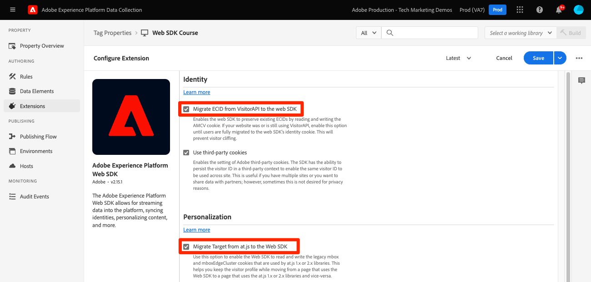

# at.js-Bibliothek durch das Platform Web SDK ersetzen

Erfahren Sie, wie Sie Ihre On-Page-Adobe Target-Implementierung ersetzen, um von at.js zu Platform Web SDK zu migrieren. Ein grundlegender Austausch besteht aus folgenden Schritten:

* Überprüfen Sie Ihre Target-Verwaltungseinstellungen und notieren Sie sich Ihre IMS-Organisations-ID.
* at.js-Bibliothek durch das Platform Web SDK ersetzen
* Vorabausblendungs-Snippet für synchrone Bibliotheksimplementierungen aktualisieren
* Konfigurieren des Platform Web SDK

>[!NOTE]
>
>Die bereitgestellten Beispiele dienen zu Veranschaulichungszwecken und Ihre eigentliche Target-Implementierung kann variieren. Wenn Ihre bestehende Target-Implementierung den Tag-Manager für die Adobe-Datenerfassung verwendet, finden Sie weitere Informationen im Tutorial zur Implementierung des [Platform Web SDK Target-Tutorials](https://experienceleague.adobe.com/docs/platform-learn/implement-web-sdk/applications-setup/setup-target.html) .


## Überprüfen der Target-Verwaltungseinstellungen

Der erste Schritt für die Migration von Target zum Platform Web SDK besteht darin, Ihre Einstellungen im Abschnitt **[!UICONTROL Administration]** der Target-Oberfläche zu überprüfen.

### [!UICONTROL Implementierung]

#### [!UICONTROL Kontodetails]

* **[!UICONTROL IMS-Organisations-ID]** - Notieren Sie sich diesen Wert, da er zum Konfigurieren des Platform Web SDK erforderlich ist.
* **[!UICONTROL On-Device Decisioning]** - Diese Funktion wird vom Platform Web SDK nicht unterstützt. Diese Einstellung kann nach der Migration deaktiviert werden und wenn Sie at.js nicht mehr auf Ihren Websites verwenden oder serverseitige Anwendungsfälle für On-Device Decisioning haben.

#### [!UICONTROL Implementierungsmethoden]

Alle bearbeitbaren Einstellungen im Abschnitt **[!UICONTROL Implementierungsmethoden]** gelten nur für at.js. Mit diesen Einstellungen wird eine benutzerdefinierte at.js-Bibliothek für Ihre Implementierung generiert. Überprüfen Sie diese Einstellungen, um zu überprüfen, ob Sie benutzerdefinierten Code haben oder Erstanbieter- und Drittanbieter-Cookies für domänenübergreifende Anwendungsfälle setzen.

Die Einstellung **[!UICONTROL Profillebensdauer]** kann nur von der Adobe-Kundenunterstützung geändert werden. Die Lebensdauer des Target-Besucherprofils wird von Ihrem Implementierungsansatz nicht beeinflusst. Sowohl at.js als auch Platform Web SDK verwenden dieselbe Lebensdauer des Besucherprofils.

#### [!UICONTROL Datenschutz]

* **[!UICONTROL IP-Adressen der Besucher verschleiern]** - Diese Einstellung wirkt sich auf die Geotargeting-Funktionen aus. Sowohl at.js als auch das Platform Web SDK verwenden für die Geotargeting-Zwecke dieselben Backend-IP-Verschleierungseinstellungen.

### [!UICONTROL Umgebungen]

Das Platform Web SDK verwendet eine Datastream-Konfiguration, mit der Sie explizit eine [!UICONTROL Umgebungs-ID] für separate Entwicklungs-, Staging- und Produktionsdatastreams definieren können. Der Hauptanwendungsfall für diese Konfiguration ist bei Implementierungen mobiler Apps, bei denen URLs nicht vorhanden sind, um Umgebungen einfach zu unterscheiden. Die Einstellung ist optional, kann jedoch verwendet werden, um sicherzustellen, dass alle Anforderungen ordnungsgemäß mit der angegebenen Umgebung verknüpft sind. Dies unterscheidet sich von einer at.js-Implementierung, bei der Sie Target-Umgebungen basierend auf Domänen und Hostgruppenregeln zuweisen müssen.

>[!NOTE]
>
>Wenn in der Datenspeicherkonfiguration keine Umgebungs-ID angegeben ist, verwendet Target die Zuordnung von Domäne zu Umgebung, wie im Abschnitt **Hosts** angegeben.

Weitere Informationen finden Sie im Handbuch zur [Datastream-Konfiguration](https://experienceleague.adobe.com/docs/experience-platform/edge/datastreams/configure.html#target) und in der Dokumentation zu Target [Hosts](https://experienceleague.adobe.com/docs/target/using/administer/hosts.html?lang=de) .

## Bereitstellen des Platform Web SDK

Die Target-Funktionalität wird sowohl von at.js als auch vom Platform Web SDK bereitgestellt. Wenn beide Bibliotheken gleichzeitig verwendet werden, kann es bei Ihnen zu Rendering- und Tracking-Problemen kommen. Für eine erfolgreiche Migration zum Platform Web SDK besteht der erste Schritt darin, at.js zu entfernen und es durch das Platform Web SDK (legierte.js) zu ersetzen.

Angenommen, eine einfache Target-Implementierung mit at.js:

* Eine Datenschicht oben auf der Seite liefert Informationen für Target und andere Anwendungen
* Eine oder mehrere Hilfsbibliotheken von Drittanbietern, deren Funktionen in Target-Aktivitäten verwendet werden können (z. B. jQuery)
* Ein Codeausschnitt zur Vorab-Ausblendung, um Flackern zu vermeiden
* Die at.js-Bibliothek von Target wird asynchron mit Standardeinstellungen geladen, um Aktivitäten automatisch anzufordern und zu rendern:

Beispielimplementierung von +++at.js auf einer HTML-Seite

```HTML
<!doctype html>
<html>
<head>
  <title>Example page</title>
  <!--Data Layer to enable rich data collection and targeting-->
  <script>
    var digitalData = { 
      // Data layer information goes here
    };
  </script>
  <!--Third party libraries that may be used by Target offers and modifications-->
  <script src="https://ajax.googleapis.com/ajax/libs/jquery/3.6.1/jquery.min.js"></script>
  <!--prehiding snippet for Target with asynchronous deployment-->
  <script>
    ;(function(win, doc, style, timeout) {
      var STYLE_ID = 'at-body-style';

      function getParent() {
        return doc.getElementsByTagName('head')[0];
      }

      function addStyle(parent, id, def) {
        if (!parent) {
          return;
        }
        var style = doc.createElement('style');
        style.id = id;
        style.innerHTML = def;
        parent.appendChild(style);
      }

      function removeStyle(parent, id) {
        if (!parent) {
          return;
        }
        var style = doc.getElementById(id);
        if (!style) {
          return;
        }
        parent.removeChild(style);
      }
      addStyle(getParent(), STYLE_ID, style);
      setTimeout(function() {
        removeStyle(getParent(), STYLE_ID);
      }, timeout);
    }(window, document, "body {opacity: 0 !important}", 3000));
  </script>
  <!--Target at.js library loaded asynchonously-->
  <script src="/libraries/at.js" async></script>
</head>
<body>
  <h1 id="title">Home Page</h1><br><br>
  <p id="bodyText">Navigation</p><br><br>
  <a id="home" class="navigationLink" href="#">Home</a><br>
  <a id="pageA" class="navigationLink" href="#">Page A</a><br>
  <a id="pageB" class="navigationLink" href="#">Page B</a><br>
  <a id="pageC" class="navigationLink" href="#">Page C</a><br>
  <div>Homepage Hero Banner Content</div>
</body>
</html>
```

+++

Um Target für die Verwendung des Platform Web SDK zu aktualisieren, müssen Sie zunächst at.js entfernen:

```HTML
<!--Target at.js library loaded asynchonously-->
<script src="/libraries/at.js" async></script>
```

Ersetzen Sie sie durch die legierte JavaScript-Bibliothek oder den eingebetteten Tag-Code und die Adobe Experience Platform Web SDK-Erweiterung:

>[!BEGINTABS]

>[!TAB JavaScript]

```HTML
<!--Platform Web SDK base code-->
<script>
  !function(n,o){o.forEach(function(o){n[o]||((n.__alloyNS=n.__alloyNS||
  []).push(o),n[o]=function(){var u=arguments;return new Promise(
  function(i,l){n[o].q.push([i,l,u])})},n[o].q=[])})}
  (window,["alloy"]);
</script>
<!--Platform Web SDK loaded asynchonously. Change the src to use the latest supported version.-->
<script src="https://cdn1.adoberesources.net/alloy/2.13.1/alloy.min.js" async></script>
```

>[!TAB Tags]

```HTML
<!--Tags Header Embed Code: REPLACE WITH THE INSTALL CODE FROM YOUR OWN ENVIRONMENT-->
<script src="//assets.adobedtm.com/launch-EN93497c30fdf0424eb678d5f4ffac66dc.min.js" async></script>
```

Fügen Sie in der Tag-Eigenschaft die Adobe Experience Platform Web SDK-Erweiterung hinzu:

{zoomable="yes"}


>[!ENDTABS]

Die vordefinierte eigenständige Version erfordert einen &quot;Basis-Code&quot;, der direkt zur Seite hinzugefügt wird und eine globale Funktion namens Legierung erstellt. Verwenden Sie diese Funktion, um mit dem SDK zu interagieren. Wenn Sie der globalen Funktion einen anderen Namen geben möchten, ändern Sie den `alloy`-Namen.

Weitere Informationen und Bereitstellungsoptionen finden Sie in der Dokumentation [Installieren des Platform Web SDK](https://experienceleague.adobe.com/docs/experience-platform/edge/fundamentals/installing-the-sdk.html?lang=de) .


## Aktualisieren des Content-Prehiding-Ansatzes

Je nachdem, ob die Bibliothek asynchron oder synchron geladen wird, erfordert die Implementierung des Platform Web SDK möglicherweise einen Codeausschnitt zur Vorab-Ausblendung.

### Asynchrone Implementierung

Genau wie bei at.js kann das Rendern der Seite abgeschlossen sein, wenn die Platform Web SDK-Bibliothek asynchron geladen wird, bevor Target einen Inhaltsaustausch durchgeführt hat. Dieses Verhalten kann zum so genannten &quot;Flackern&quot;führen. Dabei wird kurz der Standardinhalt angezeigt, bevor er durch den von Target angegebenen personalisierten Inhalt ersetzt wird. Wenn Sie dieses Flimmern vermeiden möchten, empfiehlt Adobe, unmittelbar vor dem asynchronen Platform Web SDK-Skript-Verweis oder -Einbettungscode ein spezielles Codefragment zum Vorab-Ausblenden hinzuzufügen.

Wenn Ihre Implementierung asynchron wie die obigen Beispiele ist, ersetzen Sie das at.js-Codeausschnitt zur Vorab-Ausblendung durch die unten stehende Version, die mit dem Platform Web SDK kompatibel ist:

```HTML
<!--Prehiding snippet for Target with asynchronous Web SDK deployment-->
<script>
  !function(e,a,n,t){var i=e.head;if(i){
  if (a) return;
  var o=e.createElement("style");
  o.id="alloy-prehiding",o.innerText=n,i.appendChild(o),setTimeout(function(){o.parentNode&&o.parentNode.removeChild(o)},t)}}
  (document, document.location.href.indexOf("mboxEdit") !== -1, ".body { opacity: 0 !important }", 3000);
</script>
```

Das Vorabausblendungs-Snippet erstellt ein Stil-Tag im Seitenkopf mit der CSS-Definition Ihrer Wahl. Dieses Stil-Tag wird entfernt, wenn eine Antwort von Target empfangen wird oder die Zeitüberschreitung erreicht wird.

Das Vorabausblendungsverhalten wird durch zwei Konfigurationen am Ende des Ausschnitts gesteuert.

* `body { opacity: 0 !important }` gibt die CSS-Definition an, die für die Vorab-Ausblendung verwendet werden soll, bis Target geladen wird. Standardmäßig ist die gesamte Seite ausgeblendet. Sie können diese Definition auf die Selektoren aktualisieren, die Sie vorab ausblenden möchten, sowie auf die Art und Weise, wie Sie sie ausblenden möchten. Sie können mehrere Definitionen einbeziehen, da dieser Wert einfach in das vorab ausgeblendete Stil-Tag eingefügt wird. Wenn Sie über ein leicht identifizierbares Container-Element verfügen, das den Inhalt unter Ihrer Navigation einschließt, können Sie diese Einstellung verwenden, um die Vorab-Ausblendung auf dieses Container-Element zu beschränken.

* `3000` gibt die Zeitüberschreitung in Millisekunden für die Vorab-Ausblendung an. Wenn vor der Zeitüberschreitung keine Antwort von Target empfangen wird, wird das Tag zum Vorab-Ausblenden entfernt. Das Erreichen dieser Zeitüberschreitung sollte selten sein.

>[!IMPORTANT]
>
>Verwenden Sie unbedingt das richtige Snippet für das Platform Web SDK, da es eine andere Stil-ID von `alloy-prehiding` verwendet. Wenn das Vorabausblendungs-Snippet für at.js verwendet wird, funktioniert es möglicherweise nicht ordnungsgemäß.

### Synchrone Implementierung

Adobe empfiehlt die asynchrone Implementierung des Platform Web SDK, um die Seitenleistung insgesamt zu optimieren. Wenn der Einbettungscode der Bibliothek &quot;legierte.js&quot;oder der Tags jedoch synchron geladen wird, ist das Vorabausblendungs-Snippet nicht erforderlich. Stattdessen wird der Stil für die Vorab-Ausblendung in der Konfiguration des Platform Web SDK angegeben.

Der Vorabausblendungsstil für synchrone Implementierungen kann mit der Option [`prehidingStyle`](https://experienceleague.adobe.com/docs/experience-platform/edge/fundamentals/configuring-the-sdk.html#prehidingStyle) konfiguriert werden. Die Konfiguration des Platform Web SDK wird im nächsten Abschnitt behandelt.

Weiterführende Informationen zur Verwaltung von Flackern mit dem Platform Web SDK finden Sie im Abschnitt &quot;Handbuch&quot;: [Beheben von Flackern für personalisierte Erlebnisse](https://experienceleague.adobe.com/docs/experience-platform/edge/personalization/manage-flicker.html)

## Konfigurieren des Platform Web SDK

Das Platform Web SDK muss bei jedem Laden der Seite konfiguriert werden. Im folgenden Beispiel wird davon ausgegangen, dass die gesamte Site in einer Bereitstellung auf das Platform Web SDK aktualisiert wird:

>[!BEGINTABS]

>[!TAB JavaScript]

Der Befehl `configure` muss immer der erste SDK-Befehl mit dem Namen sein. Die `edgeConfigId` ist die [!UICONTROL Datastraam-ID]

```JavaScript
alloy("configure", {
  "edgeConfigId": "ebebf826-a01f-4458-8cec-ef61de241c93",
  "orgId":"ADB3LETTERSANDNUMBERS@AdobeOrg"
});
```

>[!TAB Tags]

In Tag-Implementierungen werden viele Felder automatisch ausgefüllt oder können aus Dropdown-Menüs ausgewählt werden. Beachten Sie, dass für jede Umgebung unterschiedliche Platform- [!UICONTROL Sandboxes] und [!UICONTROL Datastreams] ausgewählt werden können. Der Datastream ändert sich basierend auf dem Status der Tag-Bibliothek im Veröffentlichungsprozess.

{zoomable="yes"}
>[!ENDTABS]

Wenn Sie eine seitenweise Migration von at.js zum Platform Web SDK planen, sind die folgenden Konfigurationsoptionen erforderlich:


>[!BEGINTABS]

>[!TAB JavaScript]

```JavaScript
alloy("configure", {
  "edgeConfigId": "ebebf826-a01f-4458-8cec-ef61de241c93",
  "orgId":"ADB3LETTERSANDNUMBERS@AdobeOrg",
  "targetMigrationEnabled":true,
  "idMigrationEnabled":true
});
```

>[!TAB Tags]

{zoomable="yes"}

>[!ENDTABS]

Die wichtigen Konfigurationsoptionen für Target sind unten beschrieben:

| Option | Beschreibung | Beispielwert |
| --- | --- | --- |
| `edgeConfigId` | Die Datenspeicher-ID | `ebebf826-a01f-4458-8cec-ef61de241c93` |
| `orgId` | Adobe Experience Cloud-Organisations-ID | `ADB3LETTERSANDNUMBERS@AdobeOrg` |
| `targetMigrationEnabled` | Verwenden Sie diese Option, damit das Web SDK die Legacy-mbox- und mboxEdgeCluster-Cookies liest und schreibt, die von at.js verwendet werden. So können Sie das Besucherprofil beibehalten, während Sie von einer Seite, die das Web SDK verwendet, zu einer Seite wechseln, die die at.js-Bibliothek verwendet, und umgekehrt. | `true` |
| `idMigrationEnabled` | Wenn &quot;true&quot;, liest und setzt das SDK alte AMCV-Cookies. Diese Option hilft beim Übergang zur Verwendung des Platform Web SDK, während einige Teile der Site möglicherweise noch Visitor.js verwenden. | `true` |
| `thirdPartyCookiesEnabled` | Aktiviert die Einstellung von Adobe-Drittanbieter-Cookies. Das SDK kann die Besucher-ID in einem Drittanbieterkontext beibehalten, damit dieselbe Besucher-ID siteübergreifend verwendet werden kann. Verwenden Sie diese Option, wenn Sie mehrere Sites haben. Manchmal ist diese Option jedoch aus Datenschutzgründen nicht erwünscht. | `true` |
| `prehidingStyle` | Wird verwendet, um eine CSS-Stildefinition zu erstellen, die Inhaltsbereiche Ihrer Web-Seite ausblendet, während personalisierter Inhalt vom Server geladen wird. Dies wird nur bei synchronen Bereitstellungen des SDK verwendet. | `body { opacity: 0 !important }` |

Eine vollständige Liste der Optionen finden Sie im Handbuch [Konfigurieren des Platform Web SDK](https://experienceleague.adobe.com/docs/experience-platform/edge/fundamentals/configuring-the-sdk.html) .

## Implementierungsbeispiel

Sobald das Platform Web SDK ordnungsgemäß eingerichtet ist, würde die Beispielseite wie folgt aussehen:

>[!BEGINTABS]

>[!TAB JavaScript]

```HTML
<!doctype html>
<html>
<head>
  <title>Example page</title>
  <!--Data Layer to enable rich data collection and targeting-->
  <script>
    var digitalData = { 
      // Data layer information goes here
    };
  </script>

  <!--Third party libraries that may be used by Target offers and modifications-->
  <script src="https://ajax.googleapis.com/ajax/libs/jquery/3.6.1/jquery.min.js"></script>

  <!--Prehiding snippet for Target with asynchronous Web SDK deployment-->
  <script>
    !function(e,a,n,t){var i=e.head;if(i){
    if (a) return;
    var o=e.createElement("style");
    o.id="alloy-prehiding",o.innerText=n,i.appendChild(o),setTimeout(function(){o.parentNode&&o.parentNode.removeChild(o)},t)}}
    (document, document.location.href.indexOf("mboxEdit") !== -1, ".body { opacity: 0 !important }", 3000);
  </script>

  <!--Platform Web SDK base code-->
  <script>
    !function(n,o){o.forEach(function(o){n[o]||((n.__alloyNS=n.__alloyNS||
    []).push(o),n[o]=function(){var u=arguments;return new Promise(
    function(i,l){n[o].q.push([i,l,u])})},n[o].q=[])})}
    (window,["alloy"]);
  </script>

  <!--Platform Web SDK loaded asynchonously. Change the src to use the latest supported version.-->
  <script src="https://cdn1.adoberesources.net/alloy/2.13.1/alloy.min.js" async></script>
  
  <!--Configure Platform Web SDK-->
  <script>
    alloy("configure", {
      "edgeConfigId": "ebebf826-a01f-4458-8cec-ef61de241c93",
      "orgId":"ADB3LETTERSANDNUMBERS@AdobeOrg"
    });
  </script>
</head>
<body>
  <h1 id="title">Home Page</h1><br><br>
  <p id="bodyText">Navigation</p><br><br>
  <a id="home" class="navigationLink" href="#">Home</a><br>
  <a id="pageA" class="navigationLink" href="#">Page A</a><br>
  <a id="pageB" class="navigationLink" href="#">Page B</a><br>
  <a id="pageC" class="navigationLink" href="#">Page C</a><br>
  <div id="homepage-hero">Homepage Hero Banner Content</div>
</body>
</html>
```

>[!TAB Tags]

Seiten-Code:

```HTML
<!doctype html>
<html>
<head>
  <title>Example page</title>
  <!--Data Layer to enable rich data collection and targeting-->
  <script>
    var digitalData = { 
      // Data layer information goes here
    };
  </script>

  <!--Third party libraries that may be used by Target offers and modifications-->
  <script src="https://ajax.googleapis.com/ajax/libs/jquery/3.6.1/jquery.min.js"></script>

  <!--Prehiding snippet for Target with asynchronous Web SDK deployment-->
  <script>
    !function(e,a,n,t){var i=e.head;if(i){
    if (a) return;
    var o=e.createElement("style");
    o.id="alloy-prehiding",o.innerText=n,i.appendChild(o),setTimeout(function(){o.parentNode&&o.parentNode.removeChild(o)},t)}}
    (document, document.location.href.indexOf("mboxEdit") !== -1, ".body { opacity: 0 !important }", 3000);
  </script>

    <!--Tags Header Embed Code: REPLACE WITH THE INSTALL CODE FROM YOUR OWN ENVIRONMENT-->
    <script src="//assets.adobedtm.com/launch-EN93497c30fdf0424eb678d5f4ffac66dc.min.js" async></script>
</head>
<body>
  <h1 id="title">Home Page</h1><br><br>
  <p id="bodyText">Navigation</p><br><br>
  <a id="home" class="navigationLink" href="#">Home</a><br>
  <a id="pageA" class="navigationLink" href="#">Page A</a><br>
  <a id="pageB" class="navigationLink" href="#">Page B</a><br>
  <a id="pageC" class="navigationLink" href="#">Page C</a><br>
  <div id="homepage-hero">Homepage Hero Banner Content</div>
</body>
</html>
```

Fügen Sie in Tags die Adobe Experience Platform Web SDK-Erweiterung hinzu:

{zoomable="yes"}

Fügen Sie die gewünschten Konfigurationen hinzu:
{zoomable="yes"}


>[!ENDTABS]


Es ist wichtig zu beachten, dass durch das Einschließen und Konfigurieren der Platform Web SDK-Bibliothek wie oben gezeigt keine Netzwerkaufrufe an das Adobe Edge-Netzwerk ausgeführt werden.

Als Nächstes erfahren Sie, wie Sie [VEC-basierte Aktivitäten anfordern und anwenden](render-vec-activities.md) auf die Seite anwenden.

>[!NOTE]
>
>Wir unterstützen Sie bei der erfolgreichen Target-Migration von at.js zum Web SDK. Wenn Sie bei Ihrer Migration auf Probleme stoßen oder der Eindruck haben, dass wichtige Informationen in diesem Handbuch fehlen, teilen Sie uns dies mit, indem Sie in [dieser Community-Diskussion](https://experienceleaguecommunities.adobe.com/t5/adobe-experience-platform-data/tutorial-discussion-migrate-target-from-at-js-to-web-sdk/m-p/575587#M463) posten.
