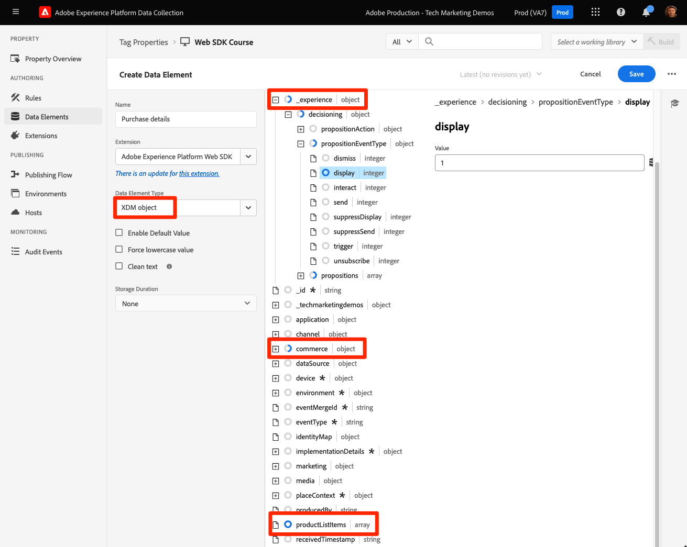

# Senden von Parametern an Target mithilfe des Platform Web SDK

Target-Implementierungen unterscheiden sich je nach Website-Architektur, Geschäftsanforderungen und verwendeten Funktionen. Die meisten Target-Implementierungen umfassen die Übergabe verschiedener Parameter für Kontextinformationen, Zielgruppen und Inhaltsempfehlungen.

Verwenden wir eine einfache Produktdetailseite und eine Bestellbestätigungsseite, um die Unterschiede zwischen den Bibliotheken bei der Übergabe von Parametern an Target zu demonstrieren.

Angenommen, die beiden folgenden Beispielseiten verwenden at.js:

+++at.js auf einer Produktdetailseite:

```HTML
<!doctype html>
<html>
<head>
  <title>Product Details - Men's Shirt</title>
  <!--Target parameters -->
  <script>
    targetPageParams = function() {
      return {
        // Property token
        "at_property": "5a0fd9bb-67de-4b5a-0fd7-9cc09f50a58d",
        // Mbox parameters
        "pageName": "product detail",
        // Profile parameters
        "profile.gender": "male",
        "user.categoryId": "clothing",
        // Entity parameters for Target Recomendations
        "entity.id": "SKU-00001-LARGE",
        "entity.categoryId": "clothing,shirts",
        "entity.customEntity": "some value",
        "cartIds": "SKU-00002,SKU-00003",
        "excludedIds": "SKU-00001-SMALL",
        // Customer ID for cross-device profile synching and Customer Attributes
        "mbox3rdPartyId": "TT8675309",
      };
    };
  </script>
  <!--Target at.js library loaded asynchonously-->
  <script src="/libraries/at.js" async></script>
</head>
<body>
  <h1 id="title">Men's Large Shirt</h1>
  <p>SKU: SKU-00001-LARGE</p>
</body>
</html>
```

+++


+++at.js auf einer Bestellbestätigungsseite:

```HTML
<!doctype html>
<html>
<head>
  <title>Order Confirmation</title>-->
  <!--Target parameters -->
  <script>
    targetPageParams = function() {
      return {
        // Property token
        "at_property": "5a0fd9bb-67de-4b5a-0fd7-9cc09f50a58d",
        // Order confirmation parameters
        "orderId": "ABC123",
        "productPurchasedId": "SKU-00002,SKU-00003",
        "orderTotal": 1337.89,
        // Customer ID for cross-device profile synching and Customer Attributes
        "mbox3rdPartyId": "TT8675309",
      };
    };
  </script>
  <!--Target at.js library loaded asynchonously-->
  <script src="/libraries/at.js" async></script>
</head>
<body>
  <h1 id="title">Order Confirmation</h1>
  <p>Thank you for your order</p>
</body>
</html>
```

+++


## Parameterzuordnungszusammenfassung

Die Target-Parameter für diese Seiten werden mit dem Platform Web SDK unterschiedlich gesendet. Es gibt mehrere Möglichkeiten, Parameter mithilfe von at.js an Target zu übergeben:

- Wird mit der Funktion `targetPageParams()` für das Seitenladeereignis gesetzt (in den Beispielen auf dieser Seite verwendet)
- Wird mit der Funktion `targetPageParamsAll()` für alle Target-Anforderungen auf der Seite eingestellt
- Parameter direkt mit der Funktion `getOffer()` an einen einzelnen Ort senden
- Parameter direkt mit der Funktion `getOffers()` für einen oder mehrere Speicherorte senden


Das Platform Web SDK bietet eine einheitliche Methode zum Senden von Daten, ohne dass zusätzliche Funktionen erforderlich sind. Alle Parameter müssen mit dem Befehl `sendEvent` in die Payload übergeben werden und fallen in zwei Kategorien:

- Automatisch vom `xdm` -Objekt zugeordnet
- Manuell mit dem Objekt `data.__adobe.target` übergeben

In der folgenden Tabelle wird beschrieben, wie die Beispielparameter mithilfe des Platform Web SDK neu zugeordnet werden:

| Beispiel für einen at.js-Parameter | Platform Web SDK-Option | Anmerkungen |
| --- | --- | --- |
| `at_property` | K. A. | Eigenschafts-Token werden im [Datastream](https://experienceleague.adobe.com/docs/experience-platform/edge/datastreams/configure.html#target) konfiguriert und können nicht im `sendEvent` -Aufruf festgelegt werden. |
| `pageName` | `xdm.web.webPageDetails.name` | Alle Target-Mbox-Parameter müssen als Teil des `xdm` -Objekts übergeben und mit der XDM ExperienceEvent-Klasse einem Schema entsprechen. Mbox-Parameter können nicht als Teil des `data` -Objekts übergeben werden. |
| `profile.gender` | `data.__adobe.target.profile.gender` | Alle Target-Profilparameter müssen als Teil des `data` -Objekts übergeben und mit dem Präfix `profile.` versehen werden, damit sie korrekt zugeordnet werden können. |
| `user.categoryId` | `data.__adobe.target.user.categoryId` | Reservierter Parameter, der für die Kategorieaffinitätsfunktion von Target verwendet wird und als Teil des Objekts `data` übergeben werden muss. |
| `entity.id` | `data.__adobe.target.entity.id` <br>ODER<br> `xdm.productListItems[0].SKU` | Entitäts-IDs werden für Target Recommendations-Verhaltenszähler verwendet. Diese Entitäts-IDs können entweder als Teil des `data` -Objekts übergeben oder automatisch vom ersten Element im `xdm.productListItems` -Array zugeordnet werden, wenn Ihre Implementierung diese Feldergruppe verwendet. |
| `entity.categoryId` | `data.__adobe.target.entity.categoryId` | Entitätskategorie-IDs können als Teil des `data` -Objekts übergeben werden. |
| `entity.customEntity` | `data.__adobe.target.entity.customEntity` | Benutzerdefinierte Entitätsparameter werden zum Aktualisieren des Recommendations-Produktkatalogs verwendet. Diese benutzerdefinierten Parameter müssen als Teil des `data` -Objekts übergeben werden. |
| `cartIds` | `data.__adobe.target.cartIds` | Wird für die auf dem Warenkorb basierenden Empfehlungsalgorithmen von Target verwendet. |
| `excludedIds` | `data.__adobe.target.excludedIds` | Wird verwendet, um zu verhindern, dass bestimmte Entitäts-IDs in einem Empfehlungsentwurf zurückgegeben werden. |
| `mbox3rdPartyId` | Im `xdm.identityMap` -Objekt festlegen | Wird zum Synchronisieren von Target-Profilen über Geräte und Kundenattribute hinweg verwendet. Der Namespace, der für die Kunden-ID verwendet werden soll, muss in der [Target-Konfiguration des Datenspeichers](https://experienceleague.adobe.com/docs/experience-platform/edge/personalization/adobe-target/using-mbox-3rdpartyid.html) angegeben werden. |
| `orderId` | `xdm.commerce.order.purchaseID` | Wird zur Identifizierung einer eindeutigen Bestellung für das Target-Konversions-Tracking verwendet. |
| `orderTotal` | `xdm.commerce.order.priceTotal` | Wird zur Verfolgung von Bestellsummen für Target-Konversions- und Optimierungsziele verwendet. |
| `productPurchasedId` | `data.__adobe.target.productPurchasedId` <br>ODER<br> `xdm.productListItems[0-n].SKU` | Wird für Target-Konversions-Tracking und Empfehlungsalgorithmen verwendet. Weitere Informationen finden Sie im Abschnitt [Entitätsparameter](#entity-parameters) unten. |
| `mboxPageValue` | `data.__adobe.target.mboxPageValue` | Wird für das Aktivitätsziel [benutzerdefiniertes Scoring](https://experienceleague.adobe.com/docs/target/using/activities/success-metrics/capture-score.html) verwendet. |

{style="table-layout:auto"}

## Benutzerdefinierte Parameter

Benutzerdefinierte Mbox-Parameter müssen als XDM-Daten mit dem Befehl `sendEvent` übergeben werden. Es ist wichtig sicherzustellen, dass das XDM-Schema alle Felder enthält, die für Ihre Target-Implementierung erforderlich sind.

at.js-Beispiel mit `targetPageParams()`:

```JavaScript
targetPageParams = function() {
  return {
    "pageName": "product detail"
  };
};
```

JavaScript-Beispiele für Platform Web SDK mit dem Befehl `sendEvent` :

>[!BEGINTABS]

>[!TAB JavaScript]

```JavaScript
alloy("sendEvent", {
  "xdm": {
    "web": {
      "webPageDetails": {
        // Other attributes included according to xdm schema
        "name": "product detail"
      }
    }
  }
});
```

>[!TAB Tags]

Verwenden Sie in -Tags zunächst ein [!UICONTROL XDM-Objekt] -Datenelement, um es dem XDM-Feld zuzuordnen:

{zoomable="yes"}

Fügen Sie dann Ihr [!UICONTROL XDM-Objekt] in Ihr [!UICONTROL Ereignis senden] [!UICONTROL action] ein (mehrere [!UICONTROL XDM-Objekte] können [zusammengeführt](https://experienceleague.adobe.com/docs/experience-platform/tags/extensions/client/core/overview.html?lang=en#merged-objects) sein):

{zoomable="yes"}

>[!ENDTABS]


>[!NOTE]
>
>Da benutzerdefinierte Mbox-Parameter Teil des `xdm` -Objekts sind, müssen Sie alle Zielgruppen, Aktivitäten oder Profilskripte, die auf diese Mbox-Parameter verweisen, mit ihren neuen Namen aktualisieren. Weitere Informationen finden Sie auf der Seite [Aktualisieren von Target-Zielgruppen und Profilskripten für die Platform Web SDK-Kompatibilität](update-audiences.md) dieses Tutorials.


## Profilparameter

Target-Profilparameter müssen unter dem `data.__adobe.target` -Objekt in der Befehlsnutzlast des Platform Web SDK `sendEvent` übergeben werden.

Ähnlich wie bei at.js müssen alle Profilparameter auch mit dem Präfix `profile.` versehen werden, damit der Wert ordnungsgemäß als beständiges Target-Profilattribut gespeichert wird. Dem reservierten Parameter `user.categoryId` für die Kategorieaffinitätsfunktion von Target wird `user.` vorangestellt.

at.js-Beispiel mit `targetPageParams()`:

```JavaScript
targetPageParams = function() {
  return {
    "profile.gender": "male",
    "user.categoryId": "clothing"
  };
};
```

Beispiele für das Platform Web SDK mit dem Befehl `sendEvent` :

>[!BEGINTABS]

>[!TAB JavaScript]

```JavaScript
alloy("sendEvent", {
  "data": {
    "__adobe": {
      "target": {
        "profile.gender": "male",
        "user.categoryId": "clothing"
      }
    }
  }
});
```

>[!TAB Tags]

Erstellen Sie in -Tags zunächst ein Datenelement, um das Objekt `data.__adobe.target` zu definieren:

{zoomable="yes"}

Fügen Sie dann Ihr Datenobjekt in Ihre [!UICONTROL Ereignis senden] [!UICONTROL Aktion] ein (mehrere [!UICONTROL Objekte] können [zusammengeführt](https://experienceleague.adobe.com/docs/experience-platform/tags/extensions/client/core/overview.html?lang=en#merged-objects) sein):

{zoomable="yes"}

>[!ENDTABS]

## Entitätsparameter

Entitätsparameter werden verwendet, um Verhaltensdaten und zusätzliche Kataloginformationen für Target Recommendations zu übergeben. Alle von at.js unterstützten [Entitätsparameter](https://experienceleague.adobe.com/docs/target/using/recommendations/entities/entity-attributes.html) werden ebenfalls vom Platform Web SDK unterstützt. Ähnlich wie Profilparameter sollten alle Entitätsparameter unter dem Objekt `data.__adobe.target` in der Befehlsnutzlast des Platform Web SDK `sendEvent` übergeben werden.

Entitätsparameter für ein bestimmtes Element müssen mit dem Präfix &quot;`entity.`&quot;versehen werden, um eine korrekte Datenerfassung zu ermöglichen. Die reservierten Parameter `cartIds` und `excludedIds` für Empfehlungsalgorithmen dürfen nicht mit dem Präfix versehen werden und der Wert für jede Variable muss eine kommagetrennte Liste von Entitäts-IDs enthalten.

at.js-Beispiel mit `targetPageParams()`:

```JavaScript
targetPageParams = function() {
  return {
    "entity.id": "SKU-00001-LARGE",
    "entity.categoryId": "clothing,shirts",
    "entity.customEntity": "some value",
    "cartIds": "SKU-00002,SKU-00003",
    "excludedIds": "SKU-00001-SMALL"
  };
};
```

Beispiele für das Platform Web SDK mit dem Befehl `sendEvent` :

>[!BEGINTABS]

>[!TAB JavaScript]

```JavaScript
alloy("sendEvent", {
  "data": {
    "__adobe": {
      "target": {
        "entity.id": "SKU-00001-LARGE",
        "entity.categoryId": "clothing,shirts",
        "entity.customEntity": "some value",
        "cartIds": "SKU-00002,SKU-00003",
        "excludedIds": "SKU-00001-SMALL"
      }
    }
  }
});
```

>[!TAB Tags]

Erstellen Sie in -Tags zunächst ein Datenelement, um das Objekt `data.__adobe.target` zu definieren:

{zoomable="yes"}

Fügen Sie dann Ihr Datenobjekt in Ihre [!UICONTROL Ereignis senden] [!UICONTROL Aktion] ein (mehrere [!UICONTROL Objekte] können [zusammengeführt](https://experienceleague.adobe.com/docs/experience-platform/tags/extensions/client/core/overview.html?lang=en#merged-objects) sein):

{zoomable="yes"}

>[!ENDTABS]

>[!NOTE]
>
>Wenn die Feldergruppe `commerce` verwendet wird und das Array `productListItems` in der XDM-Payload enthalten ist, wird der erste `SKU` -Wert in diesem Array `entity.id` zugeordnet, um eine Produktansicht zu inkrementieren.


## Kaufparameter

Kaufparameter werden nach einer erfolgreichen Bestellung auf einer Bestellbestätigungsseite übergeben und für Target-Konversions- und Optimierungsziele verwendet. Mit einer Platform Web SDK-Implementierung werden diese Parameter und automatisch aus XDM-Daten zugeordnet, die als Teil der `commerce` -Feldergruppe übergeben werden.

at.js-Beispiel mit `targetPageParams()`:

```JavaScript
targetPageParams = function() {
  return {
    "orderId": "ABC123",
    "productPurchasedId": "SKU-00002,SKU-00003"
    "orderTotal": 1337.89
  };
};
```

Kaufinformationen werden an Target übergeben, wenn für die Feldergruppe `commerce` der Wert `purchases.value` auf `1` festgelegt ist. Die Bestell-ID und die Bestellsumme werden automatisch vom `order` -Objekt zugeordnet. Wenn das Array `productListItems` vorhanden ist, werden die Werte `SKU` für `productPurchasedId` verwendet.

Platform Web SDK-Beispiel mit `sendEvent`:

>[!BEGINTABS]

>[!TAB JavaScript]

```JavaScript
alloy("sendEvent", {
  "xdm": {
    "commerce": {
      "order": {
        "purchaseID": "ABC123",
        "priceTotal": 1337.89
      },
      "purchases": {
        "value": 1
      }
    },
    "productListItems": [{
      "SKU": "SKU-00002"
    }, {
      "SKU": "SKU-00003"
    }],
      "_experience": {
          "decisioning": {
              "propositions": [{
                  "scope": "<your_mbox>"
              }],
              "propositionEventType": {
                  "display": 1
              }
          }
      }
  }
});
```

>[!TAB Tags]

Verwenden Sie in -Tags zunächst ein [!UICONTROL XDM-Objekt] -Datenelement, um die erforderlichen XDM-Felder (siehe JavaScript-Beispiel) und einen optionalen benutzerdefinierten Bereich zuzuordnen:

{zoomable="yes"}

Fügen Sie dann Ihr [!UICONTROL XDM-Objekt] in Ihr [!UICONTROL Ereignis senden] [!UICONTROL action] ein (mehrere [!UICONTROL XDM-Objekte] können [zusammengeführt](https://experienceleague.adobe.com/docs/experience-platform/tags/extensions/client/core/overview.html?lang=en#merged-objects) sein):

{zoomable="yes"}

>[!ENDTABS]

>[!IMPORTANT]
>
> `_experience.decisioning.propositionEventType` muss mit `display: 1` gesetzt werden, damit der Aufruf zum Erhöhen einer Target-Metrik verwendet werden kann.

>[!NOTE]
>
> Wenn Sie einen benutzerdefinierten Ort/Mbox-Namen in Ihrer Target-Metrikdefinition verwenden möchten, z. B. `orderConfirmPage`, füllen Sie das `_experience.decisioning.propositions` -Array mit einem benutzerdefinierten Bereich wie im Beispiel oben.

>[!NOTE]
>
>Der Wert `productPurchasedId` kann auch als kommagetrennte Liste von Entitäts-IDs unter dem Objekt `data` übergeben werden.


## Kunden-ID (mbox3rdPartyId)

Target ermöglicht die Profilsynchronisierung über Geräte und Systeme hinweg mithilfe einer einzelnen Kunden-ID. Bei at.js kann dies in der Target-Anfrage als `mbox3rdPartyId` oder als erste Kunden-ID festgelegt werden, die an den Experience Cloud Identity-Dienst gesendet wird. Im Gegensatz zu at.js können Sie mit einer Platform Web SDK-Implementierung angeben, welche Kunden-ID als `mbox3rdPartyId` verwendet werden soll, wenn mehrere vorhanden sind. Wenn Ihr Unternehmen beispielsweise über eine globale Kunden-ID und separate Kunden-IDs für verschiedene Geschäftsbereiche verfügt, können Sie konfigurieren, welche ID Target verwenden soll.

Es gibt einige Schritte zum Einrichten der ID-Synchronisierung für geräteübergreifende und Kundenattribute-Anwendungsfälle:

1. Erstellen eines **[!UICONTROL Identitäts-Namespace]** für die Kunden-ID im Bildschirm **[!UICONTROL Identitäten]** der Datenerfassung oder Plattform
1. Stellen Sie sicher, dass der **[!UICONTROL alias]** in den Kundenattributen mit dem **[!UICONTROL Identitätssymbol]** Ihres Namespace übereinstimmt.
1. Geben Sie das **[!UICONTROL Platzhaltersymbol]** als **[!UICONTROL Ziel-Drittanbieter-ID-Namespace]** in der Target-Konfiguration des Datastreams an
1. Führen Sie einen Befehl `sendEvent` mit der Feldergruppe `identityMap` aus.

at.js-Beispiel mit `targetPageParams()`:

```JavaScript
targetPageParams = function() {
  return {
    "mbox3rdPartyId": "TT8675309"
  };
};
```

Beispiele für das Platform Web SDK mit dem Befehl `sendEvent` :

>[!BEGINTABS]

>[!TAB JavaScript]

```JavaScript
alloy("sendEvent", {
  "xdm": {
    "identityMap": {
      "GLOBAL_CUSTOMER_ID": [{
        "id": "TT8675309",
        "authenticatedState": "authenticated",
        "primary": true
      }]
    }
  }
});
```

>[!TAB Tags]

Der [!UICONTROL ID] -Wert, der [!UICONTROL Authentifizierungsstatus] und der [!UICONTROL Namespace] werden in einem Datenelement [!UICONTROL Identitätszuordnung] erfasst:
{zoomable="yes"}

Das Datenelement [!UICONTROL Identitätszuordnung] wird dann verwendet, um das Feld [!UICONTROL identityMap] im Datenelement [!UICONTROL XDM-Objekt] festzulegen:
{zoomable="yes"}

Das [!UICONTROL XDM-Objekt] ist dann in der Aktion [!UICONTROL Ereignis senden] einer Regel enthalten:

{zoomable="yes"}

Stellen Sie im Adobe Target-Dienst Ihres Datenspeichers sicher, dass Sie den [!UICONTROL Target-Drittanbieter-ID-Namespace] auf denselben Namespace setzen, der im Datenelement [!UICONTROL Identitätszuordnung] verwendet wird:
{zoomable="yes"}

>[!ENDTABS]

>[!NOTE]
>
> Adobe empfiehlt das Senden von Namespaces, die eine Person repräsentieren, z. B. authentifizierte Identitäten, als primäre Identität.


## Beispiel für Platform Web SDK

Nachdem Sie nun wissen, wie die verschiedenen Target-Parameter mithilfe des Platform Web SDK zugeordnet werden, können Sie unsere beiden Beispielseiten wie unten gezeigt vom at.js zum Platform Web SDK migrieren. Die Beispielseiten umfassen Folgendes:

- Codeausschnitt zur Vorab-Ausblendung für eine asynchrone Bibliotheksimplementierung
- Basis-Code des Platform Web SDK
- Die JavaScript-Bibliothek des Platform Web SDK
- Ein `configure` -Befehl zum Initialisieren der Bibliothek
- Ein `sendEvent` -Befehl zum Senden von Daten und zum Anfordern der Wiedergabe des Target-Inhalts

+++Web SDK auf einer Produktdetailseite:

```HTML
<!doctype html>
<html>
<head>
  <title>Product Details - Men's Shirt</title>

  <!--Prehiding snippet for Target with asynchronous Web SDK deployment-->
  <script>
    !function(e,a,n,t){var i=e.head;if(i){
    if (a) return;
    var o=e.createElement("style");
    o.id="alloy-prehiding",o.innerText=n,i.appendChild(o),setTimeout(function(){o.parentNode&&o.parentNode.removeChild(o)},t)}}
    (document, document.location.href.indexOf("mboxEdit") !== -1, ".body { opacity: 0 !important }", 3000);
  </script>

  <!--Platform Web SDK base code-->
  <script>
    !function(n,o){o.forEach(function(o){n[o]||((n.__alloyNS=n.__alloyNS||
    []).push(o),n[o]=function(){var u=arguments;return new Promise(
    function(i,l){n[o].q.push([i,l,u])})},n[o].q=[])})}
    (window,["alloy"]);
  </script>

  <!--Platform Web SDK loaded asynchonously. Change the src to use the latest supported version.-->
  <script src="https://cdn1.adoberesources.net/alloy/2.6.4/alloy.min.js" async></script>

  <!--Configure Platform Web SDK and send event-->
  <script>
    alloy("configure", {
      "edgeConfigId": "ebebf826-a01f-4458-8cec-ef61de241c93",
      "orgId":"ADB3LETTERSANDNUMBERS@AdobeOrg"
    });
    alloy("sendEvent", {
      "renderDecisions": true,
      "xdm": {
        "identityMap": {
          "GLOBAL_CUSTOMER_ID": [{
            "id": "TT8675309",
            "authenticatedState": "authenticated",
            "primary": true
          }]
        },
        "web": {
          "webPageDetails": {
            // Other attributes included according to XDM schema
            "pageName": "product detail"
          }
        }
      },
      "data": {
        "__adobe": {
          "target": {
            "profile.gender": "male",
            "user.categoryId": "clothing",
            "entity.id": "SKU-00001-LARGE",
            "entity.categoryId": "clothing,shirts",
            "entity.customEntity": "some value",
            "cartIds": "SKU-00002,SKU-00003",
            "excludedIds": "SKU-00001-SMALL"
          }
        }
      }
    });
  </script>
</head>
<body>
  <h1 id="title">Men's Large Shirt</h1>
  <p>SKU: SKU-00001-LARGE</p>
</body>
</html>
```

+++

+++ Web SDK auf einer Bestellbestätigungsseite:

```HTML
<!doctype html>
<html>
<head>
  <title>Order Confirmation</title>


  <!--Prehiding snippet for Target with asynchronous Web SDK deployment-->

  <script>
    !function(e,a,n,t){var i=e.head;if(i){
    if (a) return;
    var o=e.createElement("style");
    o.id="alloy-prehiding",o.innerText=n,i.appendChild(o),setTimeout(function(){o.parentNode&&o.parentNode.removeChild(o)},t)}}
    (document, document.location.href.indexOf("mboxEdit") !== -1, ".body { opacity: 0 !important }", 3000);
  </script>

  <!--Platform Web SDK base code-->

  <script>
    !function(n,o){o.forEach(function(o){n[o]||((n.__alloyNS=n.__alloyNS||
    []).push(o),n[o]=function(){var u=arguments;return new Promise(
    function(i,l){n[o].q.push([i,l,u])})},n[o].q=[])})}
    (window,["alloy"]);
  </script>
  <!--Platform Web SDK loaded asynchonously. Change the src to use the latest supported version.-->
  <script src="https://cdn1.adoberesources.net/alloy/2.6.4/alloy.min.js" async></script>

  <!--Configure Platform Web SDK and send event-->
  <script>
    alloy("configure", {
      "edgeConfigId": "ebebf826-a01f-4458-8cec-ef61de241c93",
      "orgId":"ADB3LETTERSANDNUMBERS@AdobeOrg"
    });
    alloy("sendEvent", {
      "xdm": {
        "identityMap": {
          "GLOBAL_CUSTOMER_ID": [{
            "id": "TT8675309",
            "authenticatedState": "authenticated",
            "primary": true
          }]
        },
        "commerce": {
          "order": {
            "purchaseID": "ABC123",
            "priceTotal": 1337.89
          },
          "purchases": {
            "value": 1
          }
        },
        "productListItems": [{
          "SKU": "SKU-00002"
        }, {
          "SKU": "SKU-00003"
        }],
        "_experience": {
            "decisioning": {
                "propositions": [{
                    "scope": "<your_mbox>"
                }],
                "propositionEventType": {
                    "display": 1
                }
            }
        }
      }
    });
  </script>
</head>
<body>
  <h1 id="title">Order Confirmation</h1>
  <p>Thank you for your order</p>
</body>
</html>
```

+++

Als Nächstes erfahren Sie, wie Sie mit dem Platform Web SDK [Target-Konversionsereignisse verfolgen](track-events.md).

>[!NOTE]
>
>Wir unterstützen Sie bei der erfolgreichen Target-Migration von at.js zum Web SDK. Wenn Sie bei Ihrer Migration auf Probleme stoßen oder der Eindruck haben, dass wichtige Informationen in diesem Handbuch fehlen, teilen Sie uns dies mit, indem Sie in [dieser Community-Diskussion](https://experienceleaguecommunities.adobe.com/t5/adobe-experience-platform-data/tutorial-discussion-migrate-target-from-at-js-to-web-sdk/m-p/575587#M463) posten.
