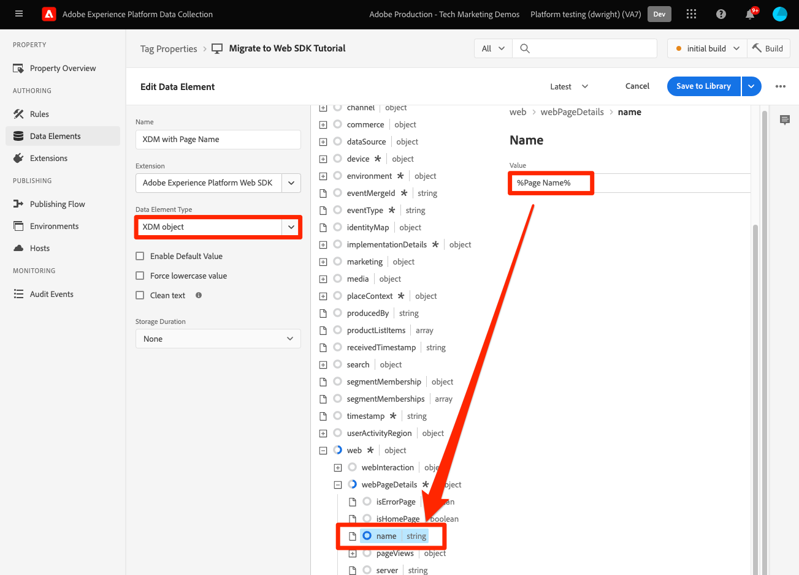

# Senden von Parametern an Target mithilfe von Platform Web SDK

Target-Implementierungen unterscheiden sich je nach Website-Architektur, Geschäftsanforderungen und verwendeten Funktionen je nach Website. Bei den meisten Target-Implementierungen werden verschiedene Parameter für Kontextinformationen, Zielgruppen und Inhaltsempfehlungen übergeben.

Anhand einer einfachen Produktdetailseite und einer Bestellbestätigungsseite möchten wir die Unterschiede zwischen den Bibliotheken beim Übergeben von Parametern an Target demonstrieren.

Angenommen, die folgenden beiden Beispielseiten verwenden at.js:

+++at.js auf einer Produktdetailseite:

```HTML
<!doctype html>
<html>
<head>
  <title>Product Details - Men's Shirt</title>
  <!--Target parameters -->
  <script>
    targetPageParams = function() {
      return {
        // Property token
        "at_property": "5a0fd9bb-67de-4b5a-0fd7-9cc09f50a58d",
        // Mbox parameters
        "pageName": "product detail",
        // Profile parameters
        "profile.gender": "male",
        "user.categoryId": "clothing",
        // Entity parameters for Target Recomendations
        "entity.id": "SKU-00001-LARGE",
        "entity.categoryId": "clothing,shirts",
        "entity.customEntity": "some value",
        "cartIds": "SKU-00002,SKU-00003",
        "excludedIds": "SKU-00001-SMALL",
        // Customer ID for cross-device profile synching and Customer Attributes
        "mbox3rdPartyId": "TT8675309",
      };
    };
  </script>
  <!--Target at.js library loaded asynchonously-->
  <script src="/libraries/at.js" async></script>
</head>
<body>
  <h1 id="title">Men's Large Shirt</h1>
  <p>SKU: SKU-00001-LARGE</p>
</body>
</html>
```

+++


+++at.js auf einer Bestellungsbestätigungsseite:

```HTML
<!doctype html>
<html>
<head>
  <title>Order Confirmation</title>-->
  <!--Target parameters -->
  <script>
    targetPageParams = function() {
      return {
        // Property token
        "at_property": "5a0fd9bb-67de-4b5a-0fd7-9cc09f50a58d",
        // Order confirmation parameters
        "orderId": "ABC123",
        "productPurchasedId": "SKU-00002,SKU-00003",
        "orderTotal": 1337.89,
        // Customer ID for cross-device profile synching and Customer Attributes
        "mbox3rdPartyId": "TT8675309",
      };
    };
  </script>
  <!--Target at.js library loaded asynchonously-->
  <script src="/libraries/at.js" async></script>
</head>
<body>
  <h1 id="title">Order Confirmation</h1>
  <p>Thank you for your order</p>
</body>
</html>
```

+++


## Zusammenfassung der Parameterzuordnung

Die Zielgruppen-Parameter für diese Seiten werden mit Platform Web SDK unterschiedlich gesendet. Es gibt mehrere Möglichkeiten, Parameter mithilfe von at.js an Target zu übergeben:

- Mit `targetPageParams()` Funktion für das Seitenladeereignis festgelegt (wird in den Beispielen auf dieser Seite verwendet)
- Mit `targetPageParamsAll()` Funktion für alle Target-Anfragen auf der Seite festlegen
- Senden von Parametern direkt mit der `getOffer()`-Funktion für einen einzelnen Speicherort
- Parameter direkt mit der `getOffers()` für einen oder mehrere Standorte senden


Platform Web SDK bietet eine einzige, konsistente Möglichkeit zum Senden von Daten, ohne dass zusätzliche Funktionen erforderlich sind. Alle Parameter müssen in der Payload mit dem Befehl `sendEvent` übergeben werden und fallen unter zwei Kategorien:

- Automatisch vom `xdm` Objekt zugeordnet
- Manuelles Übergeben mit dem `data.__adobe.target`

In der folgenden Tabelle ist beschrieben, wie die Beispielparameter mithilfe von Platform Web SDK neu zugeordnet werden:

| Beispiel für den Parameter „at.js“ | Platform Web SDK-Option | Anmerkungen |
| --- | --- | --- |
| `at_property` | K. A. | Eigenschafts-Token sind im [Datenstrom](https://experienceleague.adobe.com/docs/experience-platform/edge/datastreams/configure.html?lang=de#target) konfiguriert und können im `sendEvent` nicht festgelegt werden. |
| `pageName` | `xdm.web.webPageDetails.name` | Alle Ziel-Mbox-Parameter müssen als Teil des `xdm` übergeben werden und einem Schema mit der XDM ExperienceEvent-Klasse entsprechen. Mbox-Parameter können nicht als Teil des `data` übergeben werden. |
| `profile.gender` | `data.__adobe.target.profile.gender` | Alle Zielprofilparameter müssen als Teil des `data` übergeben werden und das Präfix `profile.` aufweisen, damit sie entsprechend zugeordnet werden können. |
| `user.categoryId` | `data.__adobe.target.user.categoryId` | Reservierter Parameter, der für die Zielkategorie-Affinitätsfunktion verwendet wird und als Teil des `data` übergeben werden muss. |
| `entity.id` | `data.__adobe.target.entity.id` <br>ODER<br> `xdm.productListItems[0].SKU` | Entitäts-IDs werden für Target Recommendations-Verhaltenszähler verwendet. Diese Entitäts-IDs können entweder als Teil des `data`-Objekts übergeben oder automatisch vom ersten Element im `xdm.productListItems`-Array zugeordnet werden, wenn Ihre Implementierung diese Feldergruppe verwendet. |
| `entity.categoryId` | `data.__adobe.target.entity.categoryId` | Entitätskategorie-IDs können als Teil des `data` übergeben werden. |
| `entity.customEntity` | `data.__adobe.target.entity.customEntity` | Benutzerdefinierte Entitätsparameter werden zum Aktualisieren des Recommendations-Produktkatalogs verwendet. Diese benutzerdefinierten Parameter müssen als Teil des `data` übergeben werden. |
| `cartIds` | `data.__adobe.target.cartIds` | Wird für die Warenkorb-basierten Empfehlungsalgorithmen von Target verwendet. |
| `excludedIds` | `data.__adobe.target.excludedIds` | Wird verwendet, um zu verhindern, dass bestimmte Entitäts-IDs in einem Recommendations-Design zurückgegeben werden. |
| `mbox3rdPartyId` | Wird im `xdm.identityMap` festgelegt | Wird zum Synchronisieren von Target-Profilen über Geräte und Kundenattribute hinweg verwendet. Der für die Kunden-ID zu verwendende Namespace muss in der [Target-Konfiguration des Datenstroms“ angegeben &#x200B;](https://experienceleague.adobe.com/docs/experience-platform/edge/personalization/adobe-target/using-mbox-3rdpartyid.html?lang=de). |
| `orderId` | `xdm.commerce.order.purchaseID` | Wird zur Identifizierung einer eindeutigen Reihenfolge für das Target-Konversions-Tracking verwendet. |
| `orderTotal` | `xdm.commerce.order.priceTotal` | Wird zum Tracking der Bestellsummen für Konversions- und Optimierungsziele von Target verwendet. |
| `productPurchasedId` | `data.__adobe.target.productPurchasedId` <br>ODER<br> `xdm.productListItems[0-n].SKU` | Wird für Target-Konversionsverfolgungs- und Recommendations-Algorithmen verwendet. Weitere Informationen finden Sie [&#x200B; Abschnitt &#x200B;](#entity-parameters)Entitätsparameter“. |
| `mboxPageValue` | `data.__adobe.target.mboxPageValue` | Wird für das Aktivitätsziel [benutzerdefinierte Bewertung](https://experienceleague.adobe.com/docs/target/using/activities/success-metrics/capture-score.html?lang=de) verwendet. |

{style="table-layout:auto"}

## Benutzerdefinierte Parameter

Benutzerdefinierte Mbox-Parameter müssen mit dem `sendEvent`-Befehl als XDM-Daten übergeben werden. Es ist wichtig sicherzustellen, dass das XDM-Schema alle Felder enthält, die für Ihre Target-Implementierung erforderlich sind.

at.js-Beispiel mit `targetPageParams()`:

```JavaScript
targetPageParams = function() {
  return {
    "pageName": "product detail"
  };
};
```

Beispiele für Platform Web SDK JavaScript mit `sendEvent` Befehl:

>[!BEGINTABS]

>[!TAB JavaScript]

```JavaScript
alloy("sendEvent", {
  "xdm": {
    "web": {
      "webPageDetails": {
        // Other attributes included according to xdm schema
        "name": "product detail"
      }
    }
  }
});
```

>[!TAB Tags]

Verwenden Sie in Tags zunächst ein [!UICONTROL XDM-Objekt]-Datenelement, das dem XDM-Feld zugeordnet werden soll:

{zoomable="yes"}

Fügen Sie dann Ihr [!UICONTROL XDM-Objekt] in Ihr [!UICONTROL Ereignis senden] [!UICONTROL Aktion] ein (mehrere [!UICONTROL XDM-Objekte] können [zusammengeführt](https://experienceleague.adobe.com/docs/experience-platform/tags/extensions/client/core/overview.html?lang=de#merged-objects)):

{zoomable="yes"}

>[!ENDTABS]


>[!NOTE]
>
>Da benutzerdefinierte Mbox-Parameter Teil `xdm` -Objekts sind, müssen Sie alle Zielgruppen, Aktivitäten oder Profilskripte aktualisieren, die mit ihren neuen Namen auf diese Mbox-Parameter verweisen. Weitere Informationen finden [&#x200B; auf der Seite Aktualisieren von Target-Zielgruppen und Profilskripten für die Kompatibilität mit Platform Web &#x200B;](update-audiences.md) SDK in diesem Tutorial .


## Profilparameter

Zielprofilparameter müssen unter dem `data.__adobe.target`-Objekt in der Payload des Platform Web SDK-`sendEvent` übergeben werden.

Ähnlich wie at.js müssen auch alle Profilparameter mit dem Präfix `profile.` versehen werden, damit der Wert ordnungsgemäß als persistentes Zielprofilattribut gespeichert wird. Dem reservierten `user.categoryId` für die Funktion der Kategorieaffinität von Target wird das Präfix `user.` vorangestellt.

at.js-Beispiel mit `targetPageParams()`:

```JavaScript
targetPageParams = function() {
  return {
    "profile.gender": "male",
    "user.categoryId": "clothing"
  };
};
```

Beispiele für Platform Web SDK mit `sendEvent` Befehl:

>[!BEGINTABS]

>[!TAB JavaScript]

```JavaScript
alloy("sendEvent", {
  "data": {
    "__adobe": {
      "target": {
        "profile.gender": "male",
        "user.categoryId": "clothing"
      }
    }
  }
});
```

>[!TAB Tags]

Erstellen Sie in Tags zunächst ein Datenelement, um das `data.__adobe.target` zu definieren:

{zoomable="yes"}

Fügen Sie dann Ihr Datenobjekt in Ihr [!UICONTROL Sendeereignis] [!UICONTROL Aktion] ein (mehrere [!UICONTROL Objekte] können [zusammengeführt](https://experienceleague.adobe.com/docs/experience-platform/tags/extensions/client/core/overview.html?lang=de#merged-objects)):

{zoomable="yes"}

>[!ENDTABS]

## Entitätsparameter

Entitätsparameter werden verwendet, um Verhaltensdaten und zusätzliche Kataloginformationen für Target Recommendations zu übergeben. Alle [Entitätsparameter](https://experienceleague.adobe.com/docs/target/using/recommendations/entities/entity-attributes.html?lang=de) die von at.js unterstützt werden, werden auch von Platform Web SDK unterstützt. Ähnlich wie Profilparameter sollten alle Entitätsparameter unter dem `data.__adobe.target`-Objekt in der Payload des Platform Web SDK `sendEvent`-Befehls übergeben werden.

Entitätsparameter für ein bestimmtes Element müssen mit dem Präfix `entity.` versehen werden, um eine ordnungsgemäße Datenerfassung zu gewährleisten. Die reservierten `cartIds`- und `excludedIds`-Parameter für Recommendations-Algorithmen sollten nicht mit einem Präfix versehen werden und der Wert für jedes muss eine kommagetrennte Liste von Entitäts-IDs enthalten.

at.js-Beispiel mit `targetPageParams()`:

```JavaScript
targetPageParams = function() {
  return {
    "entity.id": "SKU-00001-LARGE",
    "entity.categoryId": "clothing,shirts",
    "entity.customEntity": "some value",
    "cartIds": "SKU-00002,SKU-00003",
    "excludedIds": "SKU-00001-SMALL"
  };
};
```

Beispiele für Platform Web SDK mit `sendEvent` Befehl:

>[!BEGINTABS]

>[!TAB JavaScript]

```JavaScript
alloy("sendEvent", {
  "data": {
    "__adobe": {
      "target": {
        "entity.id": "SKU-00001-LARGE",
        "entity.categoryId": "clothing,shirts",
        "entity.customEntity": "some value",
        "cartIds": "SKU-00002,SKU-00003",
        "excludedIds": "SKU-00001-SMALL"
      }
    }
  }
});
```

>[!TAB Tags]

Erstellen Sie in Tags zunächst ein Datenelement, um das `data.__adobe.target` zu definieren:

{zoomable="yes"}

Fügen Sie dann Ihr Datenobjekt in Ihr [!UICONTROL Sendeereignis] [!UICONTROL Aktion] ein (mehrere [!UICONTROL Objekte] können [zusammengeführt](https://experienceleague.adobe.com/docs/experience-platform/tags/extensions/client/core/overview.html?lang=de#merged-objects)):

{zoomable="yes"}

>[!ENDTABS]

>[!NOTE]
>
>Wenn die `commerce` Feldgruppe verwendet wird und das `productListItems`-Array in der XDM-Payload enthalten ist, wird der erste `SKU` in diesem Array `entity.id` zugeordnet, um eine Produktansicht zu inkrementieren.


## Kaufparameter

Kaufparameter werden nach erfolgreicher Bestellung auf einer Auftragsbestätigungsseite weitergeleitet und für Konversions- und Optimierungsziele von Target verwendet. Bei einer Implementierung von Platform Web SDK werden diese Parameter und automatisch aus XDM-Daten zugeordnet, die als Teil der `commerce` Feldergruppe übergeben werden.

at.js-Beispiel mit `targetPageParams()`:

```JavaScript
targetPageParams = function() {
  return {
    "orderId": "ABC123",
    "productPurchasedId": "SKU-00002,SKU-00003"
    "orderTotal": 1337.89
  };
};
```

Kaufinformationen werden an Target übergeben, wenn die `commerce` Feldergruppe auf `1` gesetzt `purchases.value`. Die Auftrags-ID und die Bestellsumme werden automatisch aus dem `order` Objekt zugeordnet. Wenn das `productListItems`-Array vorhanden ist, werden die `SKU` Werte für die `productPurchasedId` verwendet.

Platform Web SDK-Beispiel mit `sendEvent`:

>[!BEGINTABS]

>[!TAB JavaScript]

```JavaScript
alloy("sendEvent", {
  "xdm": {
    "commerce": {
      "order": {
        "purchaseID": "ABC123",
        "priceTotal": 1337.89
      },
      "purchases": {
        "value": 1
      }
    },
    "productListItems": [{
      "SKU": "SKU-00002"
    }, {
      "SKU": "SKU-00003"
    }],
      "_experience": {
          "decisioning": {
              "propositions": [{
                  "scope": "<your_mbox>"
              }],
              "propositionEventType": {
                  "display": 1
              }
          }
      }
  }
});
```

>[!TAB Tags]

Verwenden Sie in Tags zunächst ein [!UICONTROL XDM-Objekt]-Datenelement, um es den erforderlichen XDM-Feldern (siehe das JavaScript-Beispiel) und optional dem benutzerdefinierten Bereich zuzuordnen:

{zoomable="yes"}

Fügen Sie dann Ihr [!UICONTROL XDM-Objekt] in Ihr [!UICONTROL Ereignis senden] [!UICONTROL Aktion] ein (mehrere [!UICONTROL XDM-Objekte] können [zusammengeführt](https://experienceleague.adobe.com/docs/experience-platform/tags/extensions/client/core/overview.html?lang=de#merged-objects)):

{zoomable="yes"}

>[!ENDTABS]

>[!IMPORTANT]
>
> `_experience.decisioning.propositionEventType` muss mit `display: 1` festgelegt werden, damit der Aufruf zum Inkrementieren einer Zielmetrik verwendet werden kann.

>[!NOTE]
>
> Wenn Sie einen benutzerdefinierten Speicherort-/Mbox-Namen in Ihrer Zielmetrikdefinition verwenden möchten, z. B. `orderConfirmPage`, füllen Sie das `_experience.decisioning.propositions`-Array mit einem benutzerdefinierten Bereich wie im obigen Beispiel.

>[!NOTE]
>
>Der `productPurchasedId` kann auch als kommagetrennte Liste von Entitäts-IDs unter dem `data`-Objekt übergeben werden.


## Kunden-ID (mbox3rdPartyId)

Target ermöglicht die Synchronisierung von Profilen über Geräte und Systeme hinweg mithilfe einer einzigen Kunden-ID. Bei „at.js“ kann dies als `mbox3rdPartyId` in der Target-Anfrage oder als erste Kunden-ID festgelegt werden, die an den Experience Cloud Identity Service gesendet wird. Im Gegensatz zu at.js können Sie bei einer Platform Web SDK-Implementierung festlegen, welche Kunden-ID als `mbox3rdPartyId` verwendet werden soll, wenn mehrere vorhanden sind. Wenn Ihr Unternehmen beispielsweise über eine globale Kunden-ID und separate Kunden-IDs für verschiedene Geschäftsbereiche verfügt, können Sie konfigurieren, welche ID Target verwenden soll.

Es gibt einige Schritte, um die ID-Synchronisierung für Anwendungsfälle mit geräteübergreifenden und Kundenattributen einzurichten:

1. Erstellen Sie **[!UICONTROL Identity-Namespace]** für die Kunden-ID **[!UICONTROL Bildschirm &quot;]**&quot; der Datenerfassung oder Plattform
1. Stellen Sie sicher **[!UICONTROL dass der]** in Kundenattributen mit dem **[!UICONTROL Identitätssymbol]** Ihres Namespace übereinstimmt
1. Geben Sie **[!UICONTROL Identitätssymbol]** als **[!UICONTROL Target-Drittanbieter-ID-Namespace]** in der Target-Konfiguration des Datenstroms an
1. Ausführen eines `sendEvent` Befehls mithilfe der `identityMap` Feldergruppe

at.js-Beispiel mit `targetPageParams()`:

```JavaScript
targetPageParams = function() {
  return {
    "mbox3rdPartyId": "TT8675309"
  };
};
```

Beispiele für Platform Web SDK mit `sendEvent` Befehl:

>[!BEGINTABS]

>[!TAB JavaScript]

```JavaScript
alloy("sendEvent", {
  "xdm": {
    "identityMap": {
      "GLOBAL_CUSTOMER_ID": [{
        "id": "TT8675309",
        "authenticatedState": "authenticated",
        "primary": true
      }]
    }
  }
});
```

>[!TAB Tags]

Der [!UICONTROL ID]-Wert, [!UICONTROL Authentifizierungsstatus] und [!UICONTROL Namespace] werden in einem Datenelement [!UICONTROL Identitätszuordnung] erfasst:
{zoomable="yes"}

Das [!UICONTROL Identitätszuordnung]-Datenelement wird dann verwendet, um das Feld [!UICONTROL identityMap] im [!UICONTROL XDM-Objekt]-Datenelement festzulegen:
{zoomable="yes"}

Das [!UICONTROL XDM]Objekt wird dann in die Aktion [!UICONTROL Ereignis senden] einer Regel aufgenommen:

{zoomable="yes"}

Stellen Sie im Adobe Target-Service Ihres Datenstroms sicher, dass Sie den Namespace [!UICONTROL Target Third-Party-ID] auf denselben Namespace festlegen, der im Datenelement [!UICONTROL Identitätszuordnung] verwendet wird:
{zoomable="yes"}

>[!ENDTABS]

>[!NOTE]
>
> Adobe empfiehlt, Namespaces zu senden, die eine Person darstellen, z. B. authentifizierte Identitäten, als primäre Identität.


## Beispiel für Platform Web SDK

Nachdem Sie nun wissen, wie die verschiedenen Zielparameter mithilfe der Platform Web SDK zugeordnet werden, können Sie unsere beiden Beispielseiten wie unten dargestellt von at.js zur Platform Web SDK migrieren. Die Beispielseiten enthalten Folgendes:

- Target-Code zum Vorab-Ausblenden für eine asynchrone Bibliotheksimplementierung
- Der Platform Web SDK-Basis-Code
- Die Platform Web SDK JavaScript-Bibliothek
- Ein `configure` Befehl zum Initialisieren der Bibliothek
- Ein `sendEvent` Befehl zum Senden von Daten und zum Anfordern von zu rendernden Target-Inhalten

+++Web SDK auf einer Produktdetailseite:

```HTML
<!doctype html>
<html>
<head>
  <title>Product Details - Men's Shirt</title>

  <!--Prehiding snippet for Target with asynchronous Web SDK deployment-->
  <script>
    !function(e,a,n,t){var i=e.head;if(i){
    if (a) return;
    var o=e.createElement("style");
    o.id="alloy-prehiding",o.innerText=n,i.appendChild(o),setTimeout(function(){o.parentNode&&o.parentNode.removeChild(o)},t)}}
    (document, document.location.href.indexOf("mboxEdit") !== -1, ".body { opacity: 0 !important }", 3000);
  </script>

  <!--Platform Web SDK base code-->
  <script>
    !function(n,o){o.forEach(function(o){n[o]||((n.__alloyNS=n.__alloyNS||
    []).push(o),n[o]=function(){var u=arguments;return new Promise(
    function(i,l){n[o].q.push([i,l,u])})},n[o].q=[])})}
    (window,["alloy"]);
  </script>

  <!--Platform Web SDK loaded asynchonously. Change the src to use the latest supported version.-->
  <script src="https://cdn1.adoberesources.net/alloy/2.6.4/alloy.min.js" async></script>

  <!--Configure Platform Web SDK and send event-->
  <script>
    alloy("configure", {
      "edgeConfigId": "ebebf826-a01f-4458-8cec-ef61de241c93",
      "orgId":"ADB3LETTERSANDNUMBERS@AdobeOrg"
    });
    alloy("sendEvent", {
      "renderDecisions": true,
      "xdm": {
        "identityMap": {
          "GLOBAL_CUSTOMER_ID": [{
            "id": "TT8675309",
            "authenticatedState": "authenticated",
            "primary": true
          }]
        },
        "web": {
          "webPageDetails": {
            // Other attributes included according to XDM schema
            "pageName": "product detail"
          }
        }
      },
      "data": {
        "__adobe": {
          "target": {
            "profile.gender": "male",
            "user.categoryId": "clothing",
            "entity.id": "SKU-00001-LARGE",
            "entity.categoryId": "clothing,shirts",
            "entity.customEntity": "some value",
            "cartIds": "SKU-00002,SKU-00003",
            "excludedIds": "SKU-00001-SMALL"
          }
        }
      }
    });
  </script>
</head>
<body>
  <h1 id="title">Men's Large Shirt</h1>
  <p>SKU: SKU-00001-LARGE</p>
</body>
</html>
```

+++

+++Web SDK auf einer Bestellungsbestätigungsseite:

```HTML
<!doctype html>
<html>
<head>
  <title>Order Confirmation</title>


  <!--Prehiding snippet for Target with asynchronous Web SDK deployment-->

  <script>
    !function(e,a,n,t){var i=e.head;if(i){
    if (a) return;
    var o=e.createElement("style");
    o.id="alloy-prehiding",o.innerText=n,i.appendChild(o),setTimeout(function(){o.parentNode&&o.parentNode.removeChild(o)},t)}}
    (document, document.location.href.indexOf("mboxEdit") !== -1, ".body { opacity: 0 !important }", 3000);
  </script>

  <!--Platform Web SDK base code-->

  <script>
    !function(n,o){o.forEach(function(o){n[o]||((n.__alloyNS=n.__alloyNS||
    []).push(o),n[o]=function(){var u=arguments;return new Promise(
    function(i,l){n[o].q.push([i,l,u])})},n[o].q=[])})}
    (window,["alloy"]);
  </script>
  <!--Platform Web SDK loaded asynchonously. Change the src to use the latest supported version.-->
  <script src="https://cdn1.adoberesources.net/alloy/2.6.4/alloy.min.js" async></script>

  <!--Configure Platform Web SDK and send event-->
  <script>
    alloy("configure", {
      "edgeConfigId": "ebebf826-a01f-4458-8cec-ef61de241c93",
      "orgId":"ADB3LETTERSANDNUMBERS@AdobeOrg"
    });
    alloy("sendEvent", {
      "xdm": {
        "identityMap": {
          "GLOBAL_CUSTOMER_ID": [{
            "id": "TT8675309",
            "authenticatedState": "authenticated",
            "primary": true
          }]
        },
        "commerce": {
          "order": {
            "purchaseID": "ABC123",
            "priceTotal": 1337.89
          },
          "purchases": {
            "value": 1
          }
        },
        "productListItems": [{
          "SKU": "SKU-00002"
        }, {
          "SKU": "SKU-00003"
        }],
        "_experience": {
            "decisioning": {
                "propositions": [{
                    "scope": "<your_mbox>"
                }],
                "propositionEventType": {
                    "display": 1
                }
            }
        }
      }
    });
  </script>
</head>
<body>
  <h1 id="title">Order Confirmation</h1>
  <p>Thank you for your order</p>
</body>
</html>
```

+++

Erfahren Sie als Nächstes, wie Sie [Target-Konversionsereignisse &#x200B;](track-events.md) Platform Web SDK verfolgen.

>[!NOTE]
>
>Wir möchten Sie bei der erfolgreichen Migration von at.js zu Web SDK unterstützen. Wenn Sie auf Hindernisse bei Ihrer Migration stoßen oder das Gefühl haben, dass wichtige Informationen in diesem Handbuch fehlen, lassen Sie es uns bitte wissen, indem Sie in [diese Community-Diskussion](https://experienceleaguecommunities.adobe.com/t5/adobe-experience-platform-data/tutorial-discussion-migrate-target-from-at-js-to-web-sdk/m-p/575587?profile.language=de#M463) posten.
