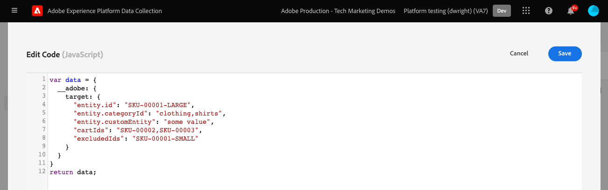

# Senden von Parametern an Target mithilfe des Platform Web SDK

Target-Implementierungen unterscheiden sich je nach Website-Architektur, Geschäftsanforderungen und verwendeten Funktionen. Die meisten Target-Implementierungen umfassen die Übergabe verschiedener Parameter für Kontextinformationen, Zielgruppen und Inhaltsempfehlungen.

Verwenden wir eine einfache Produktdetailseite und eine Bestellbestätigungsseite, um die Unterschiede zwischen den Bibliotheken bei der Übergabe von Parametern an Target zu demonstrieren.

Angenommen, die beiden folgenden Beispielseiten verwenden at.js:

+++at.js auf einer Produktdetailseite:

```HTML
<!doctype html>
<html>
<head>
  <title>Product Details - Men's Shirt</title>
  <!--Target parameters -->
  <script>
    targetPageParams = function() {
      return {
        // Property token
        "at_property": "5a0fd9bb-67de-4b5a-0fd7-9cc09f50a58d",
        // Mbox parameters
        "siteSection": "product details",
        // Profile parameters
        "profile.gender": "male",
        "user.categoryId": "clothing",
        // Entity parameters for Target Recomendations
        "entity.id": "SKU-00001-LARGE",
        "entity.categoryId": "clothing,shirts",
        "entity.customEntity": "some value",
        "cartIds": "SKU-00002,SKU-00003",
        "excludedIds": "SKU-00001-SMALL",
        // Customer ID for cross-device profile synching and Customer Attributes
        "mbox3rdPartyId": "TT8675309",
      };
    };
  </script>
  <!--Target at.js library loaded asynchonously-->
  <script src="/libraries/at.js" async></script>
</head>
<body>
  <h1 id="title">Men's Large Shirt</h1>
  <p>SKU: SKU-00001-LARGE</p>
</body>
</html>
```

+++


+++at.js auf einer Bestellbestätigungsseite:

```HTML
<!doctype html>
<html>
<head>
  <title>Order Confirmation</title>-->
  <!--Target parameters -->
  <script>
    targetPageParams = function() {
      return {
        // Property token
        "at_property": "5a0fd9bb-67de-4b5a-0fd7-9cc09f50a58d",
        // Order confirmation parameters
        "orderId": "ABC123",
        "productPurchasedId": "SKU-00002,SKU-00003",
        "orderTotal": 1337.89,
        // Customer ID for cross-device profile synching and Customer Attributes
        "mbox3rdPartyId": "TT8675309",
      };
    };
  </script>
  <!--Target at.js library loaded asynchonously-->
  <script src="/libraries/at.js" async></script>
</head>
<body>
  <h1 id="title">Order Confirmation</h1>
  <p>Thank you for your order</p>
</body>
</html>
```

+++


## Parameterzuordnungszusammenfassung

Die auf diesen beiden Beispielseiten verwendeten Target-Parameter müssen mit dem Platform Web SDK etwas anders gesendet werden. Es gibt mehrere Möglichkeiten, Parameter mithilfe von at.js an Target zu übergeben:

- Festlegen mit `targetPageParams()` -Funktion für das Seitenladeereignis
- Festlegen mit `targetPageParamsAll()` -Funktion für alle Target-Anforderungen auf der Seite
- Parameter direkt mit der `getOffer()` -Funktion für einen einzelnen Standort
- Parameter direkt mit der `getOffers()` -Funktion für einen oder mehrere Speicherorte

Für die Zwecke dieses Beispiels wird die Variable `targetPageParams()` verwendet wird.

Das Platform Web SDK vereinfacht dies, indem es eine einheitliche, konsistente Methode zum Senden von Daten bereitstellt, ohne dass zusätzliche Funktionen erforderlich sind. Alle Parameter müssen in der Payload mit der `sendEvent` Befehl.

Mit dem Platform Web SDK übergebene Parameter `sendEvent` Nutzlast fällt unter zwei Kategorien:

1. Automatisch zugeordnet von der `xdm` Objekt
1. Manuell übergeben mit der `data.__adobe.target` Objekt

In der folgenden Tabelle wird beschrieben, wie die Beispielparameter mithilfe des Platform Web SDK neu zugeordnet werden:

| Beispiel für einen at.js-Parameter | Platform Web SDK-Option | Anmerkungen |
| --- | --- | --- |
| `at_property` | K. A. | Eigenschafts-Token werden im [datastream](https://experienceleague.adobe.com/docs/experience-platform/edge/datastreams/configure.html#target) und kann nicht im `sendEvent` aufrufen. |
| `siteSection` | `xdm.web.webPageDetails.siteSection` | Alle Target-Mbox-Parameter müssen als Teil der `xdm` -Objekt ein und entsprechen einem Schema mithilfe der XDM ExperienceEvent-Klasse. Mbox-Parameter können nicht als Teil der `data` -Objekt. |
| `profile.gender` | `data.__adobe.target.profile.gender` | Alle Target-Profilparameter müssen als Teil der `data` -Objekt und -Präfix `profile.` entsprechend zugeordnet werden. |
| `user.categoryId` | `data.__adobe.target.user.categoryId` | Reservierte Parameter, die für die Kategorieaffinitätsfunktion von Target verwendet werden und als Teil der `data` -Objekt. |
| `entity.id` | `data.__adobe.target.entity.id` <br>OR<br> `xdm.productListItems[0].SKU` | Entitäts-IDs werden für Target Recommendations-Verhaltenszähler verwendet. Diese Entitäts-IDs können entweder als Teil der `data` Objekt oder wird automatisch vom ersten Element in der `xdm.productListItems` -Array, wenn Ihre Implementierung diese Feldergruppe verwendet. |
| `entity.categoryId` | `data.__adobe.target.entity.categoryId` | Entitäts-Kategorie-IDs können als Teil der `data` -Objekt. |
| `entity.customEntity` | `data.__adobe.target.entity.customEntity` | Benutzerdefinierte Entitätsparameter werden zum Aktualisieren des Recommendations-Produktkatalogs verwendet. Diese benutzerdefinierten Parameter müssen als Teil der `data` -Objekt. |
| `cartIds` | `data.__adobe.target.cartIds` | Wird für die auf dem Warenkorb basierenden Empfehlungsalgorithmen von Target verwendet. |
| `excludedIds` | `data.__adobe.target.excludedIds` | Wird verwendet, um zu verhindern, dass bestimmte Entitäts-IDs in einem Empfehlungsentwurf zurückgegeben werden. |
| `mbox3rdPartyId` | Wird in der identityMap festgelegt. Siehe [Synchronisieren von Profilen mit einer Kunden-ID](#synching-profiles-with-a-customer-id) | Wird zum Synchronisieren von Target-Profilen über Geräte und Kundenattribute hinweg verwendet. Der Namespace, der für die Kunden-ID verwendet werden soll, muss in der Variablen [Zielkonfiguration des Datastreams](https://experienceleague.adobe.com/docs/experience-platform/edge/personalization/adobe-target/using-mbox-3rdpartyid.html). |
| `orderId` | `xdm.commerce.order.purchaseID` | Wird zur Identifizierung einer eindeutigen Bestellung für das Target-Konversions-Tracking verwendet. |
| `orderTotal` | `xdm.commerce.order.priceTotal` | Wird zur Verfolgung von Bestellsummen für Target-Konversions- und Optimierungsziele verwendet. |
| `productPurchasedId` | `data.__adobe.target.productPurchasedId` <br>OR<br> `xdm.productListItems[0-n].SKU` | Wird für Target-Konversions-Tracking und Empfehlungsalgorithmen verwendet. Siehe Abschnitt [Entitätsparameter](#entity-parameters) unten für weitere Informationen. |
| `mboxPageValue` | `data.__adobe.target.mboxPageValue` | Wird für die [benutzerdefiniertes Scoring](https://experienceleague.adobe.com/docs/target/using/activities/success-metrics/capture-score.html) Aktivitätsziel. |

{style=&quot;table-layout:auto&quot;}

## Benutzerdefinierte Parameter

Alle benutzerdefinierten Mbox-Parameter müssen als XDM-Daten mit der `sendEvent` Befehl. Es ist wichtig sicherzustellen, dass das XDM-Schema alle Datenpunkte enthält, die für Ihre Target-Implementierung erforderlich sind.

at.js-Beispiel mit `targetPageParams()`:

```JavaScript
targetPageParams = function() {
  return {
    "pageName": "product detail"
  };
};
```

JavaScript-Beispiele für Platform Web SDK mit `sendEvent` command:

>[!BEGINTABS]

>[!TAB JavaScript]

```JavaScript
alloy("sendEvent", {
  "xdm": {
    "web": {
      "webPageDetails": {
        // Other attributes included according to xdm schema
        "name": "product detail"
      }
    }
  }
});
```

>[!TAB Tags]

Verwenden Sie in -Tags zunächst eine [!UICONTROL XDM-Objekt] Datenelement, das dem XDM-Feld zugeordnet werden soll:


Fügen Sie dann [!UICONTROL XDM-Objekt] in [!UICONTROL Ereignis senden] [!UICONTROL action] (mehrere [!UICONTROL XDM-Objekte] kann [zusammengeführt](https://experienceleague.adobe.com/docs/experience-platform/tags/extensions/client/core/overview.html?lang=en#merged-objects)):


>[!ENDTABS]


>[!NOTE]
>
>Da benutzerdefinierte Mbox-Parameter als Teil von `xdm` -Objekt im `sendEvent` -Befehl verwenden, müssen alle in Ihrer at.js-Target-Implementierung verwendeten Mbox-Parameter einem XDM-Äquivalent neu zugewiesen werden. Das bedeutet, dass Sie alle Zielgruppen, Aktivitäten oder Profilskripte aktualisieren müssen, die auf diese Mbox-Parameter verweisen.


## Profilparameter

Die Target-Profilparameter müssen unter dem `data.__adobe.target` -Objekt im Platform Web SDK `sendEvent` -Befehlsnutzlast.

Ähnlich wie bei at.js müssen auch alle Profilparameter mit dem Präfix `profile.` für den Wert, der ordnungsgemäß als beständiges Target-Profilattribut gespeichert werden soll. Die reservierten `user.categoryId` -Parameter für die Kategorieaffinitätsfunktion von Target mit dem Präfix `user.`.

at.js-Beispiel mit `targetPageParams()`:

```JavaScript
targetPageParams = function() {
  return {
    "profile.gender": "male",
    "user.categoryId": "clothing"
  };
};
```

Beispiele für Platform Web SDK mit `sendEvent` command:

>[!BEGINTABS]

>[!TAB JavaScript]

```JavaScript
alloy("sendEvent", {
  "data": {
    "__adobe": {
      "target": {
        "profile.gender": "male",
        "user.categoryId": "clothing"
      }
    }
  }
});
```

>[!TAB Tags]

Erstellen Sie in -Tags zunächst ein Datenelement, um die `data.__adobe.target` -Objekt:


Fügen Sie dann Ihr Datenobjekt in Ihre [!UICONTROL Ereignis senden] [!UICONTROL action] (mehrere [!UICONTROL Objekte] kann [zusammengeführt](https://experienceleague.adobe.com/docs/experience-platform/tags/extensions/client/core/overview.html?lang=en#merged-objects)):


>[!ENDTABS]

## Entitätsparameter

Entitätsparameter werden verwendet, um Verhaltensdaten und zusätzliche Kataloginformationen für Target Recommendations zu übergeben. Ähnlich wie bei Profilparametern müssen alle Entitätsparameter unter dem `data.__adobe.target` -Objekt im Platform Web SDK `sendEvent` -Befehlsnutzlast.

Entitätsparameter für ein bestimmtes Element müssen mit dem Präfix `entity.` für eine ordnungsgemäße Datenerfassung. Die reservierten `cartIds` und `excludedIds` -Parameter für Empfehlungsalgorithmen dürfen nicht mit dem Präfix versehen werden und der Wert für jede muss eine kommagetrennte Liste von Entitäts-IDs enthalten.

at.js-Beispiel mit `targetPageParams()`:

```JavaScript
targetPageParams = function() {
  return {
    "entity.id": "SKU-00001-LARGE",
    "entity.categoryId": "clothing,shirts",
    "entity.customEntity": "some value",
    "cartIds": "SKU-00002,SKU-00003",
    "excludedIds": "SKU-00001-SMALL"
  };
};
```

Beispiele für Platform Web SDK mit `sendEvent` command:

>[!BEGINTABS]

>[!TAB JavaScript]

```JavaScript
alloy("sendEvent", {
  "data": {
    "__adobe": {
      "target": {
        "entity.id": "SKU-00001-LARGE",
        "entity.categoryId": "clothing,shirts",
        "entity.customEntity": "some value",
        "cartIds": "SKU-00002,SKU-00003",
        "excludedIds": "SKU-00001-SMALL"
      }
    }
  }
});
```

>[!TAB Tags]

Erstellen Sie in -Tags zunächst ein Datenelement, um die `data.__adobe.target` -Objekt:



Fügen Sie dann Ihr Datenobjekt in Ihre [!UICONTROL Ereignis senden] [!UICONTROL action] (mehrere [!UICONTROL Objekte] kann [zusammengeführt](https://experienceleague.adobe.com/docs/experience-platform/tags/extensions/client/core/overview.html?lang=en#merged-objects)):


>[!ENDTABS]


Alle [Entitätsparameter](https://experienceleague.adobe.com/docs/target/using/recommendations/entities/entity-attributes.html) von at.js unterstützt werden, wird auch vom Platform Web SDK unterstützt.

>[!NOTE]
>
>Wenn die Variable `commerce` die Feldergruppe verwendet wird und die `productListItems` -Array in der XDM-Payload enthalten ist, wird dann das erste `SKU` -Wert in diesem Array ist zugeordnet zu `entity.id` um eine Produktansicht zu erhöhen.


## Kaufparameter

Kaufparameter werden nach einer erfolgreichen Bestellung auf einer Bestellbestätigungsseite übergeben und für Target-Konversions- und Optimierungsziele verwendet. Mit einer Platform Web SDK-Implementierung werden diese Parameter und automatisch aus XDM-Daten zugeordnet, die als Teil der `commerce` Feldergruppe.

at.js-Beispiel mit `targetPageParams()`:

```JavaScript
targetPageParams = function() {
  return {
    "orderId": "ABC123",
    "productPurchasedId": "SKU-00002,SKU-00003"
    "orderTotal": 1337.89
  };
};
```

Kaufinformationen werden an Target übergeben, wenn die Variable `commerce` Feldergruppe hat `purchases.value` auf `1`. Die Bestell-ID und die Bestellsumme werden automatisch über die `order` -Objekt. Wenn die Variable `productListItems` -Array vorhanden ist, wird die `SKU` -Werte für `productPurchasedId`.

Beispiele für Platform Web SDK mit `sendEvent` command:

>[!BEGINTABS]

>[!TAB JavaScript]

```JavaScript
alloy("sendEvent", {
  "xdm": {
    "commerce": {
      "order": {
        "purchaseID": "ABC123",
        "priceTotal": 1337.89
      },
      "purchases": {
        "value": 1
      }
    },
    "productListItems": [{
      "SKU": "SKU-00002"
    }, {
      "SKU": "SKU-00003"
    }]
  }
});
```

>[!TAB Tags]

Verwenden Sie in -Tags zunächst eine [!UICONTROL XDM-Objekt] Datenelement, das den XDM-Feldern zugeordnet werden soll:


Fügen Sie dann [!UICONTROL XDM-Objekt] in [!UICONTROL Ereignis senden] [!UICONTROL action] (mehrere [!UICONTROL XDM-Objekte] kann [zusammengeführt](https://experienceleague.adobe.com/docs/experience-platform/tags/extensions/client/core/overview.html?lang=en#merged-objects)):


>[!ENDTABS]


>[!NOTE]
>
>Die `productPurchasedId` -Wert kann auch als kommagetrennte Liste von Entitäts-IDs unter der `data` -Objekt.


## Synchronisieren von Profilen mit einer Kunden-ID

Target ermöglicht die Profilsynchronisierung über Geräte und Systeme hinweg mithilfe einer einzelnen Kunden-ID. Bei at.js kann dies als `mbox3rdPartyId` in der Target-Anfrage oder als erste Kunden-ID, die an den Experience Cloud Identity-Dienst gesendet wird. Im Gegensatz zu at.js können Sie mit einer Platform Web SDK-Implementierung angeben, welche Kunden-ID als `mbox3rdPartyId` , wenn mehrere vorhanden sind. Wenn Ihr Unternehmen beispielsweise über eine globale Kunden-ID und separate Kunden-IDs für verschiedene Geschäftsbereiche verfügt, können Sie konfigurieren, welche ID Target verwenden soll.

Es gibt einige Schritte zum Einrichten der ID-Synchronisierung für Target-Anwendungsfälle für geräteübergreifende und Kundenattribute:

1. Erstellen Sie eine **[!UICONTROL Identitäts-Namespace]** für die Kunden-ID in **[!UICONTROL Identitäten]** Bildschirm der Datenerfassung oder Plattform
1. Stellen Sie sicher, dass die Variable **[!UICONTROL alias]** in den Kundenattributen mit der **[!UICONTROL Identitätssymbol]** Ihres Namespace
1. Geben Sie die **[!UICONTROL idty-Symbol]** als **[!UICONTROL Namespace der Target-Drittanbieter-ID]** in der Target-Konfiguration des Datenspeichers
1. Führen Sie einen `sendEvent` -Befehl mithilfe des `identityMap` Feldergruppe

at.js-Beispiel mit `targetPageParams()`:

```JavaScript
targetPageParams = function() {
  return {
    "mbox3rdPartyId": "TT8675309"
  };
};
```

Beispiele für Platform Web SDK mit `sendEvent` command:

>[!BEGINTABS]

>[!TAB JavaScript]

```JavaScript
alloy("sendEvent", {
  "xdm": {
    "identityMap": {
      "GLOBAL_CUSTOMER_ID": [{
        "id": "TT8675309",
        "authenticatedState": "authenticated"
      }]
    }
  }
});
```

>[!TAB Tags]

Die [!UICONTROL ID] Wert, [!UICONTROL Authentifizierter Status] und [!UICONTROL Namespace] werden in einer [!UICONTROL Identitätszuordnung] Datenelement:


Die [!UICONTROL Identitätszuordnung] -Datenelement wird dann zum Festlegen der [!UICONTROL identityMap] im Feld [!UICONTROL XDM-Objekt] Datenelement:


Die [!UICONTROL XDM-Objekt] wird dann in [!UICONTROL Ereignis senden] Aktion einer Regel:


Stellen Sie im Adobe Target-Dienst Ihres Datenspeichers sicher, dass Sie die [!UICONTROL Namespace der Target-Drittanbieter-ID] auf denselben Namespace, der im [!UICONTROL Identitätszuordnung] Datenelement


>[!ENDTABS]

## Beispiel für Platform Web SDK

Nachdem Sie nun wissen, wie die verschiedenen Target-Parameter mithilfe des Platform Web SDK zugeordnet werden, können Sie unsere beiden Beispielseiten wie unten gezeigt vom at.js zum Platform Web SDK migrieren. Die Beispielseiten umfassen Folgendes:

- Codeausschnitt zur Vorab-Ausblendung für eine asynchrone Bibliotheksimplementierung
- Basis-Code des Platform Web SDK
- Die JavaScript-Bibliothek des Platform Web SDK
- A `configure` -Befehl zum Initialisieren der Bibliothek
- A `sendEvent` Befehl zum Senden von Daten und Anfordern der Wiedergabe von Target-Inhalten

+++Web SDK auf einer Produktdetailseite:

```HTML
<!doctype html>
<html>
<head>
  <title>Product Details - Men's Shirt</title>

  <!--Prehiding snippet for Target with asynchronous Web SDK deployment-->
  <script>
    !function(e,a,n,t){var i=e.head;if(i){
    if (a) return;
    var o=e.createElement("style");
    o.id="alloy-prehiding",o.innerText=n,i.appendChild(o),setTimeout(function(){o.parentNode&&o.parentNode.removeChild(o)},t)}}
    (document, document.location.href.indexOf("mboxEdit") !== -1, ".body { opacity: 0 !important }", 3000);
  </script>

  <!--Platform Web SDK base code-->
  <script>
    !function(n,o){o.forEach(function(o){n[o]||((n.__alloyNS=n.__alloyNS||
    []).push(o),n[o]=function(){var u=arguments;return new Promise(
    function(i,l){n[o].q.push([i,l,u])})},n[o].q=[])})}
    (window,["alloy"]);
  </script>

  <!--Platform Web SDK loaded asynchonously. Change the src to use the latest supported version.-->
  <script src="https://cdn1.adoberesources.net/alloy/2.6.4/alloy.min.js" async></script>

  <!--Configure Platform Web SDK and send event-->
  <script>
    alloy("configure", {
      "edgeConfigId": "ebebf826-a01f-4458-8cec-ef61de241c93",
      "orgId":"ADB3LETTERSANDNUMBERS@AdobeOrg"
    });
    alloy("sendEvent", {
      "renderDecisions": true,
      "xdm": {
        "identityMap": {
          "GLOBAL_CUSTOMER_ID": [{
            "id": "TT8675309",
            "authenticatedState": "authenticated"
          }]
        },
        "web": {
          "webPageDetails": {
            // Other attributes included according to XDM schema
            "siteSection": "product detail"
          }
        }
      },
      "data": {
        "__adobe": {
          "target": {
            "profile.gender": "male",
            "user.categoryId": "clothing",
            "entity.id": "SKU-00001-LARGE",
            "entity.categoryId": "clothing,shirts",
            "entity.customEntity": "some value",
            "cartIds": "SKU-00002,SKU-00003",
            "excludedIds": "SKU-00001-SMALL"
          }
        }
      }
    });
  </script>
</head>
<body>
  <h1 id="title">Men's Large Shirt</h1>
  <p>SKU: SKU-00001-LARGE</p>
</body>
</html>
```

+++

+++ Web SDK auf einer Bestellbestätigungsseite:

```HTML
<!doctype html>
<html>
<head>
  <title>Order Confirmation</title>


  <!--Prehiding snippet for Target with asynchronous Web SDK deployment-->

  <script>
    !function(e,a,n,t){var i=e.head;if(i){
    if (a) return;
    var o=e.createElement("style");
    o.id="alloy-prehiding",o.innerText=n,i.appendChild(o),setTimeout(function(){o.parentNode&&o.parentNode.removeChild(o)},t)}}
    (document, document.location.href.indexOf("mboxEdit") !== -1, ".body { opacity: 0 !important }", 3000);
  </script>

  <!--Platform Web SDK base code-->

  <script>
    !function(n,o){o.forEach(function(o){n[o]||((n.__alloyNS=n.__alloyNS||
    []).push(o),n[o]=function(){var u=arguments;return new Promise(
    function(i,l){n[o].q.push([i,l,u])})},n[o].q=[])})}
    (window,["alloy"]);
  </script>
  <!--Platform Web SDK loaded asynchonously. Change the src to use the latest supported version.-->
  <script src="https://cdn1.adoberesources.net/alloy/2.6.4/alloy.min.js" async></script>

  <!--Configure Platform Web SDK and send event-->
  <script>
    alloy("configure", {
      "edgeConfigId": "ebebf826-a01f-4458-8cec-ef61de241c93",
      "orgId":"ADB3LETTERSANDNUMBERS@AdobeOrg"
    });
    alloy("sendEvent", {
      "xdm": {
        "identityMap": {
          "GLOBAL_CUSTOMER_ID": [{
            "id": "TT8675309",
            "authenticatedState": "authenticated"
          }]
        },
        "commerce": {
          "order": {
            "purchaseID": "ABC123",
            "priceTotal": 1337.89
          },
          "purchases": {
            "value": 1
          }
        },
        "productListItems": [{
          "SKU": "SKU-00002"
        }, {
          "SKU": "SKU-00003"
        }]
      }
    });
  </script>
</head>
<body>
  <h1 id="title">Order Confirmation</h1>
  <p>Thank you for your order</p>
</body>
</html>
```

+++

Als Nächstes erfahren Sie, wie Sie [Target-Konversionsereignisse verfolgen](track-events.md) mit dem Platform Web SDK.

>[!NOTE]
>
>Wir unterstützen Sie bei der erfolgreichen Target-Migration von at.js zum Web SDK. Wenn Sie bei Ihrer Migration auf Probleme stoßen oder der Eindruck haben, dass wichtige Informationen in diesem Handbuch fehlen, teilen Sie uns dies bitte mit, indem Sie [diese Gemeinschaftsdiskussion](https://experienceleaguecommunities.adobe.com/t5/adobe-experience-platform-launch/tutorial-discussion-implement-adobe-experience-cloud-with-web/td-p/444996).
