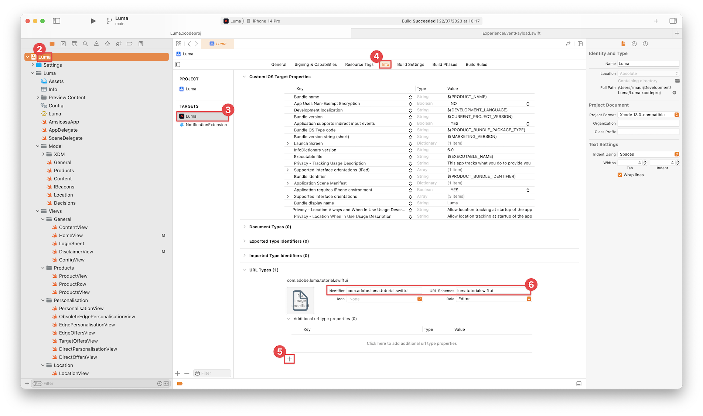

# Einrichten der Sicherheit

Erfahren Sie, wie Sie Adobe Experience Platform Assurance in einer Mobile App einrichten.

Assurance, formell als Project Griffon bekannt, soll Ihnen dabei helfen, zu untersuchen, zu testen, zu simulieren und zu überprüfen, wie Sie Daten erfassen oder Erlebnisse in Ihrer mobilen App bereitstellen.

Mithilfe von &quot;Assurance&quot;können Sie unformatierte SDK-Ereignisse überprüfen, die vom Adobe Experience Platform Mobile SDK generiert wurden. Alle vom SDK erfassten Ereignisse stehen zur Überprüfung zur Verfügung. SDK-Ereignisse werden in einer Listenansicht geladen, sortiert nach Zeit. Jedes Ereignis verfügt über eine detaillierte Ansicht, die weitere Details enthält. Zusätzliche Ansichten zum Durchsuchen von SDK-Konfigurationen, Datenelementen, freigegebenen Status und SDK-Erweiterungsversionen werden ebenfalls bereitgestellt. Weitere Informationen zum [Assurance](https://experienceleague.adobe.com/docs/experience-platform/assurance/home.html?lang=de) in der Produktdokumentation.


## Voraussetzungen

* Richten Sie die App erfolgreich mit installierten und konfigurierten SDKs ein.

## Lernziele

In dieser Lektion werden Sie:

* Vergewissern Sie sich, dass Ihr Unternehmen Zugriff hat (und fordern Sie ihn an, falls nicht möglich).
* Richten Sie Ihre Basis-URL ein.
* Fügen Sie erforderlichen iOS-spezifischen Code hinzu.
* Stellen Sie eine Verbindung zu einer Sitzung her.

## Zugriff bestätigen

Vergewissern Sie sich, dass Ihr Unternehmen Zugriff auf die Zertifizierung hat. Als Benutzer sollten Sie zum Profil für Adobe Experience Platform hinzugefügt werden. Siehe [Benutzerzugriff](https://experienceleague.adobe.com/docs/experience-platform/assurance/user-access.html?lang=en) im Zuverlässigkeitshandbuch für weitere Informationen.

## Implementierung

Neben der allgemeinen [SDK-Installation](install-sdks.md)Wenn Sie in der vorherigen Lektion abgeschlossen haben, erfordert iOS auch den folgenden Zusatz, um die Assurance-Sitzung für Ihre App zu starten.

1. Navigieren Sie zu **[!DNL Luma]** > **[!DNL Luma]** > **[!UICONTROL SceneDelegate]** im Projektnavigator Ihres Xcode-Codes ein.

1. Fügen Sie folgenden Code zu `func scene(_ scene: UIScene, openURLContexts URLContexts: Set<UIOpenURLContext>` hinzu:

   ```swift
   // Called when the app in background is opened with a deep link.
   if let deepLinkURL = URLContexts.first?.url {
       // Start the Assurance session
       Assurance.startSession(url: deepLinkURL)
   }
   ```

   Dieser Code startet eine Sicherheitssitzung, wenn sich die App im Hintergrund befindet und über einen Deep-Link geöffnet wird.

Weitere Informationen finden Sie [hier](https://developer.adobe.com/client-sdks/documentation/platform-assurance-sdk/api-reference/){target="_blank"}.

<!-- not initially required

## Signing

Signing the application is only required for the [Create and send push notifications](journey-optimizer-push.md) and the [Create and send in-app messages](journey-optimizer-inapp.md) lessons in this tutorial. These lessons require an Apple provisioning profile which **requires a paid Apple developer account**.

To update the signing for the lessons that require that you sign the application:

1. Open the project in Xcode.
1. Select **[!DNL Luma]** in the Project navigator.
1. Select the **[!DNL Luma]** target.
1. Select the **Signing & Capabilities** tab.
1. Configure **[!UICONTROL Automatic manage signing]**, **[!UICONTROL Team]**, and **[!UICONTROL Bundle Identifier]**, or use your specific Apple development provisioning details. 
 
   >[!IMPORTANT]
   >
   >Ensure you use a _unique_ bundle identifier and replace the `com.adobe.luma.tutorial.swiftui` bundle identifier, as each bundle identifier needs to be unique. Typically, you use a reverse-DNS format for bundle ID strings, like `com.organization.brand.uniqueidentifier`. The Finished version of this tutorial, for example, uses `com.adobe.luma.tutorial.swiftui`.


    {zoomable="yes"}

-->

## Einrichten einer Basis-URL

1. Wechseln Sie zu Ihrem Projekt in Xcode.
1. Auswählen **[!DNL Luma]** im Projekt-Navigator.
1. Wählen Sie die **[!DNL Luma]** Zielgruppe.
1. Wählen Sie die **Info** Registerkarte.
1. Um eine Basis-URL hinzuzufügen, scrollen Sie nach unten zu **URL-Typen** und wählen Sie die **+** Schaltfläche.
1. Satz **Kennung** auf die Bundle-ID Ihrer Wahl klicken und eine **URL-Schemata** Ihrer Wahl .

   

   >[!IMPORTANT]
   >
   >Stellen Sie sicher, dass Sie eine _eindeutig_ Bundle-ID und ersetzen Sie `com.adobe.luma.tutorial.swiftui` Bundle-Kennung, da jede Bundle-ID eindeutig sein muss. In der Regel verwenden Sie ein Reverse-DNS-Format für Bundle-ID-Zeichenfolgen, z. B. `com.organization.brand.uniqueidentifier`.<br/>Verwenden Sie auf ähnliche Weise ein eindeutiges URL-Schema und ersetzen Sie die bereits bereitgestellten `lumatutorialswiftui` mit Ihrem eindeutigen URL-Schema.

Weitere Informationen zu URL-Schemata in iOS finden Sie unter [Dokumentation zu Apple](https://developer.apple.com/documentation/xcode/defining-a-custom-url-scheme-for-your-app){target="_blank"}.

Assurance funktioniert durch Öffnen einer URL, entweder über einen Browser oder QR-Code. Diese URL beginnt mit der Basis-URL, die die App öffnet und zusätzliche Parameter enthält. Diese eindeutigen Parameter werden verwendet, um die Sitzung zu verbinden.


## Herstellen einer Verbindung zu einer Sitzung

In Xcode:

1. Erstellen Sie die App im Simulator oder auf einem physischen Gerät aus Xcode neu und führen Sie sie mithilfe von .

   >[!TIP]
   >
   >Optional können Sie Ihren Build &quot;bereinigen&quot;, insbesondere wenn unerwartete Ergebnisse angezeigt werden. Wählen Sie dazu **[!UICONTROL Bereinigen Sie den Build-Ordner...]** aus dem Xcode **[!UICONTROL Produkt]** Menü.


1. Im **[!UICONTROL &quot;Luma App&quot;darf Ihren Standort verwenden]** Dialogfeld auswählen **[!UICONTROL Zulassen bei Verwendung der App]**.

   

1. Im **[!UICONTROL &quot;Luma App&quot;möchte Ihnen Benachrichtigungen senden]** Dialogfeld auswählen **[!UICONTROL Zulassen]**.

   

1. Auswählen **[!UICONTROL Weiter...]** , damit die App Ihre Aktivität verfolgen kann.

   

1. Im **[!UICONTROL &quot;Luma App&quot;erlauben, Ihre Aktivität über die App und Websites anderer Unternehmen hinweg zu verfolgen]** Dialogfeld auswählen **[!UICONTROL Zulassen]**.

   


In Ihrem Browser:

1. Rufen Sie die Benutzeroberfläche für die Datenerfassung auf.
1. Auswählen **[!UICONTROL Assurance]** über die linke Leiste.
1. Auswählen **[!UICONTROL Sitzung erstellen]**.
1. Auswählen **[!UICONTROL Starten]**.
1. Stellen Sie eine **[!UICONTROL Sitzungsname]** wie `Luma Mobile App Session` und **[!UICONTROL Basis-URL]**; dies sind die URL-Schemas, die Sie in Xcode eingegeben haben, gefolgt von `://` Beispiel: `lumatutorialswiftui://`
1. Klicken Sie auf **[!UICONTROL Weiter]**.
   
1. Im **[!UICONTROL Neue Sitzung erstellen]** modaler Dialog:

   Wenn Sie ein physisches Gerät verwenden:

   * Auswählen **[!UICONTROL QR-Code scannen]**. Verwenden Sie Ihre Kamera auf Ihrem physischen Gerät, um den QR-Code zu scannen, und tippen Sie auf den Link, um die App zu öffnen.

     

   Wenn Sie einen Simulator verwenden:

   1. Auswählen **[!UICONTROL Link kopieren]**.
   1. Kopieren Sie den Deep-Link mit   und verwenden Sie den Deep-Link, um die App mit Safari im Simulator zu öffnen.
      

1. Wenn die App geladen wird, wird Ihnen ein modales Dialogfeld angezeigt, in dem Sie aufgefordert werden, die in Schritt 7 dargestellte PIN einzugeben.

   

   Geben Sie die PIN ein und wählen Sie **[!UICONTROL Verbinden]**.


1. Wenn die Verbindung erfolgreich hergestellt wurde, sehen Sie Folgendes:
   * Ein Zuverlässigkeitssymbol, das über der App angezeigt wird.

     

   * Experience Cloud-Updates in der Assurance-Benutzeroberfläche, die Folgendes zeigen:

      1. Erlebnisereignisse aus der App.
      1. Details eines ausgewählten Ereignisses.
      1. Gerät und Timeline.

         

Wenn Sie auf Herausforderungen stoßen, lesen Sie bitte die [technisch](https://developer.adobe.com/client-sdks/documentation/platform-assurance-sdk/){target="_blank"} and [general documentation](https://experienceleague.adobe.com/docs/experience-platform/assurance/home.html?lang=de){target="_blank"}.


## Überprüfen von Erweiterungen

So überprüfen Sie, ob Ihre App die aktuellsten Erweiterungen verwendet:

1. Auswählen **[!UICONTROL Konfigurieren]**.

1. Auswählen  für  **[!UICONTROL Erweiterungsversionen]**.

1. Wählen Sie **[!UICONTROL Speichern]** aus.

   

1. Auswählen  **[!UICONTROL Erweiterungsversionen]**. Es wird ein Überblick über die neuesten verfügbaren Erweiterungen und die in Ihrer Version des Programms verwendeten Erweiterungen angezeigt.

   

1. So aktualisieren Sie Ihre Erweiterungsversionen (z. B. **[!UICONTROL Messaging]** und **[!UICONTROL Optimieren]**), wählen Sie in Xcode für die spezifischen Erweiterungen, für die ein Upgrade erforderlich ist, das Paket (Erweiterung) aus **[!UICONTROL Paketabhängigkeiten]** (z. B. **[!UICONTROL AGPessaging]**) und wählen Sie im Kontextmenü die Option **[!UICONTROL Paket aktualisieren]**. Xcode aktualisiert die Paketabhängigkeiten.


>[!NOTE]
>
>Wenn Sie Ihre Erweiterungen (Pakete) in Xcode aktualisiert haben, müssen Sie Ihre aktuelle Sitzung schließen und löschen und alle Schritte von [Herstellen einer Verbindung zu einer Sitzung](#connecting-to-a-session) und [Überprüfen von Erweiterungen](#verify-extensions) , um sicherzustellen, dass die Zuverlässigkeitserklärung die korrekten Erweiterungen in einer neuen Zuverlässigkeitssitzung ordnungsgemäß meldet.


>[!SUCCESS]
>
>Sie haben Ihre App jetzt so eingerichtet, dass sie für den Rest des Tutorials Assurance verwendet.<br/>Vielen Dank, dass Sie Ihre Zeit investiert haben, um mehr über das Adobe Experience Platform Mobile SDK zu erfahren. Wenn Sie Fragen haben, ein allgemeines Feedback teilen möchten oder Vorschläge zu künftigen Inhalten haben, teilen Sie diese bitte mit. [Experience League Community-Diskussionsbeitrag](https://experienceleaguecommunities.adobe.com/t5/adobe-experience-platform-launch/tutorial-discussion-implement-adobe-experience-cloud-in-mobile/td-p/443796)


Weiter: **[Implementieren der Zustimmung](consent.md)**
