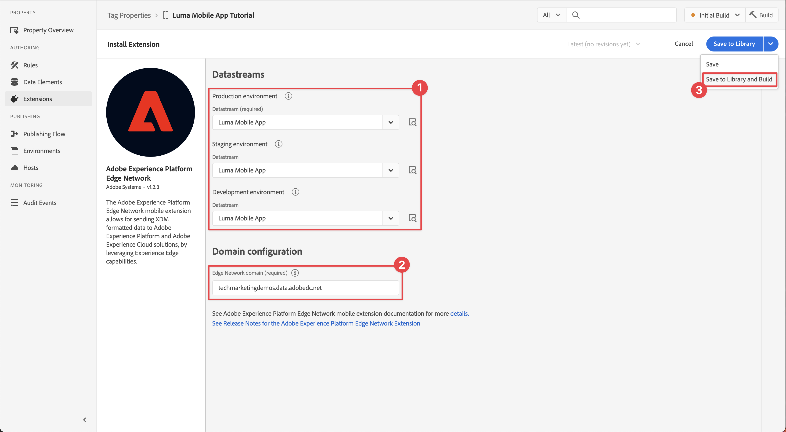

# Konfigurieren einer Tag-Eigenschaft

Erfahren Sie, wie Sie eine Tag-Eigenschaft im [!UICONTROL Datenerfassung] -Schnittstelle.

Tags in Adobe Experience Platform sind die nächste Generation von Funktionen für das Tag-Management von Adobe. Mit Tags können Kunden Analyse-, Marketing- und Werbe-Tags bereitstellen und verwalten, die zur Unterstützung entsprechender Kundenerlebnisse erforderlich sind. Weitere Informationen [Tags](https://experienceleague.adobe.com/docs/experience-platform/tags/home.html?lang=de) in der Produktdokumentation.

## Voraussetzungen

Um die Lektion abzuschließen, müssen Sie über die Berechtigung zum Erstellen einer Tag-Eigenschaft verfügen. Es ist auch hilfreich, ein Grundverständnis mit Tags zu haben.

>[!NOTE]
>
> Platform launch (Client-seitig) ist jetzt [Tags](https://experienceleague.adobe.com/docs/experience-platform/tags/home.html?lang=de)

## Lernziele

In dieser Lektion werden Sie:

* Installieren und konfigurieren Sie die mobilen Tag-Erweiterungen.
* Erstellen Sie die SDK-Installationsanweisungen.

## Ersteinrichtung

1. Erstellen Sie in der Datenerfassungsoberfläche eine neue mobile Tag-Eigenschaft:
   1. Auswählen **[!UICONTROL Tags]** in der linken Navigation.
   1. Wählen Sie **[!UICONTROL Neue Eigenschaft]** aus
      .
   1. Für **[!UICONTROL Name]**, eingeben `Luma Mobile App Tutorial`.
   1. Für **[!UICONTROL Plattform]** auswählen **[!UICONTROL Mobilnummer]**.
   1. Wählen Sie **[!UICONTROL Speichern]** aus.

      

      >[!NOTE]
      >
      > Die standardmäßigen Zustimmungseinstellungen für die Edge-basierten mobilen SDK-Implementierungen, z. B. die in dieser Lektion ausgeführten, stammen aus dem [!UICONTROL Zustimmungserweiterung] und nicht [!UICONTROL Datenschutz] in der Konfiguration der Tag-Eigenschaft fest. Sie können die Erweiterung &quot;Einverständnis&quot;später in dieser Lektion hinzufügen und konfigurieren. Weitere Informationen finden Sie unter [die Dokumentation](https://developer.adobe.com/client-sdks/documentation/privacy-and-gdpr/).

1. Öffnen Sie die neue Eigenschaft.
1. eine Bibliothek erstellen:

   1. Navigieren Sie zu **[!UICONTROL Veröffentlichungsfluss]** in der linken Navigation.
   1. Auswählen **[!UICONTROL Bibliothek hinzufügen]**.

      

   1. Für **[!UICONTROL Name]**, eingeben `Initial Build`.
   1. Für **[!UICONTROL Umgebung]** auswählen **[!UICONTROL Entwicklung (Entwicklung)]**.
   1. Auswählen   **[!UICONTROL Alle geänderten Ressourcen hinzufügen]**.
   1. Auswählen **[!UICONTROL Speichern und in Entwicklung erstellen]**.

      

   1. Wählen Sie abschließend **[!UICONTROL Ursprünglicher Build]** als Arbeitsbibliothek aus **[!UICONTROL Arbeitsbibliothek auswählen]** Menü.
      
1. Überprüfen von Erweiterungen:

   1. Stellen Sie sicher, dass **[!UICONTROL Ursprünglicher Build]** als Standardbibliothek ausgewählt ist.

   1. Wählen Sie **[!UICONTROL Erweiterungen]** in der linken Leiste aus.

   1. Wählen Sie die **[!UICONTROL Installiert]** Registerkarte.

      Die [!UICONTROL Mobile Core] und [!UICONTROL Profil] Erweiterungen sollten vorinstalliert sein.

      

## Erweiterungskonfiguration

1. Stellen Sie sicher, dass **[!UICONTROL Erweiterungen]** in der Eigenschaft Ihrer mobilen App.

1. Auswählen **[!UICONTROL Katalog]**.

   

1. Verwenden Sie die  **[!UICONTROL Suche]** -Feld finden Sie die **Identität** -Erweiterung.

   1. Suchen Sie nach `Identity`.

   2. Wählen Sie die **[!UICONTROL Identität]** -Erweiterung.

   3. Auswählen **[!UICONTROL Installieren]**.

      

   Diese Erweiterung erfordert keine weitere Konfiguration.

1. Verwenden Sie die  **[!UICONTROL Suche]** -Feld zum Suchen und Installieren **AEP Assurance** -Erweiterung.

   Diese Erweiterung erfordert keine weitere Konfiguration.

1. Verwenden Sie die  **[!UICONTROL Suche]** -Feld zum Suchen und Installieren **Einverständnis** -Erweiterung. Im Konfigurationsbildschirm:

   1. Auswählen **[!UICONTROL Ausstehend]**. In diesem Tutorial verwalten Sie das Einverständnis weiter in der Anwendung. Weitere Informationen zur Erweiterung &quot;Einverständnis&quot;finden Sie unter [die Dokumentation](https://developer.adobe.com/client-sdks/documentation/consent-for-edge-network/).
   1. Auswählen **[!UICONTROL In Bibliothek speichern]**.

      

1. Verwenden Sie die  **[!UICONTROL Suche]** -Feld zum Suchen und Installieren **Adobe Experience Platform Edge Network** -Erweiterung.

   1. In **[!UICONTROL Datenspeicher]** wählen Sie **[!UICONTROL Datastream]** , die Sie in der [vorheriger Schritt](create-datastream.md) für jede Umgebung, beispielsweise **[!DNL Luma Mobile App]**.

   1. Wenn sie nicht bereits ausgefüllt sind, geben Sie die **[!UICONTROL Edge Network Domain]** Innerhalb **[!UICONTROL Domänenkonfiguration]**. Die Edge Network-Domäne ist der Name Ihres Unternehmens, gefolgt von `data.adobedc.net`, beispielsweise `techmarketingdemos.data.adobedc.net`.

   1. Aus dem **[!UICONTROL In Bibliothek speichern]** Menü auswählen **[!UICONTROL In Bibliothek speichern und erstellen]**.

      

Ihre Bibliothek ist für die neuen Erweiterungen und Konfigurationen erstellt. Ein erfolgreicher Build wird durch eine ● im **[!UICONTROL Ursprünglicher Build]** Schaltfläche.

## SDK-Installationsanweisungen generieren

1. Auswählen **[!UICONTROL Umgebungen]** über die linke Leiste.

1. Wählen Sie die **[!UICONTROL Entwicklung]** Installationssymbol  .

   

1. Im **[!UICONTROL Installationsanweisungen für Mobilgeräte]** wählen Sie das **[!UICONTROL iOS]** Registerkarte.

1. Sie können  Anweisungen zum Einrichten Ihres Projekts mit CocoaPods. CocoaPods werden zur Verwaltung von SDK-Versionen und -Downloads verwendet. Weitere Informationen finden Sie unter [Cocoapods-Dokumentation](https://cocoapods.org/). Wenn Sie Android als Entwicklungsplattform verwenden, ist Gradle das Tool zum Verwalten von SDK-Versionen, Downloads und Abhängigkeiten. Weitere Informationen finden Sie unter [Gradle-Dokumentation](https://gradle.org/)

   Die Installationsanweisungen bieten einen guten Ausgangspunkt für die Implementierung. Weitere Informationen finden Sie unter [here](https://developer.adobe.com/client-sdks/documentation/getting-started/get-the-sdk/).

   >[!INFO]
   >
   >Für die restliche Anleitung werden Sie **not** Verwenden Sie die CocoaPods-Anweisungen, sondern stattdessen ein natives Swift Package Manager (SPM)-basiertes Setup.
   >

1. Wählen Sie die **[!UICONTROL Swift]** Registerkarte unten **[!UICONTROL Initialisierungscode hinzufügen]**. Dieser Codeblock zeigt, wie Sie die erforderlichen SDKs importieren und die Erweiterungen beim Start registrieren. Weitere Informationen hierzu finden Sie unter [SDKs installieren](install-sdks.md).

1. Kopieren  die **[!UICONTROL Umgebungsdatei-ID]** und speichern Sie es an einem Ort, wie Sie es später benötigen. Diese eindeutige ID verweist auf Ihre Entwicklungsumgebung. Jede Umgebung (Produktion, Staging, Entwicklung) verfügt über einen eigenen eindeutigen ID-Wert.

   

>[!NOTE]
>
>Die Installationsanweisungen sollten als Ausgangspunkt und nicht als endgültige Dokumentation betrachtet werden. Die neuesten SDK-Versionen und Codebeispiele finden Sie in der offiziellen [Dokumentation](https://developer.adobe.com/client-sdks/documentation/).

## Architektur von mobilen Tags

Wenn Sie mit der Webversion von Tags (früher Launch) vertraut sind, müssen Sie die Unterschiede auf Mobilgeräten kennen.

* Im Web wird eine Tag-Eigenschaft in JavaScript gerendert, das dann (normalerweise) in der Cloud gehostet wird. Diese JavaScript-Datei wird direkt auf der Website referenziert.

* In einer mobilen Tag-Eigenschaft werden Regeln und Konfigurationen in JSON-Dateien gerendert, die in der Cloud gehostet werden. Die JSON-Dateien werden von der Mobile Core-Erweiterung in der Mobile App heruntergeladen und gelesen. Erweiterungen sind separate SDKs, die zusammenarbeiten. Wenn Sie Ihrer Tag-Eigenschaft eine Erweiterung hinzufügen, müssen Sie auch die App aktualisieren. Wenn Sie eine Erweiterungseinstellung ändern oder eine Regel erstellen, werden diese Änderungen in der App übernommen, sobald Sie die aktualisierte Tag-Bibliothek veröffentlichen. Dank dieser Flexibilität können Sie Einstellungen ändern (z. B. die Report Suite-ID von Adobe Analytics) oder sogar das Verhalten Ihrer App ändern (mithilfe von Datenelementen und Regeln, wie Sie in späteren Lektionen sehen werden), ohne den Code in Ihrer App ändern zu müssen und die App erneut an den Appstore zu senden.

>[!SUCCESS]
>
>Sie verfügen jetzt über eine mobile Tag-Eigenschaft, die im Rest dieses Tutorials verwendet werden kann. Vielen Dank, dass Sie Ihre Zeit investiert haben, um mehr über das Adobe Experience Platform Mobile SDK zu erfahren. Wenn Sie Fragen haben, ein allgemeines Feedback oder Vorschläge zu künftigen Inhalten teilen möchten, teilen Sie diese hier mit. [Experience League Community-Diskussionsbeitrag](https://experienceleaguecommunities.adobe.com/t5/adobe-experience-platform-launch/tutorial-discussion-implement-adobe-experience-cloud-in-mobile/td-p/443796)

Weiter: **[SDKs installieren](install-sdks.md)**
