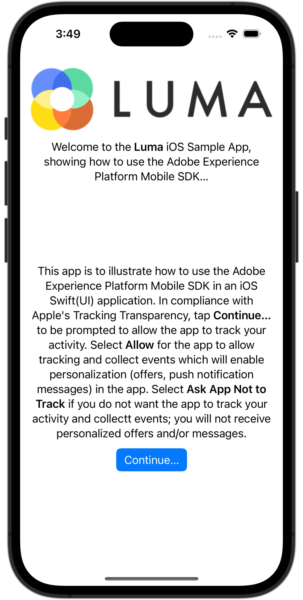

# Implementieren der Zustimmung

Erfahren Sie, wie Sie die Zustimmung in eine Mobile App implementieren.

Die mobile Adobe Experience Platform-Erweiterung &quot;Einverständnis&quot;ermöglicht die Erfassung von Zustimmungsvoreinstellungen von Ihrer mobilen App bei Verwendung des Adobe Experience Platform Mobile SDK und der Edge Network-Erweiterung. Weitere Informationen zum [Zustimmungserweiterung](https://developer.adobe.com/client-sdks/documentation/consent-for-edge-network/), in der Dokumentation.

## Voraussetzungen

* App erfolgreich erstellt und ausgeführt, wobei SDKs installiert und konfiguriert sind.

## Lernziele

In dieser Lektion werden Sie:

* Fordern Sie den Benutzer zur Zustimmung auf.
* Aktualisieren Sie die Erweiterung basierend auf der Benutzerantwort.
* Erfahren Sie, wie Sie den aktuellen Status der Zustimmung erhalten.

## Einverständnisersuchen

Wenn Sie das Tutorial von Anfang an befolgt haben, erinnern Sie sich möglicherweise daran, dass Sie die standardmäßige Zustimmung in der Erweiterung &quot;Einverständnis&quot;auf **[!UICONTROL Ausstehend - Queue-Ereignisse, die auftreten, bevor der Benutzer Zustimmungseinstellungen bereitstellt.]**

Um mit der Datenerfassung zu beginnen, müssen Sie die Zustimmung des Benutzers einholen. In diesem Tutorial erhalten Sie das Einverständnis des Benutzers, indem Sie ihn einfach mit einem Warnhinweis anfordern. In einer realen App möchten Sie die Best Practices für die Zustimmung für Ihre Region konsultieren.

1. Sie möchten den Benutzer nur einmal fragen. Daher möchten Sie die Mobile SDK-Zustimmung mit den erforderlichen Berechtigungen zum Tracking mit Apples [App Tracking Transparency Framework](https://developer.apple.com/documentation/apptrackingtransparency). In dieser App gehen Sie davon aus, dass der Benutzer bei der Autorisierung des Trackings auch der Erfassung von Ereignissen zustimmt.

1. Navigieren Sie zu **[!DNL Luma]** > **[!DNL Luma]** > **[!DNL Utils]** > **[!UICONTROL MobileSDK]** im Xcode-Projektnavigator.

   Fügen Sie diesen Code zum `updateConsent` -Funktion.

   ```swift
   // Update consent
   let collectConsent = ["collect": ["val": value]]
   let currentConsents = ["consents": collectConsent]
   Consent.update(with: currentConsents)
   MobileCore.updateConfigurationWith(configDict: currentConsents)
   ```

1. Navigieren Sie zu **[!DNL Luma]** > **[!DNL Luma]** > **[!DNL Views]** > **[!DNL General]** > **[!UICONTROL DisclaimerView]** im Projektnavigator von Xcode, der die Ansicht ist, die nach der ersten Installation oder Neuinstallation der Anwendung und dem ersten Starten der App angezeigt wird. Der Benutzer wird aufgefordert, das Tracking pro Apple zu autorisieren. [App Tracking Transparency Framework](https://developer.apple.com/documentation/apptrackingtransparency). Wenn der Benutzer autorisiert, aktualisieren Sie auch die Zustimmung.

   Fügen Sie den folgenden Code zum `ATTrackingManager.requestTrackingAuthorization { status in` Schließung.

   ```swift
   // Add consent based on authorization
   if status == .authorized {
      // Set consent to yes
      MobileSDK.shared.updateConsent(value: "y")
   }
   else {
      // Set consent to yes
      MobileSDK.shared.updateConsent(value: "n")
   }
   ```

## Aktuellen Zustimmungsstatus abrufen

Die mobile Erweiterung &quot;Einverständnis&quot;unterdrückt/sticht/ermöglicht das Tracking basierend auf dem aktuellen Zustimmungswert automatisch. Sie können auch selbst auf den aktuellen Zustimmungsstatus zugreifen:

1. Navigieren Sie zu **[!DNL Luma]** > **[!DNL Luma]** > **[!DNL Utils]** > **[!UICONTROL MobileSDK]** im Projektnavigator von Xcode.

   Fügen Sie den folgenden Code zum `getConsents` Funktion:

   ```swift
   // Get consents
   Consent.getConsents { consents, error in
      guard error == nil, let consents = consents else { return }
      guard let jsonData = try? JSONSerialization.data(withJSONObject: consents, options: .prettyPrinted) else { return }
      guard let jsonStr = String(data: jsonData, encoding: .utf8) else { return }
      Logger.aepMobileSDK.info("Consent getConsents: \(jsonStr)")
   }
   ```

2. Navigieren Sie zu **[!DNL Luma]** > **[!DNL Luma]** > **[!DNL Views]** > **[!DNL General]** > **[!UICONTROL HomeView]** im Projektnavigator von Xcode.

   Fügen Sie den folgenden Code zum `.task` modifier:

   ```swift
   // Ask status of consents
   MobileSDK.shared.getConsents()   
   ```

Im obigen Beispiel protokollieren Sie einfach den Zustimmungsstatus in Xcode in der Konsole. In einem realen Szenario können Sie damit ändern, welche Menüs oder Optionen dem Benutzer angezeigt werden.

## Validierung mit Versicherung

1. Überprüfen Sie die [Assurance](assurance.md) Lektion.
1. Installieren Sie das Programm.
1. Starten Sie die App mithilfe der durch die Versicherung generierten URL.
1. Wenn Sie den obigen Code korrekt hinzugefügt haben, werden Sie aufgefordert, die Zustimmung zu erteilen.

   Auswählen **[!UICONTROL Weiter...]** und wählen Sie **[!UICONTROL Zulassen]**.

    
   

1. Sie sollten eine **[!UICONTROL Zustimmungsantwort abrufen]** -Ereignis in der Assurance-Benutzeroberfläche.
   


>[!SUCCESS]
>
>Sie haben Ihre App jetzt aktiviert, um den Benutzer beim ersten Start nach der Installation (oder Neuinstallation) aufzufordern, die Verwendung des Adobe Experience Platform Mobile SDK zu genehmigen.<br/>Vielen Dank, dass Sie Ihre Zeit investiert haben, um mehr über das Adobe Experience Platform Mobile SDK zu erfahren. Wenn Sie Fragen haben, ein allgemeines Feedback oder Vorschläge zu künftigen Inhalten teilen möchten, teilen Sie diese hier mit. [Experience League Community-Diskussionsbeitrag](https://experienceleaguecommunities.adobe.com/t5/adobe-experience-platform-launch/tutorial-discussion-implement-adobe-experience-cloud-in-mobile/td-p/443796)

Weiter: **[Lebenszyklusdaten erfassen](lifecycle-data.md)**
