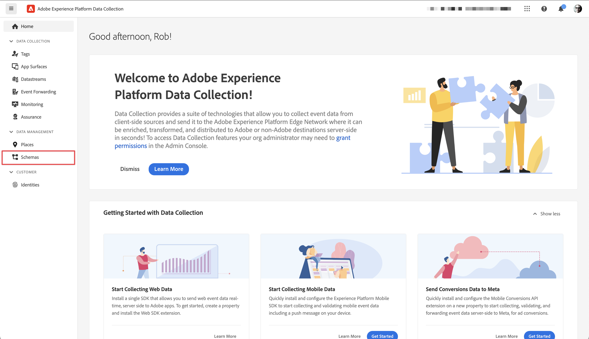

# Erstellen eines XDM-Schemas

Erfahren Sie, wie Sie ein XDM-Schema für App-Ereignisse erstellen.

Standardisierung und Interoperabilität sind Schlüsselkonzepte von Adobe Experience Platform. Das von Adobe unterstützte Experience-Datenmodell (XDM) ermöglicht die Standardisierung von Kundenerlebnisdaten und die Definition von Schemas für das Customer Experience Management.

## Was sind XDM-Schemata?

XDM ist eine öffentlich dokumentierte Spezifikation, die die Leistungsfähigkeit digitaler Erlebnisse verbessern soll. Es bietet allgemeine Strukturen und Definitionen, die es jeder Anwendung ermöglichen, mit Platform-Diensten zu kommunizieren. Durch die Einhaltung von XDM-Standards können alle Kundenerlebnisdaten in ein gemeinsames System integriert werden, wodurch Erkenntnisse schneller und besser integriert verfügbar werden. Sie erhalten wertvolle Einblicke aus Kundenaktionen, definieren Kundenzielgruppen über Segmente und verwenden Kundenattribute für Personalisierungszwecke.

Schemas dienen in Experience Platform zur konsistenten und wiederverwendbaren Beschreibung der Struktur von Daten. Durch die systemübergreifende einheitliche Definition von Daten wird es einfacher, deren Bedeutung beizubehalten und somit Wert aus Daten zu ziehen.

Bevor Daten in Platform aufgenommen werden können, muss ein Schema erstellt werden, das die Datenstruktur beschreibt und den Datentyp entsprechend des jeweiligen Feldes einschränkt. Schemas bestehen aus einer Basisklasse und keiner oder mehreren Schema-Feldergruppen.

Weitere Informationen zum Schema-Kompositionsmodell, einschließlich Designgrundsätzen, und Best Practices finden Sie in der [Grundlagen der Schemakomposition](https://experienceleague.adobe.com/docs/experience-platform/xdm/schema/composition.html?lang=de) oder des Kurses [Modellieren Ihrer Kundenerlebnisdaten mit XDM](https://experienceleague.adobe.com/?recommended=ExperiencePlatform-D-1-2021.1.xdm&amp;lang=de).

>[!TIP]
>
>Wenn Sie mit Analytics Solution Design Reference (SDRs) vertraut sind, können Sie sich ein Schema als robustere SDR vorstellen. Siehe [Erstellen und Verwalten eines SDR-Dokuments (Solution Design Reference)](https://experienceleague.adobe.com/docs/analytics-learn/tutorials/implementation/implementation-basics/creating-and-maintaining-an-sdr.html?lang=de) für weitere Informationen.

## Voraussetzungen

Um die Lektion abzuschließen, müssen Sie über die Berechtigung zum Erstellen eines Experience Platform-Schemas verfügen.

## Lernziele

In dieser Lektion werden Sie:

* Erstellen eines Schemas in der Datenerfassungsoberfläche
* Hinzufügen einer Standardfeldgruppe zum Schema
* Erstellen und Hinzufügen einer benutzerdefinierten Feldergruppe zum Schema

## Navigieren zu Schemata

1. Melden Sie sich bei Adobe Experience Cloud an.

1. Stellen Sie sicher, dass Sie sich in der Experience Platform-Sandbox befinden, die Sie für dieses Tutorial verwenden.

1. App-Umschalter öffnen   (oben rechts),

1. Auswählen **[!UICONTROL Datenerfassung]** aus dem Menü.

   

   >[!NOTE]
   >
   > Kunden von Platform-basierten Anwendungen wie Real-Time CDP sollten für dieses Tutorial eine Entwicklungs-Sandbox verwenden. Andere Kunden verwenden die standardmäßige Produktions-Sandbox.

1. Auswählen **[!UICONTROL Schemas]** under **[!UICONTROL Data Management]** in der linken Leiste.

   

Sie befinden sich nun auf der Hauptseite der Schemas und erhalten eine Liste der vorhandenen Schemas. Sie können auch Registerkarten sehen, die den Kernbausteinen eines Schemas entsprechen:

* **Feldergruppen** sind wiederverwendbare Komponenten, die ein oder mehrere Felder definieren, um bestimmte Daten zu erfassen, z. B. persönliche Details, Hotelpräferenzen oder Adressen.
* **Klassen** definieren die Verhaltensaspekte der Daten, die das Schema enthält. Beispiel: `XDM ExperienceEvent` erfasst Zeitreihen, Ereignisdaten und `XDM Individual Profile` erfasst Attributdaten zu einer Person.
* **Datentypen** werden als Referenzfeldtypen in Klassen oder Feldgruppen auf die gleiche Weise wie grundlegende literale Felder verwendet.

Die obigen Beschreibungen geben einen Überblick auf hoher Ebene. Weitere Informationen finden Sie unter [Schema-Bausteine](https://experienceleague.adobe.com/docs/platform-learn/tutorials/schemas/schema-building-blocks.html?lang=de) Video oder lesen [Grundlagen der Schemakomposition](https://experienceleague.adobe.com/docs/experience-platform/xdm/schema/composition.html?lang=de) in der Produktdokumentation.

In diesem Tutorial verwenden Sie die Feldergruppe &quot;Consumer Experience Event&quot;und erstellen eine benutzerdefinierte, um den Prozess zu demonstrieren.

>[!NOTE]
>
>Adobe fügt weiterhin mehr Standardfeldgruppen hinzu und sollten nach Möglichkeit verwendet werden, da diese Felder implizit von Experience Platform-Diensten verstanden werden und bei der Verwendung über Plattformkomponenten hinweg eine größere Konsistenz gewährleistet ist. Die Verwendung von Standardfeldgruppen bietet greifbare Vorteile wie die automatische Zuordnung in Analytics- und AI-Funktionen in Platform.

## Architektur des Luma-App-Schemas

In einem realen Szenario könnte der Schemaentwurfsprozess wie folgt aussehen:

* Sammeln Sie Geschäftsanforderungen.
* Suchen Sie nach vordefinierten Feldergruppen, um so viele Anforderungen wie möglich abzudecken.
* Erstellen Sie benutzerdefinierte Feldergruppen für Lücken.

Zu Lernzwecken verwenden Sie vordefinierte und benutzerdefinierte Feldergruppen.

* **Ereignis für Kundenerlebnisse**: Vordefinierte Feldergruppe mit vielen gemeinsamen Feldern.
* **App-Informationen**: Benutzerdefinierte Feldergruppe, die für die Nachahmung von TrackState-/TrackAction-Analytics-Konzepten entwickelt wurde.

<!--Later in the tutorial, you can [update the schema](lifecycle-data.md) to include the **[!UICONTROL AEP Mobile Lifecycle Details]** field group.-->

## Erstellen eines Schemas

1. Auswählen **[!UICONTROL Schema erstellen]**.

1. Auswählen **[!UICONTROL XDM ExperienceEvent]** aus dem Menü.

   

1. Auswählen  **Hinzufügen** neben **[!UICONTROL Feldergruppen]**.

   

1. Suchen Sie nach `Consumer Experience Event`.

1. Auswählen  um eine Vorschau der Felder anzuzeigen und/oder die Beschreibung zu lesen, um weitere Details zu erhalten, bevor Sie eine Feldergruppe auswählen.

1. Auswählen **Ereignis für Kundenerlebnisse**.

1. Wählen Sie **[!UICONTROL Feldergruppen hinzufügen]** aus.

   

   Sie gelangen zurück zum Bildschirm zur Hauptschemakomposition, wo Sie alle verfügbaren Felder sehen können.

1. Geben Sie Ihrem Schema einen Namen, indem Sie **[!UICONTROL Unbenanntes Schema]** aus dem **[!UICONTROL Komposition]** Bereich (unter **[!UICONTROL Schema]**) und die Bereitstellung einer **[!UICONTROL Anzeigename]** &amp; **[!UICONTROL Beschreibung]**, beispielsweise `Luma Mobile App Event Schema` und `Schema for Luma mobile app experience events.`

   >[!NOTE]
   >
   >Wenn Sie dieses Tutorial mit mehreren Personen in einer Sandbox durchlaufen oder ein freigegebenes Konto verwenden, sollten Sie erwägen, im Rahmen Ihrer Benennungskonventionen eine Identität anzuhängen oder vorzustellen. Verwenden Sie beispielsweise `Luma Mobile App Event Schema - Joe Smith` statt `Luma Mobile App Event Schema`. Siehe auch den Hinweis unter [Übersicht](overview.md).

1. Wählen Sie **[!UICONTROL Speichern]** aus.

   

>[!NOTE]
>
>Beachten Sie, dass nicht alle Felder einer Gruppe verwendet werden müssen. Sie können Felder auch entfernen, wenn dies dazu beiträgt, das Schema kurz und verständlich zu halten. Wenn es hilfreich ist, können Sie sich ein Schema als leere Datenschicht vorstellen. In Ihrer App füllen Sie die entsprechenden Werte zum richtigen Zeitpunkt aus.

Die [!UICONTROL Ereignis für Kundenerlebnisse] Feldergruppe hat einen Datentyp namens [!UICONTROL Webinformationen], der Ereignisse wie Seitenansichten und Link-Klicks beschreibt. Zum Zeitpunkt des Schreibens gibt es keine App-Parität für diese Funktion. Daher erstellen Sie Ihre eigene.

## Erstellen eines benutzerdefinierten Datentyps

Erstellen Sie zunächst einen benutzerdefinierten Datentyp, der die beiden Ereignisse beschreibt:

* Bildschirmansicht
* App-Interaktion

1. Wählen Sie die **[!UICONTROL Datentypen]** Registerkarte.

1. Auswählen **[!UICONTROL Erstellen eines Datentyps]**.

   

1. Stellen Sie eine **[!UICONTROL Anzeigename]** und **[!UICONTROL Beschreibung]**, beispielsweise `App Information` und `Custom data type describing "Screen Views" & "App Actions"`

   

   >[!TIP]
   >
   > Immer lesbar, beschreibend verwenden [!UICONTROL Anzeigenamen] für Ihre benutzerdefinierten Felder verwenden, da diese Vorgehensweise Marketing-Experten den Zugriff darauf erleichtert, wenn die Felder in nachgelagerten Diensten wie dem Segment Builder angezeigt werden.

1. Um ein Feld hinzuzufügen, wählen Sie die  Schaltfläche.

1. Dieses Feld ist ein Container-Objekt für App-Interaktionen. Geben Sie daher eine Binnenmajuskel-Schreibweise an. **[!UICONTROL Feldname]** `appInteraction`, **[!UICONTROL Anzeigename]** `App Interaction`und wählen Sie `Object` aus dem **[!UICONTROL Typ]** Liste.

1. Wählen Sie **[!UICONTROL Anwenden]** aus.

   

1. Um zu messen, wie oft eine Aktion stattgefunden hat, fügen Sie ein Feld hinzu, indem Sie die  Schaltfläche neben **[!UICONTROL appInteraction]** -Objekt, das Sie erstellt haben.

1. Gib ihm ein Kamelgehäuse **[!UICONTROL Feldname]** `appAction`, **[!UICONTROL Anzeigename]** von `App Action` und **[!UICONTROL Typ]** `Measure`.

   Dieser Schritt entspricht einem Erfolgsereignis in Adobe Analytics.

1. Wählen Sie **[!UICONTROL Anwenden]** aus.

   

1. Fügen Sie ein Feld hinzu, das den Interaktionstyp beschreibt, indem Sie die  Schaltfläche neben **[!UICONTROL appInteraction]** -Objekt.

1. Geben Sie einen **[!UICONTROL Feldname]** `name`, **[!UICONTROL Anzeigename]** von `Name` und **[!UICONTROL Typ]** `String`.

   Dieser Schritt entspricht einer Dimension in Adobe Analytics.

   

1. Scrollen Sie nach unten in der rechten Leiste und wählen Sie **[!UICONTROL Anwenden]**.

1. So erstellen Sie eine `appStateDetails` -Objekt, das **[!UICONTROL Maßnahme]** Feld namens `screenView` und zwei **[!UICONTROL Zeichenfolge]** Felder namens `screenName` und `screenType`führen Sie dieselben Schritte wie beim Erstellen der **[!UICONTROL appInteraction]** -Objekt.

1. Wählen Sie **[!UICONTROL Speichern]** aus.

   

## Benutzerdefinierte Feldergruppe hinzufügen

Fügen Sie nun mithilfe Ihres benutzerdefinierten Datentyps eine benutzerdefinierte Feldergruppe hinzu:

1. Öffnen Sie das Schema, das Sie zuvor in dieser Lektion erstellt haben.

1. Auswählen  **[!UICONTROL Hinzufügen]** neben **[!UICONTROL Feldergruppen]**.

   

1. Wählen Sie **[!UICONTROL Neue Feldergruppe erstellen]** aus.

1. Stellen Sie eine **[!UICONTROL Anzeigename]** und **[!UICONTROL Beschreibung]**, beispielsweise `App Interactions` und `Fields for app interactions`.

1. Wählen Sie **Feldergruppen hinzufügen** aus.

   

1. Wählen Sie im Hauptkomprimierungsbildschirm die Option **[!UICONTROL App-Interaktionen**].

1. Fügen Sie dem Stammverzeichnis des Schemas ein Feld hinzu, indem Sie die  neben dem Schemanamen.

1. Geben Sie in der rechten Leiste einen **[!UICONTROL Feldname]** von `appInformation`, a **[!UICONTROL Anzeigename]** von `App Information`und ein **[!UICONTROL Typ]** von `App Information`.

1. Auswählen **[!UICONTROL App-Interaktionen]** aus dem **[!UICONTROL Feldergruppe]** in der Dropdown-Liste, um die Felder Ihrer neuen Feldergruppe zuzuweisen.

1. Wählen Sie **[!UICONTROL Anwenden]** aus.

1. Wählen Sie **[!UICONTROL Speichern]** aus.

   

>[!NOTE]
>
>Benutzerdefinierte Feldergruppen werden immer unter Ihrer Experience Cloud-Organisationskennung platziert.

>[!SUCCESS]
>
>Sie verfügen jetzt über ein Schema, das für den Rest des Tutorials verwendet werden kann. Vielen Dank, dass Sie Ihre Zeit investiert haben, um mehr über das Adobe Experience Platform Mobile SDK zu erfahren. Wenn Sie Fragen haben, ein allgemeines Feedback oder Vorschläge zu künftigen Inhalten teilen möchten, teilen Sie diese hier mit. [Experience League Community-Diskussionsbeitrag](https://experienceleaguecommunities.adobe.com/t5/adobe-experience-platform-launch/tutorial-discussion-implement-adobe-experience-cloud-in-mobile/td-p/443796).

Weiter: **[Erstellen Sie eine [!UICONTROL datastream]](create-datastream.md)**
