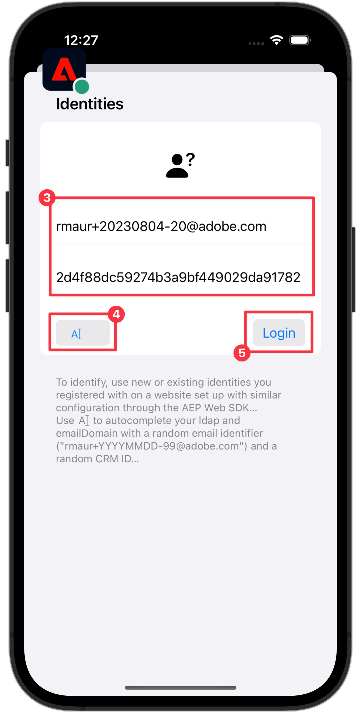

# Identität

Erfahren Sie, wie Sie Identitätsdaten in einer Mobile App erfassen.

Mit Adobe Experience Platform Identity Service erhalten Sie einen besseren Überblick über Ihre Kunden und deren Verhalten, indem Sie Identitäten zwischen Geräten und Systemen überbrücken und so effektive persönliche digitale Erlebnisse in Echtzeit bereitstellen. Identitätsfelder und Namespaces sind der Kleber, der verschiedene Datenquellen verbindet, um das 360-Grad-Echtzeit-Kundenprofil zu erstellen.

Weitere Informationen zum [Identitätserweiterung](https://developer.adobe.com/client-sdks/documentation/identity-for-edge-network/) und [Identitätsdienst](https://experienceleague.adobe.com/docs/experience-platform/identity/home.html?lang=de) in der Dokumentation.

## Voraussetzungen

* App erfolgreich erstellt und ausgeführt, wobei SDKs installiert und konfiguriert sind.

## Lernziele

In dieser Lektion werden Sie:

* Richten Sie einen benutzerdefinierten Identitäts-Namespace ein.
* Identitäten aktualisieren.
* Überprüfen Sie das Identitätsdiagramm.
* Abrufen von ECID und anderen Identitäten.


## Einrichten eines benutzerdefinierten Identitäts-Namespace

Identity-Namespaces sind Komponenten von [Identity Service](https://experienceleague.adobe.com/docs/experience-platform/identity/home.html?lang=de) , die als Indikatoren für den Kontext dienen, auf den sich eine Identität bezieht. Sie identifizieren beispielsweise den Wert `name@email.com` als E-Mail-Adresse oder `443522` als numerische CRM-ID.

1. Wählen Sie in der Datenerfassungsoberfläche die Option **[!UICONTROL Identitäten]** über die Navigationsleiste auf der linken Schiene aus.
1. Wählen Sie **[!UICONTROL Identity-Namespace erstellen]** aus.
1. Stellen Sie eine **[!UICONTROL Anzeigename]** von `Luma CRM ID` und **[!UICONTROL Identitätssymbol]** Wert von `lumaCRMId`.
1. Auswählen **[!UICONTROL Geräteübergreifende ID]**.
1. Wählen Sie **[!UICONTROL Erstellen]** aus.

   


## Identitäten aktualisieren

Sie möchten sowohl die Standardidentität (E-Mail) als auch die benutzerdefinierte Identität (Luma CRM ID) aktualisieren, wenn sich der Benutzer bei der App anmeldet.

1. Navigieren Sie zu **[!UICONTROL Luma]** > **[!UICONTROL Luma]** > **[!UICONTROL Utils]** > **[!UICONTROL MobileSDK]** im Xcode-Projektnavigator und suchen Sie die `func updateIdentities(emailAddress: String, crmId: String)` -Funktionsimplementierung. Fügen Sie der Funktion den folgenden Code hinzu.

   ```swift
   // Set up identity map, add identities to map and update identities
   let identityMap: IdentityMap = IdentityMap()
   
   let emailIdentity = IdentityItem(id: emailAddress, authenticatedState: AuthenticatedState.authenticated)
   let crmIdentity = IdentityItem(id: crmId, authenticatedState: AuthenticatedState.authenticated)
   identityMap.add(item:emailIdentity, withNamespace: "Email")
   identityMap.add(item: crmIdentity, withNamespace: "lumaCRMId")
   
   Identity.updateIdentities(with: identityMap)
   ```

   Dieser Code:

   1. Erstellt eine leere `IdentityMap` -Objekt.

      ```swift
      let identityMap: IdentityMap = IdentityMap()
      ```

   1. Einrichten `IdentityItem` Objekte für E-Mail- und CRM-ID.

      ```swift
      let emailIdentity = IdentityItem(id: emailAddress, authenticatedState: AuthenticatedState.authenticated)
      let crmIdentity = IdentityItem(id: crmId, authenticatedState: AuthenticatedState.authenticated)
      ```

   1. Fügt diese hinzu `IdentityItem` -Objekte `IdentityMap` -Objekt.

      ```swift
      identityMap.add(item:emailIdentity, withNamespace: "Email")
      identityMap.add(item: crmIdentity, withNamespace: "lumaCRMId")
      ```

   1. Sendet die `IdentityItem` -Objekt als Teil der `Identity.updateIdentities` API-Aufruf an das Edge-Netzwerk.

      ```swift
      Identity.updateIdentities(with: identityMap) 
      ```

1. Navigieren Sie zu **[!UICONTROL Luma]** **[!UICONTROL Luma]** > **[!UICONTROL Ansichten]** > **[!UICONTROL Allgemein]** > **[!UICONTROL LoginSheet]** im Xcode Project-Navigator und suchen Sie den Code, der beim Auswählen der **[!UICONTROL Anmelden]** Schaltfläche. Fügen Sie den folgenden Code hinzu:

   ```swift
   // Update identities
   MobileSDK.shared.updateIdentities(emailAddress: currentEmailId, crmId: currentCRMId)                             
   ```


>[!NOTE]
>
>Sie können mehrere Identitäten in einer `updateIdentities` aufrufen. Sie können auch zuvor gesendete Identitäten ändern.


## Identität entfernen

Sie können die [`Identity.removeIdentity`](https://developer.adobe.com/client-sdks/documentation/identity-for-edge-network/api-reference/#removeidentity) API zum Entfernen der Identität aus der gespeicherten clientseitigen Identitätszuordnung. Die ID-Erweiterung sendet die Kennung nicht mehr an das Edge-Netzwerk. Die Verwendung dieser API entfernt die Kennung nicht aus dem serverseitigen Benutzerprofildiagramm oder Identitätsdiagramm.

1. Navigieren Sie zu **[!UICONTROL Luma]** > **[!UICONTROL Luma]** > **[!UICONTROL Allgemein]** > **[!UICONTROL MobileSDK]** im Xcode Project-Navigator und fügen Sie den folgenden Code zum `func removeIdentities(emailAddress: String, crmId: String)` Funktion:

   ```swift
   // Remove identities and reset email and CRM Id to their defaults
   Identity.removeIdentity(item: IdentityItem(id: emailAddress), withNamespace: "Email")
   Identity.removeIdentity(item: IdentityItem(id: crmId), withNamespace: "lumaCRMId")
   currentEmailId = "testUser@gmail.com"
   currentCRMId = "112ca06ed53d3db37e4cea49cc45b71e"
   ```

1. Navigieren Sie zu **[!UICONTROL Luma]** > **[!UICONTROL Luma]** > **[!UICONTROL Ansichten]** > **[!UICONTROL Allgemein]** > **[!UICONTROL LoginSheet]** im Xcode Project-Navigator und suchen Sie den Code, der beim Auswählen der **[!UICONTROL Abmelden]** Schaltfläche. Fügen Sie den folgenden Code hinzu:

   ```swift
   // Remove identities
   MobileSDK.shared.removeIdentities(emailAddress: currentEmailId, crmId: currentCRMId)                  
   ```


## Validierung mit Versicherung

1. Überprüfen Sie die [Einrichtungsanweisungen](assurance.md) und verbinden Sie Ihren Simulator oder Ihr Gerät mit Assurance.
1. In der Luma-App
   1. Wählen Sie die **[!UICONTROL Startseite]** Registerkarte.
   1. Wählen Sie die  rechts oben.

      

   1. Geben Sie eine E-Mail-Adresse und eine CRM-ID an oder
   1. Auswählen  zufällig generieren Sie eine **[!UICONTROL Email]** und **[!UICONTROL CRM-ID]**.
   1. Auswählen **[!UICONTROL Anmelden]**.

      


1. Suchen Sie in der Web-Benutzeroberfläche &quot;Assurance&quot;nach dem **[!UICONTROL Identitäten für Edge-Identitätsaktualisierungen]** -Ereignis aus **[!UICONTROL com.adobe.griffon.mobile]** -Anbieter.
1. Wählen Sie das Ereignis aus und überprüfen Sie die Daten im **[!UICONTROL ACPExtensionEventData]** -Objekt. Sie sollten die von Ihnen aktualisierten Identitäten sehen.
   

## Validieren mit Identitätsdiagramm

Nachdem Sie die Schritte im Abschnitt [Experience Platform-Lektion](platform.md), können Sie die Erfassung des Platzhalters im Identitätsdiagramm-Viewer für Plattformen bestätigen:

1. Auswählen **[!UICONTROL Identitäten]** in der Datenerfassungs-Benutzeroberfläche.
1. Auswählen **[!UICONTROL Identitätsdiagramm]** aus der oberen Leiste.
1. Eingabe `Luma CRM ID` als **[!UICONTROL Identitäts-Namespace]** und Ihrer CRM-ID (z. B. `24e620e255734d8489820e74f357b5c8`) als **[!UICONTROL Identitätswert]**.
1. Sie sehen die **[!UICONTROL Identitäten]** aufgelistet.

   


>[!SUCCESS]
>
>Sie haben Ihre App jetzt so eingerichtet, dass Identitäten im Edge-Netzwerk und (falls eingerichtet) mit Adobe Experience Platform aktualisiert werden.<br/>Vielen Dank, dass Sie Ihre Zeit investiert haben, um mehr über das Adobe Experience Platform Mobile SDK zu erfahren. Wenn Sie Fragen haben, ein allgemeines Feedback oder Vorschläge zu künftigen Inhalten teilen möchten, teilen Sie diese hier mit. [Experience League Community-Diskussionsbeitrag](https://experienceleaguecommunities.adobe.com/t5/adobe-experience-platform-launch/tutorial-discussion-implement-adobe-experience-cloud-in-mobile/td-p/443796)

Weiter: **[Profil](profile.md)**
