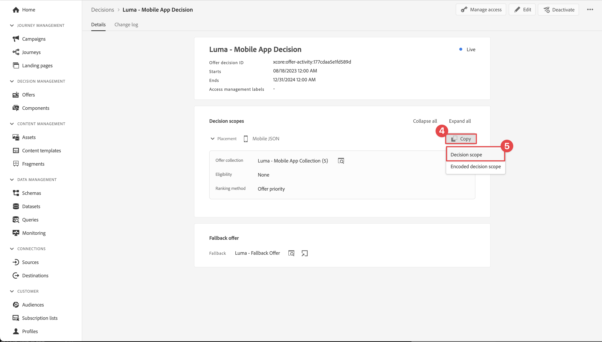

# Angebote erstellen und anzeigen

Erfahren Sie, wie Sie mit dem Experience Platform Mobile SDK Angebote aus Journey Optimizer Decision Management in Ihren mobilen Apps anzeigen können.

Mit der Entscheidungsverwaltung von Journey Optimizer können Sie Ihren Kunden das beste Angebot und Erlebnis für alle Touchpoints zur richtigen Zeit bereitstellen. Danach können Sie Ihre Audience mit personalisierten Angeboten auswählen.


Die Entscheidungsverwaltung erleichtert die Personalisierung mit einer zentralen Bibliothek von Marketing-Angeboten und einer Entscheidungs-Engine, die Regeln und Begrenzungen auf von Adobe Experience Platform erstellte umfangreiche Echtzeit-Profile anwendet. Dadurch können Sie Ihren Kunden das richtige Angebot zum richtigen Zeitpunkt senden. Siehe [Über die Entscheidungsverwaltung](https://experienceleague.adobe.com/docs/journey-optimizer/using/offer-decisioning/get-started-decision/starting-offer-decisioning.html?lang=en) für weitere Informationen.


>[!NOTE]
>
>Diese Lektion ist optional und gilt nur für Journey Optimizer-Benutzer, die die Entscheidungsverwaltungsfunktion verwenden möchten, um Angebote in einer Mobile App anzuzeigen.


## Voraussetzungen

* App erfolgreich erstellt und ausgeführt, wobei SDKs installiert und konfiguriert sind.
* Richten Sie die App für Adobe Experience Platform ein.
* Zugriff auf Journey Optimizer - Entscheidungsverwaltung mit den entsprechenden Berechtigungen zur Verwaltung von Angeboten und Entscheidungen, wie beschrieben [here](https://experienceleague.adobe.com/docs/journey-optimizer/using/access-control/privacy/high-low-permissions.html?lang=en#decisions-permissions).


## Lernziele

In dieser Lektion werden Sie

* Aktualisieren Sie Ihre Edge-Konfiguration für die Entscheidungsverwaltung.
* Aktualisieren Sie Ihre Tag-Eigenschaft mit der Journey Optimizer - Decisioning-Erweiterung.
* Aktualisieren Sie Ihr Schema, um Vorschlagsereignisse zu erfassen.
* Validieren Sie die Einrichtung in &quot;Assurance&quot;.
* Erstellen Sie eine Angebotsentscheidung, die auf Angeboten in Journey Optimizer - Entscheidungsverwaltung basiert.
* Aktualisieren Sie Ihre App, um die Optimizer-Erweiterung zu registrieren.
* Implementieren Sie Angebote aus der Entscheidungsverwaltung in Ihre App.


## Einrichten

>[!TIP]
>
>Wenn Sie Ihre Umgebung bereits als Teil der [Einrichten von A/B-Tests mit Target](target.md) -Lektion verwenden, haben Sie möglicherweise bereits einige der Schritte in diesem Einrichtungsabschnitt ausgeführt.

### Aktualisierung der Konfiguration des Datenspeichers

Um sicherzustellen, dass Daten, die von Ihrer mobilen App an das Edge-Netzwerk gesendet werden, an Journey Optimizer weitergeleitet werden - Entscheidungsverwaltung, aktualisieren Sie Ihre Experience Edge-Konfiguration .

1. Wählen Sie in der Datenerfassungs-Benutzeroberfläche die Option **[!UICONTROL Datenspeicher]** und wählen Sie Ihren Datastream aus, z. B. **[!DNL Luma Mobile App]**.
1. Auswählen  für **[!UICONTROL Experience Platform]** und wählen  **[!UICONTROL Bearbeiten]** aus dem Kontextmenü aus.
1. Im **[!UICONTROL Datenspeicher]** >  >  **[!UICONTROL Adobe Experience Platform]** Bildschirm, stellen Sie sicher **[!UICONTROL Offer decisioning]**, **[!UICONTROL Edge-Segmentierung]**, und **[!UICONTROL Adobe Journey Optimizer]** ausgewählt sind. Wenn Sie auch der Target-Lektion folgen, sollten Sie **[!UICONTROL Personalisierungsziele]** sowie. Siehe [Adobe Experience Platform-Einstellungen](https://experienceleague.adobe.com/docs/experience-platform/datastreams/configure.html?lang=en#aep) für weitere Informationen.
1. Wählen Sie zum Speichern Ihrer Datastream-Konfiguration **[!UICONTROL Speichern]** .

   


### Installieren von Journey Optimizer - Decisioning Tags-Erweiterung

1. Navigieren Sie zu **[!UICONTROL Tags]** und suchen Sie Ihre mobile Tag-Eigenschaft und öffnen Sie die Eigenschaft .
1. Auswählen **[!UICONTROL Erweiterungen]**.
1. Auswählen **[!UICONTROL Katalog]**.
1. Suchen Sie nach **[!UICONTROL Adobe Journey Optimizer - Entscheidungsfindung]** -Erweiterung.
1. Installieren der Erweiterung. Die Erweiterung erfordert keine zusätzliche Konfiguration.

   


### Schema aktualisieren

1. Navigieren Sie zur Datenerfassungsoberfläche und wählen Sie **[!UICONTROL Schemas]** über die linke Leiste.
1. Auswählen **[!UICONTROL Durchsuchen]** aus der oberen Leiste.
1. Wählen Sie Ihr Schema aus, um es zu öffnen.
1. Wählen Sie im Schema-Editor  **[!UICONTROL Hinzufügen]** neben Feldergruppen.
1. Im **[!UICONTROL Feldergruppen hinzufügen]** Dialogfeld,  Suchen nach `proposition`auswählen **[!UICONTROL Erlebnisereignis - Interaktionen bei Vorschlägen]** und wählen **[!UICONTROL Feldergruppen hinzufügen]**. Diese Feldergruppe erfasst die Erlebnisereignisdaten, die für Angebote relevant sind: welches Angebot wird präsentiert, als Teil von Sammlung, Entscheidung und anderen Parametern (siehe weiter unten in dieser Lektion). Aber auch was mit dem Angebot geschieht: wird es angezeigt, interagiert, verworfen usw.
   
1. Auswählen **[!UICONTROL Speichern]** , um die Änderungen an Ihrem Schema zu speichern.


## Validieren der Einrichtung in der Zuverlässigkeitserklärung

So überprüfen Sie Ihre Einrichtung in Assurance:

1. Navigieren Sie zur Benutzeroberfläche &quot;Assurance&quot;.
1. Auswählen **[!UICONTROL Konfigurieren]** Wählen Sie in der linken Leiste  neben **[!UICONTROL Einrichtung überprüfen]** darunter **[!UICONTROL ADOBE JOURNEY OPTIMIZER-ENTSCHEIDUNG]**.
1. Wählen Sie **[!UICONTROL Speichern]** aus.
1. Auswählen **[!UICONTROL Einrichtung überprüfen]** in der linken Leiste. Sowohl die Datastream-Einrichtung als auch das SDK-Setup in Ihrer Anwendung werden validiert.
   


## Angebote erstellen

1. Wählen Sie in der Journey Optimizer-Benutzeroberfläche die Option   **[!UICONTROL Angebote]** von **[!UICONTROL ENTSCHEIDUNGSVERWALTUNG]** in der linken Leiste.
1. Im **[!UICONTROL Angebote]** Bildschirm, auswählen **[!UICONTROL Durchsuchen]** um die Liste der Angebote anzuzeigen.
1. Auswählen **[!UICONTROL Angebot erstellen]**.
1. Im **[!UICONTROL Neues Angebot]** Dialogfeld auswählen **[!UICONTROL Personalisiertes Angebot]** und klicken **[!UICONTROL Nächste]**.
1. Im **[!UICONTROL Details]** Schritt **[!UICONTROL Neues personalisiertes Angebot erstellen]**:
   1. Geben Sie einen **[!UICONTROL Name]** beispielsweise für das Angebot `Luma - Juno Jacket`und geben Sie einen **[!UICONTROL Startdatum und -zeit]** und **[!UICONTROL Enddatum und -zeit]**. Außerhalb dieses Datumsbereichs wird das Angebot nicht von der Entscheidungs-Engine ausgewählt.
   1. Klicken Sie auf **[!UICONTROL Weiter]**.
      

1. Im **[!UICONTROL Hinzufügen von Darstellungen]** Schritt **[!UICONTROL Neues personalisiertes Angebot erstellen]**:
   1. Auswählen  **[!UICONTROL Mobilnummer]** von **[!UICONTROL Kanal]** und wählen Sie **[!UICONTROL Mobile JSON]** aus dem **[!UICONTROL Platzierung]** Liste.
   1. Auswählen **[!UICONTROL Benutzerdefiniert]** für **[!UICONTROL Inhalt]**.
   1. Auswählen **[!UICONTROL Inhalt hinzufügen]**. Im **[!UICONTROL Personalisierung hinzufügen]** dialog:
      1. Geben Sie die folgende JSON ein:

         ```json
         { 
             "title": "Juno Jacket",
             "text": "On colder-than-comfortable mornings, you'll love warming up in the Juno All-Ways Performanc Jacket, designed to compete with wind and chill. Built-in Cocona&trade; technology aids evaporation, while a special zip placket and stand-up collar keep your neck protected.", 
             "image": "https://luma.enablementadobe.com/content/dam/luma/en/products/women/tops/jackets/wj06-purple_main.jpg" 
         }  
         ```

      1. Wählen Sie **[!UICONTROL Speichern]** aus.
         
   1. Klicken Sie auf **[!UICONTROL Weiter]**.
      

1. Im **[!UICONTROL Einschränkungen hinzufügen]** Schritt des **[!UICONTROL Neues personalisiertes Angebot erstellen]**:
   1. Satz **[!UICONTROL Priorität]** nach `10`.
   1. Umschalten **[!UICONTROL Begrenzung einschließen]** deaktiviert.
   1. Klicken Sie auf **[!UICONTROL Weiter]**.
      

1. Im **[!UICONTROL Überprüfen]** Schritt **[!UICONTROL Neue personalisierte]** Angebot:
   1. Überprüfen Sie das Angebot und wählen Sie **[!UICONTROL Beenden]**.
   1. Im **[!UICONTROL Angebot speichern]** Dialogfeld auswählen **[!UICONTROL Speichern und genehmigen]**.

1. Wiederholen Sie die Schritte 3 bis 8, um vier weitere Angebote mit unterschiedlichen Namen und Inhalten zu erstellen. Alle anderen Konfigurationswerte, z. B. Startdatum und -zeit oder -priorität, ähneln dem ersten von Ihnen erstellten Angebot. Sie können Angebote schnell duplizieren und bearbeiten.

   1. Wählen Sie in der Journey Optimizer-Benutzeroberfläche  **[!UICONTROL Angebote]** Wählen Sie in der linken Leiste und dann in der oberen Leiste Angebote aus.
   1. Wählen Sie die Zeile des erstellten Angebots aus.
   1. Wählen Sie im rechten Bereich  **[!UICONTROL Mehr Aktionen]** und wählen Sie im Kontextmenü die Option  **[!UICONTROL Duplizieren]**.

      Verwenden Sie die nachstehende Tabelle, um die vier anderen Angebote zu definieren.

      | Name des Angebots | Angebotsinhalt in JSON |
      |---|---|
      | Luma - Affirsiche Wasserflasche | `{ "title": "Affirm Water Bottle", "text": "You'll stay hydrated with ease with the Affirm Water Bottle by your side or in hand. Measurements on the outside help you keep track of how much you're drinking, while the screw-top lid prevents spills. A metal carabiner clip allows you to attach it to the outside of a backpack or bag for easy access.", "image": "https://luma.enablementadobe.com/content/dam/luma/en/products/gear/fitness-equipment/ug06-lb-0.jpg" }` |
      | Luma - Fitness-Tee | `{ "title": "Desiree Fitness Tee", "text": "When you're too far to turn back, thank yourself for choosing the Desiree Fitness Tee. Its ultra-lightweight, ultra-breathable fabric wicks sweat away from your body and helps keeps you cool for the distance.", "image": "https://luma.enablementadobe.com/content/dam/luma/en/products/women/tops/tees/ws05-yellow_main.jpg" }` |
      | Luma - Adrienne Trek Jacket | `{ "title": "Adrienne Trek Jacket", "text": "You're ready for a cross-country jog or a coffee on the patio in the Adrienne Trek Jacket. Its style is unique with stand collar and drawstrings, and it fits like a jacket should.", "image": "https://luma.enablementadobe.com/content/dam/luma/en/products/women/tops/jackets/wj08-gray_main.jpg" }` |
      | Luma - Aero Daily Fitness Tee | `{ "title": "Adrienne Trek Jacket", "text": "You're ready for a cross-country jog or a coffee on the patio in the Adrienne Trek Jacket. Its style is unique with stand collar and drawstrings, and it fits like a jacket should.", "image": "https://luma.enablementadobe.com/content/dam/luma/en/products/women/tops/jackets/wj08-gray_main.jpg" }` |

      {style="table-layout:fixed"}

1. Als letzten Schritt müssen Sie ein Fallback-Angebot erstellen, bei dem es sich um ein Angebot handelt, das an Kunden gesendet wird, wenn diese nicht für andere Angebote geeignet sind.
   1. Auswählen **[!UICONTROL Angebot erstellen]**.
   1. Im **[!UICONTROL Details]** Schritt **[!UICONTROL Neues personalisiertes Angebot erstellen]**:
   1. Geben Sie einen **[!UICONTROL Name]** beispielsweise für das Angebot `Luma - Fallback Offer`und geben Sie einen **[!UICONTROL Startdatum und -zeit]** und **[!UICONTROL Enddatum und -zeit]**.
   1. Klicken Sie auf **[!UICONTROL Weiter]**.

1. Im **[!UICONTROL Hinzufügen von Darstellungen]** Schritt des **[!UICONTROL Neues personalisiertes Angebot erstellen]** screen:
   1. Auswählen  **[!UICONTROL Mobilnummer]** von **[!UICONTROL Kanal]** und wählen Sie **[!UICONTROL Mobile JSON]** von **[!UICONTROL Platzierung]** Liste.
   1. Auswählen **[!UICONTROL Benutzerdefiniert]** für **[!UICONTROL Inhalt]**.
   1. Auswählen **[!UICONTROL Inhalt hinzufügen]**. Im **[!UICONTROL Personalisierung hinzufügen]** dialog:
      1. Geben Sie die folgende JSON ein:

         ```json
         {  
             "title": "Luma",
             "text": "Your store for sports wear and equipment.", 
             "image": "https://luma.enablementadobe.com/content/dam/luma/en/logos/Luma_Logo.png" 
         }  
         ```

      1. Wählen Sie **[!UICONTROL Speichern]** aus.
   1. Klicken Sie auf **[!UICONTROL Weiter]**.


1. Im **[!UICONTROL Überprüfen]** Schritt **[!UICONTROL Neue personalisierte]** Angebot:
   1. Überprüfen Sie das Angebot und wählen Sie **[!UICONTROL Beenden]**.
   1. Im **[!UICONTROL Angebot speichern]** Dialogfeld auswählen **[!UICONTROL Speichern und genehmigen]**.

Sie sollten nun über die folgende Liste von Angeboten verfügen.


## Erstellen einer Sammlung

Um dem Benutzer Ihrer Mobile App ein Angebot zu unterbreiten, müssen Sie eine Angebotskollektion definieren, die aus einem oder mehreren von Ihnen erstellten Angeboten besteht.

1. Wählen Sie in der Journey Optimizer-Benutzeroberfläche die Option **[!UICONTROL Angebote]** über die linke Leiste.
1. Auswählen **[!UICONTROL Sammlungen]** aus der oberen Leiste.
1. Auswählen  **[!UICONTROL Sammlung erstellen]**.
1. Im **[!UICONTROL Neue Sammlung]** Dialogfeld, geben Sie eine **[!UICONTROL Name]** für Ihre Sammlung, beispielsweise `Luma - Mobile App Collection`auswählen **[!UICONTROL Erstellen einer statischen Sammlung]** und klicken Sie auf **[!UICONTROL Nächste]**.
1. In **[!DNL Luma - Mobile App Collection]** wählen Sie die Angebote aus, die Sie in die Kollektion aufnehmen möchten. Wählen Sie für dieses Tutorial die fünf von Ihnen erstellten Angebote aus. Sie können die Liste einfach mithilfe des Suchfelds filtern, indem Sie beispielsweise **[!DNL Luma]**.
1. Wählen Sie **[!UICONTROL Speichern]** aus.

   


## Erstellen einer Entscheidung

Der letzte Schritt besteht darin, eine Entscheidung zu definieren, bei der es sich um die Kombination aus einem oder mehreren Entscheidungsbereichen und Ihrem Fallback-Angebot handelt.

Ein Entscheidungsbereich ist eine Kombination aus einer bestimmten Platzierung (z. B. HTML in einer E-Mail oder JSON in einer mobilen App) und einem oder mehreren Bewertungskriterien.

Ein Bewertungskriterium ist die Kombination aus

* eine Angebotskollektion,
* Eignungsregeln: Ist beispielsweise das Angebot nur für eine bestimmte Zielgruppe verfügbar?
* Ranking-Methode: Wenn mehrere Angebote zur Auswahl verfügbar sind, welche Methode Sie verwenden, um sie zu bewerten (z. B. nach Angebotspriorität, anhand einer Formel oder eines KI-Modells).

Siehe [Wichtige Schritte zum Erstellen und Verwalten von Angeboten](https://experienceleague.adobe.com/docs/journey-optimizer/using/offer-decisioning/get-started-decision/key-steps.html?lang=en) Wenn Sie besser verstehen möchten, wie Platzierungen, Regeln, Rankings, Angebote, Darstellungen, Sammlungen, Entscheidungen usw. interagieren und miteinander in Beziehung stehen. Diese Lektion konzentriert sich ausschließlich auf die Verwendung der Ergebnisse einer Entscheidung und nicht auf die Flexibilität bei der Definition von Entscheidungen innerhalb von Journey Optimizer - Entscheidungsmanagement.

1. Wählen Sie in der Journey Optimizer-Benutzeroberfläche die Option **[!UICONTROL Angebote]** über die linke Leiste.
1. Auswählen **[!UICONTROL Entscheidungen]** aus der oberen Leiste.
1. Auswählen  **[!UICONTROL Entscheidung erstellen]**.
1. Im **[!UICONTROL Details]** Schritt **[!UICONTROL Erstellen einer neuen Angebotsentscheidung]**:
   1. Geben Sie einen **[!UICONTROL Name]** für die Entscheidung, beispielsweise `Luma - Mobile App Decision`, eingeben **[!UICONTROL Startdatum und -zeit]** und **[!UICONTROL Enddatum und -zeit]**.
   1. Klicken Sie auf **[!UICONTROL Weiter]**.

1. Im **[!UICONTROL Entscheidungsbereiche hinzufügen]** Schritt **[!UICONTROL Erstellen einer neuen Angebotsentscheidung]**:
   1. Auswählen **[!UICONTROL Mobile JSON]** von **[!UICONTROL Platzierung]** Liste.
   1. Im **[!UICONTROL Bewertungskriterien]** Kachel, auswählen  **[!UICONTROL Hinzufügen]**.
      1. Im **[!UICONTROL Hinzufügen von Angebotskollektionen]** auswählen, wählen Sie Ihre Angebotskollektion aus. Beispiel: **[!DNL Luma - Mobile App Collection]**.
      1. Klicken Sie auf **[!UICONTROL Hinzufügen]**.
         
   1. Stellen Sie sicher, dass **[!UICONTROL Keines]** ausgewählt ist für **[!UICONTROL Förderfähigkeit]**, und **[!UICONTROL Angebotspriorität]** wird als **[!UICONTROL Rangmethode]**.
   1. Klicken Sie auf **[!UICONTROL Weiter]**.
      .
1. Im **[!UICONTROL Fallback-Angebot hinzufügen]** Schritt **[!UICONTROL Erstellen einer neuen Angebotsentscheidung]**:
   1. Wählen Sie Ihr Fallback-Angebot aus, beispielsweise die **[!DNL Luma - Fallback offer]**.
   1. Klicken Sie auf **[!UICONTROL Weiter]**.
1. Im **[!UICONTROL Zusammenfassung]** Schritt **[!UICONTROL Erstellen einer neuen Angebotsentscheidung]**:
   1. Wählen Sie **[!UICONTROL Beenden]** aus.
   1. Im **[!UICONTROL Angebotsentscheidung speichern]** Dialogfeld auswählen **[!UICONTROL Speichern und aktivieren]**.
   1. Im **[!UICONTROL Entscheidungen]** -Registerkarte Ihre Entscheidung mit dem Status anzeigen **[!UICONTROL Live]**.

Ihre Angebotsentscheidung, die aus einer Reihe von Angeboten besteht, kann jetzt verwendet werden. Um die Entscheidung in Ihrer App zu verwenden, müssen Sie in Ihrem Code auf den Entscheidungsbereich verweisen.

1. Wählen Sie in der Journey Optimizer-Benutzeroberfläche die Option **[!UICONTROL Angebote]**.
1. Auswählen **[!UICONTROL Entscheidungen]** aus der oberen Leiste.
1. Wählen Sie Ihre Entscheidung beispielsweise aus. **[!DNL Luma - Mobile App Decision]**.
1. Im **[!UICONTROL Entscheidungsbereiche]** Kachel, auswählen  **[!UICONTROL Kopieren]**.
1. Wählen Sie im Kontextmenü die Option **[!UICONTROL Entscheidungsbereich]**.
   
1. Verwenden Sie einen beliebigen Texteditor, um den Entscheidungsbereich für die spätere Verwendung einzufügen. Der Entscheidungsbereich hat das folgende JSON-Format.

   ```json
   {
       "xdm:activityId":"xcore:offer-activity:xxxxxxxxxxxxxxx",
       "xdm:placementId":"xcore:offer-placement:xxxxxxxxxxxxxxx"
   }
   ```

## Implementieren von Angeboten in Ihre App

Wie in den vorherigen Lektionen erläutert, bietet die Installation einer mobilen Tag-Erweiterung nur die Konfiguration. Als Nächstes müssen Sie das Optimize SDK installieren und registrieren. Wenn diese Schritte nicht klar sind, überprüfen Sie die [SDKs installieren](install-sdks.md) Abschnitt.

>[!NOTE]
>
>Wenn Sie die [SDKs installieren](install-sdks.md) -Abschnitt, ist das SDK bereits installiert und Sie können diesen Schritt überspringen.
>

1. Stellen Sie in Xcode sicher, dass [AEP Optimize](https://github.com/adobe/aepsdk-messaging-ios.git) wird zur Liste der Pakete in Package-Abhängigkeiten hinzugefügt. Siehe [Swift Package Manager](install-sdks.md#swift-package-manager).
1. Navigieren Sie zu **[!DNL Luma]** > **[!DNL Luma]** > **[!UICONTROL AppDelegate]** im Xcode-Projektnavigator.
1. Sichern `AEPOptimize` ist Teil Ihrer Importliste.

   `import AEPOptimize`

1. Sichern `Optimize.self` ist Teil des Arrays von Erweiterungen, die Sie registrieren.

   ```swift
   let extensions = [
       AEPIdentity.Identity.self,
       Lifecycle.self,
       Signal.self,
       Edge.self,
       AEPEdgeIdentity.Identity.self,
       Consent.self,
       UserProfile.self,
       Places.self,
       Messaging.self,
       Optimize.self,
       Assurance.self
   ]
   ```

1. Navigieren Sie zu **[!DNL Luma]** > **[!DNL Luma]** > **[!DNL Utils]** > **[!UICONTROL MobileSDK]** im Xcode-Projektnavigator. Suchen Sie die `func updatePropositionOD(ecid: String, activityId: String, placementId: String, itemCount: Int) async` -Funktion. Fügen Sie den folgenden Code hinzu:

   ```swift
   // set up the XDM dictionary, define decision scope and call update proposition API
   Task {  
      let ecid = ["ECID" : ["id" : ecid, "primary" : true] as [String : Any]]
      let identityMap = ["identityMap" : ecid]
      let xdmData = ["xdm" : identityMap]
      let decisionScope = DecisionScope(activityId: activityId, placementId: placementId, itemCount: UInt(itemCount))
      Optimize.clearCachedPropositions()
      Optimize.updatePropositions(for: [decisionScope], withXdm: xdmData)
   }
   ```

   Diese Funktion:

   * richtet ein XDM-Wörterbuch ein `xdmData`, die die ECID enthält, um das Profil zu identifizieren, für das Sie die Angebote unterbreiten müssen.
   * definiert `decisionScope`, ein Objekt, das auf der Entscheidung basiert, die Sie in der Journey Optimizer-Benutzeroberfläche für die Entscheidungsverwaltung definiert haben, und das mithilfe des kopierten Entscheidungsumfangs aus [Entscheidung erstellen](#create-a-decision).  Die Luma-App verwendet eine Konfigurationsdatei (`decisions.json`), der die Perimeter basierend auf dem folgenden JSON-Format abruft:

     ```swift
     "scopes": [
         {
             "name": "name of the scope",
             "activityId": "xcore:offer-activity:xxxxxxxxxxxxxxx",
             "placementId": "xcore:offer-placement:xxxxxxxxxxxxxxx",
             "itemCount": 2
         }
     ]
     ```

     Sie können jedoch jede Art von Implementierung verwenden, um sicherzustellen, dass die Optimize-APIs die richtigen Parameter erhalten (`activityId`, `placementId` und `itemCount`), um eine gültige [`DecisionScope`](https://developer.adobe.com/client-sdks/documentation/adobe-journey-optimizer-decisioning/api-reference/#decisionscope) -Objekt für Ihre Implementierung.
   * ruft zwei APIs auf: [`Optimize.clearCachePropositions`](https://support.apple.com/en-ie/guide/mac-help/mchlp1015/mac)  und [`Optimize.updatePropositions`](https://developer.adobe.com/client-sdks/documentation/adobe-journey-optimizer-decisioning/api-reference/#updatepropositions).  Mit diesen Funktionen werden zwischengespeicherte Vorschläge gelöscht und die Vorschläge für dieses Profil aktualisiert.

1. Navigieren Sie zu **[!DNL Luma]** > **[!DNL Luma]** > **[!DNL Views]** > **[!UICONTROL Personalisierung]** > **[!UICONTROL EdgeOffersView]** im Xcode-Projektnavigator. Suchen Sie die `func onPropositionsUpdateOD(activityId: String, placementId: String, itemCount: Int) async` und überprüfen Sie den Code dieser Funktion. Der wichtigste Teil dieser Funktion ist die [`Optimize.onPropositionsUpdate`](https://developer.adobe.com/client-sdks/documentation/adobe-journey-optimizer-decisioning/api-reference/#onpropositionsupdate) API-Aufruf, der

   * ruft die Vorschläge für das aktuelle Profil basierend auf dem Entscheidungsbereich ab (den Sie in Journey Optimizer - Entscheidungsverwaltung) definiert haben,
   * ruft das Angebot aus dem Vorschlag ab,
   * entpackt den Inhalt des Angebots, damit er ordnungsgemäß in der App angezeigt werden kann, und
   * Trigger `displayed()` -Aktion für das Angebot, mit der ein Ereignis an das Edge Network zurückgesendet wird, um die Anzeige des Angebots zu informieren.

1. Noch in **[!DNL EdgeOffersView]** Fügen Sie den folgenden Code zum `.onFirstAppear` -Modifikator. Dieser Code stellt sicher, dass der Callback zur Aktualisierung der Angebote nur einmal registriert wird.

   ```swift
   // Invoke callback for offer updates
   Task {
       await self.onPropositionsUpdateOD(activityId: decision.activityId, placementId: decision.placementId, itemCount: decision.itemCount)
   }
   ```

1. Noch in **[!UICONTROL EdgeOffersView]** Fügen Sie den folgenden Code zum `.task` -Modifikator. Dieser Code aktualisiert die Angebote, sobald die Ansicht aktualisiert wird.

   ```swift
   // Clear and update offers
   await self.updatePropositionsOD(ecid: currentEcid, activityId: decision.activityId, placementId: decision.placementId, itemCount: decision.itemCount)
   ```


## Validieren mit der App

1. Öffnen Sie Ihre App auf einem Gerät oder im Simulator.

1. Navigieren Sie zur Registerkarte **[!DNL Personalisation]**.

1. Wählen Sie **[!DNL Edge Personalisation]** aus.

1. Scrollen Sie nach oben, und aus der in der **[!DNL DECISION LUMA - MOBILE APP DECISION]** Kachel.

   

   Die Angebote sind zufällig, da Sie allen Angeboten die gleiche Priorität gegeben haben und der Rang für die Entscheidung auf der Priorität basiert.


## Validieren der Implementierung in Assurance

Validieren der Implementierung von Angeboten in Assurance:

1. Navigieren Sie zur Benutzeroberfläche &quot;Assurance&quot;.
1. Auswählen **[!UICONTROL Konfigurieren]** Wählen Sie in der linken Leiste  neben **[!UICONTROL Überprüfen und Simulieren]** darunter **[!UICONTROL ADOBE JOURNEY OPTIMIZER-ENTSCHEIDUNG]**.
1. Wählen Sie **[!UICONTROL Speichern]** aus.
1. Auswählen **[!UICONTROL Überprüfen und Simulieren]** in der linken Leiste. Beide Datastream-Einstellungen werden validiert und das SDK-Setup in Ihrer Anwendung.
1. Auswählen **[!UICONTROL Anforderungen]** in der oberen Leiste. Sie sehen Ihre **[!UICONTROL Angebote]** -Anfragen.
   

1. Sie können **[!UICONTROL Simulieren]** und **[!UICONTROL Ereignisliste]** Registerkarten für weitere Funktionen, in denen Sie Ihre Einrichtung der Journey Optimizer-Entscheidungsverwaltung überprüfen.

## Nächste Schritte

Sie sollten jetzt über alle Tools verfügen, um Ihrer Journey Optimizer - Implementierung der Entscheidungsverwaltung - mehr Funktionen hinzuzufügen. Beispiel:

* Anwenden verschiedener Parameter auf Ihre Angebote (z. B. Priorität, Begrenzung)
* Erfassen von Profilattributen in der App (siehe [Profil](profile.md)) und verwenden Sie diese Profilattribute, um Zielgruppen zu erstellen. Verwenden Sie diese Zielgruppen dann als Teil der Eignungsregeln Ihrer Entscheidung.
* mehrere Entscheidungsbereiche kombinieren.

>[!SUCCESS]
>
>Sie haben die App für die Anzeige von Angeboten mithilfe der Journey Optimizer - Decisioning-Erweiterung für das Experience Platform Mobile SDK aktiviert.<br/>Vielen Dank, dass Sie Ihre Zeit investiert haben, um mehr über das Adobe Experience Platform Mobile SDK zu erfahren. Wenn Sie Fragen haben, ein allgemeines Feedback oder Vorschläge zu künftigen Inhalten teilen möchten, teilen Sie diese hier mit. [Experience League Community-Diskussionsbeitrag](https://experienceleaguecommunities.adobe.com/t5/adobe-experience-platform-launch/tutorial-discussion-implement-adobe-experience-cloud-in-mobile/td-p/443796).

Weiter: **[Durchführen von A/B-Tests mit Target](target.md)**
