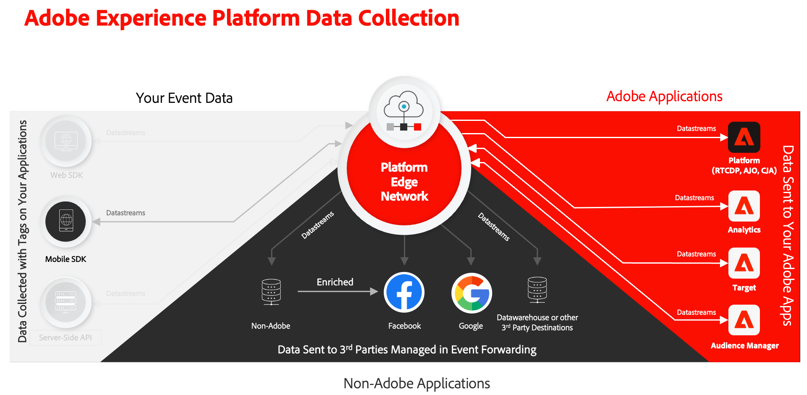

# Tutorial zur Implementierung von Adobe Experience Cloud in Mobile Apps

Erfahren Sie, wie Sie Adobe Experience Cloud-Programme mit dem Adobe Experience Platform Mobile SDK in Ihrer Mobile App implementieren.

Experience Platform Mobile SDK ist ein Client-seitiges SDK, mit dem Adobe Experience Cloud-Kunden über das Adobe Experience Platform Edge Network sowohl mit Adobe-Anwendungen als auch mit Drittanbieterdiensten interagieren können. Siehe [Dokumentation zum Adobe Experience Platform Mobile SDK](https://developer.adobe.com/client-sdks/documentation/) für detailliertere Informationen.

Dieses Tutorial führt Sie durch die Implementierung des Platform Mobile SDK in einer Beispiel-Einzelhandelsanwendung namens Luma. Die [Luma-App](https://github.com/Adobe-Marketing-Cloud/Luma-iOS-Mobile-App) verfügt über Funktionen, mit denen Sie eine realistische Implementierung erstellen können. Nach Abschluss dieses Tutorials sollten Sie bereit sein, mit der Implementierung all Ihrer Marketing-Lösungen über das Experience Platform Mobile SDK in Ihre eigenen mobilen Apps zu beginnen.

Die Lektionen sind für iOS konzipiert und in Swift/SwiftUI geschrieben, aber viele der Konzepte gelten auch für Android™.

Nach Abschluss dieses Tutorials können Sie:

* Erstellen Sie ein Schema mit standardmäßigen und benutzerdefinierten Feldergruppen.
* Einrichten eines Datenstroms.
* Konfigurieren Sie eine mobile Tag-Eigenschaft.
* Einrichten eines Experience Platform-Datensatzes (optional).
* Installieren und implementieren Sie Tag-Erweiterungen in einer App.
* Experience Cloud-Parameter ordnungsgemäß an eine [Webansicht](web-views.md).
* Validieren der Implementierung mithilfe von [Adobe Experience Platform Assurance](assurance.md).
* Fügen Sie die folgenden Adobe Experience Cloud-Anwendungen/Erweiterungen hinzu:
   * [Adobe Experience Platform Edge (XDM)](events.md)
   * [Erfassung der Lebenszyklusdaten](lifecycle-data.md)
   * [Einverständnis](consent.md)
   * [Identität](identity.md)
   * [Profil](profile.md)
   * [Places](places.md)
   * [Analysen](analytics.md)
   * [Adobe Experience Platform](platform.md)
   * [Push-Nachrichten mit Journey Optimizer](journey-optimizer-push.md)
   * [In-App-Messaging mit Journey Optimizer](journey-optimizer-inapp.md)
   * [Angebote mit Journey Optimizer](journey-optimizer-offers.md)
   * [A/B-Tests mit Target](target.md)

>[!NOTE]
>
>Ein ähnliches Tutorial mit mehreren Lösungen steht für [Web SDK](../tutorial-web-sdk/overview.md).

## Voraussetzungen

In diesen Lektionen wird davon ausgegangen, dass Sie über eine Adobe ID und die erforderlichen Berechtigungen zum Ausführen der Übungen verfügen. Wenn nicht, sollten Sie sich an Ihren Adobe-Administrator wenden, um Zugriff anzufordern.

* In der Datenerfassung müssen Sie über Folgendes verfügen:
   * **[!UICONTROL Plattformen]**—permission item **[!UICONTROL Mobilnummer]**
   * **[!UICONTROL Eigenschaftsrechte]**—Berechtigungselemente zu **[!UICONTROL Entwickeln]**, **[!UICONTROL Genehmigen]**, **[!UICONTROL Veröffentlichen]**, **[!UICONTROL Verwalten von Erweiterungen]**, und **[!UICONTROL Verwalten von Umgebungen]**.
   * **[!UICONTROL Unternehmensrechte]**—Berechtigungselemente zu **[!UICONTROL Eigenschaften verwalten]** und, wenn Sie die optionale Lektion zu Push-Nachrichten abschließen **[!UICONTROL App-Konfigurationen verwalten]**

     Weitere Informationen zu Tag-Berechtigungen finden Sie unter [Benutzerberechtigungen für Tags](https://experienceleague.adobe.com/docs/experience-platform/tags/admin/user-permissions.html?lang=de){target="_blank"} in der Produktdokumentation.
* Unter Experience Platform müssen Sie über Folgendes verfügen:
   * **[!UICONTROL Datenmodellierung]**—Berechtigungselemente zum Verwalten und Anzeigen von Schemas.
   * **[!UICONTROL Identity Management]**—Berechtigungselemente zum Verwalten und Anzeigen von Identitäts-Namespaces.
   * **[!UICONTROL Datenerfassung]**—Berechtigungselemente zum Verwalten und Anzeigen von Datenspeichern.

   * Wenn Sie Kunde einer Platform-basierten Anwendung wie Real-Time CDP, Journey Optimizer oder Customer Journey Analytics sind, sollten Sie auch über Folgendes verfügen:
      * **[!UICONTROL Data Management]**—Berechtigungselemente zum Verwalten und Anzeigen von Datensätzen zum Abschließen der _optionale Plattformübungen_ (erfordert eine Lizenz für eine Platform-basierte Anwendung ).
      * Entwicklung **Sandbox** die Sie für dieses Tutorial verwenden können.

* Für Adobe Analytics müssen Sie wissen, welche **Report Suites** können Sie verwenden, um dieses Tutorial abzuschließen.

* Für Adobe Target müssen Sie über Berechtigungen verfügen, die ordnungsgemäß konfiguriert sind. **Rollen**, **Arbeitsbereiche**, und **properties** wie beschrieben [here](https://experienceleague.adobe.com/docs/target/using/administer/manage-users/enterprise/property-channel.html?lang=de).

* Für Adobe Journey Optimizer müssen Sie über ausreichende Berechtigungen verfügen, um die **Push-Benachrichtigungsdienst** und erstellen Sie eine **App-Oberfläche**, a **Journey**, a **message** und **Nachrichtenvorgaben**. Für die Entscheidungsverwaltung benötigen Sie die entsprechenden Berechtigungen für **Angebote verwalten** und **Entscheidungen** wie beschrieben [here](https://experienceleague.adobe.com/docs/journey-optimizer/using/access-control/privacy/high-low-permissions.html?lang=en#decisions-permissions).

Alle Experience Cloud-Kunden sollten Zugriff auf die erforderlichen Funktionen haben, die für die Bereitstellung des Mobile SDK erforderlich sind.

>[!NOTE]
>
>Im Rahmen dieses Tutorials erstellen Sie Schemas, Datensätze, Identitäten usw. Wenn Sie dieses Tutorial mit mehreren Personen in einer Sandbox durchlaufen oder ein freigegebenes Konto verwenden, sollten Sie beim Erstellen dieser Objekte erwägen, eine Identifizierung als Teil Ihrer Namenskonventionen anzuhängen oder vorzustellen. Fügen Sie beispielsweise ` - <your name or initials>` zum Namen des Objekts, das Sie erstellen sollen.

## Herunterladen der Luma-App

Zwei Versionen der Beispiel-App können heruntergeladen werden. Beide Versionen können heruntergeladen/geklont von [Github](https://git.corp.adobe.com/rmaur/Luma). Es gibt zwei Ordner:

1. [Starten](https://git.corp.adobe.com/rmaur/Luma){target="_blank"}: ein Projekt ohne Code oder mit Platzhaltercode für den Großteil des Experience Platform Mobile SDK-Codes, den Sie zum Abschließen der praktischen Übungen in diesem Tutorial benötigen.
1. [Beenden](https://git.corp.adobe.com/Luma){target="_blank"}: eine Version mit der vollständigen Implementierung als Referenz.

>[!NOTE]
>
>Sie werden iOS als Plattform verwenden. [!DNL Swift] als Programmiersprache, [!DNL SwiftUI] als UI-Framework und [!DNL Xcode] als integrierte Entwicklungsumgebung (IDE). Viele der erläuterten Implementierungskonzepte sind jedoch für andere Entwicklungsplattformen ähnlich. Und viele haben dieses Tutorial bereits erfolgreich abgeschlossen, ohne zuvor über iOS/Swift(UI) zu verfügen. Sie müssen kein Experte sein, um die Lektionen abzuschließen, aber Sie erhalten mehr aus den Lektionen, wenn Sie Code bequem lesen und verstehen können.

Los geht‘s!

>[!SUCCESS]
>
>Vielen Dank, dass Sie Ihre Zeit investiert haben, um mehr über das Adobe Experience Platform Mobile SDK zu erfahren. Wenn Sie Fragen haben, ein allgemeines Feedback oder Vorschläge zu künftigen Inhalten teilen möchten, teilen Sie diese hier mit. [Experience League Community-Diskussionsbeitrag](https://experienceleaguecommunities.adobe.com/t5/adobe-experience-platform-launch/tutorial-discussion-implement-adobe-experience-cloud-in-mobile/td-p/443796).

Weiter: **[Erstellen eines XDM-Schemas](create-schema.md)**
