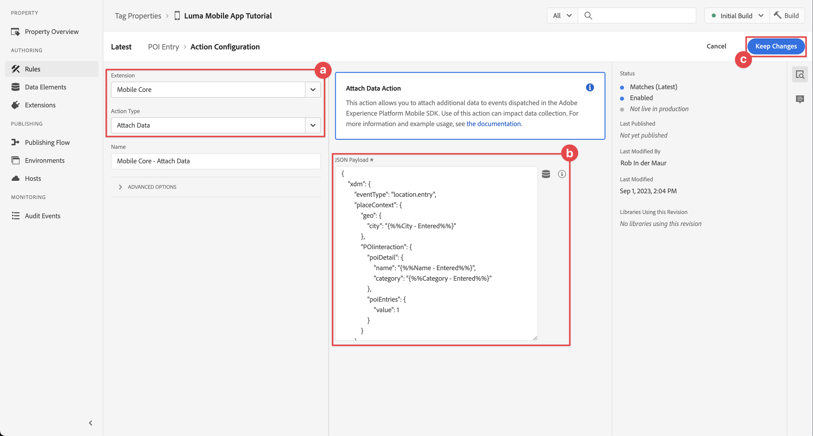
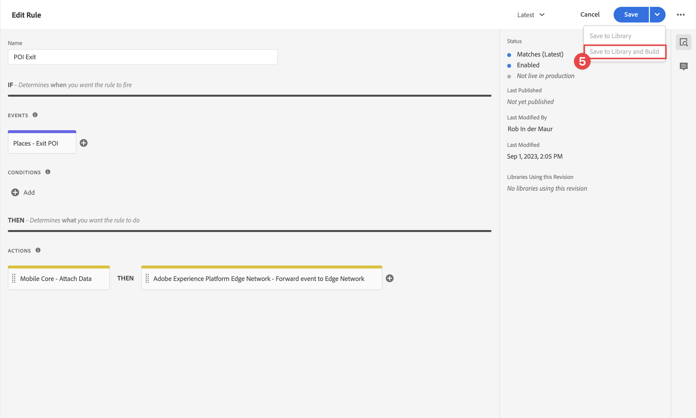
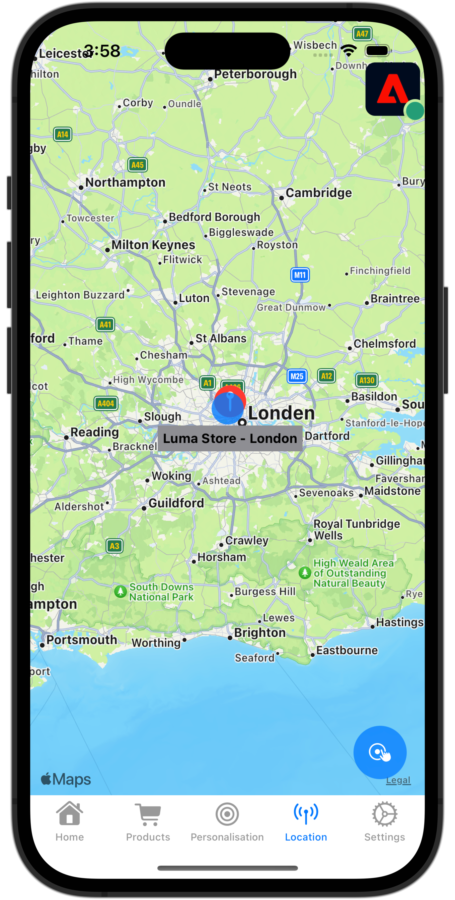

# Orte verwenden

Erfahren Sie, wie Sie den Geolocation-Dienst Places in Ihrer App verwenden.

Der Datenerfassungs-Places-Dienst von Adobe Experience Platform ist ein Geolocation-Dienst, mit dem mobile Apps mit Standorterkennung den Standortkontext verstehen können. Der Dienst verwendet umfangreiche und benutzerfreundliche SDK-Schnittstellen, die von einer flexiblen Datenbank mit Zielpunkten (POIs) begleitet werden.

## Voraussetzungen

* Alle Paketabhängigkeiten sind im Xcode-Projekt vorhanden.
* Registrierte Erweiterungen in AppDelegate.
* MobileCore für die Verwendung Ihrer Entwicklungs-AppId konfiguriert.
* Importierte SDKs
* Die App wurde erfolgreich erstellt und mit den oben genannten Änderungen ausgeführt.

## Lernziele

In dieser Lektion werden Sie

* Erfahren Sie, wie Sie Zielpunkte im Places-Dienst definieren.
* Aktualisieren Sie Ihre Tag-Eigenschaft mit der Places-Erweiterung.
* Aktualisieren Sie Ihr Schema, um Geolocation-Ereignisse zu erfassen.
* Validieren Sie die Einrichtung in &quot;Assurance&quot;.
* Aktualisieren Sie Ihre App, um die Places-Erweiterung zu registrieren.
* Implementieren Sie das Geolocation-Tracking aus dem Places-Dienst in Ihre App.


## Einrichten

Damit der Places-Dienst in Ihrer App und im Mobile SDK funktioniert, müssen Sie einige Einstellungen vornehmen.

### Festlegen von Orten

Sie definieren einige Zielpunkte im Places-Dienst.

1. Wählen Sie in der Datenerfassungs-Benutzeroberfläche die Option **[!UICONTROL Orte]**.
1. Auswählen .
1. Wählen Sie im Kontextmenü die Option **[!UICONTROL Bibliotheken verwalten]**.
   
1. Im **[!UICONTROL Bibliotheken verwalten]** Dialogfeld auswählen **[!UICONTROL Neu]**.
1. Im **[!UICONTROL Bibliothek erstellen]** Dialogfeld eingeben **[!UICONTROL Name]**, beispielsweise `Luma`.
1. Auswählen **[!UICONTROL Bestätigen]**.
   
1. So schließen Sie die **[!UICONTROL Bibliotheken verwalten]** Dialogfeld auswählen **[!UICONTROL Schließen]**.
1. Zurück in **[!UICONTROL POI-Verwaltung]** auswählen **[!UICONTROL POIs importieren]**.
1. Auswählen **[!UICONTROL Starten]** in t**[!UICONTROL die Importorte]** Dialogfeld.
1. Auswählen **[!DNL Luma]** aus der Liste der Bibliotheken,
1. Klicken Sie auf **[!UICONTROL Weiter]**.
   
1. Laden Sie die [Luma POIs-ZIP-Datei](assets/luma_pois.csv.zip) und extrahieren Sie es an eine Stelle auf Ihrem Computer.
1. Im **[!UICONTROL Importorte]** Dialogfeld, ziehen und legen Sie die extrahierte `luma_pois.csv` in **[!UICONTROL CSV-Datei auswählen - Datei ziehen und ablegen]**. Sie sollten **[!UICONTROL Validierung erfolgreich]** - **[!UICONTROL CSV-Datei erfolgreich validiert]**.
1. Auswählen **[!UICONTROL Import beginnen]**. Sie sollten **[!UICONTROL Erfolg]** - **[!UICONTROL 6 neue Zielpunkte wurden erfolgreich hinzugefügt]**.
1. Klicken Sie auf **[!UICONTROL Fertig]**.
1. In **[!UICONTROL POI-Verwaltung]**, sollten Sie sehen, dass sechs neue Luma-Stores zur Liste hinzugefügt werden. Sie können zwischen  und  Landkartenansicht.
   .


### Installieren der Places-Erweiterung

1. Navigieren Sie zu **[!UICONTROL Tags]** und suchen Sie Ihre mobile Tag-Eigenschaft und öffnen Sie die Eigenschaft .
1. Auswählen **[!UICONTROL Erweiterungen]**.
1. Auswählen **[!UICONTROL Katalog]**.
1. Suchen Sie nach **[!UICONTROL Orte]** -Erweiterung.
1. Installieren der Erweiterung.

   

1. Im **[!UICONTROL Installieren der Erweiterung]** dialog:
   1. Auswählen **[!DNL Luma]** aus dem **[!UICONTROL Bibliothek auswählen]** Liste.
   1. Stellen Sie sicher, dass Sie Ihre Arbeitsbibliothek ausgewählt haben, z. B. **[!UICONTROL Ursprünglicher Build]**.
   1. Auswählen **[!UICONTROL In Bibliothek speichern und erstellen]** von **[!UICONTROL In Bibliothek speichern]**.
      .

1. Ihre Bibliothek ist neu aufgebaut.


### Prüfen des Schemas

Überprüfen Sie, ob Ihr Schema wie in [Schema erstellen](create-schema.md), enthält die erforderlichen Feldergruppen und Klassen zur Erfassung von POI- und Geolocation-Daten.

1. Navigieren Sie zur Datenerfassungsoberfläche und wählen Sie **[!UICONTROL Schemas]** über die linke Leiste.
1. Auswählen **[!UICONTROL Durchsuchen]** aus der oberen Leiste.
1. Wählen Sie Ihr Schema aus, um es zu öffnen.
1. Wählen Sie im Schema-Editor **[!UICONTROL Ereignis für Kundenerlebnisse]**.
1. Sie sehen eine **[!UICONTROL placeContext]** -Objekt mit Objekt und Feldern zum Erfassen von POI-Interaktionen und Geolocation-Daten.
   .


### Tag-Eigenschaft aktualisieren

Die Places-Erweiterung für Tags bietet Funktionen zum Überwachen von Geolocation-Ereignissen und ermöglicht den Trigger von Aktionen, die auf diesen Ereignissen basieren. Mit dieser Funktion können Sie die API-Codierung minimieren, die Sie in der App implementieren müssen.

**Datenelemente**

Erstellen Sie zunächst mehrere Datenelemente.

1. Rufen Sie Ihre Tag-Eigenschaft in der Datenerfassungs-Benutzeroberfläche auf.
1. Auswählen **[!UICONTROL Datenelemente]** über die linke Leiste.
1. Wählen Sie **[!UICONTROL Datenelement hinzufügen]** aus.
1. Im **[!UICONTROL Datenelement erstellen]** Bildschirm, geben Sie einen Namen ein, beispielsweise `Name - Entered`.
1. Auswählen **[!UICONTROL Orte]** aus dem **[!UICONTROL Erweiterung]** Liste.
1. Auswählen **[!UICONTROL Name]** aus dem **[!UICONTROL Datenelementtyp]** Liste.
1. Auswählen **[!UICONTROL Aktueller POI]** darunter **[!UICONTROL TARGET]**.
1. Auswählen **[!UICONTROL In Bibliothek speichern]**.
   

1. Wiederholen Sie die Schritte 4 bis 8 anhand der Informationen aus der unten stehenden Tabelle, um zusätzliche Datenelemente zu erstellen.

   | Name | Erweiterung | Datenelementtyp | TARGET |
   |---|---|---|---|
   | `Name - Exited` | Places | Name | Letzter ausgesetzter POI |
   | `Category - Current` | Places | Kategorie | Aktueller POI |
   | `Category - Exited` | Places | Kategorie | Letzter ausgesetzter POI |
   | `City - Current` | Places | Stadt | Aktueller POI |
   | `City - Exited` | Places | Stadt | Letzter ausgesetzter POI |

   Sie sollten über die folgende Liste von Datenelementen verfügen.

   

**Regeln**

Als Nächstes definieren Sie Regeln für die Verwendung dieser Datenelemente.

1. Wählen Sie in der Tag-Eigenschaft **[!UICONTROL Regeln]** über die linke Leiste.
1. Auswählen **[!UICONTROL Regel hinzufügen]**.
1. Im **[!UICONTROL Regel erstellen]** Bildschirm einen Namen für die Regel eingeben, z. B. `POI - Entry`.
1. Auswählen  darunter **[!UICONTROL EREIGNISSE]**.
   1. Auswählen **[!UICONTROL Orte]** aus dem **[!UICONTROL Erweiterung]** Liste und Auswahl **[!UICONTROL POI eingeben]** aus dem **[!UICONTROL Ereignistyp]** Liste.
   1. Wählen Sie **[!UICONTROL Änderungen beibehalten]** aus.
      .
1. Auswählen  darunter **[!UICONTROL AKTIONEN]**.
   1. Auswählen **[!UICONTROL Mobile Core]** aus dem **[!UICONTROL Erweiterung]** Liste auswählen **[!UICONTROL Daten anhängen]** von **[!UICONTROL Aktionstyp]** die Liste. Diese Aktion hängt Payload-Daten an.
   1. Im **[!UICONTROL JSON-Payload]**, fügen Sie die folgende Payload ein:

      ```json
      {
          "xdm": {
              "eventType": "location.entry",
              "placeContext": {
                  "geo": {
                      "city": "{%%City - Current%%}"
                  },
                  "POIinteraction": {
                      "poiDetail": {
                          "name": "{%%Name - Current%%}",
                          "category": "{%%Category - Current%%}"
                      },
                      "poiEntries": {
                          "value": 1
                      }
                  }
              }
          }
      }
      ```

      Sie können auch `{%% ... %%}` Platzhalterwerte für Datenelemente in der JSON durch Auswahl der . In einem Popup-Dialogfeld können Sie jedes von Ihnen erstellte Datenelement auswählen.

   1. Wählen Sie **[!UICONTROL Änderungen beibehalten]** aus.
      

1. Auswählen  neben dem **[!UICONTROL Mobile Core - Daten anhängen]** Aktion.
   1. Auswählen **[!UICONTROL Adobe Experience Platform Edge Network]** aus dem **[!UICONTROL Erweiterung]** Liste und Auswahl **[!UICONTROL Weiterleiten von Ereignissen an Edge Network]**. Diese Aktion stellt sicher, dass das Ereignis und die zusätzlichen Payload-Daten an das Edge-Netzwerk weitergeleitet werden.
   1. Wählen Sie **[!UICONTROL Änderungen beibehalten]** aus.

1. Um die Regel zu speichern, wählen Sie **[!UICONTROL In Bibliothek speichern]**.

   

Erstellen wir eine weitere Regel

1. Im **[!UICONTROL Regel erstellen]** Bildschirm einen Namen für die Regel eingeben, z. B. `POI - Exit`.
1. Auswählen  darunter **[!UICONTROL EREIGNISSE]**.
   1. Auswählen **[!UICONTROL Orte]** aus dem **[!UICONTROL Erweiterung]** Liste und Auswahl **[!UICONTROL POI eingeben]** aus dem **[!UICONTROL Ereignistyp]** Liste.
   1. Wählen Sie **[!UICONTROL Änderungen beibehalten]** aus.
1. Auswählen  darunter **[!UICONTROL AKTIONEN]**.
   1. Auswählen **[!UICONTROL Mobile Core]** von **[!UICONTROL Erweiterung]** Liste auswählen **[!UICONTROL Daten anhängen]** von **[!UICONTROL Aktionstyp]** Liste.
   1. Im **[!UICONTROL JSON-Payload]**, fügen Sie die folgende Payload ein:

      ```json
      {
          "xdm": {
              "eventType": "location.exit",
              "placeContext": {
                  "geo": {
                      "city": "{%%City - Exited%%}"
                  },
                  "POIinteraction": {
                      "poiExits": {
                          "value": 1
                      },
                      "poiDetail": {
                          "name": "{%%Name - Exited%%}",
                          "category": "{%%Category - Exited%%}"
                      }
                  }
              }
          }
      }
      ```

   1. Wählen Sie **[!UICONTROL Änderungen beibehalten]** aus.

1. Auswählen  neben dem **[!UICONTROL Mobile Core - Daten anhängen]** Aktion.
   1. Auswählen **[!UICONTROL Adobe Experience Platform Edge Network]** aus dem **[!UICONTROL Erweiterung]** Liste und Auswahl **[!UICONTROL Weiterleiten von Ereignissen an Edge Network]**.
   1. Wählen Sie **[!UICONTROL Änderungen beibehalten]** aus.

1. Um die Regel zu speichern, wählen Sie **[!UICONTROL In Bibliothek speichern]**.

   


Um sicherzustellen, dass alle Änderungen in Ihrem Tag veröffentlicht werden

1. Auswählen **[!UICONTROL Ursprünglicher Build]** als Bibliothek, die erstellt werden soll.
1. Auswählen **[!UICONTROL Build]**.
   


## Validieren der Einrichtung in der Zuverlässigkeitserklärung

So überprüfen Sie Ihre Einrichtung in Assurance:

1. Navigieren Sie zur Benutzeroberfläche &quot;Assurance&quot;.
1. Wenn nicht bereits in der linken Leiste verfügbar, wählen Sie **[!UICONTROL Konfigurieren]** Wählen Sie in der linken Leiste  neben **[!UICONTROL Veranstaltungen]** und **[!UICONTROL Karte und Simulieren]** darunter **[!UICONTROL PLACES SERVICE]**.
1. Wählen Sie **[!UICONTROL Speichern]** aus.
1. Auswählen **[!UICONTROL Karte und Simulieren]** in der linken Leiste.
1. Wählen Sie einen der im Places-Dienst definierten POI aus und wählen Sie im Popup-Fenster die Option  **[!UICONTROL Eintrittsereignis simulieren]**.
   
1. Auswählen **[!UICONTROL Veranstaltungen]** über die linke Leiste aus, und Sie sollten die simulierten Ereignisse sehen.
   


## Implementieren von Places in Ihrer App

Wie in den vorherigen Lektionen erläutert, bietet die Installation einer mobilen Tag-Erweiterung nur die Konfiguration. Als Nächstes müssen Sie das Places SDK installieren und registrieren. Wenn diese Schritte nicht klar sind, überprüfen Sie die [SDKs installieren](install-sdks.md) Abschnitt.

>[!NOTE]
>
>Wenn Sie die [SDKs installieren](install-sdks.md) hinzugefügt, ist das Places SDK bereits installiert und Sie können diesen Schritt überspringen.
>

1. Stellen Sie in Xcode sicher, dass [AEP Places](https://github.com/adobe/aepsdk-places-ios) wird zur Liste der Pakete in Package-Abhängigkeiten hinzugefügt. Siehe [Swift Package Manager](install-sdks.md#swift-package-manager).
1. Navigieren Sie zu **[!DNL Luma]** > **[!DNL Luma]** > **[!DNL AppDelegate]** im Xcode-Projektnavigator.
1. Sichern `AEPPlaces` ist Teil Ihrer Importliste.

   `import AEPPlaces`

1. Sichern `Places.self` ist Teil des Arrays von Erweiterungen, die Sie registrieren.

   ```swift
   let extensions = [
       AEPIdentity.Identity.self,
       Lifecycle.self,
       Signal.self,
       Edge.self,
       AEPEdgeIdentity.Identity.self,
       Consent.self,
       UserProfile.self,
       Places.self,
       Messaging.self,
       Optimize.self,
       Assurance.self
   ]
   ```

1. Navigieren Sie zu **[!DNL Luma]** > **[!DNL Luma]** > **[!DNL Utils]** > **[!UICONTROL MobileSDK]** im Xcode-Projektnavigator und suchen Sie die `func processRegionEvent(regionEvent: PlacesRegionEvent, forRegion region: CLRegion) async` function.Fügen Sie den folgenden Code hinzu:

   ```swift
   // Process geolocation event
   Places.processRegionEvent(regionEvent, forRegion: region)
   ```

   Diese [`Places.processRegionEvent`](https://developer.adobe.com/client-sdks/documentation/places/api-reference/#processregionevent) Die API übermittelt die Geolocation-Informationen an den Places-Dienst.

1. Navigieren Sie zu **[!DNL Luma]** > **[!DNL Luma]** > **[!DNL Views]** > **[!DNL Location]** > **[!DNL GeofenceSheet]** im Projektnavigator von Xcode.

   1. Geben Sie für die Schaltfläche &quot;Entry&quot;den folgenden Code ein

   ```swift
   // Simulate geofence entry event
   Task {
       await MobileSDK.shared.processRegionEvent(regionEvent: .entry, forRegion: region)
   }
   ```

   1. Geben Sie für die Schaltfläche Beenden den folgenden Code ein

   ```swift
   // Simulate geofence exit event
   Task {
       await MobileSDK.shared.processRegionEvent(regionEvent: .exit, forRegion: region)
   }
   ```

## Validieren mit Ihrer App

1. Öffnen Sie Ihre App auf einem Gerät oder im Simulator.

1. Navigieren Sie zu **[!UICONTROL Standort]** Registerkarte.

1. Verschieben Sie die Karte (ziehen Sie sie), um sicherzustellen, dass der blaue mittlere Kreis über einem der POIs liegt, z. B. London.

1. Tippen  bis die Kategorie und der Name in der Tabelle an der roten Stelle mit dem Pin angezeigt werden.

1. Tippen Sie auf die Bezeichnung des POI, wodurch sich der **[!UICONTROL Nächster POI]** Blatt.

   

1. Drücken Sie die **[!UICONTROL Einstieg]** oder **[!UICONTROL Beenden]** -Schaltflächen zum Simulieren von Geofence-Einstiegs- und Geofence-Ausstiegsereignissen aus der App.

   

1. Sie sollten die Ereignisse in der Assurance-Benutzeroberfläche sehen.


## Nächste Schritte

Sie sollten jetzt über alle Tools verfügen, um Ihre Geolocation-Funktionalität in der App um weitere Funktionen zu erweitern. Nachdem Sie die Ereignisse an das Edge Network weitergeleitet haben, nachdem Sie die App für [Experience Platform](platform.md)sollten die Erlebnisereignisse angezeigt werden, die für das in der App verwendete Profil angezeigt werden.

Im Abschnitt Journey Optimizer dieses Tutorials sehen Sie, dass Erlebnisereignisse zum Trigger von Journey verwendet werden können (siehe [Push-Benachrichtigung](journey-optimizer-inapp.md) und [In-App-Messaging](journey-optimizer-push.md) mit Journey Optimizer). Beispielsweise das übliche Beispiel, bei dem Sie dem App-Benutzer eine Push-Benachrichtigung mit einer Produktwerbung senden, wenn dieser Benutzer den Geofence eines physischen Stores betritt.

Sie haben eine Implementierung der Funktionen für Ihre App gesehen, die hauptsächlich vom Places-Dienst sowie von den Datenelementen und Regeln gesteuert wird, die Sie in Ihrer Tag-Eigenschaft definiert haben. Minimieren Sie daher den Code in Ihrer App. Alternativ können Sie dieselben Funktionen direkt in Ihrer App implementieren, indem Sie die [`Edge.sendEvent`](https://developer.adobe.com/client-sdks/documentation/edge-network/api-reference/#sendevent) API (siehe [Veranstaltungen](events.md) für weitere Informationen) mit einer XDM-Payload, die eine `placeContext` -Objekt.

>[!SUCCESS]
>
>Sie haben die App jetzt für Geolocation-Dienste unter Verwendung der Places-Erweiterung im Experience Platform Mobile SDK aktiviert.<br/>Vielen Dank, dass Sie Ihre Zeit investiert haben, um mehr über das Adobe Experience Platform Mobile SDK zu erfahren. Wenn Sie Fragen haben, ein allgemeines Feedback oder Vorschläge zu künftigen Inhalten teilen möchten, teilen Sie diese hier mit. [Experience League Community-Diskussionsbeitrag](https://experienceleaguecommunities.adobe.com/t5/adobe-experience-platform-launch/tutorial-discussion-implement-adobe-experience-cloud-in-mobile/td-p/443796).

Weiter: **[Zuordnen von Daten zu Adobe Analytics](analytics.md)**
