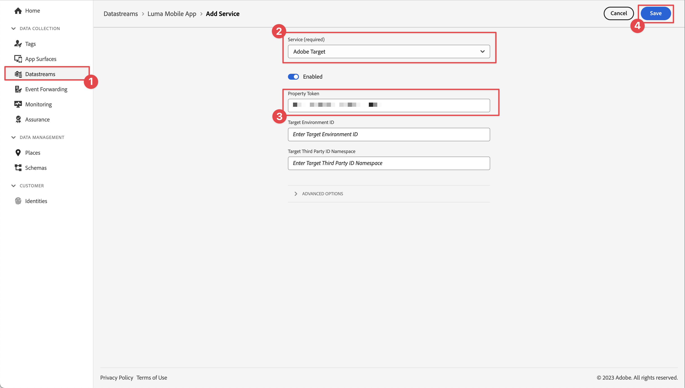
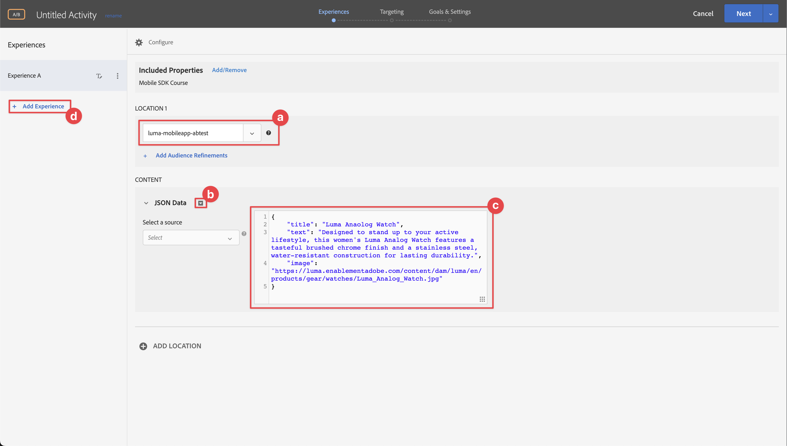

# Durchführen von A/B-Tests mit Target

Erfahren Sie, wie Sie mit dem Platform Mobile SDK und Adobe Target A/B-Tests in Ihren mobilen Apps durchführen können.

Target bietet alles, was Sie an die Erlebnisse Ihrer Kunden anpassen und personalisieren müssen. Mit Target können Sie den Umsatz Ihrer Web- und mobilen Sites, Apps, sozialen Medien und anderer digitaler Kanäle maximieren. Der Schwerpunkt dieses Tutorials liegt auf der A/B-Test-Funktionalität von Target. Siehe [A/B-Test - Überblick](https://experienceleague.adobe.com/docs/target/using/activities/abtest/test-ab.html?lang=en) für weitere Informationen.

Bevor Sie A/B-Tests mit Target Premium durchführen können, müssen Sie sicherstellen, dass die richtigen Konfigurationen und Integrationen vorhanden sind.

>[!NOTE]
>
>Diese Lektion ist optional und gilt nur für Adobe Target Premium-Benutzer, die A/B-Tests durchführen möchten.


## Voraussetzungen

* App erfolgreich erstellt und ausgeführt, wobei SDKs installiert und konfiguriert sind.
* Zugriff auf Adobe Target Premium mit Berechtigungen, ordnungsgemäß konfigurierten Rollen, Arbeitsbereichen und Eigenschaften, wie beschrieben [here](https://experienceleague.adobe.com/docs/target/using/administer/manage-users/enterprise/property-channel.html?lang=de).
Sie sollten auch Target Standard verwenden können, aber das Tutorial verwendet einige erweiterte Konzepte (z. B. Target-Eigenschaften), die für Target Premium eindeutig sind.


## Lernziele

In dieser Lektion werden Sie

* Aktualisieren Sie Ihre Edge-Konfiguration für die Target-Integration.
* Aktualisieren Sie Ihre Tag-Eigenschaft mit der Journey Optimizer - Decisioning-Erweiterung.
* Aktualisieren Sie Ihr Schema, um Projektereignisse zu erfassen.
* Validieren Sie die Einrichtung in &quot;Assurance&quot;.
* Erstellen Sie einen einfachen A/B-Test in Target.
* Aktualisieren Sie Ihre App, um die Optimizer-Erweiterung einzuschließen.
* Implementieren Sie den A/B-Test in Ihre App.
* Validieren Sie die Implementierung in Assurance.


## Edge-Konfiguration aktualisieren

Um sicherzustellen, dass Daten, die von Ihrer mobilen App an das Edge-Netzwerk gesendet werden, an Adobe Target weitergeleitet werden, müssen Sie Ihre Experience Edge-Konfiguration aktualisieren.

1. Wählen Sie in der Datenerfassungs-Benutzeroberfläche die Option **[!UICONTROL Datenspeicher]** und wählen Sie Ihren Datastream aus, z. B. **[!UICONTROL Luma Mobile App]**.
1. Auswählen **[!UICONTROL Dienst hinzufügen]** und wählen **[!UICONTROL Adobe Target]** aus dem **[!UICONTROL Dienst]** Liste.
1. Target eingeben **[!UICONTROL Eigenschafts-Token]** -Wert, den Sie für diese Integration verwenden möchten.

   Sie finden Ihre Eigenschaften in der Target-Benutzeroberfläche in **[!UICONTROL Administration]** > **[!UICONTROL Eigenschaften]**. Auswählen  , um das Eigenschafts-Token für die Eigenschaft anzuzeigen, die Sie verwenden möchten. Das Eigenschafts-Token hat ein Format wie `"at_property": "xxxxxxxx-xxxx-xxxxx-xxxx-xxxxxxxxxxxx"`; Sie müssen nur den Wert eingeben `xxxxxxxx-xxxx-xxxxx-xxxx-xxxxxxxxxxxx`.

1. Wählen Sie **[!UICONTROL Speichern]** aus.

   


## Installieren von Adobe Journey Optimizer - Decisioning Tags-Erweiterung

1. Navigieren Sie zu **[!UICONTROL Tags]** und suchen Sie Ihre mobile Tag-Eigenschaft und öffnen Sie die Eigenschaft .
1. Auswählen **[!UICONTROL Erweiterungen]**.
1. Auswählen **[!UICONTROL Katalog]**.
1. Suchen Sie nach **[!UICONTROL Adobe Journey Optimizer - Entscheidungsfindung]** -Erweiterung.
1. Installieren der Erweiterung. Die Erweiterung erfordert keine zusätzliche Konfiguration.

   


## Schema aktualisieren

1. Navigieren Sie zur Datenerfassungs-Benutzeroberfläche und wählen Sie in der linken Leiste Schemas aus.
1. Auswählen **[!UICONTROL Durchsuchen]** aus der oberen Leiste.
1. Wählen Sie Ihr Schema aus, um es zu öffnen.
1. Wählen Sie im Schema-Editor  **[!UICONTROL Hinzufügen]** neben **[!UICONTROL Feldergruppen]**.
1. Suchen Sie im Dialogfeld Feldgruppen hinzufügen nach `proposition`auswählen **[!UICONTROL Erlebnisereignis - Interaktionen bei Vorschlägen]** und wählen **[!UICONTROL Feldergruppen hinzufügen]**.
   
1. Um die Änderungen am Schema zu speichern, wählen Sie **[!UICONTROL Speichern]** .


## Validieren der Einrichtung in der Zuverlässigkeitserklärung

So überprüfen Sie Ihre Einrichtung in Assurance:

1. Navigieren Sie zur Benutzeroberfläche &quot;Assurance&quot;.
1. Auswählen **[!UICONTROL Konfigurieren]** Wählen Sie in der linken Leiste  neben **[!UICONTROL Einrichtung überprüfen]** darunter **[!UICONTROL ADOBE JOURNEY OPTIMIZER-ENTSCHEIDUNG]**.
1. Wählen Sie **[!UICONTROL Speichern]** aus.
1. Auswählen **[!UICONTROL Einrichtung überprüfen]** in der linken Leiste. Beide Datastream-Einstellungen werden validiert und das SDK-Setup in Ihrer Anwendung.
   

## Erstellen eines A/B-Tests

1. Wählen Sie in der Target-Benutzeroberfläche **[!UICONTROL Tätigkeiten]** aus der oberen Leiste.
1. Auswählen **[!UICONTROL Aktivität erstellen]** und **[!UICONTROL A/B-Test]** aus dem Kontextmenü aus.
1. Im **[!UICONTROL A/B-Test-Aktivität erstellen]** modal, wählen Sie **[!UICONTROL Mobilnummer]** als **[!UICONTROL Typ]**, wählen Sie einen Arbeitsbereich aus der **[!UICONTROL Arbeitsbereich auswählen]** und wählen Sie Ihre Eigenschaft aus dem **[!UICONTROL Eigenschaft auswählen]** Liste.
1. Wählen Sie **[!UICONTROL Erstellen]** aus.
   

1. Im **[!UICONTROL Unbenannte Aktivität]** Bildschirm am **[!UICONTROL Erlebnisse]** step:

   1. Eingabe `luma-mobileapp-abtest` in **[!UICONTROL Standort auswählen]** unter L**[!UICONTROL ZIELORT 1]**.
   1. Auswählen  neben **[!UICONTROL Standardinhalt]** und wählen **[!UICONTROL JSON-Angebot erstellen]** aus dem Kontextmenü aus.
   1. Kopieren Sie die folgende JSON in **[!UICONTROL Gültiges JSON-Objekt eingeben]**.

      ```json
      { 
          "title": "Luma Anaolog Watch",
          "text": "Designed to stand up to your active lifestyle, this women's Luma Analog Watch features a tasteful brushed chrome finish and a stainless steel, water-resistant construction for lasting durability.", 
          "image": "https://luma.enablementadobe.com/content/dam/luma/en/products/gear/watches/Luma_Analog_Watch.jpg" 
      }
      ```

   1. Auswählen **[!UICONTROL + Erlebnis hinzufügen]**.

      

   1. Wiederholen Sie Schritt b und c für Erlebnis B, verwenden Sie stattdessen die folgende JSON:

      ```json
      { 
          "title": "Aim Analog Watch",
          "text": "The flexible, rubberized strap is contoured to conform to the shape of your wrist for a comfortable all-day fit. The face features three illuminated hands, a digital read-out of the current time, and stopwatch functions.", 
          "image": "https://luma.enablementadobe.com/content/dam/luma/en/products/gear/watches/Aim_Watch.jpg" 
      }
      ```

   1. Klicken Sie auf **[!UICONTROL Weiter]**.

      

1. Im **[!UICONTROL Targeting]** Schritt, überprüfen Sie die Einrichtung Ihres A/B-Tests. Standardmäßig werden beide Angebote gleichmäßig allen Besuchern zugeordnet. Klicken Sie auf **[!UICONTROL Weiter]**, um fortzufahren.

   

1. Im **[!UICONTROL Ziele und Einstellungen]** step:

   1. Benennen Sie Ihre unbenannte Aktivität um, beispielsweise in `Luma Mobile SDK Tutorial - A/B Test Example`.
   1. Geben Sie eine **[!UICONTROL Ziel]** für Ihren A/B-Test, beispielsweise `A/B Test for Luma mobile app tutorial`.
   1. Auswählen **[!UICONTROL Konversion]**, **[!UICONTROL Auf mbox geklickt]** im **[!UICONTROL Zielmetrik]** > **[!UICONTROL MEIN PRIMÄRES ZIEL]** und geben Sie den Namen Ihres Standorts (Mbox) ein, z. B. `luma-mobileapp-abtest`.
   1. Klicken Sie auf **[!UICONTROL Speichern und schließen]**.

      

1. Zurück im **[!UICONTROL Alle Aktivitäten]** screen:

   1. Auswählen  in Ihrer Aktivität.
   1. Auswählen  **[!UICONTROL Aktivieren]** , um Ihren A/B-Test zu aktivieren.

   


## Implementieren von Target in Ihre App

Wie in den vorherigen Lektionen erläutert, bietet die Installation einer mobilen Tag-Erweiterung nur die Konfiguration. Als Nächstes müssen Sie das Optimize SDK installieren und registrieren. Wenn diese Schritte nicht klar sind, überprüfen Sie die [SDKs installieren](install-sdks.md) Abschnitt.

>[!NOTE]
>
>Wenn Sie die [SDKs installieren](install-sdks.md) -Abschnitt, ist das SDK bereits installiert und Sie können zu Schritt 7 überspringen.
>

1. Stellen Sie in Xcode sicher, dass [AEP Optimize](https://github.com/adobe/aepsdk-messaging-ios.git) wird zur Liste der Pakete in Package-Abhängigkeiten hinzugefügt. Siehe [Swift Package Manager](install-sdks.md#swift-package-manager).
1. Navigieren Sie zu **[!UICONTROL Luma]** > **[!UICONTROL Luma]** > **[!UICONTROL AppDelegate]**.
1. Sichern `AEPMessaging` ist Teil Ihrer Importliste.

   `import AEPOptimize`

1. Sichern `Optimize.self` ist Teil des Arrays von Erweiterungen, die Sie registrieren.

   ```swift
   let extensions = [
       AEPIdentity.Identity.self,
       Lifecycle.self,
       Signal.self,
       Edge.self,
       AEPEdgeIdentity.Identity.self,
       Consent.self,
       UserProfile.self,
       Places.self,
       Messaging.self,
       Optimize.self,
       Assurance.self
   ]
   ```

1. Navigieren Sie zu **[!UICONTROL Luma]** > **[!UICONTROL Luma]** > **[!UICONTROL Utils]** > **[!UICONTROL MobileSDK]** im Xcode-Projektnavigator. Suchen Sie die ` func updatePropositionAT(ecid: String, location: String) async` -Funktion. Inspect den Code, der
   * ein XDM-Wörterbuch `xdmData`, die die ECID zur Identifizierung des Profils enthält, für das Sie den A/B-Test vorlegen müssen, und
   * die `decisionScope`, ein Array von Orten, an denen der A/B-Test präsentiert werden soll.

   Anschließend ruft die Funktion zwei APIs auf: [`Optimize.clearCachePropositions`](https://support.apple.com/en-ie/guide/mac-help/mchlp1015/mac)  und [`Optimize.updatePropositions`](https://developer.adobe.com/client-sdks/documentation/adobe-journey-optimizer-decisioning/api-reference/#updatepropositions). Mit diesen Funktionen werden zwischengespeicherte Vorschläge gelöscht und die Vorschläge für dieses Profil aktualisiert.

1. Navigieren Sie zu **[!UICONTROL Luma]** > **[!UICONTROL Luma]** > **[!UICONTROL Ansichten]** > **[!UICONTROL Personalisierung]** > **[!UICONTROL TargetOffersView]** im Xcode-Projektnavigator. Suchen Sie die `func getPropositionAT(location: String) async` und überprüfen Sie den Code dieser Funktion. Der wichtigste Teil dieser Funktion ist die  [`Optimize.getPropositions`](https://developer.adobe.com/client-sdks/documentation/adobe-journey-optimizer-decisioning/api-reference/#getpropositions) API-Aufruf, der
   * ruft die Vorschläge für das aktuelle Profil basierend auf dem Entscheidungsbereich ab (dem Ort, den Sie im A/B-Test definiert haben) und
   * entpackt das Ergebnis in Inhalt, der ordnungsgemäß in der App angezeigt werden kann.

1. Noch in **[!UICONTROL TargetOffersView]**, suchen Sie die`unc updatePropositions(location: String) async` und fügen Sie den folgenden Code hinzu:

   ```swift
       Task {
           await self.updatePropositionAT(
               ecid: currentEcid,
               location: location
           )
       }
       try? await Task.sleep(seconds: 2.0)
       Task {
           await self.getPropositionAT(
               location: location
           )
       }
   ```

   Dieser Code stellt sicher, dass Sie die Vorschläge aktualisieren und dann die Ergebnisse mithilfe der in den Schritten 5 und 6 beschriebenen Funktionen abrufen.


## Validieren mit der App

1. Öffnen Sie Ihre App auf einem Gerät oder im Simulator.

1. Navigieren Sie zu **[!UICONTROL Personalisierung]** Registerkarte.

1. Auswählen **[!UICONTROL Edge-Personalisierung]**.

1. Scrollen Sie nach unten, und eines der beiden Angebote, die Sie in Ihrem A/B-Test definiert haben, wird im **[!UICONTROL TARGET]** Kachel.

   


## Validieren der Implementierung in Assurance

So validieren Sie den A/B-Test in Assurance:

1. Navigieren Sie zur Benutzeroberfläche &quot;Assurance&quot;.
1. Auswählen **[!UICONTROL Konfigurieren]** Wählen Sie in der linken Leiste  neben **[!UICONTROL Überprüfen und Simulieren]** darunter **[!UICONTROL ADOBE JOURNEY OPTIMIZER-ENTSCHEIDUNG]**.
1. Wählen Sie **[!UICONTROL Speichern]** aus.
1. Auswählen **[!UICONTROL Überprüfen und Simulieren]** in der linken Leiste. Beide Datastream-Einstellungen werden validiert und das SDK-Setup in Ihrer Anwendung.
1. Auswählen **[!UICONTROL Anforderungen]** in der oberen Leiste. Sie sehen Ihre Target-Anforderungen.
   

1. In den Registerkarten Simulation und Ereignisliste finden Sie weitere Informationen zur Funktionsprüfung Ihrer Einrichtung für Target-Angebote.

## Implementieren in Ihre App

Sie sollten jetzt über alle Tools verfügen, um der Luma-App weitere A/B-Tests oder andere Target-Aktivitäten hinzuzufügen, sofern relevant und zutreffend.

>[!SUCCESS]
>
>Sie haben die App jetzt für A/B-Tests aktiviert und die Ergebnisse eines A/B-Tests mit Adobe Target und der Adobe Journey Optimizer - Decisioning-Erweiterung für das Adobe Experience Platform Mobile SDK angezeigt.<br/>Vielen Dank, dass Sie Ihre Zeit investiert haben, um mehr über das Adobe Experience Platform Mobile SDK zu erfahren. Wenn Sie Fragen haben, ein allgemeines Feedback oder Vorschläge zu künftigen Inhalten teilen möchten, teilen Sie diese hier mit. [Experience League Community-Diskussionsbeitrag](https://experienceleaguecommunities.adobe.com/t5/adobe-experience-platform-launch/tutorial-discussion-implement-adobe-experience-cloud-in-mobile/td-p/443796).

Weiter: **[Schlussfolgerung und nächste Schritte](conclusion.md)**
