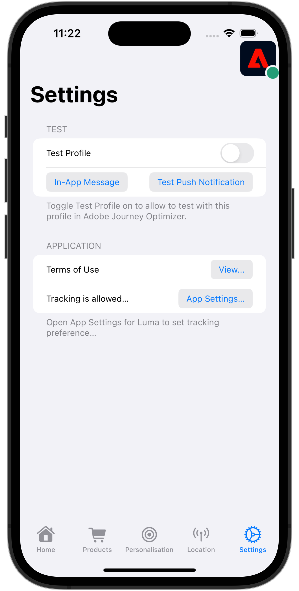

# WebViews verarbeiten

Erfahren Sie, wie Sie die Datenerfassung mit WebViews in einer mobilen App durchführen.

## Voraussetzungen

* App erfolgreich erstellt und ausgeführt, wobei SDKs installiert und konfiguriert sind.

## Lernziele

In dieser Lektion werden Sie:

* Erfahren Sie, warum Sie bei WebViews in Ihrer App besondere Überlegungen anstellen müssen.
* Machen Sie sich mit dem Code vertraut, der zur Vermeidung von Tracking-Problemen erforderlich ist.

## Potenzielle Tracking-Probleme

Wenn Sie Daten aus dem nativen Teil der App und einer WebView senden, generiert jede einzelne eine eigene Experience Cloud-ID (ECID), was zu getrennten Treffern und zu überhöhten Besuchs-/Besucherdaten führt. Weitere Informationen über die ECID finden Sie im [ECID-Übersicht](https://experienceleague.adobe.com/docs/experience-platform/identity/ecid.html?lang=en).

Um diese unerwünschte Situation zu beheben, ist es wichtig, die ECID des Benutzers aus dem nativen Teil Ihrer App an eine WebView zu übergeben, die Sie möglicherweise in Ihrer App verwenden möchten.

Die JavaScript-Erweiterung &quot;Experience Cloud ID-Dienst&quot;in WebView extrahiert die ECID aus der URL, anstatt eine Anfrage an Adobe für eine neue ID zu senden. Der ID-Dienst verwendet diese ECID zur Besucherverfolgung.

## Implementierung

Suchen Sie in der Beispielanwendung &quot;Luma&quot;die **[!UICONTROL termsOfServiceSheet]** -Datei (in der **[!UICONTROL Info]** ) und suchen Sie den folgenden Code im `SwiftUIWebViewModel` -Klasse:

```swift {highlight="6-22"}
    func loadUrl() {
        let url = Bundle.main.url(forResource: "tou", withExtension: "html")
        if var urlString = url?.absoluteString {
            // Adobe Experience Platform - Handle Web View
            AEPEdgeIdentity.Identity.getUrlVariables {(urlVariables, error) in
                if let error = error {
                    print("Error with Webview", error)
                    return;
                }
                
                if let urlVariables: String = urlVariables {
                    urlString.append("?" + urlVariables)
                    guard let url = URL(string: urlString) else {
                        return
                    }
                    DispatchQueue.main.async {
                        self.webView.load(URLRequest(url: url))
                    }
                }
                Logger.aepMobileSDK.info("Successfully retrieved urlVariables for WebView, final URL: \(urlString)")
            }
        }
    }
```

Der wichtigste Teil dieses Codes ist die `AEPEdgeIdentity.Identity.getUrlVariables` schließen (hervorgehoben). Durch den Abschluss werden die Variablen für die URL so eingerichtet, dass sie alle relevanten Informationen wie ECID usw. enthalten. Im Beispiel verwenden Sie eine lokale Datei, die gleichen Konzepte gelten jedoch für Remote-Seiten.

Weitere Informationen zum `Identity.getUrlVariables` API im [Referenzhandbuch zur Identity für die Edge Network Extension-API](https://developer.adobe.com/client-sdks/documentation/identity-for-edge-network/api-reference/#geturlvariables).

## Validierung

So führen Sie den Code aus:

1. Navigieren Sie zu **[!UICONTROL Einstellungen]** in der App
1. Tippen Sie auf **[!UICONTROL Anzeigen...]** -Schaltfläche zum Anzeigen **[!UICONTROL Nutzungsbedingungen]**.

    

1. Suchen Sie in der Assurance-Benutzeroberfläche nach der **[!UICONTROL URL-Variablen für Edge-Identitätsantwort]** -Ereignis aus **[!UICONTROL com.adobe.griffon.mobile]** -Anbieter.
1. Wählen Sie das Ereignis aus und überprüfen Sie die **[!UICONTROL urlvariable]** im Feld **[!UICONTROL ACPExtensionEventData]** -Objekt, das bestätigt, dass die folgenden Parameter in der URL vorhanden sind: `adobe_mc`, `mcmid`, und `mcorgid`.

   

   Beispiel `urvariables` -Feld sehen Sie unten:

   * Original (mit Escapezeichen)

     ```html
     adobe_mc=TS%3D1636526122%7CMCMID%3D79076670946787530005526183384271520749%7CMCORGID%3D7ABB3E6A5A7491460A495D61%40AdobeOrg
     ```

   * Beautified

     ```html
     adobe_mc=TS=1636526122|MCMID=79076670946787530005526183384271520749|MCORGID=7ABB3E6A5A7491460A495D61@AdobeOrg
     ```

>[!NOTE]
>
>Die Besucherzuordnung über diese URL-Parameter wird im Platform Web SDK (Versionen 2.11.0 oder höher) und bei der Verwendung von unterstützt `VisitorAPI.js`.


>[!SUCCESS]
>
>Sie haben Ihre App jetzt so eingerichtet, dass Inhalte basierend auf einer URL in einer Webansicht angezeigt werden, wobei dieselbe ECID verwendet wird wie die bereits vom Adobe Experience Platform Mobile SDK ausgegebene ECID.<br/>Vielen Dank, dass Sie Ihre Zeit investiert haben, um mehr über das Adobe Experience Platform Mobile SDK zu erfahren. Wenn Sie Fragen haben, ein allgemeines Feedback oder Vorschläge zu künftigen Inhalten teilen möchten, teilen Sie diese hier mit. [Experience League Community-Diskussionsbeitrag](https://experienceleaguecommunities.adobe.com/t5/adobe-experience-platform-launch/tutorial-discussion-implement-adobe-experience-cloud-in-mobile/td-p/443796)

Weiter: **[Identität](identity.md)**
