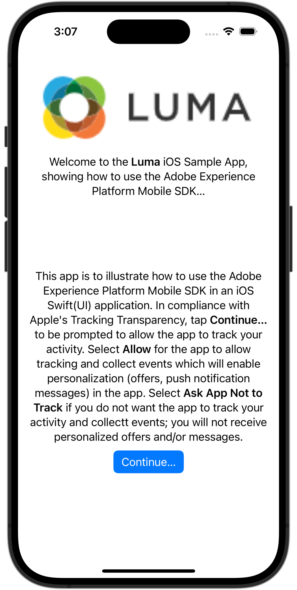

# Einrichten von Assurance

Erfahren Sie, wie Sie Adobe Experience Platform Assurance in einer Mobile App einrichten.

Assurance, offiziell Project Griffon, soll Ihnen dabei helfen, die Datenerfassung und die Bereitstellung von Erlebnissen in Ihrer Mobile App zu untersuchen, zu testen, zu simulieren und zu validieren.

Mit Assurance können Sie unformatierte SDK-Ereignisse untersuchen, die von Adobe Experience Platform Mobile SDK generiert wurden. Alle von der SDK erfassten Ereignisse stehen zur Einsicht bereit. SDK-Ereignisse werden in einer Listenansicht geladen, sortiert nach Zeit. Jedes Ereignis verfügt über eine Detailansicht, die weitere Details enthält. Zusätzliche Ansichten zum Durchsuchen der SDK-Konfiguration, Datenelemente, freigegebenen Status und SDK-Erweiterungsversionen sind ebenfalls verfügbar. Weitere Informationen zur [Assurance](https://experienceleague.adobe.com/docs/experience-platform/assurance/home.html?lang=de) finden Sie in der Produktdokumentation.


## Voraussetzungen

* Die App erfolgreich eingerichtet, wobei SDKs installiert und konfiguriert sind.

## Lernziele

In dieser Lektion erfahren Sie Folgendes:

* Vergewissern Sie sich, dass Ihre Organisation Zugriff hat (und fordern Sie ihn an, falls nicht).
* Einrichten der Basis-URL.
* Fügen Sie den erforderlichen iOS-spezifischen Code hinzu.
* Verbindung zu einer Sitzung herstellen.

## Zugriff bestätigen

Vergewissern Sie sich, dass Ihr Unternehmen Zugriff auf Assurance hat. Sie als Benutzer sollten dem Profil für Adobe Experience Platform hinzugefügt werden. Weitere Informationen [ Sie im ](https://experienceleague.adobe.com/docs/experience-platform/assurance/user-access.html?lang=de) „Benutzerzugriff“ im Assurance-Handbuch.

## Implementierung

Zusätzlich zur allgemeinen Installation von [SDK](install-sdks.md), die Sie in der vorherigen Lektion abgeschlossen haben, benötigt iOS auch die folgende Ergänzung, um die Assurance-Sitzung für Ihre App zu starten.

1. Navigieren Sie im Projekt-Navigator Ihres Xcode zu **[!DNL Luma]** > **[!DNL Luma]** **[!UICONTROL SceneDelegate]**.

1. Fügen Sie folgenden Code zu `func scene(_ scene: UIScene, openURLContexts URLContexts: Set<UIOpenURLContext>` hinzu:

   ```swift
   // Called when the app in background is opened with a deep link.
   if let deepLinkURL = URLContexts.first?.url {
       // Start the Assurance session
       Assurance.startSession(url: deepLinkURL)
   }
   ```

   Dieser Code startet eine Sicherheitssitzung, wenn die App im Hintergrund läuft und über einen Deep-Link geöffnet wird.

Weitere Informationen finden Sie [hier](https://developer.adobe.com/client-sdks/documentation/platform-assurance-sdk/api-reference/){target="_blank"}.


## Bundle-Kennung definieren

Sie müssen eine eindeutige Bundle-Kennung für Ihre App angeben.

1. Öffnen Sie das Projekt in Xcode.
1. Wählen Sie **[!DNL Luma]** im Projekt-Navigator aus.
1. Wählen Sie die **[!DNL Luma]** aus.
1. Wählen Sie die Registerkarte **Signierung und Funktionen** aus.
1. Definieren Sie eine **[!UICONTROL Bundle-ID]**.

   >[!IMPORTANT]
   >
   >Stellen Sie sicher _dass Sie eine_ eindeutige“ Bundle-Kennung verwenden und die `com.adobe.luma.tutorial.swiftui` Bundle-Kennung ersetzen, da jede Bundle-Kennung eindeutig sein muss. Normalerweise verwenden Sie ein Reverse-DNS-Format für Paket-ID-Zeichenfolgen wie `com.organization.brand.uniqueidentifier`. Die fertige Version dieses Tutorials verwendet beispielsweise `com.adobe.luma.tutorial.swiftui`.


   {zoomable="yes"}


## Einrichten einer Basis-URL

1. Gehen Sie zu Ihrem Projekt in Xcode.
1. Wählen Sie **[!DNL Luma]** im Projekt-Navigator aus.
1. Wählen Sie die **[!DNL Luma]** aus.
1. Wählen Sie die Registerkarte **Info** aus.
1. Um eine Basis-URL hinzuzufügen, scrollen Sie nach unten zu **URL-Typen** und wählen Sie die Schaltfläche **+** aus.
1. Legen Sie **Kennung** auf die Bundle-Kennung Ihrer Wahl fest und legen Sie **URL-Schemata** Ihrer Wahl fest.

   

   >[!IMPORTANT]
   >
   >Stellen Sie sicher _dass Sie eine_ eindeutige“ Bundle-Kennung verwenden und die `com.adobe.luma.tutorial.swiftui` Bundle-Kennung ersetzen, da jede Bundle-Kennung eindeutig sein muss. Normalerweise verwenden Sie ein Reverse-DNS-Format für Paket-ID-Zeichenfolgen wie `com.organization.brand.uniqueidentifier`. Sie können dieselbe Bundle-ID verwenden, die Sie unter „Bundle-[ definieren“ ](#define-bundle-identifier) haben.<br/>Verwenden Sie auf ähnliche Weise ein eindeutiges URL-Schema und ersetzen Sie die bereits bereitgestellte `lumatutorialswiftui` durch Ihr eindeutiges URL-Schema.

Weitere Informationen zu URL-Schemata in iOS finden Sie in der Dokumentation zu [Apple](https://developer.apple.com/documentation/xcode/defining-a-custom-url-scheme-for-your-app){target="_blank"}.

Assurance öffnet eine URL entweder über einen Browser oder über einen QR-Code. Diese URL beginnt mit der Basis-URL, die die App öffnet und zusätzliche Parameter enthält. Diese eindeutigen Parameter werden verwendet, um die Sitzung zu verbinden.


## Herstellen einer Verbindung zu einer Sitzung

In Xcode:

1. Erstellen Sie die App im Simulator oder auf einem physischen Gerät mit Xcode und verwenden Sie .

   >[!TIP]
   >
   >Optional können Sie Ihren Build „bereinigen“, insbesondere wenn unerwartete Ergebnisse auftreten. Wählen Sie dazu **[!UICONTROL Build-Ordner bereinigen…]** aus dem Menü Xcode **[!UICONTROL Produkt]**.


1. Wählen **[!UICONTROL im Dialogfeld „Zulassen, dass „Luma-App“ Ihren Standort verwendet]** die Option **[!UICONTROL Zulassen, während Sie die App verwenden]** aus.

   

1. Wählen Sie im Dialogfeld &quot;**[!UICONTROL -App Luma möchte Ihnen Benachrichtigungen senden]** die Option **[!UICONTROL Zulassen]** aus.

   

1. Wählen Sie **[!UICONTROL Weiter…]** aus, damit die App Ihre Aktivität verfolgen kann.

   

1. Wählen **[!UICONTROL im Dialogfeld „Luma-App zulassen“, um Ihre Aktivität über die Apps und Websites anderer Unternehmen hinweg]** verfolgen, **[!UICONTROL Zulassen]**.

   


In Ihrem Browser:

1. Navigieren Sie zur Datenerfassungs-Benutzeroberfläche.
1. Wählen Sie in der **Leiste** Assurance aus.
1. Wählen Sie **[!UICONTROL Sitzung erstellen]** aus.
1. Wählen Sie **[!UICONTROL Starten]** aus.
1. Geben Sie einen **[!UICONTROL Sitzungsnamen“]**. B. `Luma Mobile App Session` und die **[!UICONTROL Basis-URL]** an. Dies sind die URL-Schemata, die Sie in Xcode eingegeben haben, gefolgt von `://` Beispiel: `lumatutorialswiftui://`
1. Klicken Sie auf **[!UICONTROL Weiter]**.
   
1. Im modalen **[!UICONTROL „Neue Sitzung erstellen]**:

   Wenn Sie ein physisches Gerät verwenden:

   * Wählen Sie **[!UICONTROL QR-Code scannen]** aus. Um die App zu öffnen, scannen Sie den QR-Code mit der Kamera auf Ihrem physischen Gerät und tippen Sie auf den Link.

     

   Wenn Sie einen Simulator verwenden:

   1. Wählen Sie **[!UICONTROL Link kopieren]** aus.
   1. Kopieren Sie den Deep-Link mit  und verwenden Sie den Deep-Link, um die App mit Safari im Simulator zu öffnen.

      

1. Beim Laden der App wird ein modales Dialogfeld angezeigt, in dem Sie aufgefordert werden, die in Schritt 7 angezeigte PIN einzugeben.

   

   Geben Sie die PIN ein und wählen Sie **[!UICONTROL Verbinden]**.


1. Wenn die Verbindung erfolgreich hergestellt wurde, sehen Sie Folgendes:
   * Ein Assurance-Symbol, das über Ihrer App schwebt.

     

   * Experience Cloud-Updates, die über die Assurance-Benutzeroberfläche eingehen, mit folgendem Inhalt:

      1. Erlebnisereignisse aus der App.
      1. Details eines ausgewählten Ereignisses.
      1. Das Gerät und die Zeitleiste.

         

Wenn Sie auf Probleme stoßen, lesen Sie die [technische](https://developer.adobe.com/client-sdks/documentation/platform-assurance-sdk/){target="_blank"} und [allgemeine Dokumentation](https://experienceleague.adobe.com/docs/experience-platform/assurance/home.html?lang=de){target="_blank"}.


## Erweiterungen überprüfen

So überprüfen Sie, ob Ihre App die aktuellsten Erweiterungen verwendet:

1. Wählen Sie **[!UICONTROL Konfigurieren]** aus.

1. Wählen Sie  für  **[!UICONTROL Erweiterungsversionen]** aus.

1. Wählen Sie **[!UICONTROL Speichern]** aus.

   

1. Wählen Sie  **[!UICONTROL Erweiterungsversionen]** aus, um einen Überblick über die neuesten verfügbaren Erweiterungen und die in Ihrer Version der App verwendeten Erweiterungen zu erhalten.

   

1. Um Ihre Erweiterungsversionen (z. B. **[!UICONTROL Messaging]** und **[!UICONTROL Optimize]**) zu aktualisieren, wählen Sie das Paket (die Erweiterung) unter **[!UICONTROL Paketabhängigkeiten]** (z. B. **[!UICONTROL AEPMMessaging]**) und wählen Sie im Kontextmenü **[!UICONTROL Paket aktualisieren]**. Xcode aktualisiert die Paketabhängigkeiten.


>[!NOTE]
>
>Nachdem Sie Ihre Erweiterungen (Pakete) in Xcode aktualisiert haben, schließen und löschen Sie Ihre aktuelle Sitzung, und wiederholen Sie alle Schritte von [Verbindung zu einer Sitzung herstellen](#connecting-to-a-session) und [Erweiterungen überprüfen](#verify-extensions), um sicherzustellen, dass Assurance die richtigen Erweiterungen in einer neuen Assurance-Sitzung ordnungsgemäß meldet.


>[!SUCCESS]
>
>Sie haben jetzt Ihre App so eingerichtet, dass sie für den Rest des Tutorials Assurance verwendet.
>
>Vielen Dank, dass Sie sich Zeit genommen haben, um mehr über Adobe Experience Platform Mobile SDK zu erfahren. Wenn Sie Fragen haben, allgemeines Feedback geben möchten oder Vorschläge für zukünftige Inhalte haben, teilen Sie diese auf diesem [Experience League Community-Diskussionsbeitrag](https://experienceleaguecommunities.adobe.com/t5/adobe-experience-platform-data/tutorial-discussion-implement-adobe-experience-cloud-in-mobile/td-p/443796?profile.language=de)


Weiter: **[Implementieren des Einverständnisses](consent.md)**
