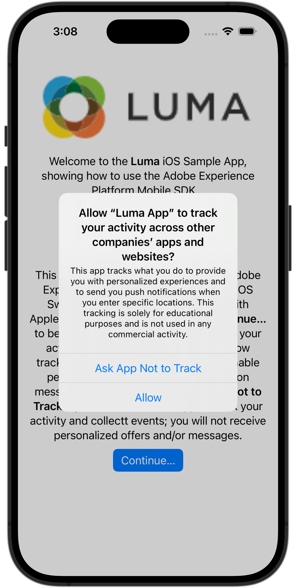
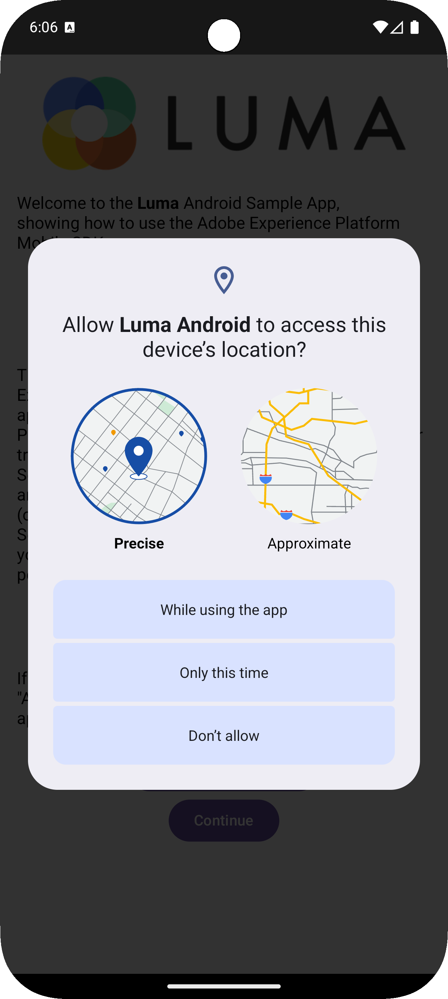
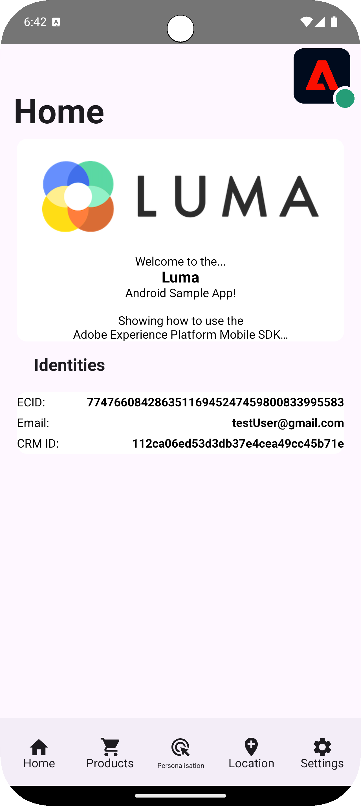

# Einrichten von Assurance

Erfahren Sie, wie Sie Adobe Experience Platform Assurance in einer Mobile App einrichten.

Assurance, offiziell Project Griffon, soll Ihnen dabei helfen, die Datenerfassung und die Bereitstellung von Erlebnissen in Ihrer Mobile App zu untersuchen, zu testen, zu simulieren und zu validieren.

Mit Assurance können Sie unformatierte SDK-Ereignisse untersuchen, die von Adobe Experience Platform Mobile SDK generiert wurden. Alle von der SDK erfassten Ereignisse stehen zur Einsicht bereit. SDK-Ereignisse werden in einer Listenansicht geladen, sortiert nach Zeit. Jedes Ereignis verfügt über eine Detailansicht, die weitere Details enthält. Zusätzliche Ansichten zum Durchsuchen der SDK-Konfiguration, Datenelemente, freigegebenen Status und SDK-Erweiterungsversionen sind ebenfalls verfügbar. Weitere Informationen zur [Assurance](https://experienceleague.adobe.com/de/docs/experience-platform/assurance/home) finden Sie in der Produktdokumentation.


## Voraussetzungen

* Die App erfolgreich eingerichtet, wobei SDKs installiert und konfiguriert sind.

## Lernziele

In dieser Lektion erfahren Sie Folgendes:

* Vergewissern Sie sich, dass Ihre Organisation Zugriff hat (und fordern Sie ihn an, falls nicht).
* Einrichten der Basis-URL.
* Fügen Sie den erforderlichen iOS-spezifischen Code hinzu.
* Verbindung zu einer Sitzung herstellen.

## Zugriff bestätigen

Vergewissern Sie sich, dass Ihr Unternehmen Zugriff auf Assurance hat. Als Benutzer sollten Sie zum Profil für Adobe Experience Platform hinzugefügt werden. Weitere Informationen [ Sie im ](https://experienceleague.adobe.com/en/docs/experience-platform/assurance/user-access) „Benutzerzugriff“ im Assurance-Handbuch.

## Implementierung

So implementieren Sie Assurance in Ihrer App:

>[!BEGINTABS]

>[!TAB iOS]

Zusätzlich zur allgemeinen Installation von [SDK ](install-sdks.md) iOS auch den folgenden zusätzlichen Code, um die Assurance-Sitzung für Ihre App zu starten.

1. Navigieren Sie im Projekt-Navigator Ihres Xcode zu **[!DNL Luma]** > **[!DNL Luma]** **[!UICONTROL SceneDelegate]**.

1. Fügen Sie folgenden Code zu `func scene(_ scene: UIScene, openURLContexts URLContexts: Set<UIOpenURLContext>` hinzu:

   ```swift
   // Called when the app in background is opened with a deep link.
   if let deepLinkURL = URLContexts.first?.url {
       // Start the Assurance session
       Assurance.startSession(url: deepLinkURL)
   }
   ```

   Dieser Code startet eine Sicherheitssitzung, wenn die App im Hintergrund läuft und über einen Deep-Link geöffnet wird.

>[!TAB Android]

Zusätzlich zur allgemeinen Installation von [SDK ](install-sdks.md) Android auch den folgenden zusätzlichen Code, um die Assurance-Sitzung für Ihre App zu starten.

1. Navigieren Sie in Android Studio in der Ansicht **[!UICONTROL Android]** zu **[!UICONTROL app]** > **[!UICONTROL kotlin+java]** > **[!UICONTROL com.adobe.luma.tutorial.android]** > **[!UICONTROL LumaApplication]**.

1. Fügen Sie folgenden Code zu `fun handleDeeplink(deeplink: String?)` hinzu:

   ```kotlin
   // Called when the app in background is opened with a deep link.
   if (deeplink.isNullOrEmpty()) {
      Log.w("Luma", "Deeplink is null or empty")
      return
   }
   
   Log.i("Luma", "Handling deeplink: $deeplink")
   Assurance.startSession(deeplink)
   ```

   Dieser Code startet eine Sicherheitssitzung, wenn die App im Hintergrund läuft und über einen Deep-Link geöffnet wird.

>[!ENDTABS]


Weitere Informationen finden Sie unter [Assurance](https://developer.adobe.com/client-sdks/documentation/platform-assurance-sdk/api-reference/){target="_blank"}API-Referenz.


## Definieren einer Bundle-Kennung

Sie müssen eine eindeutige Bundle-Kennung für Ihre App angeben.

>[!BEGINTABS]

>[!TAB iOS]

1. Öffnen Sie das Projekt in Xcode.
1. Wählen Sie **[!DNL Luma]** im Projekt-Navigator aus.
1. Wählen Sie die **[!DNL Luma]** aus.
1. Wählen Sie die Registerkarte **Signierung und Funktionen** aus.
1. Definieren Sie eine **[!UICONTROL Bundle-ID]**.

Stellen Sie sicher _dass Sie eine_ eindeutige“ Bundle-Kennung verwenden und die `com.adobe.luma.tutorial.swiftui` Bundle-Kennung ersetzen, da jede Bundle-Kennung eindeutig sein muss. Normalerweise verwenden Sie ein Reverse-DNS-Format für Paket-ID-Zeichenfolgen wie `com.organization.brand.uniqueidentifier`. Die fertige Version dieses Tutorials verwendet beispielsweise `com.adobe.luma.tutorial.swiftui`.

{zoomable="yes"}{zoomable="yes"}

>[!TAB Android]

1. Öffnen Sie das Projekt in Android Studio.
1. Wählen Sie **[!UICONTROL build.gradle.kts (Modul :app)]** im Navigator aus.
1. Stellen Sie sicher _dass Sie eine_ Bundle-Kennung verwenden und den `com.adobe.luma.tutorial.android` Wert für `namespace` in `android` ersetzen
1. Stellen Sie sicher, dass Sie dieselbe _eindeutige_ Bundle-Kennung verwenden und die `com.adobe.luma.tutorial.android` für `applicationId` in `defaultConfig` in `android` ersetzen

Normalerweise verwenden Sie ein Reverse-DNS-Format für Paket-ID-Zeichenfolgen wie `com.organization.brand.uniqueidentifier`. Die fertige Version dieses Tutorials verwendet beispielsweise `com.adobe.luma.tutorial.android`.

{zoomable="yes"}{zoomable="yes"}

>[!ENDTABS]


## Einrichten einer Basis-URL

Sie müssen eine Basis-URL einrichten, um sicherzustellen, dass Deep-Linking funktioniert.

>[!BEGINTABS]

>[!TAB iOS]

1. Gehen Sie zu Ihrem Projekt in Xcode.
1. Wählen Sie **[!DNL Luma]** im Projekt-Navigator aus.
1. Wählen Sie die **[!DNL Luma]** aus.
1. Wählen Sie die Registerkarte **Info** aus.
1. Um eine Basis-URL hinzuzufügen, scrollen Sie nach unten zu **URL-Typen** und wählen Sie die Schaltfläche **+** aus.
1. Legen Sie **Kennung** auf die Bundle-Kennung Ihrer Wahl fest und legen Sie eine **URL-Schemata** Ihrer Wahl fest.

   {zoomable="yes"}

Stellen Sie sicher _dass Sie eine_ eindeutige“ Bundle-Kennung verwenden und die `com.adobe.luma.tutorial.swiftui` Bundle-Kennung ersetzen, da jede Bundle-Kennung eindeutig sein muss. Normalerweise verwenden Sie ein Reverse-DNS-Format für Paket-ID-Zeichenfolgen wie `com.organization.brand.uniqueidentifier`. Sie können dieselbe Bundle-ID verwenden, die Sie unter „Bundle-[ definieren“ ](#define-bundle-identifier) haben.<br/>Verwenden Sie auf ähnliche Weise ein eindeutiges URL-Schema und ersetzen Sie die bereits bereitgestellte `lumatutorialswiftui` durch Ihr eindeutiges URL-Schema.

Weitere Informationen zu URL-Schemata in iOS finden Sie in der Dokumentation zu [Apple](https://developer.apple.com/documentation/xcode/defining-a-custom-url-scheme-for-your-app){target="_blank"}.

Assurance öffnet eine URL entweder über einen Browser oder einen QR-Code. Diese URL beginnt mit der Basis-URL, die die App öffnet und zusätzliche Parameter enthält. Diese eindeutigen Parameter werden verwendet, um die Sitzung zu verbinden. In der Beispiel-App wird der Deep-Link `lumatutorialswiftui://`.

>[!TAB Android]

1. Navigieren Sie zur Ansicht **[!UICONTROL Android]** Ihres Projekts in Android Studio.
1. Wählen Sie **[!UICONTROL app]** > **[!UICONTROL manifests]** > **[!UICONTROL AndroidManifest.xml]** im Navigator aus.
1. Stellen Sie sicher **[!UICONTROL dass]** XML-Element **[!UICONTROL manifest]** > **[!UICONTROL aktivität]** wie folgt aussieht:

   ```xml
   <activity
      android:name=".MainActivity"
      android:exported="true"
      android:theme="@style/Theme.LumaAndroid">
      <intent-filter>
            <action android:name="android.intent.action.MAIN" />
            <category android:name="android.intent.category.LAUNCHER" />
      </intent-filter>
      <intent-filter
            android:label="@string/app_name">
            <action android:name="android.intent.action.VIEW" />
            <category android:name="android.intent.category.DEFAULT" />
            <category android:name="android.intent.category.BROWSABLE" />
            <data android:scheme="lumatutorialandroid"
               android:host="default" />
      </intent-filter>
   </activity>
   ```

Stellen Sie sicher, dass Sie eine `android:scheme` angeben (z. B. `lumatutorialandroid`) und `android:host` (zum Beispiel `default`), um die Basis-URL zu definieren.

Weitere Informationen zu Deep-Links in Android finden Sie unter [Erstellen von Deep-Links zu App-Inhalten](https://developer.apple.com/documentation/xcode/defining-a-custom-url-scheme-for-your-app){target="_blank"}.

Assurance öffnet eine URL entweder über einen Browser oder einen QR-Code. Diese URL beginnt mit der Basis-URL, die die App öffnet und zusätzliche Parameter enthält. Diese eindeutigen Parameter werden verwendet, um die Sitzung zu verbinden.  In der Beispiel-App wird der Deep-Link `lumatutorialandroid://default`.

>[!ENDTABS]


## Herstellen einer Verbindung zu einer Sitzung

Sie können jetzt Assurance verwenden, um eine Verbindung zu einer Sitzung herzustellen.

>[!BEGINTABS]

>[!TAB iOS]

In Xcode:

1. Erstellen Sie die App im Simulator oder auf einem physischen Gerät mit Xcode und verwenden Sie .

   Optional können Sie Ihren Build *bereinigen* insbesondere dann, wenn unerwartete Ergebnisse auftreten. Wählen **[!UICONTROL Build-Ordner bereinigen…]** aus dem Menü **[!UICONTROL Produkt]** von Xcode aus.


1. Wählen **[!UICONTROL im Dialogfeld „Zulassen, dass „Luma-App“ Ihren Standort verwendet]** die Option **[!UICONTROL Zulassen, während Sie die App verwenden]** aus.

   

1. Wählen Sie im Dialogfeld &quot;**[!UICONTROL -App Luma möchte Ihnen Benachrichtigungen senden]** die Option **[!UICONTROL Zulassen]** aus.

   

1. Wählen Sie **[!UICONTROL Weiter…]** aus, damit die App Ihre Aktivität verfolgen kann.

   

1. Wählen **[!UICONTROL im Dialogfeld „Luma-App zulassen“, um Ihre Aktivität über die Apps und Websites anderer Unternehmen hinweg]** verfolgen, **[!UICONTROL Zulassen]**.

   

1. Wählen Sie **[!UICONTROL Weiter]** aus.


In Ihrem Browser:

1. Navigieren Sie zur Datenerfassungs-Benutzeroberfläche.
1. Wählen Sie in der **[!UICONTROL Leiste]** Assurance aus.
1. Wählen Sie **[!UICONTROL Neue Sitzung erstellen]** und dann die Option **[!UICONTROL Deep link connect]**.
1. Wählen Sie **[!UICONTROL Starten]** aus.
1. Geben Sie einen **[!UICONTROL Sitzungsnamen“]**. B. `Luma Mobile App Session` und die **[!UICONTROL Basis-URL]** an. Dies sind die URL-Schemata, die Sie in Xcode eingegeben haben, gefolgt von `://` Beispiel: `lumatutorialswiftui://`
1. Klicken Sie auf **[!UICONTROL Weiter]**.
   {zoomable="yes"}
1. Im modalen **[!UICONTROL „Neue Sitzung erstellen]**:

   Wenn Sie ein physisches Gerät verwenden:

   * Wählen Sie **[!UICONTROL QR-Code scannen]** aus. Um die App zu öffnen, scannen Sie den QR-Code mit der Kamera auf Ihrem physischen Gerät und tippen Sie auf den Link.

     {zoomable="yes"}

   Wenn Sie einen Simulator verwenden:

   1. Wählen Sie **[!UICONTROL Link kopieren]** aus.
   1. Kopieren Sie den Deep-Link mit  und verwenden Sie den Deep-Link, um die App mit Safari im Simulator zu öffnen.
      {zoomable="yes"}

1. Beim Laden der App wird ein modales Dialogfeld angezeigt, in dem Sie aufgefordert werden, die in Schritt 7 angezeigte PIN einzugeben.

   

   Geben Sie die PIN ein und wählen Sie **[!UICONTROL Verbinden]**.


1. Wenn die Verbindung erfolgreich hergestellt wurde, sehen Sie Folgendes:
   * Ein Assurance-Symbol, das über Ihrer App schwebt.

     

   * Experience Cloud-Aktualisierungen, die in der Benutzeroberfläche von Assurance eintreffen und Folgendes anzeigen:

      1. Erlebnisereignisse aus der App.
      1. Details eines ausgewählten Ereignisses.
      1. Das Gerät und die Zeitleiste.

         {zoomable="yes"}

1. Wählen Sie **[!UICONTROL Weiter]**, um zum Startbildschirm zu gelangen.

>[!TAB Android]

In Android Studio:

1. Erstellen oder erstellen Sie die App neu und führen Sie sie im Simulator oder auf einem physischen Gerät aus Android Studio mithilfe von  aus.

   Optional können Sie Ihren Build *bereinigen* insbesondere dann, wenn unerwartete Ergebnisse auftreten. Wählen **[!UICONTROL Projekt bereinigen]** aus dem Menü **[!UICONTROL Erstellen]** von Android Studio aus.


1. Wählen Sie im Dialogfeld **[!UICONTROL Zulassen, dass Luma Android Ihnen Benachrichtigungen sendet]** die Option **[!UICONTROL Zulassen]**.

   

1. Wählen **[!UICONTROL Berechtigungsdialog anzeigen]** aus.

   

1. In der **[!UICONTROL Luma Android Zugriff auf den Speicherort dieses Geräts gewähren?]**…

   

   * Wählen Sie **[!UICONTROL Präzise]**.
   * Wählen Sie **[!UICONTROL Bei Verwendung der App]** aus.

1. Wählen Sie im Begrüßungsbildschirm der App **[!UICONTROL Geräteeinstellungen öffnen]** aus.

1. Wählen Sie im **[!UICONTROL Standortberechtigung]** die Option **[!UICONTROL Immer zulassen]** aus. Wählen Sie dann **[!UICONTROL ←]** aus, um zum Einführungsbildschirm der App zurückzukehren.

   

1. Wählen Sie **[!UICONTROL Weiter]**, um zum Startbildschirm zu gelangen.


In Ihrem Browser:

1. Navigieren Sie zur Datenerfassungs-Benutzeroberfläche.
1. Wählen Sie in der **[!UICONTROL Leiste]** Assurance aus.
1. Wählen Sie **[!UICONTROL Neue Sitzung erstellen]** und dann die Option **[!UICONTROL Deep link connect]**.
1. Wählen Sie **[!UICONTROL Starten]** aus.
1. Geben Sie einen **[!UICONTROL Sitzungsnamen]** z. B. `Luma Mobile App Session` und die **[!UICONTROL Basis-URL]** an. Dies ist die `android:scheme` und `android:host`, die Sie in **[!UICONTROL AndroidManifest.xml]** in Android Studio definiert haben, getrennt durch `://` Beispiel: `lumatutorialandroid://default`
1. Klicken Sie auf **[!UICONTROL Weiter]**.
   {zoomable="yes"}

1. Im modalen **[!UICONTROL „Neue Sitzung erstellen]**:

   Wenn Sie ein physisches Gerät verwenden:

   * Wählen Sie **[!UICONTROL QR-Code scannen]** aus. Um die App zu öffnen, scannen Sie den QR-Code mit der Kamera auf Ihrem physischen Gerät und tippen Sie auf den Link.

     {zoomable="yes"}

   Wenn Sie einen Simulator verwenden:

   1. Wählen Sie **[!UICONTROL Link kopieren]** aus.
   1. Kopieren Sie den Deep-Link mit  und verwenden Sie den Deep-Link, um die App mit Chrome im Simulator zu öffnen.

   {zoomable="yes"}

   Wenn Sie in Chrome zum **Weiter zu Luma Android** aufgefordert werden, klicken Sie auf **Weiter**.

1. Beim Laden der App wird ein modales Dialogfeld angezeigt, in dem Sie aufgefordert werden, die in Schritt 7 angezeigte PIN einzugeben.

   

   Geben Sie die PIN ein und wählen Sie **[!UICONTROL Verbinden]**.


1. Wenn die Verbindung erfolgreich hergestellt wurde, sehen Sie Folgendes:
   * Ein Assurance-Symbol, das über Ihrer App schwebt.

     

   * Experience Cloud-Aktualisierungen, die in der Benutzeroberfläche von Assurance eintreffen und Folgendes anzeigen:

      1. Erlebnisereignisse aus der App.
      1. Details eines ausgewählten Ereignisses.
      1. Das Gerät und die Zeitleiste.

         {zoomable="yes"}

>[!ENDTABS]

Wenn Sie auf Probleme stoßen, lesen Sie die [technische](https://developer.adobe.com/client-sdks/documentation/platform-assurance-sdk/){target="_blank"} und [allgemeine Dokumentation](https://experienceleague.adobe.com/de/docs/experience-platform/assurance/home){target="_blank"}.


## Erweiterungen überprüfen

So überprüfen Sie, ob Ihre App die aktuellsten Erweiterungen verwendet:

1. Wählen Sie **[!UICONTROL Konfigurieren]** aus.

1. Wählen Sie  für  **[!UICONTROL Erweiterungsversionen]** aus.

1. Wählen Sie **[!UICONTROL Speichern]** aus.

   {zoomable="yes"}

1. Wählen Sie  **[!UICONTROL Erweiterungsversionen]** aus, um einen Überblick über die neuesten verfügbaren Erweiterungen und die in Ihrer Version der App verwendeten Erweiterungen zu erhalten.

>[!BEGINTABS]

>[!TAB iOS]

{zoomable="yes"}

Um Ihre Erweiterungsversionen (z. B. **[!UICONTROL Messaging]** und **[!UICONTROL Optimize]**) zu aktualisieren, wählen Sie das Paket (die Erweiterung) unter **[!UICONTROL Paketabhängigkeiten]** (z. B. **[!UICONTROL AEPMMessaging]**) und wählen Sie im Kontextmenü **[!UICONTROL Paket aktualisieren]**. Xcode aktualisiert die Paketabhängigkeiten.

>[!TAB Android]

{zoomable="yes"}

Wenn Sie veraltete Erweiterungen sehen, lesen Sie die [Dokumentation zu Android ](https://developer.android.com/build/agp-upgrade-assistant), wie Sie Ihre Abhängigkeitsmodule für Ihr Projekt aktualisieren können.


>[!ENDTABS]

>[!NOTE]
>
>Nachdem Sie Ihre Erweiterungen (Pakete) in Ihrer Entwicklungsumgebung aktualisiert haben, schließen und löschen Sie Ihre aktuelle Sitzung, wiederholen Sie alle Schritte unter [Verbindung mit einer Sitzung herstellen](#connecting-to-a-session) und [Erweiterungen überprüfen](#verify-extensions), um sicherzustellen, dass Assurance in einer neuen Assurance-Sitzung die richtigen Erweiterungen ordnungsgemäß meldet.
>


>[!SUCCESS]
>
>Sie haben jetzt Ihre App so eingerichtet, dass sie für den Rest des Tutorials Assurance verwendet.
>
>Vielen Dank, dass Sie sich Zeit genommen haben, um mehr über Adobe Experience Platform Mobile SDK zu erfahren. Wenn Sie Fragen haben, allgemeines Feedback geben möchten oder Vorschläge für zukünftige Inhalte haben, teilen Sie diese auf diesem [Experience League Community-Diskussionsbeitrag](https://experienceleaguecommunities.adobe.com/t5/adobe-experience-platform-data/tutorial-discussion-implement-adobe-experience-cloud-in-mobile/td-p/443796)


Weiter: **[Implementieren des Einverständnisses](consent.md)**
