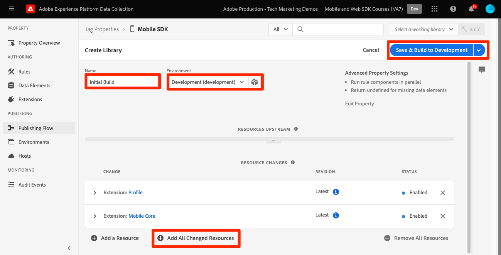

# Tag-Eigenschaft konfigurieren

Erfahren Sie, wie Sie eine Tag-Eigenschaft im [!UICONTROL Datenerfassung] -Schnittstelle.

Tags in Adobe Experience Platform sind die nächste Generation von Funktionen für das Tag-Management von Adobe. Tags bieten Kunden eine einfache Möglichkeit, alle Analyse-, Marketing- und Werbe-Tags bereitzustellen und zu verwalten, die für relevante Kundenerlebnisse notwendig sind. Weitere Informationen [tags](https://experienceleague.adobe.com/docs/experience-platform/tags/home.html?lang=de) in der Produktdokumentation.

## Voraussetzungen

Um die Lektion abzuschließen, müssen Sie über die Berechtigung zum Erstellen einer Tag-Eigenschaft verfügen. Es ist auch hilfreich, ein Grundverständnis mit Tags zu haben.

>[!NOTE]
>
> platform launch (Client-seitig) ist jetzt [tags](https://experienceleague.adobe.com/docs/experience-platform/tags/home.html?lang=de)

## Lernziele

In dieser Lektion werden Sie:

* Installieren und konfigurieren Sie die mobilen Tag-Erweiterungen.
* Erstellen Sie die SDK-Installationsanweisungen.

## Ersteinrichtung

1. Erstellen Sie eine neue mobile Tag-Eigenschaft:
   1. Im [Datenerfassungsoberfläche](https://experience.adobe.com/data-collection/){target=&quot;_blank&quot;}, wählen Sie **[!UICONTROL Tags]** in der linken Navigation
   1. Wählen Sie **[!UICONTROL Neue Eigenschaft]** aus

      .
   1. Für **[!UICONTROL Name]**, eingeben `Mobile SDK Course`.
   1. Für **[!UICONTROL Plattform]** auswählen **[!UICONTROL Mobile]**.
   1. Wählen Sie **[!UICONTROL Speichern]** aus.

      

      >[!NOTE]
      >
      > Die standardmäßigen Zustimmungseinstellungen für die Edge-basierten mobilen SDK-Implementierungen, wie z. B. die in diesem Tutorial ausgeführten, stammen aus dem [!UICONTROL Zustimmungserweiterung] und nicht [!UICONTROL Datenschutz] in der Konfiguration der Tag-Eigenschaft fest. Sie werden die Erweiterung &quot;Einverständnis&quot;später in dieser Lektion hinzufügen und konfigurieren. Weitere Informationen finden Sie unter [die Dokumentation](https://aep-sdks.gitbook.io/docs/resources/privacy-and-gdpr).

1. Öffnen Sie die neue Eigenschaft
1. eine Bibliothek erstellen:

   1. Navigieren Sie zu **[!UICONTROL Veröffentlichungsfluss]** in der linken Navigation.
   1. Auswählen **[!UICONTROL Bibliothek hinzufügen]**.

      

   1. Für **[!UICONTROL Name]**, eingeben `Initial Build`.
   1. Für **[!UICONTROL Umgebung]** auswählen **[!UICONTROL Entwicklung]**.
   1. Auswählen  **[!UICONTROL Alle geänderten Ressourcen hinzufügen]**.
   1. Auswählen **[!UICONTROL Speichern und in Entwicklung erstellen]**.

      

   1. Legen Sie es schließlich als **[!UICONTROL Arbeitsbibliothek]**.
      
1. Auswählen **[!UICONTROL Erweiterungen]**.

   Die Mobile Core- und Profil-Erweiterungen sollten vorinstalliert sein.

1. Auswählen **[!UICONTROL Katalog]**.

   

1. Verwenden Sie die [!UICONTROL Suche] , um die folgenden Erweiterungen zu finden und zu installieren. Keine dieser Erweiterungen erfordert eine Konfiguration:
   * Identität
   * AEP Assurance

## Erweiterungskonfiguration

1. Installieren Sie die **Einverständnis** -Erweiterung.

   Wählen Sie für die Zwecke dieses Tutorials **[!UICONTROL Ausstehend]**. Weitere Informationen zur Erweiterung &quot;Einverständnis&quot;finden Sie unter [die Dokumentation](https://aep-sdks.gitbook.io/docs/foundation-extensions/consent-for-edge-network).

   

1. Installieren Sie die **Adobe Experience Platform Edge Network** -Erweiterung.

   Im **[!UICONTROL Edge-Konfiguration]** Dropdown-Liste aus, wählen Sie den Datastream aus, den Sie im [vorheriger Schritt](create-datastream.md).

1. Auswählen **[!UICONTROL In Bibliothek speichern und erstellen]**.

   

## SDK-Installationsanweisungen generieren

1. Auswählen **[!UICONTROL Umgebungen]**.

1. Wählen Sie die **[!UICONTROL Entwicklung]** Installationssymbol.

   

1. Auswählen **[!UICONTROL iOS]**.

1. Auswählen **[!UICONTROL Swift]**.

   

1. Die Installationsanweisungen bieten einen guten Ausgangspunkt für die Implementierung.

   Weitere Informationen finden Sie unter [here](https://aep-sdks.gitbook.io/docs/getting-started/get-the-sdk).

   * **[!UICONTROL Umgebungsdatei-ID]**: Diese eindeutige ID verweist auf Ihre Entwicklungsumgebung. Beachten Sie diesen Wert. Produktions-/Staging-/Entwicklungswerte weisen alle unterschiedliche ID-Werte auf.
   * **[!UICONTROL Podfile]**: CocoaPods werden zur Verwaltung von SDK-Versionen und -Downloads verwendet. Weitere Informationen finden Sie unter [Dokumentation](https://cocoapods.org/).
   * **[!UICONTROL Initialisierungscode]**: Dieser Codeblock zeigt, wie Sie die erforderlichen SDKs importieren und die Erweiterungen beim Start registrieren.

>[!NOTE]
>Die Installationsanweisungen sollten als Ausgangspunkt und nicht als endgültige Dokumentation betrachtet werden. Die neuesten SDK-Versionen und Codebeispiele finden Sie in der offiziellen [Dokumentation](https://aep-sdks.gitbook.io/docs/).

## Architektur von mobilen Tags

Wenn Sie mit der Webversion von Tags (früher Launch) vertraut sind, müssen Sie die Unterschiede auf Mobilgeräten kennen.

Im Web wird eine Tag-Eigenschaft in JavaScript gerendert, das dann (normalerweise) in der Cloud gehostet wird. Diese JS-Datei wird direkt auf der Website referenziert.

In einer mobilen Tag-Eigenschaft werden Regeln und Konfigurationen in JSON-Dateien gerendert, die in der Cloud gehostet werden. Die JSON-Dateien werden von der Mobile Core-Erweiterung in der Mobile App heruntergeladen und gelesen. Erweiterungen sind separate SDKs, die zusammenarbeiten. Wenn Sie Ihrer Tag-Eigenschaft eine Erweiterung hinzufügen, müssen Sie auch die App aktualisieren. Wenn Sie eine Erweiterungseinstellung ändern oder eine Regel erstellen, werden diese Änderungen in der App übernommen, sobald Sie die aktualisierte Tag-Bibliothek veröffentlichen.

Weiter: **[SDKs installieren](install-sdks.md)**

>[!NOTE]
>
>Vielen Dank, dass Sie Ihre Zeit investiert haben, um mehr über das Adobe Experience Platform Mobile SDK zu erfahren. Wenn Sie Fragen haben, ein allgemeines Feedback teilen möchten oder Vorschläge zu künftigen Inhalten haben, teilen Sie diese bitte mit. [Diskussionsbeitrag der Experience League](https://experienceleaguecommunities.adobe.com/t5/adobe-experience-platform-launch/tutorial-discussion-implement-adobe-experience-cloud-in-mobile/td-p/443796)