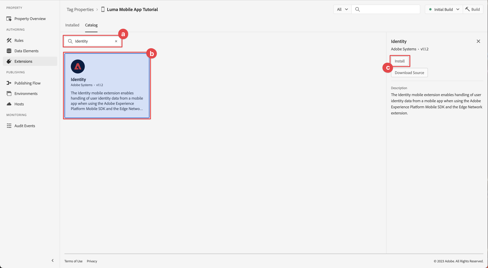

# Konfigurieren einer Tag-Eigenschaft

Erfahren Sie, wie Sie über die Schnittstelle für die [!UICONTROL Datenerfassung] eine Tag-Eigenschaft konfigurieren.

Tags in Adobe Experience Platform sind die nächste Generation von Funktionen für das Tag-Management von Adobe. Mit Tags können Kunden Analyse-, Marketing- und Werbe-Tags bereitstellen und verwalten, die zur Unterstützung entsprechender Kundenerlebnisse erforderlich sind. Weitere Informationen zu [Tags](https://experienceleague.adobe.com/docs/experience-platform/tags/home.html?lang=de) finden Sie in der Produktdokumentation.

## Voraussetzungen

Um die Lektion abzuschließen, müssen Sie über die Berechtigung zum Erstellen einer Tag-Eigenschaft verfügen. Es ist auch hilfreich, ein Grundverständnis mit Tags zu haben.

>[!NOTE]
>
> Platform launch (Client-seitig) ist jetzt [Tags](https://experienceleague.adobe.com/docs/experience-platform/tags/home.html?lang=de)

## Lernziele

In dieser Lektion werden Sie:

* Installieren und konfigurieren Sie die mobilen Tag-Erweiterungen.
* Erstellen Sie die SDK-Installationsanweisungen.

## Ersteinrichtung

1. Erstellen Sie in der Datenerfassungsoberfläche eine neue mobile Tag-Eigenschaft:
   1. Wählen Sie im linken Navigationsbereich **[!UICONTROL Tags]** aus.
   1. Wählen Sie **[!UICONTROL Neue Eigenschaft]**
      .
   1. Geben Sie für den **[!UICONTROL Namen]** `Luma Mobile App Tutorial` ein.
   1. Wählen Sie für **[!UICONTROL Plattform]** die Option **[!UICONTROL Mobil]** aus.
   1. Wählen Sie **[!UICONTROL Speichern]** aus.

      

      >[!NOTE]
      >
      > Die standardmäßigen Zustimmungseinstellungen für die standardmäßigen SDK-Implementierungen auf Mobilgeräten, wie sie in dieser Lektion vorgenommen werden, stammen aus der Erweiterung [!UICONTROL Einverständnis] und nicht aus der Einstellung [!UICONTROL Datenschutz] in der Konfiguration der Tag-Eigenschaft. Sie können die Erweiterung &quot;Einverständnis&quot;später in dieser Lektion hinzufügen und konfigurieren. Weitere Informationen finden Sie in der [Dokumentation](https://developer.adobe.com/client-sdks/edge/consent-for-edge-network/).

1. Öffnen Sie die neue Eigenschaft.
1. Erstellen einer Bibliothek:

   1. Wechseln Sie im linken Navigationsbereich zu &quot;**[!UICONTROL Veröffentlichungsfluss]**&quot;.
   1. Wählen Sie **[!UICONTROL Bibliothek hinzufügen]** aus.

      

   1. Geben Sie für den **[!UICONTROL Namen]** `Initial Build` ein.
   1. Wählen Sie für die **[!UICONTROL Umgebung]** **[!UICONTROL Entwicklung (Entwicklung)]** aus.
   1. Wählen Sie  **[!UICONTROL Alle geänderten Ressourcen hinzufügen]**.
   1. Wählen Sie **[!UICONTROL Speichern und in Entwicklung erstellen]**.

      

   1. Wählen Sie abschließend **[!UICONTROL Ursprünglicher Build]** als Arbeitsbibliothek aus dem Menü **[!UICONTROL Arbeitsbibliothek auswählen]** aus.
      
1. Überprüfen von Erweiterungen:

   1. Stellen Sie sicher, dass **[!UICONTROL Ursprünglicher Build]** als Standardbibliothek ausgewählt ist.

   1. Wählen Sie in der linken Leiste **[!UICONTROL Erweiterungen]** aus.

   1. Wählen Sie die Registerkarte **[!UICONTROL Installiert]** aus.

      Die Erweiterungen [!UICONTROL Mobile Core] und [!UICONTROL Profil] sollten vorinstalliert sein.

      

## Erweiterungskonfiguration

1. Stellen Sie sicher, dass Sie sich in der Eigenschaft für Ihre mobile App in **[!UICONTROL Erweiterungen]** befinden.

1. Wählen Sie **[!UICONTROL Katalog]** aus.

   

1. Verwenden Sie das Feld  **[!UICONTROL Suche]** , um die Erweiterung **Identität** zu suchen.

   1. Suchen Sie nach `Identity`.

   2. Wählen Sie die Erweiterung **[!UICONTROL Identität]** aus.

   3. Wählen Sie **[!UICONTROL Installieren]** aus.

      

   Diese Erweiterung erfordert keine weitere Konfiguration.

1. Verwenden Sie das Feld  **[!UICONTROL Suche]** , um die Erweiterung **AEP Assurance** zu suchen und zu installieren.

   Diese Erweiterung erfordert keine weitere Konfiguration.

1. Verwenden Sie das Feld  **[!UICONTROL Suche]** , um die Erweiterung **Einverständnis** zu suchen und zu installieren. Im Konfigurationsbildschirm:

   1. Wählen Sie **[!UICONTROL Ausstehend]** aus. In diesem Tutorial verwalten Sie das Einverständnis weiter in der Anwendung. Weitere Informationen zur Erweiterung &quot;Einverständnis&quot;finden Sie in der [Dokumentation](https://developer.adobe.com/client-sdks/documentation/consent-for-edge-network/).
   1. Wählen Sie **[!UICONTROL In Bibliothek speichern]** aus.

      

1. Verwenden Sie das Feld  **[!UICONTROL Suchen]** , um die Erweiterung **Adobe Experience Platform Edge Network** zu suchen und zu installieren.

   1. Wählen Sie in **[!UICONTROL Datastreams]** den **[!UICONTROL Datastream]** aus, den Sie im vorherigen Schritt [5} für jede Umgebung erstellt haben, z. B. **[!DNL Luma Mobile App]**.](create-datastream.md)

   1. Geben Sie die Domäne **[!UICONTROL Edge Network]** in der Domäne **[!UICONTROL Domain Configuration]** an, sofern sie noch nicht gefüllt ist. Die Edge Network-Domäne ist der Name Ihres Unternehmens, gefolgt von `data.adobedc.net`, z. B. `techmarketingdemos.data.adobedc.net`.

   1. Wählen Sie im Menü **[!UICONTROL In Bibliothek speichern]** die Option **[!UICONTROL In Bibliothek speichern und erstellen]**.

      

Ihre Bibliothek ist für die neuen Erweiterungen und Konfigurationen erstellt. Ein erfolgreicher Build wird durch eine  in der Schaltfläche **[!UICONTROL Ursprünglicher Build]** gekennzeichnet.

## SDK-Installationsanweisungen generieren

1. Wählen Sie in der linken Leiste **[!UICONTROL Umgebungen]** aus.

1. Wählen Sie das Installationssymbol **[!UICONTROL Entwicklung]**  aus.

   

1. Wählen Sie im Dialogfeld **[!UICONTROL Mobile-Installationsanweisungen]** die Registerkarte **[!UICONTROL iOS]** aus.

1. Sie können die Anweisungen zum Einrichten Ihres Projekts mithilfe von CocoaPods kopieren, um  . CocoaPods werden zur Verwaltung von SDK-Versionen und -Downloads verwendet. Weitere Informationen finden Sie in der [Dokumentation zu CocoaPods](https://cocoapods.org/) . Wenn Sie Android™ als Entwicklungsplattform verwenden, ist Gradle das Tool zum Verwalten von SDK-Versionen, Downloads und Abhängigkeiten. Weitere Informationen finden Sie in der [Gradle-Dokumentation](https://gradle.org/) .

   Die Installationsanweisungen bieten einen guten Ausgangspunkt für die Implementierung. Weitere Informationen finden Sie [hier](https://developer.adobe.com/client-sdks/documentation/getting-started/get-the-sdk/).

   >[!INFO]
   >
   >Für den Rest dieses Tutorials verwenden Sie **nicht** die CocoaPods-Anweisungen, sondern verwenden stattdessen ein natives Swift Package Manager (SPM)-basiertes Setup.
   >

1. Wählen Sie die Registerkarte **[!UICONTROL Swift]** unter **[!UICONTROL Initialisierungscode hinzufügen]** aus. Dieser Codeblock zeigt, wie Sie die erforderlichen SDKs importieren und die Erweiterungen beim Start registrieren. Weitere Informationen dazu finden Sie unter [SDK installieren](install-sdks.md) .

1. Kopieren Sie  die Kennung der Umgebungsdatei **[!UICONTROL 3} und speichern Sie sie an einem Ort, an dem sie später benötigt wird.]** Diese eindeutige ID verweist auf Ihre Entwicklungsumgebung. Jede Umgebung (Produktion, Staging, Entwicklung) verfügt über einen eigenen eindeutigen ID-Wert.

   

>[!NOTE]
>
>Die Installationsanweisungen sollten als Ausgangspunkt und nicht als endgültige Dokumentation betrachtet werden. Die neuesten SDK-Versionen und Codebeispiele finden Sie in der offiziellen [Dokumentation](https://developer.adobe.com/client-sdks/home/).

## Architektur von mobilen Tags

Wenn Sie mit der Webversion von Tags (früher Launch) vertraut sind, müssen Sie die Unterschiede auf Mobilgeräten kennen.

* Im Web wird eine Tag-Eigenschaft in JavaScript gerendert, die dann (normalerweise) in der Cloud gehostet wird. Diese JavaScript-Datei wird direkt auf der Website referenziert.

* In einer mobilen Tag-Eigenschaft werden Regeln und Konfigurationen in JSON-Dateien gerendert, die in der Cloud gehostet werden. Die JSON-Dateien werden von der Mobile Core-Erweiterung in der Mobile App heruntergeladen und gelesen. Erweiterungen sind separate SDKs, die zusammenarbeiten. Wenn Sie Ihrer Tag-Eigenschaft eine Erweiterung hinzufügen, müssen Sie auch die App aktualisieren. Wenn Sie eine Erweiterungseinstellung ändern oder eine Regel erstellen, werden diese Änderungen in der App übernommen, sobald Sie die aktualisierte Tag-Bibliothek veröffentlichen. Dank dieser Flexibilität können Sie Einstellungen ändern (z. B. die ID der Adobe Analytics-Report Suite) oder sogar das Verhalten Ihrer App ändern (mithilfe von Datenelementen und Regeln, wie Sie in späteren Lektionen sehen werden), ohne den Code in Ihrer App ändern und den Appstore erneut senden zu müssen.

>[!SUCCESS]
>
>Sie verfügen jetzt über eine mobile Tag-Eigenschaft, die im Rest dieses Tutorials verwendet werden kann.
>
>Vielen Dank, dass Sie Ihre Zeit investiert haben, um mehr über das Adobe Experience Platform Mobile SDK zu erfahren. Wenn Sie Fragen haben, allgemeine Rückmeldungen oder Anregungen zu künftigen Inhalten teilen möchten, teilen Sie diese auf diesem [Experience League Community-Diskussionbeitrag](https://experienceleaguecommunities.adobe.com/t5/adobe-experience-platform-data/tutorial-discussion-implement-adobe-experience-cloud-in-mobile/td-p/443796) mit.

Weiter: **[SDK installieren](install-sdks.md)**
